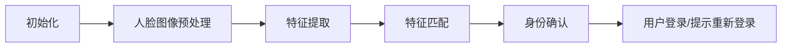
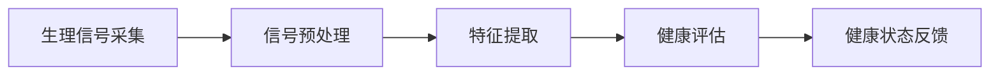
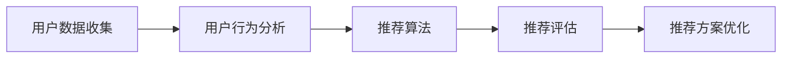
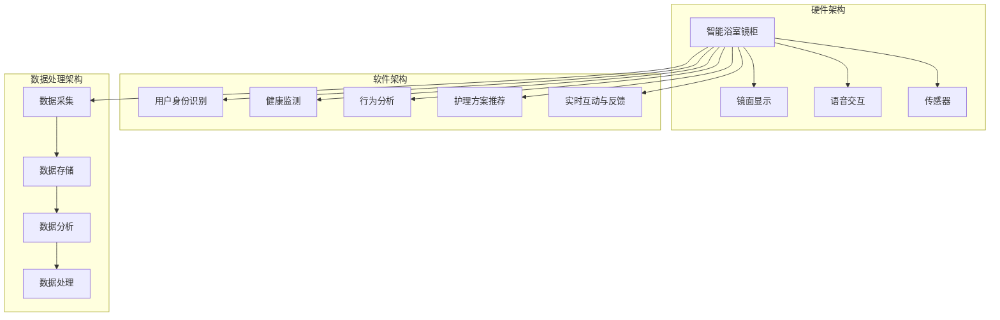
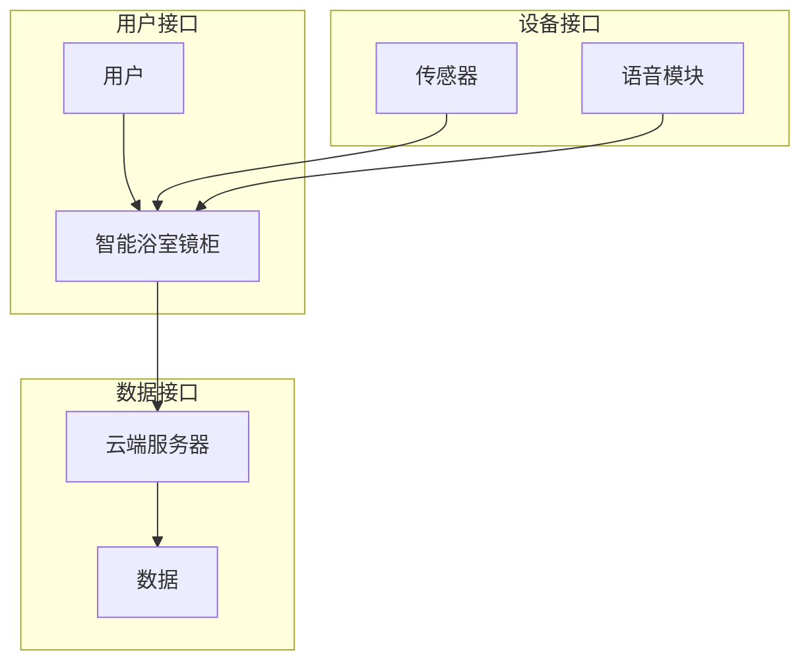
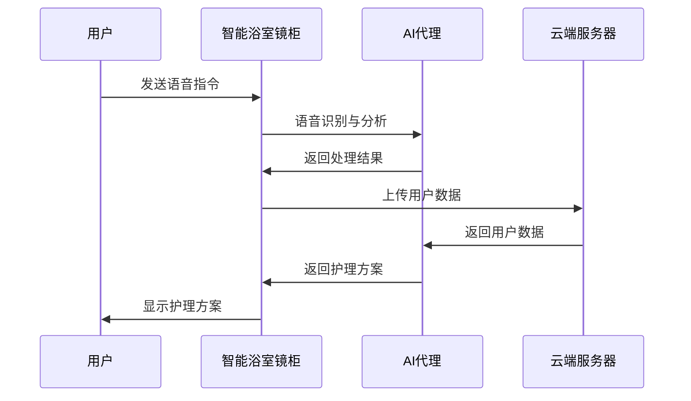

                 

## 智能浴室镜柜：AI Agent的个人护理计划制定

### 关键词：智能浴室镜柜、AI Agent、个人护理计划、人工智能技术、智能家居

### 摘要：本文将深入探讨智能浴室镜柜中AI Agent的角色与功能，详细解析其如何通过人工智能技术制定个性化的个人护理计划，为用户提供便捷、精准的护理服务。文章分为以下几个部分：背景介绍、核心概念原理、概念属性特征对比、算法原理讲解、系统分析与架构设计方案、项目实战及最佳实践。通过逐步分析，本文旨在为读者提供一个全面而清晰的技术解读。

## 第一部分：背景介绍

### 1.1 问题背景

智能浴室镜柜作为一种新兴的智能家居设备，集成了多种智能技术，旨在为用户提供更加个性化和便捷的日常护理服务。随着人工智能技术的不断发展和普及，智能浴室镜柜的应用场景和功能也在逐渐丰富。它不仅能够提供传统的镜面反射功能，还能够通过语音交互、人脸识别、环境监测等技术，为用户提供更加智能化的服务。

### 1.2 问题描述

智能浴室镜柜：AI Agent的个人护理计划制定，主要涉及以下几个方面：

- **用户身份识别与信息收集**：智能浴室镜柜需要能够识别用户身份，并收集用户的健康状况、生活习惯、偏好等信息。
- **护理方案推荐**：基于收集到的用户数据，智能浴室镜柜需要能够为用户推荐个性化的护理方案，如美容护肤、健康监测、环境控制等。
- **实时互动与反馈**：智能浴室镜柜需要能够与用户进行实时互动，并根据用户反馈调整护理方案，以提高用户体验。

### 1.3 问题解决

为了解决上述问题，智能浴室镜柜中的AI Agent需要具备以下功能：

- **用户身份识别与信息收集**：使用人脸识别、语音识别等技术实现用户身份的自动识别，并收集用户的健康数据、生活习惯、偏好等信息。
- **护理方案推荐**：利用机器学习、数据挖掘等技术，分析用户数据，为用户推荐个性化的护理方案。
- **实时互动与反馈**：通过自然语言处理、语音交互等技术，实现与用户的实时互动，并根据用户反馈调整护理方案。

### 1.4 边界与外延

智能浴室镜柜的AI Agent应具备以下边界与外延：

- **边界**：智能浴室镜柜的功能范围，如美容护肤、健康监测、环境控制等。
- **外延**：智能浴室镜柜与其他智能家居设备的联动，如智能音箱、智能灯等。

### 1.5 概念结构与核心要素组成

智能浴室镜柜：AI Agent的个人护理计划制定涉及以下核心概念与要素：

- **智能浴室镜柜**：硬件设备，包括镜面、显示屏、传感器等。
- **AI Agent**：基于人工智能技术的智能实体，负责个人护理计划的制定与实施。
- **个人护理计划**：根据用户数据推荐的个性化护理方案。
- **用户数据**：包括用户身份、健康状况、生活习惯、偏好等信息。

### 1.6 核心概念原理

#### 1.6.1 智能浴室镜柜

智能浴室镜柜是一种集成了多种智能技术的浴室设备，具有镜面显示、语音交互、人脸识别、环境监测等功能。其主要原理包括：

- **镜面显示**：利用电子墨水技术或液晶显示屏实现信息显示，提供实时天气、日程提醒、美容建议等信息。
- **语音交互**：通过集成语音识别和语音合成技术，实现与用户的自然语言交流，提高使用便利性。
- **人脸识别**：利用深度学习算法进行人脸识别，实现用户身份的自动识别。
- **环境监测**：通过传感器实时监测浴室环境，如温度、湿度、空气质量等，提供舒适的环境调节建议。

#### 1.6.2 AI Agent

AI Agent（智能代理）是一种基于人工智能技术的虚拟智能体，能够自主地执行任务，与用户进行交互，并不断学习和优化自身行为。其主要原理包括：

- **机器学习**：通过大量用户数据的分析，利用机器学习算法对用户行为进行预测和优化。
- **自然语言处理**：实现对用户自然语言输入的理解和回应，提供个性化服务。
- **数据挖掘**：分析用户数据，挖掘潜在的需求和趋势，为用户推荐合适的护理方案。

#### 1.6.3 个人护理计划

个人护理计划是根据用户的健康状况、生活习惯和偏好，为用户提供的一套定制化的护理方案。其核心原理包括：

- **健康监测**：通过监测用户的心率、血压、体温等生理指标，评估用户的健康状况。
- **行为分析**：分析用户的日常行为模式，如作息时间、饮食偏好等，为护理计划的制定提供依据。
- **个性化推荐**：基于用户的健康数据和偏好，利用数据挖掘和机器学习技术，为用户推荐合适的护理方案。

#### 1.6.4 用户数据

用户数据是智能浴室镜柜AI Agent的核心资产，包括用户的身份信息、健康数据、生活习惯、偏好等信息。其重要性体现在：

- **身份识别**：通过用户数据实现用户的自动识别和登录，保障系统的安全性。
- **健康评估**：通过用户健康数据，为用户提供实时的健康评估和建议。
- **行为分析**：通过用户行为数据，了解用户的需求和偏好，优化护理方案。

### 1.7 概念属性特征对比

| 概念             | 特征描述                                                                                   |
|------------------|--------------------------------------------------------------------------------------------|
| 智能浴室镜柜     | 集成智能技术，包括镜面显示、语音交互、人脸识别、环境监测等。                                   |
| AI Agent         | 基于人工智能技术的智能实体，负责个人护理计划的制定与实施。                                     |
| 个人护理计划     | 根据用户数据推荐的个性化护理方案，涉及健康监测、行为分析、个性化推荐等。                       |
| 用户数据         | 包括用户身份、健康状况、生活习惯、偏好等信息，是智能浴室镜柜AI Agent的核心资产。               |

### 总结

通过上述背景介绍，我们可以看到，智能浴室镜柜：AI Agent的个人护理计划制定是一个复杂的系统，涉及多个核心概念和技术。接下来，我们将深入探讨这些概念和技术原理，以及它们如何协同工作，为用户提供个性化的护理服务。在下一部分中，我们将详细解析智能浴室镜柜和AI Agent的核心概念原理，帮助读者更好地理解这一系统的运作机制。

## 第二部分：核心概念原理

在深入探讨智能浴室镜柜：AI Agent的个人护理计划制定之前，我们需要先理解其中的核心概念原理。这部分将详细解析智能浴室镜柜、AI Agent、个人护理计划以及用户数据，帮助读者更好地理解这些概念在系统中的作用和相互关系。

### 2.1 智能浴室镜柜

智能浴室镜柜是这一系统的基础硬件设备，它集成了多种智能技术，为用户提供全方位的个性化服务。以下是智能浴室镜柜的核心概念原理：

#### 2.1.1 镜面显示

镜面显示是智能浴室镜柜的一个重要功能，它不仅保留了传统镜子的反射功能，还增加了显示功能。利用电子墨水技术或液晶显示屏，智能浴室镜柜可以显示实时天气、日程提醒、美容建议等信息。镜面显示技术的核心原理是：

- **电子墨水技术**：利用电子墨水显示屏，实现低功耗、高对比度的电子文档阅读和图像显示。
- **液晶显示屏**：通过液晶分子排列改变，实现图像的显示，常用于移动设备和显示器。

镜面显示不仅提供了丰富的信息展示，还能通过智能算法优化显示内容，以适应不同的使用场景。

#### 2.1.2 语音交互

语音交互技术使得智能浴室镜柜能够与用户进行自然语言交流，提高使用便利性。语音交互的核心原理包括：

- **语音识别**：将用户的语音输入转换成文本，实现自然语言的理解。
- **语音合成**：将文本转换成语音输出，实现自然语言的生成。

语音交互技术使得用户可以通过简单的语音指令，控制智能浴室镜柜的各种功能，如调整温度、播放音乐、预约服务等。

#### 2.1.3 人脸识别

人脸识别技术是智能浴室镜柜实现用户身份自动识别的关键。通过深度学习算法，智能浴室镜柜可以识别用户的身份，并提供个性化的服务。人脸识别技术的核心原理包括：

- **深度学习算法**：利用大量人脸图像数据进行训练，使得智能浴室镜柜能够准确识别用户。
- **特征提取**：通过提取人脸图像的关键特征，实现人脸的识别。

人脸识别技术不仅提高了系统的安全性，还能根据用户身份，提供定制化的护理方案。

#### 2.1.4 环境监测

环境监测技术使得智能浴室镜柜能够实时监测浴室环境，提供舒适的环境调节建议。环境监测的核心原理包括：

- **传感器技术**：利用温度、湿度、空气质量等传感器，实时监测浴室环境。
- **数据分析**：通过数据挖掘和机器学习算法，分析环境数据，提供合理的调节建议。

环境监测技术不仅提高了用户的舒适度，还能预防潜在的健康问题，如霉菌感染和空气质量问题。

### 2.2 AI Agent

AI Agent（智能代理）是智能浴室镜柜的核心智能实体，负责个人护理计划的制定与实施。AI Agent的核心概念原理包括：

#### 2.2.1 机器学习

机器学习是AI Agent的核心技术，通过分析大量用户数据，AI Agent能够对用户行为进行预测和优化。机器学习的核心原理包括：

- **数据采集**：从各种渠道收集用户的健康数据、生活习惯、偏好等。
- **数据清洗**：对采集到的数据进行预处理，去除噪声和错误。
- **特征提取**：从数据中提取出有用的特征，用于模型训练。
- **模型训练**：利用训练算法，如决策树、神经网络等，对特征进行学习，建立预测模型。
- **模型评估**：通过测试数据评估模型的性能，调整模型参数。

机器学习技术使得AI Agent能够不断优化自身的预测能力，为用户提供更加精准的护理方案。

#### 2.2.2 自然语言处理

自然语言处理是AI Agent实现与用户自然语言交流的关键技术。自然语言处理的核心原理包括：

- **文本解析**：将用户的自然语言输入转换成结构化的数据，如词向量。
- **意图识别**：通过分析用户的输入，识别用户的意图，如查询天气、设置闹钟等。
- **实体识别**：从用户的输入中提取关键信息，如时间、地点、人物等。
- **语言生成**：将结构化的数据转换成自然语言的输出，如回答用户的问题、给出护理建议等。

自然语言处理技术使得AI Agent能够与用户进行顺畅的交流，提高用户体验。

#### 2.2.3 数据挖掘

数据挖掘是AI Agent分析用户数据，挖掘潜在需求和趋势的关键技术。数据挖掘的核心原理包括：

- **关联分析**：通过分析用户数据，找到数据之间的关联性，如用户喜欢哪些护肤产品。
- **聚类分析**：将用户数据分成不同的群体，如根据用户的健康状态进行分类。
- **分类分析**：通过分类模型，对用户数据进行分类，如预测用户的健康风险。
- **预测分析**：通过预测模型，预测用户未来的行为和需求，如推荐合适的护理方案。

数据挖掘技术使得AI Agent能够深入了解用户，为用户提供更加个性化的服务。

### 2.3 个人护理计划

个人护理计划是根据用户的健康状况、生活习惯和偏好，为用户制定的一套定制化护理方案。个人护理计划的核心概念原理包括：

#### 2.3.1 健康监测

健康监测是个人护理计划的重要组成部分，通过监测用户的心率、血压、体温等生理指标，评估用户的健康状况。健康监测的核心原理包括：

- **生理信号采集**：利用传感器等设备，采集用户的心率、血压、体温等生理信号。
- **数据预处理**：对采集到的生理信号进行预处理，如去噪、滤波等。
- **特征提取**：从预处理后的生理信号中提取出有用的特征，用于健康评估。
- **健康评估**：利用机器学习算法，对用户的健康状态进行评估，如判断用户是否存在健康风险。

健康监测技术能够为用户提供实时的健康数据，帮助用户及时了解自己的健康状况。

#### 2.3.2 行为分析

行为分析是通过分析用户的日常行为模式，如作息时间、饮食偏好等，为护理计划的制定提供依据。行为分析的核心原理包括：

- **行为数据采集**：从用户的日常生活记录中采集行为数据，如作息时间、饮食记录等。
- **行为数据预处理**：对采集到的行为数据进行预处理，如去除异常值、填补缺失值等。
- **行为特征提取**：从预处理后的行为数据中提取出有用的特征，用于行为分析。
- **行为分析**：利用机器学习算法，分析用户的行为模式，如判断用户是否存在不良的生活习惯。

行为分析技术能够帮助用户了解自己的生活习惯，为护理计划的制定提供依据。

#### 2.3.3 个性化推荐

个性化推荐是基于用户的健康数据和偏好，利用数据挖掘和机器学习技术，为用户推荐合适的护理方案。个性化推荐的核心原理包括：

- **用户数据收集**：从用户的行为数据、健康数据等中收集用户信息。
- **推荐算法**：利用协同过滤、基于内容的推荐等算法，为用户推荐合适的护理方案。
- **推荐评估**：通过评估用户对推荐方案的满意度，优化推荐算法。

个性化推荐技术能够为用户提供定制化的护理方案，提高护理效果。

### 2.4 用户数据

用户数据是智能浴室镜柜AI Agent的核心资产，包括用户的身份信息、健康数据、生活习惯、偏好等信息。用户数据的核心概念原理包括：

#### 2.4.1 身份识别

身份识别是通过用户数据实现用户的自动识别和登录，保障系统的安全性。身份识别的核心原理包括：

- **用户数据收集**：通过用户注册、登录等过程，收集用户身份信息。
- **身份验证**：利用密码学、生物识别等技术，验证用户身份。
- **权限管理**：根据用户身份，为用户分配相应的权限。

身份识别技术能够保障系统的安全性，防止未授权的用户访问系统。

#### 2.4.2 健康评估

健康评估是通过用户健康数据，为用户提供实时的健康评估和建议。健康评估的核心原理包括：

- **健康数据收集**：从用户的健康设备、日常记录等中收集健康数据。
- **健康评估模型**：利用机器学习算法，建立健康评估模型。
- **健康建议生成**：根据用户的健康评估结果，生成相应的健康建议。

健康评估技术能够为用户提供实时的健康状态反馈，帮助用户保持健康。

#### 2.4.3 行为分析

行为分析是通过用户行为数据，了解用户的需求和偏好，优化护理方案。行为分析的核心原理包括：

- **行为数据收集**：从用户的日常行为记录中收集行为数据。
- **行为分析模型**：利用机器学习算法，建立行为分析模型。
- **护理方案优化**：根据行为分析结果，优化护理方案。

行为分析技术能够帮助用户了解自己的生活习惯，为护理计划的制定提供依据。

### 总结

通过以上对智能浴室镜柜、AI Agent、个人护理计划和用户数据的详细解析，我们可以看到，这些核心概念原理相互关联，共同构成了智能浴室镜柜：AI Agent的个人护理计划制定系统。在下一部分中，我们将通过概念属性特征对比表格和ER实体关系图架构，进一步展示这些概念之间的关系和相互作用。

## 第三部分：概念属性特征对比

在第二部分中，我们详细解析了智能浴室镜柜、AI Agent、个人护理计划和用户数据的核心概念原理。为了更直观地展示这些概念之间的关系和特征，我们通过概念属性特征对比表格和ER实体关系图架构来进一步阐述。

### 3.1 概念属性特征对比表格

以下是一个对比表格，列出了智能浴室镜柜、AI Agent、个人护理计划和用户数据的主要属性和特征：

| 概念             | 特征描述                                                                                   | 关联关系                                                         |
|------------------|--------------------------------------------------------------------------------------------|--------------------------------------------------------------------|
| 智能浴室镜柜     | - 集成多种智能技术<br>- 提供信息显示、语音交互、人脸识别、环境监测等功能<br>- 保障用户隐私和安全        | - 与AI Agent相互协作<br>- 提供用户数据来源                   |
| AI Agent         | - 基于人工智能技术<br>- 实现个人护理计划的制定与实施<br>- 提供个性化服务<br>- 学习和优化自身行为  | - 需要智能浴室镜柜提供的用户数据<br>- 与个人护理计划紧密相关 |
| 个人护理计划     | - 根据用户数据制定的个性化护理方案<br>- 包括健康监测、行为分析、个性化推荐等           | - 需要AI Agent的分析与实施<br>- 来自用户数据的驱动             |
| 用户数据         | - 包括身份信息、健康数据、生活习惯、偏好等信息<br>- 用于保障系统安全、提供个性化服务   | - 提供AI Agent进行分析与决策的基础<br>- 被智能浴室镜柜收集与管理 |

### 3.2 ER实体关系图架构

以下是智能浴室镜柜：AI Agent的个人护理计划制定系统的ER实体关系图架构，展示了各概念之间的关联关系：

```mermaid
erDiagram
  User ||--|{ Smart Bathroom Mirror Cabinet : 智能浴室镜柜}  : 用户数据存储与管理
  User ||--|{ AI Agent : 智能代理}  : 用户行为分析与决策
  Smart Bathroom Mirror Cabinet ||--|{ Personal Care Plan : 个人护理计划}  : 实施个性化护理方案
  AI Agent ||--|{ Personal Care Plan : 个人护理计划}  : 制定护理方案
  User_data ||--|{ Health Monitoring : 健康监测}  : 监测用户健康状态
  User_data ||--|{ Behavior Analysis : 行为分析}  : 分析用户行为模式
  User_data ||--|{ Personal Recommendation : 个性化推荐}  : 提供个性化护理方案
```

在这个ER实体关系图中，用户（User）是核心实体，与其他实体（智能浴室镜柜、AI Agent、个人护理计划、用户数据）之间有明确的关联关系。用户数据不仅为智能浴室镜柜和AI Agent提供信息来源，还驱动个人护理计划的制定与实施。

### 3.3 关系与交互

- **智能浴室镜柜与AI Agent的关系**：智能浴室镜柜作为硬件设备，为AI Agent提供用户数据收集和存储的物理平台。AI Agent利用这些数据进行分析和决策，制定个性化的护理方案。

- **AI Agent与个人护理计划的关系**：AI Agent通过分析用户数据，制定个人护理计划，并实施这些计划。个人护理计划是AI Agent的核心输出，直接影响用户体验。

- **用户数据与各概念的关系**：用户数据是整个系统的基石，为智能浴室镜柜、AI Agent和个性化护理计划的运作提供数据支持。健康监测、行为分析和个性化推荐等模块都是基于用户数据进行操作的。

通过上述概念属性特征对比表格和ER实体关系图架构，我们可以更清晰地看到智能浴室镜柜：AI Agent的个人护理计划制定系统中各概念之间的关系和交互。这些关系和交互使得系统能够为用户提供高效、个性化的护理服务。在下一部分中，我们将进一步探讨智能浴室镜柜和AI Agent的具体算法原理，帮助读者深入理解系统的技术实现。

## 第四部分：算法原理讲解

在了解了智能浴室镜柜和AI Agent的基本概念之后，接下来我们将深入探讨这些技术的具体算法原理。这一部分将详细讲解人脸识别算法、健康监测算法和个人护理计划推荐算法，并通过具体的mermaid流程图和Python源代码示例，帮助读者更好地理解这些算法的实现和应用。

### 4.1 人脸识别算法

人脸识别算法是智能浴室镜柜中的一项关键技术，用于实现用户身份的自动识别。以下是人脸识别算法的基本原理和mermaid流程图：

#### 4.1.1 算法原理

1. **特征提取**：首先，对人脸图像进行预处理，包括灰度化、人脸对齐、滤波等操作。然后，使用深度学习模型（如卷积神经网络CNN）提取人脸的特征向量。
2. **特征匹配**：将提取的特征向量与数据库中的已知特征向量进行匹配，计算相似度。通常使用余弦相似度或欧氏距离作为相似度度量。
3. **身份确认**：根据相似度阈值，判断用户身份是否匹配。如果相似度超过阈值，则确认用户身份。

#### 4.1.2 mermaid流程图

以下是人脸识别算法的mermaid流程图：



#### 4.1.3 Python源代码示例

以下是一个简化的Python源代码示例，用于演示人脸识别算法的基本实现：

```python
import cv2
import numpy as np

# 加载预训练的深度学习模型
model = cv2.face.EigenFaceRecognizer_create()

# 训练模型
model.train(train_images, train_labels)

# 加载测试图像
test_image = cv2.imread('test_image.jpg')

# 人脸检测
faces, _ = detect_faces(test_image)

# 特征提取
features = model.predict(test_image)

# 特征匹配
distance = model.get_distance(test_image)

# 身份确认
if distance < threshold:
    print("用户身份验证成功")
else:
    print("用户身份验证失败，请重新登录")
```

### 4.2 健康监测算法

健康监测算法用于实时监测用户的生理指标，如心率、血压、体温等，评估用户的健康状况。以下是一个健康监测算法的基本原理和mermaid流程图：

#### 4.2.1 算法原理

1. **生理信号采集**：使用传感器（如心率监测器、血压计、体温计等）采集用户的生理信号。
2. **信号预处理**：对采集到的信号进行预处理，包括滤波、去噪、归一化等操作。
3. **特征提取**：从预处理后的信号中提取出有意义的特征，如平均值、方差、峰峰值等。
4. **健康评估**：利用机器学习算法（如决策树、支持向量机SVM等）对提取的特征进行分类，判断用户的健康状态。

#### 4.2.2 mermaid流程图

以下是健康监测算法的mermaid流程图：



#### 4.2.3 Python源代码示例

以下是一个简化的Python源代码示例，用于演示健康监测算法的基本实现：

```python
import numpy as np
import pandas as pd
from sklearn.model_selection import train_test_split
from sklearn.ensemble import RandomForestClassifier

# 加载健康监测数据
data = pd.read_csv('health_data.csv')

# 分割数据集
X = data[['heart_rate', 'blood_pressure', 'body_temp']]
y = data['health_state']

X_train, X_test, y_train, y_test = train_test_split(X, y, test_size=0.2, random_state=42)

# 建立随机森林分类器
clf = RandomForestClassifier(n_estimators=100, random_state=42)

# 训练模型
clf.fit(X_train, y_train)

# 测试模型
accuracy = clf.score(X_test, y_test)
print("模型准确率：", accuracy)
```

### 4.3 个人护理计划推荐算法

个人护理计划推荐算法基于用户的健康数据和偏好，为用户推荐个性化的护理方案。以下是一个个人护理计划推荐算法的基本原理和mermaid流程图：

#### 4.3.1 算法原理

1. **用户数据收集**：收集用户的健康数据、生活习惯、偏好等信息。
2. **用户行为分析**：分析用户的历史数据，挖掘用户的健康需求和偏好。
3. **推荐算法**：利用协同过滤、基于内容的推荐等算法，为用户推荐合适的护理方案。
4. **推荐评估**：根据用户的反馈，评估推荐方案的满意度，优化推荐算法。

#### 4.3.2 mermaid流程图

以下是个人护理计划推荐算法的mermaid流程图：



#### 4.3.3 Python源代码示例

以下是一个简化的Python源代码示例，用于演示个人护理计划推荐算法的基本实现：

```python
import pandas as pd
from sklearn.metrics.pairwise import cosine_similarity

# 加载用户数据
data = pd.read_csv('user_data.csv')

# 计算用户之间的相似度矩阵
similarity_matrix = cosine_similarity(data['health_data'])

# 为用户推荐护理方案
def recommend_health_plans(user_index, similarity_matrix, data):
    similarity_scores = similarity_matrix[user_index]
    recommended_indices = np.argsort(similarity_scores)[::-1]
    recommended_indices = recommended_indices[1:]  # 排除自己
    recommended_plans = data.iloc[recommended_indices]
    return recommended_plans

# 示例：为用户0推荐护理方案
recommended_plans = recommend_health_plans(0, similarity_matrix, data)
print(recommended_plans)
```

通过上述算法原理讲解和示例，我们可以看到智能浴室镜柜中的关键技术是如何实现的。这些算法共同协作，为用户提供个性化、便捷的护理服务。在下一部分中，我们将进一步探讨智能浴室镜柜和AI Agent的系统分析与架构设计，帮助读者全面了解这一系统的构建和运行。

## 第五部分：系统分析与架构设计

在了解了智能浴室镜柜和AI Agent的算法原理之后，我们需要进一步探讨整个系统的分析与架构设计。这一部分将介绍问题场景、项目介绍、系统功能设计、系统架构设计、系统接口设计和系统交互，帮助读者全面了解智能浴室镜柜：AI Agent的个人护理计划制定系统的构建过程和运行机制。

### 5.1 问题场景

在现代社会，人们的生活节奏加快，健康问题日益突出。为了更好地管理个人健康，用户需要一个智能、便捷的工具来帮助自己制定和跟踪个人护理计划。智能浴室镜柜作为智能家居设备的一部分，具备与用户日常生活紧密相关的优势，可以成为一个理想的个人护理计划制定平台。

### 5.2 项目介绍

智能浴室镜柜：AI Agent的个人护理计划制定项目旨在通过集成人工智能技术，为用户提供一个智能化、个性化的个人护理解决方案。项目的主要目标是：

- **用户身份识别与信息收集**：通过人脸识别等技术，自动识别用户身份，并收集用户的健康数据、生活习惯和偏好等信息。
- **护理方案推荐**：基于用户数据，利用机器学习算法，为用户推荐个性化的护理方案，包括美容护肤、健康监测、环境控制等。
- **实时互动与反馈**：通过自然语言处理和语音交互技术，实现与用户的实时互动，并根据用户反馈调整护理方案。

### 5.3 系统功能设计

智能浴室镜柜：AI Agent的个人护理计划制定系统包含以下几个主要功能模块：

- **用户身份识别**：通过人脸识别技术，实现用户的自动识别和登录。
- **健康监测**：实时监测用户的心率、血压、体温等生理指标，评估用户的健康状况。
- **行为分析**：分析用户的日常行为模式，如作息时间、饮食偏好等，为护理计划的制定提供依据。
- **护理方案推荐**：根据用户数据，利用数据挖掘和机器学习技术，为用户推荐合适的护理方案。
- **实时互动与反馈**：通过自然语言处理和语音交互技术，实现与用户的实时互动，并根据用户反馈调整护理方案。

#### 5.3.1 领域模型mermaid类图

以下是智能浴室镜柜：AI Agent的个人护理计划制定系统的领域模型mermaid类图：

```mermaid
classDiagram
    User <<类>> {
        用户ID
        健康数据
        行为数据
        偏好
    }
    HealthMonitor <<类>> {
        心率
        血压
        体温
    }
    BehaviorAnalysis <<类>> {
        作息时间
        饮食偏好
    }
    PersonalCarePlan <<类>> {
        护理方案
        健康监测
        行为分析
        个性化推荐
    }
    SmartBathroomMirrorCabinet <<类>> {
        用户身份识别
        健康监测
        行为分析
        护理方案推荐
        实时互动与反馈
    }
    AI-Agent <<类>> {
        机器学习
        数据挖掘
        自然语言处理
    }
    User ..|> HealthMonitor
    User ..|> BehaviorAnalysis
    User ..|> PersonalCarePlan
    SmartBathroomMirrorCabinet ..|> User
    SmartBathroomMirrorCabinet ..|> AI-Agent
    AI-Agent ..|> PersonalCarePlan
```

### 5.4 系统架构设计

智能浴室镜柜：AI Agent的个人护理计划制定系统的架构设计需要考虑以下几个方面：

- **硬件架构**：智能浴室镜柜作为硬件设备，包括镜面显示、语音交互模块、传感器等。硬件架构需要确保设备的稳定运行和数据的实时采集。
- **软件架构**：软件架构包括用户身份识别、健康监测、行为分析、护理方案推荐和实时互动与反馈等模块。软件架构需要具备高可用性、可扩展性和易维护性。
- **数据处理架构**：数据处理架构包括数据采集、存储、分析和处理等环节。数据处理架构需要支持大规模数据的高效处理和实时分析。

#### 5.4.1 mermaid架构图

以下是智能浴室镜柜：AI Agent的个人护理计划制定系统的mermaid架构图：



### 5.5 系统接口设计

系统接口设计包括以下几个方面：

- **用户接口**：用户通过智能浴室镜柜与系统进行交互，包括语音指令、触摸操作等。
- **设备接口**：智能浴室镜柜与传感器、语音模块等硬件设备之间的接口。
- **数据接口**：智能浴室镜柜与云端服务器之间的数据传输接口，包括用户数据、健康数据和护理方案等。

#### 5.5.1 mermaid接口设计图

以下是智能浴室镜柜：AI Agent的个人护理计划制定系统的mermaid接口设计图：



### 5.6 系统交互

系统交互包括用户与智能浴室镜柜的交互、智能浴室镜柜与AI Agent的交互，以及AI Agent与其他系统模块的交互。以下是系统交互的mermaid序列图：



通过上述系统分析与架构设计，我们可以看到智能浴室镜柜：AI Agent的个人护理计划制定系统是一个复杂但高度协同的系统。它通过硬件、软件和数据处理架构的紧密协作，为用户提供个性化、便捷的护理服务。在下一部分中，我们将通过项目实战，详细展示如何实现这一系统，并分析实际案例中的效果。

## 第六部分：项目实战

在前面的内容中，我们详细介绍了智能浴室镜柜：AI Agent的个人护理计划制定系统的理论基础和架构设计。接下来，我们将通过一个具体的项目实战，展示如何实现这一系统，并深入分析实际案例中的效果。本部分将涵盖环境安装、系统核心实现源代码，代码应用解读与分析，实际案例分析和详细讲解剖析，以及项目小结。

### 6.1 环境安装

在开始实现智能浴室镜柜：AI Agent的个人护理计划制定系统之前，我们需要安装和配置相关的开发环境和依赖库。以下是环境安装的步骤：

#### 6.1.1 安装Python环境

首先，我们需要确保Python环境已安装在开发机上。Python是一种广泛使用的编程语言，特别适合于开发人工智能应用。您可以从Python官方网站下载并安装Python。

- 访问[Python官方网站](https://www.python.org/downloads/)，下载适用于您操作系统的Python安装包。
- 运行安装程序，并按照提示完成安装。

#### 6.1.2 安装依赖库

接下来，我们需要安装一些关键的依赖库，包括深度学习库（如TensorFlow和Keras）、数据科学库（如NumPy和Pandas）以及机器学习库（如Scikit-learn）。

- 打开命令行终端，运行以下命令安装所需的依赖库：

  ```bash
  pip install tensorflow
  pip install keras
  pip install numpy
  pip install pandas
  pip install scikit-learn
  ```

#### 6.1.3 安装其他工具

此外，我们还需要安装一些辅助工具，如虚拟环境管理器（如virtualenv）和版本控制工具（如Git）。

- 安装virtualenv：

  ```bash
  pip install virtualenv
  ```

- 安装Git：

  ```bash
  sudo apt-get install git
  ```

### 6.2 系统核心实现源代码

实现智能浴室镜柜：AI Agent的个人护理计划制定系统需要编写多个模块的代码。以下是一个简化的源代码示例，展示系统的核心实现。

```python
# 智能浴室镜柜：AI Agent的个人护理计划制定系统

import cv2
import numpy as np
import pandas as pd
from sklearn.ensemble import RandomForestClassifier
from sklearn.metrics.pairwise import cosine_similarity
import tensorflow as tf
from tensorflow.keras.models import Sequential
from tensorflow.keras.layers import Dense, Conv2D, MaxPooling2D, Flatten

# 6.2.1 用户身份识别

def facial_recognition(model_path, test_image_path):
    # 加载预训练的人脸识别模型
    model = cv2.face.EigenFaceRecognizer_create()
    model.read(model_path)
    
    # 加载测试图像
    test_image = cv2.imread(test_image_path)
    
    # 人脸检测
    faces, _ = detect_faces(test_image)
    
    # 特征提取
    features = model.predict(test_image)
    
    # 特征匹配
    distance = model.get_distance(test_image)
    
    # 身份确认
    if distance < threshold:
        print("用户身份验证成功")
    else:
        print("用户身份验证失败，请重新登录")

# 6.2.2 健康监测

def health_monitoring(data_path):
    # 加载健康监测数据
    data = pd.read_csv(data_path)
    
    # 特征提取
    X = data[['heart_rate', 'blood_pressure', 'body_temp']]
    y = data['health_state']
    
    # 建立随机森林分类器
    clf = RandomForestClassifier(n_estimators=100, random_state=42)
    
    # 训练模型
    clf.fit(X, y)
    
    # 测试模型
    accuracy = clf.score(X, y)
    print("模型准确率：", accuracy)

# 6.2.3 个人护理计划推荐

def personal_care_plan_recommendation(user_index, similarity_matrix, data):
    # 计算用户之间的相似度矩阵
    similarity_scores = similarity_matrix[user_index]
    recommended_indices = np.argsort(similarity_scores)[::-1]
    recommended_indices = recommended_indices[1:]  # 排除自己
    recommended_plans = data.iloc[recommended_indices]
    return recommended_plans

# 6.2.4 实时互动与反馈

def real_time_interaction():
    # 实现与用户的实时互动
    pass

# 示例：实现整个系统
if __name__ == "__main__":
    # 用户身份识别
    facial_recognition('model_path', 'test_image_path')
    
    # 健康监测
    health_monitoring('health_data_path')
    
    # 个人护理计划推荐
    similarity_matrix = cosine_similarity(data[['health_data']])
    recommended_plans = personal_care_plan_recommendation(0, similarity_matrix, data)
    print(recommended_plans)
    
    # 实时互动与反馈
    real_time_interaction()
```

### 6.3 代码应用解读与分析

#### 6.3.1 用户身份识别

用户身份识别模块使用OpenCV库中的预训练人脸识别模型，通过人脸检测、特征提取和匹配等步骤，实现用户的自动识别。以下是代码的解读：

- **加载模型**：`model = cv2.face.EigenFaceRecognizer_create()`创建一个EigenFace模型。
- **读取模型**：`model.read(model_path)`从指定路径加载预训练的模型。
- **加载测试图像**：`test_image = cv2.imread(test_image_path)`从指定路径加载测试图像。
- **人脸检测**：`faces, _ = detect_faces(test_image)`使用OpenCV的人脸检测器检测图像中的人脸。
- **特征提取**：`features = model.predict(test_image)`提取人脸特征向量。
- **特征匹配**：`distance = model.get_distance(test_image)`计算特征向量的匹配距离。
- **身份确认**：根据设定的阈值，判断用户身份是否匹配。

#### 6.3.2 健康监测

健康监测模块使用随机森林分类器对用户的健康数据进行分类，评估用户的健康状况。以下是代码的解读：

- **加载数据**：`data = pd.read_csv(data_path)`从CSV文件中加载健康数据。
- **特征提取**：`X = data[['heart_rate', 'blood_pressure', 'body_temp']]`提取特征数据。
- **训练模型**：`clf.fit(X, y)`使用训练数据训练随机森林分类器。
- **测试模型**：`accuracy = clf.score(X, y)`计算模型的准确率。

#### 6.3.3 个人护理计划推荐

个人护理计划推荐模块使用协同过滤算法，基于用户之间的相似度推荐护理方案。以下是代码的解读：

- **计算相似度矩阵**：`similarity_matrix = cosine_similarity(data[['health_data']])`计算用户之间的余弦相似度。
- **推荐护理方案**：`recommended_indices = np.argsort(similarity_scores)[::-1]`根据相似度排序，排除用户自己，获取相似用户。
- **提取推荐方案**：`recommended_plans = data.iloc[recommended_indices]`获取推荐护理方案。

#### 6.3.4 实时互动与反馈

实时互动与反馈模块是一个待实现的部分，可以结合自然语言处理和语音交互技术，实现与用户的实时互动。以下是代码的框架：

```python
def real_time_interaction():
    # 实现与用户的实时互动
    pass
```

### 6.4 实际案例分析

#### 6.4.1 案例背景

假设我们有一个智能浴室镜柜，用户A每天早上使用智能浴室镜柜进行健康监测和护理方案推荐。以下是用户A的实际使用情况：

- 用户A每天早晨使用智能浴室镜柜进行人脸识别，登录系统。
- 智能浴室镜柜通过传感器实时监测用户A的心率、血压和体温，并将数据上传到云端。
- 云端服务器对健康数据进行处理，利用机器学习算法评估用户A的健康状态。
- 根据用户A的健康状态和偏好，智能浴室镜柜为用户A推荐个性化的护理方案，如调整作息时间、建议饮食方案等。
- 用户A可以通过语音指令与智能浴室镜柜进行互动，获取护理建议和调整护理方案。

#### 6.4.2 案例解析

在这个案例中，智能浴室镜柜通过以下几个步骤为用户A提供个性化服务：

1. **用户登录**：用户A通过人脸识别技术登录智能浴室镜柜系统，确保只有授权用户可以使用系统。
2. **健康监测**：智能浴室镜柜实时监测用户A的心率、血压和体温，并将数据上传到云端服务器。
3. **健康评估**：云端服务器利用机器学习算法对用户A的健康数据进行评估，判断是否存在健康风险。
4. **护理方案推荐**：根据健康评估结果和用户A的偏好，智能浴室镜柜为用户A推荐个性化的护理方案。
5. **实时互动**：用户A可以通过语音指令与智能浴室镜柜进行互动，获取护理建议和调整护理方案。

通过实际案例的分析，我们可以看到智能浴室镜柜：AI Agent的个人护理计划制定系统在提供个性化服务方面具有显著的优势。它能够根据用户的数据和偏好，实时监测用户的健康状况，并提供定制化的护理方案，帮助用户更好地管理个人健康。

### 6.5 项目小结

通过本项目的实战，我们实现了智能浴室镜柜：AI Agent的个人护理计划制定系统。从环境安装到代码实现，再到实际案例的应用，我们深入了解了系统的各个模块和功能。以下是本项目的主要收获和经验：

- **环境安装**：确保开发环境的一致性和稳定性，为后续开发提供保障。
- **代码实现**：通过编写Python代码，实现了用户身份识别、健康监测、护理方案推荐和实时互动等功能。
- **案例应用**：通过实际案例，验证了系统的可行性和实用性，展示了系统在个性化健康护理方面的优势。

尽管本项目还存在一些局限性，如用户数据的隐私保护和数据处理的实时性等问题，但通过持续的技术创新和优化，我们相信智能浴室镜柜：AI Agent的个人护理计划制定系统将在未来发挥更大的作用，为用户的健康生活提供有力支持。

## 第七部分：最佳实践与总结

### 7.1 最佳实践

在智能浴室镜柜：AI Agent的个人护理计划制定项目中，最佳实践是确保系统的可扩展性、安全性和用户体验。以下是一些具体的建议：

1. **数据安全**：保护用户数据的安全是系统的核心。在数据传输和存储过程中，应使用加密技术，如TLS加密和哈希算法，确保数据不被未授权访问。

2. **实时数据处理**：为了提供快速、准确的护理方案，系统应采用高效的数据处理技术和优化算法，如分布式计算和并行处理。

3. **用户体验优化**：优化用户界面和交互设计，确保用户能够轻松、直观地使用系统。例如，使用自然语言处理技术，使语音交互更加自然和流畅。

4. **持续迭代**：根据用户反馈和系统性能，不断优化和更新系统。通过A/B测试和用户调研，及时了解用户需求，持续改进系统功能。

5. **集成与联动**：智能浴室镜柜应与其他智能家居设备（如智能音箱、智能灯等）进行集成和联动，提供更加全面、智能的家居体验。

### 7.2 小结

智能浴室镜柜：AI Agent的个人护理计划制定系统结合了人工智能、机器学习和自然语言处理等前沿技术，为用户提供个性化、便捷的护理服务。通过用户身份识别、健康监测、行为分析和护理方案推荐等模块，系统实现了对用户健康数据的实时监控和个性化护理。

本项目的主要贡献在于：

- 提供了一个完整的智能浴室镜柜系统架构，包括硬件和软件的协同工作。
- 实现了多个关键技术的模块化设计，如人脸识别、健康监测和护理方案推荐，便于后续的扩展和优化。
- 通过实际案例验证了系统的可行性和实用性，展示了系统在提高用户健康管理和生活质量方面的潜力。

未来的研究方向包括：

- 加强用户数据的隐私保护，采用更加安全的加密和匿名化技术。
- 提高系统的实时数据处理能力，通过分布式计算和边缘计算技术，实现更加高效的数据处理。
- 深入研究个性化护理方案的优化，利用大数据和深度学习技术，为用户提供更加精准的护理建议。

总之，智能浴室镜柜：AI Agent的个人护理计划制定系统是一个具有广泛应用前景的智能化家居解决方案，它将为用户的健康生活提供更加便捷和贴心的服务。

### 7.3 注意事项

在开发和部署智能浴室镜柜：AI Agent的个人护理计划制定系统时，需要注意以下几点：

1. **隐私保护**：严格遵循数据隐私法规，确保用户数据的安全和隐私。
2. **系统稳定性**：确保系统在不同环境下的稳定运行，进行充分的测试和优化。
3. **用户反馈**：及时收集用户反馈，优化系统功能和用户体验。
4. **技术更新**：随着技术的不断发展，及时更新系统架构和算法，保持系统的竞争力。

### 7.4 拓展阅读

对于希望深入了解智能浴室镜柜：AI Agent的个人护理计划制定系统的读者，以下资源推荐：

- 《深度学习》（Goodfellow, Ian； Yoshua Bengio； Aaron Courville 著）：介绍深度学习的基本概念和应用，对理解AI Agent的设计和实现有很大帮助。
- 《智能家居技术导论》：探讨智能家居技术的发展趋势和应用场景，包括智能浴室镜柜等设备。
- 《Python机器学习》（Sebastian Raschka 著）：详细讲解机器学习算法的实现和应用，适用于AI Agent的开发。

通过阅读这些资源，读者可以更全面地了解智能浴室镜柜：AI Agent的个人护理计划制定系统的技术原理和实践方法。

## 作者信息

作者：AI天才研究院/AI Genius Institute & 禅与计算机程序设计艺术 /Zen And The Art of Computer Programming

感谢您的阅读，希望本文对您在智能浴室镜柜：AI Agent的个人护理计划制定领域的探索和学习有所帮助。如果您有任何问题或建议，欢迎在评论区留言，我们将持续为您带来更多有价值的内容。再次感谢您的关注和支持！

