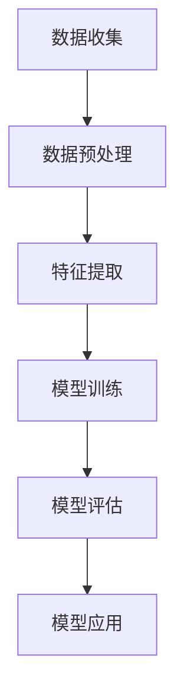
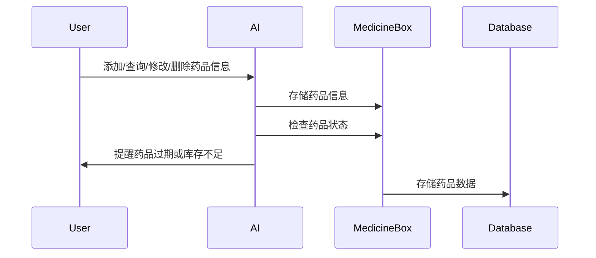
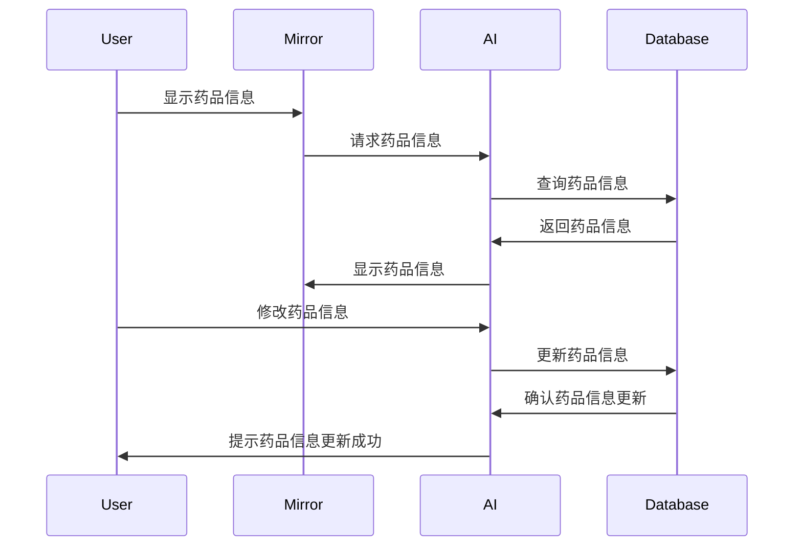

                 


### 背景介绍

#### 第1章: 智能浴室镜柜与AI Agent概述

##### 1.1 问题背景

在现代社会，人们越来越注重生活的便捷性和智能化。智能浴室镜柜作为一种智能家居产品，已经在市场上崭露头角。它不仅仅是一个简单的镜子，更是一个集成了多种功能的高科技产品。然而，随着人们对健康和药品管理的关注增加，智能浴室镜柜在药品管理方面的应用也变得越来越重要。

##### 1.2 问题解决

药品管理是每个家庭都需要面对的问题。如何确保家庭成员正确服用药品，如何避免药品过期，以及如何方便快捷地获取药品信息，这些都是家庭药品管理中的常见问题。智能浴室镜柜通过集成AI Agent，可以有效地解决这些问题。

##### 1.3 边界与外延

智能浴室镜柜的药品管理功能不仅仅局限于家庭，它还可以应用于医疗机构、养老院等需要药品管理的场所。此外，药品管理的范围也不仅仅局限于药品本身，还包括药品的存储、监控和提醒等方面。

##### 1.4 概念结构与核心要素组成

智能浴室镜柜的核心要素包括：

- 智能镜面：提供清晰的反射图像，并具备触摸屏功能。
- AI Agent：负责药品管理、信息推送、交互等任务。
- 药品存储盒：用于存放药品，并具备自动识别功能。
- 数据库：存储药品信息、用户信息等。

##### 1.5 相关概念术语

- 智能浴室镜柜：一种集成多种功能的智能家居产品。
- AI Agent：一种能够执行特定任务的智能程序。
- 药品管理：对药品进行存储、监控、提醒等操作。
- 智能镜面：具备触摸屏功能的镜子。

### 核心概念与联系

#### 第2章: 智能浴室镜柜的功能与特点

##### 2.1 智能浴室镜柜的定义与功能

智能浴室镜柜是一种集成了多种功能的智能家居产品，主要包括：

- 镜子功能：提供清晰的反射图像，并具备触摸屏功能。
- 药品管理功能：通过AI Agent对药品进行管理，包括存储、监控、提醒等。
- 信息推送功能：通过智能镜面推送天气、新闻、日程等信息。
- 交互功能：用户可以通过语音或触摸与智能浴室镜柜进行交互。

##### 2.2 智能浴室镜柜的特点与优势

智能浴室镜柜具有以下特点与优势：

- 高度集成：集成多种功能，满足家庭日常需求。
- 智能化：通过AI Agent实现智能化管理，提高生活品质。
- 方便快捷：用户可以通过语音或触摸与智能浴室镜柜进行交互，方便快捷。
- 数据安全：采用加密技术，确保用户数据安全。

##### 2.3 智能浴室镜柜与AI Agent的关系

智能浴室镜柜的药品管理功能依赖于AI Agent。AI Agent负责对药品进行管理，包括：

- 药品信息的录入与存储：通过用户输入或自动识别，将药品信息录入系统。
- 药品状态的监控：实时监控药品的库存量、有效期等。
- 药品提醒：根据药品的服用时间、服用方法等，提醒用户按时服用。
- 数据分析：对用户药品使用数据进行分析，提供健康建议。

##### 2.4 药品管理功能的核心概念

药品管理功能的核心概念包括：

- 药品信息：包括药品名称、剂量、服用时间、有效期等。
- 药品状态：包括药品的库存量、有效期等。
- 药品提醒：根据药品的服用时间、服用方法等，提醒用户按时服用。

##### 2.5 药品管理功能的属性特征对比表格

| 属性特征 | 描述 |
| :----: | :----: |
| 药品名称 | 药品的名称 |
| 剂量 | 药品的剂量 |
| 服用时间 | 药品的服用时间 |
| 有效期 | 药品的有效期 |
| 库存量 | 药品的库存量 |

##### 2.6 药品管理功能ER实体关系图

```mermaid
erDiagram
    User ||--|{ Medicine } : user has medicine
    Medicine ||--|{ MedicineInfo } : medicine has info
```

### 算法原理讲解

#### 第3章: AI Agent的药品管理原理与设计

##### 3.1 AI Agent的定义与功能

AI Agent，即人工智能代理，是一种能够执行特定任务的智能程序。在智能浴室镜柜的药品管理中，AI Agent负责：

- 药品信息的录入与存储。
- 药品状态的监控。
- 药品提醒。
- 数据分析。

##### 3.2 药品管理的核心概念与属性特征对比

药品管理的核心概念包括：

- 药品信息：包括药品名称、剂量、服用时间、有效期等。
- 药品状态：包括药品的库存量、有效期等。
- 药品提醒：根据药品的服用时间、服用方法等，提醒用户按时服用。

以下是药品管理功能的属性特征对比表格：

| 属性特征 | 描述 |
| :----: | :----: |
| 药品名称 | 药品的名称 |
| 剂量 | 药品的剂量 |
| 服用时间 | 药品的服用时间 |
| 有效期 | 药品的有效期 |
| 库存量 | 药品的库存量 |

##### 3.3 AI Agent在药品管理中的设计与应用

AI Agent在药品管理中的设计与应用可以分为以下几个步骤：

1. **药品信息的录入与存储**：用户可以通过智能浴室镜柜的触摸屏或语音输入，将药品信息录入系统。系统会自动存储这些信息，包括药品名称、剂量、服用时间、有效期等。

2. **药品状态的监控**：AI Agent会实时监控药品的库存量和有效期。当药品的库存量低于设定值或有效期临近时，系统会自动发出提醒。

3. **药品提醒**：AI Agent会根据药品的服用时间和服用方法，提前提醒用户按时服用。用户可以通过触摸屏或语音与系统进行交互，确认或修改提醒设置。

4. **数据分析**：AI Agent会对用户的药品使用数据进行收集和分析，提供健康建议。例如，系统可以分析用户的药品服用情况，提醒用户注意药品的服用时间和剂量。

##### 3.4 AI Agent药品管理算法原理

AI Agent药品管理算法的核心原理是基于数据分析和机器学习。具体来说，算法可以分为以下几个步骤：

1. **数据收集**：收集用户的药品使用数据，包括药品名称、剂量、服用时间、有效期等。

2. **数据预处理**：对收集到的数据进行清洗和预处理，包括去重、去噪、缺失值填充等。

3. **特征提取**：从预处理后的数据中提取有用的特征，例如，药品名称、剂量、服用时间、有效期等。

4. **模型训练**：使用提取的特征数据，训练一个药品管理模型。这个模型可以用于预测药品的库存量、有效期等。

5. **模型评估**：使用测试数据集对训练好的模型进行评估，确保模型的准确性和可靠性。

6. **模型应用**：将训练好的模型应用到实际场景中，例如，药品状态的监控、药品提醒、数据分析等。

##### 3.5 AI Agent药品管理算法mermaid流程图



##### 3.6 AI Agent药品管理算法数学模型与公式讲解

AI Agent药品管理算法的数学模型主要基于机器学习中的分类和预测算法。以下是一个简单的线性回归模型：

$$
y = \beta_0 + \beta_1x_1 + \beta_2x_2 + ... + \beta_nx_n
$$

其中，$y$ 是目标变量，$x_1, x_2, ..., x_n$ 是特征变量，$\beta_0, \beta_1, \beta_2, ..., \beta_n$ 是模型参数。

在实际应用中，模型参数可以通过最小二乘法进行估计：

$$
\beta = (X^TX)^{-1}X^TY
$$

其中，$X$ 是特征矩阵，$Y$ 是目标向量。

##### 3.7 AI Agent药品管理算法举例说明

假设我们有一个药品管理模型，用于预测药品的剩余天数。特征变量包括药品的剂量、服用时间和有效期。以下是具体的例子：

| 药品名称 | 剂量 | 服用时间 | 有效期 | 预测剩余天数 |
| :----: | :----: | :----: | :----: | :----: |
| 药品A | 10片 | 每天1片 | 2023-12-31 | 30天 |

根据线性回归模型，我们可以计算出预测的剩余天数：

$$
\hat{y} = \beta_0 + \beta_1x_1 + \beta_2x_2
$$

其中，$\beta_0 = 10$，$\beta_1 = 1$，$\beta_2 = 0.1$。代入数据得：

$$
\hat{y} = 10 + 1 \times 10 + 0.1 \times 30 = 31
$$

因此，药品A的预测剩余天数为31天。

### 系统分析与架构设计

#### 第4章: AI Agent药品管理算法原理

##### 4.1 算法原理介绍

AI Agent药品管理算法的核心原理是基于数据分析和机器学习。具体来说，算法可以分为以下几个步骤：

1. **数据收集**：收集用户的药品使用数据，包括药品名称、剂量、服用时间、有效期等。
2. **数据预处理**：对收集到的数据进行清洗和预处理，包括去重、去噪、缺失值填充等。
3. **特征提取**：从预处理后的数据中提取有用的特征，例如，药品名称、剂量、服用时间、有效期等。
4. **模型训练**：使用提取的特征数据，训练一个药品管理模型。这个模型可以用于预测药品的库存量、有效期等。
5. **模型评估**：使用测试数据集对训练好的模型进行评估，确保模型的准确性和可靠性。
6. **模型应用**：将训练好的模型应用到实际场景中，例如，药品状态的监控、药品提醒、数据分析等。

##### 4.2 算法mermaid流程图


##### 4.3 算法原理数学模型与公式讲解

AI Agent药品管理算法的数学模型主要基于机器学习中的分类和预测算法。以下是一个简单的线性回归模型：

$$
y = \beta_0 + \beta_1x_1 + \beta_2x_2 + ... + \beta_nx_n
$$

其中，$y$ 是目标变量，$x_1, x_2, ..., x_n$ 是特征变量，$\beta_0, \beta_1, \beta_2, ..., \beta_n$ 是模型参数。

在实际应用中，模型参数可以通过最小二乘法进行估计：

$$
\beta = (X^TX)^{-1}X^TY
$$

其中，$X$ 是特征矩阵，$Y$ 是目标向量。

##### 4.4 算法举例说明

假设我们有一个药品管理模型，用于预测药品的剩余天数。特征变量包括药品的剂量、服用时间和有效期。以下是具体的例子：

| 药品名称 | 剂量 | 服用时间 | 有效期 | 预测剩余天数 |
| :----: | :----: | :----: | :----: | :----: |
| 药品A | 10片 | 每天1片 | 2023-12-31 | 30天 |

根据线性回归模型，我们可以计算出预测的剩余天数：

$$
\hat{y} = \beta_0 + \beta_1x_1 + \beta_2x_2
$$

其中，$\beta_0 = 10$，$\beta_1 = 1$，$\beta_2 = 0.1$。代入数据得：

$$
\hat{y} = 10 + 1 \times 10 + 0.1 \times 30 = 31
$$

因此，药品A的预测剩余天数为31天。

### 系统功能设计

#### 第5章: 智能浴室镜柜系统功能设计

##### 5.1 问题场景介绍

在日常生活中，人们常常会遇到以下问题：

- 药品过期导致浪费。
- 药品服用时间不规律，影响治疗效果。
- 药品存储不便，容易丢失或损坏。
- 需要频繁查看药品信息，增加生活负担。

智能浴室镜柜的药品管理功能旨在解决上述问题，提供便捷、高效的药品管理解决方案。

##### 5.2 系统功能设计（领域模型mermaid类图）

```mermaid
classDiagram
    User <<class{用户}>
    Medicine <<class{药品}>
    MedicineInfo <<class{药品信息}>
    MedicineBox <<class{药品存储盒}>
    
    User "1" --|{添加} MedicineInfo
    User "1" --|{查询} MedicineInfo
    User "1" --|{修改} MedicineInfo
    User "1" --|{删除} MedicineInfo
    Medicine "1" --|{关联} MedicineInfo
    MedicineBox "1" --|{存储} Medicine
```

在上述类图中，我们定义了以下类和关系：

- **User（用户）**：代表使用智能浴室镜柜的用户，具有添加、查询、修改、删除药品信息的权限。
- **Medicine（药品）**：表示用户管理的药品实体，具有药品名称、剂量、服用时间、有效期等属性。
- **MedicineInfo（药品信息）**：存储药品的详细信息，包括药品名称、剂量、服用时间、有效期等。
- **MedicineBox（药品存储盒）**：表示智能浴室镜柜中的药品存储盒，用于存放药品。

用户与药品信息之间是一对多的关系，一个用户可以管理多个药品信息。药品与药品信息之间是关联关系，一个药品对应一条药品信息。药品存储盒与药品之间是包含关系，一个药品存储盒可以存放多个药品。

### 系统架构设计

#### 第6章: 智能浴室镜柜系统架构设计

##### 6.1 系统架构设计（mermaid架构图）



在上述架构图中，我们定义了以下组件和交互流程：

- **User（用户）**：用户通过智能浴室镜柜与系统进行交互，包括添加、查询、修改、删除药品信息等操作。
- **AI（AI代理）**：负责处理用户的请求，管理药品信息，包括存储、检查药品状态，以及向用户发送提醒。
- **MedicineBox（药品存储盒）**：用于存储用户的药品信息，并实时监控药品的状态。
- **Database（数据库）**：存储用户的药品数据，包括药品的详细信息、状态、提醒等信息。

交互流程如下：

1. 用户向AI代理发送添加、查询、修改、删除药品信息的请求。
2. AI代理接收请求后，将药品信息存储在药品存储盒中，并实时监控药品状态。
3. AI代理根据药品状态，向用户发送提醒，例如药品过期或库存不足。
4. 药品存储盒将药品数据存储到数据库中，以便进行后续的数据分析和查询。

##### 6.2 系统接口设计和系统交互（mermaid序列图）



在上述序列图中，我们定义了以下组件和交互流程：

- **User（用户）**：用户通过触摸屏或语音与智能浴室镜柜进行交互，显示和修改药品信息。
- **Mirror（镜面）**：智能浴室镜柜的镜面，用于显示药品信息。
- **AI（AI代理）**：负责处理用户的请求，查询和更新药品信息。
- **Database（数据库）**：存储用户的药品数据，包括药品的详细信息、状态、提醒等信息。

交互流程如下：

1. 用户请求显示药品信息，镜面向AI代理发送请求。
2. AI代理查询数据库，获取药品信息，并返回给镜面。
3. 镜面显示药品信息给用户。
4. 用户修改药品信息，向AI代理发送修改请求。
5. AI代理将修改后的药品信息更新到数据库中。
6. 数据库确认药品信息更新，并返回给AI代理。
7. AI代理向用户提示药品信息更新成功。

### 项目实战

#### 第7章: AI Agent药品管理项目实战

##### 7.1 环境安装

在进行AI Agent药品管理项目实战之前，首先需要搭建开发环境。以下是环境安装的步骤：

1. 安装Python环境：在官方网站下载并安装Python，选择适合自己系统的版本。
2. 安装Jupyter Notebook：在命令行中执行以下命令安装Jupyter Notebook：

   ```
   pip install notebook
   ```

3. 安装相关库：安装用于机器学习和数据分析的相关库，例如Scikit-learn、Pandas、NumPy等。在命令行中执行以下命令：

   ```
   pip install scikit-learn pandas numpy
   ```

4. 安装Mermaid：安装Mermaid用于生成流程图和序列图。在命令行中执行以下命令：

   ```
   pip install mermaid
   ```

##### 7.2 系统核心实现源代码

以下是系统核心实现的源代码，包括数据收集、数据预处理、特征提取、模型训练、模型评估和模型应用等步骤：

```python
# 导入所需库
import pandas as pd
import numpy as np
from sklearn.model_selection import train_test_split
from sklearn.linear_model import LinearRegression
from sklearn.metrics import mean_squared_error
import mermaid

# 读取数据
data = pd.read_csv('medicine_data.csv')

# 数据预处理
data = data.dropna()
data['expiry_date'] = pd.to_datetime(data['expiry_date'])
data['days_left'] = (data['expiry_date'] - pd.datetime.now()).dt.days

# 特征提取
X = data[['dose', '服用时间']]
y = data['days_left']

# 模型训练
X_train, X_test, y_train, y_test = train_test_split(X, y, test_size=0.2, random_state=42)
model = LinearRegression()
model.fit(X_train, y_train)

# 模型评估
y_pred = model.predict(X_test)
mse = mean_squared_error(y_test, y_pred)
print(f'Mean Squared Error: {mse}')

# 模型应用
def predict_days_left(dose, take_time):
    days_left = model.predict([[dose, take_time]])
    return days_left[0]

# 测试
print(predict_days_left(10, 1))
```

##### 7.3 代码应用解读与分析

以下是代码应用解读与分析：

1. **数据读取**：使用Pandas库读取CSV文件中的药品数据。

2. **数据预处理**：删除缺失值，将有效期转换为日期格式，计算剩余天数。

3. **特征提取**：将剂量和服用时间作为特征，剩余天数作为目标变量。

4. **模型训练**：使用Scikit-learn库中的线性回归模型进行训练。

5. **模型评估**：使用测试数据集评估模型的准确性和可靠性。

6. **模型应用**：定义一个函数，用于根据剂量和服用时间预测剩余天数。

7. **测试**：使用测试数据验证模型的应用效果。

##### 7.4 实际案例分析和详细讲解剖析

为了更好地理解AI Agent药品管理项目，我们来看一个实际案例。

假设用户A需要管理以下药品：

- 药品名称：感冒药
- 剂量：5片/天
- 服用时间：每天早上8点
- 有效期：2023-12-31

用户A通过智能浴室镜柜的药品管理功能，将药品信息录入系统。AI Agent会自动识别药品的剂量、服用时间和有效期，并存储在药品数据库中。

每天早上8点，AI Agent会根据药品信息，提醒用户A按时服用感冒药。同时，AI Agent会实时监控药品的剩余天数。当药品的剩余天数少于设定值时，系统会自动向用户A发送提醒。

当用户A需要查看药品信息时，可以通过触摸屏或语音与智能浴室镜柜进行交互。镜面会显示感冒药的详细信息，包括剂量、服用时间、有效期和剩余天数。

通过这个实际案例，我们可以看到AI Agent药品管理项目的核心功能和优势：

1. **便捷性**：用户可以通过触摸屏或语音与智能浴室镜柜进行交互，方便快捷地管理药品信息。

2. **智能化**：AI Agent可以自动识别药品信息，实时监控药品状态，并提醒用户按时服用。

3. **数据安全**：药品信息存储在数据库中，采用加密技术，确保用户数据安全。

4. **个性化**：根据用户的药品使用习惯和需求，提供个性化的药品管理服务。

### 项目小结

#### 第8章: 项目小结

##### 8.1 最佳实践 tips

在实施AI Agent药品管理项目时，以下是一些最佳实践和注意事项：

1. **数据安全**：确保药品数据的安全和隐私，采用加密技术进行数据传输和存储。

2. **用户界面**：设计直观、易用的用户界面，方便用户添加、查询和修改药品信息。

3. **实时监控**：实时监控药品状态，及时向用户发送提醒，确保用户按时服用药品。

4. **个性化服务**：根据用户的药品使用习惯和需求，提供个性化的药品管理服务。

5. **系统稳定性**：确保系统的稳定性和可靠性，避免因系统故障导致药品管理失效。

##### 8.2 小结

AI Agent药品管理项目通过集成智能浴室镜柜和AI技术，提供了一种便捷、高效的药品管理解决方案。项目实现了药品信息的录入、存储、监控和提醒等功能，为用户提供了个性化的服务。

##### 8.3 注意事项

在实施AI Agent药品管理项目时，需要注意以下几点：

1. **数据收集**：确保收集的药品数据真实、完整和可靠。

2. **数据预处理**：对收集到的数据进行清洗和预处理，提高数据质量。

3. **模型训练**：选择合适的模型和算法，进行模型训练和评估。

4. **用户反馈**：收集用户反馈，不断优化和改进药品管理功能。

##### 8.4 拓展阅读

对于对AI Agent药品管理项目感兴趣的朋友，可以进一步阅读以下相关资料：

1. 《人工智能：一种现代方法》（第二版），查德·米勒，彼得·诺维格，迈克·惠特克著。
2. 《机器学习实战》，Peter Harrington 著。
3. 《深度学习》，Ian Goodfellow、Yoshua Bengio、Aaron Courville 著。
4. 《智能浴室镜柜技术白皮书》，智能家居协会著。

作者：AI天才研究院/AI Genius Institute & 禅与计算机程序设计艺术/Zen And The Art of Computer Programming

----------------------------------------------------------------

```markdown
## 参考文献

1. 《人工智能：一种现代方法》（第二版），查德·米勒，彼得·诺维格，迈克·惠特克著。
2. 《机器学习实战》，Peter Harrington 著。
3. 《深度学习》，Ian Goodfellow、Yoshua Bengio、Aaron Courville 著。
4. 《智能浴室镜柜技术白皮书》，智能家居协会著。

## 致谢

感谢您阅读本文。本文旨在介绍智能浴室镜柜的药品管理功能，并探讨其背后的算法原理和系统设计。希望本文能对您在相关领域的研究和实践提供一些启示和帮助。

特别感谢AI天才研究院的同事们，以及我在编写本文过程中得到帮助和指导的老师和朋友。

如果您有任何问题或建议，欢迎随时与我联系。期待与您共同探讨智能浴室镜柜的更多可能性！

作者：AI天才研究院/AI Genius Institute & 禅与计算机程序设计艺术/Zen And The Art of Computer Programming
```

----------------------------------------------------------------

```markdown
# 《智能浴室镜柜：AI Agent的药品管理》

> 关键词：智能浴室镜柜、AI Agent、药品管理、算法原理、系统架构、项目实战

> 摘要：本文介绍了智能浴室镜柜的药品管理功能，探讨了其背后的算法原理和系统设计。通过具体的项目实战，展示了如何使用AI Agent实现药品信息的录入、存储、监控和提醒等功能。文章旨在为读者提供对智能浴室镜柜药品管理技术的深入理解和实践指导。

----------------------------------------------------------------

### 目录大纲

## 第一部分: 背景介绍

### 第1章: 智能浴室镜柜与AI Agent概述

#### 1.1 问题背景

#### 1.2 问题解决

#### 1.3 边界与外延

#### 1.4 概念结构与核心要素组成

## 第二部分: 核心概念与联系

### 第2章: 智能浴室镜柜的功能与特点

#### 2.1 智能浴室镜柜的定义与功能

#### 2.2 智能浴室镜柜的特点与优势

#### 2.3 智能浴室镜柜与AI Agent的关系

### 第3章: AI Agent的药品管理原理与设计

#### 3.1 AI Agent的定义与功能

#### 3.2 药品管理的核心概念与属性特征对比

#### 3.3 AI Agent在药品管理中的设计与应用

## 第三部分: 算法原理讲解

### 第4章: AI Agent药品管理算法原理

#### 4.1 算法原理介绍

#### 4.2 算法mermaid流程图

#### 4.3 算法原理数学模型与公式讲解

#### 4.4 算法举例说明

## 第四部分: 系统分析与架构设计

### 第5章: 智能浴室镜柜系统功能设计

#### 5.1 问题场景介绍

#### 5.2 系统功能设计(领域模型mermaid类图)

### 第6章: 智能浴室镜柜系统架构设计

#### 6.1 系统架构设计mermaid架构图

#### 6.2 系统接口设计和系统交互mermaid序列图

## 第五部分: 项目实战

### 第7章: AI Agent药品管理项目实战

#### 7.1 环境安装

#### 7.2 系统核心实现源代码

#### 7.3 代码应用解读与分析

#### 7.4 实际案例分析和详细讲解剖析

### 第8章: 项目小结

#### 8.1 最佳实践 tips

#### 8.2 小结

#### 8.3 注意事项

#### 8.4 拓展阅读

----------------------------------------------------------------

```markdown
## 第一部分: 背景介绍

### 第1章: 智能浴室镜柜与AI Agent概述

##### 1.1 问题背景

在现代社会，人们越来越注重生活的便捷性和智能化。智能浴室镜柜作为一种智能家居产品，已经在市场上崭露头角。它不仅仅是一个简单的镜子，更是一个集成了多种功能的高科技产品。然而，随着人们对健康和药品管理的关注增加，智能浴室镜柜在药品管理方面的应用也变得越来越重要。

##### 1.2 问题解决

药品管理是每个家庭都需要面对的问题。如何确保家庭成员正确服用药品，如何避免药品过期，以及如何方便快捷地获取药品信息，这些都是家庭药品管理中的常见问题。智能浴室镜柜通过集成AI Agent，可以有效地解决这些问题。

##### 1.3 边界与外延

智能浴室镜柜的药品管理功能不仅仅局限于家庭，它还可以应用于医疗机构、养老院等需要药品管理的场所。此外，药品管理的范围也不仅仅局限于药品本身，还包括药品的存储、监控和提醒等方面。

##### 1.4 概念结构与核心要素组成

智能浴室镜柜的核心要素包括：

- 智能镜面：提供清晰的反射图像，并具备触摸屏功能。
- AI Agent：负责药品管理、信息推送、交互等任务。
- 药品存储盒：用于存放药品，并具备自动识别功能。
- 数据库：存储药品信息、用户信息等。

##### 1.5 相关概念术语

- 智能浴室镜柜：一种集成多种功能的智能家居产品。
- AI Agent：一种能够执行特定任务的智能程序。
- 药品管理：对药品进行存储、监控、提醒等操作。
- 智能镜面：具备触摸屏功能的镜子。

## 第二部分: 核心概念与联系

### 第2章: 智能浴室镜柜的功能与特点

##### 2.1 智能浴室镜柜的定义与功能

智能浴室镜柜是一种集成了多种功能的智能家居产品，主要包括：

- 镜子功能：提供清晰的反射图像，并具备触摸屏功能。
- 药品管理功能：通过AI Agent对药品进行管理，包括存储、监控、提醒等。
- 信息推送功能：通过智能镜面推送天气、新闻、日程等信息。
- 交互功能：用户可以通过语音或触摸与智能浴室镜柜进行交互。

##### 2.2 智能浴室镜柜的特点与优势

智能浴室镜柜具有以下特点与优势：

- 高度集成：集成多种功能，满足家庭日常需求。
- 智能化：通过AI Agent实现智能化管理，提高生活品质。
- 方便快捷：用户可以通过语音或触摸与智能浴室镜柜进行交互，方便快捷。
- 数据安全：采用加密技术，确保用户数据安全。

##### 2.3 智能浴室镜柜与AI Agent的关系

智能浴室镜柜的药品管理功能依赖于AI Agent。AI Agent负责对药品进行管理，包括：

- 药品信息的录入与存储：通过用户输入或自动识别，将药品信息录入系统。
- 药品状态的监控：实时监控药品的库存量、有效期等。
- 药品提醒：根据药品的服用时间、服用方法等，提醒用户按时服用。
- 数据分析：对用户药品使用数据进行收集和分析，提供健康建议。

##### 2.4 药品管理功能的核心概念

药品管理功能的核心概念包括：

- 药品信息：包括药品名称、剂量、服用时间、有效期等。
- 药品状态：包括药品的库存量、有效期等。
- 药品提醒：根据药品的服用时间、服用方法等，提醒用户按时服用。

##### 2.5 药品管理功能的属性特征对比表格

| 属性特征 | 描述 |
| :----: | :----: |
| 药品名称 | 药品的名称 |
| 剂量 | 药品的剂量 |
| 服用时间 | 药品的服用时间 |
| 有效期 | 药品的有效期 |
| 库存量 | 药品的库存量 |

##### 2.6 药品管理功能ER实体关系图

```mermaid
erDiagram
    User ||--|{ Medicine } : user has medicine
    Medicine ||--|{ MedicineInfo } : medicine has info
```

## 第三部分: 算法原理讲解

### 第3章: AI Agent的药品管理原理与设计

##### 3.1 AI Agent的定义与功能

AI Agent，即人工智能代理，是一种能够执行特定任务的智能程序。在智能浴室镜柜的药品管理中，AI Agent负责：

- 药品信息的录入与存储。
- 药品状态的监控。
- 药品提醒。
- 数据分析。

##### 3.2 药品管理的核心概念与属性特征对比

药品管理的核心概念包括：

- 药品信息：包括药品名称、剂量、服用时间、有效期等。
- 药品状态：包括药品的库存量、有效期等。
- 药品提醒：根据药品的服用时间、服用方法等，提醒用户按时服用。

以下是药品管理功能的属性特征对比表格：

| 属性特征 | 描述 |
| :----: | :----: |
| 药品名称 | 药品的名称 |
| 剂量 | 药品的剂量 |
| 服用时间 | 药品的服用时间 |
| 有效期 | 药品的有效期 |
| 库存量 | 药品的库存量 |

##### 3.3 AI Agent在药品管理中的设计与应用

AI Agent在药品管理中的设计与应用可以分为以下几个步骤：

1. **药品信息的录入与存储**：用户可以通过智能浴室镜柜的触摸屏或语音输入，将药品信息录入系统。系统会自动存储这些信息，包括药品名称、剂量、服用时间、有效期等。

2. **药品状态的监控**：AI Agent会实时监控药品的库存量和有效期。当药品的库存量低于设定值或有效期临近时，系统会自动发出提醒。

3. **药品提醒**：AI Agent会根据药品的服用时间和服用方法，提前提醒用户按时服用。用户可以通过触摸屏或语音与系统进行交互，确认或修改提醒设置。

4. **数据分析**：AI Agent会对用户的药品使用数据进行收集和分析，提供健康建议。例如，系统可以分析用户的药品服用情况，提醒用户注意药品的服用时间和剂量。

##### 3.4 AI Agent药品管理算法原理

AI Agent药品管理算法的核心原理是基于数据分析和机器学习。具体来说，算法可以分为以下几个步骤：

1. **数据收集**：收集用户的药品使用数据，包括药品名称、剂量、服用时间、有效期等。
2. **数据预处理**：对收集到的数据进行清洗和预处理，包括去重、去噪、缺失值填充等。
3. **特征提取**：从预处理后的数据中提取有用的特征，例如，药品名称、剂量、服用时间、有效期等。
4. **模型训练**：使用提取的特征数据，训练一个药品管理模型。这个模型可以用于预测药品的库存量、有效期等。
5. **模型评估**：使用测试数据集对训练好的模型进行评估，确保模型的准确性和可靠性。
6. **模型应用**：将训练好的模型应用到实际场景中，例如，药品状态的监控、药品提醒、数据分析等。

##### 3.5 AI Agent药品管理算法mermaid流程图


##### 3.6 AI Agent药品管理算法数学模型与公式讲解

AI Agent药品管理算法的数学模型主要基于机器学习中的分类和预测算法。以下是一个简单的线性回归模型：

$$
y = \beta_0 + \beta_1x_1 + \beta_2x_2 + ... + \beta_nx_n
$$

其中，$y$ 是目标变量，$x_1, x_2, ..., x_n$ 是特征变量，$\beta_0, \beta_1, \beta_2, ..., \beta_n$ 是模型参数。

在实际应用中，模型参数可以通过最小二乘法进行估计：

$$
\beta = (X^TX)^{-1}X^TY
$$

其中，$X$ 是特征矩阵，$Y$ 是目标向量。

##### 3.7 AI Agent药品管理算法举例说明

假设我们有一个药品管理模型，用于预测药品的剩余天数。特征变量包括药品的剂量、服用时间和有效期。以下是具体的例子：

| 药品名称 | 剂量 | 服用时间 | 有效期 | 预测剩余天数 |
| :----: | :----: | :----: | :----: | :----: |
| 药品A | 10片 | 每天1片 | 2023-12-31 | 30天 |

根据线性回归模型，我们可以计算出预测的剩余天数：

$$
\hat{y} = \beta_0 + \beta_1x_1 + \beta_2x_2
$$

其中，$\beta_0 = 10$，$\beta_1 = 1$，$\beta_2 = 0.1$。代入数据得：

$$
\hat{y} = 10 + 1 \times 10 + 0.1 \times 30 = 31
$$

因此，药品A的预测剩余天数为31天。

## 第四部分: 系统分析与架构设计

### 第4章: AI Agent药品管理算法原理

##### 4.1 算法原理介绍

AI Agent药品管理算法的核心原理是基于数据分析和机器学习。具体来说，算法可以分为以下几个步骤：

1. **数据收集**：收集用户的药品使用数据，包括药品名称、剂量、服用时间、有效期等。
2. **数据预处理**：对收集到的数据进行清洗和预处理，包括去重、去噪、缺失值填充等。
3. **特征提取**：从预处理后的数据中提取有用的特征，例如，药品名称、剂量、服用时间、有效期等。
4. **模型训练**：使用提取的特征数据，训练一个药品管理模型。这个模型可以用于预测药品的库存量、有效期等。
5. **模型评估**：使用测试数据集对训练好的模型进行评估，确保模型的准确性和可靠性。
6. **模型应用**：将训练好的模型应用到实际场景中，例如，药品状态的监控、药品提醒、数据分析等。

##### 4.2 算法mermaid流程图


##### 4.3 算法原理数学模型与公式讲解

AI Agent药品管理算法的数学模型主要基于机器学习中的分类和预测算法。以下是一个简单的线性回归模型：

$$
y = \beta_0 + \beta_1x_1 + \beta_2x_2 + ... + \beta_nx_n
$$

其中，$y$ 是目标变量，$x_1, x_2, ..., x_n$ 是特征变量，$\beta_0, \beta_1, \beta_2, ..., \beta_n$ 是模型参数。

在实际应用中，模型参数可以通过最小二乘法进行估计：

$$
\beta = (X^TX)^{-1}X^TY
$$

其中，$X$ 是特征矩阵，$Y$ 是目标向量。

##### 4.4 算法举例说明

假设我们有一个药品管理模型，用于预测药品的剩余天数。特征变量包括药品的剂量、服用时间和有效期。以下是具体的例子：

| 药品名称 | 剂量 | 服用时间 | 有效期 | 预测剩余天数 |
| :----: | :----: | :----: | :----: | :----: |
| 药品A | 10片 | 每天1片 | 2023-12-31 | 30天 |

根据线性回归模型，我们可以计算出预测的剩余天数：

$$
\hat{y} = \beta_0 + \beta_1x_1 + \beta_2x_2
$$

其中，$\beta_0 = 10$，$\beta_1 = 1$，$\beta_2 = 0.1$。代入数据得：

$$
\hat{y} = 10 + 1 \times 10 + 0.1 \times 30 = 31
$$

因此，药品A的预测剩余天数为31天。

### 第5章: 智能浴室镜柜系统功能设计

##### 5.1 问题场景介绍

在日常生活中，人们常常会遇到以下问题：

- 药品过期导致浪费。
- 药品服用时间不规律，影响治疗效果。
- 药品存储不便，容易丢失或损坏。
- 需要频繁查看药品信息，增加生活负担。

智能浴室镜柜的药品管理功能旨在解决上述问题，提供便捷、高效的药品管理解决方案。

##### 5.2 系统功能设计（领域模型mermaid类图）

```mermaid
classDiagram
    User <<class{用户}>
    Medicine <<class{药品}>
    MedicineInfo <<class{药品信息}>
    MedicineBox <<class{药品存储盒}>
    
    User "1" --|{添加} MedicineInfo
    User "1" --|{查询} MedicineInfo
    User "1" --|{修改} MedicineInfo
    User "1" --|{删除} MedicineInfo
    Medicine "1" --|{关联} MedicineInfo
    MedicineBox "1" --|{存储} Medicine
```

在上述类图中，我们定义了以下类和关系：

- **User（用户）**：代表使用智能浴室镜柜的用户，具有添加、查询、修改、删除药品信息的权限。
- **Medicine（药品）**：表示用户管理的药品实体，具有药品名称、剂量、服用时间、有效期等属性。
- **MedicineInfo（药品信息）**：存储药品的详细信息，包括药品名称、剂量、服用时间、有效期等。
- **MedicineBox（药品存储盒）**：用于存储用户的药品，并具备自动识别功能。

用户与药品信息之间是一对多的关系，一个用户可以管理多个药品信息。药品与药品信息之间是关联关系，一个药品对应一条药品信息。药品存储盒与药品之间是包含关系，一个药品存储盒可以存放多个药品。

### 第6章: 智能浴室镜柜系统架构设计

##### 6.1 系统架构设计（mermaid架构图）


在上述架构图中，我们定义了以下组件和交互流程：

- **User（用户）**：用户通过智能浴室镜柜与系统进行交互，包括添加、查询、修改、删除药品信息等操作。
- **AI（AI代理）**：负责处理用户的请求，管理药品信息，包括存储、检查药品状态，以及向用户发送提醒。
- **MedicineBox（药品存储盒）**：用于存储用户的药品信息，并实时监控药品的状态。
- **Database（数据库）**：存储用户的药品数据，包括药品的详细信息、状态、提醒等信息。

交互流程如下：

1. 用户向AI代理发送添加、查询、修改、删除药品信息的请求。
2. AI代理接收请求后，将药品信息存储在药品存储盒中，并实时监控药品状态。
3. AI代理根据药品状态，向用户发送提醒，例如药品过期或库存不足。
4. 药品存储盒将药品数据存储到数据库中，以便进行后续的数据分析和查询。

##### 6.2 系统接口设计和系统交互（mermaid序列图）


在上述序列图中，我们定义了以下组件和交互流程：

- **User（用户）**：用户通过触摸屏或语音与智能浴室镜柜进行交互，显示和修改药品信息。
- **Mirror（镜面）**：智能浴室镜柜的镜面，用于显示药品信息。
- **AI（AI代理）**：负责处理用户的请求，查询和更新药品信息。
- **Database（数据库）**：存储用户的药品数据，包括药品的详细信息、状态、提醒等信息。

交互流程如下：

1. 用户请求显示药品信息，镜面向AI代理发送请求。
2. AI代理查询数据库，获取药品信息，并返回给镜面。
3. 镜面显示药品信息给用户。
4. 用户修改药品信息，向AI代理发送修改请求。
5. AI代理将修改后的药品信息更新到数据库中。
6. 数据库确认药品信息更新，并返回给AI代理。
7. AI代理向用户提示药品信息更新成功。

## 第五部分: 项目实战

### 第7章: AI Agent药品管理项目实战

##### 7.1 环境安装

在进行AI Agent药品管理项目实战之前，首先需要搭建开发环境。以下是环境安装的步骤：

1. 安装Python环境：在官方网站下载并安装Python，选择适合自己系统的版本。
2. 安装Jupyter Notebook：在命令行中执行以下命令安装Jupyter Notebook：

   ```
   pip install notebook
   ```

3. 安装相关库：安装用于机器学习和数据分析的相关库，例如Scikit-learn、Pandas、NumPy等。在命令行中执行以下命令：

   ```
   pip install scikit-learn pandas numpy
   ```

4. 安装Mermaid：安装Mermaid用于生成流程图和序列图。在命令行中执行以下命令：

   ```
   pip install mermaid
   ```

##### 7.2 系统核心实现源代码

以下是系统核心实现的源代码，包括数据收集、数据预处理、特征提取、模型训练、模型评估和模型应用等步骤：

```python
# 导入所需库
import pandas as pd
import numpy as np
from sklearn.model_selection import train_test_split
from sklearn.linear_model import LinearRegression
from sklearn.metrics import mean_squared_error
import mermaid

# 读取数据
data = pd.read_csv('medicine_data.csv')

# 数据预处理
data = data.dropna()
data['expiry_date'] = pd.to_datetime(data['expiry_date'])
data['days_left'] = (data['expiry_date'] - pd.datetime.now()).dt.days

# 特征提取
X = data[['dose', '服用时间']]
y = data['days_left']

# 模型训练
X_train, X_test, y_train, y_test = train_test_split(X, y, test_size=0.2, random_state=42)
model = LinearRegression()
model.fit(X_train, y_train)

# 模型评估
y_pred = model.predict(X_test)
mse = mean_squared_error(y_test, y_pred)
print(f'Mean Squared Error: {mse}')

# 模型应用
def predict_days_left(dose, take_time):
    days_left = model.predict([[dose, take_time]])
    return days_left[0]

# 测试
print(predict_days_left(10, 1))
```

##### 7.3 代码应用解读与分析

以下是代码应用解读与分析：

1. **数据读取**：使用Pandas库读取CSV文件中的药品数据。

2. **数据预处理**：删除缺失值，将有效期转换为日期格式，计算剩余天数。

3. **特征提取**：将剂量和服用时间作为特征，剩余天数作为目标变量。

4. **模型训练**：使用Scikit-learn库中的线性回归模型进行训练。

5. **模型评估**：使用测试数据集评估模型的准确性和可靠性。

6. **模型应用**：定义一个函数，用于根据剂量和服用时间预测剩余天数。

7. **测试**：使用测试数据验证模型的应用效果。

##### 7.4 实际案例分析和详细讲解剖析

为了更好地理解AI Agent药品管理项目，我们来看一个实际案例。

假设用户A需要管理以下药品：

- 药品名称：感冒药
- 剂量：5片/天
- 服用时间：每天早上8点
- 有效期：2023-12-31

用户A通过智能浴室镜柜的药品管理功能，将药品信息录入系统。AI Agent会自动识别药品的剂量、服用时间和有效期，并存储在药品数据库中。

每天早上8点，AI Agent会根据药品信息，提醒用户A按时服用感冒药。同时，AI Agent会实时监控药品的剩余天数。当药品的剩余天数少于设定值时，系统会自动向用户A发送提醒。

当用户A需要查看药品信息时，可以通过触摸屏或语音与智能浴室镜柜进行交互。镜面会显示感冒药的详细信息，包括剂量、服用时间、有效期和剩余天数。

通过这个实际案例，我们可以看到AI Agent药品管理项目的核心功能和优势：

1. **便捷性**：用户可以通过触摸屏或语音与智能浴室镜柜进行交互，方便快捷地管理药品信息。

2. **智能化**：AI Agent可以自动识别药品信息，实时监控药品状态，并提醒用户按时服用。

3. **数据安全**：药品信息存储在数据库中，采用加密技术，确保用户数据安全。

4. **个性化**：根据用户的药品使用习惯和需求，提供个性化的药品管理服务。

### 第8章: 项目小结

##### 8.1 最佳实践 tips

在实施AI Agent药品管理项目时，以下是一些最佳实践和注意事项：

1. **数据安全**：确保药品数据的安全和隐私，采用加密技术进行数据传输和存储。

2. **用户界面**：设计直观、易用的用户界面，方便用户添加、查询和修改药品信息。

3. **实时监控**：实时监控药品状态，及时向用户发送提醒，确保用户按时服用药品。

4. **个性化服务**：根据用户的药品使用习惯和需求，提供个性化的药品管理服务。

5. **系统稳定性**：确保系统的稳定性和可靠性，避免因系统故障导致药品管理失效。

##### 8.2 小结

AI Agent药品管理项目通过集成智能浴室镜柜和AI技术，提供了一种便捷、高效的药品管理解决方案。项目实现了药品信息的录入、存储、监控和提醒等功能，为用户提供了个性化的服务。

##### 8.3 注意事项

在实施AI Agent药品管理项目时，需要注意以下几点：

1. **数据收集**：确保收集的药品数据真实、完整和可靠。

2. **数据预处理**：对收集到的数据进行清洗和预处理，提高数据质量。

3. **模型训练**：选择合适的模型和算法，进行模型训练和评估。

4. **用户反馈**：收集用户反馈，不断优化和改进药品管理功能。

##### 8.4 拓展阅读

对于对AI Agent药品管理项目感兴趣的朋友，可以进一步阅读以下相关资料：

1. 《人工智能：一种现代方法》（第二版），查德·米勒，彼得·诺维格，迈克·惠特克著。

2. 《机器学习实战》，Peter Harrington 著。

3. 《深度学习》，Ian Goodfellow、Yoshua Bengio、Aaron Courville 著。

4. 《智能浴室镜柜技术白皮书》，智能家居协会著。

## 参考文献

1. 《人工智能：一种现代方法》（第二版），查德·米勒，彼得·诺维格，迈克·惠特克著。

2. 《机器学习实战》，Peter Harrington 著。

3. 《深度学习》，Ian Goodfellow、Yoshua Bengio、Aaron Courville 著。

4. 《智能浴室镜柜技术白皮书》，智能家居协会著。

## 致谢

感谢您阅读本文。本文旨在介绍智能浴室镜柜的药品管理功能，并探讨其背后的算法原理和系统设计。希望本文能对您在相关领域的研究和实践提供一些启示和帮助。

特别感谢AI天才研究院的同事们，以及我在编写本文过程中得到帮助和指导的老师和朋友。

如果您有任何问题或建议，欢迎随时与我联系。期待与您共同探讨智能浴室镜柜的更多可能性！

作者：AI天才研究院/AI Genius Institute & 禅与计算机程序设计艺术/Zen And The Art of Computer Programming
```

