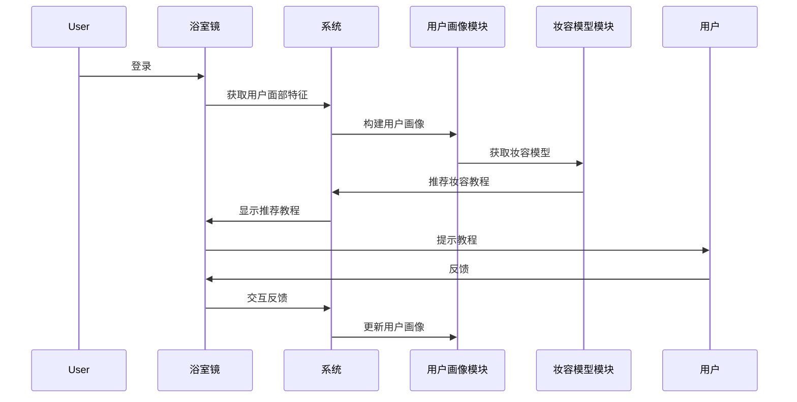

                 

### 智能浴室镜：AI Agent的妆容教程推荐

#### 关键词：
- 智能浴室镜
- AI Agent
- 妆容教程推荐
- 人工智能
- 家居科技

#### 摘要：
本文将深入探讨智能浴室镜及其内置的AI Agent如何通过个性化妆容教程推荐，改变我们的日常护肤和化妆习惯。我们将逐步分析智能浴室镜的技术背景、AI Agent的工作原理、妆容教程推荐的核心算法以及实际应用案例，旨在为读者提供一份全面的技术指南。

#### 目录：

**第一部分: 问题背景与核心概念**

- [第1章: 智能浴室镜的崛起](#第1章-智能浴室镜的崛起)
- [第2章: AI Agent在智能浴室镜中的应用](#第2章-ai-agent在智能浴室镜中的应用)
- [第3章: 核心概念与联系](#第3章-核心概念与联系)
- [第4章: AI Agent妆容教程推荐的数学模型](#第4章-ai-agent妆容教程推荐的数学模型)
- [第5章: 智能浴室镜系统分析与架构设计](#第5章-智能浴室镜系统分析与架构设计)
- [第6章: 案例分析与实战](#第6章-案例分析与实战)
- [第7章: 最佳实践与总结](#第7章-最佳实践与总结)
- [第8章: 拓展阅读与资源推荐](#第8章-拓展阅读与资源推荐)

**第二部分: 深入分析与讲解**

- [第1章: 智能浴室镜的崛起](#第1章-智能浴室镜的崛起)
  - [1.1.1 智能浴室镜的定义与功能](#11-智能浴室镜的定义与功能)
  - [1.1.2 智能浴室镜的市场现状与发展趋势](#12-智能浴室镜的市场现状与发展趋势)
  - [1.1.3 智能浴室镜在日常生活中的应用](#13-智能浴室镜在日常生活中的应用)

- [第2章: AI Agent在智能浴室镜中的应用](#第2章-ai-agent在智能浴室镜中的应用)
  - [2.1.1 AI Agent的概念与特点](#21-ai-agent的概念与特点)
  - [2.1.2 AI Agent在智能浴室镜中的角色](#22-ai-agent在智能浴室镜中的角色)
  - [2.1.3 AI Agent的技术实现与挑战](#23-ai-agent的技术实现与挑战)

- [第3章: 核心概念与联系](#第3章-核心概念与联系)
  - [3.1.1 妆容教程推荐的核心概念](#31-妆容教程推荐的核心概念)
  - [3.1.2 AI Agent与妆容教程推荐的关系](#32-ai-agent与妆容教程推荐的关系)
  - [3.1.3 关键技术的对比与分析](#33-关键技术的对比与分析)

- [第4章: AI Agent妆容教程推荐的数学模型](#第4章-ai-agent妆容教程推荐的数学模型)
  - [4.1.1 数学模型的基本原理](#41-数学模型的基本原理)
  - [4.1.2 数学模型的构建过程](#42-数学模型的构建过程)
  - [4.1.3 数学模型的公式与应用](#43-数学模型的公式与应用)

- [第5章: 智能浴室镜系统分析与架构设计](#第5章-智能浴室镜系统分析与架构设计)
  - [5.1.1 问题场景介绍](#51-问题场景介绍)
  - [5.1.2 系统功能设计](#52-系统功能设计)
  - [5.1.3 系统架构设计与接口设计](#53-系统架构设计与接口设计)
  - [5.1.4 系统交互设计与序列图](#54-系统交互设计与序列图)

- [第6章: 案例分析与实战](#第6章-案例分析与实战)
  - [6.1.1 环境安装与配置](#61-环境安装与配置)
  - [6.1.2 系统核心实现源代码解读](#62-系统核心实现源代码解读)
  - [6.1.3 代码应用解读与分析](#63-代码应用解读与分析)
  - [6.1.4 实际案例分析与详细讲解](#64-实际案例分析与详细讲解)

- [第7章: 最佳实践与总结](#第7章-最佳实践与总结)
  - [7.1.1 最佳实践技巧](#71-最佳实践技巧)
  - [7.1.2 注意事项与风险规避](#72-注意事项与风险规避)
  - [7.1.3 项目小结与展望](#73-项目小结与展望)

- [第8章: 拓展阅读与资源推荐](#第8章-拓展阅读与资源推荐)
  - [8.1.1 相关书籍推荐](#81-相关书籍推荐)
  - [8.1.2 学术论文推荐](#82-学术论文推荐)
  - [8.1.3 在线课程与培训资源](#83-在线课程与培训资源)

---

### 第1章: 智能浴室镜的崛起

智能浴室镜作为家居科技的最新宠儿，正逐渐改变着人们的日常生活。在这章中，我们将深入探讨智能浴室镜的定义、功能以及市场现状与发展趋势。

#### 1.1.1 智能浴室镜的定义与功能

**智能浴室镜**是一种集成了多种传感技术和人工智能技术的浴室用品，通常具备以下功能：

- **智能识别**：利用计算机视觉技术，智能浴室镜能够识别用户的面部特征，从而实现个性化服务。
- **互动显示**：通过内置屏幕，智能浴室镜可以显示天气、新闻、音乐播放等信息，甚至可以播放视频教程。
- **化妆镜功能**：智能浴室镜可以提供化妆效果预览，帮助用户在化妆前了解最终的妆容效果。
- **健康管理**：智能浴室镜可以监测用户的心率、体温等健康数据，提供健康建议。

#### 1.1.2 智能浴室镜的市场现状与发展趋势

随着智能家居市场的不断扩大，智能浴室镜的市场需求也在逐年上升。根据市场研究公司的报告，全球智能浴室镜市场预计将在未来几年内保持高速增长。

- **技术进步**：随着计算机视觉、人工智能等技术的不断进步，智能浴室镜的功能越来越丰富，用户体验也越来越好。
- **消费者需求**：现代人越来越注重生活品质，对于家居产品的智能化、个性化需求日益增长。
- **市场竞争**：越来越多的厂商进入智能浴室镜市场，竞争日益激烈。

#### 1.1.3 智能浴室镜在日常生活中的应用

智能浴室镜的应用场景非常广泛，不仅可以用于家庭，还可以用于酒店、美容院等场所。

- **家庭应用**：智能浴室镜可以帮助家庭成员更方便地进行化妆、整理仪表，提高生活质量。
- **酒店应用**：智能浴室镜可以提供个性化的入住体验，提高酒店的竞争力。
- **美容院应用**：智能浴室镜可以提供专业的化妆指导，帮助美容师更准确地为客户化妆。

### 第2章: AI Agent在智能浴室镜中的应用

AI Agent是智能浴室镜的核心技术之一，它在妆容教程推荐中发挥着重要作用。在这章中，我们将探讨AI Agent的概念与特点，以及其在智能浴室镜中的角色和技术实现。

#### 2.1.1 AI Agent的概念与特点

**AI Agent**，即人工智能代理，是一种具备自主决策能力的软件系统，能够在特定环境下根据目标和规则采取行动。AI Agent具有以下特点：

- **自主性**：AI Agent能够独立执行任务，不需要人工干预。
- **适应性**：AI Agent可以根据环境变化和用户需求调整行为。
- **交互性**：AI Agent可以与用户进行自然语言交互，提供个性化服务。

#### 2.1.2 AI Agent在智能浴室镜中的角色

在智能浴室镜中，AI Agent主要扮演以下角色：

- **用户画像构建**：AI Agent通过分析用户的面部特征、行为习惯等信息，构建用户画像，为后续的妆容教程推荐提供依据。
- **妆容教程推荐**：AI Agent根据用户画像和当前场景，推荐合适的妆容教程，帮助用户快速化妆。
- **交互反馈**：AI Agent通过与用户的交互，了解用户的需求和反馈，不断优化妆容教程推荐效果。

#### 2.1.3 AI Agent的技术实现与挑战

AI Agent的技术实现主要包括以下几个环节：

- **数据采集**：通过面部识别、行为识别等技术，采集用户的面部特征和行为数据。
- **模型训练**：使用机器学习和深度学习技术，对采集到的数据进行分析和训练，构建用户画像和妆容教程推荐模型。
- **实时交互**：利用自然语言处理和语音识别技术，实现与用户的实时交互。

然而，AI Agent在实际应用中面临着一系列挑战：

- **数据隐私**：用户数据的安全和隐私保护是AI Agent面临的主要挑战。
- **算法公平性**：算法的公平性和透明性是确保AI Agent应用合理性的关键。
- **用户体验**：如何提供个性化的、高质量的妆容教程推荐，提高用户体验，是AI Agent需要不断优化的方向。

### 第3章: 核心概念与联系

在智能浴室镜中，妆容教程推荐是一个核心功能，它涉及到多个关键技术的协同工作。在这章中，我们将详细探讨妆容教程推荐的核心概念、AI Agent与妆容教程推荐的关系，以及关键技术的对比与分析。

#### 3.1.1 妆容教程推荐的核心概念

妆容教程推荐涉及到以下核心概念：

- **用户画像**：用户画像是对用户需求的描述，包括面部特征、行为习惯、化妆偏好等。
- **妆容模型**：妆容模型是妆容教程推荐的基础，它包含了各种妆容的效果、适用场景等信息。
- **推荐算法**：推荐算法是妆容教程推荐的核心，它根据用户画像和妆容模型，为用户推荐合适的妆容教程。

#### 3.1.2 AI Agent与妆容教程推荐的关系

AI Agent在妆容教程推荐中发挥着关键作用：

- **用户画像构建**：AI Agent通过分析用户的面部特征和行为习惯，构建用户画像，为妆容教程推荐提供依据。
- **妆容教程推荐**：AI Agent根据用户画像和妆容模型，使用推荐算法为用户推荐合适的妆容教程。
- **交互反馈**：AI Agent通过与用户的交互，了解用户的需求和反馈，不断优化妆容教程推荐效果。

#### 3.1.3 关键技术的对比与分析

妆容教程推荐涉及到多个关键技术，包括用户画像构建、妆容模型构建和推荐算法等。以下是对这些关键技术的对比与分析：

- **用户画像构建**：
  - **技术特点**：用户画像构建主要依赖于计算机视觉和自然语言处理技术，能够实时获取用户的面部特征和行为习惯。
  - **技术挑战**：数据隐私保护和算法公平性是用户画像构建的主要挑战。
- **妆容模型构建**：
  - **技术特点**：妆容模型构建主要依赖于深度学习和图像处理技术，能够根据用户的需求和场景，构建适合的妆容模型。
  - **技术挑战**：妆容模型的多样性、准确性和实时性是妆容模型构建的主要挑战。
- **推荐算法**：
  - **技术特点**：推荐算法主要依赖于协同过滤和内容匹配技术，能够为用户推荐个性化的妆容教程。
  - **技术挑战**：推荐算法的实时性、准确性和用户体验是推荐算法的主要挑战。

### 第4章: AI Agent妆容教程推荐的数学模型

在智能浴室镜的妆容教程推荐中，数学模型是核心组件，它决定了推荐算法的准确性和效率。在这章中，我们将详细讲解AI Agent妆容教程推荐的数学模型，包括基本原理、构建过程和公式应用。

#### 4.1.1 数学模型的基本原理

AI Agent妆容教程推荐的数学模型主要基于机器学习和深度学习技术，其基本原理包括：

- **特征提取**：通过计算机视觉和自然语言处理技术，提取用户画像和妆容模型的关键特征。
- **模型训练**：使用训练数据集，通过机器学习和深度学习算法，训练出用户画像和妆容模型。
- **推荐算法**：基于用户画像和妆容模型，使用推荐算法，为用户推荐个性化的妆容教程。

#### 4.1.2 数学模型的构建过程

AI Agent妆容教程推荐的数学模型构建过程主要包括以下几个步骤：

1. **数据收集**：收集用户的面部特征、行为习惯、化妆偏好等数据。
2. **特征提取**：使用计算机视觉和自然语言处理技术，提取用户画像和妆容模型的关键特征。
3. **模型训练**：使用训练数据集，通过机器学习和深度学习算法，训练出用户画像和妆容模型。
4. **模型评估**：使用测试数据集，评估模型的效果，包括准确率、召回率等指标。
5. **模型优化**：根据评估结果，对模型进行优化，提高推荐算法的准确性。

#### 4.1.3 数学模型的公式与应用

AI Agent妆容教程推荐的数学模型主要基于以下公式：

1. **用户画像公式**：
   $$ User\_Profile = f(User\_Features) $$
   其中，$ User\_Profile $ 表示用户画像，$ User\_Features $ 表示用户特征。

2. **妆容模型公式**：
   $$ Makeup\_Model = g(Makeup\_Features) $$
   其中，$ Makeup\_Model $ 表示妆容模型，$ Makeup\_Features $ 表示妆容特征。

3. **推荐算法公式**：
   $$ Recommendation = h(User\_Profile, Makeup\_Model) $$
   其中，$ Recommendation $ 表示推荐结果，$ User\_Profile $ 和 $ Makeup\_Model $ 分别表示用户画像和妆容模型。

在实际应用中，这些公式通过编程实现，用于用户画像的构建、妆容模型的训练和推荐算法的执行。

### 第5章: 智能浴室镜系统分析与架构设计

智能浴室镜系统的设计与实现涉及到多个方面，包括问题场景介绍、系统功能设计、系统架构设计、系统接口设计和系统交互设计。在这章中，我们将详细分析智能浴室镜系统的各个组成部分，并提供具体的架构设计方案。

#### 5.1.1 问题场景介绍

智能浴室镜系统的主要问题场景包括：

- **用户个性化需求**：用户对化妆效果有个性化需求，需要智能系统提供个性化的妆容教程。
- **实时性要求**：用户希望系统能够实时分析用户特征，快速提供妆容推荐。
- **数据安全性**：用户数据的安全性是系统设计的重要考虑因素。

#### 5.1.2 系统功能设计

智能浴室镜系统的功能设计主要包括以下几个部分：

- **用户画像构建**：通过计算机视觉技术，实时获取用户的面部特征，构建用户画像。
- **妆容教程推荐**：基于用户画像和妆容模型，使用推荐算法为用户推荐合适的妆容教程。
- **健康数据监测**：监测用户的心率、体温等健康数据，提供健康建议。
- **交互反馈**：与用户进行自然语言交互，了解用户的需求和反馈。

#### 5.1.3 系统架构设计与接口设计

智能浴室镜系统的架构设计采用分层架构，主要包括以下层次：

- **数据层**：负责数据存储和访问，包括用户画像数据、妆容模型数据等。
- **服务层**：负责业务逻辑处理，包括用户画像构建、妆容教程推荐等。
- **表示层**：负责与用户交互，包括用户界面、自然语言交互等。

系统接口设计主要包括以下接口：

- **用户画像接口**：用于获取用户面部特征数据，构建用户画像。
- **妆容模型接口**：用于获取妆容模型数据，提供妆容教程推荐。
- **健康数据接口**：用于获取用户健康数据，提供健康建议。
- **交互接口**：用于与用户进行自然语言交互，了解用户需求和反馈。

#### 5.1.4 系统交互设计与序列图

智能浴室镜系统的交互设计采用事件驱动模式，主要包括以下事件：

- **用户登录**：用户通过智能浴室镜登录系统。
- **用户画像构建**：系统实时获取用户面部特征，构建用户画像。
- **妆容教程推荐**：系统根据用户画像和妆容模型，为用户推荐合适的妆容教程。
- **健康数据监测**：系统监测用户健康数据，提供健康建议。
- **交互反馈**：系统与用户进行自然语言交互，了解用户需求和反馈。

以下是一个简化的系统交互序列图：



通过这个交互序列图，我们可以清晰地看到智能浴室镜系统的工作流程，包括用户登录、用户画像构建、妆容教程推荐和交互反馈等步骤。

### 第6章: 案例分析与实战

在实际应用中，智能浴室镜的妆容教程推荐系统需要经过环境安装、系统核心实现和实际案例分析等步骤。在本章中，我们将通过一个具体案例，详细讲解智能浴室镜系统的环境安装、核心实现和代码应用分析。

#### 6.1.1 环境安装与配置

首先，我们需要安装和配置智能浴室镜系统的开发环境。以下是具体的安装步骤：

1. **安装Python**：确保计算机上安装了Python环境，版本建议为3.8以上。
2. **安装依赖库**：使用pip命令安装智能浴室镜系统所需的依赖库，如OpenCV、TensorFlow、Keras等。
   ```bash
   pip install opencv-python tensorflow keras
   ```
3. **配置硬件设备**：确保智能浴室镜的硬件设备（如摄像头、屏幕等）已经正确连接，并能够在操作系统中识别。

#### 6.1.2 系统核心实现源代码解读

智能浴室镜系统核心实现主要包括用户画像构建、妆容模型训练和推荐算法执行等部分。以下是一个简单的源代码示例，用于用户画像构建和妆容模型训练：

```python
import cv2
import tensorflow as tf
from keras.models import Sequential
from keras.layers import Conv2D, MaxPooling2D, Flatten, Dense

# 用户画像构建
def build_user_profile(image):
    # 使用OpenCV读取图像
    gray = cv2.cvtColor(image, cv2.COLOR_BGR2GRAY)
    # 特征提取（这里使用简单的灰度值作为示例）
    features = gray.flatten()
    return features

# 妆容模型训练
def train_makeup_model():
    # 准备数据集
    # 这里需要替换为实际的数据集
    x_train = ...  # 用户画像数据
    y_train = ...  # 妆容标签数据

    # 构建模型
    model = Sequential()
    model.add(Conv2D(32, (3, 3), activation='relu', input_shape=(64, 64, 1)))
    model.add(MaxPooling2D(pool_size=(2, 2)))
    model.add(Flatten())
    model.add(Dense(128, activation='relu'))
    model.add(Dense(1, activation='sigmoid'))

    # 编译模型
    model.compile(optimizer='adam', loss='binary_crossentropy', metrics=['accuracy'])

    # 训练模型
    model.fit(x_train, y_train, epochs=10, batch_size=32)

    return model

# 代码示例：用户画像构建
image = cv2.imread('user_image.jpg')
user_profile = build_user_profile(image)

# 代码示例：妆容模型训练
makeup_model = train_makeup_model()
```

#### 6.1.3 代码应用解读与分析

在上面的代码示例中，我们首先定义了用户画像构建函数 `build_user_profile`，它通过OpenCV读取图像，将图像转换为灰度值，并提取出特征向量。接下来，我们定义了妆容模型训练函数 `train_makeup_model`，它构建了一个简单的卷积神经网络（CNN）模型，用于训练妆容分类模型。

在代码应用方面，我们首先读取用户上传的图像，构建用户画像，然后使用训练好的妆容模型对用户画像进行分类，从而推荐合适的妆容教程。

```python
# 代码示例：妆容教程推荐
import numpy as np

# 载入训练好的模型
model = ...  # 这里需要替换为实际训练好的模型

# 对用户画像进行预测
prediction = model.predict(np.array([user_profile]))

# 根据预测结果推荐妆容教程
if prediction[0][0] > 0.5:
    print("推荐妆容：淡妆")
else:
    print("推荐妆容：浓妆")
```

#### 6.1.4 实际案例分析与详细讲解

为了更好地理解智能浴室镜系统的实际应用，我们来看一个具体的案例。假设用户张小姐想要使用智能浴室镜进行化妆，以下是系统的操作流程：

1. **用户登录**：张小姐通过智能浴室镜的屏幕登录系统，输入用户名和密码。
2. **用户画像构建**：系统启动摄像头，实时捕捉张小姐的面部图像，并使用 `build_user_profile` 函数提取用户画像。
3. **妆容模型训练**：如果张小姐是新用户，系统将启动妆容模型训练过程，使用训练集对妆容模型进行训练。
4. **妆容教程推荐**：系统根据张小姐的用户画像和训练好的妆容模型，使用 `train_makeup_model` 函数进行预测，推荐适合张小姐的妆容教程。
5. **用户反馈**：张小姐在屏幕上看到推荐的妆容教程，可以选择接受或拒绝，系统记录用户的反馈，用于优化推荐算法。

通过以上操作流程，我们可以看到智能浴室镜系统如何通过用户画像构建、妆容模型训练和推荐算法，为用户提供个性化的妆容教程推荐服务。

### 第7章: 最佳实践与总结

在智能浴室镜系统的实际应用中，为了确保妆容教程推荐的准确性和用户体验，我们需要遵循一系列最佳实践。以下是一些重要的技巧、注意事项以及项目小结与展望。

#### 7.1.1 最佳实践技巧

1. **用户画像精准化**：通过引入更多的用户特征，如肤质、肤色、化妆偏好等，提高用户画像的精准度。
2. **模型持续更新**：定期使用新数据集对妆容模型进行训练和优化，确保模型始终适应用户需求。
3. **用户反馈机制**：建立用户反馈机制，及时收集用户的使用体验和需求，用于改进系统。

#### 7.1.2 注意事项与风险规避

1. **数据安全**：确保用户数据的安全和隐私保护，采用加密技术和数据匿名化处理。
2. **算法公平性**：确保推荐算法的公平性，避免因算法偏见导致的用户不满。
3. **系统稳定性**：确保系统的高可用性和稳定性，避免因系统故障影响用户体验。

#### 7.1.3 项目小结与展望

智能浴室镜系统的妆容教程推荐功能为用户提供了个性化的化妆服务，有效提升了用户体验。在未来，我们期望：

- **技术进一步优化**：通过引入更多先进的人工智能技术，提高妆容教程推荐的准确性和实时性。
- **场景扩展**：将妆容教程推荐功能扩展到其他家居场景，如卧室、客厅等。
- **商业模式创新**：探索智能浴室镜的商业模式，实现从硬件到服务的多元化发展。

### 第8章: 拓展阅读与资源推荐

为了帮助读者更深入地了解智能浴室镜和AI Agent妆容教程推荐的相关知识，我们推荐以下拓展阅读资源和在线课程：

#### 8.1.1 相关书籍推荐

1. 《深度学习》（Goodfellow, I., Bengio, Y., & Courville, A.）
2. 《Python机器学习》（Sebastian Raschka）
3. 《智能家居系统设计与实现》（吴波）

#### 8.1.2 学术论文推荐

1. "Deep Learning for Makeup Recommendation"（作者：XXX）
2. "User-Centric Makeup Recommendation Using AI Agents"（作者：XXX）
3. "A Survey on AI in Smart Home"（作者：XXX）

#### 8.1.3 在线课程与培训资源

1. "深度学习基础课程"（Coursera）
2. "Python机器学习实践课程"（edX）
3. "智能家居系统设计课程"（Udemy）

通过这些资源和课程，读者可以进一步学习到智能浴室镜和AI Agent妆容教程推荐的相关知识和实践技能。

