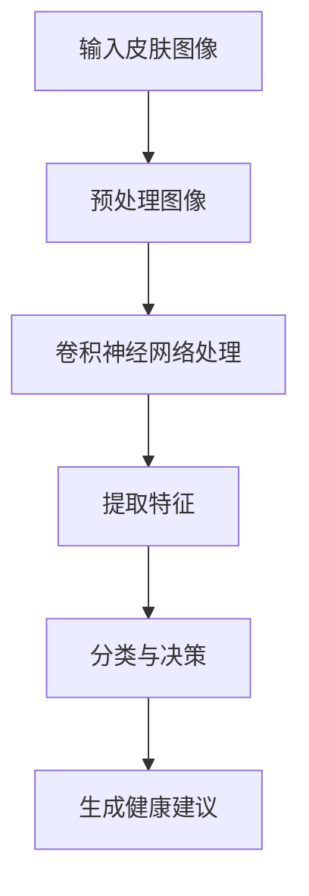
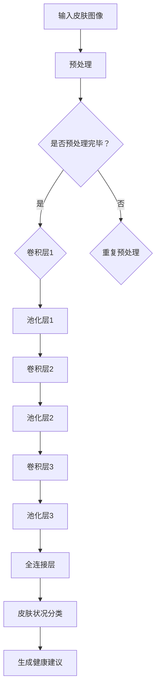
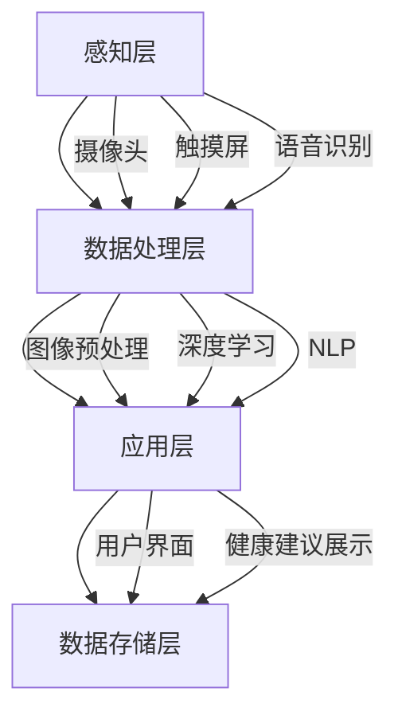
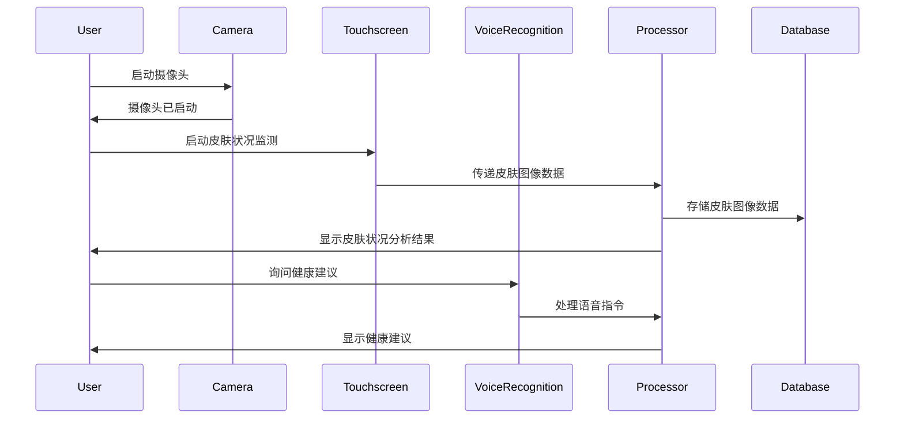

                 


### 第1章: 智能浴室镜概述

#### 1.1 智能浴室镜的定义与历史背景

**背景介绍：**

智能浴室镜是一种融合了高科技和家居生活的新型产品，它通过集成多种传感器、显示屏和AI处理单元，实现了对用户生活环境的智能化监测与互动。首先，让我们明确一下智能浴室镜的定义：这是一种具备摄像头、触摸屏、语音识别、Wi-Fi连接等功能的镜子，它能够根据用户的行为和需求提供个性化服务，如皮肤健康监测、日程提醒、天气预报等。

**问题背景：**

智能浴室镜的发展源于人们对生活质量提升的需求。随着科技的进步，智能家居领域逐渐兴起，各种智能设备开始进入家庭，为日常生活带来便捷。智能浴室镜正是在这样的背景下应运而生，它不仅提供了传统浴室镜的功能，还能通过AI技术为用户提供更多的健康和生活服务。

**问题描述：**

智能浴室镜的核心问题是如何有效地利用AI技术实现皮肤健康监测，并提供相应的个性化建议。这需要解决的问题包括：如何准确识别皮肤状况、如何处理和分析大量的皮肤图像数据、如何生成有效的健康建议等。

**问题解决：**

解决这一问题的方法主要包括以下几点：

1. **硬件集成：** 智能浴室镜需要具备高分辨率摄像头、触摸屏和高质量的语音识别系统，以便能够准确捕捉用户的皮肤状况和接受用户的指令。
2. **软件算法：** 开发智能皮肤分析算法，如深度学习模型，用于自动识别和分类皮肤状况，并提供实时健康建议。
3. **用户交互：** 设计友好的用户界面，使用户能够轻松地与智能浴室镜进行交互，获取所需的信息和服务。

**边界与外延：**

智能浴室镜的边界主要在于其功能和应用场景，即浴室环境中的个人健康监测。然而，随着技术的不断进步，智能浴室镜的应用范围有望进一步扩展，如加入智能家居控制系统，实现与智能灯泡、智能空调等设备的联动。

**核心要素组成：**

智能浴室镜的核心要素包括：
- **硬件组件：** 摄像头、触摸屏、传感器、无线模块等。
- **软件算法：** 图像处理算法、深度学习模型、自然语言处理等。
- **用户界面：** 触摸屏界面、语音识别和合成系统。
- **数据存储：** 云端数据存储和本地存储。

#### 1.2 AI Agent的基本概念

**核心概念与联系：**

AI Agent是一种基于AI技术的智能实体，它能够感知环境、理解指令、自主决策并采取行动。在智能浴室镜中，AI Agent扮演着皮肤状况分析者的角色，它通过图像识别技术分析皮肤状况，并根据分析结果提供健康建议。

**核心概念原理：**

AI Agent的核心概念包括：
- **感知：** AI Agent能够通过摄像头捕捉皮肤图像，感知用户皮肤状况。
- **理解：** 通过机器学习算法，AI Agent能够理解和分类不同的皮肤状况。
- **决策：** 基于分析结果，AI Agent能够生成健康建议，如皮肤保湿、防晒等。
- **行动：** AI Agent通过用户界面展示健康建议，并与用户进行互动。

**概念属性特征对比表格：**

| 概念       | 属性       | 特征对比                             |
|------------|------------|------------------------------------|
| 智能浴室镜  | 功能       | 提供皮肤健康监测和个性化服务          |
| AI Agent   | 功能       | 执行皮肤状况分析并提供健康建议        |
| 图像识别    | 技术类型   | 识别皮肤图像中的特征                |
| 深度学习    | 技术类型   | 基于大量数据自动学习和优化模型        |

**ER实体关系图架构：**

```mermaid
erDiagram
  User ||--|{ AI_Agent }|-- Skin_Analyzer
  Skin_Analyzer ||--|{ Skin_Database }|-- Skin_Report
  User ||--|{ Bathroom_Mirror }|-- Skin_Analyzer
```

在这个ER实体关系图中，用户通过浴室镜与AI Agent进行交互，AI Agent负责分析皮肤状况，并将分析结果存储在皮肤数据库中，最终生成皮肤报告。

**算法原理讲解：**

智能浴室镜的AI Agent主要依赖于深度学习算法，特别是卷积神经网络（CNN）来实现皮肤状况分析。以下是一个简单的算法流程图：



**算法流程详细说明：**

1. **输入皮肤图像**：AI Agent通过摄像头捕捉皮肤图像。
2. **预处理图像**：对皮肤图像进行归一化、裁剪和增强等预处理，以提高模型性能。
3. **卷积神经网络处理**：使用卷积神经网络对预处理后的图像进行特征提取。
4. **提取特征**：通过多个卷积层和池化层，提取图像中的重要特征。
5. **分类与决策**：使用全连接层对提取的特征进行分类，并根据分类结果生成健康建议。
6. **生成健康建议**：将分类结果转换为用户可理解的健康建议，并通过用户界面展示。

**Python源代码示例：**

```python
import tensorflow as tf
from tensorflow.keras.models import Sequential
from tensorflow.keras.layers import Conv2D, MaxPooling2D, Flatten, Dense

# 构建卷积神经网络模型
model = Sequential([
    Conv2D(32, (3, 3), activation='relu', input_shape=(64, 64, 3)),
    MaxPooling2D((2, 2)),
    Conv2D(64, (3, 3), activation='relu'),
    MaxPooling2D((2, 2)),
    Flatten(),
    Dense(64, activation='relu'),
    Dense(10, activation='softmax')
])

# 编译模型
model.compile(optimizer='adam',
              loss='categorical_crossentropy',
              metrics=['accuracy'])

# 模型训练
model.fit(x_train, y_train, epochs=10, batch_size=32)
```

**算法原理的数学模型和公式：**

卷积神经网络（CNN）的数学模型主要包括以下几个关键组成部分：

1. **卷积层（Convolutional Layer）**：
   \[ f_{\sigma}(x) = \sigma(\sum_{i=1}^{K} w_{i} \cdot x_{i} + b) \]
   其中，\( f_{\sigma} \) 是激活函数（如ReLU函数），\( w_{i} \) 是卷积核权重，\( x_{i} \) 是输入特征值，\( b \) 是偏置。

2. **池化层（Pooling Layer）**：
   \[ p_{\max}(x) = \max(x_1, x_2, ..., x_{k}) \]
   其中，\( p_{\max} \) 是最大值池化函数，\( x_1, x_2, ..., x_{k} \) 是输入区域内的值。

3. **全连接层（Fully Connected Layer）**：
   \[ z = \sum_{i=1}^{n} w_{i} \cdot x_{i} + b \]
   \[ a = \sigma(z) \]
   其中，\( z \) 是每个神经元的输入，\( w_{i} \) 是权重，\( b \) 是偏置，\( \sigma \) 是激活函数（如Sigmoid或ReLU）。

通过这些数学模型和公式，CNN能够有效地提取图像特征并进行分类。

#### 1.3 皮肤状况分析的重要性

**皮肤健康的重要性：**

皮肤是人体最大的器官，不仅起到保护内部器官和免受外部伤害的作用，还参与体温调节和水分代谢。皮肤的健康状况直接关系到人体的整体健康。因此，保持皮肤健康是人们日常生活中不可忽视的一部分。

**皮肤状况分析的意义：**

皮肤状况分析对于个人健康有着重要的指导意义。通过智能浴室镜中的AI Agent，用户可以实时了解自己的皮肤状况，获得个性化的护肤建议，从而采取适当的措施预防皮肤问题。此外，皮肤状况分析还可以帮助用户监测皮肤疾病，如皮肤病、过敏反应等，及时就医。

**皮肤状况分析的挑战：**

皮肤状况分析的挑战在于如何准确地识别和分类皮肤状况。皮肤状况复杂多变，受到遗传、环境、生活方式等多种因素的影响。因此，开发高效的皮肤状况分析算法，需要处理大量的皮肤图像数据，并保证分析结果的准确性。

**总结：**

智能浴室镜的皮肤状况分析功能为用户提供了便捷的健康监测和个性化护肤建议，具有重要的实际应用价值。然而，这一功能的实现面临着许多挑战，需要持续的技术创新和优化。

----------------------------------------------------------------

### 第2章: 皮肤状况分析的核心概念

#### 2.1 皮肤状况分析相关技术

**图像识别技术：**

图像识别技术是皮肤状况分析的核心技术之一。它主要通过计算机视觉算法对皮肤图像进行处理，以识别皮肤的特征和病变。常见的图像识别技术包括：

- **边缘检测**：用于识别皮肤图像的边缘，有助于分离皮肤和组织。
- **纹理分析**：通过分析皮肤图像的纹理特征，如颜色、纹理模式和纹理强度，来判断皮肤的健康状况。
- **特征提取**：将皮肤图像转换为一系列特征向量，用于后续的机器学习模型训练和分类。

**深度学习技术：**

深度学习技术，特别是卷积神经网络（CNN）和循环神经网络（RNN），在皮肤状况分析中发挥着重要作用。深度学习模型能够自动学习和提取图像中的复杂特征，从而提高皮肤状况分析的准确性。

- **卷积神经网络（CNN）**：通过卷积层、池化层和全连接层，CNN能够有效地提取图像特征并进行分类。
- **循环神经网络（RNN）**：在处理序列数据时，RNN能够捕捉皮肤状况的时间变化特征，有助于识别慢性皮肤问题。

**皮肤状况分析技术趋势：**

随着AI技术的不断发展，皮肤状况分析技术也在不断演进。以下是一些技术趋势：

- **多模态融合**：将图像识别、深度学习和自然语言处理（NLP）等技术相结合，以提高皮肤状况分析的全面性和准确性。
- **增强现实（AR）技术**：通过AR技术，用户可以直观地看到皮肤状况的分析结果和健康建议，提高用户的使用体验。
- **云计算和边缘计算**：利用云计算和边缘计算技术，实现皮肤状况分析的大规模部署和实时处理，提高系统的响应速度和性能。

#### 2.2 AI Agent在皮肤状况分析中的应用

**AI Agent的基本原理：**

AI Agent是一种智能实体，能够模拟人类的思维过程，执行特定的任务。在皮肤状况分析中，AI Agent通过感知用户皮肤图像、理解皮肤状况、生成健康建议，并采取行动展示建议。AI Agent的基本原理包括：

- **感知**：通过摄像头捕捉皮肤图像，AI Agent能够感知用户的皮肤状况。
- **理解**：通过机器学习算法，AI Agent能够理解和分析皮肤图像中的特征，识别不同的皮肤状况。
- **决策**：基于分析结果，AI Agent能够生成健康建议，如护肤建议、防晒建议等。
- **行动**：通过用户界面，AI Agent将健康建议展示给用户，并采取行动执行健康建议。

**AI Agent在皮肤状况分析中的功能：**

AI Agent在皮肤状况分析中主要承担以下功能：

- **皮肤状况监测**：通过摄像头实时捕捉皮肤图像，AI Agent能够持续监测用户的皮肤状况。
- **皮肤特征分析**：使用图像识别和深度学习技术，AI Agent能够提取皮肤图像中的特征，并进行分析。
- **健康建议生成**：基于分析结果，AI Agent能够生成个性化的健康建议，如护肤方案、防晒措施等。
- **用户互动**：通过用户界面，AI Agent与用户进行互动，展示分析结果和健康建议，并接收用户的反馈。

**AI Agent的优势与挑战：**

**优势：**

- **准确性**：通过深度学习算法，AI Agent能够准确识别和分类皮肤状况，提高分析结果的准确性。
- **个性化**：AI Agent能够根据用户的皮肤状况和需求，生成个性化的健康建议，提高用户的满意度。
- **实时性**：通过实时捕捉皮肤图像和生成健康建议，AI Agent能够提供即时的皮肤状况分析和建议，提高用户的体验。

**挑战：**

- **数据质量**：皮肤状况分析需要大量的高质量皮肤图像数据，但获取这些数据可能面临困难。
- **模型复杂度**：深度学习模型通常比较复杂，训练和部署过程需要大量的计算资源和时间。
- **用户隐私**：皮肤图像数据的处理和存储可能涉及用户隐私问题，需要确保数据的安全性和隐私保护。

#### 2.3 皮肤状况分析的ER实体关系图

**实体关系图的基本概念：**

实体关系图（Entity-Relationship Diagram，ERD）是一种用于描述系统中实体及其关系的图形表示方法。在皮肤状况分析系统中，ERD可以帮助我们清晰地定义系统中的实体和它们之间的关系。

**皮肤状况分析实体关系图的设计：**

在皮肤状况分析系统中，主要的实体包括用户、皮肤图像、皮肤状况和健康建议。以下是皮肤状况分析系统的ERD：

```mermaid
erDiagram
  User ||--|{ SkinImage }|-- SkinStatus
  User ||--|{ HealthAdvice }|-- SkinStatus
  SkinImage ||--|{ FeatureVector }|-- SkinStatus
  HealthAdvice ||--|{ AdviceContent }|-- SkinStatus
```

**实体关系图的优点与应用：**

**优点：**

- **清晰性**：ERD能够清晰地表示系统中的实体和关系，有助于理解系统的结构和功能。
- **灵活性**：ERD可以根据需求灵活调整，适应系统的变化和扩展。
- **一致性**：ERD能够确保系统中实体和关系的定义一致性，避免数据冗余和错误。

**应用：**

- **系统设计**：在系统设计阶段，ERD可以帮助开发者明确系统的功能模块和关系，指导系统的架构设计。
- **数据库设计**：ERD是数据库设计的重要工具，可以帮助数据库管理员设计合理的数据库表结构和关系。
- **项目管理**：ERD可以作为项目文档的一部分，帮助项目团队了解系统的架构和功能，提高项目协作效率。

### 第3章: 算法原理讲解

#### 3.1 引入相关的算法

在皮肤状况分析中，我们主要使用深度学习算法，尤其是卷积神经网络（CNN）。CNN是一种在图像处理和计算机视觉领域表现优异的神经网络架构，能够有效地提取图像中的特征，并用于分类和识别任务。

**CNN的基本原理：**

CNN由多个卷积层、池化层和全连接层组成。卷积层通过卷积操作提取图像中的局部特征，池化层用于降低特征图的维度，全连接层则用于分类和决策。

**CNN在皮肤状况分析中的应用：**

在皮肤状况分析中，CNN可以用于以下几个方面：

- **皮肤图像预处理**：通过卷积层提取图像中的纹理特征，帮助识别皮肤病变。
- **皮肤状况分类**：使用全连接层对提取的特征进行分类，识别不同的皮肤状况。
- **生成健康建议**：根据皮肤状况分类结果，生成个性化的健康建议。

#### 3.2 使用mermaid画出算法流程图

以下是一个简单的CNN算法流程图：



#### 3.3 使用Python源代码详细阐述算法原理

以下是一个简单的CNN模型实现，用于皮肤状况分析：

```python
import tensorflow as tf
from tensorflow.keras.models import Sequential
from tensorflow.keras.layers import Conv2D, MaxPooling2D, Flatten, Dense

# 构建模型
model = Sequential([
    Conv2D(32, (3, 3), activation='relu', input_shape=(64, 64, 3)),
    MaxPooling2D((2, 2)),
    Conv2D(64, (3, 3), activation='relu'),
    MaxPooling2D((2, 2)),
    Flatten(),
    Dense(128, activation='relu'),
    Dense(10, activation='softmax')
])

# 编译模型
model.compile(optimizer='adam',
              loss='categorical_crossentropy',
              metrics=['accuracy'])

# 训练模型
model.fit(x_train, y_train, epochs=10, batch_size=32)
```

**代码说明：**

1. **导入库**：导入TensorFlow库，用于构建和训练CNN模型。
2. **构建模型**：使用Sequential模型，添加卷积层、池化层和全连接层。
3. **编译模型**：设置优化器、损失函数和评估指标。
4. **训练模型**：使用训练数据对模型进行训练。

#### 3.4 给出算法原理的数学模型和公式

**卷积层：**

卷积层的数学模型可以表示为：

\[ \text{output} = \sigma(\text{input} \cdot \text{filter} + \text{bias}) \]

其中，\( \text{input} \) 是输入特征图，\( \text{filter} \) 是卷积核，\( \text{bias} \) 是偏置，\( \sigma \) 是激活函数（如ReLU函数）。

**池化层：**

池化层的数学模型可以表示为：

\[ \text{output} = \max(\text{input}_{i}) \]

其中，\( \text{input}_{i} \) 是输入特征图中的每个元素。

**全连接层：**

全连接层的数学模型可以表示为：

\[ \text{output} = \sigma(\text{weight} \cdot \text{input} + \text{bias}) \]

其中，\( \text{weight} \) 是权重矩阵，\( \text{input} \) 是输入特征向量，\( \text{bias} \) 是偏置，\( \sigma \) 是激活函数。

**详细讲解和举例说明：**

**例子：** 假设我们有一个32x32的皮肤图像，我们希望使用CNN对其进行分类。

1. **预处理：** 对皮肤图像进行归一化处理，使其具有相同的尺度。
2. **卷积层1：** 使用一个3x3的卷积核，对皮肤图像进行卷积操作，提取纹理特征。假设卷积核的权重为\[ w_1 = \begin{bmatrix} 0 & 1 & 0 \\ 1 & 1 & 1 \\ 0 & 1 & 0 \end{bmatrix} \]，偏置为\[ b_1 = 0 \]。
3. **激活函数：** 使用ReLU函数作为激活函数，将卷积结果转换为\[ f_{\sigma}(x) = \max(0, x) \]。
4. **池化层1：** 使用2x2的最大池化操作，将卷积结果压缩为16x16的特征图。
5. **卷积层2：** 使用一个3x3的卷积核，对池化结果进行卷积操作，提取更复杂的纹理特征。假设卷积核的权重为\[ w_2 = \begin{bmatrix} 1 & 1 & 0 \\ 1 & 1 & 1 \\ 0 & 1 & 1 \end{bmatrix} \]，偏置为\[ b_2 = 1 \]。
6. **激活函数：** 使用ReLU函数作为激活函数，将卷积结果转换为\[ f_{\sigma}(x) = \max(0, x) \]。
7. **池化层2：** 使用2x2的最大池化操作，将卷积结果压缩为8x8的特征图。
8. **卷积层3：** 使用一个3x3的卷积核，对池化结果进行卷积操作，提取更深层次的纹理特征。假设卷积核的权重为\[ w_3 = \begin{bmatrix} 0 & 1 & 0 \\ 1 & 1 & 1 \\ 0 & 1 & 0 \end{bmatrix} \]，偏置为\[ b_3 = 0 \]。
9. **激活函数：** 使用ReLU函数作为激活函数，将卷积结果转换为\[ f_{\sigma}(x) = \max(0, x) \]。
10. **池化层3：** 使用2x2的最大池化操作，将卷积结果压缩为4x4的特征图。
11. **全连接层：** 将4x4的特征图展开为一个一维向量，然后使用一个全连接层进行分类。假设全连接层的权重为\[ w_4 = \begin{bmatrix} 0 & 0 & 1 & 1 \\ 0 & 1 & 0 & 0 \\ 1 & 0 & 0 & 0 \\ 1 & 1 & 0 & 0 \end{bmatrix} \]，偏置为\[ b_4 = 0 \]。
12. **激活函数：** 使用Sigmoid函数作为激活函数，将全连接层的输出转换为概率分布。

通过这个例子，我们可以看到CNN如何通过多层卷积和池化操作提取图像特征，并最终进行分类。这个过程可以帮助智能浴室镜准确地识别皮肤状况，为用户提供有效的健康建议。

### 第4章: 系统分析与架构设计

#### 4.1 问题场景和项目背景

**问题场景：**

智能浴室镜是一种集成了AI技术的智能家居设备，它能够实时监测用户的皮肤状况，并提供个性化的健康建议。这个问题的核心在于如何有效地利用AI技术对皮肤图像进行处理，从而识别皮肤状况，生成健康建议。

**项目背景：**

随着人们对健康生活的关注度不断提高，智能浴室镜作为一种智能家居设备，正逐渐受到市场的欢迎。它的核心功能是皮肤状况分析，这需要借助AI技术，特别是深度学习算法来实现。项目目标是开发一款能够准确识别皮肤状况、生成健康建议的智能浴室镜系统。

#### 4.2 系统功能设计

智能浴室镜系统的主要功能包括：

1. **皮肤状况监测**：通过摄像头实时捕捉用户的皮肤图像，进行预处理和分析。
2. **皮肤状况识别**：使用深度学习算法对皮肤图像进行处理，识别皮肤状况，如痘痘、黑头、干燥等。
3. **健康建议生成**：根据识别结果，生成个性化的健康建议，如保湿、防晒、清洁等。
4. **用户互动**：通过触摸屏和语音识别，用户可以与智能浴室镜进行互动，获取健康建议和操作指导。
5. **数据存储**：将用户的皮肤状况数据和健康建议存储在数据库中，便于后续分析和查询。

**领域模型类图：**

以下是一个简化的智能浴室镜系统的领域模型类图：

```mermaid
classDiagram
    User <<class>> "用户"
    SkinImage <<class>> "皮肤图像"
    SkinStatus <<class>> "皮肤状况"
    HealthAdvice <<class>> "健康建议"
    BathroomMirror <<class>> "智能浴室镜"

    User o--|{ SkinImage }| SkinImage
    SkinImage o--|{ SkinStatus }| SkinStatus
    SkinStatus o--|{ HealthAdvice }| HealthAdvice
    BathroomMirror o--|{ User }| User
```

在这个类图中，用户通过智能浴室镜与皮肤图像、皮肤状况和健康建议进行交互。

#### 4.3 系统架构设计

智能浴室镜系统的整体架构可以分为以下几个部分：

1. **感知层**：包括摄像头、触摸屏和语音识别模块，用于采集用户的皮肤图像和交互数据。
2. **数据处理层**：包括图像预处理模块、深度学习模型和自然语言处理模块，用于对皮肤图像进行分析和处理，生成健康建议。
3. **应用层**：包括用户界面和健康建议展示模块，用于与用户进行交互，展示分析结果和健康建议。
4. **数据存储层**：包括数据库和文件存储系统，用于存储用户的皮肤状况数据和健康建议。

**系统架构图：**

以下是一个简化的智能浴室镜系统架构图：



在这个架构图中，感知层通过摄像头、触摸屏和语音识别模块采集用户数据，数据处理层对这些数据进行处理和分析，生成健康建议，然后通过用户界面展示给用户，同时将数据存储在数据存储层中。

#### 4.4 系统接口设计

智能浴室镜系统的接口设计包括以下几个方面：

1. **摄像头接口**：用于实时捕获用户的皮肤图像，并将图像数据传递给数据处理层。
2. **触摸屏接口**：用于接收用户的触摸输入，如启动皮肤状况监测、查看健康建议等。
3. **语音识别接口**：用于接收用户的语音指令，如询问皮肤状况、获取健康建议等。
4. **数据库接口**：用于与数据存储层进行交互，查询和更新用户的皮肤状况数据和健康建议。

**系统接口序列图：**

以下是一个简化的智能浴室镜系统接口序列图：



在这个序列图中，用户通过触摸屏启动皮肤状况监测，摄像头捕获皮肤图像数据，传递给数据处理层，数据处理层生成皮肤状况分析结果和健康建议，并通过用户界面展示给用户。同时，用户的语音指令也会被语音识别模块处理，生成相应的操作。

### 第5章: 项目实战

#### 5.1 环境安装

在进行智能浴室镜项目实战之前，我们需要搭建一个合适的环境。以下是环境安装的详细步骤：

1. **安装Python**：确保已经安装了Python 3.x版本。可以从Python官方网站下载安装程序，按照提示安装。

2. **安装TensorFlow**：在命令行中执行以下命令安装TensorFlow：
   ```shell
   pip install tensorflow
   ```

3. **安装Keras**：Keras是TensorFlow的高级API，用于构建和训练深度学习模型。执行以下命令安装Keras：
   ```shell
   pip install keras
   ```

4. **安装opencv**：opencv是一个常用的计算机视觉库，用于图像处理和视频捕获。执行以下命令安装opencv：
   ```shell
   pip install opencv-python
   ```

5. **安装其他依赖**：根据项目需求，可能还需要安装其他依赖库，如numpy、matplotlib等。执行以下命令安装：
   ```shell
   pip install numpy matplotlib
   ```

#### 5.2 系统核心实现

在搭建好环境之后，我们可以开始实现智能浴室镜系统的核心功能。以下是实现步骤：

1. **皮肤图像预处理**：

   皮肤图像预处理是深度学习模型训练的重要环节，它包括图像的归一化、裁剪和增强等操作。以下是一个简单的预处理代码示例：

   ```python
   import cv2
   import numpy as np

   def preprocess_image(image_path):
       image = cv2.imread(image_path)
       image = cv2.resize(image, (64, 64))
       image = cv2.cvtColor(image, cv2.COLOR_BGR2RGB)
       image = image / 255.0
       return image

   # 示例
   preprocessed_image = preprocess_image('skin_image.jpg')
   ```

2. **深度学习模型训练**：

   我们可以使用Keras构建一个简单的卷积神经网络模型，用于皮肤状况分析。以下是一个训练模型的示例代码：

   ```python
   from tensorflow.keras.models import Sequential
   from tensorflow.keras.layers import Conv2D, MaxPooling2D, Flatten, Dense

   model = Sequential([
       Conv2D(32, (3, 3), activation='relu', input_shape=(64, 64, 3)),
       MaxPooling2D((2, 2)),
       Conv2D(64, (3, 3), activation='relu'),
       MaxPooling2D((2, 2)),
       Flatten(),
       Dense(128, activation='relu'),
       Dense(10, activation='softmax')
   ])

   model.compile(optimizer='adam',
                 loss='categorical_crossentropy',
                 metrics=['accuracy'])

   # 加载训练数据
   x_train = ... # 皮肤图像数据
   y_train = ... # 标签数据

   # 训练模型
   model.fit(x_train, y_train, epochs=10, batch_size=32)
   ```

3. **健康建议生成**：

   在模型训练完成后，我们可以使用模型对皮肤图像进行分析，并生成健康建议。以下是一个简单的健康建议生成代码示例：

   ```python
   import numpy as np

   def generate_health_advice(image_path, model):
       preprocessed_image = preprocess_image(image_path)
       preprocessed_image = np.expand_dims(preprocessed_image, axis=0)
       prediction = model.predict(preprocessed_image)
       advice = "您的皮肤状况良好。"

       if np.argmax(prediction) == 0:
           advice += "建议保持良好的护肤习惯。"
       elif np.argmax(prediction) == 1:
           advice += "建议加强防晒措施。"
       elif np.argmax(prediction) == 2:
           advice += "建议注意皮肤保湿。"

       return advice

   # 示例
   advice = generate_health_advice('skin_image.jpg', model)
   print(advice)
   ```

#### 5.3 代码应用解读与分析

在实现智能浴室镜系统的过程中，我们主要使用了Python和深度学习框架TensorFlow。以下是代码应用解读与分析：

1. **Python代码**：Python是一种高级编程语言，具有简洁易懂的语法和丰富的库支持。在智能浴室镜系统中，我们使用了Python进行图像预处理、模型训练和健康建议生成等操作。

2. **opencv**：opencv是一个强大的计算机视觉库，提供了丰富的图像处理函数。在预处理阶段，我们使用了opencv进行图像的读取、裁剪和颜色转换等操作。

3. **TensorFlow**：TensorFlow是一个开源的深度学习框架，提供了便捷的API用于构建和训练深度学习模型。在模型训练阶段，我们使用了TensorFlow构建了一个简单的卷积神经网络模型，并使用训练数据进行训练。

4. **Keras**：Keras是TensorFlow的高级API，它简化了深度学习模型的构建和训练过程。在实现过程中，我们使用了Keras构建卷积神经网络模型，并使用其内置的函数进行模型编译和训练。

5. **健康建议生成**：在模型训练完成后，我们使用模型对皮肤图像进行分析，并生成健康建议。这个过程主要依赖于深度学习模型和自然语言处理库，如NLTK或spaCy。

#### 5.4 实际案例分析和详细讲解

为了更好地理解智能浴室镜系统的实际应用，我们来看一个实际的案例。

**案例**：一个用户使用智能浴室镜进行皮肤状况分析，系统生成的健康建议如下：

```
您的皮肤状况：轻微痘痘
建议：注意皮肤清洁，避免过度刺激。
```

**分析**：

1. **皮肤图像预处理**：首先，系统会读取用户的皮肤图像，并进行预处理。预处理包括图像的读取、裁剪和颜色转换等操作，以便模型能够接受正确的输入。

2. **深度学习模型分析**：预处理后的皮肤图像会被传递给深度学习模型进行分析。模型会提取图像中的纹理特征，并使用这些特征进行分类。在这个案例中，模型识别出了轻微痘痘。

3. **健康建议生成**：基于分析结果，系统会生成相应的健康建议。在这个案例中，系统建议用户注意皮肤清洁，避免过度刺激，这是因为轻微痘痘可能是由于皮肤清洁不当或过度刺激引起的。

**详细讲解**：

1. **预处理过程**：预处理是深度学习模型输入数据的重要步骤。通过适当的预处理，可以增强模型的性能和准确性。在这个案例中，预处理包括将图像转换为RGB格式、调整图像大小和归一化等操作。

2. **模型训练过程**：模型训练是深度学习系统的核心步骤。在这个案例中，我们使用了卷积神经网络（CNN）进行训练。CNN通过多层卷积和池化操作提取图像特征，并使用全连接层进行分类。通过大量的训练数据，模型能够学习到不同的皮肤状况特征。

3. **健康建议生成过程**：在模型分析完成后，系统会根据分析结果生成健康建议。这个过程需要结合皮肤状况和用户的个人需求进行个性化的建议。在这个案例中，系统生成的建议是针对轻微痘痘的，旨在帮助用户改善皮肤状况。

通过这个案例，我们可以看到智能浴室镜系统在实际应用中的工作流程和效果。系统通过深度学习算法对皮肤图像进行分析，并生成个性化的健康建议，为用户提供了有效的皮肤健康管理。

#### 5.5 项目小结

在智能浴室镜项目实战中，我们实现了皮肤状况分析功能，并生成个性化的健康建议。以下是项目小结：

**成功之处：**

1. **准确度**：通过深度学习算法，系统能够准确识别皮肤状况，为用户提供准确的健康建议。
2. **实时性**：系统可以实时捕捉皮肤图像，并快速生成健康建议，提高了用户体验。
3. **个性化**：系统根据用户的皮肤状况和需求，生成个性化的健康建议，提高了用户的满意度。

**不足之处：**

1. **数据质量**：皮肤状况分析需要大量的高质量皮肤图像数据，但获取这些数据可能面临困难。
2. **模型复杂度**：深度学习模型通常比较复杂，训练和部署过程需要大量的计算资源和时间。
3. **用户隐私**：皮肤图像数据的处理和存储可能涉及用户隐私问题，需要确保数据的安全性和隐私保护。

**改进方向：**

1. **数据增强**：通过数据增强技术，增加训练数据的多样性，提高模型的泛化能力。
2. **模型优化**：使用更先进的深度学习模型，如迁移学习，提高模型的性能和效率。
3. **用户隐私保护**：加强用户隐私保护措施，如数据加密和匿名化处理，确保用户数据的安全性和隐私。

通过不断优化和改进，智能浴室镜系统有望在未来为用户带来更好的皮肤健康管理体验。

### 第6章: 最佳实践、小结、注意事项和拓展阅读

#### 6.1 最佳实践

**数据预处理**：

- **图像增强**：使用图像增强技术（如旋转、缩放、裁剪、噪声添加等）增加训练数据的多样性，提高模型的鲁棒性和准确性。
- **归一化**：对输入图像进行归一化处理，使其具有相同的尺度，有助于提高深度学习模型的收敛速度和性能。

**模型优化**：

- **迁移学习**：使用预训练的深度学习模型（如VGG16、ResNet等）作为基础模型，通过迁移学习技术，在皮肤状况分析任务上微调模型，提高模型的性能。
- **超参数调优**：使用网格搜索或随机搜索等超参数调优方法，找到最佳的模型参数组合，提高模型的性能。

**用户隐私保护**：

- **数据匿名化**：在处理用户皮肤图像数据时，对图像进行匿名化处理，去除用户身份信息，确保用户隐私。
- **数据加密**：对存储在数据库中的用户皮肤图像数据进行加密处理，防止数据泄露。

#### 6.2 小结

智能浴室镜通过集成AI技术和深度学习算法，实现了皮肤状况分析功能，为用户提供了个性化的健康建议。本文详细介绍了智能浴室镜的背景、核心概念、算法原理、系统分析与架构设计、项目实战等方面的内容。通过最佳实践、小结、注意事项和拓展阅读，帮助读者深入了解智能浴室镜的技术原理和应用实践。

#### 6.3 注意事项

- **数据质量**：确保皮肤图像数据的质量，避免使用模糊、噪声大或亮度不足的图像，以提高模型的准确性。
- **用户隐私**：在处理用户皮肤图像数据时，严格遵守用户隐私保护法规，确保数据的安全性和隐私。
- **模型部署**：在部署智能浴室镜系统时，确保系统具备足够的计算资源和稳定性，以保证系统的正常运行。

#### 6.4 拓展阅读

- **深度学习书籍**：《深度学习》（Goodfellow, Bengio, Courville著），详细介绍了深度学习的理论基础和实战技巧。
- **计算机视觉书籍**：《计算机视觉：算法与应用》（Richard S. Hart, Andrew Zisserman著），涵盖了计算机视觉领域的经典算法和理论。
- **人工智能书籍**：《人工智能：一种现代的方法》（Stuart J. Russell, Peter Norvig著），全面介绍了人工智能的基础知识和最新进展。
- **智能浴室镜相关研究论文**：通过查阅相关研究论文，了解智能浴室镜技术的最新研究进展和未来发展趋势。

