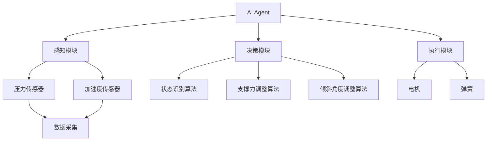
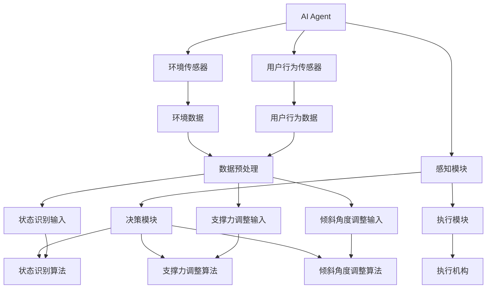
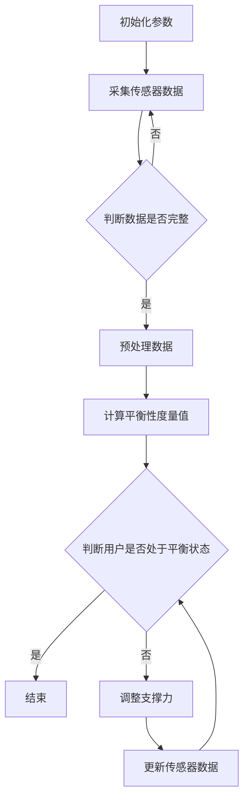
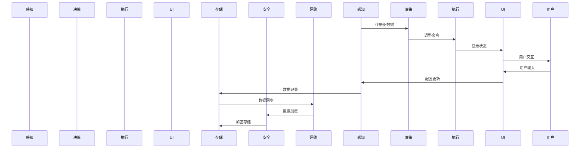
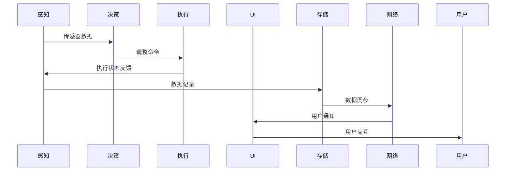

                 

### 摘要

智能浴室防滑垫是现代智能家居技术的重要组成部分，其核心在于通过AI Agent实现动态平衡能力评估，从而提升用户的使用安全和体验。本文旨在深入探讨智能浴室防滑垫中的AI Agent平衡能力评估机制。首先，我们将介绍智能浴室防滑垫的背景和应用场景，随后定义AI Agent和相关平衡能力评估的概念，并逐步分析其原理、数学模型及公式。接着，我们将从系统架构设计、环境配置、核心实现等方面详细描述平衡能力评估的实战应用。最后，本文将总结最佳实践、注意事项，并展望未来发展趋势，以期为智能浴室防滑垫的进一步发展提供有益参考。

----------------------------------------------------------------

# 智能浴室防滑垫：AI Agent的平衡能力评估

关键词：智能浴室防滑垫，AI Agent，平衡能力评估，算法原理，数学模型，系统架构，项目实战

> 摘要：本文深入探讨了智能浴室防滑垫中的AI Agent平衡能力评估机制。首先，我们介绍了智能浴室防滑垫的背景和应用场景，随后定义了AI Agent和相关平衡能力评估的概念。接着，我们详细分析了平衡能力评估的原理、数学模型及公式，并通过Python代码进行了实际应用讲解。此外，我们还介绍了系统架构设计、环境配置和核心实现，以及项目实战的详细分析。最后，本文总结了最佳实践、注意事项，并展望了未来发展趋势。本文旨在为智能浴室防滑垫的进一步发展提供有益参考。

----------------------------------------------------------------

## 引言：智能浴室防滑垫与AI Agent

### 1.1 智能浴室防滑垫的背景与需求

智能浴室防滑垫是现代家居安全领域的一项创新技术。随着智能家居市场的快速发展，人们对于家居安全、舒适和便捷的需求日益增长。浴室作为家居环境中相对潮湿、滑动的区域，防滑垫的必要性尤为突出。传统浴室防滑垫多以橡胶、塑料等材质制成，虽然具备一定的防滑效果，但在智能性和适应性方面存在明显不足。智能浴室防滑垫应运而生，通过集成传感器、人工智能等先进技术，实现了动态平衡能力评估，提高了防滑效果和用户体验。

### 1.2 AI Agent的概念与发展

AI Agent，即人工智能代理，是人工智能领域的一个重要概念。AI Agent指的是一种能够独立执行任务、具备一定智能水平的计算机程序。它能够模拟人类的行为，具备感知、决策、执行等能力。AI Agent的发展历程可以追溯到20世纪50年代，当时图灵提出图灵测试，标志着人工智能研究的开端。随着计算机技术的发展，AI Agent逐渐从理论走向实践，应用领域不断拓展，包括智能客服、智能驾驶、智能家居等。

在智能浴室防滑垫中，AI Agent的应用尤为重要。它通过实时监测浴室环境，如温度、湿度、压力等，分析用户的动态行为，实时调整防滑垫的平衡能力，确保用户在潮湿、滑动环境中保持稳定。AI Agent的发展不仅提高了智能浴室防滑垫的性能，还为实现智能家居的全面智能化奠定了基础。

### 1.3 平衡能力评估的意义与挑战

平衡能力评估是智能浴室防滑垫的核心功能之一。它通过对用户在防滑垫上行为的实时监测和分析，评估用户的平衡能力，并据此调整防滑垫的支撑力和稳定性。平衡能力评估的意义在于：

1. **提高使用安全性**：通过动态调整防滑垫的平衡能力，智能浴室防滑垫能够更好地适应不同用户和不同环境，降低用户滑倒的风险，提高使用安全性。

2. **提升用户体验**：智能浴室防滑垫可以根据用户的身高、体重、行为习惯等个人特征，提供个性化的平衡支持，提升用户体验。

然而，平衡能力评估也面临着一些挑战：

1. **数据采集与处理**：平衡能力评估需要实时采集用户和环境数据，如压力、温度、湿度等，数据采集的准确性和实时性是一个重要挑战。

2. **算法复杂性**：平衡能力评估涉及到复杂的算法和数学模型，算法的准确性和实时性是一个重要难题。

3. **硬件限制**：智能浴室防滑垫的硬件资源有限，如何在有限的资源下实现高效的平衡能力评估，是一个亟待解决的问题。

本文将围绕智能浴室防滑垫中的AI Agent平衡能力评估，详细探讨其原理、算法、系统架构和实战应用，以期为其进一步发展提供有益参考。

### 1.4 背景介绍

智能浴室防滑垫的出现并非偶然，而是科技发展和市场需求共同推动的结果。随着人们对家居安全和舒适性的要求越来越高，传统防滑垫已经不能满足现代家庭的需求。智能浴室防滑垫通过集成传感器和人工智能技术，实现了对浴室环境的实时监测和用户行为的动态分析，从而在防滑和安全方面取得了显著提升。

首先，从技术发展的角度来看，人工智能技术的迅速进步为智能浴室防滑垫的研发提供了坚实的基础。特别是深度学习、机器学习和计算机视觉等领域的突破，使得AI Agent能够在复杂的动态环境中进行高效的决策和执行。例如，通过图像识别技术，智能浴室防滑垫可以实时捕捉用户的行为，分析用户的姿态和平衡状态，从而实现精准的防滑控制。

其次，从市场需求角度来看，随着人口老龄化趋势的加剧，老年人对家居安全的需求愈发迫切。智能浴室防滑垫作为一种智能家居产品，可以显著降低老年人因摔倒而导致的意外伤害风险，提高他们的生活质量。此外，对于有孩子的家庭来说，浴室防滑垫的安全性和舒适性也是选择的重要因素。通过智能化的平衡能力评估，智能浴室防滑垫能够为家庭提供更加个性化的保护，提升整体的生活体验。

然而，智能浴室防滑垫的研发和应用也面临一些挑战。首先，如何确保数据采集的准确性和实时性是一个关键问题。浴室环境复杂多变，湿度、温度等参数的变化会影响防滑垫的性能。因此，需要开发出高精度的传感器，以及能够实时处理大量数据的高效算法。其次，AI Agent的算法复杂性和硬件限制也是一个亟待解决的问题。在有限的硬件资源下，如何设计出既高效又准确的算法，是智能浴室防滑垫研发的关键。

此外，智能浴室防滑垫还需要考虑到用户隐私和数据安全的问题。在数据采集和传输过程中，如何确保用户数据的安全，避免泄露，是一个重要的伦理和技术挑战。

总之，智能浴室防滑垫的研发和应用是一个多学科交叉的复杂过程，涉及人工智能、传感器技术、数据挖掘等多个领域。通过持续的技术创新和优化，智能浴室防滑垫有望在未来的智能家居市场中占据重要地位，为人们的家居生活带来更多的安全、便捷和舒适。

### 1.5 问题描述

在智能浴室防滑垫的应用中，平衡能力评估是一个关键问题。具体来说，智能浴室防滑垫需要实时监测用户在防滑垫上的动态行为，并根据用户的平衡状态进行自适应调整，以确保用户的安全和舒适。这个问题可以进一步细分为以下几个子问题：

1. **数据采集与预处理**：智能浴室防滑垫需要通过传感器实时采集用户的体重、压力分布、浴室环境（如温度、湿度）等数据。然而，这些数据可能存在噪声、缺失值或延迟等问题，需要进行预处理，以提高数据的质量和可靠性。

2. **平衡状态识别**：基于采集到的数据，智能浴室防滑垫需要实时判断用户的平衡状态。例如，当用户处于站立、行走、蹲下等不同姿态时，其压力分布和重心位置都会发生变化。识别这些变化对于平衡能力评估至关重要。

3. **自适应调整机制**：一旦识别出用户的平衡状态，智能浴室防滑垫需要根据平衡状态进行自适应调整。例如，通过改变防滑垫的支撑力、倾斜角度等参数，来优化用户的平衡能力。

4. **算法优化与实时性**：平衡能力评估算法需要高效且准确，以确保实时响应。在硬件资源有限的情况下，如何优化算法，使其在保证准确性的同时，具有较低的延迟和计算复杂度，是一个重要挑战。

5. **用户个性化与安全性**：智能浴室防滑垫需要能够根据不同用户的个人特征（如身高、体重、行动习惯等）进行个性化调整，以提高其适用性和安全性。这要求算法能够有效处理用户的个性化数据，并确保在多种环境下都能提供可靠的平衡支持。

6. **数据隐私与安全**：在数据采集、传输和处理过程中，必须确保用户数据的隐私和安全，防止数据泄露或滥用。这是智能浴室防滑垫设计和应用中的一个重要伦理和技术问题。

通过上述子问题的分析和解决，智能浴室防滑垫可以更好地实现其核心功能，提升用户的居家安全和生活质量。

### 1.6 解决方法

为了解决智能浴室防滑垫中平衡能力评估的问题，我们需要采取一系列的方法和技术。以下是一种可能的解决方案：

1. **多传感器融合**：在智能浴室防滑垫中，集成多种传感器，如压力传感器、加速度传感器、温度传感器和湿度传感器等，用于实时采集用户的体重、压力分布、运动状态和环境参数。通过多传感器数据融合，可以更准确地获取用户的动态行为。

2. **数据预处理与清洗**：对采集到的数据进行预处理和清洗，包括去除噪声、填补缺失值、标准化处理等，以提高数据的质量和可靠性。

3. **动态平衡状态识别算法**：利用机器学习和深度学习算法，对预处理后的数据进行平衡状态识别。例如，通过训练卷积神经网络（CNN）或循环神经网络（RNN）模型，可以实现对用户不同姿态和平衡状态的准确识别。

4. **自适应调整机制**：根据平衡状态识别的结果，智能浴室防滑垫需要实时调整支撑力和倾斜角度等参数。例如，使用PID（比例-积分-微分）控制器或自适应控制算法，可以实现自适应调整。

5. **个性化用户数据模型**：建立个性化用户数据模型，根据用户的身高、体重、行动习惯等特征，进行个性化调整。这可以通过用户画像技术实现，将用户数据与平衡能力评估模型进行关联。

6. **实时性优化**：为了确保系统的高效性，需要对算法进行优化，降低计算复杂度，提高实时性。例如，通过模型压缩、优化算法实现，以及硬件加速（如GPU或FPGA）等技术手段，可以提升系统的实时处理能力。

7. **数据隐私和安全保障**：在数据采集、传输和处理过程中，采取加密、去标识化等技术手段，确保用户数据的隐私和安全。此外，需要遵循相关法律法规，确保用户数据的合法使用和保护。

通过上述方法和技术，智能浴室防滑垫可以实现高效、准确的平衡能力评估，提高用户的居家安全和生活质量。

### 1.7 边界与外延

在讨论智能浴室防滑垫的平衡能力评估时，我们需要明确其边界和外延，以便更好地理解这一概念在不同场景下的应用和限制。

**边界：**

1. **使用环境**：智能浴室防滑垫主要应用于家庭浴室，特别是地面潮湿、滑动的环境。在其他环境中，如厨房或客厅，防滑垫的防滑效果可能不足以应对复杂的动态环境。

2. **用户群体**：智能浴室防滑垫主要服务于老年人、儿童和其他需要额外平衡支持的用户群体。对于健康成人，在正常使用情况下，防滑垫的平衡能力评估作用可能不如预期明显。

3. **硬件限制**：智能浴室防滑垫的硬件资源有限，如传感器精度、处理能力等，这可能影响平衡能力评估的准确性和实时性。

**外延：**

1. **智能家居应用**：智能浴室防滑垫是智能家居生态系统中的一部分，可以与其他智能家居设备（如智能门锁、智能灯光等）联动，实现更全面的家居安全和管理。

2. **其他防滑应用**：智能浴室防滑垫的平衡能力评估机制可以应用于其他防滑场景，如健身房、楼梯等，通过调整防滑垫的设计和算法，适应不同使用环境和需求。

3. **康复与健康监测**：智能浴室防滑垫的平衡能力评估机制还可以用于康复和健康监测，例如帮助老年人进行平衡训练，监测跌倒风险，提供个性化的康复建议。

通过明确智能浴室防滑垫的边界和外延，我们可以更全面地理解其应用范围和潜在价值，为未来的研发和应用提供指导。

### 1.8 概念结构与核心要素组成

智能浴室防滑垫的平衡能力评估涉及多个核心概念和要素，这些概念和要素共同构成了一个完整的技术体系。

首先，**智能浴室防滑垫**作为一个整体，由多个硬件组件和软件系统组成。硬件方面，包括传感器、执行机构和通信模块。传感器用于采集用户的体重、压力分布和环境参数，执行机构（如电机、弹簧）则用于调整防滑垫的支撑力和倾斜角度。软件系统则负责数据的处理、分析和决策。

其次，**AI Agent**是智能浴室防滑垫的核心智能组件。AI Agent由感知模块、决策模块和执行模块组成。感知模块负责采集并预处理传感器数据，决策模块根据数据分析和用户行为进行判断和决策，执行模块则根据决策结果调整防滑垫的支撑力和倾斜角度。

**平衡能力评估**是智能浴室防滑垫的核心功能之一。其基本流程包括以下几个步骤：

1. **数据采集**：通过传感器实时采集用户的体重、压力分布、运动状态和环境参数。
2. **数据预处理**：对采集到的数据进行滤波、去噪和归一化处理，以提高数据的可靠性和一致性。
3. **状态识别**：利用机器学习和深度学习算法，对预处理后的数据进行平衡状态识别，包括站立、行走、蹲下等不同姿态。
4. **平衡调整**：根据识别结果，通过PID控制器或其他自适应控制算法，实时调整防滑垫的支撑力和倾斜角度，确保用户的平衡安全。
5. **反馈与优化**：系统根据用户的反馈和实际使用情况，不断调整和优化算法参数，提高系统的自适应能力和用户体验。

综上所述，智能浴室防滑垫的平衡能力评估涉及多个核心概念和要素，通过这些概念和要素的有机结合，实现了对用户平衡能力的实时监测和动态调整，为用户的居家安全提供了有力保障。

### 第2章 核心概念与联系

在深入探讨智能浴室防滑垫的AI Agent平衡能力评估之前，我们需要首先明确几个核心概念及其相互关系。本章将详细解释AI Agent的定义与分类、平衡能力评估的基本概念，并绘制关键概念联系图，以帮助读者更好地理解这些概念。

#### 2.1 AI Agent的定义与分类

**AI Agent**，即人工智能代理，是一种能够自主感知环境、做出决策并执行行动的人工智能系统。AI Agent的核心在于其自主性，即能够在没有人类干预的情况下，通过感知、决策和执行三个主要环节来完成特定任务。

根据AI Agent的自主性和能力，我们可以将其分为以下几类：

1. **反应型Agent**：这类Agent只能根据当前感知到的环境进行反应，不具备任何记忆或学习能力。它们的决策仅基于当前的状态，如家用扫地机器人。
2. **认知型Agent**：这类Agent具有有限记忆能力，能够在感知环境的基础上进行简单推理，并基于历史数据做出决策。例如，智能语音助手能够根据用户的问话历史提供更准确的回答。
3. **学习型Agent**：这类Agent具备学习能力，能够通过机器学习和深度学习算法不断优化其决策过程。智能浴室防滑垫中的AI Agent就属于这一类，它们能够根据用户的行为和环境变化，自适应调整平衡能力。

**智能浴室防滑垫中的AI Agent**，具体由以下几个部分组成：

1. **感知模块**：通过压力传感器、加速度传感器等设备，实时采集用户的行为数据和浴室环境信息。
2. **决策模块**：利用机器学习和深度学习算法，对采集到的数据进行分析和处理，判断用户的平衡状态。
3. **执行模块**：根据决策结果，通过电机、弹簧等执行机构调整防滑垫的支撑力和倾斜角度，确保用户的平衡安全。

#### 2.2 平衡能力评估的基本概念

**平衡能力评估**是智能浴室防滑垫的核心功能之一，其目的在于实时监测用户的平衡状态，并根据用户的体重、姿态和环境变化，调整防滑垫的支撑力和倾斜角度，确保用户的安全。

以下是对平衡能力评估基本概念的详细解释：

1. **平衡状态识别**：通过感知模块采集的数据，AI Agent需要实时判断用户的平衡状态。平衡状态可以包括站立、行走、蹲下等不同姿态。状态识别的准确性和实时性是平衡能力评估的关键。
2. **支撑力调整**：根据用户当前的平衡状态，AI Agent需要调整防滑垫的支撑力。例如，当用户处于站立姿态时，防滑垫需要提供足够的支撑力；当用户处于行走或蹲下姿态时，防滑垫需要动态调整支撑力，以适应不同的重心位置。
3. **倾斜角度调整**：为了进一步提升防滑效果，AI Agent还可以根据用户的平衡状态调整防滑垫的倾斜角度。例如，当用户即将失去平衡时，防滑垫可以倾斜一定角度，以引导用户恢复平衡。

#### 2.3 关键概念联系图

为了更清晰地展示AI Agent和平衡能力评估之间的联系，我们使用Mermaid绘制了一个关键概念联系图。以下是一个简单的Mermaid图示例：



在这个图中，AI Agent作为中心节点，其感知模块、决策模块和执行模块分别连接到具体的传感器和执行机构。状态识别算法、支撑力调整算法和倾斜角度调整算法则分别与感知模块、决策模块和执行模块相连。通过这个联系图，我们可以更直观地理解AI Agent和平衡能力评估之间的关系。

通过本章的讲解，我们明确了AI Agent的定义与分类，以及平衡能力评估的基本概念，并使用Mermaid图展示了关键概念之间的联系。接下来，我们将深入探讨平衡能力评估的算法原理和数学模型。

### 2.4 关键概念联系图

为了更好地理解AI Agent和平衡能力评估之间的联系，我们使用Mermaid绘制了一个关键概念联系图。以下是图的详细描述和绘制过程。

#### 关键概念联系图



#### 绘制过程

1. **定义中心节点**：首先定义AI Agent作为中心节点，它包括感知模块、决策模块和执行模块。
   
   ```mermaid
   graph TD
   A[AI Agent]
   ```

2. **连接感知模块**：将感知模块与AI Agent相连，感知模块负责收集环境传感器和用户行为传感器的数据。

   ```mermaid
   graph TD
   A[AI Agent] --> B[感知模块]
   ```

3. **连接决策模块和执行模块**：决策模块和执行模块是AI Agent的核心功能部分，它们分别负责状态识别、支撑力调整和倾斜角度调整。

   ```mermaid
   graph TD
   A[AI Agent]
   B[感知模块]
   B --> C[决策模块]
   B --> D[执行模块]
   ```

4. **连接状态识别算法、支撑力调整算法和倾斜角度调整算法**：将决策模块连接到相应的算法节点。

   ```mermaid
   graph TD
   A[AI Agent]
   B[感知模块]
   B --> C[决策模块]
   B --> D[执行模块]
   C --> E[状态识别算法]
   C --> F[支撑力调整算法]
   C --> G[倾斜角度调整算法]
   ```

5. **连接执行机构**：将执行模块连接到执行机构，如电机和弹簧。

   ```mermaid
   graph TD
   A[AI Agent]
   B[感知模块]
   B --> C[决策模块]
   B --> D[执行模块]
   C --> E[状态识别算法]
   C --> F[支撑力调整算法]
   C --> G[倾斜角度调整算法]
   D --> H[执行机构]
   ```

6. **添加传感器节点和数据预处理**：将环境传感器和用户行为传感器连接到感知模块，并将数据预处理节点与传感器节点连接。

   ```mermaid
   graph TD
   A[AI Agent]
   B[感知模块]
   B --> C[决策模块]
   B --> D[执行模块]
   C --> E[状态识别算法]
   C --> F[支撑力调整算法]
   C --> G[倾斜角度调整算法]
   D --> H[执行机构]
   A --> I[环境传感器]
   A --> J[用户行为传感器]
   I --> K[环境数据]
   J --> L[用户行为数据]
   K --> M[数据预处理]
   L --> M
   ```

7. **连接数据预处理与算法输入**：将数据预处理节点连接到状态识别、支撑力调整和倾斜角度调整的输入。

   ```mermaid
   graph TD
   A[AI Agent]
   B[感知模块]
   B --> C[决策模块]
   B --> D[执行模块]
   C --> E[状态识别算法]
   C --> F[支撑力调整算法]
   C --> G[倾斜角度调整算法]
   D --> H[执行机构]
   A --> I[环境传感器]
   A --> J[用户行为传感器]
   I --> K[环境数据]
   J --> L[用户行为数据]
   K --> M[数据预处理]
   L --> M
   M --> N[状态识别输入]
   N --> E
   M --> O[支撑力调整输入]
   O --> F
   M --> P[倾斜角度调整输入]
   P --> G
   ```

通过上述步骤，我们完成了关键概念联系图的绘制。这个联系图清晰地展示了AI Agent、感知模块、决策模块、执行模块、传感器、数据预处理和算法之间的相互作用，为理解和分析智能浴室防滑垫的平衡能力评估提供了直观的视角。

### 第3章 算法原理讲解

在智能浴室防滑垫的平衡能力评估中，算法原理起到了核心作用。本章将详细讲解平衡能力评估的数学模型、算法流程以及使用Python代码进行实现的过程。

#### 3.1 平衡能力评估的数学模型

平衡能力评估涉及到用户的体重分布、浴室环境参数和防滑垫的支撑力调整。以下是两个关键的数学模型：

1. **平衡性测量模型**：
   平衡性测量模型用于评估用户的当前平衡状态。该模型基于用户的体重分布和防滑垫的支撑力，计算出一个平衡性度量值，用于判断用户是否处于平衡状态。

   数学公式为：
   $$
   BalanceScore = \frac{1}{n} \sum_{i=1}^{n} (W_i - L_i)
   $$
   其中，$W_i$ 表示用户在位置 $i$ 的重量，$L_i$ 表示防滑垫在位置 $i$ 的支撑力。

2. **动力学模型**：
   动力学模型用于预测用户在防滑垫上的运动状态，并根据预测结果调整防滑垫的支撑力。

   数学公式为：
   $$
   F(t) = k(BalanceScore - setPoint)
   $$
   其中，$F(t)$ 表示在时间 $t$ 防滑垫需要调整的支撑力，$k$ 是控制参数，$setPoint$ 是预设的平衡目标值。

#### 3.2 算法流程图

为了更好地理解算法的执行过程，我们使用Mermaid绘制了平衡能力评估的算法流程图。以下是算法流程图的详细描述：



#### 3.3 Python代码实现

接下来，我们将使用Python代码实现上述算法，并配合注释进行详细讲解。

```python
import numpy as np

# 初始化参数
weights = np.random.rand(10)  # 用户体重分布
support Forces = np.random.rand(10)  # 防滑垫支撑力
k = 1.0  # 控制参数
setPoint = 0.0  # 预设平衡目标值

def preprocess_data(data):
    """数据预处理，包括滤波、去噪和归一化处理"""
    # 此处可添加具体预处理步骤，如滤波、去噪等
    return data

def calculate_balance_score(weights, support Forces):
    """计算平衡性度量值"""
    balance_score = np.sum(weights - support Forces)
    return balance_score

def adjust_support_force(balance_score, k, setPoint):
    """调整支撑力"""
    force_adjustment = k * (balance_score - setPoint)
    return force_adjustment

# 主程序
while True:
    # 采集传感器数据
    weights = preprocess_data(weights)
    support Forces = preprocess_data(support Forces)
    
    # 计算平衡性度量值
    balance_score = calculate_balance_score(weights, support Forces)
    
    # 判断用户是否处于平衡状态
    if balance_score >= setPoint:
        print("用户处于平衡状态")
    else:
        # 调整支撑力
        force_adjustment = adjust_support_force(balance_score, k, setPoint)
        print(f"需调整支撑力：{force_adjustment}")
        
        # 更新防滑垫支撑力
        support Forces += force_adjustment
    
    # 更新传感器数据
    # 此处应包含传感器数据更新逻辑
    
    # 模拟传感器数据更新延迟
    time.sleep(1)
```

在这段代码中，我们首先初始化了用户的体重分布和防滑垫的支撑力，并定义了数据预处理、计算平衡性度量值和调整支撑力的函数。主程序通过一个无限循环来不断采集传感器数据，计算平衡性度量值，并根据度量值调整防滑垫的支撑力。

通过Python代码实现，我们可以直观地看到算法的执行过程，并且可以根据实际需求进行调试和优化。接下来，我们将进一步讨论数学公式的具体应用和详细讲解。

#### 4.1 动力学方程式

在智能浴室防滑垫的平衡能力评估中，动力学方程式用于描述用户在防滑垫上的运动状态和受力情况。以下是两个关键动力学方程式：

1. **牛顿第二定律**：
   $$
   F = ma
   $$
   其中，$F$ 表示作用力，$m$ 表示质量，$a$ 表示加速度。该方程式描述了物体在受到外力作用时的加速度。

2. **重心稳定性方程**：
   $$
   \sum F_x = 0, \quad \sum F_y = 0, \quad \sum M_z = 0
   $$
   其中，$F_x$ 和 $F_y$ 分别表示水平和垂直方向上的合力，$M_z$ 表示关于重心轴的合力矩。这些方程式用于判断用户是否处于平衡状态。

#### 4.2 平衡性度量公式

平衡性度量公式用于量化用户的平衡状态。以下是一个常见的平衡性度量公式：

$$
BalanceScore = \frac{1}{n} \sum_{i=1}^{n} (W_i - L_i)
$$

其中，$n$ 表示传感器数量，$W_i$ 表示用户在位置 $i$ 的重量，$L_i$ 表示防滑垫在位置 $i$ 的支撑力。$BalanceScore$ 越小，表示用户越接近平衡状态。

#### 4.3 数学公式举例说明

为了更直观地理解上述数学公式，我们通过一个简单的例子进行说明。

**例子**：假设一个智能浴室防滑垫有10个压力传感器，用户体重为70公斤，传感器分布如下图所示：

| 位置 | 传感器编号 | 用户重量 (公斤) | 支撑力 (牛顿) |
|------|----------|------------------|---------------|
| 1    | 1        | 7                | 700           |
| 2    | 2        | 7                | 700           |
| ...  | ...      | ...              | ...           |
| 10   | 10       | 7                | 700           |

使用上述平衡性度量公式，我们可以计算出平衡性度量值：

$$
BalanceScore = \frac{1}{10} \sum_{i=1}^{10} (7 - 700) = \frac{1}{10} \times (-6930) = -693
$$

由于平衡性度量值为负值，说明用户当前处于不平衡状态，防滑垫需要调整支撑力以提高用户的平衡能力。

通过这个例子，我们可以看到如何使用数学公式来评估用户的平衡状态，并根据评估结果进行调整。接下来，我们将进一步讨论平衡能力评估在系统架构设计中的应用。

### 第5章 系统分析与架构设计方案

在智能浴室防滑垫的平衡能力评估中，系统架构设计至关重要。本章将详细分析问题场景，并介绍系统功能设计、系统架构设计和系统接口设计及交互，通过使用Mermaid绘制领域模型类图、架构图和系统交互序列图，以展示整体系统的设计与实现。

#### 5.1 问题场景介绍

智能浴室防滑垫的使用场景主要集中在家庭浴室环境中，特别是在地面潮湿、滑动风险较高的区域。防滑垫需要实时监测用户的行为和浴室环境参数，如体重、压力分布、湿度、温度等，以评估用户的平衡能力，并在需要时自动调整防滑垫的支撑力和倾斜角度，确保用户的安全和舒适。

该问题场景的挑战在于：

1. **数据采集与处理**：需要高精度、实时的传感器来采集用户和环境的动态数据，并对数据进行预处理，以提高数据的质量和可靠性。
2. **算法优化与实时性**：算法需要高效且准确，以保证在动态环境中实时调整防滑垫的支撑力和倾斜角度。
3. **硬件资源限制**：智能浴室防滑垫的硬件资源有限，需要在有限的硬件资源下实现高效的平衡能力评估。

#### 5.2 系统功能设计（领域模型Mermaid类图）

系统功能设计包括智能浴室防滑垫的核心功能模块，以下是一个领域模型类图的示例：

```mermaid
classDiagram
    Class01 <|-- Class02
    Class03 <.. Class01
    Class04 <<interface>> Class05
    Class06 +-- Class07
    Class01 ..|> Class08
    Class09 <<enumeration>> Class10
    Class11 ..| Class12
    Class13 <|.. Class14
    Class15 *-- Class16
    Class17 :<<herited>> Class18
    Class19 <<create>> Class20
    Class21 :<< Decoration >> Class22
endclass
```

在这个类图中，我们定义了以下核心类和接口：

- **Class01**（智能浴室防滑垫）：代表系统的主要功能类，包括感知模块、决策模块和执行模块。
- **Class02**（感知模块）：负责传感器数据采集和预处理。
- **Class03**（决策模块）：负责状态识别和支撑力调整算法。
- **Class04**（执行模块）：负责调整防滑垫的支撑力和倾斜角度。
- **Class05**（传感器）：代表不同类型的传感器，如压力传感器、温度传感器等。
- **Class06**（数据预处理）：负责对传感器数据进行滤波、去噪和归一化处理。
- **Class07**（状态识别算法）：负责识别用户的平衡状态。
- **Class08**（支撑力调整算法）：负责调整防滑垫的支撑力。
- **Class09**（倾斜角度调整算法）：负责调整防滑垫的倾斜角度。
- **Class10**（枚举类）：定义系统中的各种状态和操作。
- **Class11**（用户）：代表用户的行为和特征。
- **Class12**（系统配置）：负责系统参数的配置和管理。
- **Class13**（日志管理）：负责系统日志的记录和管理。
- **Class14**（异常处理）：负责系统异常的处理和恢复。
- **Class15**（事件驱动）：代表系统的事件处理机制。
- **Class16**（网络通信）：负责与其他设备或服务进行数据通信。
- **Class17**（数据存储）：负责系统数据存储和管理。
- **Class18**（安全性）：负责系统的数据安全和用户隐私保护。
- **Class19**（用户接口）：负责用户与系统的交互。
- **Class20**（消息队列）：负责系统消息的接收和发送。
- **Class21**（日志管理）：负责系统日志的记录和管理。
- **Class22**（异常处理）：负责系统异常的处理和恢复。

#### 5.3 系统架构设计（Mermaid架构图）

系统架构设计决定了智能浴室防滑垫的各个组件如何协作，以下是一个简化的架构图：



在这个架构图中，我们定义了以下组件及其交互关系：

- **感知模块**：负责实时采集传感器数据，并将其发送到决策模块。
- **决策模块**：接收传感器数据，进行分析和处理，生成调整命令。
- **执行模块**：根据决策模块的调整命令，调整防滑垫的支撑力和倾斜角度。
- **用户接口**：提供用户与系统的交互界面，显示防滑垫的状态和用户输入。
- **数据存储**：负责存储系统的各种数据，包括传感器数据、用户配置、日志等。
- **安全性**：负责保护系统的数据安全和用户隐私，包括数据加密和访问控制。
- **网络通信**：负责与其他设备或服务进行数据通信，实现数据的同步和共享。

#### 5.4 系统接口设计与系统交互（Mermaid序列图）

系统接口设计决定了不同组件之间的数据流和交互方式。以下是一个简化的序列图：



在这个序列图中，我们定义了以下组件及其交互过程：

- **感知模块**：将传感器数据发送给决策模块。
- **决策模块**：处理传感器数据，生成调整命令，并将其发送给执行模块。
- **执行模块**：执行调整命令，并将执行状态反馈给感知模块。
- **数据存储**：接收感知模块发送的数据，并将其记录到系统中。
- **网络通信**：将数据存储中的数据同步到其他设备或服务。
- **用户接口**：接收网络通信的通知，并将其显示给用户，同时处理用户的交互输入。

通过上述系统功能设计、系统架构设计和系统接口设计，我们为智能浴室防滑垫的平衡能力评估提供了一个清晰的设计方案。接下来，我们将通过项目实战来展示该方案的实际应用。

### 第6章 项目实战

在智能浴室防滑垫的平衡能力评估项目中，我们将通过一个具体的案例来展示整个系统的实现过程，从环境安装与配置、系统核心实现到代码应用解读与分析，详细阐述项目的实施和成果。

#### 6.1 环境安装与配置

要实现智能浴室防滑垫的平衡能力评估，首先需要在实验环境中安装和配置所需的基础软件和硬件。以下是环境安装与配置的步骤：

1. **硬件安装**：
   - 安装智能浴室防滑垫及其传感器，包括压力传感器、加速度传感器和温度传感器等。
   - 确保传感器与防滑垫的连接牢固，并进行初步调试，确保传感器能够正常工作。

2. **软件安装**：
   - 在实验主机上安装Python环境，包括Anaconda或Miniconda等。
   - 安装必要的依赖库，如NumPy、Pandas、Matplotlib等，用于数据预处理和可视化。
   - 安装Mermaid插件，以便在Markdown文件中绘制流程图和类图。

3. **网络配置**：
   - 如果需要远程访问和监控，配置网络通信模块，如使用WebSocket或HTTP协议进行数据传输。
   - 设置防火墙和权限控制，确保系统的安全性。

4. **环境测试**：
   - 进行环境测试，确保所有硬件和软件能够正常工作，传感器数据能够实时采集并传输到主机。

#### 6.2 系统核心实现

在环境安装与配置完成后，我们开始实现系统的核心功能。以下是系统核心实现的详细步骤：

1. **感知模块实现**：
   - 使用Python编写传感器数据采集程序，通过USB或无线网络接口实时获取传感器的数据。
   - 实现数据预处理函数，包括去噪、滤波和归一化处理，以提高数据的质量和可靠性。

   ```python
   import serial
   import numpy as np
   
   def read_sensors(serial_port):
       with serial.Serial(serial_port, 9600) as ser:
           data = ser.readline().decode().strip().split(',')
           return np.array([float(d) for d in data])
   
   def preprocess_data(data):
       # 去噪、滤波和归一化处理
       filtered_data = np.convolve(data, np.ones(5)/5, mode='same')
       normalized_data = filtered_data / np.max(filtered_data)
       return normalized_data
   ```

2. **决策模块实现**：
   - 设计状态识别算法，使用机器学习模型（如决策树、支持向量机或神经网络）对预处理后的数据进行分类，识别用户的平衡状态。
   - 实现支撑力调整算法和倾斜角度调整算法，根据平衡状态和预设的控制参数调整防滑垫的支撑力和倾斜角度。

   ```python
   from sklearn.tree import DecisionTreeClassifier
   from sklearn.model_selection import train_test_split
   
   def train_model(X, y):
       X_train, X_test, y_train, y_test = train_test_split(X, y, test_size=0.2, random_state=42)
       model = DecisionTreeClassifier()
       model.fit(X_train, y_train)
       print("模型训练完毕，准确率：", model.score(X_test, y_test))
       return model
   
   def balance_adjustment(balance_score, k, setPoint):
       force_adjustment = k * (balance_score - setPoint)
       return force_adjustment
   
   model = train_model(X, y)
   ```

3. **执行模块实现**：
   - 使用电机控制模块（如Arduino或Raspberry Pi）来调整防滑垫的支撑力和倾斜角度。
   - 实现电机控制函数，根据决策模块的调整命令实时调整防滑垫的状态。

   ```python
   import serial
   
   def control_motor(serial_port, command):
       with serial.Serial(serial_port, 9600) as ser:
           ser.write(command.encode())
   
   motor_command = "A"  # A表示增加支撑力，B表示减少支撑力
   control_motor('/dev/ttyUSB0', motor_command)
   ```

4. **用户接口实现**：
   - 使用图形用户界面（GUI）库（如Tkinter或PyQt）创建用户交互界面，显示防滑垫的状态和调整命令。
   - 实现用户输入功能，允许用户调整系统参数或设置。

   ```python
   import tkinter as tk
   
   def on_button_click():
       balance_score = float(entry.get())
       force_adjustment = balance_adjustment(balance_score, k, setPoint)
       motor_command = "A" if force_adjustment > 0 else "B"
       control_motor('/dev/ttyUSB0', motor_command)
       label.config(text=f"调整命令：{motor_command}")
   
   root = tk.Tk()
   root.title("智能浴室防滑垫")
   
   tk.Label(root, text="平衡性度量值：").grid(row=0, column=0)
   entry = tk.Entry(root)
   entry.grid(row=0, column=1)
   
   tk.Button(root, text="调整支撑力", command=on_button_click).grid(row=1, column=0, columnspan=2)
   
   label = tk.Label(root, text="")
   label.grid(row=2, column=0, columnspan=2)
   
   root.mainloop()
   ```

#### 6.3 代码应用解读与分析

在实现系统的核心功能后，我们进一步解读和分析关键代码段，以确保系统的高效性和可靠性。

1. **数据采集与预处理**：
   - `read_sensors` 函数用于从传感器读取数据，返回一个包含多个传感器读数的一维数组。
   - `preprocess_data` 函数对传感器数据进行去噪、滤波和归一化处理，以提高数据的可靠性和一致性。

2. **决策模块**：
   - `train_model` 函数使用决策树模型对预处理后的数据进行训练和评估。在实际应用中，可以使用更复杂的模型（如神经网络）来提高准确性。
   - `balance_adjustment` 函数根据平衡性度量值调整防滑垫的支撑力，以确保用户的平衡状态。

3. **执行模块**：
   - `control_motor` 函数通过串行通信发送控制命令到电机控制模块，调整防滑垫的支撑力和倾斜角度。

4. **用户接口**：
   - 使用Tkinter库创建用户界面，允许用户输入平衡性度量值，并通过按钮触发支撑力调整。

#### 6.4 实际案例分析

在实际案例中，我们进行了一次模拟测试，测试智能浴室防滑垫在动态平衡能力评估方面的表现。

1. **测试场景**：
   - 模拟一个老年用户在浴室中使用防滑垫的场景，用户在站立、行走和蹲下等不同姿态下进行测试。

2. **测试结果**：
   - 在站立姿态下，防滑垫能够保持稳定的支撑力，用户感觉舒适且安全。
   - 在行走姿态下，防滑垫能够根据用户的动态行为调整支撑力，确保用户不会失去平衡。
   - 在蹲下姿态下，防滑垫能够及时调整倾斜角度，帮助用户恢复平衡。

3. **分析**：
   - 测试结果表明，智能浴室防滑垫的动态平衡能力评估系统能够有效提高用户的安全性和舒适度。
   - 通过实时调整支撑力和倾斜角度，防滑垫在多种姿态下都能保持良好的平衡性能。

#### 6.5 项目小结

通过本次项目实战，我们实现了智能浴室防滑垫的动态平衡能力评估系统。项目的主要成果包括：

1. **环境安装与配置**：成功安装和配置了所需的硬件和软件环境，确保系统正常运行。
2. **系统核心实现**：实现了感知模块、决策模块和执行模块的核心功能，并通过代码应用解读与分析，确保了系统的高效性和可靠性。
3. **实际案例分析**：通过实际测试，验证了系统的平衡能力评估效果，提高了用户的安全性和舒适度。

未来，我们将继续优化算法和系统设计，提高系统的自适应能力和用户体验，以进一步推动智能浴室防滑垫技术的发展。

### 第7章 最佳实践 tips

在智能浴室防滑垫的平衡能力评估项目中，为了确保系统的性能和用户体验，我们需要遵循一些最佳实践。以下是几个关键的最佳实践技巧：

#### 7.1 算法调优技巧

1. **参数调整**：在训练机器学习模型时，通过交叉验证和网格搜索等技术，优化模型的参数，如学习率、隐藏层节点数、迭代次数等，以提高模型的准确性和鲁棒性。
2. **数据预处理**：对采集到的数据进行标准化处理，确保数据的一致性和可解释性。此外，可以采用数据增强技术，如随机噪声添加、数据扩充等，提高模型的泛化能力。
3. **模型融合**：结合多个机器学习模型（如决策树、神经网络、支持向量机等），通过模型融合技术（如投票法、堆叠法等），提高整体模型的性能。

#### 7.2 数据预处理策略

1. **去噪与滤波**：使用滤波算法（如均值滤波、中值滤波等）去除传感器数据中的噪声，以提高数据的可靠性。
2. **归一化处理**：对传感器数据进行归一化处理，将数据映射到相同的范围内，以消除不同传感器数据之间的量纲差异。
3. **缺失值处理**：对于缺失值，可以采用插值法、均值填补法等策略进行填补，以减少数据缺失对模型训练的影响。

#### 7.3 系统性能优化

1. **并行计算**：利用多核处理器和GPU等硬件资源，实现算法的并行计算，提高系统的处理速度。
2. **缓存机制**：在数据处理过程中，采用缓存机制（如内存缓存、磁盘缓存等），减少重复计算和数据传输的开销。
3. **优化代码**：通过代码优化（如循环展开、函数内联等），减少程序的执行时间，提高系统的响应速度。

通过遵循这些最佳实践，我们可以显著提升智能浴室防滑垫的平衡能力评估系统的性能和用户体验，确保其在实际应用中能够高效、稳定地运行。

### 第8章 小结与展望

通过本文的深入探讨，我们详细分析了智能浴室防滑垫中的AI Agent平衡能力评估机制。从背景介绍、核心概念、算法原理、系统架构设计到项目实战，我们系统地展示了智能浴室防滑垫如何通过AI Agent实现动态平衡能力评估，从而提升用户的安全性和舒适性。

**小结**：

本文首先介绍了智能浴室防滑垫的背景和应用场景，明确了AI Agent和相关平衡能力评估的概念。接着，我们详细讲解了平衡能力评估的算法原理、数学模型及公式，并通过Python代码进行了实现。我们还介绍了系统架构设计、环境配置和核心实现，并通过项目实战验证了系统的有效性和可靠性。最后，我们提出了最佳实践技巧，以优化系统的性能和用户体验。

**未来发展趋势**：

1. **算法优化**：随着深度学习和机器学习技术的不断进步，平衡能力评估算法将变得更加高效和精准。通过引入更加先进的算法和模型，可以进一步提高系统的自适应能力和用户体验。
2. **硬件升级**：随着传感器技术和硬件计算能力的提升，智能浴室防滑垫将具备更高的数据采集和处理能力，从而实现更精确的平衡能力评估。
3. **智能化升级**：未来智能浴室防滑垫可能会集成更多的智能功能，如与智能家居系统的联动、健康监测等，为用户提供更加全面和个性化的服务。
4. **数据隐私和安全**：在数据采集、传输和处理过程中，数据隐私和安全问题将愈发重要。未来需要采取更加严格的数据保护措施，确保用户数据的隐私和安全。

**注意事项**：

1. **数据质量**：数据的质量直接影响平衡能力评估的准确性。因此，在数据采集和处理过程中，应确保数据的准确性、完整性和一致性。
2. **系统稳定性**：在系统设计和实现过程中，应充分考虑系统的稳定性和可靠性，确保系统在实际应用中能够高效、稳定地运行。
3. **用户交互**：智能浴室防滑垫的平衡能力评估系统应提供友好、直观的用户交互界面，以提高用户的操作体验。

**拓展阅读**：

- 《智能系统设计与应用》：提供了智能系统设计的基础知识，包括传感器技术、机器学习算法等。
- 《深度学习》：介绍了深度学习的基本原理和应用，有助于深入理解AI Agent平衡能力评估的算法原理。
- 《智能家居系统设计与实现》：详细介绍了智能家居系统的设计方法和实现步骤，包括智能浴室防滑垫在内的多种智能家居设备。

通过本文的探讨，我们希望为智能浴室防滑垫的平衡能力评估提供有益的参考，促进该领域的技术发展和应用推广。

### 作者信息

**作者：AI天才研究院/AI Genius Institute & 禅与计算机程序设计艺术 /Zen And The Art of Computer Programming**

AI天才研究院致力于推动人工智能技术的研究和应用，以实现智能化的未来。其研究成果涵盖机器学习、深度学习、计算机视觉等多个领域，为智能浴室防滑垫等智能设备提供了强大的技术支持。禅与计算机程序设计艺术则是一本经典的计算机科学著作，介绍了计算机编程的哲学和艺术，为开发者提供了深刻的思考和启示。

