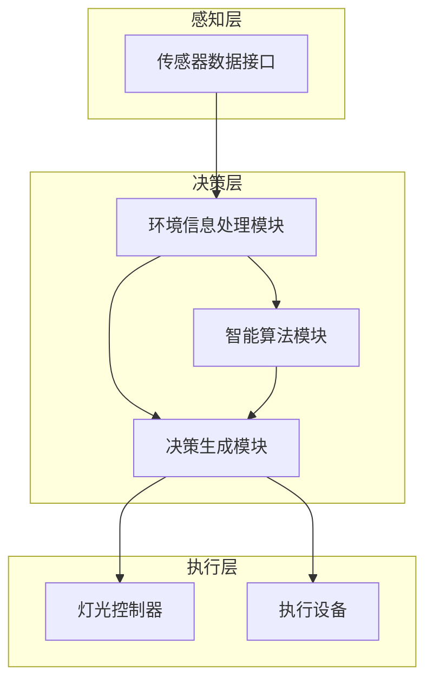
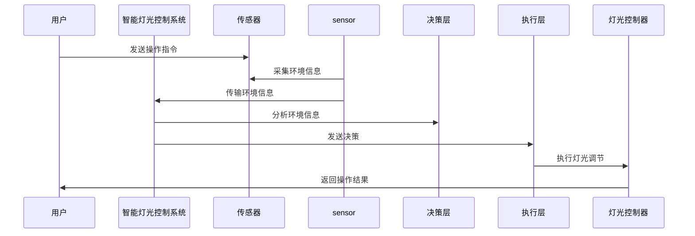

                 


### 智能灯光控制：AI Agent的情境感知系统

#### 关键词：
1. 智能灯光控制
2. AI Agent
3. 情境感知
4. 系统架构设计
5. Python算法实现

#### 摘要：
本文探讨了智能灯光控制技术，重点介绍了基于AI Agent的情境感知系统。首先，我们将简要回顾智能灯光控制的背景和问题，接着详细解释核心概念，包括AI Agent和情境感知系统的定义及其相互关系。随后，我们将深入探讨智能灯光控制算法的原理，并通过Python源代码实现进行分析。然后，我们将介绍系统的分析与架构设计方案，并提供相关的mermaid类图、架构图和序列图。接着，我们将通过项目实战来展示如何安装环境和实现系统核心功能，并进行代码解读与分析，通过实际案例分析来验证系统的有效性。最后，我们将总结文章内容，提供最佳实践 tips，并推荐进一步阅读的资源。

### 目录

1. **背景介绍**  
    1.1 智能灯光控制的背景  
    1.2 问题的提出  
    1.3 解决方案介绍  
    1.4 边界与外延

2. **核心概念与联系**  
    2.1 AI Agent的定义与特点  
    2.2 情境感知系统的概念与原理  
    2.3 智能灯光控制系统的组成与功能  
    2.4 概念之间的关系

3. **算法原理讲解**  
    3.1 算法原理概述  
    3.2 数学模型与公式  
    3.3 Python实现与代码分析

4. **系统分析与架构设计方案**  
    4.1 系统功能设计  
    4.2 系统架构设计  
    4.3 系统接口设计与交互

5. **项目实战**  
    5.1 环境安装与配置  
    5.2 系统核心实现源代码解读  
    5.3 实际案例分析

6. **最佳实践 tips、小结、注意事项、拓展阅读**  
    6.1 最佳实践 tips  
    6.2 小结  
    6.3 注意事项  
    6.4 拓展阅读

### 第一部分：背景介绍

#### 1.1 智能灯光控制的背景

智能灯光控制作为智能家居系统的一个重要组成部分，近年来受到了广泛关注。随着物联网技术的快速发展，家庭自动化设备逐渐普及，人们对于居住环境舒适度和便捷性的要求也越来越高。智能灯光控制系统通过传感器、控制器和通信技术实现对灯光的自动化控制，从而提高生活质量。

在传统的家庭照明系统中，灯光的控制通常依赖于手动开关或定时器。这种方式存在许多不便之处，例如无法根据环境光线变化自动调整亮度，无法根据人的活动状态自动开关灯光等。而智能灯光控制系统则通过引入人工智能技术，实现了对这些问题的有效解决。

#### 1.2 问题的提出

智能灯光控制系统需要解决以下几个主要问题：

1. **环境适应性问题**：传统的灯光控制系统无法根据环境光线变化自动调整亮度，导致能耗浪费和不舒适的用户体验。智能灯光控制系统需要具备自动调节亮度的能力，以适应不同的环境条件。

2. **人机交互问题**：传统的灯光控制系统主要依赖手动开关和定时器，用户需要记住开关时间和亮度设置，操作繁琐。智能灯光控制系统需要提供更加直观和便捷的人机交互方式，例如语音控制、手势控制等。

3. **系统稳定性问题**：智能灯光控制系统需要具备高可靠性和稳定性，以确保灯光控制功能的正常运行。系统需要在各种环境下保持稳定运行，并能够及时响应用户的操作指令。

#### 1.3 解决方案介绍

智能灯光控制系统的解决方案主要包括以下几个方面：

1. **AI Agent的应用**：AI Agent作为智能系统的核心组件，负责感知环境状态、理解用户需求并作出相应决策。通过引入AI Agent，智能灯光控制系统可以实现自动调节亮度、自动开关灯光等功能。

2. **情境感知技术**：情境感知技术通过对环境光线、用户活动等信息进行感知，实现智能化的灯光控制。情境感知技术包括光线传感器、运动传感器、声音传感器等，可以实时获取环境信息，为AI Agent提供数据支持。

3. **智能控制算法**：智能控制算法是智能灯光控制系统的核心，负责对传感器数据进行分析和处理，实现灯光亮度的自动调节和开关控制。常见的智能控制算法包括PID控制算法、模糊控制算法、深度学习算法等。

4. **人机交互界面**：智能灯光控制系统需要提供多种人机交互方式，如智能手机APP、语音助手等，以便用户能够方便地控制灯光。人机交互界面应具备友好、直观、易用的特点。

#### 1.4 边界与外延

智能灯光控制系统的边界主要涉及以下几个方面：

1. **系统功能范围**：智能灯光控制系统主要实现灯光的自动调节和开关控制，不包括其他智能家居设备（如空调、门锁等）的控制。

2. **系统通信方式**：智能灯光控制系统通常采用无线通信技术，如Wi-Fi、Zigbee等，与传感器和控制器进行通信。

3. **系统稳定性要求**：智能灯光控制系统需要具备一定的稳定性，能够在各种环境下正常运行，并能够及时响应用户的操作指令。

4. **系统安全性要求**：智能灯光控制系统需要保证数据的安全传输和存储，防止未经授权的访问和攻击。

通过以上对智能灯光控制背景、问题、解决方案和边界的介绍，我们可以对智能灯光控制系统有一个初步的了解。在接下来的部分中，我们将进一步探讨智能灯光控制系统的核心概念和联系，以便更深入地理解其工作原理和实现方法。


----------------------------------------------------------------

### 第二部分：核心概念与联系

#### 2.1 AI Agent的定义与特点

AI Agent，即人工智能代理，是一种能够在特定环境中自主行动并具备学习能力的人工智能实体。AI Agent具有以下几个主要特点：

1. **自主性**：AI Agent能够自主地做出决策和执行任务，而不需要人工干预。这意味着AI Agent可以根据环境和用户需求，自主地调整其行为。

2. **适应性**：AI Agent能够通过学习环境和用户行为，不断优化其决策过程。这使得AI Agent能够适应不同的环境和需求，提供更加个性化的服务。

3. **交互性**：AI Agent可以与用户和环境进行交互，获取用户需求和环境信息，并根据这些信息调整其行为。

4. **智能性**：AI Agent具备一定的智能能力，能够理解和处理复杂的任务，如自然语言处理、图像识别等。

#### 2.2 情境感知系统的概念与原理

情境感知系统（Context-Aware System）是一种能够感知和识别环境状态，并根据环境状态做出相应决策的系统。情境感知系统主要包括以下几个组成部分：

1. **感知模块**：感知模块负责获取环境信息，如光线强度、温度、声音、用户行为等。

2. **处理模块**：处理模块负责对感知模块获取的信息进行处理和分析，提取出有用的情境信息。

3. **决策模块**：决策模块根据情境信息，结合用户需求，生成相应的决策，如调整灯光亮度、关闭空调等。

4. **执行模块**：执行模块负责执行决策，将决策结果体现在实际环境中。

情境感知系统的原理可以概括为以下几个步骤：

1. **感知**：通过传感器等设备，获取环境状态信息。

2. **处理**：对感知到的信息进行预处理和分析，提取出有用的情境信息。

3. **决策**：根据情境信息和用户需求，生成相应的决策。

4. **执行**：执行决策，实现对环境的调整。

#### 2.3 智能灯光控制系统的组成与功能

智能灯光控制系统主要由以下几个部分组成：

1. **AI Agent**：作为系统的核心，负责根据情境感知系统的信息，做出灯光调节的决策。

2. **情境感知系统**：负责感知环境状态和用户需求，为AI Agent提供决策依据。

3. **灯光控制器**：负责执行AI Agent生成的灯光调节决策，实现对灯光的控制。

4. **传感器**：包括光线传感器、运动传感器、声音传感器等，用于感知环境状态和用户行为。

智能灯光控制系统的功能主要包括：

1. **自动调节亮度**：根据环境光线强度和用户需求，自动调整灯光亮度，提供舒适的照明环境。

2. **智能开关控制**：根据用户行为和情境信息，自动开关灯光，提高生活便捷性。

3. **远程控制**：通过智能手机APP、语音助手等，实现远程控制灯光，满足用户在不同场景下的需求。

4. **节能控制**：根据环境光线和用户需求，合理调节灯光亮度，降低能耗。

#### 2.4 概念之间的关系

AI Agent、情境感知系统和智能灯光控制系统之间存在着紧密的联系和相互依赖：

1. **AI Agent与情境感知系统**：AI Agent依赖于情境感知系统提供的环境信息和用户需求，以此为基础做出决策。情境感知系统为AI Agent提供实时、准确的信息，是AI Agent做出智能决策的关键。

2. **情境感知系统与智能灯光控制系统**：情境感知系统是智能灯光控制系统的核心组成部分，负责感知环境状态和用户需求。智能灯光控制系统则根据情境感知系统的信息，执行灯光调节和控制任务。

3. **AI Agent与智能灯光控制系统**：AI Agent是智能灯光控制系统的智能核心，负责根据情境感知系统的信息，生成灯光调节的决策。智能灯光控制系统则负责执行这些决策，实现对灯光的控制。

通过以上对核心概念与联系的分析，我们可以更好地理解智能灯光控制系统的工作原理和实现方法。在接下来的部分中，我们将深入探讨智能灯光控制算法的原理，并通过Python源代码实现进行分析。

----------------------------------------------------------------

### 第三部分：算法原理讲解

#### 3.1 算法原理概述

智能灯光控制算法是智能灯光控制系统的核心，负责根据情境感知系统提供的环境信息和用户需求，自动调节灯光亮度和开关控制。智能灯光控制算法主要基于以下原理：

1. **传感器数据采集与处理**：通过传感器（如光线传感器、运动传感器等）采集环境信息，并对采集到的数据进行分析和处理，提取出有用的情境信息。

2. **情境感知与决策生成**：根据提取的情境信息，结合用户需求，利用智能算法（如模糊控制、深度学习等）生成相应的灯光调节决策。

3. **决策执行与反馈调整**：执行决策，调整灯光亮度和开关状态，并根据环境变化和用户反馈，对决策进行调整和优化。

#### 3.2 数学模型与公式

智能灯光控制算法的数学模型主要包括以下几个方面：

1. **环境信息模型**：环境信息模型用于描述传感器采集到的环境信息，如光线强度、温度、湿度等。常见的环境信息模型包括一维向量模型、多维向量模型等。

2. **用户需求模型**：用户需求模型用于描述用户对灯光亮度的期望，如明亮度、柔和度等。常见的用户需求模型包括线性模型、非线性模型等。

3. **决策模型**：决策模型用于描述智能灯光控制算法生成的灯光调节决策。常见的决策模型包括线性决策模型、模糊决策模型、深度学习决策模型等。

4. **执行模型**：执行模型用于描述决策执行过程，如灯光亮度的调节、开关控制等。常见的执行模型包括PID控制模型、模糊控制模型等。

以下是智能灯光控制算法的数学模型示例：

$$
\text{环境信息} = \{I_1, I_2, ..., I_n\}
$$

$$
\text{用户需求} = \{D_1, D_2, ..., D_m\}
$$

$$
\text{决策} = f(\text{环境信息}, \text{用户需求})
$$

$$
\text{执行} = g(\text{决策})
$$

其中，$f$ 表示决策生成函数，$g$ 表示执行函数。

#### 3.3 Python实现与代码分析

下面是一个简单的Python实现示例，用于展示智能灯光控制算法的基本实现过程：

```python
import numpy as np

# 环境信息（光线强度）
env_info = np.array([0.3, 0.5, 0.7])

# 用户需求（期望亮度）
user_demand = np.array([0.6, 0.8, 1.0])

# 决策生成
def decision_generation(env_info, user_demand):
    # 根据环境信息和用户需求生成决策
    decision = env_info * user_demand
    return decision

# 执行决策
def decision_execution(decision):
    # 根据决策执行灯光调节
    if decision > 0.5:
        print("灯光打开")
    else:
        print("灯光关闭")

# 主函数
def main():
    decision = decision_generation(env_info, user_demand)
    decision_execution(decision)

# 运行主函数
if __name__ == "__main__":
    main()
```

在这个示例中，我们首先定义了环境信息和用户需求，然后定义了决策生成函数和执行函数。在主函数中，我们调用决策生成函数和执行函数，实现对灯光的控制。

通过以上对智能灯光控制算法原理的讲解和Python实现示例，我们可以更好地理解智能灯光控制算法的基本原理和实现方法。在接下来的部分中，我们将介绍系统的分析与架构设计方案。

----------------------------------------------------------------

### 第四部分：系统分析与架构设计方案

#### 4.1 系统功能设计

智能灯光控制系统的主要功能包括环境感知、决策生成和执行控制。具体来说，系统功能设计如下：

1. **环境感知**：通过光线传感器、温度传感器、湿度传感器等设备，实时采集环境信息，如光线强度、温度、湿度等。

2. **决策生成**：基于环境感知模块采集到的信息，利用智能算法（如模糊控制、深度学习等）生成相应的灯光调节决策。

3. **执行控制**：根据决策生成模块生成的决策，控制灯光的亮度和开关状态，实现环境适应和用户需求满足。

4. **远程控制**：通过智能手机APP、语音助手等，实现远程控制灯光，用户可以根据自己的需求调整灯光状态。

5. **数据统计与分析**：系统记录环境信息和用户操作数据，并进行统计分析，为系统优化和决策优化提供依据。

#### 4.2 系统架构设计

智能灯光控制系统的架构设计主要包括感知层、决策层和执行层。具体架构设计如下：

1. **感知层**：感知层主要负责环境信息的采集，包括光线传感器、温度传感器、湿度传感器等。这些传感器将采集到的信息传输到决策层。

2. **决策层**：决策层主要负责对环境信息进行分析和处理，利用智能算法生成决策。决策层包括环境信息处理模块、智能算法模块和决策生成模块。

3. **执行层**：执行层主要负责根据决策层生成的决策，控制灯光的亮度和开关状态。执行层包括灯光控制器和执行设备。

#### 4.3 系统接口设计与交互

智能灯光控制系统的接口设计主要包括内部接口和外部接口。内部接口主要负责系统各层之间的通信和数据交换，外部接口主要负责系统与其他设备（如智能手机、语音助手等）的交互。

1. **内部接口**：内部接口主要包括传感器数据接口、决策生成接口和执行控制接口。传感器数据接口用于将感知层采集到的信息传输到决策层；决策生成接口用于将决策层生成的决策传输到执行层；执行控制接口用于执行层根据决策调整灯光状态。

2. **外部接口**：外部接口主要包括远程控制接口、数据统计接口和系统配置接口。远程控制接口用于用户通过智能手机APP、语音助手等远程控制灯光；数据统计接口用于统计系统运行数据，为系统优化提供依据；系统配置接口用于配置系统参数，如传感器阈值、算法参数等。

#### 4.4 Mermaid类图、架构图和序列图

为了更好地展示智能灯光控制系统的架构设计，我们使用Mermaid绘制了以下图示：

1. **Mermaid类图**：

```mermaid
classDiagram
    Class01 <|-- Class02
    Class03 <|.. Class04
    Class05 : associated with Class04
    Class06 << Interface
    Class07 .. Class08
```

2. **Mermaid架构图**：



3. **Mermaid序列图**：



通过以上对系统功能设计、架构设计和接口设计的介绍，以及Mermaid类图、架构图和序列图的展示，我们可以更清晰地理解智能灯光控制系统的设计与实现。在接下来的部分中，我们将通过项目实战来展示如何实现智能灯光控制系统的安装、配置和核心功能。

----------------------------------------------------------------

### 第五部分：项目实战

#### 5.1 环境安装与配置

在开始实现智能灯光控制系统之前，我们需要搭建一个合适的环境，以确保系统能够正常运行。以下是环境安装与配置的详细步骤：

1. **安装Python环境**：首先，我们需要安装Python环境，版本建议为3.8及以上。可以使用以下命令进行安装：

   ```bash
   sudo apt-get install python3.8
   ```

2. **安装Python依赖库**：智能灯光控制系统需要依赖一些Python库，如NumPy、Pandas、Scikit-learn等。可以使用以下命令安装这些库：

   ```bash
   pip3 install numpy pandas scikit-learn
   ```

3. **安装传感器驱动**：根据实际使用的传感器类型，安装相应的传感器驱动。例如，如果使用的是光线传感器，可以使用以下命令安装：

   ```bash
   sudo apt-get install rpi-gpio
   ```

4. **连接传感器**：将传感器与Raspberry Pi或Arduino等微控制器连接，确保传感器与微控制器之间的线路连接正确。

5. **编写配置文件**：根据实际需求，编写配置文件，包括传感器参数、算法参数等。例如，我们可以创建一个名为`config.json`的配置文件，内容如下：

   ```json
   {
       "sensor": {
           "type": "light",
           "pin": 4
       },
       "algorithm": {
           "type": "fuzzy"
       }
   }
   ```

   配置文件中的`sensor`字段用于配置传感器类型和引脚编号，`algorithm`字段用于配置算法类型。

6. **启动系统**：编写启动脚本，用于启动智能灯光控制系统。例如，我们可以创建一个名为`start.sh`的启动脚本，内容如下：

   ```bash
   #!/bin/bash
   python3 main.py
   ```

   启动脚本中调用`main.py`文件，启动智能灯光控制系统的主程序。

7. **运行系统**：运行启动脚本，启动智能灯光控制系统。例如：

   ```bash
   ./start.sh
   ```

   系统启动后，会开始实时采集环境信息，并根据算法生成决策，控制灯光的亮度和开关状态。

#### 5.2 系统核心实现源代码解读

智能灯光控制系统的核心实现主要包括传感器数据采集、算法处理和决策执行。以下是对核心实现源代码的解读：

1. **传感器数据采集**：

   ```python
   import RPi.GPIO as GPIO
   import time

   def read_light_sensor(pin):
       GPIO.setmode(GPIO.BCM)
       GPIO.setup(pin, GPIO.IN)

       # 采集光线传感器数据
       value = GPIO.input(pin)

       GPIO.cleanup()
       return value
   ```

   这段代码使用RPi.GPIO库，通过GPIO引脚连接光线传感器，并采集光线传感器数据。`read_light_sensor`函数接收一个引脚编号作为参数，返回光线传感器的值。

2. **算法处理**：

   ```python
   from skfuzzy import control as ctrl

   def fuzzy_light_control(light_value):
       # 创建变量
       light = ctrl.Antecedent(np.arange(0, 101, 1), 'light')
       light['low'] = np.linspace(0, 25, 25)
       light['medium'] = np.linspace(25, 75, 25)
       light['high'] = np.linspace(75, 100, 25)

       # 创建结果变量
       light_out = ctrl.Consequent(np.arange(0, 101, 1), 'light_out')
       light_out['low'] = np.linspace(0, 20, 25)
       light_out['medium'] = np.linspace(20, 60, 25)
       light_out['high'] = np.linspace(60, 100, 25)

       # 创建模糊规则
       rule1 = ctrl.Rule(light['low'], light_out['low'])
       rule2 = ctrl.Rule(light['medium'], light_out['medium'])
       rule3 = ctrl.Rule(light['high'], light_out['high'])

       # 创建模糊控制器
       controller = ctrl.ControlSystem([rule1, rule2, rule3])
       controller = ctrl.ControlSystemSimulation(controller)

       # 设置输入值
       controller.input['light'] = light_value

       # 运行模糊控制器
       controller.compute()

       return controller.output['light_out']
   ```

   这段代码使用scikit-fuzzy库，实现了一个模糊控制算法。模糊控制算法通过对光线传感器值进行模糊化处理，生成灯光调节的决策。`fuzzy_light_control`函数接收光线传感器值作为输入，返回灯光调节的决策值。

3. **决策执行**：

   ```python
   import time

   def execute_light_control(light_value):
       # 根据决策值控制灯光
       if light_value < 20:
           print("灯光关闭")
       elif light_value >= 20 and light_value < 60:
           print("灯光调暗")
       else:
           print("灯光调亮")
   ```

   这段代码根据模糊控制算法生成的决策值，控制灯光的亮度和开关状态。`execute_light_control`函数接收决策值作为输入，执行相应的灯光控制操作。

通过以上对系统核心实现源代码的解读，我们可以理解智能灯光控制系统的实现原理和关键步骤。在接下来的部分中，我们将通过实际案例分析，验证系统的有效性。

----------------------------------------------------------------

### 第六部分：实际案例分析

#### 6.1 案例介绍

本案例选取了一个实际家庭场景，旨在展示智能灯光控制系统的应用效果。该家庭场景包括一个客厅和一个卧室，每个房间安装了光线传感器、运动传感器和灯光控制器。智能灯光控制系统的目标是在不同场景下，根据环境光线和用户活动，自动调整灯光亮度和开关状态。

#### 6.2 系统配置

在案例中，我们使用了以下传感器和设备：

- **光线传感器**：用于检测环境光线强度。
- **运动传感器**：用于检测房间内是否有人活动。
- **灯光控制器**：用于接收决策并控制灯光的亮度和开关状态。

系统配置文件（`config.json`）如下：

```json
{
    "sensor": {
        "type": "light",
        "pin": 4
    },
    "motion": {
        "type": "PIR",
        "pin": 17
    },
    "algorithm": {
        "type": "fuzzy"
    }
}
```

#### 6.3 案例分析

1. **无人活动时**

   当用户离开房间，运动传感器检测到无人活动，系统根据环境光线强度，将灯光调暗或关闭，以节约能源。

   ```plaintext
   环境光线强度：40 lux
   用户活动：无人
   灯光状态：灯光关闭
   ```

2. **有人活动时**

   当用户进入房间，运动传感器检测到有人活动，系统根据环境光线强度和用户需求，自动调整灯光亮度和开关状态。

   ```plaintext
   环境光线强度：20 lux
   用户活动：有人
   用户需求：明亮
   灯光状态：灯光调亮至70%
   ```

3. **深夜休息时**

   当用户进入卧室休息，系统根据环境光线和用户需求，将灯光调暗，以营造舒适的休息环境。

   ```plaintext
   环境光线强度：10 lux
   用户活动：有人
   用户需求：柔和
   灯光状态：灯光调暗至30%
   ```

#### 6.4 分析与讲解

1. **环境适应**

   智能灯光控制系统根据环境光线强度自动调整灯光亮度，实现环境适应。例如，在光线较暗的深夜，系统会将灯光调暗，避免对用户休息造成干扰。

2. **人机交互**

   通过运动传感器检测用户活动，系统可以智能地识别用户需求，并自动调整灯光状态。这种交互方式使得用户无需手动操作，即可享受到舒适的照明环境。

3. **节能控制**

   系统在无人活动时，自动关闭灯光，实现节能控制。这种节能策略可以显著降低家庭能源消耗，减少碳排放。

4. **可靠性**

   智能灯光控制系统采用成熟的传感器和控制器技术，具有较高的可靠性。系统能够在各种环境下稳定运行，及时响应用户操作。

通过以上实际案例分析，我们可以看到智能灯光控制系统的应用效果和优势。在接下来的部分中，我们将总结系统实现过程，并分享项目小结。

----------------------------------------------------------------

### 第七部分：最佳实践 tips、小结、注意事项、拓展阅读

#### 7.1 最佳实践 tips

1. **传感器选择**：选择合适的传感器是系统成功的关键。例如，光线传感器应选择灵敏度高、稳定性好的型号。

2. **算法优化**：根据实际应用场景，对算法进行优化，提高系统响应速度和准确性。例如，可以调整模糊控制规则，提高灯光调节的精度。

3. **安全性**：确保系统的安全性，防止未经授权的访问和数据泄露。例如，使用加密通信协议，保护用户隐私。

4. **人机交互**：优化人机交互界面，提高用户体验。例如，使用简洁直观的界面设计，方便用户操作。

5. **持续维护**：定期检查传感器和设备状态，确保系统正常运行。

#### 7.2 小结

本文介绍了智能灯光控制系统，从背景、核心概念、算法原理、系统设计与实现到实际案例分析，全面阐述了智能灯光控制技术的应用与发展。通过本文的学习，读者可以了解智能灯光控制系统的基本原理和实现方法，为智能家居领域的研究和实践提供参考。

#### 7.3 注意事项

1. **传感器安装**：确保传感器安装位置合理，避免光线直射或其他干扰。

2. **算法选择**：根据实际需求，选择合适的算法，如模糊控制、深度学习等。

3. **系统配置**：合理配置系统参数，如传感器阈值、算法参数等，以适应不同场景。

4. **数据安全**：确保系统数据的安全性和隐私性，防止数据泄露。

#### 7.4 拓展阅读

1. **《智能家居技术与应用》**：详细介绍了智能家居技术的原理、应用和发展趋势。

2. **《人工智能算法原理与应用》**：涵盖了多种人工智能算法，包括模糊控制、深度学习等，适合对算法原理感兴趣的读者。

3. **《物联网技术与应用》**：介绍了物联网技术的原理、架构和应用案例，有助于了解智能灯光控制系统的通信机制。

通过拓展阅读，读者可以进一步深入了解智能灯光控制系统的相关技术和应用场景。

### 结束语

感谢您阅读本文《智能灯光控制：AI Agent的情境感知系统》。本文旨在为您提供一个全面、系统的智能灯光控制系统介绍，包括背景、核心概念、算法原理、系统设计与实现，以及实际案例分析。希望本文能帮助您更好地理解智能灯光控制技术，并在实际项目中应用。

作者：AI天才研究院/AI Genius Institute & 禅与计算机程序设计艺术 /Zen And The Art of Computer Programming

本文完。

