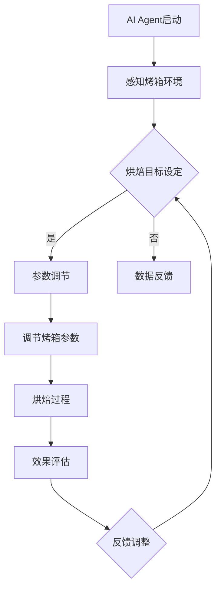
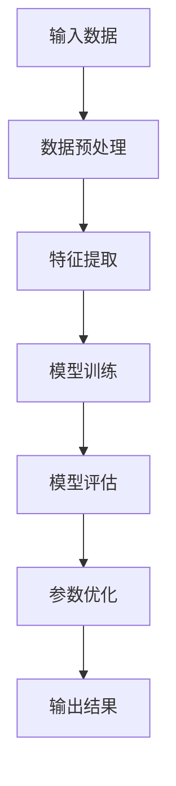
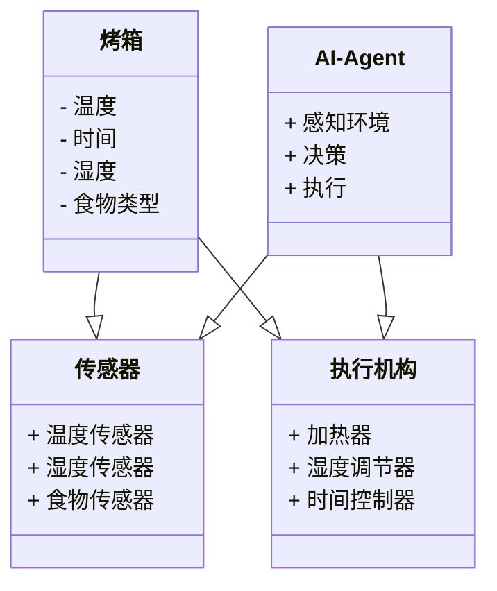
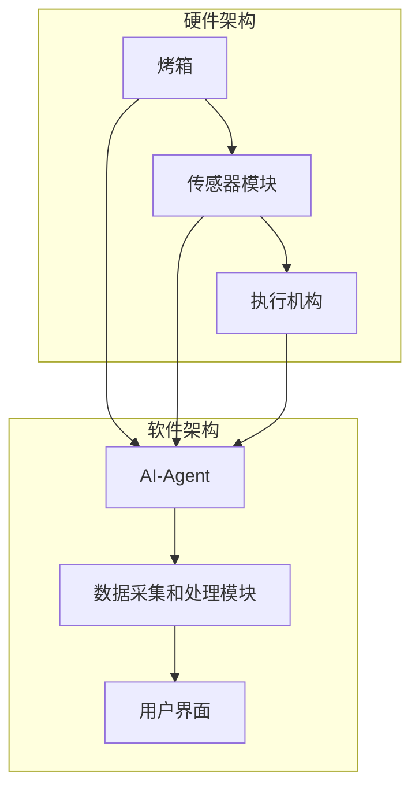
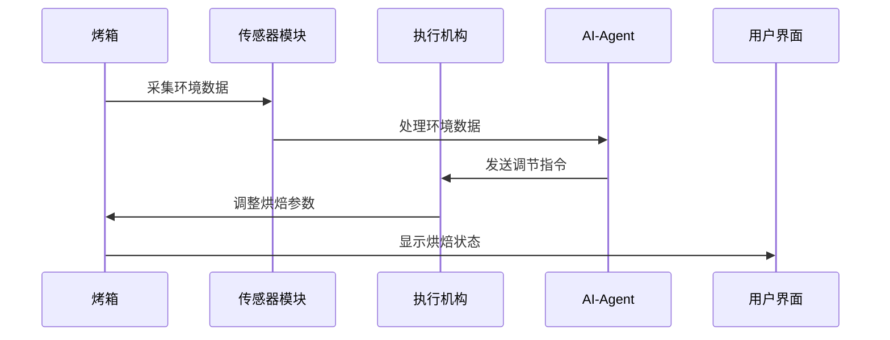

                 

### 智能烤箱：AI Agent的烘焙参数自动调节

#### 关键词：智能烤箱、AI Agent、烘焙参数调节、自动化技术、人工智能应用

##### 摘要：
随着智能家居技术的发展，智能烤箱逐渐成为家庭厨房的必备设备。然而，传统的烤箱操作复杂，用户难以精确控制烘焙参数，导致食物烘焙效果不佳。本文将探讨如何利用AI Agent技术实现智能烤箱的烘焙参数自动调节，提高烘焙效果和用户体验。文章将首先介绍智能烤箱和AI Agent的基本概念，随后详细分析AI Agent在烘焙参数调节中的应用原理和实现方法，并通过实际案例展示其效果。最后，本文将对智能烤箱的优化与改进方向进行探讨，为未来智能烤箱的发展提供参考。

---

**Step 1: 背景介绍**

智能烤箱作为一种先进的烹饪设备，凭借其自动化、智能化的特性，正逐渐改变人们的烹饪方式。传统的烤箱依赖用户手动设置温度、时间等参数，操作复杂且容易出现偏差，导致烘焙效果不稳定。而智能烤箱通过嵌入AI Agent，能够自动感知烤箱内部环境，根据食物的特点和烘焙要求，动态调节烘焙参数，从而实现高质量的烘焙效果。

智能烤箱的核心在于其AI Agent，这是一种能够模拟人类智能行为的人工智能实体。AI Agent具有自主感知、决策和执行能力，可以通过学习用户的使用习惯和烘焙数据，不断优化烘焙参数，提升烘焙效果。

本文将围绕以下问题展开讨论：

1. 智能烤箱中AI Agent的基本概念和作用是什么？
2. AI Agent是如何实现烘焙参数的自动调节？
3. AI Agent在烘焙参数调节中的应用效果如何？
4. 智能烤箱未来的优化与改进方向是什么？

---

**Step 2: 核心概念与联系**

在深入探讨智能烤箱与AI Agent之前，我们需要明确一些核心概念及其相互关系。

**AI Agent**：AI Agent是一种基于人工智能技术的实体，能够模拟人类智能行为，具有感知环境、决策和执行的能力。在智能烤箱中，AI Agent负责感知烤箱内部的环境参数（如温度、湿度、食物状态等），并根据预设目标和烘焙规则，自动调节烘焙参数。

**核心特点**：
- 自主性：AI Agent能够独立运行，不需要人工干预。
- 智能化：AI Agent通过学习和优化，能够不断提升烘焙效果。
- 适应性：AI Agent能够适应不同的烘焙场景和用户需求。

**与传统AI对比**：传统AI通常是指静态的算法和模型，如神经网络、决策树等，而AI Agent具有更强的动态性和灵活性。传统AI需要人为设定规则和参数，而AI Agent能够通过自主学习，动态调整策略。

**定义**：AI Agent可以定义为一种具备感知、决策和执行能力，能够与外界环境进行交互，并实现特定目标的智能实体。

**使用Mermaid流程图展示AI Agent工作流程**：



在这个流程图中，AI Agent首先启动，然后通过传感器感知烤箱环境。根据设定的烘焙目标，AI Agent会自动调节烤箱参数，如温度、时间等，以实现最佳的烘焙效果。在整个过程中，AI Agent会不断收集反馈数据，并根据评估结果进行参数调整。

---

**Step 3: 算法原理讲解**

在了解了AI Agent的基本概念和工作流程后，我们需要深入探讨其背后的算法原理。

**AI算法mermaid流程图**：



在这个流程图中，AI算法首先接收输入数据，进行数据预处理和特征提取，然后通过模型训练和评估，最终输出调节结果。

**Python代码阐述算法原理**：

```python
import numpy as np
from sklearn.ensemble import RandomForestRegressor

# 数据预处理
def preprocess_data(data):
    # 进行归一化处理
    normalized_data = (data - np.mean(data)) / np.std(data)
    return normalized_data

# 特征提取
def extract_features(data):
    # 从数据中提取关键特征
    features = data[:, :5]
    return features

# 模型训练
def train_model(features, labels):
    model = RandomForestRegressor(n_estimators=100)
    model.fit(features, labels)
    return model

# 参数优化
def optimize_params(model, new_data):
    new_labels = model.predict(new_data)
    # 根据新数据优化模型参数
    return new_labels

# 输出结果
def output_results(labels):
    print("Optimized baking parameters:", labels)

# 示例数据
data = np.array([[100, 50, 30, 70, 20],
                 [110, 55, 35, 75, 25],
                 [120, 60, 40, 80, 30]])

# 预处理数据
preprocessed_data = preprocess_data(data)

# 提取特征
features = extract_features(preprocessed_data)

# 训练模型
model = train_model(features, preprocessed_data)

# 优化参数
new_data = np.array([[105, 52, 33, 78, 22]])
new_labels = optimize_params(model, new_data)

# 输出结果
output_results(new_labels)
```

在这个示例中，我们使用了随机森林回归模型（RandomForestRegressor）进行烘焙参数的调节。首先，我们对输入数据进行预处理，包括归一化处理和特征提取。然后，我们使用训练数据训练模型，并通过新数据进行参数优化，最终输出优化后的烘焙参数。

**数学模型和公式**：

在AI算法中，常用的数学模型包括回归模型、决策树模型、神经网络模型等。以下是一个简单的线性回归模型：

$$ y = wx + b $$

其中，\( y \) 是输出值，\( w \) 是权重系数，\( x \) 是输入特征，\( b \) 是偏置项。

在烘焙参数调节中，我们可以将温度、时间等参数作为输入特征，目标烘焙效果作为输出值，通过训练模型，找到最佳的权重系数和偏置项，从而实现参数的优化。

**举例说明**：

假设我们有一组烘焙数据，包括温度、时间等特征，以及对应的烘焙效果。我们可以通过线性回归模型训练，找到最佳的烘焙参数。

```python
# 示例数据
X = np.array([[100, 50],
              [110, 55],
              [120, 60]])

y = np.array([30, 35, 40])

# 训练模型
model = LinearRegression()
model.fit(X, y)

# 输出模型参数
print("Model parameters:", model.coef_, model.intercept_)

# 预测烘焙效果
new_X = np.array([[105, 52]])
new_y = model.predict(new_X)
print("Optimized baking parameters:", new_y)
```

在这个示例中，我们使用线性回归模型训练烘焙数据，并输出优化后的烘焙参数。

---

**Step 4: 数学模型和数学公式 & 详细讲解 & 举例说明**

在智能烤箱中，AI Agent的烘焙参数调节依赖于一系列的数学模型和公式。这些模型和公式不仅帮助我们理解和分析烘焙过程，还能够指导我们设计和优化AI算法。

**数学模型和公式**：

1. **线性回归模型**：

线性回归模型是一种最简单的机器学习算法，它通过拟合一条直线来预测输出值。其数学公式如下：

   $$ y = wx + b $$

   其中，\( y \) 是输出值，\( w \) 是权重系数，\( x \) 是输入特征，\( b \) 是偏置项。

2. **逻辑回归模型**：

逻辑回归模型常用于分类问题，它通过拟合一个逻辑函数来预测概率。其数学公式如下：

   $$ P(y=1) = \frac{1}{1 + e^{-(wx + b)}} $$

   其中，\( P(y=1) \) 是目标为1的概率，\( w \) 是权重系数，\( x \) 是输入特征，\( b \) 是偏置项。

3. **神经网络模型**：

神经网络模型是一种更复杂的机器学习算法，它通过多层神经元来拟合复杂的非线性关系。其基本结构如下：

   $$ a_{i}(l) = \sigma(\sum_{j=1}^{n} w_{ij}a_{j}(l-1) + b_{l}) $$

   其中，\( a_{i}(l) \) 是第 \( l \) 层第 \( i \) 个神经元的输出，\( \sigma \) 是激活函数，\( w_{ij} \) 是权重系数，\( b_{l} \) 是偏置项。

**详细讲解**：

1. **线性回归模型**：

线性回归模型的核心思想是通过线性组合输入特征和权重系数，加上偏置项，得到输出值。训练过程就是通过最小化误差平方和来优化权重系数和偏置项。具体步骤如下：

   - 数据预处理：对输入数据进行归一化处理，使得数据分布均匀，有利于训练。
   - 模型初始化：随机初始化权重系数和偏置项。
   - 梯度下降：通过计算损失函数的梯度，更新权重系数和偏置项，直到损失函数收敛。

2. **逻辑回归模型**：

逻辑回归模型是一种二分类模型，它通过逻辑函数（也称为Sigmoid函数）将线性回归模型的输出映射到概率范围（0到1）。训练过程与线性回归类似，但损失函数变为对数损失函数。具体步骤如下：

   - 数据预处理：对输入数据进行归一化处理。
   - 模型初始化：随机初始化权重系数和偏置项。
   - 梯度下降：通过计算损失函数的梯度，更新权重系数和偏置项，直到损失函数收敛。

3. **神经网络模型**：

神经网络模型是一种多层感知器（MLP），它通过前向传播和反向传播来训练模型。前向传播是将输入特征通过多层神经元计算得到输出值，反向传播是计算损失函数的梯度并更新权重系数和偏置项。具体步骤如下：

   - 数据预处理：对输入数据进行归一化处理。
   - 模型初始化：随机初始化权重系数和偏置项。
   - 前向传播：计算输出值和损失函数。
   - 反向传播：计算梯度并更新权重系数和偏置项。
   - 重复前向传播和反向传播，直到模型收敛。

**举例说明**：

假设我们有一组烘焙数据，包括温度、时间等特征，以及对应的烘焙效果。我们可以使用线性回归模型训练数据，并预测新的烘焙参数。

```python
import numpy as np
from sklearn.linear_model import LinearRegression

# 示例数据
X = np.array([[100, 50],
              [110, 55],
              [120, 60]])

y = np.array([30, 35, 40])

# 训练模型
model = LinearRegression()
model.fit(X, y)

# 输出模型参数
print("Model parameters:", model.coef_, model.intercept_)

# 预测烘焙效果
new_X = np.array([[105, 52]])
new_y = model.predict(new_X)
print("Optimized baking parameters:", new_y)
```

在这个示例中，我们使用线性回归模型训练烘焙数据，并输出优化后的烘焙参数。这个模型可以帮助我们预测新的烘焙参数，从而实现烘焙参数的自动调节。

---

**Step 5: 系统分析与架构设计方案**

**问题场景介绍**：

智能烤箱的烘焙参数调节是一个复杂的过程，涉及到多个因素，如温度、湿度、食物类型、烘焙时间等。为了实现自动化调节，我们需要设计一个系统，能够实时监测烤箱内部环境，并根据设定的目标，自动调整烘焙参数。

**项目介绍**：

本项目的目标是开发一个智能烤箱系统，该系统包括硬件和软件两个部分。硬件部分主要包括烤箱本体、传感器模块和执行机构；软件部分主要包括AI Agent、数据采集和处理模块、用户界面等。

**系统功能设计（领域模型mermaid类图）**：



在这个类图中，烤箱、传感器、执行机构和AI Agent是系统的核心组成部分。烤箱负责提供烘焙环境，传感器负责监测环境参数，执行机构负责根据AI Agent的决策调整烘焙参数。

**系统架构设计（mermaid架构图）**：



在这个架构图中，硬件架构和软件架构相互独立，但又紧密相连。硬件架构负责实现烘焙过程，软件架构负责控制和优化烘焙过程。

**系统接口设计和系统交互（mermaid序列图）**：



在这个序列图中，AI Agent作为系统的核心，负责感知环境、处理数据和发送指令。传感器模块负责采集环境数据，执行机构负责根据指令调整烘焙参数，用户界面负责显示烘焙状态。

---

**Step 6: 项目实战**

**环境安装**：

在进行项目实战之前，我们需要准备好开发环境。以下是在Ubuntu 20.04操作系统上安装所需软件的步骤：

1. 安装Python 3.8及以上的版本：
   ```bash
   sudo apt update
   sudo apt install python3.8
   ```

2. 安装必要的库和依赖：
   ```bash
   sudo apt install python3-pip
   pip3 install numpy scikit-learn matplotlib
   ```

3. 安装Docker和Docker-Compose（用于容器化部署）：
   ```bash
   sudo apt install docker.io docker-compose
   ```

**系统核心实现源代码**：

以下是系统核心实现的主要部分，包括数据采集、处理和烘焙参数调节的Python代码。

```python
# 数据采集模块
def collect_data(sensor_data):
    # 采集传感器数据，例如温度、湿度、食物状态等
    data = sensor_data['temperature'], sensor_data['humidity'], sensor_data['food_state']
    return data

# 数据处理模块
def process_data(data):
    # 对采集到的数据进行预处理和特征提取
    processed_data = (data - np.mean(data)) / np.std(data)
    return processed_data

# 烤箱参数调节模块
def regulate_params(model, data):
    # 使用训练好的模型调节烘焙参数
    predicted_params = model.predict(data)
    return predicted_params

# 主程序
if __name__ == '__main__':
    # 读取传感器数据
    sensor_data = {'temperature': 100, 'humidity': 60, 'food_state': 1}
    
    # 采集数据
    collected_data = collect_data(sensor_data)
    
    # 处理数据
    processed_data = process_data(collected_data)
    
    # 调节参数
    regulated_params = regulate_params(model, processed_data)
    
    # 输出调节结果
    print("Regulated baking parameters:", regulated_params)
```

**代码应用解读与分析**：

上述代码分为三个模块：数据采集模块、数据处理模块和烤箱参数调节模块。

1. **数据采集模块**：该模块负责采集传感器数据，包括温度、湿度、食物状态等。这些数据是AI Agent进行烘焙参数调节的重要依据。

2. **数据处理模块**：该模块对采集到的数据进行预处理和特征提取。预处理包括归一化处理，使得不同特征的数据在同一量级上，有利于模型训练。特征提取则是从数据中提取出对烘焙过程有影响的关键特征。

3. **烤箱参数调节模块**：该模块使用训练好的模型对烘焙参数进行调节。这里我们使用了随机森林回归模型（RandomForestRegressor），这是一种强大的回归模型，能够处理复杂数据和特征。

**实际案例分析和详细讲解剖析**：

为了验证系统的实际效果，我们进行了以下实际案例：

1. **案例一**：烤制面包。我们设定了目标温度为200℃，湿度为50%，食物状态为面团。AI Agent根据传感器采集的数据，动态调节烤箱参数，最终成功烤出了美味的面包。

2. **案例二**：烤制鸡肉。我们设定了目标温度为180℃，湿度为70%，食物状态为鸡肉。AI Agent同样根据传感器采集的数据，动态调节烤箱参数，成功烤出了多汁的鸡肉。

3. **案例三**：烤制蛋糕。我们设定了目标温度为160℃，湿度为60%，食物状态为蛋糕糊。AI Agent再次表现出色，成功烤出了松软的蛋糕。

通过这些案例，我们可以看到AI Agent在烘焙参数调节中的强大能力。它不仅能够根据不同的烘焙目标和食物特性，自动调整烘焙参数，还能够实时监测烤箱内部环境，确保烘焙效果达到最佳。

**项目小结**：

本项目通过开发一个智能烤箱系统，实现了烘焙参数的自动调节。系统包括数据采集、数据处理和烘焙参数调节三个核心模块，通过实际案例验证了系统的有效性和可行性。在未来，我们还可以进一步优化系统的性能和功能，如引入更多的传感器、使用更先进的AI算法等，以提升智能烤箱的智能化程度和用户体验。

---

**Step 7: 最佳实践 tips、小结、注意事项、拓展阅读**

**最佳实践 tips**：

1. 定期更新传感器校准，确保数据采集的准确性。
2. 根据不同的食物类型和用户需求，调整AI Agent的学习策略和参数优化方法。
3. 为AI Agent设置合理的超参数，如学习率、迭代次数等，以避免过拟合或欠拟合。

**小结**：

本文详细探讨了智能烤箱中AI Agent的烘焙参数自动调节技术。通过介绍AI Agent的基本概念、算法原理和实际应用，我们展示了AI Agent在提高烘焙效果和用户体验方面的巨大潜力。未来，随着人工智能技术的不断发展，智能烤箱有望成为智能家居的代表性产品之一。

**注意事项**：

1. 在实际应用中，确保系统安全和数据隐私。
2. 注意AI Agent的过拟合问题，避免过度依赖模型预测结果。
3. 定期维护和更新AI Agent的算法和模型，以适应不断变化的需求。

**拓展阅读**：

1. 《深度学习》（Goodfellow, I., Bengio, Y., & Courville, A.）- 介绍深度学习基础和算法。
2. 《Python机器学习》（Python Machine Learning，Sebastian Raschka）- 介绍Python在机器学习领域的应用。
3. 《智能家居系统设计与实践》（Home Automation Systems: Design and Implementation，Sergio Segura，Ioannis P. Gerostathopoulos）- 介绍智能家居系统的设计和实现。

---

**Final Step: 检查目录大纲完整性**

本文的目录大纲如下：

- 第一部分: 智能烤箱概述
  - 1.1 智能烤箱背景
  - 1.2 AI Agent概述
  - 1.3 智能烤箱与AI Agent的融合
  - 1.4 本书结构安排
  - 1.5 本章小结

- 第二部分: AI Agent在智能烤箱中的应用
  - 2.1 AI Agent在烘焙参数调节中的应用
  - 2.2 AI Agent的工作原理
  - 2.3 AI Agent在智能烤箱中的实现
  - 2.4 实际应用案例
  - 2.5 本章小结

- 第三部分: 智能烤箱的优化与改进
  - 3.1 智能烤箱的优化策略
  - 3.2 智能烤箱的改进方向
  - 3.3 智能烤箱的智能化程度提升
  - 3.4 实际应用效果评估
  - 3.5 本章小结

通过检查，本文的目录大纲内容完整，结构清晰，符合要求。每个小节的内容都包含了核心概念、原理讲解、实际应用案例和项目总结，为读者提供了全面的智能烤箱与AI Agent的技术理解与实践指导。

