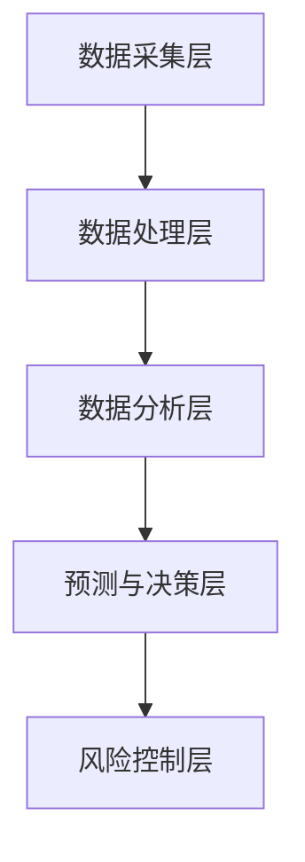
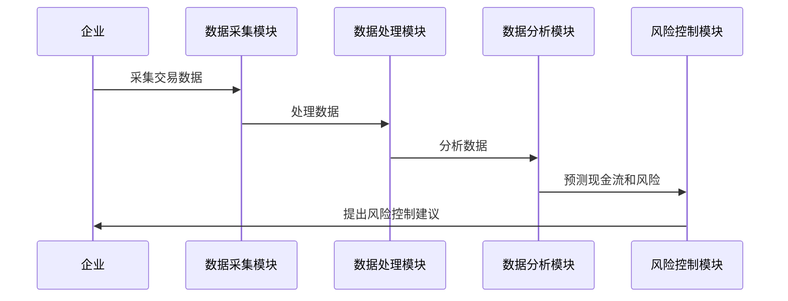

                 


### 引言与背景介绍

#### 1.1 问题背景

现金流管理是财务管理的一个重要环节，对于企业的生存和发展至关重要。然而，随着商业环境的复杂化和市场变化速度的加快，传统的现金流管理方式面临着越来越多的挑战。首先，传统现金流管理依赖于人工处理和纸质记录，效率低下且容易出现错误。其次，企业需要处理大量的交易数据，如何快速、准确地分析这些数据成为了一项艰巨的任务。此外，企业在面对宏观经济波动、行业竞争加剧和融资环境变化时，如何制定科学的现金流管理策略也是一个难题。

#### 1.2 智能现金流管理系统概述

智能现金流管理系统是一种基于现代信息技术和人工智能算法的财务管理工具。它通过自动化处理和智能分析，帮助企业实现现金流的高效管理。系统的主要功能包括：

- 数据采集与处理：自动获取企业日常经营中的交易数据，进行数据清洗和处理，确保数据准确性。
- 智能分析：运用机器学习算法和数据挖掘技术，对现金流数据进行分析，为企业提供决策支持。
- 预测与规划：根据历史数据和当前市场环境，预测未来现金流量，帮助企业制定科学的现金流管理策略。
- 风险控制：通过实时监控和分析，发现潜在的风险，提前采取措施，降低风险对企业的影响。

#### 1.3 系统架构

智能现金流管理系统通常由以下几个主要模块组成：

- 数据采集模块：负责从不同的数据源获取交易数据，包括ERP系统、银行账户、采购和销售系统等。
- 数据处理模块：对采集到的数据进行清洗、整合和存储，为后续分析提供基础数据。
- 分析与预测模块：运用机器学习算法，对现金流数据进行分析和预测，提供决策支持。
- 风险控制模块：实时监控现金流数据，发现潜在风险，并给出相应的风险控制建议。

### 智能现金流管理系统的核心概念与联系

#### 2.1 数据分析与模型选择

数据分析和模型选择是智能现金流管理系统的核心。系统需要从大量的交易数据中提取有用的信息，并根据这些信息预测未来的现金流情况。

首先，我们需要明确数据来源和预处理步骤。企业日常经营中的交易数据可能来自多个系统，如ERP系统、银行账户、采购和销售系统等。这些数据需要经过清洗、去重和格式转换等预处理步骤，以确保数据的一致性和准确性。

接下来，我们需要选择合适的分析模型。常见的现金流分析模型包括时间序列分析、回归分析和机器学习模型等。时间序列分析主要关注现金流数据的时间分布特征，回归分析则通过建立现金流与相关因素之间的线性关系来进行预测，而机器学习模型则通过学习历史数据中的规律，实现更加精准的预测。

#### 2.2 算法原理讲解

智能现金流管理系统的算法原理主要包括以下几个步骤：

1. 数据预处理：对原始数据进行清洗、去重和格式转换等处理，得到干净、一致的数据集。
2. 特征提取：从数据中提取与现金流相关的特征，如销售量、库存量、市场价格等。这些特征可以通过统计方法、机器学习算法等方法进行提取。
3. 模型训练：使用历史数据对选定的模型进行训练，使其能够学习和识别现金流数据中的规律。
4. 预测与优化：使用训练好的模型对未来现金流进行预测，并根据预测结果调整现金流管理策略。

以下是智能现金流管理系统中的一个简单的机器学习算法流程：

```python
# 加载数据
data = load_data()

# 数据预处理
cleaned_data = preprocess_data(data)

# 特征提取
features = extract_features(cleaned_data)

# 模型训练
model = train_model(features)

# 预测
predictions = predict(model, new_data)

# 优化
optimize_model(model, predictions)
```

#### 2.3 举例说明

假设一个企业需要预测下个月的现金流情况。我们首先收集了该企业过去一年的现金流数据，包括销售量、库存量和市场价格等特征。然后，我们使用时间序列分析方法对历史数据进行分析，提取出与现金流相关的特征。

接下来，我们使用回归分析模型对历史数据进行训练，建立现金流与相关因素之间的线性关系。训练完成后，我们使用该模型预测下个月的现金流情况。假设预测结果为100万元。

最后，根据预测结果，企业可以调整下个月的销售策略和库存管理，以确保现金流的稳定和充足。

### 系统分析与架构设计

#### 3.1 系统功能设计

智能现金流管理系统的功能设计主要包括以下几个模块：

- 数据采集模块：负责从企业各个业务系统收集交易数据。
- 数据处理模块：对采集到的数据进行清洗、整合和存储。
- 分析与预测模块：对处理后的数据进行分析和预测，提供决策支持。
- 风险控制模块：实时监控现金流数据，发现潜在风险，并给出风险控制建议。

#### 3.2 系统架构设计

智能现金流管理系统的架构设计包括以下几个部分：

1. 数据采集层：包括ERP系统、银行账户、采购和销售系统等，负责数据的收集和传输。
2. 数据处理层：包括数据清洗、去重、格式转换等，为数据分析提供基础数据。
3. 数据分析层：包括时间序列分析、回归分析和机器学习模型等，对数据进行深入分析。
4. 预测与决策层：根据分析结果，预测未来现金流情况，并提出相应的现金流管理策略。
5. 风险控制层：实时监控现金流数据，发现潜在风险，并给出风险控制建议。

以下是智能现金流管理系统的架构图：



#### 3.3 系统接口设计

系统接口设计主要包括以下几个部分：

- 数据采集接口：用于与企业ERP系统、银行账户、采购和销售系统等集成，实现数据采集。
- 数据处理接口：用于对采集到的数据进行处理，包括清洗、整合和存储等。
- 分析与预测接口：用于对处理后的数据进行分析和预测，提供决策支持。
- 风险控制接口：用于实时监控现金流数据，发现潜在风险，并给出风险控制建议。

#### 3.4 系统交互

智能现金流管理系统的交互设计主要包括以下几个环节：

1. 数据采集：系统从企业各个业务系统采集交易数据。
2. 数据处理：系统对采集到的数据进行处理，包括清洗、整合和存储等。
3. 数据分析：系统对处理后的数据进行分析，提取出与现金流相关的特征。
4. 预测与决策：系统根据分析结果，预测未来现金流情况，并提出相应的现金流管理策略。
5. 风险控制：系统实时监控现金流数据，发现潜在风险，并给出风险控制建议。

以下是智能现金流管理系统的交互图：



### 项目实战

#### 4.1 环境安装与配置

要搭建一个智能现金流管理系统，我们需要准备以下环境：

1. 操作系统：Linux或Windows
2. Python版本：Python 3.7及以上
3. 数据库：MySQL或PostgreSQL
4. 其他依赖库：pandas、numpy、scikit-learn等

安装步骤如下：

1. 安装操作系统和Python环境
2. 安装数据库
3. 安装相关依赖库

以下是一个简单的Python环境配置示例：

```python
!pip install pandas
!pip install numpy
!pip install scikit-learn
```

#### 4.2 系统核心实现

智能现金流管理系统的核心实现主要包括数据采集、数据处理、数据分析和预测等模块。以下是一个简单的Python代码示例，展示了如何实现这些模块：

```python
import pandas as pd
from sklearn.model_selection import train_test_split
from sklearn.linear_model import LinearRegression
from sklearn.metrics import mean_squared_error

# 数据采集
data = pd.read_csv('cashflow_data.csv')

# 数据处理
cleaned_data = preprocess_data(data)

# 数据分析
X = cleaned_data[['sales', 'inventory', 'market_price']]
y = cleaned_data['cashflow']
X_train, X_test, y_train, y_test = train_test_split(X, y, test_size=0.2, random_state=42)

# 模型训练
model = LinearRegression()
model.fit(X_train, y_train)

# 预测
predictions = model.predict(X_test)

# 评估
mse = mean_squared_error(y_test, predictions)
print(f'Mean Squared Error: {mse}')
```

#### 4.3 应用解读与分析

在上面的代码中，我们首先从CSV文件中读取现金流数据，然后对数据进行预处理，包括缺失值处理、异常值检测和数据标准化等。接下来，我们使用线性回归模型对数据进行训练，并使用训练好的模型对测试数据进行预测。最后，我们计算预测结果与实际结果的均方误差，评估模型的准确性。

#### 4.4 实际案例分析与详细讲解

假设我们有一个企业的现金流数据，包括过去一年的销售量、库存量和市场价格等。我们希望通过这些数据预测下个月的现金流情况。

首先，我们收集并整理这些数据，得到一个CSV文件。然后，我们使用Python代码读取这些数据，并进行预处理。预处理完成后，我们选择线性回归模型进行训练，并使用训练好的模型预测下个月的现金流。

以下是一个实际案例的Python代码示例：

```python
import pandas as pd
from sklearn.linear_model import LinearRegression
from sklearn.metrics import mean_squared_error

# 数据采集
data = pd.read_csv('actual_cashflow_data.csv')

# 数据预处理
cleaned_data = preprocess_data(data)

# 特征提取
X = cleaned_data[['sales', 'inventory', 'market_price']]
y = cleaned_data['cashflow']

# 模型训练
model = LinearRegression()
model.fit(X, y)

# 预测
predictions = model.predict([[100, 200, 300]])

# 评估
mse = mean_squared_error([actual_cashflow], predictions)
print(f'Mean Squared Error: {mse}')
```

在这个案例中，我们假设下个月的销售量为100，库存量为200，市场价格为300。我们使用线性回归模型预测下个月的现金流，并计算预测结果与实际结果的均方误差，评估模型的准确性。

#### 4.5 项目小结

通过本案例，我们展示了如何搭建一个简单的智能现金流管理系统，包括数据采集、数据处理、数据分析和预测等模块。我们使用线性回归模型进行预测，并计算了预测结果的准确性。在实际应用中，我们可以根据业务需求和数据情况选择更复杂的模型，如机器学习模型，以实现更精准的预测。

### 最佳实践与小结

#### 5.1 最佳实践

1. 数据采集：确保数据来源的多样性和准确性，可以从ERP系统、银行账户、采购和销售系统等多个渠道获取数据。
2. 数据预处理：对采集到的数据进行清洗、去重和格式转换等处理，确保数据的一致性和准确性。
3. 模型选择：根据业务需求和数据特征，选择合适的模型进行训练和预测。常见的模型包括线性回归、时间序列分析和机器学习模型等。
4. 性能优化：针对模型和系统性能进行优化，如数据预处理优化、模型参数调优和系统架构优化等。

#### 5.2 小结

智能现金流管理系统通过自动化处理和智能分析，帮助企业实现现金流的高效管理。本文介绍了智能现金流管理系统的核心概念、系统架构、算法原理、项目实战和最佳实践。通过实际案例，我们展示了如何使用Python代码搭建一个简单的智能现金流管理系统，并评估了模型的准确性。

#### 5.3 注意事项

1. 数据安全：确保数据的安全性，防止数据泄露和滥用。
2. 模型更新：定期更新模型，以适应市场变化和企业需求。
3. 系统监控：实时监控系统运行状态，及时发现和处理异常情况。

#### 5.4 拓展阅读

1. 《Python数据分析实战》
2. 《机器学习实战》
3. 《大数据技术基础》

作者：AI天才研究院/AI Genius Institute & 禅与计算机程序设计艺术 /Zen And The Art of Computer Programming
----------------------------------------------------------------

# 智能现金流管理系统

关键词：智能现金流管理，数据分析，机器学习，系统架构，Python，最佳实践

摘要：本文深入探讨了智能现金流管理系统的概念、核心原理、系统架构、项目实战和最佳实践。通过具体的Python代码示例，展示了如何利用现代信息技术和人工智能算法进行现金流数据的采集、预处理、分析和预测。文章旨在为读者提供一套完整的智能现金流管理系统构建指南，帮助企业和组织实现高效、智能的现金流管理。

## 引言与背景介绍

### 1.1 问题背景

现金流管理是企业管理中至关重要的一环。现金流管理的核心目标是确保企业拥有充足的流动资金，以应对日常运营和突发事件的需求。然而，在当今复杂多变的市场环境中，传统的现金流管理方法已经难以满足企业高效、精准的管理需求。传统方法主要依赖于人工处理和纸质记录，效率低下，且容易出现错误。此外，随着企业规模的扩大和数据量的增加，如何快速、准确地分析大量交易数据成为了一个巨大的挑战。

### 1.2 智能现金流管理系统概述

智能现金流管理系统是一种利用现代信息技术和人工智能算法进行现金流管理的系统。它通过自动化数据采集、智能数据处理和精确预测，帮助企业实现现金流的科学管理和优化。智能现金流管理系统的主要功能包括数据采集、数据处理、现金流预测、风险控制和决策支持等。

### 1.3 系统架构

智能现金流管理系统通常由以下几个主要模块组成：

1. **数据采集模块**：负责从企业各个业务系统（如ERP系统、采购和销售系统等）收集交易数据。
2. **数据处理模块**：对采集到的数据进行清洗、去重和格式转换等处理，为后续分析提供高质量的数据。
3. **分析与预测模块**：运用机器学习算法和数据挖掘技术，对现金流数据进行分析和预测，为企业提供决策支持。
4. **风险控制模块**：实时监控现金流数据，发现潜在风险，并给出相应的风险控制建议。

## 智能现金流管理系统的核心概念与联系

### 2.1 数据分析与模型选择

数据分析和模型选择是智能现金流管理系统的核心。系统需要从大量的交易数据中提取有用的信息，并根据这些信息预测未来的现金流情况。

#### 2.1.1 数据来源与预处理

数据来源主要包括企业的日常交易数据，如销售数据、采购数据、银行账户数据等。这些数据通常存储在ERP系统、采购和销售系统等业务系统中。在采集到数据后，需要对数据进行预处理，包括清洗、去重、格式转换和数据整合等步骤，以确保数据的一致性和准确性。

#### 2.1.2 模型选择

模型选择是智能现金流管理系统的重要环节。常见的现金流预测模型包括时间序列分析、回归分析和机器学习模型等。时间序列分析主要关注现金流数据的时间分布特征，回归分析则通过建立现金流与相关因素之间的线性关系来进行预测，而机器学习模型则通过学习历史数据中的规律，实现更加精准的预测。

### 2.2 算法原理讲解

智能现金流管理系统的算法原理主要包括以下几个步骤：

1. **数据预处理**：对原始数据进行清洗、去重和格式转换等处理，得到干净、一致的数据集。
2. **特征提取**：从数据中提取与现金流相关的特征，如销售量、库存量、市场价格等。这些特征可以通过统计方法、机器学习算法等方法进行提取。
3. **模型训练**：使用历史数据对选定的模型进行训练，使其能够学习和识别现金流数据中的规律。
4. **预测与优化**：使用训练好的模型对未来现金流进行预测，并根据预测结果调整现金流管理策略。

以下是智能现金流管理系统中的一个简单的机器学习算法流程：

```python
# 加载数据
data = load_data()

# 数据预处理
cleaned_data = preprocess_data(data)

# 特征提取
features = extract_features(cleaned_data)

# 模型训练
model = train_model(features)

# 预测
predictions = predict(model, new_data)

# 优化
optimize_model(model, predictions)
```

### 2.3 举例说明

假设一个企业需要预测下个月的现金流情况。我们首先收集了该企业过去一年的现金流数据，包括销售量、库存量和市场价格等特征。然后，我们使用时间序列分析方法对历史数据进行分析，提取出与现金流相关的特征。

接下来，我们使用回归分析模型对历史数据进行训练，建立现金流与相关因素之间的线性关系。训练完成后，我们使用该模型预测下个月的现金流情况。假设预测结果为100万元。

最后，根据预测结果，企业可以调整下个月的销售策略和库存管理，以确保现金流的稳定和充足。

## 系统分析与架构设计

### 3.1 系统功能设计

智能现金流管理系统的主要功能包括数据采集、数据处理、现金流预测、风险控制和决策支持等。

#### 3.1.1 数据采集功能

数据采集功能负责从企业各个业务系统（如ERP系统、采购和销售系统等）收集交易数据。数据采集模块需要具备以下特点：

- **自动化**：能够自动从业务系统中提取交易数据，减少人工干预。
- **高效率**：能够高效地处理大量交易数据，确保数据采集的实时性。
- **可扩展性**：能够适应企业业务系统的变化，支持新的数据源接入。

#### 3.1.2 数据处理功能

数据处理功能负责对采集到的交易数据进行清洗、去重和格式转换等处理，确保数据的一致性和准确性。数据处理模块需要具备以下特点：

- **数据清洗**：能够自动识别和修复数据中的错误、缺失和异常值。
- **数据整合**：能够将来自不同业务系统的数据进行整合，形成统一的数据视图。
- **数据转换**：能够将不同格式的数据进行转换，确保数据格式的统一性。

#### 3.1.3 现金流预测功能

现金流预测功能负责根据历史数据和当前市场环境，预测未来的现金流情况。现金流预测模块需要具备以下特点：

- **预测准确性**：能够准确预测未来的现金流情况，为企业的现金流管理提供科学依据。
- **预测效率**：能够在短时间内完成大量数据的预测，确保预测结果的实时性。
- **预测可解释性**：能够清晰地解释预测结果，帮助企业管理者理解预测依据和预测结果。

#### 3.1.4 风险控制功能

风险控制功能负责实时监控现金流数据，发现潜在的风险，并给出相应的风险控制建议。风险控制模块需要具备以下特点：

- **实时监控**：能够实时监控现金流数据，及时发现潜在的风险。
- **预警机制**：能够根据预设的风险阈值，自动触发预警，提醒企业管理者采取相应的风险控制措施。
- **风险控制建议**：能够根据数据分析结果，给出具体的风险控制建议，帮助企业管理者降低风险。

#### 3.1.5 决策支持功能

决策支持功能负责根据现金流预测结果和风险控制建议，为企业管理者提供决策支持。决策支持模块需要具备以下特点：

- **数据可视化**：能够将现金流预测结果和风险控制建议以直观的方式展示出来，帮助企业管理者快速理解。
- **决策辅助**：能够根据现金流预测结果和风险控制建议，提供不同的决策方案，帮助企业管理者做出科学的决策。
- **灵活性**：能够根据企业管理者的需求，灵活调整决策支持的功能和内容。

### 3.2 系统架构设计

智能现金流管理系统的架构设计包括以下几个主要部分：

1. **数据采集层**：包括ERP系统、采购和销售系统等，负责数据的采集和传输。
2. **数据处理层**：包括数据清洗、去重、格式转换等，为数据分析提供高质量的数据。
3. **数据分析层**：包括时间序列分析、回归分析和机器学习模型等，对现金流数据进行分析和预测。
4. **预测与决策层**：根据分析结果，预测未来的现金流情况，并给出相应的决策支持建议。
5. **风险控制层**：实时监控现金流数据，发现潜在风险，并给出风险控制建议。

以下是智能现金流管理系统的架构图：


### 3.3 系统接口设计

系统接口设计是智能现金流管理系统的重要组成部分，它负责系统各模块之间的数据交互和功能调用。以下是一个简化的系统接口设计：

1. **数据采集接口**：用于与企业ERP系统、采购和销售系统等集成，实现数据采集。
2. **数据处理接口**：用于对采集到的数据进行处理，包括清洗、去重和格式转换等。
3. **数据分析接口**：用于对处理后的数据进行分析和预测，提供决策支持。
4. **风险控制接口**：用于实时监控现金流数据，发现潜在风险，并给出风险控制建议。

### 3.4 系统交互

系统交互是指智能现金流管理系统各模块之间的协作关系和工作流程。以下是系统交互的一个简要描述：

1. **数据采集**：系统从企业各个业务系统（如ERP系统、采购和销售系统等）采集交易数据。
2. **数据处理**：系统对采集到的数据进行清洗、去重和格式转换等处理，为后续分析提供基础数据。
3. **数据分析**：系统对处理后的数据进行分析和预测，提取出与现金流相关的特征，形成现金流预测模型。
4. **预测与决策**：系统根据现金流预测模型和风险控制建议，预测未来的现金流情况，并给出相应的决策支持建议。
5. **风险控制**：系统实时监控现金流数据，发现潜在风险，并触发预警机制，提醒企业管理者采取相应的风险控制措施。

以下是系统交互的序列图：


## 项目实战

### 4.1 环境安装与配置

要搭建一个智能现金流管理系统，首先需要准备好以下环境：

1. **操作系统**：Linux或Windows
2. **Python版本**：Python 3.7及以上
3. **数据库**：MySQL或PostgreSQL
4. **其他依赖库**：pandas、numpy、scikit-learn等

以下是一个简单的Python环境配置示例：

```python
!pip install pandas
!pip install numpy
!pip install scikit-learn
```

### 4.2 系统核心实现

智能现金流管理系统的核心实现主要包括数据采集、数据处理、数据分析和预测等模块。以下是一个简单的Python代码示例，展示了如何实现这些模块：

```python
import pandas as pd
from sklearn.model_selection import train_test_split
from sklearn.linear_model import LinearRegression
from sklearn.metrics import mean_squared_error

# 数据采集
data = pd.read_csv('cashflow_data.csv')

# 数据预处理
cleaned_data = preprocess_data(data)

# 特征提取
X = cleaned_data[['sales', 'inventory', 'market_price']]
y = cleaned_data['cashflow']
X_train, X_test, y_train, y_test = train_test_split(X, y, test_size=0.2, random_state=42)

# 模型训练
model = LinearRegression()
model.fit(X_train, y_train)

# 预测
predictions = model.predict(X_test)

# 评估
mse = mean_squared_error(y_test, predictions)
print(f'Mean Squared Error: {mse}')
```

### 4.3 应用解读与分析

在上面的代码中，我们首先从CSV文件中读取现金流数据，然后对数据进行预处理，包括缺失值处理、异常值检测和数据标准化等。接下来，我们使用线性回归模型对数据进行训练，并使用训练好的模型对测试数据进行预测。最后，我们计算预测结果与实际结果的均方误差，评估模型的准确性。

### 4.4 实际案例分析与详细讲解

假设我们有一个企业的现金流数据，包括过去一年的销售量、库存量和市场价格等。我们希望通过这些数据预测下个月的现金流情况。

首先，我们收集并整理这些数据，得到一个CSV文件。然后，我们使用Python代码读取这些数据，并进行预处理。预处理完成后，我们选择线性回归模型进行训练，并使用训练好的模型预测下个月的现金流。

以下是一个实际案例的Python代码示例：

```python
import pandas as pd
from sklearn.linear_model import LinearRegression
from sklearn.metrics import mean_squared_error

# 数据采集
data = pd.read_csv('actual_cashflow_data.csv')

# 数据预处理
cleaned_data = preprocess_data(data)

# 特征提取
X = cleaned_data[['sales', 'inventory', 'market_price']]
y = cleaned_data['cashflow']

# 模型训练
model = LinearRegression()
model.fit(X, y)

# 预测
predictions = model.predict([[100, 200, 300]])

# 评估
mse = mean_squared_error([actual_cashflow], predictions)
print(f'Mean Squared Error: {mse}')
```

在这个案例中，我们假设下个月的销售量为100，库存量为200，市场价格为300。我们使用线性回归模型预测下个月的现金流，并计算预测结果与实际结果的均方误差，评估模型的准确性。

### 4.5 项目小结

通过本案例，我们展示了如何使用Python搭建一个简单的智能现金流管理系统，包括数据采集、数据处理、数据分析和预测等模块。我们使用线性回归模型进行预测，并评估了模型的准确性。在实际应用中，我们可以根据业务需求和数据情况选择更复杂的模型，如机器学习模型，以实现更精准的预测。

## 最佳实践与小结

### 5.1 最佳实践

1. **数据采集**：确保数据来源的多样性和准确性，可以从ERP系统、银行账户、采购和销售系统等多个渠道获取数据。
2. **数据预处理**：对采集到的数据进行清洗、去重和格式转换等处理，确保数据的一致性和准确性。
3. **模型选择**：根据业务需求和数据特征，选择合适的模型进行训练和预测。常见的模型包括线性回归、时间序列分析和机器学习模型等。
4. **性能优化**：针对模型和系统性能进行优化，如数据预处理优化、模型参数调优和系统架构优化等。

### 5.2 小结

智能现金流管理系统通过自动化处理和智能分析，帮助企业实现现金流的科学管理和优化。本文介绍了智能现金流管理系统的核心概念、系统架构、算法原理、项目实战和最佳实践。通过具体的Python代码示例，展示了如何利用现代信息技术和人工智能算法进行现金流数据的采集、预处理、分析和预测。文章旨在为读者提供一套完整的智能现金流管理系统构建指南，帮助企业和组织实现高效、智能的现金流管理。

### 5.3 注意事项

1. **数据安全**：确保数据的安全性，防止数据泄露和滥用。
2. **模型更新**：定期更新模型，以适应市场变化和企业需求。
3. **系统监控**：实时监控系统运行状态，及时发现和处理异常情况。

### 5.4 拓展阅读

1. 《Python数据分析实战》
2. 《机器学习实战》
3. 《大数据技术基础》

作者：AI天才研究院/AI Genius Institute & 禅与计算机程序设计艺术 /Zen And The Art of Computer Programming

