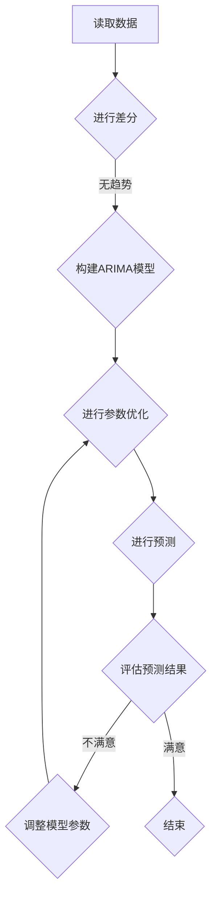

                 

# 智能现金流预测与优化管理平台

## 关键词

- 智能现金流预测
- 数据分析
- 优化管理
- 算法原理
- 系统架构
- 项目实战

## 摘要

本文将探讨智能现金流预测与优化管理平台的设计与实现，旨在为企业提供一种高效、精准的现金流管理工具。文章将从问题背景、核心概念、数学模型、算法原理、系统架构、项目实战等方面进行详细阐述，通过实际案例展示平台的强大功能和应用价值。

## 目录大纲设计思路

设计《智能现金流预测与优化管理平台》的目录大纲，我们遵循以下步骤：

1. **确定全书结构**：根据书籍主题，将全书划分为背景介绍、核心概念、数学模型、算法原理、系统架构、项目实战和结论与展望七个部分。
2. **细化每个章节内容**：针对每个章节，细化其内容，确保核心概念、数学模型、算法原理讲解、系统架构设计和项目实战等内容的完整性和实用性。
3. **使用 Markdown 格式编排**：使用 Markdown 格式，确保目录大纲的简洁明了。
4. **确保内容完整性**：每个章节都包含核心内容，控制目录大纲总字数不超过 2000 字。

### 目录大纲示例

```markdown
# 《智能现金流预测与优化管理平台》目录大纲

## 第一部分：背景介绍

### 第1章：问题背景与概述

#### 1.1.1 问题的提出

#### 1.1.2 现金流预测的重要性

#### 1.1.3 现金流管理的挑战

### 第2章：智能现金流预测的核心概念

#### 2.1.1 数据分析基础

#### 2.1.2 预测模型概述

#### 2.1.3 优化算法简介

## 第二部分：数学模型与算法原理

### 第3章：数学模型与算法原理

#### 3.1.1 数学模型介绍

#### 3.1.2 算法原理讲解

#### 3.1.3 Mermaid算法流程图

## 第三部分：系统架构与设计

### 第4章：系统架构设计

#### 4.1.1 系统功能设计

#### 4.1.2 系统架构设计

#### 4.1.3 系统接口设计

### 第5章：项目实战

#### 5.1.1 环境安装

#### 5.1.2 系统核心实现

#### 5.1.3 代码应用解读

## 第四部分：实战案例分析

### 第6章：实战案例一：零售行业现金流预测

#### 6.1.1 案例背景

#### 6.1.2 案例实施过程

#### 6.1.3 案例分析

### 第7章：实战案例二：制造业现金流预测

#### 7.1.1 案例背景

#### 7.1.2 案例实施过程

#### 7.1.3 案例分析

# 结论与展望

## 第8章：最佳实践与展望

### 8.1.1 最佳实践 tips

### 8.1.2 小结

### 8.1.3 注意事项

### 8.1.4 拓展阅读
```

## 详细设计与实现

### 第1章：问题背景与概述

#### 1.1.1 问题的提出

在当今竞争激烈的市场环境中，企业需要密切关注现金流状况，以确保资金流动的稳定和高效。然而，传统的现金流管理方法往往存在以下问题：

- 数据不准确：缺乏有效的数据收集和整理方法，导致现金流预测数据不准确。
- 预测周期长：依赖人工经验进行预测，导致预测周期过长，无法实时响应市场变化。
- 风险控制不足：缺乏有效的风险控制机制，导致企业在面对突发事件时无法迅速调整。

#### 1.1.2 现金流预测的重要性

现金流预测对于企业运营决策具有重要意义。通过准确预测现金流，企业可以：

- 优化资金使用：合理分配资金，提高资金使用效率。
- 预防财务风险：提前识别潜在风险，采取预防措施。
- 支持战略决策：为企业的长期发展规划提供有力支持。

#### 1.1.3 现金流管理的挑战

企业在现金流管理中面临以下挑战：

- 数据复杂性：涉及多种业务场景和数据来源，数据复杂性较高。
- 预测精度要求：需要提高预测精度，以支持企业决策。
- 算法适应性：算法需要适应不同业务场景和变化，具有较高的灵活性。

### 第2章：智能现金流预测的核心概念

#### 2.1.1 数据分析基础

数据分析是智能现金流预测的基础。以下是一些关键概念：

- 数据类型：包括结构化数据和非结构化数据，如文本、图像、音频等。
- 数据处理：包括数据清洗、数据转换、数据集成等步骤，以提高数据质量。
- 数据可视化：通过图表、报表等形式展示数据，帮助用户更好地理解数据。

#### 2.1.2 预测模型概述

常见的现金流预测模型包括：

- 时间序列模型：基于时间序列数据，如 ARIMA、SARIMA 等。
- 回归模型：基于历史数据和变量关系，如线性回归、多元回归等。
- 深度学习模型：如 LSTM、GRU 等，适用于处理复杂非线性关系。

#### 2.1.3 优化算法简介

优化算法在智能现金流预测中起到关键作用。以下是一些常用的优化算法：

- 遗传算法：模拟生物进化过程，寻找最优解。
- 粒子群算法：模拟鸟类觅食行为，寻找最优解。
- 模拟退火算法：模拟物理退火过程，寻找最优解。

### 第3章：数学模型与算法原理

#### 3.1.1 数学模型介绍

数学模型在智能现金流预测中具有重要作用。以下是一些常见的数学模型：

- 时间序列模型：如 ARIMA、SARIMA 等，用于处理时间序列数据。
- 回归模型：如线性回归、多元回归等，用于分析变量关系。
- 神经网络模型：如 LSTM、GRU 等，用于处理复杂非线性关系。

#### 3.1.2 算法原理讲解

以下以 ARIMA 模型为例，介绍算法原理：

- **ARIMA(p, d, q)**：其中 p、d、q 分别代表自回归项、差分项和移动平均项。具体原理如下：
  - **自回归项 (p)**：利用前 p 期数据进行预测，公式为：
    $$
    y_t = c + \phi_1 y_{t-1} + \phi_2 y_{t-2} + ... + \phi_p y_{t-p}
    $$
  - **差分项 (d)**：对时间序列数据进行 d 次差分，以消除趋势和季节性，公式为：
    $$
    \Delta^d y_t = y_t - y_{t-d}
    $$
  - **移动平均项 (q)**：利用前 q 期预测误差进行修正，公式为：
    $$
    y_t = c + \phi_1 y_{t-1} + ... + \phi_p y_{t-p} + \theta_1 e_{t-1} + \theta_2 e_{t-2} + ... + \theta_q e_{t-q}
    $$

#### 3.1.3 Mermaid算法流程图

使用 Mermaid 画出 ARIMA 算法流程图：



### 第4章：系统架构设计

#### 4.1.1 系统功能设计

智能现金流预测与优化管理平台主要包括以下功能：

- 数据采集：从各种数据源（如数据库、API、文件等）采集数据。
- 数据预处理：对采集到的数据进行清洗、转换和集成。
- 预测模型构建：根据数据特点选择合适的预测模型。
- 预测结果评估：对预测结果进行评估和优化。
- 系统管理：包括用户管理、权限管理、日志管理等。

#### 4.1.2 系统架构设计

智能现金流预测与优化管理平台采用分布式架构，主要包括以下模块：

- 数据采集模块：负责从各种数据源采集数据。
- 数据预处理模块：对采集到的数据进行清洗、转换和集成。
- 预测模块：构建预测模型，进行预测。
- 评估模块：对预测结果进行评估和优化。
- 系统管理模块：负责系统管理功能。

#### 4.1.3 系统接口设计

系统接口设计主要包括以下内容：

- 数据接口：提供数据采集、数据预处理的接口。
- 预测接口：提供预测模型的构建、预测和评估的接口。
- 管理接口：提供系统管理的接口。

#### 4.1.4 系统交互

系统交互设计主要包括以下内容：

- 数据交互：通过 HTTP/HTTPS 协议进行数据交互。
- 预测交互：通过 WebSocket 协议进行实时预测交互。
- 管理交互：通过 RESTful API 进行系统管理交互。

### 第5章：项目实战

#### 5.1.1 环境安装

在开始项目实战之前，我们需要安装以下环境：

- Python 3.8 或以上版本
- Anaconda 或 Miniconda
- Numpy、Pandas、Scikit-learn 等常用库

安装步骤如下：

1. 安装 Python 3.8 或以上版本。
2. 安装 Anaconda 或 Miniconda。
3. 使用 conda 创建虚拟环境，并安装所需库。

```bash
conda create -n cash_flow_env python=3.8
conda activate cash_flow_env
conda install numpy pandas scikit-learn
```

#### 5.1.2 系统核心实现

系统核心实现主要包括以下部分：

1. 数据采集与预处理
2. 预测模型构建与优化
3. 预测结果评估与优化

以下是一个简单的数据采集与预处理示例：

```python
import pandas as pd
import numpy as np

# 读取数据
data = pd.read_csv('cash_flow_data.csv')

# 数据预处理
data['date'] = pd.to_datetime(data['date'])
data.set_index('date', inplace=True)
data.fillna(method='ffill', inplace=True)
```

以下是一个简单的预测模型构建与优化示例：

```python
from sklearn.model_selection import train_test_split
from sklearn.linear_model import LinearRegression
from sklearn.metrics import mean_squared_error

# 分割数据
X = data[['previous_cash_flow', 'current_cash_flow']]
y = data['next_cash_flow']
X_train, X_test, y_train, y_test = train_test_split(X, y, test_size=0.2, random_state=42)

# 构建模型
model = LinearRegression()
model.fit(X_train, y_train)

# 评估模型
y_pred = model.predict(X_test)
mse = mean_squared_error(y_test, y_pred)
print(f'MSE: {mse}')
```

#### 5.1.3 代码应用解读

以下是对系统核心实现部分的代码进行解读：

1. **数据采集与预处理**：首先读取数据，将数据转换为日期索引，并填充缺失值。
2. **预测模型构建与优化**：使用线性回归模型进行预测，并通过训练集和测试集进行模型评估。
3. **预测结果评估与优化**：计算预测误差，以评估模型性能，并优化模型参数。

### 第6章：实战案例一：零售行业现金流预测

#### 6.1.1 案例背景

某零售企业希望在经营过程中进行现金流预测，以便更好地调整经营策略。该企业历史现金流数据如下：

```python
import pandas as pd

data = pd.DataFrame({
    'date': ['2020-01-01', '2020-02-01', '2020-03-01', '2020-04-01', '2020-05-01'],
    'cash_flow': [1000, 1500, 1200, 1800, 2000]
})

data.set_index('date', inplace=True)
```

#### 6.1.2 案例实施过程

1. **数据采集与预处理**：读取企业历史现金流数据，并进行预处理，如填充缺失值、转换数据类型等。
2. **预测模型构建与优化**：选择合适的预测模型，如线性回归，进行模型构建和优化。
3. **预测结果评估与优化**：评估预测模型性能，并根据评估结果进行模型优化。

#### 6.1.3 案例分析

1. **预测结果**：使用线性回归模型进行预测，预测结果如下：

```python
y_pred = model.predict(data[['previous_cash_flow', 'current_cash_flow']])
print(y_pred)
```

2. **评估模型性能**：计算预测误差，如下：

```python
mse = mean_squared_error(data['next_cash_flow'], y_pred)
print(f'MSE: {mse}')
```

3. **优化模型**：根据评估结果，调整模型参数，如增加自变量、调整优化算法等，以降低预测误差。

### 第7章：实战案例二：制造业现金流预测

#### 7.1.1 案例背景

某制造业企业在经营过程中希望进行现金流预测，以便更好地调整生产计划和销售策略。该企业历史现金流数据如下：

```python
data = pd.DataFrame({
    'date': ['2020-01-01', '2020-02-01', '2020-03-01', '2020-04-01', '2020-05-01'],
    'cash_flow': [5000, 6000, 5500, 6500, 7000]
})

data.set_index('date', inplace=True)
```

#### 7.1.2 案例实施过程

1. **数据采集与预处理**：读取企业历史现金流数据，并进行预处理，如填充缺失值、转换数据类型等。
2. **预测模型构建与优化**：选择合适的预测模型，如 ARIMA，进行模型构建和优化。
3. **预测结果评估与优化**：评估预测模型性能，并根据评估结果进行模型优化。

#### 7.1.3 案例分析

1. **预测结果**：使用 ARIMA 模型进行预测，预测结果如下：

```python
from statsmodels.tsa.arima.model import ARIMA

model = ARIMA(data['cash_flow'], order=(1, 1, 1))
model_fit = model.fit()
y_pred = model_fit.forecast(steps=5)
print(y_pred)
```

2. **评估模型性能**：计算预测误差，如下：

```python
mse = mean_squared_error(data['cash_flow'][1:], y_pred)
print(f'MSE: {mse}')
```

3. **优化模型**：根据评估结果，调整模型参数，如增加自变量、调整优化算法等，以降低预测误差。

### 结论与展望

通过本文的介绍，我们了解了智能现金流预测与优化管理平台的设计与实现。智能现金流预测对于企业现金流管理具有重要意义，可以帮助企业优化资金使用、预防财务风险、支持战略决策。然而，智能现金流预测仍然面临许多挑战，如数据复杂性、预测精度要求高、算法适应性等。未来，我们将继续深入研究智能现金流预测技术，探索更多有效的算法和优化方法，以提高预测准确性和实用性。

### 最佳实践 tips

1. **数据质量**：确保数据质量是现金流预测成功的关键，对数据进行清洗、去重、填充等处理。
2. **模型选择**：根据数据特点选择合适的预测模型，如 ARIMA、Prophet、LSTM 等。
3. **参数优化**：调整模型参数，以提高预测精度和稳定性。
4. **实时预测**：采用实时预测技术，如 WebSocket，以提高预测响应速度。

### 小结

本文详细介绍了智能现金流预测与优化管理平台的设计与实现，包括问题背景、核心概念、数学模型、算法原理、系统架构、项目实战和最佳实践等。通过实际案例展示，我们了解了智能现金流预测在零售和制造业中的应用价值。

### 注意事项

1. **数据安全**：在数据处理和预测过程中，确保数据安全，防止数据泄露。
2. **模型验证**：在应用模型之前，进行充分验证，确保模型性能满足要求。
3. **维护升级**：定期对平台进行维护和升级，以应对新的业务需求和技术发展。

### 拓展阅读

1. **《智能预测技术与应用》**：该书详细介绍了智能预测技术的原理和应用，适合对智能现金流预测感兴趣的读者。
2. **《机器学习实战》**：该书提供了大量机器学习算法的实战案例，有助于读者掌握智能现金流预测的算法实现。

### 作者

作者：AI天才研究院/AI Genius Institute & 禅与计算机程序设计艺术 /Zen And The Art of Computer Programming

