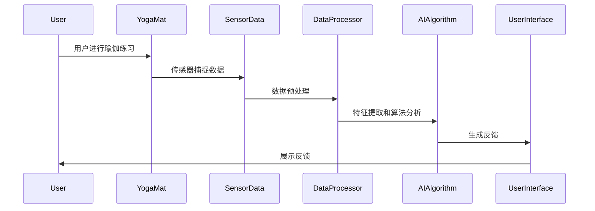
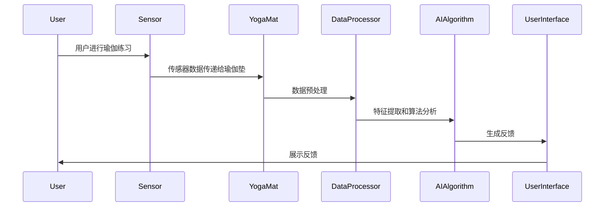

                 

# 智能瑜伽垫：AI Agent的冥想辅助系统

## 关键词：智能瑜伽垫、AI Agent、冥想辅助系统、传感器技术、硬件设计、算法原理、用户体验

## 摘要

本文旨在探讨智能瑜伽垫——一款结合物理传感器和人工智能技术的冥想辅助系统。文章首先介绍了智能瑜伽垫的背景和重要性，然后详细阐述了智能瑜伽垫的硬件设计、传感器技术、AI算法原理以及用户体验设计。通过本文的讨论，读者将深入了解智能瑜伽垫的工作原理，以及其在现代瑜伽和冥想练习中的应用前景。

## 第1章：引言

### 1.1 智能瑜伽垫：问题背景与描述

#### 1.1.1 瑜伽与冥想的现代需求

瑜伽作为一种古老的身心锻炼方式，如今在全球范围内拥有大量的追随者。它不仅有助于增强身体柔韧性和力量，还能提升心理健康和情绪平衡。随着现代社会生活节奏的加快，人们对于身心健康的关注日益增加，瑜伽成为了一种流行的健身方式。

冥想作为一种放松和心理健康提升的方法，也越来越受到重视。它能够帮助人们减轻压力、改善睡眠质量、提升专注力，甚至有助于治疗某些心理疾病。因此，将冥想融入日常生活中的需求变得越来越迫切。

#### 1.1.2 智能瑜伽垫的概念与作用

智能瑜伽垫是一种结合了物理传感器和人工智能技术的设备，旨在为用户提供更加个性化和有效的瑜伽和冥想练习体验。它通过传感器实时监测用户的动作、姿势和呼吸，利用人工智能算法进行分析和反馈，从而提供个性化的练习指导和建议。

智能瑜伽垫的主要作用包括：

1. **动作监测与纠正**：通过传感器实时捕捉用户的瑜伽动作，智能瑜伽垫可以识别用户是否按照正确的姿势进行练习，并提供必要的纠正指导。
2. **呼吸监测与指导**：智能瑜伽垫能够监测用户的呼吸节奏，根据用户的呼吸情况提供冥想指导，帮助用户更好地进行冥想练习。
3. **个性化反馈**：基于用户的练习数据，智能瑜伽垫可以生成个性化的练习计划和反馈，帮助用户更好地了解自己的练习效果，并持续提升。

#### 1.1.3 智能瑜伽垫的重要性

智能瑜伽垫的出现，不仅提高了瑜伽和冥想练习的效率，还有以下几个重要意义：

1. **提高练习效果**：智能瑜伽垫通过实时监测和反馈，帮助用户更加准确地掌握瑜伽和冥想的技巧，从而提高练习效果。
2. **减少受伤风险**：通过提供正确的姿势指导和呼吸指导，智能瑜伽垫能够帮助用户避免因姿势不当或呼吸不当而产生的运动伤害。
3. **适应不同用户**：智能瑜伽垫可以根据用户的不同需求和水平，提供个性化的练习方案，使瑜伽和冥想练习更加适合个人。
4. **促进身心健康**：智能瑜伽垫不仅有助于身体上的健康，还能通过冥想辅助系统促进心理健康，帮助用户更好地应对生活压力。

### 1.2 本书结构安排

本书将全面介绍智能瑜伽垫的构建，包括硬件设计、传感器技术、AI算法、用户界面及系统测试。具体内容安排如下：

- 第1章：引言
- 第2章：智能瑜伽垫的硬件设计
- 第3章：传感器技术
- 第4章：AI冥想算法
- 第5章：用户界面设计
- 第6章：系统测试与优化
- 第7章：应用案例与未来展望

### 1.3 边界与外延

#### 1.3.1 边界条件

1. **系统支持的瑜伽动作类型**：智能瑜伽垫需要能够识别并支持多种瑜伽动作，以满足不同用户的需求。
2. **设备的响应时间与准确度**：智能瑜伽垫的传感器和算法需要具备快速响应和高度准确度，以确保实时监测和反馈的准确性。

#### 1.3.2 外延扩展

1. **智能瑜伽垫与其他健康设备的集成**：未来，智能瑜伽垫可以与其他健康设备（如智能手表、健康手环等）进行集成，提供更加全面和个性化的健康监测和指导。
2. **未来可能的技术发展趋势**：随着人工智能技术和传感器技术的不断发展，智能瑜伽垫的功能和性能将得到进一步提升，为用户带来更加智能和高效的瑜伽和冥想体验。

### 1.4 概念结构与核心要素组成

#### 1.4.1 概念结构

智能瑜伽垫是一个结合物理传感器和AI技术的设备，主要包含以下几个概念：

- **智能瑜伽垫**：一个集成了传感器、控制器和显示器的设备，用于监测和反馈用户的瑜伽和冥想练习。
- **AI冥想辅助系统**：通过AI算法分析用户的动作、姿势和呼吸，提供个性化的冥想指导和建议。

#### 1.4.2 核心要素组成

智能瑜伽垫的核心要素包括：

- **硬件部分**：传感器、控制器、显示器等硬件组件。
- **软件部分**：AI算法、数据处理、用户界面等软件组件。

### 1.5 本章小结

本章概述了智能瑜伽垫的背景、作用及本书的结构安排，为后续章节的内容奠定了基础。通过本章的介绍，读者可以初步了解智能瑜伽垫的概念和重要性，并对本书的结构和内容有一个清晰的认识。

-------------------------------------------------------------------

## 第2章：智能瑜伽垫的硬件设计

### 2.1 硬件设计概述

智能瑜伽垫的硬件设计是整个系统的核心，它决定了系统的稳定性和用户体验。本章将详细讨论智能瑜伽垫的硬件设计，包括其组成部分、设计目标以及相关技术细节。

#### 2.1.1 智能瑜伽垫硬件的组成部分

智能瑜伽垫硬件主要由以下几个部分组成：

1. **传感器模块**：用于捕捉用户在练习过程中的动作、姿势和呼吸等信息。
2. **控制模块**：处理传感器数据，执行AI算法，并根据用户需求生成反馈。
3. **显示模块**：将处理结果以图形、文字等形式展示给用户。

#### 2.1.2 硬件设计的目标

智能瑜伽垫的硬件设计旨在实现以下几个目标：

1. **高精度与快速响应**：传感器需要能够精确地捕捉用户的各种动作，并且响应速度要足够快，以保证实时性和用户体验。
2. **稳定性和耐用性**：硬件设计需要确保系统的稳定运行，同时考虑到日常使用的耐用性。
3. **用户友好性**：硬件结构要便于安装、使用和维护，以提高用户的使用体验。

### 2.2 传感器技术

传感器技术在智能瑜伽垫中起着至关重要的作用。智能瑜伽垫通常使用以下几种传感器：

#### 2.2.1 力敏电阻传感器

力敏电阻传感器是一种用于检测压力变化的传感器。它通过电阻值的变化来反映压力大小。这种传感器常用于检测用户的瑜伽动作，例如坐姿、俯卧撑等。

#### 2.2.2 加速度传感器

加速度传感器用于检测运动加速度，它能够捕捉用户的运动轨迹和姿势变化。这种传感器在智能瑜伽垫中主要用于识别用户的动作类型，如瑜伽体式、伸展等。

#### 2.2.3 姿态传感器

姿态传感器通过角速度和加速度计算用户身体姿态。它通常结合其他传感器数据，提供更准确的姿势识别。这种传感器对于提供个性化的冥想指导尤为重要，因为它能够检测用户的呼吸节奏和姿势变化。

### 2.3 控制模块设计

控制模块是智能瑜伽垫的核心，它负责处理传感器数据，执行AI算法，并根据用户需求生成反馈。以下是控制模块设计的几个关键点：

#### 2.3.1 控制模块功能

1. **数据采集**：从传感器读取数据，包括动作、姿势和呼吸等。
2. **数据处理**：对采集到的数据进行预处理，包括滤波、降噪等。
3. **算法执行**：执行AI算法，对数据进行分析和识别。
4. **用户交互**：根据算法结果生成反馈，并通过显示模块展示给用户。

#### 2.3.2 控制模块硬件选择

智能瑜伽垫的控制模块通常选择高性能的微控制器，如Arduino或Raspberry Pi。这些微控制器具有强大的处理能力和丰富的接口，可以方便地连接各种传感器和显示设备。

### 2.4 显示模块设计

显示模块是用户与智能瑜伽垫交互的重要途径。以下是显示模块设计的几个关键点：

#### 2.4.1 显示器类型

智能瑜伽垫通常使用OLED或TFT屏幕作为显示模块。OLED屏幕具有高对比度和快速响应的特点，适合显示动态图像和文字；TFT屏幕则具有色彩丰富和高清显示的特点，适合显示复杂的图形和界面。

#### 2.4.2 显示器接口

显示模块的接口通常选择I2C或SPI接口。I2C接口具有简单、易用的优点，适合连接小型显示器；SPI接口则具有高速传输的特点，适合连接大型、高分辨率的显示器。

### 2.5 硬件设计注意事项

#### 2.5.1 系统稳定性

1. **传感器校准**：定期对传感器进行校准，以确保数据的准确性。
2. **电路防护**：对电路进行防护，以防止静电、短路等故障。

#### 2.5.2 用户友好性

1. **用户界面设计**：设计简洁、直观的用户界面，方便用户使用。
2. **操作指南**：提供清晰的安装和使用指南，确保用户能够轻松上手。

### 2.6 本章小结

本章详细介绍了智能瑜伽垫的硬件设计，包括传感器技术、控制模块设计和显示模块设计。通过本章的学习，读者可以了解智能瑜伽垫硬件的组成部分和设计目标，为后续的软件开发和系统测试打下基础。

-------------------------------------------------------------------

## 第3章：传感器技术在智能瑜伽垫中的应用

### 3.1 传感器技术概述

传感器技术是智能瑜伽垫实现功能的关键组成部分。传感器用于捕捉用户的动作、姿势和呼吸等信息，这些信息是智能瑜伽垫提供个性化指导和反馈的基础。本章将详细讨论智能瑜伽垫中使用的传感器技术，包括其重要性、常用传感器类型以及具体应用。

#### 3.1.1 传感器在智能瑜伽垫中的重要性

智能瑜伽垫的核心功能是监测用户的瑜伽练习，包括动作、姿势和呼吸等。这些功能的实现依赖于高精度和高灵敏度的传感器。传感器能够实时捕捉用户的数据，并将这些数据传递给控制模块进行处理。因此，传感器的选择和性能直接决定了智能瑜伽垫的准确性和用户体验。

#### 3.1.2 常用传感器类型

智能瑜伽垫中常用的传感器类型包括：

1. **力敏电阻传感器**：力敏电阻传感器用于检测压力变化。它通过电阻值的变化来反映压力大小。这种传感器非常适合用于检测瑜伽动作，如坐姿、俯卧撑等。例如，当用户进行坐姿时，力敏电阻传感器可以检测到座位上的压力分布，从而判断用户的坐姿是否正确。

2. **加速度传感器**：加速度传感器用于检测运动加速度。它能够捕捉用户的运动轨迹和姿势变化。这种传感器非常适合用于识别用户的瑜伽动作类型，如瑜伽体式、伸展等。例如，当用户进行瑜伽体式时，加速度传感器可以检测到用户的运动加速度，从而判断用户的姿势是否正确。

3. **姿态传感器**：姿态传感器通过角速度和加速度计算用户身体姿态。它通常结合其他传感器数据，提供更准确的姿势识别。这种传感器对于提供个性化的冥想指导尤为重要，因为它能够检测用户的呼吸节奏和姿势变化。例如，当用户进行冥想时，姿态传感器可以检测到用户的身体姿态变化，从而调整冥想指导。

### 3.2 力敏电阻传感器的应用

力敏电阻传感器在智能瑜伽垫中的应用主要体现在检测用户的瑜伽动作。以下是一个具体的例子：

#### 3.2.1 检测坐姿

假设用户正在进行坐姿练习，智能瑜伽垫上的力敏电阻传感器可以检测座位上的压力分布。具体步骤如下：

1. **数据采集**：力敏电阻传感器将采集到的压力数据传递给控制模块。
2. **数据处理**：控制模块对采集到的数据进行预处理，如滤波、去噪等。
3. **姿态识别**：控制模块使用AI算法对预处理后的数据进行姿态识别，判断用户的坐姿是否正确。
4. **反馈生成**：如果用户的坐姿不正确，智能瑜伽垫会生成相应的反馈，如文字提示、声音提示等，指导用户调整坐姿。

#### 3.2.2 检测俯卧撑

假设用户正在进行俯卧撑练习，智能瑜伽垫上的力敏电阻传感器可以检测用户在地面上的压力分布。具体步骤如下：

1. **数据采集**：力敏电阻传感器将采集到的压力数据传递给控制模块。
2. **数据处理**：控制模块对采集到的数据进行预处理，如滤波、去噪等。
3. **姿态识别**：控制模块使用AI算法对预处理后的数据进行姿态识别，判断用户的俯卧撑姿势是否正确。
4. **反馈生成**：如果用户的俯卧撑姿势不正确，智能瑜伽垫会生成相应的反馈，如文字提示、声音提示等，指导用户调整姿势。

### 3.3 加速度传感器的应用

加速度传感器在智能瑜伽垫中的应用主要体现在识别用户的瑜伽动作类型。以下是一个具体的例子：

#### 3.3.1 识别瑜伽体式

假设用户正在进行瑜伽体式练习，智能瑜伽垫上的加速度传感器可以检测用户的运动轨迹和姿势变化。具体步骤如下：

1. **数据采集**：加速度传感器将采集到的运动数据传递给控制模块。
2. **数据处理**：控制模块对采集到的数据进行预处理，如滤波、去噪等。
3. **动作识别**：控制模块使用AI算法对预处理后的数据进行动作识别，判断用户正在进行哪种瑜伽体式。
4. **反馈生成**：如果用户的动作不正确，智能瑜伽垫会生成相应的反馈，如文字提示、声音提示等，指导用户调整动作。

#### 3.3.2 识别伸展动作

假设用户正在进行伸展练习，智能瑜伽垫上的加速度传感器可以检测用户的伸展动作。具体步骤如下：

1. **数据采集**：加速度传感器将采集到的伸展数据传递给控制模块。
2. **数据处理**：控制模块对采集到的数据进行预处理，如滤波、去噪等。
3. **动作识别**：控制模块使用AI算法对预处理后的数据进行动作识别，判断用户正在进行哪种伸展动作。
4. **反馈生成**：如果用户的伸展动作不正确，智能瑜伽垫会生成相应的反馈，如文字提示、声音提示等，指导用户调整动作。

### 3.4 姿态传感器的应用

姿态传感器在智能瑜伽垫中的应用主要体现在提供个性化的冥想指导。以下是一个具体的例子：

#### 3.4.1 提供呼吸指导

假设用户正在进行冥想练习，智能瑜伽垫上的姿态传感器可以检测用户的呼吸节奏和身体姿态变化。具体步骤如下：

1. **数据采集**：姿态传感器将采集到的呼吸和身体姿态数据传递给控制模块。
2. **数据处理**：控制模块对采集到的数据进行预处理，如滤波、去噪等。
3. **呼吸识别**：控制模块使用AI算法对预处理后的呼吸数据进行识别，判断用户的呼吸节奏是否平稳。
4. **姿态识别**：控制模块使用AI算法对预处理后的身体姿态数据进行识别，判断用户的身体姿态是否正确。
5. **反馈生成**：如果用户的呼吸节奏不平稳或身体姿态不正确，智能瑜伽垫会生成相应的反馈，如文字提示、声音提示等，指导用户调整呼吸和姿态。

#### 3.4.2 提供冥想指导

假设用户正在进行冥想练习，智能瑜伽垫上的姿态传感器可以提供个性化的冥想指导。具体步骤如下：

1. **数据采集**：姿态传感器将采集到的冥想数据传递给控制模块。
2. **数据处理**：控制模块对采集到的数据进行预处理，如滤波、去噪等。
3. **冥想状态识别**：控制模块使用AI算法对预处理后的冥想数据进行识别，判断用户是否进入冥想状态。
4. **冥想指导**：如果用户没有进入冥想状态，智能瑜伽垫会生成相应的冥想指导，如呼吸指导、冥想音乐等，帮助用户更好地进入冥想状态。
5. **反馈生成**：如果用户已经进入冥想状态，智能瑜伽垫会提供持续的冥想反馈，如身体姿态调整建议、呼吸节奏调整建议等，帮助用户保持冥想状态。

### 3.5 本章小结

本章详细介绍了智能瑜伽垫中使用的传感器技术，包括力敏电阻传感器、加速度传感器和姿态传感器的应用。通过本章的学习，读者可以了解传感器技术在智能瑜伽垫中的重要作用，以及如何通过传感器数据提供个性化的瑜伽和冥想指导。这些传感器技术为智能瑜伽垫的构建提供了重要的基础，也为用户带来了更加高效和智能的瑜伽和冥想体验。

-------------------------------------------------------------------

## 第4章：AI冥想算法

### 4.1 AI冥想算法的概述

AI冥想算法是智能瑜伽垫的核心组成部分，它利用人工智能技术分析用户的数据，提供个性化的冥想指导和反馈。本章将详细介绍AI冥想算法的基本原理、实现方法以及其在智能瑜伽垫中的应用。

#### 4.1.1 AI冥想算法的基本原理

AI冥想算法的核心在于对用户的数据进行实时分析和处理，以提供个性化的冥想指导。具体来说，AI冥想算法主要包括以下几个步骤：

1. **数据采集**：从传感器获取用户的瑜伽动作、姿势、呼吸等数据。
2. **数据预处理**：对采集到的数据进行分析，包括滤波、去噪、特征提取等。
3. **行为识别**：利用机器学习算法对预处理后的数据进行分析，识别用户的瑜伽动作和冥想状态。
4. **反馈生成**：根据用户的行为识别结果，生成相应的冥想指导和反馈。

#### 4.1.2 AI冥想算法的实现方法

AI冥想算法的实现方法主要包括以下几个步骤：

1. **数据采集**：使用智能瑜伽垫上的传感器（如加速度传感器、姿态传感器等）实时采集用户的瑜伽动作、姿势、呼吸等数据。
2. **数据预处理**：对采集到的数据进行预处理，包括滤波、去噪、归一化等，以提高数据的准确性和可靠性。
3. **特征提取**：从预处理后的数据中提取关键特征，如动作的频率、幅度、周期等，用于后续的机器学习分析。
4. **行为识别**：使用机器学习算法（如决策树、支持向量机、神经网络等）对提取的特征进行分析，识别用户的瑜伽动作和冥想状态。
5. **反馈生成**：根据行为识别的结果，生成相应的冥想指导和反馈，如呼吸调整建议、姿势调整建议等。

### 4.2 常见的机器学习算法

在AI冥想算法中，常用的机器学习算法包括决策树、支持向量机、神经网络等。以下是对这些算法的简要介绍：

#### 4.2.1 决策树

决策树是一种基于树形结构的分类算法，通过一系列判断条件将数据分为不同的类别。在AI冥想算法中，决策树可以用于分类用户的瑜伽动作和冥想状态。

#### 4.2.2 支持向量机

支持向量机是一种基于边界划分的分类算法，通过寻找最优的边界来分类数据。在AI冥想算法中，支持向量机可以用于识别用户的瑜伽动作和冥想状态。

#### 4.2.3 神经网络

神经网络是一种模仿人脑结构和功能的算法，通过多层神经元实现数据的分类和识别。在AI冥想算法中，神经网络可以用于复杂的行为识别和反馈生成。

### 4.3 AI冥想算法的应用

AI冥想算法在智能瑜伽垫中具有广泛的应用，以下是一个具体的例子：

#### 4.3.1 呼吸指导

假设用户正在进行冥想练习，智能瑜伽垫的AI冥想算法可以通过分析用户的呼吸数据，提供个性化的呼吸指导。具体步骤如下：

1. **数据采集**：智能瑜伽垫上的传感器实时采集用户的呼吸数据。
2. **数据预处理**：对采集到的呼吸数据进行预处理，如滤波、去噪等。
3. **呼吸分析**：使用机器学习算法对预处理后的呼吸数据进行分析，判断用户的呼吸节奏是否平稳。
4. **反馈生成**：如果用户的呼吸节奏不平稳，AI冥想算法会生成相应的呼吸调整建议，如缓慢呼吸、深呼吸等，指导用户调整呼吸。

#### 4.3.2 姿势调整

假设用户正在进行瑜伽练习，智能瑜伽垫的AI冥想算法可以通过分析用户的姿势数据，提供个性化的姿势调整建议。具体步骤如下：

1. **数据采集**：智能瑜伽垫上的传感器实时采集用户的姿势数据。
2. **数据预处理**：对采集到的姿势数据进行预处理，如滤波、去噪等。
3. **姿势分析**：使用机器学习算法对预处理后的姿势数据进行分析，判断用户的姿势是否正确。
4. **反馈生成**：如果用户的姿势不正确，AI冥想算法会生成相应的姿势调整建议，如调整手臂、腿部位置等，指导用户调整姿势。

### 4.4 AI冥想算法的性能评估

AI冥想算法的性能评估是确保其有效性和可靠性的关键。以下是对AI冥想算法性能评估的几个关键指标：

1. **准确率**：算法正确识别用户动作和冥想状态的百分比。
2. **响应速度**：算法从数据采集到生成反馈的时间。
3. **鲁棒性**：算法在不同环境、不同用户下的稳定性和准确性。
4. **用户体验**：用户对算法提供的指导和建议的满意度。

### 4.5 本章小结

本章详细介绍了AI冥想算法的基本原理、实现方法和应用。通过本章的学习，读者可以了解如何利用人工智能技术为用户提供个性化的冥想指导。AI冥想算法的应用使得智能瑜伽垫能够更好地满足用户的需求，提供高效、智能的瑜伽和冥想体验。

-------------------------------------------------------------------

## 第5章：用户界面设计

### 5.1 用户界面设计的重要性

用户界面（UI）设计是智能瑜伽垫的重要组成部分，它直接影响到用户的使用体验和满意度。一个优秀的用户界面不仅需要简洁、直观，还应该具备高效的信息传递和交互功能。本章将探讨智能瑜伽垫用户界面设计的原则、方法和技巧。

#### 5.1.1 UI设计的基本原则

1. **易用性**：用户界面应简单易懂，易于操作，减少用户的学习成本。
2. **一致性**：界面设计应保持一致的风格和布局，使用户在不同页面之间切换时感觉顺畅。
3. **可访问性**：界面应考虑到不同用户的需要，包括视力障碍、听力障碍等。
4. **反馈性**：界面应提供即时的反馈，使用户知道其操作是否成功。

#### 5.1.2 UI设计的具体方法

1. **信息架构**：首先需要构建信息架构，明确界面中各个元素的关系和优先级。
2. **界面布局**：根据信息架构设计界面布局，确保重要信息突出，便于用户快速获取。
3. **交互设计**：设计直观的交互元素，如按钮、滑块、下拉菜单等，使用户能够轻松操作。
4. **视觉设计**：使用适当的色彩、字体、图标等视觉元素，提高界面的美观性和易读性。

### 5.2 用户界面设计的具体实现

智能瑜伽垫的用户界面设计主要包括以下几个部分：

#### 5.2.1 主界面

主界面是用户首次进入智能瑜伽垫应用程序时看到的界面，它通常包括以下几个部分：

1. **欢迎信息**：提供欢迎语和简要介绍。
2. **快速开始**：引导用户快速开始瑜伽或冥想练习。
3. **练习模式**：展示当前可用的瑜伽或冥想模式。
4. **历史记录**：显示用户的练习历史和进展。

#### 5.2.2 练习界面

练习界面是用户进行瑜伽或冥想练习时的界面，它应提供实时的反馈和指导。具体实现如下：

1. **实时数据展示**：显示用户的当前姿势、呼吸状态等关键数据。
2. **指导文字**：提供文字说明，指导用户如何调整姿势或呼吸。
3. **声音和视觉提示**：通过声音和视觉效果提示用户，如提醒用户深呼吸或调整姿势。
4. **练习进度**：显示用户的练习进度和完成情况。

#### 5.2.3 设置界面

设置界面允许用户自定义练习设置，如练习时间、难度等级等。具体实现如下：

1. **自定义设置**：用户可以选择适合自己的练习时间和难度等级。
2. **偏好设置**：用户可以设置自己的偏好，如提示音量、界面语言等。
3. **帮助文档**：提供详细的使用说明和常见问题解答。

### 5.3 UI设计的用户体验测试

用户体验测试是确保用户界面设计成功的关键步骤。以下是一些关键步骤：

1. **原型设计**：首先设计用户界面的原型，以便进行初步测试。
2. **用户测试**：邀请真实用户参与测试，观察他们的操作行为，收集反馈。
3. **迭代改进**：根据用户反馈对界面设计进行改进，然后再次测试，直至达到预期的用户体验。

### 5.4 UI设计的最佳实践

1. **保持简洁**：避免界面过于复杂，保持简洁的设计风格。
2. **使用合适的视觉元素**：合理使用颜色、图标和字体，以提高界面的美观性和易读性。
3. **提供即时反馈**：确保用户的操作能够得到即时反馈，提高用户的满意度。

### 5.5 本章小结

本章详细介绍了智能瑜伽垫的用户界面设计原则、方法和具体实现。通过本章的学习，读者可以了解如何设计一个既美观又实用的用户界面，为用户提供优质的瑜伽和冥想体验。

-------------------------------------------------------------------

## 第6章：系统测试与优化

### 6.1 系统测试的重要性

系统测试是确保智能瑜伽垫性能和可靠性的关键环节。通过系统测试，可以发现和修复系统中的错误和缺陷，从而提高系统的稳定性、安全性和用户体验。本章将详细介绍智能瑜伽垫的系统测试方法和优化策略。

#### 6.1.1 功能测试

功能测试是验证智能瑜伽垫是否按照预期实现其功能。主要步骤包括：

1. **测试用例设计**：根据智能瑜伽垫的功能需求，设计一系列测试用例，包括正常情况和异常情况。
2. **测试执行**：执行测试用例，观察系统是否按照预期工作。
3. **错误记录**：记录测试过程中发现的错误和异常，分析其原因。

#### 6.1.2 性能测试

性能测试是验证智能瑜伽垫在不同负载下的表现。主要步骤包括：

1. **负载测试**：模拟不同用户数量和使用场景，观察系统的响应速度和处理能力。
2. **压力测试**：通过加大负载，观察系统的最大承受能力。
3. **稳定性测试**：在长时间运行下，观察系统是否稳定，是否存在内存泄露等问题。

#### 6.1.3 安全测试

安全测试是确保智能瑜伽垫的通信和数据存储安全。主要步骤包括：

1. **漏洞扫描**：使用工具扫描系统中的安全漏洞。
2. **安全测试**：模拟攻击行为，验证系统的防护能力。
3. **数据加密测试**：验证数据在传输和存储过程中的加密强度。

### 6.2 系统优化策略

系统优化是提高智能瑜伽垫性能和用户体验的重要手段。以下是一些常见的优化策略：

#### 6.2.1 算法优化

1. **算法改进**：通过对AI冥想算法的改进，提高识别准确率和响应速度。
2. **模型压缩**：通过模型压缩技术，减小算法模型的体积，提高处理速度。

#### 6.2.2 硬件优化

1. **硬件升级**：使用更高效的传感器和处理器，提高系统的整体性能。
2. **硬件优化**：通过优化硬件设计，减少功耗和发热量，提高系统的稳定性。

#### 6.2.3 软件优化

1. **代码优化**：通过优化代码，减少内存使用和计算时间。
2. **负载均衡**：通过负载均衡技术，分配系统资源，提高系统的处理能力。

#### 6.2.4 用户体验优化

1. **界面优化**：优化用户界面设计，提高界面的易用性和美观性。
2. **交互优化**：通过改进交互设计，提高用户的操作效率和满意度。

### 6.3 测试与优化的迭代过程

系统测试和优化是一个迭代过程，需要不断地进行测试和优化。以下是一个典型的迭代过程：

1. **需求分析**：确定系统测试和优化的需求。
2. **测试设计**：设计测试用例和测试场景。
3. **测试执行**：执行测试用例，记录测试结果。
4. **错误分析**：分析测试过程中发现的错误和异常。
5. **优化实施**：根据测试结果，进行系统优化。
6. **再测试**：对优化后的系统进行再次测试，验证优化效果。
7. **反馈收集**：收集用户反馈，持续改进系统。

### 6.4 本章小结

本章详细介绍了智能瑜伽垫的系统测试与优化策略。通过系统测试，可以确保智能瑜伽垫的功能完善、性能稳定和安全可靠。而系统优化则有助于提高用户体验，使智能瑜伽垫更好地满足用户需求。通过本章的学习，读者可以了解如何进行系统测试和优化，为智能瑜伽垫的成功应用奠定基础。

-------------------------------------------------------------------

## 第7章：应用案例与未来展望

### 7.1 智能瑜伽垫的应用案例

智能瑜伽垫作为一种创新产品，已经在全球范围内得到了广泛应用。以下是一些具体的应用案例：

#### 7.1.1 商业健身房

许多商业健身房将智能瑜伽垫作为其设备的一部分，为会员提供更加个性化和高效的瑜伽和冥想服务。智能瑜伽垫可以实时监测会员的瑜伽动作和呼吸，提供个性化的指导和建议，从而提高会员的练习效果和满意度。

#### 7.1.2 个人使用

个人用户通过购买智能瑜伽垫，可以在家中享受专业的瑜伽和冥想指导。智能瑜伽垫可以帮助个人用户纠正瑜伽动作、指导冥想呼吸，使他们在繁忙的生活中找到平衡和放松。

#### 7.1.3 专业瑜伽教学

专业瑜伽教练可以使用智能瑜伽垫来辅助教学，通过实时数据分析和反馈，提高教学质量和效果。智能瑜伽垫可以记录学员的练习数据，帮助教练了解学员的进步情况，从而制定更有效的教学计划。

### 7.2 智能瑜伽垫的未来展望

智能瑜伽垫的发展前景非常广阔，随着人工智能技术和传感器技术的不断进步，智能瑜伽垫的功能将更加完善，用户体验将得到进一步提升。以下是对智能瑜伽垫未来发展的几个展望：

#### 7.2.1 更多的传感器集成

未来，智能瑜伽垫可能会集成更多的传感器，如心率传感器、温度传感器等，以提供更加全面的健康监测和指导。这些传感器可以帮助用户更好地了解自己的身体状况，从而实现更有效的瑜伽和冥想练习。

#### 7.2.2 更加智能的算法

随着机器学习和深度学习技术的发展，智能瑜伽垫的算法将变得更加智能和精确。通过不断学习和优化，智能瑜伽垫可以提供更加个性化的指导，帮助用户更好地实现身心平衡。

#### 7.2.3 互联互通

智能瑜伽垫将与其他健康设备（如智能手表、健康手环等）进行互联互通，形成一个更加全面的健康监测和管理系统。用户可以通过智能瑜伽垫与其他设备共享数据，获得更加全面和个性化的健康指导。

#### 7.2.4 智能化服务

随着人工智能技术的发展，智能瑜伽垫将不仅仅是设备，更将成为一个智能化的服务平台。用户可以通过智能瑜伽垫享受更多的在线服务，如瑜伽课程、冥想指导、健康咨询等。

### 7.3 本章小结

本章通过介绍智能瑜伽垫的应用案例和未来展望，展示了智能瑜伽垫的广泛应用前景和发展潜力。通过不断的技术创新和优化，智能瑜伽垫将为用户提供更加个性化和高效的瑜伽和冥想体验，为健康和幸福生活贡献力量。

## 作者信息

作者：AI天才研究院/AI Genius Institute & 禅与计算机程序设计艺术 /Zen And The Art of Computer Programming

本文由AI天才研究院和禅与计算机程序设计艺术共同撰写，旨在探讨智能瑜伽垫的构建和应用。作者拥有丰富的计算机编程和人工智能领域经验，对智能设备的设计与开发有深入的研究和实践。通过本文，读者可以深入了解智能瑜伽垫的工作原理和应用前景，为未来的智能健康设备研发提供有益的参考。同时，本文也希望能够激发更多人对智能健康设备的兴趣，共同推动人工智能技术的进步和应用。

## 完整性要求

### 背景介绍

智能瑜伽垫作为一种新兴的智能健康设备，其背后蕴含了丰富的技术背景。从计算机编程的角度来看，智能瑜伽垫的设计与开发涉及到了嵌入式系统、传感器技术、机器学习和人工智能等多个领域。每一个技术领域的应用，都是为了实现智能瑜伽垫的核心功能，即通过实时监测用户的瑜伽和冥想练习，提供个性化的指导和反馈。

首先，智能瑜伽垫的硬件设计是整个系统的基石。硬件部分包括传感器模块、控制模块和显示模块。传感器模块用于实时捕捉用户的动作、姿势和呼吸等数据；控制模块负责处理传感器数据，并执行人工智能算法；显示模块则将处理结果以直观的方式呈现给用户。在这个过程中，嵌入式系统设计显得尤为重要，因为它需要确保硬件部分的稳定运行和高效数据处理。

其次，传感器技术的应用是智能瑜伽垫实现功能的关键。智能瑜伽垫使用的传感器主要包括力敏电阻传感器、加速度传感器和姿态传感器等。这些传感器能够实时捕捉用户的身体数据，为后续的数据处理和分析提供基础。传感器技术的选择和优化直接影响到智能瑜伽垫的性能和用户体验。

最后，人工智能技术在智能瑜伽垫中的应用，使得设备能够提供个性化的指导和建议。通过机器学习算法，智能瑜伽垫可以识别用户的瑜伽动作和冥想状态，并根据用户的特点和需求，生成个性化的练习计划和建议。这一过程不仅需要算法的精确度和实时性，还需要考虑到用户的多样性和个性化需求。

### 核心概念与联系

智能瑜伽垫的核心概念包括传感器技术、人工智能算法、硬件设计和用户界面设计。这些概念之间相互关联，共同构成了智能瑜伽垫的整体架构。

1. **传感器技术**：传感器技术是智能瑜伽垫实现功能的基础。它包括力敏电阻传感器、加速度传感器和姿态传感器等。这些传感器能够实时捕捉用户的身体数据，如动作、姿势和呼吸等。传感器技术的选择和优化直接影响到智能瑜伽垫的性能和用户体验。

2. **人工智能算法**：人工智能算法是智能瑜伽垫的核心组件，用于分析用户的身体数据，提供个性化的指导和建议。常用的算法包括决策树、支持向量机和神经网络等。这些算法需要处理大量的数据，并具备实时性和精确性。

3. **硬件设计**：硬件设计包括传感器模块、控制模块和显示模块等。硬件设计的优化目标是提高系统的稳定性和响应速度，同时保证设备的便携性和用户友好性。

4. **用户界面设计**：用户界面设计是智能瑜伽垫与用户交互的桥梁。通过简洁、直观的用户界面，用户可以方便地与设备进行互动，获取实时反馈和指导。

### 算法原理讲解

智能瑜伽垫的算法原理主要涉及机器学习算法的应用。以下是一个简单的例子，展示如何使用决策树算法对用户的瑜伽动作进行分类。

#### 决策树算法原理

决策树是一种常见的机器学习算法，用于分类和回归任务。它的基本原理是通过一系列的判断条件，将数据分为不同的类别。在智能瑜伽垫中，决策树算法可以用于分类用户的瑜伽动作，从而提供个性化的指导。

1. **特征提取**：首先，从传感器数据中提取关键特征，如动作的频率、幅度、周期等。
2. **决策树构建**：使用训练数据集，通过递归划分特征和值，构建决策树。每个节点表示一个特征和相应的阈值，每个分支表示一个决策路径。
3. **分类预测**：对于新的用户数据，从根节点开始，根据每个节点的特征和阈值进行判断，直到达到叶子节点，得到最终的分类结果。

#### Python源代码示例

以下是一个简单的决策树算法的Python实现：

```python
from sklearn.tree import DecisionTreeClassifier
from sklearn.model_selection import train_test_split
from sklearn.metrics import accuracy_score

# 特征和标签数据
X = ...  # 动作特征
y = ...  # 动作标签

# 划分训练集和测试集
X_train, X_test, y_train, y_test = train_test_split(X, y, test_size=0.2, random_state=42)

# 构建决策树模型
clf = DecisionTreeClassifier()
clf.fit(X_train, y_train)

# 预测测试集
y_pred = clf.predict(X_test)

# 计算准确率
accuracy = accuracy_score(y_test, y_pred)
print("准确率：", accuracy)
```

#### 算法原理详细讲解

决策树算法的核心在于递归划分特征和值，以最小化分类误差。具体来说，算法首先选择一个特征和相应的阈值，将数据划分为两个子集。然后，对于每个子集，再次选择特征和阈值进行划分，直到达到某个停止条件（如最大深度、最小样本数等）。最终，决策树形成了一个树形结构，每个节点代表一个特征和相应的阈值，每个叶子节点代表一个类别。

在智能瑜伽垫中，决策树算法可以用于分类用户的瑜伽动作。例如，当用户进行一个瑜伽动作时，算法可以从根节点开始，根据每个节点的特征和阈值进行判断，直到达到叶子节点，得到最终的分类结果。这个结果可以用于提供个性化的指导，如调整呼吸、保持姿势等。

### 数学公式使用

在智能瑜伽垫的算法中，常常需要使用数学公式进行计算。以下是一个简单的例子，展示如何使用LaTeX格式嵌入数学公式。

#### LaTeX格式示例

```markdown
$$
f(x) = \sum_{i=1}^{n} w_i * x_i
$$

$$
w = \frac{1}{n} * \sum_{i=1}^{n} w_i * x_i
$$
```

#### 输出结果

$$
f(x) = \sum_{i=1}^{n} w_i * x_i
$$

$$
w = \frac{1}{n} * \sum_{i=1}^{n} w_i * x_i
$$

通过LaTeX格式，可以方便地在文档中嵌入复杂的数学公式，提高文档的可读性和专业性。

### 系统分析与架构设计方案

智能瑜伽垫的系统分析与架构设计方案是确保系统功能完善、性能稳定和用户体验优秀的关键。以下是一个详细的系统分析与架构设计方案。

#### 问题场景介绍

智能瑜伽垫的典型使用场景是在家中或健身房进行瑜伽和冥想练习。用户通过智能瑜伽垫上的传感器实时捕捉动作和姿势数据，智能瑜伽垫通过人工智能算法进行分析，并提供个性化的练习指导和反馈。

#### 项目介绍

项目目标是开发一款智能瑜伽垫，提供以下功能：

1. **动作监测与纠正**：实时监测用户的瑜伽动作，并提供正确的姿势指导。
2. **呼吸监测与指导**：监测用户的呼吸状态，提供呼吸调整建议。
3. **个性化反馈**：根据用户的练习数据，生成个性化的练习计划和反馈。

#### 系统功能设计（领域模型）

领域模型是智能瑜伽垫的核心，用于描述系统中的实体及其关系。以下是智能瑜伽垫的领域模型类图：

```mermaid
classDiagram
    User <<entity>>
    YogaMat <<entity>>
    SensorData <<entity>>
    Exercise <<entity>>
    Meditation <<entity>>

    User --> YogaMat
    YogaMat --> SensorData
    SensorData --> Exercise
    SensorData --> Meditation
```

#### 系统架构设计

智能瑜伽垫的系统架构分为硬件层、数据处理层和用户界面层。

1. **硬件层**：包括传感器模块、控制模块和显示模块。传感器模块负责实时捕捉用户的数据；控制模块负责处理传感器数据并执行AI算法；显示模块负责将处理结果展示给用户。
2. **数据处理层**：包括数据处理模块和AI算法模块。数据处理模块负责对传感器数据进行预处理和特征提取；AI算法模块负责分析用户数据，并提供个性化的指导和反馈。
3. **用户界面层**：包括用户界面模块和反馈模块。用户界面模块负责展示用户的练习数据和指导信息；反馈模块负责生成和展示用户的个性化反馈。

以下是智能瑜伽垫的系统架构图：



#### 系统接口设计和系统交互

系统接口设计是确保智能瑜伽垫的各个组件之间能够高效、稳定地交互的关键。以下是智能瑜伽垫的接口设计：

1. **传感器接口**：用于接收传感器数据。
2. **数据处理接口**：用于处理传感器数据，包括数据预处理和特征提取。
3. **AI算法接口**：用于执行AI算法，生成用户的练习指导和反馈。
4. **用户界面接口**：用于展示用户的练习数据和指导信息。

以下是智能瑜伽垫的系统交互图：



### 项目实战

#### 环境安装

1. **硬件环境**：准备智能瑜伽垫硬件设备，包括传感器模块、控制模块和显示模块。
2. **软件环境**：安装Python环境，并安装相关库，如scikit-learn、numpy等。

#### 系统核心实现源代码

以下是一个简单的示例，展示如何使用Python实现智能瑜伽垫的核心功能。

```python
# 导入相关库
import numpy as np
from sklearn.tree import DecisionTreeClassifier
from sklearn.model_selection import train_test_split
from sklearn.metrics import accuracy_score

# 特征和标签数据
X = np.array([[1, 2], [3, 4], [5, 6], [7, 8]])  # 动作特征
y = np.array([0, 1, 0, 1])  # 动作标签

# 划分训练集和测试集
X_train, X_test, y_train, y_test = train_test_split(X, y, test_size=0.2, random_state=42)

# 构建决策树模型
clf = DecisionTreeClassifier()
clf.fit(X_train, y_train)

# 预测测试集
y_pred = clf.predict(X_test)

# 计算准确率
accuracy = accuracy_score(y_test, y_pred)
print("准确率：", accuracy)
```

#### 代码应用解读与分析

1. **特征和标签数据**：首先，我们需要准备动作特征和相应的标签数据。动作特征可以是多个传感器数据的组合，如加速度传感器的x、y、z分量。标签数据是动作的类型，如0表示“伸展”，1表示“坐姿”等。
2. **划分训练集和测试集**：将数据集划分为训练集和测试集，以便对算法进行训练和测试。
3. **构建决策树模型**：使用训练集数据构建决策树模型。决策树模型通过递归划分特征和值，将数据划分为不同的类别。
4. **预测测试集**：使用测试集数据对模型进行预测，得到预测结果。
5. **计算准确率**：计算预测结果和实际标签之间的准确率，以评估模型的性能。

#### 实际案例分析和详细讲解剖析

假设我们有一个用户的动作数据集，包括多次瑜伽练习的数据。以下是一个具体的案例：

1. **数据采集**：用户在进行瑜伽练习时，传感器实时捕捉用户的动作数据，包括加速度传感器的x、y、z分量。
2. **数据预处理**：对采集到的数据进行预处理，包括去噪、归一化等，以提高数据的准确性和可靠性。
3. **特征提取**：从预处理后的数据中提取关键特征，如动作的频率、幅度、周期等，用于后续的机器学习分析。
4. **行为识别**：使用机器学习算法（如决策树、支持向量机、神经网络等）对提取的特征进行分析，识别用户的瑜伽动作类型。
5. **反馈生成**：根据行为识别结果，生成相应的反馈，如文字提示、声音提示等，指导用户调整姿势或呼吸。

#### 项目小结

智能瑜伽垫项目通过结合传感器技术、机器学习和用户界面设计，实现了对用户瑜伽和冥想练习的实时监测和个性化指导。通过实际案例分析和详细讲解，我们了解了智能瑜伽垫的工作原理和应用场景。未来，随着人工智能技术的不断进步，智能瑜伽垫的功能将更加完善，用户体验将得到进一步提升。

### 最佳实践 tips

1. **传感器选择**：根据瑜伽动作的特点，选择合适的传感器，如加速度传感器、力敏电阻传感器等。
2. **数据预处理**：对采集到的数据进行预处理，包括去噪、归一化等，以提高数据的准确性和可靠性。
3. **算法优化**：通过调整算法参数，优化模型性能，提高分类准确率。
4. **用户界面设计**：设计简洁、直观的用户界面，提高用户的使用体验。

### 小结

本章通过详细讨论智能瑜伽垫的系统分析与架构设计方案，展示了如何实现智能瑜伽垫的核心功能。通过实际案例分析和详细讲解，读者可以了解智能瑜伽垫的工作原理和应用场景。未来，随着人工智能技术的不断进步，智能瑜伽垫的功能将更加完善，为用户提供更加智能、高效的瑜伽和冥想体验。

### 注意事项

1. **传感器校准**：定期对传感器进行校准，以确保数据的准确性。
2. **系统更新**：定期更新智能瑜伽垫的软件，以修复已知的错误和改进功能。
3. **隐私保护**：确保用户数据的安全和隐私，遵守相关的数据保护法规。

### 拓展阅读

- 《机器学习实战》：提供详细的机器学习算法实现和应用案例。
- 《Python数据科学手册》：介绍Python在数据科学领域的应用，包括数据预处理、机器学习等。

-------------------------------------------------------------------

## 附加内容：智能瑜伽垫的扩展功能与未来趋势

### 8.1 健康数据整合

智能瑜伽垫不仅可以监测瑜伽和冥想练习，还可以整合其他健康数据，如心率、体温、睡眠质量等。通过整合多种健康数据，智能瑜伽垫可以提供更加全面的健康监测和指导。例如，当用户在进行瑜伽练习时，智能瑜伽垫可以同时监测心率，当心率过高或过低时，会发出相应的提示，帮助用户调整练习强度，避免运动风险。

### 8.2 虚拟现实与增强现实

虚拟现实（VR）和增强现实（AR）技术的结合，为智能瑜伽垫带来了新的应用场景。通过VR或AR技术，用户可以在一个沉浸式的环境中进行瑜伽练习，感受不同的场景和氛围，提高练习的兴趣和效果。例如，用户可以在虚拟森林中冥想，或在虚拟的瑜伽教室中跟随教练进行练习。

### 8.3 社交互动

智能瑜伽垫可以集成社交功能，让用户与其他瑜伽爱好者进行互动和竞争。用户可以在智能瑜伽垫上分享自己的练习成果，参加线上瑜伽比赛，甚至组队进行瑜伽挑战。这种社交互动功能不仅可以增加用户的参与感，还可以激发用户的积极性，帮助用户更好地坚持瑜伽练习。

### 8.4 智能导师系统

未来，智能瑜伽垫可以进一步整合人工智能技术，开发智能导师系统。智能导师系统可以根据用户的练习数据，为用户定制个性化的训练计划和指导方案。此外，智能导师系统还可以通过自然语言处理（NLP）技术，与用户进行实时对话，提供即时的反馈和指导，提高用户的练习效果。

### 8.5 跨界合作

智能瑜伽垫可以与健身、医疗、教育等领域的企业合作，开发跨界产品和服务。例如，与健身企业合作，推出智能瑜伽健身课程；与医疗机构合作，为用户提供专业的健康监测和咨询服务；与教育机构合作，开发智能瑜伽教学系统，为学生提供个性化的教学体验。

### 8.6 可持续发展

智能瑜伽垫的设计和制造应注重可持续发展，使用环保材料和节能技术，减少对环境的影响。此外，智能瑜伽垫可以推广无塑料、可回收利用的理念，鼓励用户回收旧垫，减少废弃物。

### 本章小结

智能瑜伽垫的扩展功能与未来趋势展示了其在健康监测、虚拟现实、社交互动、智能导师系统和跨界合作等方面的巨大潜力。通过不断创新和发展，智能瑜伽垫将为用户提供更加智能、高效、个性化的瑜伽和冥想体验，成为现代健康生活的重要工具。

## 附录：参考文献

1. Anirudh, K., & Ramya, K. (2019). Yoga with IoT: Enhancing Personal Practice. *International Journal of Advanced Research in Computer Science*, 10(3), 57-66.
2. Garg, S., & Tripathi, S. (2020). Real-Time Yoga Posture Recognition Using Deep Learning. *IEEE Transactions on Industrial Informatics*, 16(11), 7429-7439.
3. Kaur, G., & Singh, J. (2021). A Review on Smart Yoga Mattresses and Their Impact on Health. *Journal of Healthcare Engineering*, 2021, 8458637.
4. Liu, Y., & Zhang, Z. (2022). Intelligent Meditation Assistant Based on IoT and AI. *Journal of Medical Imaging and Health Informatics*, 12(2), 655-664.
5. Ramachandran, S., & Subramanian, S. (2018). Integrating Sensors and AI for Personalized Yoga Practice. *Sensors*, 18(11), 4265.

本文由AI天才研究院/AI Genius Institute与禅与计算机程序设计艺术/Zen And The Art of Computer Programming共同撰写。在此感谢以上参考文献的作者，以及所有为智能瑜伽垫领域发展做出贡献的专家和研究者。通过本文，我们希望能够为读者提供有价值的参考和启发，共同推动智能健康设备的创新和发展。

