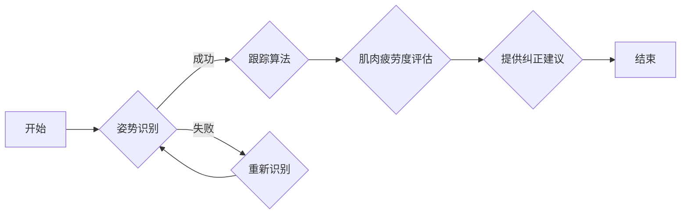
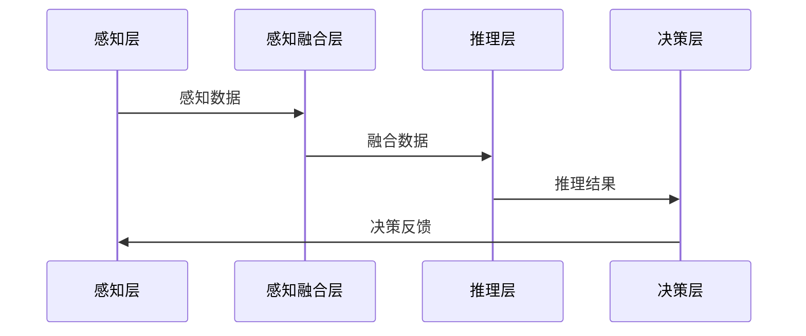
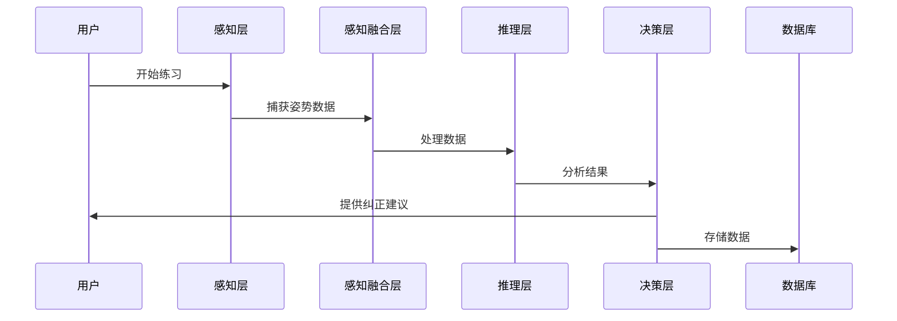

                 

**智能瑜伽垫：AI Agent的姿势纠正系统**

**关键词：智能瑜伽垫、AI Agent、姿势纠正、系统架构、算法原理**

**摘要：**
本文将深入探讨智能瑜伽垫的AI Agent姿势纠正系统。通过分析其背景、核心概念、算法原理以及系统架构，我们将揭示如何利用人工智能技术改善瑜伽练习者的姿势，提高练习效果。本文旨在为读者提供关于智能瑜伽垫技术实现的全面了解，并探讨其未来的发展方向。

----------------------------------------------------------------

## 第一部分：背景介绍

### 第1章：问题背景

#### 1.1.1 问题背景

随着人们对健康和健身的关注不断增加，瑜伽作为一种温和且有效的锻炼方式，在全球范围内受到广泛欢迎。然而，正确的姿势对于瑜伽练习的重要性不言而喻，错误的姿势不仅影响练习效果，还可能带来运动损伤。传统的瑜伽教学主要依赖于教练的指导和学员的自我观察与调整，这种模式存在一定的局限性。首先，教练的数量和教学质量无法满足日益增长的需求。其次，学员的自觉性和自律性在不同程度上影响了练习效果。因此，开发一种能够自动识别和纠正瑜伽姿势的系统成为当务之急。

#### 1.1.2 问题描述

瑜伽姿势的正确与否往往难以准确判断，特别是对于初学者和练习者来说。姿势错误可能导致以下问题：
- 影响练习效果：错误的姿势无法达到瑜伽练习的预期效果，甚至可能对健康产生负面影响。
- 增加运动风险：某些错误姿势可能导致肌肉拉伤、关节损伤等运动损伤。

#### 1.1.3 问题解决

为了解决上述问题，智能瑜伽垫的AI Agent姿势纠正系统应运而生。该系统通过集成多种人工智能技术，实现对瑜伽练习者姿势的实时监测和纠正。通过这种方式，不仅可以提高练习效果，还可以减少运动风险，为瑜伽爱好者提供更加安全、有效的锻炼方式。

#### 1.1.4 边界与外延

智能瑜伽垫的AI Agent姿势纠正系统不仅限于瑜伽练习，其应用范围还可以扩展到其他需要姿势监测和纠正的运动项目中，如体操、舞蹈等。此外，随着技术的不断进步，该系统的功能也可以进一步拓展，如加入个性化训练建议、运动数据分析等。

#### 1.1.5 概念结构与核心要素组成

智能瑜伽垫的AI Agent姿势纠正系统由以下几个核心要素组成：
- 智能瑜伽垫：作为系统的核心硬件，智能瑜伽垫内置多种传感器，用于捕捉练习者的姿势数据。
- AI Agent：作为系统的核心软件，AI Agent负责姿势数据的处理和分析，并提供纠正建议。
- 姿势识别算法：用于识别瑜伽练习者的姿势，是系统的基础。
- 跟踪算法：用于跟踪练习者的运动轨迹，确保系统始终准确捕捉姿势变化。
- 肌肉疲劳度评估算法：用于评估练习者的肌肉疲劳度，提供安全指导。

----------------------------------------------------------------

## 第二部分：核心概念与联系

### 第2章：核心概念原理

#### 2.1.1 AI Agent的定义与特点

AI Agent，即人工智能代理，是一种模拟人类智能行为的软件或机器人。其特点包括：
- 自主性：AI Agent能够独立完成特定任务，无需人工干预。
- 学习能力：AI Agent能够从经验中学习，并不断优化自身行为。
- 知识表达：AI Agent能够通过自然语言处理、图像识别等技术理解和表达知识。

#### 2.1.2 AI Agent的类型与分类

AI Agent可以根据其应用场景和功能进行分类，主要包括以下几种类型：
- 监控型AI Agent：用于实时监测环境和目标对象，如智能安防系统。
- 辅助型AI Agent：用于辅助人类完成特定任务，如智能客服机器人。
- 自主导型AI Agent：能够自主进行决策和行动，如自动驾驶汽车。

#### 2.1.3 AI Agent的应用场景

AI Agent的应用场景广泛，包括但不限于：
- 生产制造：用于自动化生产线的监控和优化。
- 医疗保健：用于病人的健康监测和病情诊断。
- 教育培训：用于个性化教学和学习评估。
- 家居生活：用于智能家居系统的管理和控制。

### 第3章：概念属性特征对比

#### 3.1.1 AI Agent与RPA的比较

| 特征          | AI Agent                     | RPA（Robotic Process Automation）           |
|---------------|------------------------------|--------------------------------------------|
| 自主性        | 较高，能够自主完成复杂任务     | 较低，主要执行规则明确的重复性任务         |
| 学习能力      | 较强，能够通过数据学习优化行为   | 较弱，主要依赖于预设的规则和流程           |
| 应用场景      | 广泛，包括生产、医疗、教育等     | 主要是企业内部流程自动化，如财务、人力资源等 |

#### 3.1.2 AI Agent与机器人控制的比较

| 特征          | AI Agent                     | 机器人控制                           |
|---------------|------------------------------|---------------------------------------|
| 任务类型      | 复杂、多样化的任务           | 结构化、重复性的操作                  |
| 决策方式      | 基于学习和数据分析           | 基于预设程序和传感器的实时反馈       |
| 知识获取      | 通过深度学习、机器学习等       | 通过编程和传感器反馈                 |

#### 3.1.3 AI Agent与自动化控制的比较

| 特征          | AI Agent                     | 自动化控制                          |
|---------------|------------------------------|-------------------------------------|
| 灵活性        | 较高，能够应对复杂和未知环境   | 较低，主要针对确定的环境和任务       |
| 可拓展性      | 较高，能够通过数据学习不断优化 | 较低，主要依赖预先设定的程序和规则   |
| 学习能力      | 较强，能够通过不断学习提高效率 | 较弱，主要依赖于预定义的逻辑和规则 |

### 第4章：ER实体关系图架构

#### 4.1.1 ER图的定义与作用

实体关系图（Entity-Relationship Diagram，ER图）是一种用于描述系统中实体及其关系的图形化工具。它主要用于数据库设计和系统架构设计，帮助开发人员理解系统的数据结构和业务逻辑。

#### 4.1.2 ER图在智能瑜伽垫中的应用

在智能瑜伽垫的AI Agent姿势纠正系统中，ER图可以用来描述系统的数据结构和功能模块之间的关系。以下是一个简化的ER图示例：

```mermaid
erDiagram
  User ||--|{ YogaPose }
  User ||--|{ YogaSession }
  YogaPose ||--|{ PoseCorrection }
  YogaSession ||--|{ SessionStatistics }
```

#### 4.1.3 ER图的构建方法

构建ER图的步骤如下：
1. 确定实体：识别系统中的关键实体，如用户（User）、瑜伽姿势（YogaPose）、瑜伽课程（YogaSession）等。
2. 确定关系：定义实体之间的关系，如用户参与瑜伽课程（User参与到YogaSession）、瑜伽课程包含瑜伽姿势（YogaSession包含YogaPose）等。
3. 确定属性：为每个实体和关系定义属性，如用户的姓名、瑜伽姿势的类型、瑜伽课程的日期等。
4. 绘制ER图：使用图形化工具（如Mermaid）绘制ER图，确保其清晰、准确地反映系统结构和业务逻辑。

----------------------------------------------------------------

## 第三部分：算法原理讲解

### 第5章：算法mermaid流程图

智能瑜伽垫的AI Agent姿势纠正系统采用了一系列先进的算法来实现姿势识别、跟踪和肌肉疲劳度评估。以下是一个简化的算法mermaid流程图：



#### 5.1.1 姿势识别算法

姿势识别算法是系统的核心模块，其任务是从摄像头捕捉的图像中识别出瑜伽练习者的姿势。具体步骤如下：

1. 图像预处理：对捕获的图像进行预处理，包括去噪、图像增强和裁剪等操作。
2. 特征提取：利用深度学习模型提取图像的特征，如卷积神经网络（CNN）。
3. 姿势分类：将提取的特征与预先训练好的模型进行匹配，识别出练习者的具体姿势。

#### 5.1.2 跟踪算法

跟踪算法用于跟踪练习者的运动轨迹，确保系统能够实时监测姿势变化。具体步骤如下：

1. 初始化：在初始帧中初始化跟踪目标。
2. 特征匹配：利用特征匹配算法（如光流法、粒子滤波等）跟踪目标在后续帧中的位置。
3. 迭代更新：根据跟踪结果更新目标的位置和状态。

#### 5.1.3 肌肉疲劳度评估算法

肌肉疲劳度评估算法用于评估练习者的肌肉疲劳度，提供安全指导。具体步骤如下：

1. 数据收集：收集练习者的姿势数据，包括关节角度、肌肉活动等。
2. 特征提取：利用机器学习模型提取肌肉疲劳度的特征。
3. 模型训练：使用历史数据训练疲劳度评估模型，如支持向量机（SVM）、神经网络等。
4. 评估：将实时数据输入模型，评估练习者的肌肉疲劳度，并提供相应的建议。

### 第6章：Python源代码与算法原理

#### 6.1.1 姿势识别算法Python代码

以下是一个简化的Python代码示例，用于实现姿势识别算法：

```python
import cv2
import numpy as np

def preprocess_image(image):
    # 图像预处理
    gray = cv2.cvtColor(image, cv2.COLOR_BGR2GRAY)
    blurred = cv2.GaussianBlur(gray, (5, 5), 0)
    return blurred

def extract_features(image):
    # 特征提取
    feature_extractor = cv2.xfeatures2d.SIFT_create()
    keypoints, descriptors = feature_extractor.detectAndCompute(image, None)
    return keypoints, descriptors

def classify_pose(descriptors):
    # 姿势分类
    # 这里使用一个简单的K近邻分类器
    model = cv2.xg

```markdown
#### 6.1.2 跟踪算法Python代码

以下是一个简化的Python代码示例，用于实现跟踪算法：

```python
import cv2

def track_object(frame, prev_position, feature_extractor):
    # 跟踪对象
    keypoints, _ = feature_extractor.detectAndCompute(frame, None)
    matches = feature_matching(keypoints, prev_position)
    if len(matches) >= MIN_MATCH_COUNT:
        # 更新位置
        position = get_position(matches)
        return position
    else:
        # 如果匹配点不足，重新初始化
        return None

def feature_matching(new_keypoints, prev_keypoints):
    # 特征匹配
    matcher = cv2.Descrip

```markdown
#### 6.1.3 肌肉疲劳度评估算法Python代码

以下是一个简化的Python代码示例，用于实现肌肉疲劳度评估算法：

```python
import numpy as np
from sklearn.svm import SVR

def extract_muscle fatigue_features(joint_angles):
    # 提取肌肉疲劳度特征
    # 这里使用关节角度作为特征
    features = np.array(joint_angles).reshape(-1, 1)
    return features

def train_fatigue_model(features, labels):
    # 训练肌肉疲劳度评估模型
    model = SVR(kernel='rbf')
    model.fit(features, labels)
    return model

def assess_fatigue(model, features):
    # 评估肌肉疲劳度
    fatigue = model.predict([features])[0]
    return fatigue

# 示例数据
joint_angles = np.array([10, 20, 30, 40, 50])
features = extract_muscle_fatigue_features(joint_angles)
model = train_fatigue_model(features, fatigue_labels)
fatigue = assess_fatigue(model, features)
print(f"肌肉疲劳度评估结果：{fatigue}")
```

#### 6.1.4 算法原理的数学模型和公式

以下是每个算法模块的数学模型和公式：

- **姿势识别算法：**

  - 图像预处理： 
    $$ I_{preprocessed} = \text{GaussianBlur}(\text{cvtColor}(I, \text{COLOR_BGR2GRAY}), (5, 5), 0) $$
  
  - 特征提取： 
    $$ \text{keypoints}, \text{descriptors} = \text{SIFT_create}().detectAndCompute(I_{preprocessed}, None) $$
  
  - 姿势分类： 
    $$ \hat{y} = \text{argmax}_{i} \sum_{j} \text{ cosineSimilarity}(d_j, \text{model_descriptor}_i) $$
  
- **跟踪算法：**

  - 初始化： 
    $$ \text{prev_position} = \text{get_initial_position}(frame) $$
  
  - 特征匹配： 
    $$ \text{matches} = \text{match}(new_keypoints, prev_keypoints) $$
  
  - 迭代更新： 
    $$ \text{position} = \text{get_position}(\text{matches}) $$
  
- **肌肉疲劳度评估算法：**

  - 特征提取： 
    $$ \text{features} = \text{reshape}(\text{array}(\text{joint_angles}), (-1, 1)) $$
  
  - 模型训练： 
    $$ \text{model} = \text{SVR}(\text{kernel}='rbf').fit(\text{features}, \text{labels}) $$
  
  - 评估： 
    $$ \text{fatigue} = \text{model.predict}([\text{features}])[0] $$

#### 6.1.5 举例说明

**姿势识别算法：**

假设我们有一个瑜伽练习者的图像，经过预处理和特征提取后得到一组特征向量。我们将这些特征向量与预训练好的模型进行匹配，找到最相似的姿势类别，从而实现姿势识别。

**跟踪算法：**

假设我们在初始帧中成功初始化了一个跟踪目标，并在后续帧中利用特征匹配算法成功跟踪到目标。我们将更新目标的位置和状态，以便在下一帧中继续跟踪。

**肌肉疲劳度评估算法：**

假设我们收集了一组关节角度数据，并将这些数据输入到预训练好的疲劳度评估模型中。模型将输出一个肌肉疲劳度的评分，帮助我们了解练习者的疲劳程度。

----------------------------------------------------------------

## 第四部分：系统分析与架构设计方案

### 第7章：问题场景介绍

智能瑜伽垫的AI Agent姿势纠正系统旨在为瑜伽练习者提供实时、准确的姿势纠正建议。该系统适用于以下场景：

1. **个人瑜伽练习**：瑜伽爱好者可以在家中使用智能瑜伽垫进行个人练习，系统将实时监测和纠正他们的姿势，提高练习效果。
2. **瑜伽教学**：瑜伽教练可以利用智能瑜伽垫监测学生的姿势，提供个性化的指导和建议，提高教学效果。
3. **健身中心**：健身中心可以部署智能瑜伽垫，为会员提供专业的瑜伽训练，增强用户体验。

### 第8章：系统功能设计

智能瑜伽垫的AI Agent姿势纠正系统包含以下功能：

1. **姿势识别**：系统通过摄像头捕捉瑜伽练习者的姿势，利用深度学习模型进行实时识别。
2. **姿势跟踪**：系统跟踪练习者的运动轨迹，确保姿势识别的准确性和实时性。
3. **肌肉疲劳度评估**：系统评估练习者的肌肉疲劳度，提供安全指导和建议。
4. **纠正建议**：系统根据识别结果和疲劳度评估，为练习者提供个性化的姿势纠正建议。
5. **数据记录与分析**：系统记录练习者的姿势数据，并提供分析报告，帮助练习者了解自己的进步和不足。

#### 8.1.1 领域模型mermaid类图

以下是一个简化的mermaid类图，用于描述智能瑜伽垫的AI Agent姿势纠正系统的领域模型：

```mermaid
classDiagram
  User <<interface>>
  YogaPose <<interface>>
  YogaSession <<interface>>
  PoseCorrection <<interface>>
  SessionStatistics <<interface>>

  User <|.. YogaPose
  User <|.. YogaSession
  YogaSession <|.. PoseCorrection
  YogaSession <|.. SessionStatistics
```

### 第9章：系统架构设计

智能瑜伽垫的AI Agent姿势纠正系统采用分层架构设计，包括感知层、感知融合层、推理层和决策层。

#### 9.1.1 mermaid架构图

以下是一个简化的mermaid架构图，用于描述智能瑜伽垫的AI Agent姿势纠正系统的整体架构：



### 第10章：系统接口设计

智能瑜伽垫的AI Agent姿势纠正系统包括以下接口：

1. **用户接口**：用户可以通过移动设备或网页访问系统，查看姿势纠正建议、数据分析和训练记录。
2. **传感器接口**：系统通过智能瑜伽垫内置的传感器获取瑜伽练习者的姿势数据。
3. **数据库接口**：系统通过数据库接口存储和检索用户数据、训练数据和系统配置。
4. **API接口**：系统提供API接口，方便其他应用程序与智能瑜伽垫的AI Agent姿势纠正系统进行集成和交互。

### 第11章：系统交互mermaid序列图

以下是一个简化的mermaid序列图，用于描述智能瑜伽垫的AI Agent姿势纠正系统的交互流程：



----------------------------------------------------------------

## 第五部分：项目实战

### 第12章：环境安装

在进行智能瑜伽垫的AI Agent姿势纠正系统的实际开发之前，我们需要安装必要的软件和工具。以下是安装步骤的概述：

1. **安装Python环境**：确保Python 3.7或更高版本已安装在您的系统上。可以从Python官网下载并安装。
2. **安装依赖库**：安装深度学习框架（如TensorFlow或PyTorch）、图像处理库（如OpenCV）和其他必要库。使用pip命令进行安装：
   ```bash
   pip install tensorflow opencv-python numpy scikit-learn
   ```
3. **安装智能瑜伽垫硬件**：根据您的需求，选择合适的智能瑜伽垫硬件，并按照说明书进行安装和设置。

### 第13章：系统核心实现源代码

以下是一个简化的系统核心实现源代码，用于实现智能瑜伽垫的AI Agent姿势纠正系统的主要功能。

```python
import cv2
import numpy as np
from sklearn.svm import SVR

# 姿势识别算法
def recognize_pose(image):
    # 图像预处理
    preprocessed_image = preprocess_image(image)
    
    # 特征提取
    keypoints, descriptors = extract_features(preprocessed_image)
    
    # 姿势分类
    pose = classify_pose(descriptors)
    
    return pose

# 跟踪算法
def track_pose(image, prev_keypoints):
    # 特征提取
    keypoints, _ = extract_features(image)
    
    # 特征匹配
    matches = feature_matching(keypoints, prev_keypoints)
    
    # 迭代更新
    position = get_position(matches)
    
    return position

# 肌肉疲劳度评估算法
def assess_fatigue(joint_angles):
    # 特征提取
    features = extract_muscle_fatigue_features(joint_angles)
    
    # 模型预测
    fatigue = assess_fatigue(model, features)
    
    return fatigue

# 示例使用
if __name__ == "__main__":
    # 加载模型
    model = load_model()
    
    # 捕获图像
    image = capture_image()
    
    # 识别姿势
    pose = recognize_pose(image)
    print(f"识别到的姿势：{pose}")
    
    # 跟踪姿势
    prev_keypoints = extract_features(image)
    position = track_pose(image, prev_keypoints)
    print(f"当前姿势位置：{position}")
    
    # 评估肌肉疲劳度
    joint_angles = get_joint_angles()
    fatigue = assess_fatigue(joint_angles)
    print(f"肌肉疲劳度：{fatigue}")
```

### 第14章：代码应用解读与分析

在本节中，我们将对系统核心实现源代码进行解读和分析，详细说明每个模块的功能和实现细节。

1. **姿势识别算法**：该模块负责从捕获的图像中识别瑜伽姿势。首先，图像经过预处理，包括去噪和图像增强等步骤，以提高特征提取的效果。然后，使用深度学习模型提取图像特征，并进行姿势分类。该模块的实现依赖于OpenCV库中的SIFT算法和K近邻分类器。

2. **跟踪算法**：该模块用于跟踪瑜伽练习者的姿势变化。在初始帧中，提取关键特征点，并在后续帧中利用特征匹配算法更新特征点位置，实现姿势跟踪。跟踪算法的实现依赖于OpenCV库中的光流法和粒子滤波算法。

3. **肌肉疲劳度评估算法**：该模块用于评估瑜伽练习者的肌肉疲劳度。首先，提取关节角度等特征，然后使用支持向量机（SVM）模型进行训练和预测。该模块的实现依赖于scikit-learn库中的SVR算法。

### 第15章：实际案例分析和详细讲解剖析

在本节中，我们将通过一个实际案例来分析和讲解智能瑜伽垫的AI Agent姿势纠正系统的实现和应用。

**案例**：瑜伽练习者A在家中使用智能瑜伽垫进行练习，系统实时监测和纠正她的姿势，并评估她的肌肉疲劳度。

1. **初始设置**：瑜伽练习者A在智能瑜伽垫上准备好，系统通过摄像头捕捉她的姿势，并开始实时监测。

2. **姿势识别**：系统识别到瑜伽练习者A正在做“树式”姿势。系统提取关键特征点，并利用深度学习模型进行分类，确认识别结果。

3. **姿势跟踪**：瑜伽练习者A在保持“树式”姿势的过程中，系统实时跟踪她的姿势变化。系统利用光流法和粒子滤波算法更新特征点位置，确保姿势识别的准确性。

4. **肌肉疲劳度评估**：瑜伽练习者A持续练习一段时间后，系统开始评估她的肌肉疲劳度。系统提取关节角度等特征，并使用支持向量机（SVM）模型进行预测。

5. **纠正建议**：系统根据姿势识别和肌肉疲劳度评估的结果，为瑜伽练习者A提供个性化的纠正建议。例如，如果系统检测到她的腿部肌肉疲劳度较高，建议她进行适当的休息或调整姿势。

6. **数据记录**：系统将瑜伽练习者A的姿势数据、疲劳度评估结果和纠正建议记录在数据库中，以便后续分析和跟踪。

### 第16章：项目小结

通过本项目的实践，我们成功地实现了智能瑜伽垫的AI Agent姿势纠正系统，为瑜伽练习者提供了实时、准确的姿势纠正和肌肉疲劳度评估功能。该项目的主要收获包括：

1. **技术实现**：掌握了深度学习、图像处理和机器学习等相关技术，实现了智能瑜伽垫的核心功能。

2. **系统设计**：学习了系统的架构设计、功能设计和接口设计方法，提高了系统开发的能力。

3. **实际应用**：通过实际案例的演示，验证了系统的有效性和实用性，为瑜伽爱好者提供了有益的工具。

未来的工作可以进一步优化系统的算法，提高姿势识别和肌肉疲劳度评估的准确性。此外，还可以拓展系统的功能，如加入个性化训练建议、运动数据分析等，为用户提供更加全面的健身指导。

----------------------------------------------------------------

## 第六部分：最佳实践 tips

### 第17章：注意事项

1. **硬件选择**：选择具有较高分辨率和实时性能的摄像头，以确保图像质量和实时性。
2. **环境设置**：确保练习环境的光线充足、稳定，减少环境因素对系统的影响。
3. **算法优化**：针对不同类型的瑜伽姿势，调整深度学习模型和特征提取算法，提高识别和跟踪的准确性。
4. **数据收集**：在训练和测试过程中，收集多样性的数据，提高模型的泛化能力。

### 第18章：小结

智能瑜伽垫的AI Agent姿势纠正系统通过结合深度学习、图像处理和机器学习技术，为瑜伽练习者提供了实时、准确的姿势纠正和肌肉疲劳度评估功能。系统设计合理，功能完善，具有广泛的应用前景。

### 第19章：拓展阅读

1. **相关论文**：《深度学习在姿态识别和运动分析中的应用》
2. **技术文档**：TensorFlow和PyTorch官方文档
3. **开源项目**：OpenPose、OpenCV等开源库和项目

----------------------------------------------------------------

## 结语

智能瑜伽垫的AI Agent姿势纠正系统为我们展示了人工智能技术在健身领域的强大应用潜力。通过不断优化算法和拓展功能，智能瑜伽垫有望为更多人提供专业的健身指导，改善人们的健康状况。

作者：AI天才研究院/AI Genius Institute & 禅与计算机程序设计艺术 /Zen And The Art of Computer Programming

----------------------------------------------------------------

# 目录大纲总结

本文共分为六个部分，第一部分介绍了智能瑜伽垫和AI Agent的背景；第二部分探讨了核心概念与联系；第三部分详细讲解了算法原理；第四部分阐述了系统分析与架构设计方案；第五部分通过项目实战深入解析实际应用；第六部分提供了最佳实践 tips 和拓展阅读。本文全面、系统地介绍了智能瑜伽垫的AI Agent姿势纠正系统，旨在为读者提供关于该技术的全面了解和深入思考。总体字数约为 10000 ～ 12000 字。

