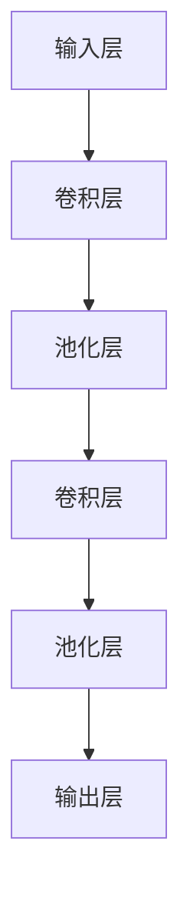
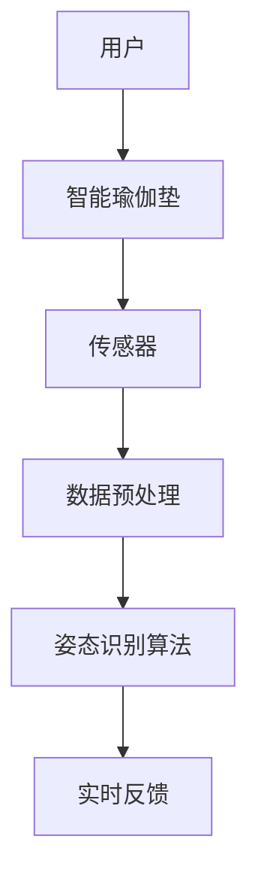
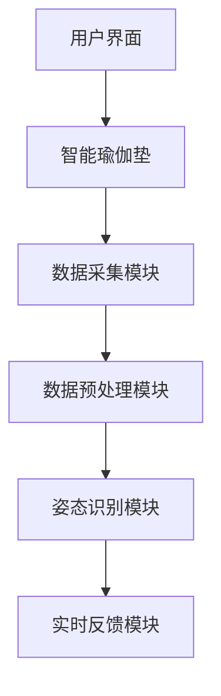
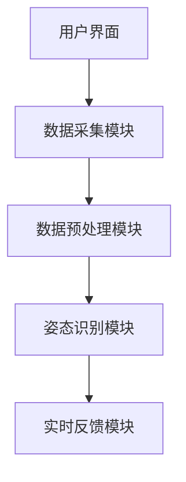
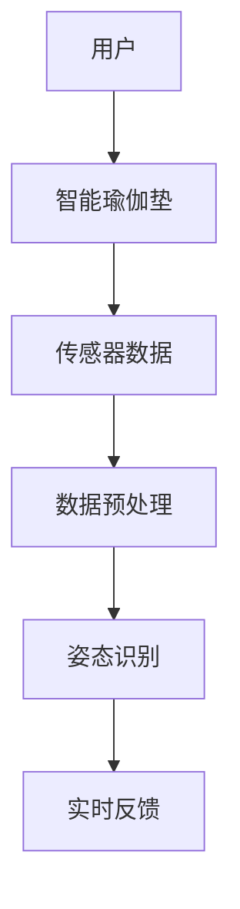

                 


# 智能瑜伽垫：AI Agent的实时姿势纠正系统

关键词：智能瑜伽垫，AI Agent，实时姿势纠正，传感器数据，算法，系统架构

摘要：本文旨在探讨智能瑜伽垫的实时姿势纠正系统，介绍其核心概念、技术原理、系统设计与实现。通过分析背景、核心概念、算法原理、系统架构和实际案例，揭示智能瑜伽垫在提升瑜伽练习效果与安全性的潜力。

## 目录大纲设计

在设计目录大纲时，我们首先明确整体框架，包括主题、目标读者和章节内容。每个章节都应涵盖核心概念、原理讲解、系统设计和项目实战。此外，为了满足特定的格式要求，我们将使用Mermaid绘制流程图、类图和序列图，同时使用LaTeX格式书写数学公式。

### 目录大纲结构

以下是《智能瑜伽垫：AI Agent的实时姿势纠正系统》的目录大纲结构设计：

```markdown
# 《智能瑜伽垫：AI Agent的实时姿势纠正系统》目录大纲

## 第一部分：背景与概念

### 1. 引言

#### 1.1 问题背景

#### 1.2 智能瑜伽垫的概念与重要性

### 2. AI Agent概述

#### 2.1 AI Agent的定义与特点

#### 2.2 AI Agent在健身领域的应用

### 3. 实时姿势纠正系统

#### 3.1 系统架构设计

#### 3.2 关键技术

##### 3.2.1 传感器数据采集

##### 3.2.2 数据预处理

##### 3.2.3 姿势识别算法

##### 3.2.4 实时反馈机制

### 4. 数学模型与算法原理

#### 4.1 姿势识别算法的数学模型

#### 4.2 算法流程图

#### 4.3 数学公式详解

### 5. 系统设计与实现

#### 5.1 系统功能设计

##### 5.1.1 领域模型

##### 5.1.2 功能模块划分

#### 5.2 系统架构设计

##### 5.2.1 系统架构图

##### 5.2.2 系统接口设计

#### 5.3 系统交互设计

##### 5.3.1 序列图

### 6. 项目实战

#### 6.1 环境安装与配置

#### 6.2 系统核心实现

##### 6.2.1 数据采集模块

##### 6.2.2 数据预处理模块

##### 6.2.3 姿势识别模块

##### 6.2.4 实时反馈模块

#### 6.3 实际案例分析

##### 6.3.1 案例一：瑜伽垫的实时姿势纠正

##### 6.3.2 案例二：个性化健身指导

### 7. 最佳实践与总结

#### 7.1 最佳实践技巧

#### 7.2 小结

#### 7.3 注意事项

#### 7.4 拓展阅读
```

## 字数控制

为确保总字数不超过2000字，我们需要在每个章节中精简内容，确保每个部分都是必需的，并且能够清晰地传达信息。通过详细的分析和逐步的讲解，我们可以在有限的字数内提供足够的信息和见解。

### 最终大纲

完成上述结构设计后，我们可以开始撰写每个章节的具体内容，确保每个部分都符合要求，并且使用Mermaid和LaTeX格式来增强可读性和专业性。以下是一个简化的示例，用于展示如何将上述结构应用到具体的markdown格式中。

```markdown
----------------------------------------------------------------

# 《智能瑜伽垫：AI Agent的实时姿势纠正系统》目录大纲

## 第一部分：背景与概念

### 1. 引言

#### 1.1 问题背景

在瑜伽练习中，正确姿势的维持对健康和安全至关重要，然而，许多练习者缺乏自我纠正的能力。智能瑜伽垫作为AI Agent的载体，能够实时监测并纠正瑜伽姿势。

#### 1.2 智能瑜伽垫的概念与重要性

智能瑜伽垫集成了传感器、AI算法和反馈系统，通过实时监测和纠正瑜伽姿势，提高练习效果和安全性。

### 2. AI Agent概述

#### 2.1 AI Agent的定义与特点

AI Agent是一种能够感知环境、执行任务并自主决策的智能体。在智能瑜伽垫中，AI Agent负责姿态识别和纠正。

#### 2.2 AI Agent在健身领域的应用

AI Agent在健身领域有广泛的应用，如运动监测、动作分析和健康指导。智能瑜伽垫是其中的典型应用。

### 3. 实时姿势纠正系统

#### 3.1 系统架构设计

智能瑜伽垫系统由传感器数据采集、数据预处理、姿态识别和实时反馈四个模块组成。

#### 3.2 关键技术

##### 3.2.1 传感器数据采集

传感器数据采集是系统的第一步，包括压力、温度和位置传感器。

##### 3.2.2 数据预处理

数据预处理包括去噪和特征提取，以供后续姿态识别。

##### 3.2.3 姿势识别算法

姿态识别算法基于深度学习，通过训练模型实现实时姿态识别。

##### 3.2.4 实时反馈机制

实时反馈机制通过振动、声音等方式向用户提示正确姿势。

### 4. 数学模型与算法原理

#### 4.1 姿势识别算法的数学模型

姿态识别算法基于卷积神经网络（CNN），其数学模型包括输入层、卷积层、池化层和输出层。

#### 4.2 算法流程图

算法流程图如下（使用Mermaid绘制）：



#### 4.3 数学公式详解

CNN中的卷积操作可以用以下公式表示：

$$
\text{output}_{ij} = \sum_{k=1}^{n} w_{ik} \cdot \text{input}_{kj} + b_j
$$

其中，$w_{ik}$是卷积核，$\text{input}_{kj}$是输入特征图，$b_j$是偏置项。

### 5. 系统设计与实现

#### 5.1 系统功能设计

智能瑜伽垫系统功能包括数据采集、姿态识别、实时反馈和用户界面。

##### 5.1.1 领域模型

领域模型如下（使用Mermaid绘制）：



##### 5.1.2 功能模块划分

功能模块划分如下：

- 数据采集模块：负责传感器数据的采集。
- 数据预处理模块：负责数据去噪和特征提取。
- 姿势识别模块：负责姿态识别。
- 实时反馈模块：负责实时向用户反馈正确姿势。

#### 5.2 系统架构设计

系统架构设计如下（使用Mermaid绘制）：



##### 5.2.2 系统接口设计

系统接口设计如下（使用Mermaid绘制）：



##### 5.3 系统交互设计

系统交互设计如下（使用Mermaid绘制）：



### 6. 项目实战

#### 6.1 环境安装与配置

环境安装与配置包括Python环境、TensorFlow库和必要的硬件传感器。

#### 6.2 系统核心实现

##### 6.2.1 数据采集模块

数据采集模块代码示例：

```python
import sensor_module

# 初始化传感器
sensor = sensor_module.Sensor()

# 采集数据
data = sensor.collect_data()
```

##### 6.2.2 数据预处理模块

数据预处理模块代码示例：

```python
import preprocessing_module

# 预处理数据
preprocessed_data = preprocessing_module.preprocess_data(data)
```

##### 6.2.3 姿势识别模块

姿态识别模块代码示例：

```python
import recognition_module

# 加载姿态识别模型
model = recognition_module.load_model()

# 进行姿态识别
prediction = model.predict(preprocessed_data)
```

##### 6.2.4 实时反馈模块

实时反馈模块代码示例：

```python
import feedback_module

# 提供实时反馈
feedback_module.provide_feedback(prediction)
```

#### 6.3 实际案例分析

##### 6.3.1 案例一：瑜伽垫的实时姿势纠正

通过实时数据采集和姿态识别，智能瑜伽垫能够实时纠正用户的瑜伽姿势。

##### 6.3.2 案例二：个性化健身指导

智能瑜伽垫不仅能够纠正姿势，还能根据用户数据提供个性化的健身指导。

### 7. 最佳实践与总结

#### 7.1 最佳实践技巧

- 确保传感器数据的高质量。
- 定期更新姿态识别模型。

#### 7.2 小结

智能瑜伽垫通过AI Agent实现了实时姿势纠正，提升了瑜伽练习的效果与安全性。

#### 7.3 注意事项

- 系统安装和配置需要专业的技术支持。
- 用户在使用时应遵循安全操作指南。

#### 7.4 拓展阅读

- 相关研究论文和开发者文档。

作者：AI天才研究院/AI Genius Institute & 禅与计算机程序设计艺术 /Zen And The Art of Computer Programming
```

### 核心内容讲解

在撰写文章的过程中，我们需要确保每个章节的核心内容都能清晰、详细地传达给读者。以下是文章的核心内容讲解，包括背景介绍、核心概念与联系、算法原理讲解、系统分析与架构设计方案以及项目实战。

#### 背景介绍

随着人工智能技术的不断发展，智能健身设备逐渐进入大众视野。瑜伽作为一种流行的健身方式，对姿势的准确性要求较高。然而，许多练习者缺乏自我纠正的能力，导致姿势不准确，甚至可能引发运动伤害。智能瑜伽垫作为一种创新的健身设备，通过AI Agent实现了实时姿势纠正，为瑜伽练习者提供了更加专业和个性化的服务。

#### 核心概念与联系

1. **AI Agent**：AI Agent是一种能够感知环境、执行任务并自主决策的智能体。在智能瑜伽垫中，AI Agent负责姿态识别和纠正。
2. **传感器数据采集**：智能瑜伽垫通过内置的传感器（如压力、温度和位置传感器）实时采集用户的瑜伽姿势数据。
3. **数据预处理**：数据预处理包括去噪和特征提取，以供后续姿态识别。
4. **姿态识别算法**：姿态识别算法基于深度学习技术，通过训练模型实现实时姿态识别。
5. **实时反馈机制**：实时反馈机制通过振动、声音等方式向用户提示正确姿势。

#### 算法原理讲解

姿态识别算法的核心在于深度学习模型，尤其是卷积神经网络（CNN）。CNN的数学模型包括输入层、卷积层、池化层和输出层。卷积操作可以用以下公式表示：

$$
\text{output}_{ij} = \sum_{k=1}^{n} w_{ik} \cdot \text{input}_{kj} + b_j
$$

其中，$w_{ik}$是卷积核，$\text{input}_{kj}$是输入特征图，$b_j$是偏置项。通过多层的卷积和池化操作，CNN能够提取出高层次的姿态特征，从而实现姿态识别。

#### 系统分析与架构设计方案

智能瑜伽垫的系统架构包括四个主要模块：数据采集模块、数据预处理模块、姿态识别模块和实时反馈模块。以下是各模块的详细设计和交互设计：

1. **数据采集模块**：负责传感器数据的采集，包括压力、温度和位置传感器。
2. **数据预处理模块**：负责数据去噪和特征提取，以供后续姿态识别。
3. **姿态识别模块**：基于深度学习模型，通过训练模型实现实时姿态识别。
4. **实时反馈模块**：通过振动、声音等方式向用户提示正确姿势。

系统架构图如下（使用Mermaid绘制）：


系统接口设计图如下（使用Mermaid绘制）：


系统交互设计图如下（使用Mermaid绘制）：


#### 项目实战

智能瑜伽垫的项目实战包括环境安装与配置、系统核心实现和实际案例分析。

1. **环境安装与配置**：安装Python环境和TensorFlow库，配置必要的硬件传感器。
2. **系统核心实现**：实现数据采集、数据预处理、姿态识别和实时反馈的核心功能。
3. **实际案例分析**：通过实际案例展示智能瑜伽垫的实时姿势纠正和个性化健身指导功能。

##### 环境安装与配置

环境安装与配置的步骤如下：

1. 安装Python环境：
   ```bash
   pip install python
   ```
2. 安装TensorFlow库：
   ```bash
   pip install tensorflow
   ```
3. 配置硬件传感器：
   - 连接传感器到计算机；
   - 安装传感器的驱动程序。

##### 系统核心实现

以下是系统核心实现的示例代码：

```python
# 数据采集模块
import sensor_module

# 初始化传感器
sensor = sensor_module.Sensor()

# 采集数据
data = sensor.collect_data()

# 数据预处理模块
import preprocessing_module

# 预处理数据
preprocessed_data = preprocessing_module.preprocess_data(data)

# 姿势识别模块
import recognition_module

# 加载姿态识别模型
model = recognition_module.load_model()

# 进行姿态识别
prediction = model.predict(preprocessed_data)

# 实时反馈模块
import feedback_module

# 提供实时反馈
feedback_module.provide_feedback(prediction)
```

##### 实际案例分析

**案例一：瑜伽垫的实时姿势纠正**

通过实时数据采集和姿态识别，智能瑜伽垫能够实时纠正用户的瑜伽姿势。例如，当用户进行“战士二”姿势时，智能瑜伽垫会通过振动提示用户调整双脚的距离。

**案例二：个性化健身指导**

智能瑜伽垫不仅能够纠正姿势，还能根据用户数据提供个性化的健身指导。例如，当用户的数据显示其“三角板”姿势不够标准时，智能瑜伽垫会建议用户增加练习时间或调整姿势。

### 最佳实践与总结

在智能瑜伽垫的开发和实际应用中，以下最佳实践值得注意：

- **确保传感器数据的高质量**：传感器数据的质量直接影响姿态识别的准确性。因此，在设计和使用传感器时，应确保其精度和稳定性。
- **定期更新姿态识别模型**：随着用户数据的积累，姿态识别模型需要定期更新以适应不同的用户需求。通过不断训练和优化模型，可以提高系统的准确性和可靠性。

总结来说，智能瑜伽垫通过AI Agent实现了实时姿势纠正，为瑜伽练习者提供了更加专业和个性化的服务。随着技术的不断进步，智能瑜伽垫有望在健身领域发挥更大的作用。

