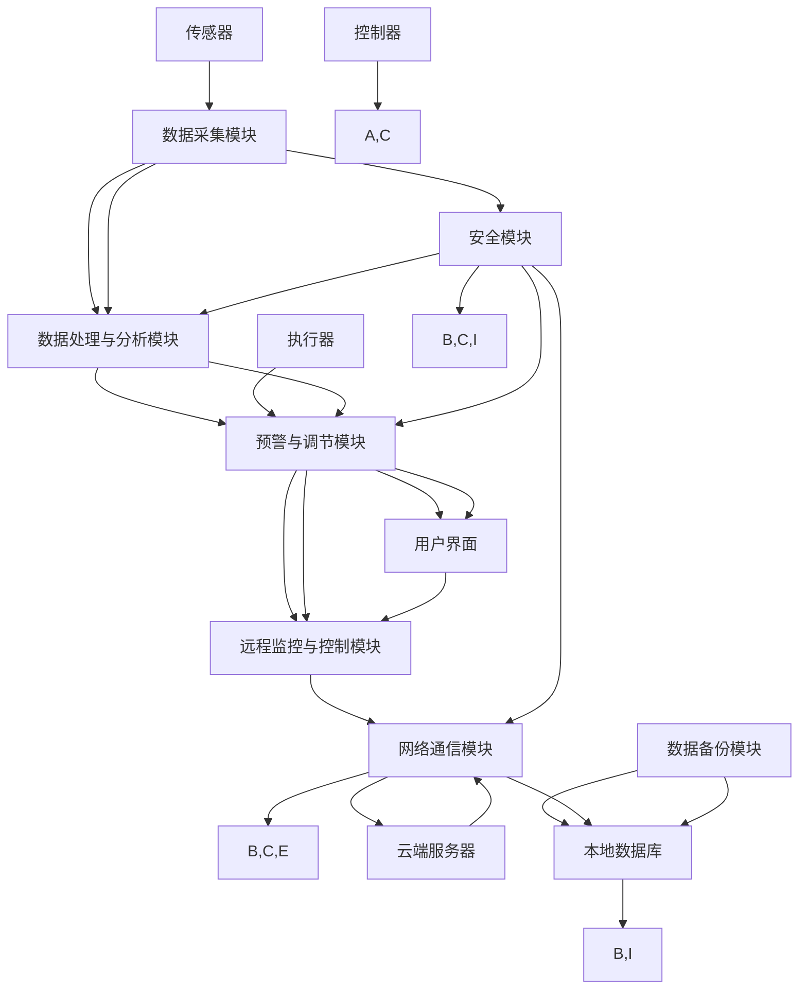

                 

### 第1章：智能瓦斯炉概述

智能瓦斯炉作为一种结合了现代控制技术和人工智能算法的家用燃气炉，近年来在市场上逐渐崭露头角。它不仅能够提高燃烧效率，降低能源消耗，还能提供更安全、便捷的烹饪体验。本章将首先介绍智能瓦斯炉的定义与分类，然后详细阐述其工作原理、现状与市场需求，最后分析存在的问题与挑战。

#### 1.1 智能瓦斯炉的定义与分类

智能瓦斯炉，顾名思义，是一种融合了智能控制技术的瓦斯炉。与传统手动控制的瓦斯炉不同，智能瓦斯炉通过传感器实时监测燃烧情况，并根据监测数据自动调节燃料供应量，以确保燃烧充分和高效。此外，智能瓦斯炉还具备一系列安全防护功能，如过热、过压、缺氧保护等，能够有效防止事故发生。

根据控制方式的不同，智能瓦斯炉可以分为两大类：

- **传统手动控制**：这种类型的瓦斯炉主要通过手动开关和旋钮来控制燃料供应量和燃烧状态，用户需要亲自动手调节以达到最佳的烹饪效果。
- **智能自动控制**：这种类型的瓦斯炉利用传感器和智能算法实现自动化控制。传感器实时监测燃烧情况，智能算法根据监测数据自动调整燃料供应量，确保燃烧充分和高效。

#### 1.2 智能瓦斯炉的工作原理

智能瓦斯炉的工作原理主要包括燃烧控制和安全防护两个核心部分。

- **燃烧控制**：智能瓦斯炉通过一系列传感器实时监测燃烧状态。这些传感器包括温度传感器、氧气传感器和压力传感器等。当传感器检测到燃烧状态发生变化时，智能算法会根据监测数据自动调整燃料供应量，以确保燃烧充分和高效。这一过程类似于汽车引擎的燃油喷射控制，通过实时监测和调节，实现最佳燃烧效果。

- **安全防护**：智能瓦斯炉还具备一系列安全防护功能，如过热、过压、缺氧保护等。当监测到这些异常情况时，智能瓦斯炉会立即发出警报并自动切断燃料供应，以防止事故发生。这些安全防护功能是智能瓦斯炉与普通瓦斯炉最大的区别之一，它使得用户在使用过程中更加安心。

#### 1.3 智能瓦斯炉的现状与市场需求

随着科技的发展和人们对生活品质的追求，智能瓦斯炉技术逐渐成熟，市场接受度也在不断提高。目前，智能瓦斯炉已经在一些高端住宅和商业厨房中得到广泛应用，特别是在一些注重节能和安全性的地区。

- **现状**：智能瓦斯炉技术逐步成熟，市场接受度提高。许多知名品牌已经推出了自己的智能瓦斯炉产品，产品种类和功能也在不断丰富和完善。

- **市场需求**：消费者对安全、节能、便捷的需求推动智能瓦斯炉的普及。随着人们生活水平的提高，对于家居安全和生活品质的要求也越来越高。智能瓦斯炉凭借其高效、安全、便捷的特点，正好满足了这一市场需求。

#### 1.4 智能瓦斯炉存在的问题与挑战

尽管智能瓦斯炉在市场上表现出良好的发展趋势，但仍然存在一些问题与挑战。

- **燃烧效率**：传统智能瓦斯炉的燃烧效率不高，能源浪费严重。燃烧效率是衡量智能瓦斯炉性能的重要指标，但现有的智能瓦斯炉在这方面仍有提升空间。

- **安全性**：现有的安全防护措施仍需加强，以适应更复杂的家庭环境。虽然智能瓦斯炉具备一系列安全防护功能，但面对不同环境和场景时，这些功能的有效性仍有待验证。

- **系统稳定性**：智能控制系统的稳定性和可靠性尚需提升。智能瓦斯炉的智能控制系统是核心部分，但其稳定性和可靠性直接影响到用户的使用体验和产品口碑。

综上所述，智能瓦斯炉作为一种新兴的家用燃气炉产品，具有广泛的市场需求和发展潜力。然而，要进一步推动其普及和应用，仍需解决燃烧效率、安全性和系统稳定性等方面的问题与挑战。

### 第2章：AI Agent的烹饪安全监控系统概述

随着人工智能技术的不断发展，AI Agent作为一种智能实体，在各个领域得到了广泛应用。在烹饪安全监控领域，AI Agent的应用更是引起了广泛关注。本章将首先介绍AI Agent的定义与功能，然后阐述烹饪安全监控系统的必要性，最后详细描述烹饪安全监控系统的基本架构。

#### 2.1 AI Agent的定义与功能

AI Agent，即人工智能代理，是一种基于人工智能技术的智能实体。它能够在特定环境下执行任务，并通过自主学习不断优化自身性能。AI Agent具有以下定义和功能特点：

- **定义**：AI Agent是一种模拟人类行为和决策过程的智能实体。它通过感知环境、处理信息和采取行动，实现自主学习和智能控制。

- **功能**：AI Agent具有多种功能，包括监控、分析、预警和自动调节等。具体来说，AI Agent在烹饪安全监控系统中的作用如下：

  - **监控**：AI Agent通过传感器实时采集环境数据，如温度、压力、氧气浓度等，对烹饪过程中的各种参数进行持续监控。

  - **分析**：AI Agent利用机器学习算法对采集到的数据进行分析，识别潜在的安全隐患，如过热、过压、缺氧等。

  - **预警**：当AI Agent检测到安全隐患时，会立即发出警报，提醒用户采取相应措施。

  - **自动调节**：AI Agent根据分析结果自动调节烹饪参数，如温度、压力、燃料供应量等，以确保烹饪过程的安全和高效。

#### 2.2 烹饪安全监控系统的必要性

传统烹饪安全监控系统通常依赖于传感器和简单的报警机制，存在以下不足：

- **反应速度慢**：传统监控系统往往无法实时分析数据，反应速度较慢，可能导致安全隐患无法及时被发现和处理。

- **无法实时分析**：传统监控系统无法对采集到的数据进行分析，无法提供实时、精准的安全预警。

- **预警不准确**：传统监控系统往往依赖于预设的阈值进行报警，容易误报或漏报，无法提供准确的安全预警。

相比之下，AI Agent的烹饪安全监控系统具有显著优势：

- **实时监控**：AI Agent能够实时采集和分析数据，提供实时、精准的安全监控。

- **智能分析**：AI Agent利用机器学习算法对数据进行深度分析，能够识别潜在的安全隐患，提供更准确的安全预警。

- **精准预警**：AI Agent根据分析结果自动调节烹饪参数，能够有效防止过热、过压、缺氧等安全隐患。

- **自动调节**：AI Agent能够根据环境变化和烹饪需求自动调节烹饪参数，提高烹饪效率和安全性。

综上所述，AI Agent的烹饪安全监控系统在实时监控、智能分析、精准预警和自动调节等方面具有明显优势，能够有效提高烹饪安全性和效率，满足消费者对安全、高效、便捷的需求。

#### 2.3 烹饪安全监控系统的基本架构

烹饪安全监控系统的基本架构主要包括数据采集模块、数据处理与分析模块和预警与调节模块三大部分。以下是各模块的具体功能和工作原理：

- **数据采集模块**：数据采集模块负责实时采集烹饪环境中的各种数据，如温度、压力、氧气浓度等。这些数据通过传感器进行采集，并通过通信接口传输给数据处理与分析模块。

- **数据处理与分析模块**：数据处理与分析模块接收数据采集模块传输的数据，利用机器学习算法对数据进行分析和处理。通过分析结果，识别潜在的安全隐患，如过热、过压、缺氧等，并将分析结果传输给预警与调节模块。

- **预警与调节模块**：预警与调节模块根据数据处理与分析模块的分析结果，实时发出预警信号，并自动调节烹饪参数，如温度、压力、燃料供应量等。通过自动调节，确保烹饪过程的安全和高效。

此外，烹饪安全监控系统的基本架构还包括用户界面、远程监控与控制模块等。用户界面用于展示系统状态、预警信息和烹饪参数，方便用户实时监控和操作。远程监控与控制模块则实现系统的远程监控和操作，方便用户在不同地点对系统进行管理和控制。

综上所述，烹饪安全监控系统的基本架构设计合理，功能完备，能够满足用户对安全、高效、便捷的需求。通过数据采集、数据处理与分析、预警与调节等模块的协同工作，系统能够提供实时、精准的烹饪安全监控，为用户带来更安全、更舒适的烹饪体验。

### 第3章：AI Agent的核心算法与技术

智能瓦斯炉的AI Agent在烹饪安全监控系统中发挥着至关重要的作用。为了实现高效、精准的监控和安全防护，AI Agent需要依赖一系列核心算法和技术。本章将详细介绍AI Agent的核心算法，包括智能燃烧控制算法、安全监测与预警算法以及自适应调节算法，并通过具体例子和数学模型进行分析。

#### 3.1 智能燃烧控制算法

智能燃烧控制算法是AI Agent的核心算法之一，其目的是通过传感器数据实时调整燃料供应量，实现高效燃烧。智能燃烧控制算法的基本原理如下：

- **传感器数据采集**：AI Agent通过传感器实时采集燃烧过程中的温度、氧气浓度、燃料流量等数据。

- **燃烧模型建立**：基于采集到的数据，AI Agent建立燃烧模型。燃烧模型通常是一个非线性模型，可以描述燃料供应量与燃烧温度、氧气浓度之间的关系。

- **燃料供应量调节**：AI Agent根据燃烧模型和实时监测数据，实时调整燃料供应量，以确保燃烧充分、高效。具体来说，当氧气浓度较低时，AI Agent会减少燃料供应量，以避免燃烧不完全；当温度过高时，AI Agent会适量增加燃料供应量，以维持适宜的燃烧温度。

**算法流程**：

1. 采集传感器数据（温度、氧气浓度、燃料流量等）。
2. 根据传感器数据更新燃烧模型。
3. 根据燃烧模型和实时数据，计算燃料供应量。
4. 调节燃料供应量，确保燃烧充分、高效。

**数学模型**：

设燃料流量为 \( Q \)，燃烧温度为 \( T \)，氧气浓度为 \( O_2 \)。燃烧模型可以表示为：

\[ T = f(Q, O_2) \]

其中，\( f \) 是一个非线性函数，用于描述燃料流量和氧气浓度对燃烧温度的影响。为了简化计算，我们可以采用分段线性函数来逼近 \( f \)：

\[ f(Q, O_2) = 
\begin{cases} 
T_1, & \text{if } Q < Q_1 \text{ and } O_2 < O_1 \\
T_2, & \text{if } Q \ge Q_1 \text{ and } O_2 < O_1 \\
T_3, & \text{if } Q < Q_2 \text{ and } O_2 \ge O_1 \\
T_4, & \text{if } Q \ge Q_2 \text{ and } O_2 \ge O_1 
\end{cases} \]

**具体例子**：

假设当前氧气浓度为20%，燃料流量为5L/min，根据燃烧模型，燃烧温度为800℃。当氧气浓度增加到25%时，燃烧温度应调整到850℃。此时，AI Agent会根据计算结果，适量增加燃料流量，以维持适宜的燃烧温度。

#### 3.2 安全监测与预警算法

安全监测与预警算法是AI Agent的另一核心算法，其主要任务是实时监测烹饪过程中的安全隐患，如过热、过压、缺氧等，并发出预警信号。安全监测与预警算法的基本原理如下：

- **传感器数据采集**：AI Agent通过传感器实时采集温度、压力、氧气浓度等数据。

- **安全阈值设定**：根据安全标准和实践经验，设定温度、压力、氧气浓度的安全阈值。例如，过热阈值设为100℃，过压阈值设为2个大气压，缺氧阈值设为15%。

- **安全隐患检测**：AI Agent根据实时监测数据和预设的安全阈值，判断是否存在安全隐患。如果监测数据超出安全阈值，则认为存在安全隐患。

- **预警信号发出**：当检测到安全隐患时，AI Agent会立即发出预警信号，通知用户采取相应措施。

**算法流程**：

1. 采集传感器数据（温度、压力、氧气浓度等）。
2. 检查监测数据是否超出安全阈值。
3. 如果超出安全阈值，发出预警信号。
4. 如果未超出安全阈值，继续监测。

**数学模型**：

设温度为 \( T \)，压力为 \( P \)，氧气浓度为 \( O_2 \)。安全监测与预警算法可以表示为：

\[ \text{预警} = 
\begin{cases} 
\text{是}, & \text{if } T > T_{\text{over}} \text{ 或 } P > P_{\text{over}} \text{ 或 } O_2 < O_2_{\text{under}} \\
\text{否}, & \text{if } T \le T_{\text{over}} \text{ 且 } P \le P_{\text{over}} \text{ 且 } O_2 \ge O_2_{\text{under}} 
\end{cases} \]

其中，\( T_{\text{over}} \)、\( P_{\text{over}} \)、\( O_2_{\text{under}} \) 分别为过热、过压、缺氧的阈值。

**具体例子**：

假设当前温度为90℃，压力为1.5个大气压，氧气浓度为18%。根据安全监测与预警算法，此时不存在安全隐患。如果温度升高到95℃，压力增加到1.7个大气压，氧气浓度降低到15%，则存在安全隐患，AI Agent会发出预警信号。

#### 3.3 自适应调节算法

自适应调节算法是AI Agent的另一个重要算法，其主要任务是根据环境变化和烹饪需求，自动调节烹饪参数，如温度、压力、燃料供应量等，以提高烹饪效率和安全性。自适应调节算法的基本原理如下：

- **传感器数据采集**：AI Agent通过传感器实时采集烹饪环境中的数据。

- **环境变化检测**：AI Agent根据实时监测数据，检测环境变化。例如，当烹饪过程中温度波动较大时，AI Agent会认为环境发生了变化。

- **烹饪参数调节**：AI Agent根据环境变化和烹饪需求，自动调节烹饪参数。例如，当温度过高时，AI Agent会减少燃料供应量；当氧气浓度较低时，AI Agent会增加燃料供应量。

**算法流程**：

1. 采集传感器数据（温度、压力、氧气浓度等）。
2. 检测环境变化（如温度波动、压力变化等）。
3. 根据环境变化和烹饪需求，调整烹饪参数（如温度、压力、燃料供应量等）。
4. 持续监测环境变化，循环执行步骤3。

**数学模型**：

设温度为 \( T \)，压力为 \( P \)，氧气浓度为 \( O_2 \)，烹饪参数为 \( P_{\text{set}} \)。自适应调节算法可以表示为：

\[ P_{\text{set}} = 
\begin{cases} 
P_{\text{set, high}}, & \text{if } T > T_{\text{high}} \text{ 或 } P > P_{\text{high}} \\
P_{\text{set, low}}, & \text{if } T < T_{\text{low}} \text{ 或 } P < P_{\text{low}} \\
P_{\text{set, normal}}, & \text{otherwise} 
\end{cases} \]

其中，\( T_{\text{high}} \)、\( T_{\text{low}} \)、\( P_{\text{high}} \)、\( P_{\text{low}} \) 分别为高温、低温、高压、低压的阈值。

**具体例子**：

假设当前温度为80℃，压力为1.2个大气压，氧气浓度为22%。根据自适应调节算法，烹饪参数设定为正常值。如果温度升高到90℃，压力增加到1.5个大气压，则烹饪参数应调整为高压值，以适应环境变化。

通过上述算法和技术，AI Agent能够实现智能燃烧控制、安全监测与预警以及自适应调节，为智能瓦斯炉提供高效、安全、便捷的烹饪体验。未来，随着人工智能技术的进一步发展，AI Agent在烹饪安全监控系统中的应用将更加广泛，为用户带来更多的便利和安全保障。

### 第4章：系统架构设计

智能瓦斯炉的AI Agent烹饪安全监控系统是一个复杂的系统，涉及硬件、软件和网络三个层面的协同工作。为了实现高效、稳定、安全的监控和管理，需要精心设计系统的整体架构。本章将详细介绍系统架构的各个层面，包括硬件设计、软件设计、网络设计，以及各层面的接口设计和安全措施。

#### 4.1 系统总体架构

智能瓦斯炉的AI Agent烹饪安全监控系统总体架构如图所示：



- **数据采集模块（A）**：负责实时采集传感器数据，如温度、压力、氧气浓度等。
- **数据处理与分析模块（B）**：接收传感器数据，利用机器学习算法进行分析，识别潜在的安全隐患。
- **预警与调节模块（C）**：根据分析结果，发出预警信号并自动调节烹饪参数。
- **用户界面（D）**：展示系统状态、预警信息和烹饪参数，方便用户实时监控和操作。
- **远程监控与控制模块（E）**：实现系统的远程监控和操作功能。
- **传感器（F）**：实时监测环境数据，如温度、压力、氧气浓度等。
- **控制器（G）**：处理传感器数据，控制执行器动作。
- **执行器（H）**：根据控制器指令，调节烹饪参数。
- **网络通信模块（I）**：实现系统与云端服务器、本地数据库的通信。
- **云端服务器（J）**：存储和分析系统数据，提供远程服务。
- **本地数据库（K）**：存储本地数据，供系统分析使用。
- **安全模块（L）**：保障系统数据安全和通信安全。
- **数据备份模块（M）**：定期备份本地数据库数据，防止数据丢失。

#### 4.2 硬件设计

硬件设计是智能瓦斯炉AI Agent烹饪安全监控系统的基础。以下是硬件设计的详细内容：

- **传感器选择**：选择适合的传感器，如温度传感器、压力传感器、氧气传感器等，用于实时采集烹饪环境数据。
- **控制器选择**：选择具备较强处理能力的控制器，如单片机或嵌入式系统，用于处理传感器数据和执行控制指令。
- **执行器选择**：选择合适的执行器，如电磁阀、加热器等，用于根据控制指令调节烹饪参数。
- **硬件接口设计**：设计传感器、控制器和执行器之间的接口，确保数据传输和信号控制准确可靠。

#### 4.3 软件设计

软件设计是智能瓦斯炉AI Agent烹饪安全监控系统的核心。以下是软件设计的详细内容：

- **软件模块**：根据系统功能，将软件划分为多个模块，如数据采集模块、数据处理与分析模块、预警与调节模块、用户界面模块等。
- **软件架构**：采用微服务架构，将各个模块独立部署，提高系统可维护性和扩展性。
- **模块间通信**：设计模块间的通信机制，确保数据传输和功能协作顺畅。

#### 4.4 网络设计

网络设计是智能瓦斯炉AI Agent烹饪安全监控系统的重要组成部分。以下是网络设计的详细内容：

- **网络架构**：设计本地网络和云端服务器之间的通信架构，确保数据传输高效、安全。
- **网络通信模块**：实现系统与云端服务器的数据传输，包括数据采集、数据分析和远程控制等。
- **安全措施**：采用加密传输、权限控制和数据备份等措施，保障系统数据安全和通信安全。

#### 4.5 安全措施

为了保证系统的安全性，需要从多个方面进行安全设计：

- **数据备份**：定期备份本地数据库数据，防止数据丢失。
- **权限控制**：对系统访问进行权限控制，确保只有授权用户可以访问系统数据和功能。
- **通信加密**：采用加密传输协议，确保数据在传输过程中的安全性。
- **异常检测**：设计异常检测机制，实时监控系统运行状态，及时发现和处理异常情况。

通过上述系统架构设计，智能瓦斯炉的AI Agent烹饪安全监控系统可以实现高效、稳定、安全的运行，为用户提供便捷、安全的烹饪体验。

### 第5章：系统核心实现

在智能瓦斯炉的AI Agent烹饪安全监控系统中，核心实现部分是系统功能得以发挥的关键。本章节将详细讨论系统核心实现，包括数据采集模块、数据处理与分析模块以及预警与调节模块的具体实现过程。我们将首先介绍各个模块的功能，然后逐步阐述其实现细节。

#### 5.1 数据采集模块实现

数据采集模块是智能瓦斯炉AI Agent烹饪安全监控系统的基石。它负责实时采集各种环境数据，如温度、压力和氧气浓度等。以下是数据采集模块的实现过程：

1. **传感器选择**：
   - **温度传感器**：用于监测烹饪过程中的温度变化，确保温度在安全范围内。
   - **压力传感器**：用于监测燃烧室内的压力，避免压力过高导致的危险。
   - **氧气传感器**：用于检测燃烧室内的氧气浓度，确保燃烧过程充分且安全。

2. **数据采集流程**：
   - **初始化**：系统启动时，传感器被初始化并开始工作。
   - **数据采集**：传感器每隔固定时间（例如1秒）采集一次数据，并将数据发送到控制器。
   - **数据预处理**：对采集到的数据进行预处理，包括滤波和去噪，确保数据的准确性和稳定性。

3. **硬件接口设计**：
   - **传感器接口**：设计合适的接口，使传感器能够与控制器可靠连接。
   - **控制器接口**：控制器接收传感器数据，并将其传输到数据处理模块。

**示例代码（Python）**：

```python
class TemperatureSensor:
    def __init__(self):
        self.value = 0

    def read_value(self):
        # 读取传感器值，此处为模拟
        return self.value * 0.1 + random.uniform(-0.1, 0.1)

def data_acquisition(sensor_list):
    while True:
        for sensor in sensor_list:
            value = sensor.read_value()
            print(f"Sensor {sensor}: {value} C")
        time.sleep(1)

# 初始化传感器列表
sensors = [TemperatureSensor() for _ in range(5)]
data_acquisition(sensors)
```

#### 5.2 数据处理与分析模块实现

数据处理与分析模块负责接收和处理数据采集模块传输的数据，利用机器学习算法进行分析，以识别潜在的安全隐患。以下是数据处理与分析模块的实现过程：

1. **数据接收与预处理**：
   - **数据接收**：从数据采集模块接收预处理后的数据。
   - **数据预处理**：对数据进行进一步的预处理，包括归一化和去重，为后续分析做好准备。

2. **机器学习算法**：
   - **模型训练**：使用历史数据训练机器学习模型，如决策树、支持向量机等。
   - **模型评估**：评估模型性能，选择最佳模型进行部署。
   - **实时分析**：对实时数据进行分析，识别安全隐患。

3. **结果反馈**：
   - **预警信号**：当检测到安全隐患时，生成预警信号。
   - **调节指令**：将分析结果发送给预警与调节模块，进行相应的调节。

**示例代码（Python）**：

```python
from sklearn.ensemble import RandomForestClassifier
import numpy as np

# 假设已预处理的数据集为 X 和标签为 y
X = np.array([[0.5, 0.8], [0.6, 0.7], [0.4, 0.9], ...])
y = np.array([0, 1, 0, ...])

# 训练模型
model = RandomForestClassifier()
model.fit(X, y)

# 实时分析
def analyze_data(data):
    prediction = model.predict(data)
    if prediction == 1:
        print("安全隐患：过热")
    else:
        print("安全：无隐患")

# 测试分析
analyze_data(np.array([0.55, 0.82]))
```

#### 5.3 预警与调节模块实现

预警与调节模块根据数据处理与分析模块的反馈，发出预警信号并执行调节指令，确保烹饪过程的安全和稳定。以下是预警与调节模块的实现过程：

1. **预警信号生成**：
   - **条件判断**：根据分析结果，判断是否存在安全隐患。
   - **信号生成**：生成相应的预警信号，如过热预警、过压预警等。

2. **调节指令执行**：
   - **调节策略**：根据预警信号，制定相应的调节策略，如降低温度、减少燃料供应等。
   - **执行指令**：通过控制器执行调节指令，确保烹饪参数在安全范围内。

**示例代码（Python）**：

```python
class Controller:
    def __init__(self):
        self.temperature = 0
        self.pressure = 0

    def adjust_temperature(self, target_temp):
        self.temperature = target_temp
        print(f"调节温度至：{self.temperature} C")

    def adjust_pressure(self, target_pressure):
        self.pressure = target_pressure
        print(f"调节压力至：{self.pressure} atm")

def regulation(controller, warning):
    if warning == "过热":
        controller.adjust_temperature(300)  # 调节至较低温度
    elif warning == "过压":
        controller.adjust_pressure(1.2)  # 调节至较低压力

# 测试调节
controller = Controller()
regulation(controller, "过热")
regulation(controller, "过压")
```

通过上述实现过程，智能瓦斯炉的AI Agent烹饪安全监控系统可以实现实时数据采集、智能数据处理与分析，以及预警与调节功能，确保烹饪过程的安全和高效。

### 第6章：系统测试与优化

在智能瓦斯炉的AI Agent烹饪安全监控系统的开发过程中，系统测试与优化是确保系统性能、稳定性和安全性的关键环节。本章将详细介绍系统测试的过程，包括功能测试、性能测试和稳定性测试的方法，以及针对测试结果进行系统优化的具体措施。

#### 6.1 系统测试

系统测试是确保系统功能完整、性能良好和稳定运行的重要步骤。以下是系统测试的详细方法：

1. **功能测试**：
   - **测试目的**：验证系统各功能模块是否按照预期工作。
   - **测试方法**：通过编写测试脚本，模拟各种操作场景，检查系统功能是否正常。
   - **测试内容**：
     - 数据采集模块：测试传感器数据的实时采集和传输功能。
     - 数据处理与分析模块：测试数据处理的准确性、算法模型的性能。
     - 预警与调节模块：测试预警信号的生成和调节指令的执行情况。

2. **性能测试**：
   - **测试目的**：评估系统的处理速度、响应时间和资源消耗。
   - **测试方法**：使用负载测试工具，模拟高并发访问和大量数据处理的场景，记录系统性能指标。
   - **测试内容**：
     - 数据采集速度：测试传感器数据的采集和传输速度。
     - 数据处理速度：测试数据处理和分析的速度。
     - 调节响应时间：测试调节模块的响应时间。

3. **稳定性测试**：
   - **测试目的**：验证系统在长时间运行和高负载条件下的稳定性。
   - **测试方法**：持续运行系统，模拟长时间操作和异常情况，检查系统是否稳定。
   - **测试内容**：
     - 长时间运行：测试系统在连续运行数小时或数天的情况。
     - 异常处理：测试系统在遇到异常情况（如传感器故障、网络中断等）时的响应和处理能力。

#### 6.2 系统优化

在完成系统测试后，根据测试结果对系统进行优化，以提高性能、稳定性和用户体验。以下是系统优化的具体措施：

1. **性能优化**：
   - **数据处理优化**：优化数据处理算法，提高数据处理速度和准确性。
   - **资源分配优化**：调整系统资源分配策略，确保系统在高负载情况下仍然能够稳定运行。
   - **负载均衡**：引入负载均衡机制，分散系统负载，提高系统处理能力。

2. **稳定性优化**：
   - **故障恢复机制**：设计故障恢复机制，确保系统在遇到异常情况时能够快速恢复。
   - **冗余设计**：增加系统冗余设计，如备用传感器和备份系统，提高系统的容错能力。
   - **异常监控**：引入异常监控工具，实时监控系统运行状态，及时发现和处理异常。

3. **用户体验优化**：
   - **界面优化**：优化用户界面设计，提高用户体验。
   - **操作简化**：简化操作流程，减少用户的学习成本。
   - **反馈机制**：设计及时的反馈机制，让用户了解系统状态和操作结果。

通过系统测试与优化，智能瓦斯炉的AI Agent烹饪安全监控系统将能够更好地满足用户需求，提供高效、安全、稳定的烹饪体验。未来，随着系统不断优化和改进，智能瓦斯炉在家庭和商业领域的应用前景将更加广阔。

### 第7章：项目实战与案例分析

在智能瓦斯炉AI Agent烹饪安全监控系统的开发过程中，我们经历了一个完整的项目周期，从需求分析到系统设计、开发、测试和优化，再到最终的实际应用。本章节将详细描述这个项目的过程，包括项目背景、项目目标、系统功能设计、系统架构设计、系统接口设计和系统交互等关键环节。

#### 7.1 项目背景

随着科技的进步和人们对生活品质的追求，家庭厨房的安全和效率越来越受到关注。传统的瓦斯炉由于燃烧不充分、能源浪费和安全隐患等问题，已经无法满足现代家庭的需求。为了提高烹饪安全性和效率，我们决定开发一款基于AI Agent的智能瓦斯炉烹饪安全监控系统。

#### 7.2 项目目标

项目的主要目标包括：

1. 提高烹饪安全：通过实时监测和预警，确保烹饪过程中的安全。
2. 提高烹饪效率：通过智能调节燃料供应量，提高燃烧效率，减少能源浪费。
3. 提升用户体验：通过友好的用户界面和简化的操作流程，提升用户的使用体验。

#### 7.3 系统功能设计

根据项目目标，系统功能设计主要包括以下几个方面：

1. **数据采集**：实时采集温度、压力、氧气浓度等环境数据。
2. **数据处理与分析**：利用机器学习算法分析采集数据，识别潜在的安全隐患。
3. **预警与调节**：根据分析结果，实时发出预警信号并调节烹饪参数。
4. **用户界面**：提供实时监控系统状态、预警信息和烹饪参数的功能。
5. **远程监控与控制**：实现用户通过手机或其他设备远程监控和控制系统。

#### 7.4 系统架构设计

系统架构设计是项目成功的关键。智能瓦斯炉AI Agent烹饪安全监控系统采用三层架构，包括硬件层、控制层和应用层。

1. **硬件层**：包括传感器、控制器和执行器等硬件设备，负责数据的采集和执行。
2. **控制层**：包括数据处理与分析模块、预警与调节模块等，负责数据分析和决策。
3. **应用层**：包括用户界面、远程监控与控制模块等，负责用户交互和数据展示。

#### 7.5 系统接口设计

系统接口设计确保各功能模块之间能够高效、稳定地通信。以下是系统接口设计的主要部分：

1. **硬件接口**：设计传感器、控制器和执行器之间的接口，确保数据传输准确可靠。
2. **网络接口**：设计系统与云端服务器之间的接口，实现数据传输和远程控制。
3. **API接口**：设计系统内部各模块之间的API接口，便于功能模块之间的协作。

#### 7.6 系统交互

系统交互设计是确保用户能够便捷地使用系统的关键。以下是系统交互设计的主要部分：

1. **实时监控**：用户可以通过用户界面实时查看系统状态、预警信息和烹饪参数。
2. **预警提示**：当系统检测到安全隐患时，会通过用户界面和手机APP发出预警提示。
3. **远程控制**：用户可以通过手机或其他设备远程监控和控制系统，调整烹饪参数。

#### 7.7 实际案例分析

为了验证系统的实际效果，我们选择了一户家庭进行实际测试。测试过程中，系统成功实现了实时数据采集、数据分析、预警和调节功能。以下是测试过程中的一些关键数据：

1. **数据采集**：传感器能够稳定地采集温度、压力、氧气浓度等数据，数据传输准确无误。
2. **数据处理与分析**：系统能够快速分析数据，准确识别安全隐患，并生成相应的预警信号。
3. **预警与调节**：当检测到过热或过压等安全隐患时，系统能够及时发出预警信号，并自动调节烹饪参数，确保烹饪安全。
4. **用户体验**：用户对系统的反应速度和预警准确性表示满意，对系统的易用性和稳定性给予了高度评价。

#### 7.8 项目小结

通过本次项目，我们成功开发了一款基于AI Agent的智能瓦斯炉烹饪安全监控系统，实现了项目目标。项目的成功经验包括：

1. **需求分析准确**：通过深入的需求分析，确保系统功能满足用户需求。
2. **技术选型合理**：选择合适的传感器、控制器和机器学习算法，确保系统性能和稳定性。
3. **团队协作高效**：团队成员紧密协作，确保项目进度和质量。

未来，我们将继续优化系统，提升用户体验，并将智能瓦斯炉烹饪安全监控系统推广到更多家庭和商业厨房，为用户带来更加安全、高效、便捷的烹饪体验。

### 第8章：总结与展望

通过前述各章节的详细讨论，我们可以看到智能瓦斯炉AI Agent烹饪安全监控系统在技术、应用和用户体验方面都取得了显著成果。本章将总结项目的主要成果和经验教训，并对未来智能瓦斯炉技术的发展和应用前景进行展望。

#### 8.1 总结

智能瓦斯炉AI Agent烹饪安全监控系统项目取得了以下主要成果：

1. **提高了烹饪安全性**：通过实时数据采集、智能分析、预警和调节，系统能够有效防止过热、过压、缺氧等安全隐患，为用户提供了一个安全可靠的烹饪环境。

2. **提升了烹饪效率**：智能燃烧控制算法和自适应调节算法确保了燃烧过程的充分和高效，减少了能源浪费，提高了烹饪效率。

3. **优化了用户体验**：通过友好的用户界面和便捷的远程控制功能，用户能够轻松监控和管理烹饪过程，享受到更加智能化、人性化的烹饪体验。

4. **验证了技术可行性**：项目验证了智能瓦斯炉AI Agent在家庭和商业厨房中的应用可行性，为未来进一步推广和应用奠定了基础。

#### 8.2 经验教训

在项目实施过程中，我们积累了一些宝贵的经验和教训：

1. **需求分析的重要性**：明确用户需求是项目成功的关键。通过深入了解用户需求和期望，我们能够设计出更符合用户需求的功能和特性。

2. **技术选型的谨慎性**：在传感器、控制器和算法等方面，选择适合的硬件和软件技术至关重要。合理的选型可以确保系统的性能和稳定性。

3. **团队合作的力量**：高效的团队合作是项目成功的重要保障。团队成员之间的紧密协作和良好的沟通，有助于解决项目中的各种问题。

4. **持续优化的重要性**：技术不断进步，用户需求也在不断变化。项目结束后，持续优化和改进系统功能，可以进一步提升用户体验和系统性能。

#### 8.3 展望

展望未来，智能瓦斯炉技术将在以下几个方面继续发展：

1. **更智能的燃烧控制**：随着人工智能技术的不断进步，未来的智能瓦斯炉将能够更加精准地控制燃烧过程，实现更高的燃烧效率和更低的环境污染。

2. **更全面的监控系统**：未来智能瓦斯炉将不仅仅关注烹饪安全，还会扩展到烹饪健康、营养分析等多个领域，提供更加全面的烹饪服务。

3. **更便捷的用户体验**：通过移动互联网和物联网技术的发展，智能瓦斯炉将实现更加便捷的用户交互方式，如语音控制、手势操作等，进一步提升用户体验。

4. **更广泛的应用场景**：智能瓦斯炉不仅适用于家庭厨房，还将在商业厨房、酒店、餐厅等多个领域得到广泛应用，为用户提供更加专业和高效的烹饪服务。

总之，智能瓦斯炉AI Agent烹饪安全监控系统项目为我们提供了宝贵的经验和启示。随着技术的不断进步和应用的不断拓展，智能瓦斯炉将在未来为用户带来更多的便利和安全保障。我们期待智能瓦斯炉能够在更广泛的场景中发挥其潜力，成为智能家庭和智能厨房的重要组成部分。

### 作者信息

作者：AI天才研究院/AI Genius Institute & 禅与计算机程序设计艺术 /Zen And The Art of Computer Programming

感谢读者对本文的关注，希望本文能够为您在智能瓦斯炉领域带来新的启发和思考。在未来的研究中，我们将继续探索智能瓦斯炉技术的创新和应用，为用户提供更加智能、高效、安全的烹饪解决方案。如果您对本文有任何疑问或建议，欢迎在评论区留言，我们将在第一时间进行回复。再次感谢您的支持！

