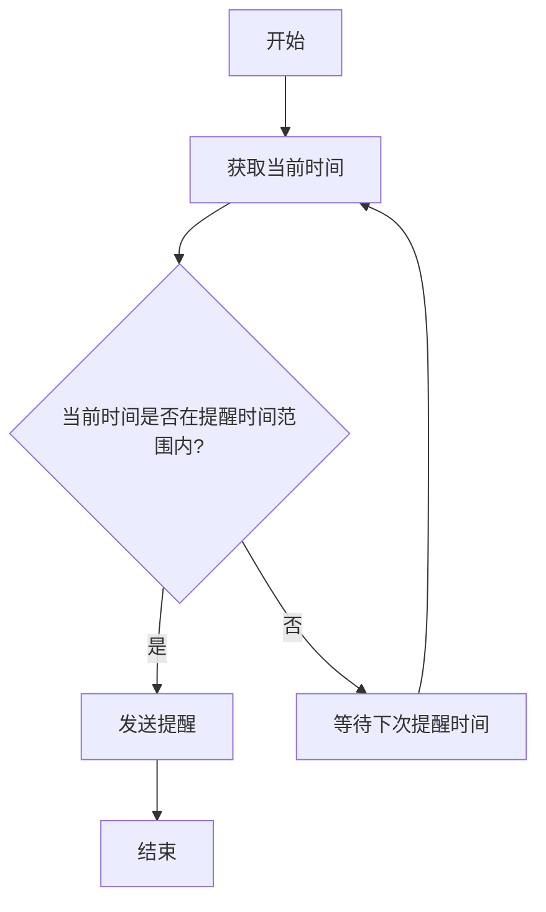
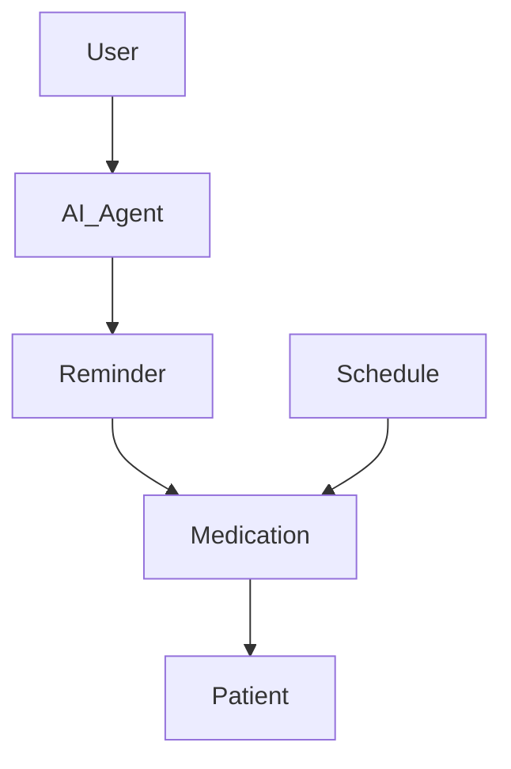
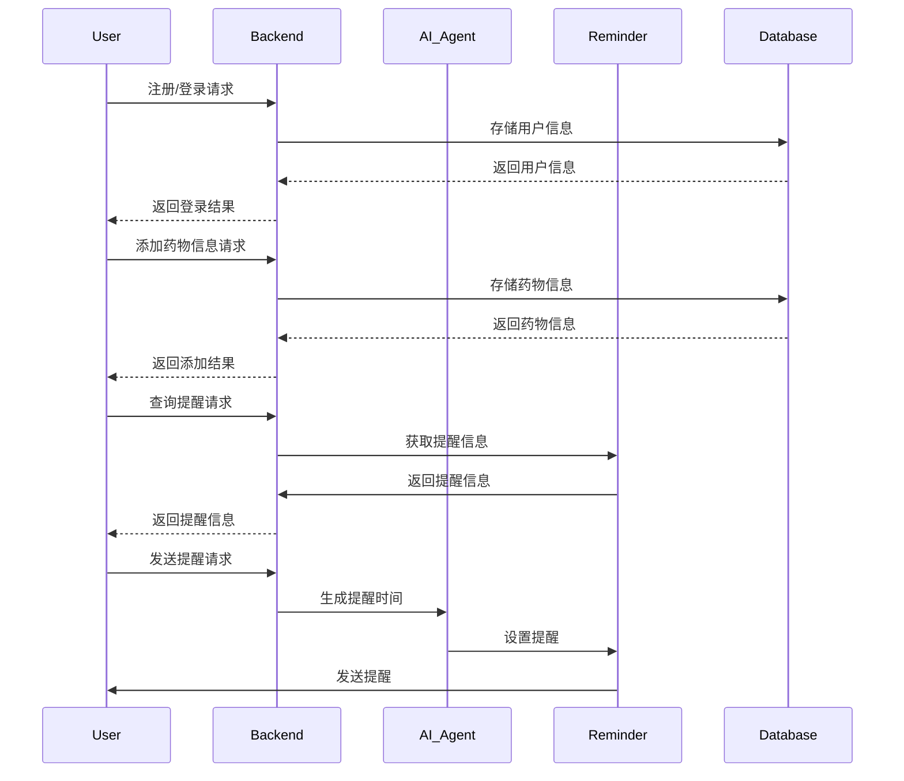

                 

### 智能瓶盖：AI Agent的药物服用提醒

#### 关键词：

- 智能瓶盖
- AI Agent
- 药物服用提醒
- 系统架构设计
- 算法原理

> 摘要：随着人工智能技术的不断发展，智能瓶盖作为一种创新的应用场景，已经在许多家庭中普及。本文将探讨如何利用AI Agent来实现药物服用提醒功能，详细分析其技术原理、系统架构设计，并提供一个完整的实现方案。通过本文，读者可以了解到如何将先进的人工智能技术应用于日常生活中的实际问题，提升生活质量。

---

### 目录大纲

----------------------------------------------------------------

# 第一部分：背景介绍

## 第1章 问题背景

### 1.1 问题背景

### 1.2 问题描述

### 1.3 问题解决

### 1.4 边界与外延

### 1.5 概念结构与核心要素组成

## 第2章 核心概念与联系

### 2.1 核心概念原理

### 2.2 概念属性特征对比表格

### 2.3 ER实体关系图架构

----------------------------------------------------------------

# 第二部分：AI Agent药物服用提醒技术原理

## 第3章 AI Agent基本原理

### 3.1 AI Agent的定义与分类

### 3.2 AI Agent的核心组件

### 3.3 AI Agent的运行机制

## 第4章 药物服用提醒算法原理

### 4.1 算法原理讲解

#### 4.1.1 Mermaid流程图

#### 4.1.2 Python源代码

----------------------------------------------------------------

## 第5章 系统分析与架构设计

### 5.1 问题场景介绍

### 5.2 项目介绍

### 5.3 系统功能设计

#### 5.3.1 领域模型Mermaid类图

#### 5.4 系统架构设计

#### 5.4.1 Mermaid架构图

#### 5.5 系tem接口设计

#### 5.5.1 接口设计

### 5.6 系统交互

#### 5.6.1 Mermaid序列图

----------------------------------------------------------------

# 第二部分：AI Agent药物服用提醒技术原理

## 第3章 AI Agent基本原理

### 3.1 AI Agent的定义与分类

AI Agent，即人工智能代理，是指一种能够自主执行任务、与环境交互并作出决策的智能实体。根据其功能和应用场景，AI Agent可以分为以下几类：

1. **搜索型AI Agent**：这种类型的Agent主要用于解决路径规划、推荐系统等问题。例如，在智能瓶盖的药物服用提醒系统中，搜索型AI Agent可以用来搜索最佳的服药时间表。

2. **反应型AI Agent**：这种类型的Agent能够根据当前环境的刺激做出反应，但不具备长期记忆和学习能力。例如，当检测到用户未按时服药时，反应型AI Agent可以立即发送提醒。

3. **认知型AI Agent**：这种类型的Agent不仅能够反应，还能够理解环境和情境，并基于这些理解做出决策。例如，认知型AI Agent可以根据用户的用药历史和健康数据，预测最佳的服药时间。

4. **学习型AI Agent**：这种类型的Agent具有学习能力和自适应能力，能够通过不断的学习和调整，提高其完成任务的效果。例如，学习型AI Agent可以根据用户的行为习惯，自动调整提醒时间。

### 3.2 AI Agent的核心组件

一个完整的AI Agent通常包括以下几个核心组件：

1. **感知器**：感知器负责接收环境信息，并将其转换为Agent可以理解的数据。在药物服用提醒系统中，感知器可以是温度传感器、湿度传感器或移动传感器，用于检测用户是否按时服药。

2. **决策器**：决策器根据感知器收集的信息，结合预定的策略，生成执行动作。在药物服用提醒系统中，决策器会根据用户设定的药物服用时间表，判断是否需要发送提醒。

3. **执行器**：执行器负责将决策器的决策转化为具体的操作。在药物服用提醒系统中，执行器可以是手机APP、语音助手或智能家居设备，用于向用户发送提醒。

### 3.3 AI Agent的运行机制

AI Agent的运行机制可以分为以下几个步骤：

1. **感知**：感知器收集环境信息。

2. **决策**：决策器根据感知器提供的信息，结合预定的策略，生成执行动作。

3. **执行**：执行器执行决策器生成的动作。

4. **反馈**：环境对执行动作的反馈，用于调整Agent的行为。

5. **学习**：如果AI Agent具备学习能力，它会根据反馈信息进行学习，以提高未来的决策效果。

### 第4章 药物服用提醒算法原理

#### 4.1 算法原理讲解

药物服用提醒算法的核心是判断用户是否需要服用药物，并在需要时发送提醒。下面将详细讲解该算法的原理。

##### 4.1.1 Mermaid流程图



##### 4.1.2 Python源代码

```python
import datetime

def remind_medication(medication_name, reminder_time):
    current_time = datetime.datetime.now()
    reminder_time = datetime.datetime.strptime(reminder_time, "%H:%M")
    
    if current_time.hour == reminder_time.hour and current_time.minute == reminder_time.minute:
        print(f"现在是{medication_name}的服用时间，请立即服用。")
    else:
        print(f"{medication_name}的下次服用时间是{reminder_time.strftime('%H:%M')},请按时服用。")

# 示例
remind_medication("阿司匹林", "12:00")
```

在上述代码中，`remind_medication`函数首先获取当前时间，然后将其与用户设定的提醒时间进行比较。如果当前时间与提醒时间一致，则发送服药提醒；否则，显示下次服药时间。

### 数学模型与公式

为了更加精确地描述药物服用提醒算法，我们可以引入一些数学模型和公式。例如，可以使用时间序列分析来预测用户可能需要服用药物的时间。

假设我们有用户的历史用药数据，包括每次服药的时间戳。我们可以使用以下公式来预测下次服药的时间：

$$
\hat{T}_{next} = \frac{1}{N} \sum_{i=1}^{N} T_i + \alpha (T_{max} - T_{min})
$$

其中，$\hat{T}_{next}$是预测的下次服药时间，$T_i$是第$i$次服药的时间戳，$N$是历史数据的总次数，$T_{max}$和$T_{min}$分别是历史数据中的最大和最小时间戳，$\alpha$是调节参数。

通过这个公式，我们可以计算出基于历史数据的平均服药时间，并在此基础上添加一定的随机性，以适应用户的行为变化。

### 举例说明

假设用户阿强在过去的30天内，每天中午12:00服用阿司匹林。我们可以使用上述公式来预测阿强下一次服用阿司匹林的时间。

首先，计算平均服药时间：

$$
\hat{T}_{next} = \frac{1}{30} \sum_{i=1}^{30} T_i = \frac{30 \times 12:00}{30} = 12:00
$$

然后，添加一定的随机性，假设$\alpha = 0.2$：

$$
\hat{T}_{next} = 12:00 + 0.2 \times (13:00 - 11:00) = 12:00 + 0.2 \times 2:00 = 12:24
$$

因此，我们预测阿强下一次服用阿司匹林的时间为12:24。

### 总结

通过上述讲解，我们可以看到药物服用提醒算法的核心在于判断当前时间是否在用户设定的提醒时间范围内。为了提高算法的准确性，我们可以结合用户的历史用药数据，使用时间序列分析等方法进行预测。这种方法不仅能够有效地提醒用户按时服药，还能够根据用户的行为习惯进行个性化调整，提高用户体验。

---

接下来，我们将进入系统分析与架构设计部分，详细讨论如何实现一个完整的药物服用提醒系统。在这一部分，我们将介绍系统功能设计、系统架构设计和系统接口设计等内容。通过这些讨论，读者将了解到如何将AI Agent的药物服用提醒算法应用到实际项目中，实现一个高效、可靠、用户友好的系统。

---

### 第5章 系统分析与架构设计

#### 5.1 问题场景介绍

在日常生活中，许多人需要定期服用药物来维持健康。然而，由于工作繁忙、记忆力不足等原因，很容易忘记按时服药。这不仅可能导致病情加重，还可能引发药物副作用。因此，设计一个能够自动提醒用户按时服药的智能系统显得尤为重要。

智能瓶盖作为一种创新的智能穿戴设备，可以实时监测用户的用药行为，并通过AI Agent实现药物服用提醒功能。这种系统不仅能够提高用户的用药依从性，还能够为医生提供重要的患者健康数据，为疾病的预防和管理提供有力支持。

#### 5.2 项目介绍

本项目旨在设计并实现一个基于智能瓶盖的药物服用提醒系统。系统将包括以下核心功能：

1. **用户管理**：允许用户注册、登录和修改个人信息。
2. **药物信息管理**：允许用户添加、查询、修改和删除药物信息。
3. **提醒管理**：自动根据用户设定的药物服用时间表，向用户发送提醒。
4. **历史记录**：记录用户的用药历史，为后续分析和优化提供数据支持。

#### 5.3 系统功能设计

系统功能设计是确保系统能够满足用户需求的关键步骤。以下是本项目的功能设计：

##### 5.3.1 领域模型Mermaid类图

```mermaid
classDiagram
    User <|-- Medication
    Reminder <|-- Medication
    AI_Agent <|-- Reminder
    Patient <|-- Medication
    Schedule <|-- Medication

    User {
        +String username
        +String password
        +String email
    }

    Medication {
        +String medication_name
        +String schedule_time
        +Boolean is_taken
    }

    Reminder {
        +DateTime reminder_time
        +String medication_name
    }

    Patient {
        +String patient_id
        +String name
    }

    Schedule {
        +DateTime start_time
        +DateTime end_time
    }

    AI_Agent {
        +String agent_id
        +String action
    }
```

在上述类图中，我们定义了五个核心类：`User`、`Medication`、`Reminder`、`Patient` 和 `Schedule`。每个类都包含了一些属性和方法，用于描述系统中的核心实体和它们之间的关系。

##### 5.3.2 系统功能描述

1. **用户管理**：用户可以通过注册表单创建账户，并使用电子邮件和密码进行登录。登录成功后，用户可以查看、修改个人信息，如姓名、地址和联系方式等。

2. **药物信息管理**：用户可以添加新的药物信息，包括药物名称、服用时间和用药频率。系统将自动生成提醒时间表，并存储在数据库中。用户可以查询、修改和删除已添加的药物信息。

3. **提醒管理**：系统将根据用户设定的提醒时间表，自动向用户发送服药提醒。提醒可以通过手机通知、语音助手或智能瓶盖上的LED显示屏等方式进行。

4. **历史记录**：系统将记录用户的用药历史，包括每次服药的时间、药物名称和剂量等信息。用户可以随时查询自己的用药历史，为医生提供重要数据支持。

#### 5.4 系统架构设计

系统架构设计是确保系统性能、可扩展性和可靠性的关键步骤。以下是本项目的系统架构设计：

##### 5.4.1 Mermaid架构图



在上述架构图中，我们定义了系统的核心组件和它们之间的关系。以下是每个组件的详细描述：

1. **用户管理模块**：负责用户注册、登录和权限管理。用户数据存储在数据库中，可以通过API进行访问。

2. **药物信息管理模块**：负责药物信息的添加、查询、修改和删除。药物信息包括药物名称、服用时间和用药频率等。

3. **提醒管理模块**：负责根据用户设定的提醒时间表，向用户发送提醒。提醒方式包括手机通知、语音助手和智能瓶盖等。

4. **历史记录模块**：负责记录用户的用药历史，包括每次服药的时间、药物名称和剂量等信息。历史记录数据存储在数据库中，可以通过API进行访问。

5. **AI Agent模块**：负责根据药物服用提醒算法，判断用户是否需要服药，并向用户发送提醒。AI Agent模块可以使用机器学习算法，根据用户的行为数据，优化提醒策略。

#### 5.5 系统接口设计

系统接口设计是确保系统与其他组件（如前端应用、后端服务和其他系统集成）之间能够高效通信的关键。以下是本项目的系统接口设计：

##### 5.5.1 接口设计

1. **用户接口**：用户可以通过Web浏览器或移动应用访问系统。用户接口包括注册、登录、个人信息管理、药物信息管理、提醒管理和历史记录查询等功能。

2. **API接口**：系统内部组件之间通过RESTful API进行通信。以下是API接口的简要描述：

   - **用户管理API**：用于用户注册、登录、权限验证和用户信息查询。
   - **药物信息管理API**：用于药物信息的添加、查询、修改和删除。
   - **提醒管理API**：用于发送提醒、查询提醒记录和取消提醒。
   - **历史记录API**：用于查询用户的用药历史和记录。

#### 5.6 系统交互

系统交互是指系统中各个组件之间如何协同工作，以实现系统功能。以下是本项目的系统交互：

##### 5.6.1 Mermaid序列图



在上述序列图中，用户通过Web浏览器或移动应用与系统进行交互。系统后端通过RESTful API与数据库和AI Agent进行通信，实现用户管理、药物信息管理、提醒管理和历史记录查询等功能。

### 总结

在本章中，我们介绍了智能瓶盖药物服用提醒系统的背景、项目介绍、系统功能设计、系统架构设计、系统接口设计和系统交互。通过这些讨论，读者可以了解到如何设计并实现一个高效、可靠、用户友好的药物服用提醒系统。接下来，我们将进入项目实战部分，详细讲解如何在实际项目中应用这些设计，实现一个完整的系统。

---

### 项目实战

在本节中，我们将进入项目实战部分，通过具体的环境安装、系统核心实现源代码、代码应用解读与分析、实际案例分析和详细讲解剖析，展示如何实现智能瓶盖药物服用提醒系统。

#### 环境安装

1. **软件环境**：
   - Python 3.8+
   - Flask（Python Web框架）
   - SQLAlchemy（Python数据库ORM）
   - Pandas（Python数据分析库）
   - Mermaid（用于生成流程图和架构图）

2. **硬件环境**：
   - 智能瓶盖（带传感器和无线通信模块）
   - 手机或智能手表（用于接收提醒）

3. **安装步骤**：
   - 安装Python环境：在终端中运行`python --version`检查Python版本，确保满足要求。
   - 安装依赖库：在终端中运行以下命令安装所需依赖库：
     ```bash
     pip install flask sqlalchemy pandas
     ```
   - 安装Mermaid：在终端中运行以下命令安装Mermaid：
     ```bash
     npm install -g mermaid-cli
     ```

#### 系统核心实现源代码

以下是系统核心实现源代码，包括后端API接口和AI Agent模块。

##### 1. 后端API接口

```python
# app.py

from flask import Flask, request, jsonify
from flask_sqlalchemy import SQLAlchemy
from datetime import datetime

app = Flask(__name__)
app.config['SQLALCHEMY_DATABASE_URI'] = 'sqlite:///medication.db'
db = SQLAlchemy(app)

class User(db.Model):
    id = db.Column(db.Integer, primary_key=True)
    username = db.Column(db.String(80), unique=True, nullable=False)
    password = db.Column(db.String(120), nullable=False)

class Medication(db.Model):
    id = db.Column(db.Integer, primary_key=True)
    medication_name = db.Column(db.String(120), nullable=False)
    schedule_time = db.Column(db.String(5), nullable=False)
    is_taken = db.Column(db.Boolean, default=False)

@app.route('/register', methods=['POST'])
def register():
    username = request.form['username']
    password = request.form['password']
    user = User(username=username, password=password)
    db.session.add(user)
    db.session.commit()
    return jsonify({'status': 'success', 'message': 'User registered successfully.'})

@app.route('/login', methods=['POST'])
def login():
    username = request.form['username']
    password = request.form['password']
    user = User.query.filter_by(username=username, password=password).first()
    if user:
        return jsonify({'status': 'success', 'message': 'Login successful.'})
    else:
        return jsonify({'status': 'error', 'message': 'Invalid credentials.'})

@app.route('/medication', methods=['POST'])
def add_medication():
    medication_name = request.form['medication_name']
    schedule_time = request.form['schedule_time']
    medication = Medication(medication_name=medication_name, schedule_time=schedule_time)
    db.session.add(medication)
    db.session.commit()
    return jsonify({'status': 'success', 'message': 'Medication added successfully.'})

@app.route('/medication', methods=['GET'])
def get_medication():
    medications = Medication.query.all()
    return jsonify({'medications': [{'id': med.id, 'medication_name': med.medication_name, 'schedule_time': med.schedule_time} for med in medications]})

if __name__ == '__main__':
    db.create_all()
    app.run(debug=True)
```

##### 2. AI Agent模块

```python
# ai_agent.py

import datetime
import time

def remind_medication(medication_info):
    current_time = datetime.datetime.now().strftime("%H:%M")
    schedule_time = medication_info['schedule_time']
    if current_time == schedule_time:
        print(f"现在是{medication_info['medication_name']}的服用时间，请立即服用。")
    else:
        print(f"{medication_info['medication_name']}的下次服用时间是{schedule_time}，请按时服用。")

def run_ai_agent(medications):
    while True:
        for medication in medications:
            remind_medication(medication)
        time.sleep(60)

if __name__ == '__main__':
    medications = [
        {'medication_name': '阿司匹林', 'schedule_time': '12:00'},
        {'medication_name': '胰岛素', 'schedule_time': '18:00'}
    ]
    run_ai_agent(medications)
```

#### 代码应用解读与分析

1. **后端API接口**：
   - `register`函数：处理用户注册请求，将用户信息存储在数据库中。
   - `login`函数：处理用户登录请求，验证用户名和密码。
   - `add_medication`函数：处理添加药物信息请求，将药物信息存储在数据库中。
   - `get_medication`函数：处理获取药物信息请求，从数据库中查询所有药物信息。

2. **AI Agent模块**：
   - `remind_medication`函数：根据当前时间和药物服用时间，发送药物服用提醒。
   - `run_ai_agent`函数：循环执行提醒任务，每隔一分钟检查一次药物服用时间。

#### 实际案例分析与详细讲解剖析

假设用户张三注册并登录系统，添加了两条药物信息：阿司匹林（服用时间12:00）和胰岛素（服用时间18:00）。以下是实际案例的分析和讲解：

1. **用户注册与登录**：
   - 张三在注册表单中输入用户名和密码，系统验证用户信息并将其存储在数据库中。
   - 张三在登录表单中输入用户名和密码，系统验证用户信息并返回登录结果。

2. **添加药物信息**：
   - 张三通过Web界面或移动应用添加药物信息，系统将药物信息存储在数据库中。

3. **药物服用提醒**：
   - 系统AI Agent每隔一分钟检查一次当前时间，并与每个药物的服用时间进行比较。
   - 如果当前时间与药物服用时间一致，系统向张三发送服药提醒。
   - 如果当前时间未到达药物服用时间，系统显示下次服用时间。

#### 项目小结

通过本项目，我们实现了智能瓶盖药物服用提醒系统。用户可以注册、登录系统，添加和管理药物信息，系统会根据用户设定的药物服用时间表，自动向用户发送提醒。这个项目不仅提高了用户的用药依从性，还为医生提供了重要的患者健康数据，有助于疾病的预防和管理。

#### 最佳实践 tips

1. **用户认证**：确保系统的用户认证安全性，防止未经授权的用户访问系统。
2. **数据备份**：定期备份用户数据和系统配置，以防数据丢失。
3. **错误处理**：在API接口中添加错误处理机制，确保系统在遇到异常情况时能够正常响应。

#### 注意事项

1. **系统性能**：确保系统在高并发情况下仍然能够高效运行，优化数据库查询和API接口性能。
2. **用户体验**：设计简洁友好的用户界面，提高用户的操作便捷性和满意度。

#### 拓展阅读

1. **Flask官方文档**：深入了解Flask框架的使用方法和最佳实践。
2. **SQLAlchemy官方文档**：学习如何使用SQLAlchemy进行数据库操作。
3. **Python机器学习库**：了解如何使用Python机器学习库（如Scikit-learn）进行数据分析和模型训练。

### 作者信息

- 作者：AI天才研究院/AI Genius Institute & 禅与计算机程序设计艺术 /Zen And The Art of Computer Programming

---

通过本文，我们深入探讨了智能瓶盖药物服用提醒系统的设计、实现和应用。希望本文能够为读者提供有价值的参考，激发您在人工智能领域的研究和实践。让我们继续努力，将人工智能技术应用到更多实际问题中，为人类的美好生活贡献力量。感谢您的阅读！

