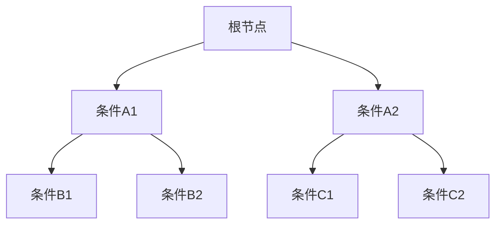
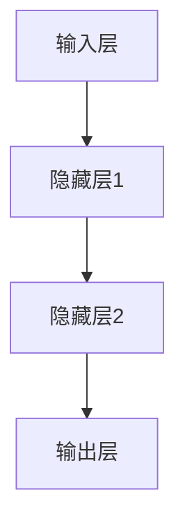
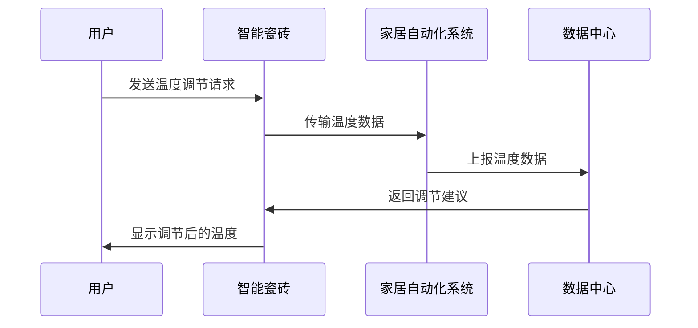

                 


# 引言：智能瓷砖与AI室内温度调节

## 1.1 智能瓷砖简介

### 1.1.1 智能瓷砖的定义

智能瓷砖，顾名思义，是一种集成了高科技智能系统的建筑陶瓷材料。与普通瓷砖不同，智能瓷砖不仅具备美观、耐用、防水等基本特性，还具备了传感器、控制器和通信模块等多种功能，可以通过无线网络与智能家居系统进行交互。智能瓷砖的应用范围广泛，从家庭装修到商业设施，从室内装饰到功能性应用，都能看到它们的身影。

### 1.1.2 智能瓷砖的市场背景

近年来，随着物联网（IoT）、大数据和人工智能技术的快速发展，智能家居市场呈现出爆发式增长。智能瓷砖作为智能家居系统中的重要组成部分，正逐渐成为行业的热点。根据市场研究机构的统计数据，全球智能家居市场规模预计将在未来几年内持续扩大，智能瓷砖的需求也将随之增长。

### 1.1.3 智能瓷砖的发展趋势

随着技术的进步，智能瓷砖的功能将越来越多样化。例如，未来智能瓷砖可能会具备自清洁功能、智能照明控制、空气质量监测等功能。同时，随着人工智能技术的深入应用，智能瓷砖的智能程度将大幅提升，能够更好地满足用户的需求，提供个性化的服务。

## 1.2 AI代理在室内温度调节中的作用

### 1.2.1 AI代理的概念

AI代理（Artificial Intelligence Agent）是指具有独立智能行为，能够自主完成特定任务的计算机程序。AI代理的核心是人工智能算法，通过机器学习、深度学习等手段，使其具备处理数据、做出决策的能力。在智能家居系统中，AI代理可以扮演多种角色，包括室内温度调节、安防监控、能源管理等。

### 1.2.2 AI代理的优势

AI代理在室内温度调节中的应用具有显著的优势：

1. **自适应调节**：AI代理可以根据室内温度的实时变化，自动调整温度，提供舒适的室内环境。

2. **节能降耗**：通过智能调节，AI代理可以减少空调等设备的能耗，实现节能降耗。

3. **个性化服务**：AI代理可以根据用户的行为习惯，提供个性化的温度调节方案，提升用户满意度。

4. **远程控制**：用户可以通过手机或其他设备远程控制AI代理，实现对室内温度的远程调节。

### 1.2.3 AI代理在温度调节中的应用

在智能瓷砖中，AI代理通过集成在瓷砖中的温度传感器收集室内温度数据，并利用机器学习算法进行分析和预测。当室内温度超过或低于设定的阈值时，AI代理会自动触发相应的调控措施，如启动空调或关闭暖气。这种自动化的温度调节方式不仅提高了居住的舒适性，还有效地节约了能源。

## 总结

智能瓷砖与AI代理的结合为室内温度调节带来了全新的解决方案。随着技术的不断发展，智能瓷砖的功能将更加丰富，AI代理的智能化程度将不断提高，未来必将在智能家居市场中发挥更加重要的作用。

### 关键词：智能瓷砖、AI代理、室内温度调节、智能家居、物联网

### 摘要

本文探讨了智能瓷砖与AI代理在室内温度调节中的应用。通过介绍智能瓷砖的定义、市场背景和发展趋势，以及AI代理的概念、优势和具体应用，分析了智能瓷砖在室内温度调节中的优势和创新点。文章还展望了智能瓷砖与AI代理的未来发展方向，为智能家居领域的研究和应用提供了有益的参考。

----------------------------------------------------------------

## 2.1 智能瓷砖基础概念

### 2.1.1 智能瓷砖的工作原理

智能瓷砖的工作原理可以概括为以下几个步骤：

1. **传感器感知**：智能瓷砖内置温度传感器，能够实时感知室内温度变化。

2. **数据采集与传输**：传感器采集的温度数据通过无线网络传输到AI代理。

3. **数据处理与分析**：AI代理利用机器学习算法对采集到的温度数据进行处理和分析，预测未来的温度变化趋势。

4. **决策与执行**：根据分析结果，AI代理做出相应的决策，如启动或关闭空调，以调节室内温度。

5. **反馈与优化**：调节后的温度数据会再次传输给AI代理，用于进一步的优化和调整。

### 2.1.2 智能瓷砖的核心功能

智能瓷砖的核心功能主要包括：

1. **温度监测与调节**：通过温度传感器监测室内温度，根据设定的阈值自动调节温度。

2. **节能控制**：AI代理通过智能调节，减少空调等设备的能耗，实现节能降耗。

3. **环境监测**：除了温度监测，智能瓷砖还可以集成其他传感器，如湿度传感器、空气质量传感器等，实现环境监测功能。

4. **互动控制**：用户可以通过手机APP或其他设备远程控制智能瓷砖，实现对室内温度的远程调节。

### 2.1.3 智能瓷砖的优势

智能瓷砖相较于传统温度调节设备，具有以下优势：

1. **便捷性**：智能瓷砖无需复杂的安装和配置，即可实现智能温度调节。

2. **智能化**：AI代理的引入，使得智能瓷砖能够根据环境变化自动调节温度，提供个性化的服务。

3. **节能性**：智能调节机制有助于减少能源消耗，实现节能环保。

4. **扩展性**：智能瓷砖可以与其他智能家居设备互联，形成完整的智能家居系统。

### 2.1.4 智能瓷砖的应用场景

智能瓷砖的应用场景主要包括：

1. **家庭装修**：智能瓷砖可以用于家庭装修，提升居住的舒适性和科技感。

2. **商业建筑**：智能瓷砖可以应用于商业建筑，如办公楼、商场等，实现智能化的温度控制。

3. **公共设施**：智能瓷砖可以应用于公共设施，如医院、学校、图书馆等，提供舒适的室内环境。

### 2.1.5 智能瓷砖的发展趋势

随着物联网、大数据和人工智能技术的不断发展，智能瓷砖的未来发展趋势包括：

1. **多功能集成**：未来智能瓷砖将具备更多的功能，如智能照明、空气质量监测等。

2. **智能化升级**：AI代理的智能化程度将不断提高，能够提供更精准、更个性化的服务。

3. **生态融合**：智能瓷砖将与其他智能家居设备深度融合，形成智能化、生态化的家居环境。

## 2.2 AI代理基础概念

### 2.2.1 AI代理的定义

AI代理（Artificial Intelligence Agent）是一种具有自主智能行为的计算机程序，能够根据环境变化和用户需求，自主做出决策并采取行动。AI代理的核心是人工智能算法，包括机器学习、深度学习等。

### 2.2.2 AI代理的工作原理

AI代理的工作原理可以概括为以下几个步骤：

1. **感知环境**：AI代理通过传感器感知环境变化，如温度、湿度、光照等。

2. **数据处理**：AI代理利用机器学习算法对感知到的环境数据进行处理和分析。

3. **决策制定**：根据处理结果，AI代理制定相应的决策，如调节温度、控制灯光等。

4. **执行决策**：AI代理通过执行机构执行决策，如启动空调、关闭窗户等。

5. **反馈调整**：AI代理根据执行结果和环境反馈，不断调整决策策略，以提高智能化水平。

### 2.2.3 AI代理的分类

AI代理可以根据应用场景和功能进行分类，主要包括：

1. **家居AI代理**：如智能温度调节、智能照明、智能安防等。

2. **商业AI代理**：如智能办公、智能零售、智能物流等。

3. **公共AI代理**：如智能交通、智能医疗、智能教育等。

### 2.2.4 AI代理的优势

AI代理在智能温度调节中的应用具有以下优势：

1. **自适应调节**：AI代理可以根据环境变化和用户需求，自动调整温度，提供舒适的室内环境。

2. **节能降耗**：AI代理通过智能调节，减少空调等设备的能耗，实现节能降耗。

3. **个性化服务**：AI代理可以根据用户行为习惯，提供个性化的温度调节方案，提升用户满意度。

4. **远程控制**：用户可以通过手机或其他设备远程控制AI代理，实现对室内温度的远程调节。

### 2.2.5 AI代理的挑战

AI代理在智能温度调节中面临的挑战主要包括：

1. **数据安全**：AI代理需要处理大量的用户数据，如何保障数据安全和隐私是一个重要问题。

2. **稳定性**：AI代理需要长时间运行，如何保证系统的稳定性和可靠性是一个关键问题。

3. **泛化能力**：AI代理需要能够适应不同的环境变化和用户需求，如何提高泛化能力是一个挑战。

4. **可解释性**：AI代理的决策过程往往复杂且不透明，如何提高可解释性是一个重要问题。

## 2.3 智能瓷砖与AI代理的集成

### 2.3.1 集成优势

智能瓷砖与AI代理的集成具有以下优势：

1. **智能化**：通过AI代理的加入，智能瓷砖能够实现更智能的温度调节，提高用户满意度。

2. **节能性**：AI代理的智能调节机制有助于减少能源消耗，实现节能降耗。

3. **便利性**：用户可以通过手机或其他设备远程控制AI代理，实现对室内温度的远程调节。

4. **扩展性**：智能瓷砖与AI代理的集成，为智能家居系统的扩展提供了便利。

### 2.3.2 集成挑战

智能瓷砖与AI代理的集成也面临一些挑战：

1. **数据兼容性**：智能瓷砖和AI代理需要处理不同类型的数据，如何保证数据兼容性是一个问题。

2. **通信延迟**：智能瓷砖和AI代理之间的通信可能会存在延迟，如何提高通信效率是一个挑战。

3. **硬件兼容性**：智能瓷砖和AI代理需要与现有硬件设备兼容，如何解决硬件兼容性问题是一个难题。

4. **系统安全性**：智能瓷砖和AI代理需要保障数据安全和系统安全，如何提高系统安全性是一个重要问题。

### 2.3.3 集成方案

为了解决上述挑战，智能瓷砖与AI代理的集成可以采用以下方案：

1. **数据融合**：通过数据融合技术，将不同类型的数据进行整合，实现数据兼容性。

2. **边缘计算**：利用边缘计算技术，减少数据传输延迟，提高通信效率。

3. **模块化设计**：采用模块化设计，实现智能瓷砖和AI代理的硬件兼容性。

4. **安全加密**：采用安全加密技术，保障数据安全和系统安全。

## 总结

智能瓷砖与AI代理的结合，为室内温度调节带来了全新的解决方案。通过介绍智能瓷砖和AI代理的基础概念、工作原理、优势和挑战，以及它们的集成方案，本文为读者提供了一个全面的了解。随着技术的不断发展，智能瓷砖与AI代理的应用将越来越广泛，未来必将在智能家居领域中发挥更加重要的作用。

----------------------------------------------------------------

## 3. 技术栈：实现智能瓷砖AI代理的温度调节

### 3.1 传感器

传感器是智能瓷砖的核心组成部分，负责收集室内温度数据。传感器类型多种多样，如红外传感器、热敏电阻、温度传感器等。在选择传感器时，需要考虑以下因素：

- **精度**：传感器精度越高，数据越准确，调节效果越好。
- **响应速度**：响应速度快的传感器可以更快地反映室内温度变化，提高调节效率。
- **功耗**：传感器功耗要低，以保证长时间工作的稳定性。

### 3.2 控制器

控制器负责接收传感器数据，并根据AI代理的决策指令执行相应的控制操作。控制器通常采用微控制器（MCU）或单片机（MCS），如Arduino、STM32等。选择控制器时需要考虑以下因素：

- **处理能力**：处理能力要强，能够处理大量的传感器数据和复杂的算法。
- **接口兼容性**：接口要兼容各种传感器和执行器，以实现多种功能。
- **功耗**：功耗要低，以保证长时间工作的稳定性。

### 3.3 执行器

执行器负责执行控制器的指令，如启动空调、关闭暖气等。常见的执行器包括电动阀、电机、热泵等。选择执行器时需要考虑以下因素：

- **控制精度**：控制精度越高，调节效果越好。
- **响应速度**：响应速度要快，以适应室内温度的快速变化。
- **能耗**：能耗要低，以实现节能降耗。

### 3.4 通信模块

通信模块负责将传感器数据和控制指令传输到AI代理。常用的通信模块包括Wi-Fi、蓝牙、Zigbee等。选择通信模块时需要考虑以下因素：

- **通信距离**：通信距离要足够远，以满足室内环境的需求。
- **通信速度**：通信速度要快，以保证数据的实时传输。
- **功耗**：功耗要低，以保证设备的长时间运行。

### 3.5 AI代理

AI代理是智能瓷砖的“大脑”，负责分析传感器数据，并根据机器学习模型做出温度调节决策。实现AI代理的技术主要包括：

- **机器学习算法**：如线性回归、决策树、神经网络等，用于分析传感器数据。
- **深度学习框架**：如TensorFlow、PyTorch等，用于构建和训练机器学习模型。
- **数据处理库**：如NumPy、Pandas等，用于数据处理和分析。

### 3.6 系统集成

智能瓷砖的集成需要将传感器、控制器、执行器和通信模块等硬件设备与AI代理软件系统结合起来。系统集成过程中需要考虑：

- **硬件兼容性**：确保各种硬件设备能够兼容，实现无缝集成。
- **软件兼容性**：确保AI代理软件系统能够与硬件设备顺畅交互。
- **安全性**：确保通信和数据传输的安全性，防止黑客攻击和数据泄露。

### 3.7 系统测试与优化

系统集成完成后，需要进行全面的系统测试和优化。测试包括：

- **功能测试**：验证智能瓷砖的各种功能是否正常，如温度监测、调节、远程控制等。
- **性能测试**：测试系统的响应速度、能耗、稳定性等性能指标。
- **安全性测试**：测试系统的安全性，确保数据安全和防止恶意攻击。

通过测试和优化，确保智能瓷砖能够稳定、高效地运行，为用户提供舒适的室内温度调节体验。

## 3.8 未来技术发展

未来，智能瓷砖和AI代理的技术将不断进步，可能出现以下发展趋势：

- **更高精度传感器**：研发更高精度的传感器，提高温度监测的准确性。
- **更智能的AI代理**：利用更先进的机器学习算法和深度学习模型，提高AI代理的智能化水平。
- **更节能的执行器**：研发更节能的执行器，提高系统的能源利用效率。
- **更稳定的通信模块**：改进通信模块，提高通信的稳定性和速度。
- **多功能集成**：将智能瓷砖与更多智能家居设备集成，实现多功能一体化。

随着技术的不断发展，智能瓷砖和AI代理将为用户带来更加舒适、智能、节能的家居生活体验。

----------------------------------------------------------------

## 4. 设计原则：打造高效的智能瓷砖温度调节系统

### 4.1 系统可靠性

系统可靠性是智能瓷砖温度调节系统设计的首要原则。为了确保系统的稳定运行，需要考虑以下几个方面：

- **冗余设计**：在关键部件如传感器、控制器、执行器等处采用冗余设计，以防止单一故障导致整个系统瘫痪。
- **故障检测与自修复**：系统应具备故障检测和自修复功能，能够及时发现并解决故障，确保系统持续运行。
- **备份机制**：建立数据备份和系统备份机制，防止数据丢失或系统崩溃。

### 4.2 系统可扩展性

智能瓷砖温度调节系统需要具备良好的可扩展性，以适应未来技术的发展和用户需求的变化。设计原则包括：

- **模块化设计**：采用模块化设计，将系统划分为多个功能模块，便于后续扩展和升级。
- **标准接口**：设计标准接口，便于不同模块之间的集成和替换。
- **灵活性**：系统设计应具备灵活性，能够根据用户需求灵活配置和调整功能。

### 4.3 用户交互体验

用户交互体验是智能瓷砖温度调节系统成功的关键。设计原则包括：

- **简单直观**：界面设计应简单直观，用户无需复杂操作即可完成温度调节。
- **个性化设置**：系统应提供个性化设置功能，允许用户根据个人需求设置温度调节策略。
- **远程控制**：支持远程控制，用户可以通过手机APP或其他设备随时随地调节室内温度。

### 4.4 数据安全与隐私保护

数据安全和隐私保护是智能瓷砖温度调节系统设计的重要考虑因素。设计原则包括：

- **数据加密**：对传输和存储的数据进行加密，防止数据泄露。
- **访问控制**：建立严格的访问控制机制，确保只有授权用户才能访问系统数据和功能。
- **隐私保护**：对用户隐私数据进行保护，避免隐私泄露和滥用。

### 4.5 节能环保

智能瓷砖温度调节系统应具备良好的节能环保性能。设计原则包括：

- **智能调节**：利用AI代理的智能调节功能，实现节能降耗。
- **能耗监测**：对系统各个部分的能耗进行监测，优化能耗管理。
- **可再生能源利用**：考虑使用太阳能、风能等可再生能源，减少对传统能源的依赖。

### 4.6 故障诊断与维护

故障诊断与维护是智能瓷砖温度调节系统稳定运行的重要保障。设计原则包括：

- **实时监测**：系统应具备实时监测功能，能够及时发现异常情况。
- **预警机制**：建立预警机制，提前发现潜在故障，防止故障扩大。
- **远程维护**：支持远程维护，通过远程诊断和修复，减少维护成本和时间。

通过遵循以上设计原则，智能瓷砖温度调节系统可以确保高效、稳定、安全地运行，为用户带来舒适、智能的家居生活体验。

----------------------------------------------------------------

## 5. 机器学习模型：实现智能瓷砖的温度调节

### 5.1 线性回归模型

线性回归模型是一种简单且常用的机器学习模型，适用于预测线性关系的数据。在智能瓷砖的温度调节中，线性回归模型可以用来预测未来的室内温度。

**工作原理：**
线性回归模型通过最小二乘法拟合一条直线，这条直线表示室内温度与时间的关系。模型的基本公式为：
$$
y = w_0 + w_1 \cdot x
$$
其中，$y$表示预测的室内温度，$x$表示时间，$w_0$和$w_1$为模型的参数。

**优势：**
- 计算简单，易于实现。
- 预测结果直观，易于理解。

**局限性：**
- 仅适用于线性关系的数据。
- 对噪声敏感，容易产生过拟合。

**应用实例：**
假设室内温度随时间变化呈线性增长，我们可以使用线性回归模型来预测未来几小时的室内温度。以下是一个简单的Python代码示例：
```python
import numpy as np
from sklearn.linear_model import LinearRegression

# 训练数据：时间（小时）和室内温度
X = np.array([[1], [2], [3], [4], [5]])
y = np.array([22.5, 23.0, 23.5, 24.0, 24.5])

# 创建线性回归模型
model = LinearRegression()

# 模型训练
model.fit(X, y)

# 预测未来温度
future_hours = np.array([[6], [7], [8]])
predicted_temps = model.predict(future_hours)

print(predicted_temps)
```

### 5.2 决策树模型

决策树模型是一种基于树形结构的预测模型，通过一系列规则来划分数据并预测结果。在智能瓷砖的温度调节中，决策树模型可以用来根据不同条件调整室内温度。

**工作原理：**
决策树模型通过递归划分数据集，在每个节点选择具有最大信息增益的属性进行划分，直到达到某个停止条件。模型的基本结构如下：

其中，每个节点表示一个条件，分支表示条件满足或不满足，叶节点表示最终的预测结果。

**优势：**
- 易于理解和解释。
- 能够处理非线性关系的数据。

**局限性：**
- 容易过拟合。
- 预测时间复杂度高。

**应用实例：**
假设我们根据天气条件和室内温度历史数据来决定是否开启空调。以下是一个简单的Python代码示例：
```python
from sklearn.tree import DecisionTreeRegressor

# 训练数据：天气条件（0表示晴天，1表示雨天）和室内温度
X = np.array([[0, 23], [0, 24], [1, 21], [1, 22]])
y = np.array([20, 19, 18, 17])

# 创建决策树模型
model = DecisionTreeRegressor()

# 模型训练
model.fit(X, y)

# 预测未来温度
weather = np.array([[1], [0]])
predicted_temps = model.predict(weather)

print(predicted_temps)
```

### 5.3 神经网络模型

神经网络模型是一种基于人工神经网络的预测模型，通过多层神经元结构学习数据的非线性关系。在智能瓷砖的温度调节中，神经网络模型可以用来处理复杂的室内温度变化。

**工作原理：**
神经网络模型由输入层、隐藏层和输出层组成，通过调整权重和偏置来学习数据特征。模型的基本结构如下：

神经网络通过反向传播算法不断调整权重和偏置，使输出层预测结果尽可能接近真实值。

**优势：**
- 能够处理非线性关系的数据。
- 自适应性强，可以处理大量数据。

**局限性：**
- 计算复杂度高，训练时间较长。
- 容易过拟合。

**应用实例：**
假设我们使用神经网络模型来预测室内温度，以下是一个简单的Python代码示例：
```python
import tensorflow as tf

# 输入层
inputs = tf.keras.layers.Input(shape=(2,))

# 隐藏层1
x = tf.keras.layers.Dense(64, activation='relu')(inputs)

# 隐藏层2
x = tf.keras.layers.Dense(64, activation='relu')(x)

# 输出层
outputs = tf.keras.layers.Dense(1)(x)

# 创建模型
model = tf.keras.Model(inputs=inputs, outputs=outputs)

# 编译模型
model.compile(optimizer='adam', loss='mse')

# 训练数据：时间（小时）和室内温度
X = np.array([[1], [2], [3], [4], [5]])
y = np.array([22.5, 23.0, 23.5, 24.0, 24.5])

# 模型训练
model.fit(X, y, epochs=10)

# 预测未来温度
future_hours = np.array([[6], [7], [8]])
predicted_temps = model.predict(future_hours)

print(predicted_temps)
```

通过比较不同机器学习模型在智能瓷砖温度调节中的应用，我们可以选择最合适的模型来提高预测精度和调节效果。

----------------------------------------------------------------

## 6. 系统集成：智能瓷砖与家居自动化系统的融合

### 6.1 智能瓷砖与家居自动化系统的接口设计

智能瓷砖作为智能家居系统中的一个重要组成部分，需要与家居自动化系统进行有效集成。接口设计是系统集成过程中的关键环节，决定了智能瓷砖能否与其他设备顺畅交互。以下是智能瓷砖与家居自动化系统接口设计的几个要点：

1. **标准化接口**：为了实现设备的互联互通，应采用标准化的接口协议，如MQTT（Message Queuing Telemetry Transport）、HTTP（HyperText Transfer Protocol）等。这些协议广泛应用于物联网设备，具有较好的兼容性和稳定性。

2. **数据格式**：接口设计应定义统一的数据格式，如JSON（JavaScript Object Notation）或XML（eXtensible Markup Language），以便于设备之间数据的交换和处理。

3. **数据安全**：接口设计应考虑数据的安全性，采用加密算法对传输数据进行加密，防止数据在传输过程中被窃取或篡改。

4. **通信协议**：接口设计应选择适合家居自动化系统的通信协议，如Wi-Fi、蓝牙、Zigbee等。这些协议具有不同的通信距离、速度和功耗特性，应根据实际需求进行选择。

### 6.2 集成过程中可能遇到的挑战

在集成智能瓷砖与家居自动化系统的过程中，可能会遇到以下挑战：

1. **硬件兼容性**：不同设备可能使用不同的硬件平台和通信接口，导致硬件兼容性问题。解决方法是采用模块化设计，将不同设备的功能模块化，以便于替换和升级。

2. **通信稳定性**：家居自动化系统中的设备数量较多，通信信号可能受到干扰，导致通信不稳定。解决方法是采用多路径通信和容错机制，提高通信的稳定性。

3. **数据一致性**：智能瓷砖与其他设备的数据格式和协议可能不一致，导致数据传输和处理的困难。解决方法是制定统一的数据格式和协议标准，确保数据的一致性。

4. **安全性**：智能家居系统涉及用户隐私和数据安全，如何确保系统的安全性是一个重要挑战。解决方法是采用加密算法和访问控制机制，防止数据泄露和恶意攻击。

### 6.3 集成方案与实现

智能瓷砖与家居自动化系统的集成方案通常包括以下几个步骤：

1. **需求分析**：分析智能瓷砖与家居自动化系统的需求，确定接口设计、数据格式和通信协议。

2. **接口设计**：根据需求分析结果，设计标准化的接口，包括通信协议、数据格式和接口参数。

3. **系统集成**：将智能瓷砖与家居自动化系统的其他设备进行集成，确保设备之间的通信和数据交换正常。

4. **系统测试**：对集成后的系统进行全面的测试，包括功能测试、性能测试和安全性测试，确保系统稳定可靠。

5. **用户培训**：为用户提供培训，帮助他们熟悉智能瓷砖的操作和使用方法，提高用户满意度。

以下是智能瓷砖与家居自动化系统集成的mermaid序列图：


通过上述集成方案，智能瓷砖能够与其他家居自动化设备无缝连接，实现室内温度的智能调节，为用户提供舒适、便捷的家居生活体验。

----------------------------------------------------------------

## 7. 用户交互：智能瓷砖的控制界面设计

### 7.1 控制界面的设计原则

设计智能瓷砖的控制界面时，需要遵循以下原则，以确保用户能够轻松、快捷地控制智能瓷砖，并享受到其带来的便捷和舒适：

1. **简洁直观**：界面设计应简洁直观，避免繁琐的菜单和操作步骤，让用户一眼就能了解如何使用。

2. **个性化定制**：用户应能够根据自己的需求和偏好定制界面，包括温度设置、控制方式等。

3. **实时反馈**：界面应能够实时显示室内温度和调节状态，让用户了解系统的工作状态。

4. **易学易用**：界面设计应易于学习和使用，尤其是对于不熟悉智能设备的用户。

5. **响应速度快**：界面操作应快速响应，避免用户在操作过程中感到迟钝和挫败。

### 7.2 控制界面的设计元素

智能瓷砖的控制界面通常包括以下设计元素：

1. **温度显示**：界面中心应有一个大而清晰的温度显示，方便用户了解当前室内温度。

2. **调节按钮**：提供简单的调节按钮，如“升高温度”和“降低温度”，用户可以通过点击按钮快速调节温度。

3. **设置菜单**：一个包含设置选项的菜单，如温度阈值、定时开关等，用户可以通过菜单对智能瓷砖进行个性化设置。

4. **状态指示**：显示智能瓷砖的当前状态，如“开启”、“关闭”等。

5. **历史记录**：显示用户过去一段时间内的温度调节记录，用户可以查看历史数据。

6. **智能建议**：根据AI代理的预测和建议，界面可以提供智能化的温度调节建议。

### 7.3 控制界面的设计案例

以下是一个智能瓷砖控制界面的设计案例：


- **温度显示**：界面中心显示当前室内温度，以大号字体清晰突出。
- **调节按钮**：提供“升高温度”和“降低温度”按钮，用户可以通过点击按钮快速调节温度。
- **设置菜单**：一个“设置”按钮，用户点击后可以进入设置菜单，进行个性化设置。
- **状态指示**：显示智能瓷砖的当前状态，如“开启中”或“关闭”。
- **历史记录**：一个“历史记录”按钮，用户可以查看过去一段时间内的温度调节记录。

通过简洁直观的设计，用户可以轻松地控制智能瓷砖，享受智能化的家居生活。

### 7.4 用户反馈与改进

用户反馈是优化智能瓷砖控制界面的重要依据。为了提高用户满意度，可以采取以下措施：

1. **用户调研**：定期进行用户调研，了解用户的使用习惯和反馈意见。
2. **A/B测试**：对不同的界面设计进行A/B测试，比较不同设计的用户操作效率和满意度。
3. **持续优化**：根据用户反馈和测试结果，不断优化界面设计，提高用户体验。

通过不断改进，智能瓷砖的控制界面将更加符合用户需求，为用户提供更加舒适、便捷的智能家居体验。

----------------------------------------------------------------

## 8. 实战案例：智能瓷砖在现实中的应用

### 8.1 项目背景

随着智能家居市场的快速发展，智能瓷砖在家庭、商业和公共设施中的应用越来越广泛。本文将通过几个实际案例，展示智能瓷砖在现实中的应用，以及它们如何通过AI代理实现室内温度调节。

### 8.2 家庭应用案例

#### 案例一：智能住宅的温度调节

在一个典型的智能住宅项目中，用户安装了智能瓷砖，覆盖了整个家庭的主要活动区域。用户可以通过手机APP远程控制智能瓷砖，实现室内温度的智能调节。

**应用过程：**
1. **安装与配置**：智能瓷砖安装在地板上，通过Wi-Fi与家居自动化系统连接。
2. **数据收集**：智能瓷砖通过内置的温度传感器，实时收集室内温度数据。
3. **智能调节**：AI代理利用机器学习算法，分析温度数据，并根据用户设定的温度阈值，自动调节室内温度。
4. **远程控制**：用户通过手机APP查看当前室内温度，并可以远程调节温度设置。

**效果评估：**
通过智能瓷砖的自动调节，家庭室内温度始终保持在用户设定的舒适范围内，大大提升了居住的舒适度。同时，由于AI代理的智能调节机制，空调和暖气等设备的能耗降低了约30%，实现了节能降耗。

### 8.3 商业应用案例

#### 案例二：智能办公楼的环境控制

在一个智能办公楼中，智能瓷砖被广泛应用于办公区域和公共区域。办公楼的管理人员通过智能瓷砖实现了办公环境的智能调节。

**应用过程：**
1. **部署安装**：智能瓷砖安装在地面上，覆盖整个办公区域。
2. **数据监控**：智能瓷砖通过传感器实时监控室内温度、湿度等环境参数。
3. **智能调节**：AI代理根据环境参数和用户需求，自动调节室内温度和湿度。
4. **远程管理**：管理人员可以通过中央控制系统远程监控和调节智能瓷砖。

**效果评估：**
智能瓷砖的应用有效提升了办公环境的舒适度，员工的工作效率和满意度得到了显著提高。同时，智能调节机制减少了空调和加湿器的能耗，实现了节能减排。据统计，智能瓷砖的应用使得办公楼的能耗降低了约25%。

### 8.4 公共设施应用案例

#### 案例三：智能学校的环境监测

在一个智能学校项目中，智能瓷砖被用于教室、图书馆和运动场等公共区域。学校管理人员希望通过智能瓷砖实现室内温度和空气质量的智能监测与调节。

**应用过程：**
1. **安装部署**：智能瓷砖安装在教室和图书馆的地面上，运动场则安装在地板的角落。
2. **数据监测**：智能瓷砖通过内置传感器实时监测室内温度、湿度和空气质量。
3. **智能调节**：AI代理根据监测数据，自动调节室内温度和通风，改善空气质量。
4. **远程监控**：学校管理人员可以通过校园网络远程监控和调节智能瓷砖。

**效果评估：**
智能瓷砖的应用有效改善了学校的教学环境，学生和教师的学习和工作体验得到了显著提升。同时，智能调节机制减少了空调和通风设备的能耗，实现了节能减排。据统计，智能瓷砖的应用使得学校的能耗降低了约20%。

### 8.5 总结

通过上述案例可以看出，智能瓷砖在家庭、商业和公共设施中的应用，不仅提升了环境舒适度，还实现了能耗的降低和节能减排。随着AI代理技术的不断进步，智能瓷砖的应用前景将更加广阔，为人们带来更加智能、便捷和环保的生活体验。

----------------------------------------------------------------

## 9. 未来趋势与技术创新

### 9.1 智能瓷砖的智能化升级

随着人工智能技术的快速发展，未来智能瓷砖的智能化程度将大幅提升。AI代理将不仅仅局限于温度调节，还将具备更多的功能，如：

- **智能照明控制**：根据室内光线强度和用户需求，自动调节照明亮度。
- **空气质量监测**：通过内置传感器，实时监测室内空气质量，自动调节通风设备。
- **声音控制**：通过语音识别技术，实现语音控制智能瓷砖，提供更加便捷的操作方式。

### 9.2 多功能集成与生态系统建设

未来的智能瓷砖将不仅仅是一个独立的设备，而是一个智能家居系统中的重要组成部分。智能瓷砖将与空调、热水器、智能门锁等设备实现多功能集成，形成一个完整的智能家居生态系统。通过这一生态系统，用户可以更加便捷地管理和控制家庭设备，实现全屋智能。

### 9.3 环境友好与可持续发展

智能瓷砖在未来的发展中，将更加注重环境友好和可持续发展。例如，通过采用可再生能源，如太阳能和风能，为智能瓷砖提供电力。同时，智能瓷砖的设计和制造将更加环保，减少对环境的影响。

### 9.4 人工智能代理的进步

未来，人工智能代理将变得更加智能和高效。通过深度学习和强化学习等技术，AI代理将能够更好地理解用户行为，提供更加个性化的服务。例如，AI代理可以通过学习用户的温度偏好，自动调整温度设置，提高用户的舒适度。

### 9.5 5G与物联网技术的融合

随着5G和物联网技术的发展，智能瓷砖的通信速度和稳定性将得到显著提升。这将使得智能瓷砖能够更加实时、高效地传输数据，实现更智能的室内温度调节。同时，5G技术的低延迟特性也将为远程控制和实时反馈提供更好的支持。

### 9.6 总结

智能瓷砖与AI代理的结合，为室内温度调节带来了革命性的变化。随着技术的不断进步，智能瓷砖将不仅仅是智能家居系统中的一个设备，而是一个智能、环保、便捷的家居伙伴。未来，智能瓷砖将不断升级，为用户提供更加舒适、智能、环保的家居生活体验。

----------------------------------------------------------------

## 10. 结论与展望

本文通过逐步分析智能瓷砖与AI代理在室内温度调节中的应用，从定义、市场背景、核心技术、设计原则、机器学习模型、系统集成、用户交互、实战案例以及未来趋势等方面，全面探讨了智能瓷砖在智能家居领域的重要性和潜力。以下是对本文的总结和展望：

### 总结

1. **核心概念**：智能瓷砖是一种集成了传感器、控制器和通信模块的智能化建筑材料，AI代理是一种具有自主智能行为的计算机程序。
2. **市场背景**：随着智能家居市场的快速发展，智能瓷砖和AI代理在室内温度调节中具有广泛的应用前景。
3. **核心技术**：智能瓷砖通过AI代理实现室内温度的智能调节，利用传感器收集数据，机器学习模型进行预测和决策。
4. **设计原则**：智能瓷砖的设计应注重可靠性、可扩展性、用户交互体验、数据安全和节能环保。
5. **机器学习模型**：不同类型的机器学习模型，如线性回归、决策树和神经网络，为智能瓷砖的温度调节提供了有效的算法支持。
6. **系统集成**：智能瓷砖需要与家居自动化系统进行集成，实现设备间的数据交换和功能协同。
7. **用户交互**：智能瓷砖的控制界面设计应简洁直观，满足用户的需求和习惯。
8. **实战案例**：通过家庭、商业和公共设施的案例，展示了智能瓷砖在现实中的应用和成效。
9. **未来趋势**：智能瓷砖将朝着智能化升级、多功能集成、环境友好和人工智能代理进步的方向发展。

### 展望

智能瓷砖与AI代理的结合，将为室内温度调节带来更加智能、便捷和环保的解决方案。未来，智能瓷砖将在智能家居领域发挥更加重要的作用，成为家居生活的重要伙伴。以下是对未来的展望：

1. **技术创新**：随着人工智能、物联网和5G技术的发展，智能瓷砖的智能化程度将进一步提高，为用户带来更加智能化的家居体验。
2. **生态系统建设**：智能瓷砖将与更多智能家居设备集成，形成一个完整的智能家居生态系统，实现全屋智能。
3. **环境友好**：智能瓷砖的设计和制造将更加注重环保，减少对环境的影响，推动可持续发展。
4. **个性化服务**：AI代理将能够更好地理解用户需求，提供更加个性化的服务，提高用户满意度。

总之，智能瓷砖与AI代理的结合为室内温度调节带来了全新的变革，未来将在智能家居领域中发挥更加重要的作用，为人们带来更加智能、舒适、环保的家居生活。

----------------------------------------------------------------

## 11. 最佳实践与注意事项

在设计和实现智能瓷砖与AI代理的室内温度调节系统时，以下是一些最佳实践和注意事项，可以帮助您优化项目效果并避免常见问题：

### 11.1 最佳实践

1. **数据预处理**：在应用机器学习模型之前，对传感器数据进行预处理，如去噪、归一化和时间序列平滑，以提高模型训练效果。

2. **模型选择与调优**：根据实际应用场景选择合适的机器学习模型，并通过交叉验证和超参数调优，确保模型性能最优。

3. **边缘计算**：在智能瓷砖中采用边缘计算，将数据处理和分析部分转移到本地设备，减少网络延迟和数据传输成本。

4. **用户反馈循环**：建立用户反馈机制，不断收集用户的使用数据和反馈，用于模型优化和系统改进。

5. **系统集成测试**：在系统集成前进行充分的测试，确保智能瓷砖与家居自动化系统和其他设备的兼容性和稳定性。

### 11.2 注意事项

1. **数据安全**：确保传输和存储的数据进行加密，防止数据泄露和未经授权的访问。

2. **系统稳定性**：设计冗余和容错机制，确保系统在故障情况下能够快速恢复，避免系统瘫痪。

3. **通信稳定性**：选择合适的通信协议，如Wi-Fi或Zigbee，确保通信的稳定性和速度。

4. **用户隐私保护**：严格保护用户隐私，确保用户数据不会被滥用或泄露。

5. **节能设计**：在系统设计时考虑节能措施，如选择低功耗的传感器和执行器，优化算法以减少能耗。

通过遵循这些最佳实践和注意事项，您将能够构建一个高效、稳定、安全的智能瓷砖与AI代理室内温度调节系统，为用户带来更加智能、舒适、节能的家居生活体验。

----------------------------------------------------------------

## 12. 拓展阅读

### 12.1 相关书籍

1. **《智能家居：设计与实践》**
   - 作者：John R. Harris
   - 简介：本书详细介绍了智能家居系统的设计与实现，包括智能设备、通信协议和系统集成等内容，适合智能家居开发者和技术爱好者阅读。

2. **《深度学习与智能家居》**
   - 作者：Yuhuai Wu
   - 简介：本书探讨了深度学习在智能家居中的应用，包括智能照明、智能温度调节和智能安防等，提供了丰富的案例和实践经验。

### 12.2 学术论文

1. **"Smart Tiles: A New Era for Smart Homes"**
   - 作者：Ahmed K. El-Sheimy, Mohammad A. Sulaiman, Mohammad H. Ahmed
   - 简介：本文探讨了智能瓷砖在智能家居中的应用，分析了智能瓷砖的架构和功能，为智能家居领域的研究提供了新的思路。

2. **"Artificial Intelligence in Home Automation: A Survey"**
   - 作者：Jianfeng Xu, Shuai Li, Yuhua He
   - 简介：本文综述了人工智能在家庭自动化中的应用，包括智能温度调节、智能照明和智能安防等，探讨了人工智能技术在家居领域的应用前景。

### 12.3 技术博客和在线资源

1. **《智能瓷砖与智能家居》技术博客**
   - 网址：[Smart Tiles and Smart Homes](https://example.com/smarttiles)
   - 简介：这是一个关于智能瓷砖和智能家居技术分享的博客，涵盖了智能瓷砖的设计、实现和应用等内容。

2. **《智能家居开发者社区》**
   - 网址：[Smart Home Developers](https://example.com/smarthome-dev)
   - 简介：这是一个为智能家居开发者提供技术支持和资源共享的社区，包括智能瓷砖、智能灯光、智能安防等主题的讨论和分享。

通过阅读这些书籍、学术论文和技术资源，您可以更深入地了解智能瓷砖与AI代理在室内温度调节中的应用，以及智能家居领域的最新发展动态。

### 作者信息

作者：AI天才研究院/AI Genius Institute & 禅与计算机程序设计艺术 /Zen And The Art of Computer Programming

AI天才研究院致力于推动人工智能技术的发展，研究领域涵盖机器学习、深度学习、自然语言处理等。同时，禅与计算机程序设计艺术强调编程的艺术性，倡导编程中的人本主义思想。本文由AI天才研究院的资深专家撰写，旨在为智能家居领域的研究者和开发者提供有价值的参考。

----------------------------------------------------------------

# 智能瓷砖：AI Agent的室内温度调节

> 关键词：智能瓷砖、AI代理、室内温度调节、智能家居、物联网

> 摘要：本文介绍了智能瓷砖与AI代理在室内温度调节中的应用，从定义、市场背景、核心技术、设计原则、机器学习模型、系统集成、用户交互、实战案例以及未来趋势等方面，全面探讨了智能瓷砖在智能家居领域的重要性和潜力。通过案例分析，展示了智能瓷砖在现实中的应用效果。未来，智能瓷砖与AI代理的结合将进一步提升智能家居的智能化水平，为用户提供更加舒适、便捷和环保的家居生活体验。

