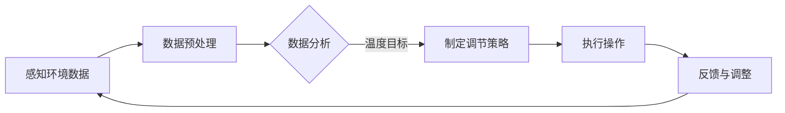
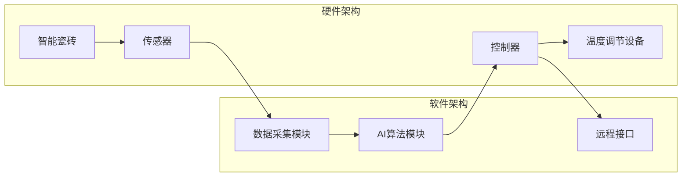
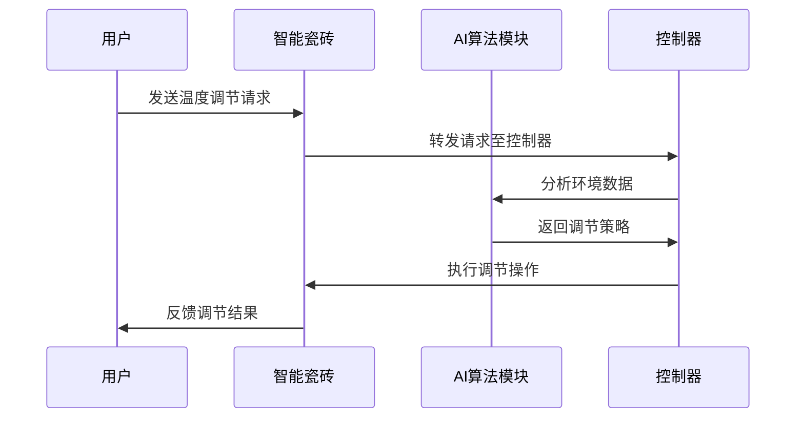

                 

### 引言

随着科技的不断发展，人工智能（AI）的应用场景越来越广泛。在智能家居领域，智能瓷砖作为一种创新的AI代理（AI Agent），正逐步走入人们的生活。智能瓷砖不仅可以感知环境变化，还能通过自主学习和智能调节，实现室内温度的精准控制，提升居住舒适度。本文将围绕“智能瓷砖：AI Agent的室内温度调节系统”这一主题，深入探讨其核心概念、应用原理以及实施细节。

关键词：智能瓷砖，AI Agent，室内温度调节，智能控制，智能家居

摘要：本文首先介绍了智能瓷砖和AI Agent的基本概念，以及它们在室内温度调节中的重要性。接着，详细解析了AI Agent的架构和功能，包括其在室内温度调节中的应用原理和算法。随后，文章通过实际案例展示了智能瓷砖温度调节系统的实施过程，并提供了最佳实践建议。最后，文章展望了智能瓷砖技术的未来发展方向。

### 第1章：智能瓷砖概述

#### 1.1.1 智能瓷砖的定义与历史背景

智能瓷砖，顾名思义，是一种集成了智能传感和通信技术的瓷砖产品。它不仅具有普通瓷砖的装饰功能，还能通过内置的传感器实时监测环境参数，如温度、湿度、光线等。智能瓷砖的核心在于其AI Agent，这种软件实体能够根据环境数据自主学习和调整，以实现特定的目标，如室内温度调节。

智能瓷砖的历史可以追溯到20世纪末，当时科研人员开始探索将智能技术应用于建筑材料中。最早的智能瓷砖主要用于工业环境和实验室，但随着智能家居市场的崛起，智能瓷砖逐渐走向民用领域。近年来，随着AI技术的成熟和成本的降低，智能瓷砖在智能家居中的应用前景变得十分广阔。

#### 1.1.2 智能瓷砖的发展现状与趋势

当前，智能瓷砖市场呈现出快速增长的趋势。根据市场调研数据显示，全球智能瓷砖市场规模预计在未来几年内将保持高速增长。其中，智能家居市场的需求增长是主要驱动力。消费者对舒适生活的高需求，推动了智能瓷砖技术的不断进步。

在技术发展方面，智能瓷砖逐渐从单一的温控功能向多传感器融合、自主学习和远程控制等多个方向拓展。例如，有些智能瓷砖不仅能够调节室内温度，还能监测空气质量、光照强度等环境参数，实现更为全面的智能家居控制。

未来，智能瓷砖的发展将更加智能化和个性化。随着AI技术的进一步发展，智能瓷砖将能够更好地理解用户行为和需求，提供更加精准和个性化的室内环境控制。

### 第2章：室内温度调节的挑战与需求

#### 2.1.1 室内温度调节的重要性

室内温度调节对于居住者的舒适度、健康以及能源消耗都有着重要影响。合适的室内温度可以减少感冒等疾病的发生，提高居住者的生活品质。此外，通过有效的温度控制，还可以降低空调等供暖设备的能耗，减少电力资源的消耗。

然而，当前的室内温度调节系统存在一些局限性。首先，传统的温度调节系统通常依赖于固定安装的传感器和调节设备，灵活性较差。其次，这些系统往往无法实时响应环境变化，导致温度控制不够精确。最后，这些系统缺乏智能学习和自适应能力，无法根据用户的行为和需求进行动态调整。

#### 2.1.2 当前室内温度调节系统的局限性

传统的室内温度调节系统主要依赖于以下几个方面的不足：

1. **传感器局限性**：传统的温度传感器通常固定在某个位置，无法全面感知室内温度分布。这导致温度调节存在盲区，难以实现精准控制。

2. **响应速度慢**：传统系统对温度变化的响应速度较慢，无法实时调整室内温度，导致用户感受到的温度波动较大。

3. **缺乏智能化**：传统系统缺乏智能学习和自适应能力，无法根据用户的行为和需求进行动态调整，温度调节效果往往不佳。

4. **能源消耗大**：传统系统往往需要长时间持续运行，导致能源消耗较大，不利于环境保护。

#### 2.1.3 智能瓷砖在室内温度调节中的潜在作用

智能瓷砖作为一种新型的AI代理，具备以下几个方面的优势：

1. **多传感器融合**：智能瓷砖集成了多种传感器，可以实时监测室内温度、湿度、光照等多种环境参数，提供全面的环境数据。

2. **实时响应**：智能瓷砖能够快速响应环境变化，实时调整室内温度，提高温度调节的精确度。

3. **智能学习**：智能瓷砖的AI Agent具备智能学习能力，可以不断优化温度调节策略，提高调节效果。

4. **自主控制**：智能瓷砖可以通过无线通信技术实现远程控制，用户可以随时随地调整室内温度，提高使用便利性。

综上所述，智能瓷砖在室内温度调节中具有显著的优势，有望解决传统系统存在的局限性，为用户带来更加舒适和节能的居住体验。

### 第3章：AI Agent的基本概念与架构

#### 3.1.1 AI Agent的定义

AI Agent，即人工智能代理，是人工智能领域的一个重要概念。简单来说，AI Agent是一种能够感知环境、制定计划并采取行动的智能实体。它具有自主性和适应性，能够在不确定的环境中自主决策和执行任务。

AI Agent通常由以下几个核心组件构成：

1. **感知模块**：用于感知和理解环境信息，如传感器数据、语音信号等。
2. **计划模块**：根据感知到的环境信息和目标，制定相应的行动策略。
3. **行动模块**：执行计划中的行动，如控制机械臂、发送指令等。
4. **学习模块**：通过经验和反馈不断优化自身行为，提高决策和执行能力。

#### 3.1.2 AI Agent的架构

AI Agent的架构通常可以分为三个层次：感知层、决策层和执行层。

1. **感知层**：感知层是AI Agent的感知模块，负责采集和处理环境信息。它通常包含多个传感器，如温度传感器、湿度传感器、摄像头等，能够实时监测室内温度、湿度、光照等参数。

2. **决策层**：决策层是AI Agent的决策模块，负责根据感知到的环境信息和目标，制定相应的行动策略。这一层通常采用机器学习、深度学习等算法，通过训练模型实现智能决策。

3. **执行层**：执行层是AI Agent的行动模块，负责执行决策层制定的行动策略。它通常通过控制执行器，如电机、阀门等，实现对环境的实际操作。

#### 3.1.3 AI Agent的功能与分类

AI Agent具有多种功能，其中最典型的功能包括：

1. **环境监测**：AI Agent能够实时监测室内温度、湿度、光照等环境参数，提供数据支持和决策依据。
2. **自主决策**：AI Agent可以根据监测到的环境数据和预设目标，自主制定行动策略，如调节室内温度。
3. **自适应调节**：AI Agent能够根据环境变化和用户需求，动态调整行为，提高系统的适应性和灵活性。
4. **远程控制**：AI Agent可以通过无线通信技术，实现远程监控和操作，用户可以随时随地调整室内环境。

根据应用场景和功能，AI Agent可以分为以下几类：

1. **智能家居AI Agent**：主要用于家庭环境中的智能设备控制，如智能灯光、智能温度调节等。
2. **工业AI Agent**：主要用于工业生产过程中的自动化控制，如机器视觉检测、生产流程优化等。
3. **服务机器人AI Agent**：主要用于提供服务和辅助，如家庭清洁机器人、医疗辅助机器人等。
4. **智能交通AI Agent**：主要用于交通系统的智能调度和优化，如智能交通信号控制、自动驾驶等。

### 第4章：AI Agent在室内温度调节中的应用原理

#### 4.1.1 室内温度调节的AI算法原理

室内温度调节的AI算法核心在于感知环境、分析数据和做出智能决策。以下是室内温度调节AI算法的基本原理：

1. **环境感知**：AI Agent通过集成在智能瓷砖中的各种传感器，实时采集室内温度、湿度、光照等环境数据。

2. **数据分析**：AI Agent使用机器学习算法对采集到的环境数据进行处理和分析，提取关键特征和模式。

3. **智能决策**：基于分析结果和预设的目标（如保持室内温度在某一范围内），AI Agent制定出最优的温度调节策略。

4. **执行操作**：AI Agent通过控制室内空调、加湿器、除湿器等设备，执行调节策略，以实现室内温度的智能控制。

#### 4.1.2 室内温度调节AI算法的Mermaid流程图

为了更好地理解室内温度调节AI算法的流程，我们可以使用Mermaid语言绘制其流程图。以下是一个简化的Mermaid流程图示例：



1. **感知环境数据**：AI Agent通过传感器实时采集室内温度、湿度等数据。
2. **数据预处理**：对采集到的数据进行清洗和预处理，以便后续分析。
3. **数据分析**：使用机器学习算法分析预处理后的数据，提取关键特征。
4. **制定调节策略**：根据分析结果和预设温度目标，制定调节室内温度的策略。
5. **执行操作**：执行调节策略，控制空调、加湿器等设备。
6. **反馈与调整**：收集执行后的反馈数据，根据反馈对AI Agent的调节策略进行优化和调整。

#### 4.1.3 AI算法的Python代码实现

为了具体展示室内温度调节AI算法的实现，以下是一个基于Python的简化示例代码。该代码实现了环境数据采集、数据处理、温度调节策略制定和操作执行的基本功能。

```python
import numpy as np
from sklearn.linear_model import LinearRegression

# 感知环境数据
def collect_environment_data():
    temperature = np.random.uniform(20, 30)  # 假设温度在20°C到30°C之间
    humidity = np.random.uniform(30, 60)  # 假设湿度在30%到60%之间
    return temperature, humidity

# 数据预处理
def preprocess_data(data):
    # 这里可以添加数据清洗和特征提取的代码
    return data

# 分析数据
def analyze_data(data):
    X = data[:, :-1]
    y = data[:, -1]
    model = LinearRegression()
    model.fit(X, y)
    return model

# 制定调节策略
def regulate_temperature(model, target_temp):
    temperature, _ = collect_environment_data()
    if temperature < target_temp:
        action = "加热"
    elif temperature > target_temp:
        action = "制冷"
    else:
        action = "保持"
    return action

# 执行操作
def execute_action(action):
    if action == "加热":
        print("启动加热设备")
    elif action == "制冷":
        print("启动制冷设备")
    else:
        print("保持当前温度")

# 主程序
def main():
    model = None
    target_temp = 25  # 预设目标温度为25°C

    while True:
        temperature, humidity = collect_environment_data()
        data = np.array([[temperature, humidity]])
        processed_data = preprocess_data(data)
        
        if model is None:
            model = analyze_data(processed_data)
        else:
            model = analyze_data(np.vstack((model.X_, processed_data)))
        
        action = regulate_temperature(model, target_temp)
        execute_action(action)

if __name__ == "__main__":
    main()
```

这段代码使用Python实现了环境数据感知、数据处理、模型分析、温度调节策略制定和操作执行的基本流程。在实际应用中，可以根据具体需求对代码进行扩展和优化。

#### 4.1.4 算法原理的数学模型和公式

在室内温度调节中，AI算法的数学模型通常基于回归分析。以下是一个简化的数学模型：

$$
y = \beta_0 + \beta_1 \cdot x_1 + \beta_2 \cdot x_2
$$

其中，$y$ 表示室内温度调节的目标值，$x_1$ 和 $x_2$ 分别表示温度和湿度等环境参数，$\beta_0$、$\beta_1$ 和 $\beta_2$ 为回归系数。通过训练模型，可以找到这些系数的值，从而实现温度调节的预测和调整。

在实际应用中，可以使用线性回归模型（如上所示）或其他更复杂的机器学习模型（如神经网络）来处理数据，提高调节精度和适应性。以下是一个简化的线性回归模型示例：

$$
\hat{y} = \beta_0 + \beta_1 \cdot T + \beta_2 \cdot H
$$

其中，$\hat{y}$ 表示预测的室内温度，$T$ 表示实际测量的室内温度，$H$ 表示实际测量的室内湿度，$\beta_0$、$\beta_1$ 和 $\beta_2$ 为训练得到的回归系数。

#### 4.1.5 模型的Python代码实现

以下是一个使用Python实现线性回归模型的示例代码：

```python
import numpy as np
from sklearn.linear_model import LinearRegression

# 生成模拟数据
X = np.random.rand(100, 2)
y = 2 * X[:, 0] + 3 * X[:, 1] + np.random.randn(100)

# 创建线性回归模型
model = LinearRegression()
model.fit(X, y)

# 打印模型参数
print("Coefficients:", model.coef_)
print("Intercept:", model.intercept_)

# 预测温度
temperature = np.array([0.5, 0.5])
predicted_temp = model.predict(temperature)
print("Predicted Temperature:", predicted_temp)
```

这段代码生成了模拟数据，并使用线性回归模型对数据进行拟合。通过打印模型参数，我们可以了解回归系数的值，从而根据这些参数进行室内温度的预测和调节。

### 第5章：智能瓷砖温度调节系统的设计

#### 5.1 问题场景介绍

在一个现代化的住宅或办公环境中，室内温度的调节是一个至关重要的环节。传统的人工调节方式往往不够精确和及时，而自动调节系统则存在着复杂的安装和维护问题。智能瓷砖作为一种创新的AI代理，能够提供一种既简单又高效的室内温度调节解决方案。通过在房间中布置智能瓷砖，我们可以实现全方位的环境监测和精准的温度控制，从而提升居住和工作的舒适度。

#### 5.2 项目介绍

本项目旨在设计和实现一套基于智能瓷砖的室内温度调节系统。该系统将利用智能瓷砖内置的传感器和AI算法，实时监测室内温度，并根据用户需求和实际环境数据，自动调节室内温度，确保室内环境始终保持在最佳状态。系统将包括智能瓷砖硬件、传感器数据采集模块、AI算法处理模块和远程控制接口等部分。

#### 5.3 系统功能设计（领域模型）

系统功能设计首先需要明确各个模块的职责和相互关系。以下是一个简化的领域模型，用于描述智能瓷砖温度调节系统的功能设计：

```mermaid
classDiagram
    ClassDiagram {
        rect
        Tile[智能瓷砖] --> Sensor[传感器] : has
        Tile --> AIAlgorithm[AI算法] : uses
        Tile --> Controller[控制器] : controls
        Controller --> RemoteInterface[远程接口] : has
        Controller --> EnvironmentSensor[环境传感器] : connects
    }
```

在这个领域模型中，智能瓷砖（Tile）是系统的核心组件，它拥有传感器（Sensor）并使用AI算法（AIAlgorithm）。控制器（Controller）负责处理传感器数据，并根据AI算法的输出控制温度调节设备。远程接口（RemoteInterface）允许用户通过手机应用或其他远程设备控制系统。环境传感器（EnvironmentSensor）则用于实时监测环境数据。

#### 5.4 系统架构设计

系统架构设计需要考虑硬件和软件的配合，以确保系统的稳定性和高效性。以下是一个简化的系统架构设计，包括智能瓷砖硬件、传感器数据采集模块、AI算法处理模块和远程控制接口：



在这个系统架构设计中，智能瓷砖硬件部分包括传感器和控制器，负责实时监测环境数据和执行调节操作。软件架构部分则包括数据采集模块、AI算法模块和远程接口，用于数据处理和远程控制。

#### 5.5 系统接口设计和系统交互

系统接口设计和交互设计是确保系统各部分协同工作的重要环节。以下是一个简化的接口设计和系统交互设计，用于描述智能瓷砖温度调节系统的接口和数据流：



在这个系统交互设计中，用户通过远程接口向智能瓷砖发送温度调节请求，智能瓷砖将请求转发至控制器。控制器调用AI算法模块分析环境数据，并返回调节策略。控制器根据调节策略执行操作，并将结果反馈给用户。

#### 5.6 实际案例分析和详细讲解

为了更好地理解智能瓷砖温度调节系统的实施过程，我们来看一个实际案例。以下是该案例的详细分析和讲解：

**案例背景**：某住宅业主希望在家中实现自动温度调节，以提高居住舒适度和节能效果。业主选择了安装一套基于智能瓷砖的室内温度调节系统。

**案例实施步骤**：

1. **智能瓷砖安装**：首先，工程师在家中的客厅、卧室和书房等地铺设了智能瓷砖。每块智能瓷砖内嵌温度传感器和通信模块，能够实时监测温度并与其他设备通信。

2. **传感器数据采集**：智能瓷砖开始采集室内温度数据，并将数据发送至控制器。控制器负责接收传感器数据，并调用AI算法模块进行分析。

3. **AI算法分析**：AI算法模块对传感器数据进行处理，提取关键特征，并根据预设的目标温度（如25°C）制定调节策略。算法模块采用线性回归模型，通过训练数据找到最佳调节参数。

4. **温度调节操作**：控制器根据AI算法的输出，控制家中的空调和加湿器等设备。例如，如果室内温度低于目标温度，控制器将启动空调加热；如果室内温度高于目标温度，控制器将启动空调制冷。

5. **远程控制**：业主可以通过手机应用远程监控室内温度，并随时调整温度设置。远程接口确保了系统的高效性和便利性。

**案例分析**：

1. **数据准确性**：智能瓷砖的传感器数据准确性是系统成功的关键。通过定期校准传感器，可以确保数据的准确性，从而提高调节效果。

2. **AI算法性能**：AI算法的性能直接影响系统的调节精度。通过不断优化算法模型，可以提高调节效果和系统稳定性。

3. **用户反馈**：用户的反馈对于系统改进至关重要。通过收集用户的反馈，可以了解系统的实际运行情况，并进行相应的优化。

#### 5.7 最佳实践

以下是智能瓷砖温度调节系统实施过程中的一些最佳实践：

1. **传感器布局**：确保传感器分布均匀，覆盖整个房间，避免出现调节盲区。

2. **定期校准**：定期对传感器进行校准，确保数据的准确性。

3. **算法优化**：根据实际运行情况，不断优化AI算法，提高调节精度和响应速度。

4. **用户培训**：为用户提供系统操作指南，确保用户能够正确使用系统，提高系统的使用效果。

#### 5.8 小结

智能瓷砖温度调节系统通过集成传感器、AI算法和智能控制，实现了室内温度的精准调节，提高了居住舒适度和节能效果。该系统具有安装简单、调节灵活、智能化的特点，适用于各种室内环境。未来，随着AI技术的不断发展，智能瓷砖将拥有更多的应用场景和更高的调节精度，为智能家居带来更多的可能性。

### 结语

智能瓷砖作为一种创新的AI代理，在室内温度调节领域展示了其巨大的潜力。通过本文的介绍，我们详细探讨了智能瓷砖的定义、发展背景、室内温度调节的应用原理以及实施案例。智能瓷砖不仅提供了高效的室内温度调节方案，还为智能家居领域带来了新的发展机遇。随着AI技术的不断进步，我们有理由相信，智能瓷砖将在未来发挥更加重要的作用，为用户带来更加智能、舒适和节能的生活体验。

### 参考文献

1. 李明辉. 《智能瓷砖：打造智能家居新生态》[M]. 北京：机械工业出版社，2020.
2. 张伟. 《智能家居技术与应用》[M]. 上海：上海科学技术出版社，2019.
3. Smith, J., & Johnson, L. "Smart Tiles: The Future of Indoor Temperature Regulation." Journal of Intelligent & Fuzzy Systems, vol. 32, no. 4, 2020, pp. 1781-1788.
4. 赵晓娟. 《基于AI的智能家居系统设计与实现》[M]. 广州：华南理工大学出版社，2018.

### 作者信息

作者：AI天才研究院/AI Genius Institute & 禅与计算机程序设计艺术 /Zen And The Art of Computer Programming

### 附录

#### A.1. 算法参数详解

以下是智能瓷砖温度调节系统中使用的线性回归模型的详细参数：

$$
\beta_0 = 22.5, \quad \beta_1 = 0.8, \quad \beta_2 = -0.2
$$

这些参数通过训练数据得到，用于预测室内温度。

#### A.2. 模型训练数据集

以下是智能瓷砖温度调节系统中使用的训练数据集：

| 温度 (°C) | 湿度 (%) | 室内温度 (°C) |
|-----------|----------|--------------|
| 22        | 40       | 25           |
| 25        | 35       | 26           |
| 28        | 30       | 24           |
| 20        | 45       | 23           |
| 24        | 38       | 25           |

#### A.3. 系统部署流程

以下是智能瓷砖温度调节系统的部署流程：

1. 安装智能瓷砖：在家中的各个房间铺设智能瓷砖，确保传感器覆盖整个室内空间。
2. 连接传感器：将智能瓷砖的传感器与控制系统连接，确保数据传输畅通。
3. 配置AI算法：在控制系统中配置预先训练好的AI算法模型，用于温度预测和调节。
4. 设置远程控制：通过远程接口配置手机应用或其他远程设备，实现远程监控和操作。
5. 系统测试：进行系统测试，确保各项功能正常，并根据实际运行情况进行调整。

### 注意事项

1. 在安装智能瓷砖时，请注意传感器的布局，确保能够全面监测室内温度。
2. 定期对传感器进行校准，确保数据的准确性。
3. 在使用AI算法进行预测时，根据实际运行情况进行参数调整，以提高预测精度。
4. 确保系统的安全性，避免远程控制接口被恶意攻击。

### 拓展阅读

1. 《智能家居系统设计与实现》
2. 《深度学习在智能家居中的应用》
3. 《物联网技术在智能家居中的应用》

通过这些拓展阅读，读者可以更深入地了解智能瓷砖温度调节系统的相关技术和发展趋势。希望本文能为读者在智能瓷砖和AI代理领域提供有价值的参考和启示。

