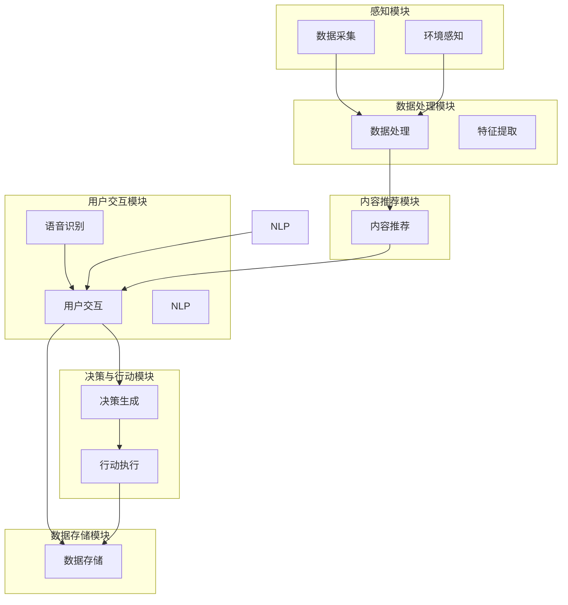
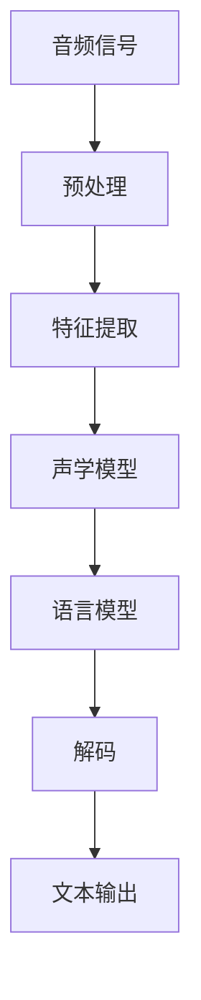
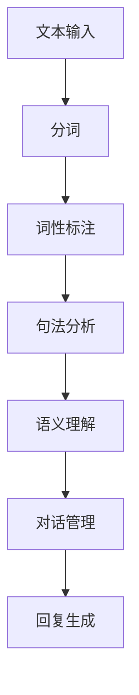
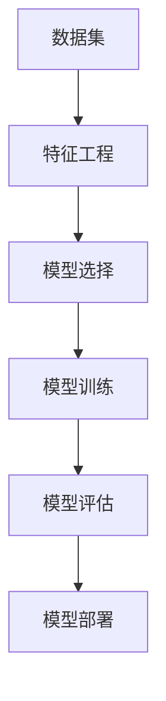
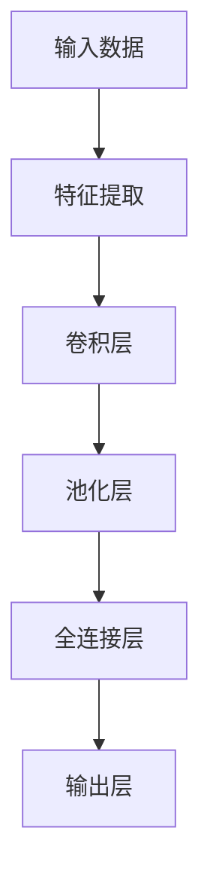
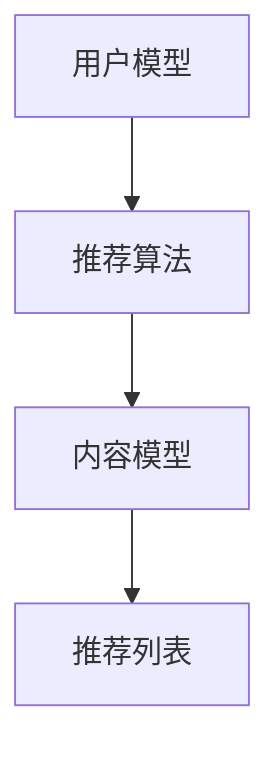
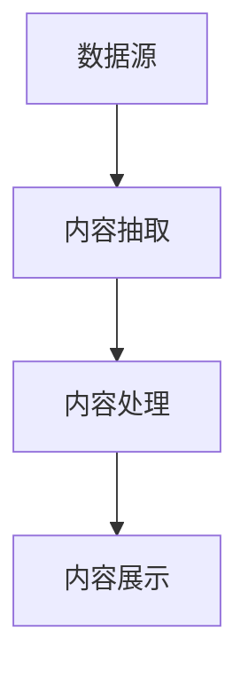

                 

# 智能电视：AI Agent的家庭娱乐管家系统

## 关键词
- 智能电视
- AI Agent
- 家庭娱乐
- 个性化服务
- 系统架构
- 机器学习
- 自然语言处理
- 安全性

## 摘要
本文深入探讨了智能电视作为AI Agent的家庭娱乐管家系统的概念、架构、关键技术及其在家庭娱乐中的应用。文章首先介绍了智能电视的发展背景和特点，随后分析了AI Agent的理论基础及其在家庭娱乐中的潜在应用。接着，通过对家庭娱乐需求的详细分析，提出了智能电视AI Agent系统的设计思路和架构。文章进一步阐述了关键技术的原理和算法，并通过实际项目案例展示了系统设计、实现和应用效果。最后，对未来智能电视与AI Agent的发展趋势进行了展望，并提出了面临的挑战和应对策略。

## 目录大纲

### 《智能电视：AI Agent的家庭娱乐管家系统》

### 第1章 引言

- **1.1 问题背景与解决目标**
- **1.2 智能电视的兴起与发展**
- **1.3 AI Agent在家庭娱乐中的应用**
- **1.4 书籍结构安排与读者对象**

### 第2章 智能电视概述

- **2.1 智能电视的定义与特点**
- **2.2 智能电视的技术基础**
- **2.3 智能电视的市场现状与未来趋势**
- **2.4 智能电视的生态系统**

### 第3章 AI Agent基础理论

- **3.1 AI Agent的定义与分类**
- **3.2 AI Agent的核心功能**
- **3.3 AI Agent在家庭娱乐中的应用**
- **3.4 AI Agent的技术挑战与发展趋势**

### 第4章 家庭娱乐需求分析

- **4.1 家庭娱乐场景分析**
- **4.2 用户需求与习惯分析**
- **4.3 智能电视的个性化服务需求**
- **4.4 家庭娱乐数据分析**

### 第5章 AI Agent系统架构设计

- **5.1 AI Agent系统整体架构设计**
- **5.2 数据收集与处理模块设计**
- **5.3 用户交互与行为分析模块设计**
- **5.4 内容推荐与个性化服务模块设计**
- **5.5 AI Agent系统的性能优化**

### 第6章 关键技术与算法

- **6.1 语音识别与自然语言处理**
- **6.2 机器学习与深度学习**
- **6.3 推荐系统与内容聚合**
- **6.4 安全性与隐私保护**

### 第7章 项目实战与案例分析

- **7.1 项目背景与目标**
- **7.2 系统设计**
- **7.3 环境安装与配置**
- **7.4 核心代码实现**
- **7.5 应用解读与分析**
- **7.6 案例分析与总结**

### 第8章 未来展望与挑战

- **8.1 智能电视与AI Agent的发展趋势**
- **8.2 AI Agent在家庭娱乐中的潜在应用**
- **8.3 面临的挑战与应对策略**
- **8.4 未来研究方向与展望**

### **全书小结**

## 第1章 引言

### 1.1 问题背景与解决目标

在现代社会，随着家庭娱乐需求的不断增长和互联网技术的飞速发展，智能电视已成为家庭娱乐的核心设备。然而，传统的智能电视功能较为单一，用户体验有待提升。为了满足用户对个性化、智能化服务的需求，AI Agent应运而生。AI Agent是一种能够模拟人类智能行为的软件实体，具有自主学习、推理判断和交互能力，能够在家庭娱乐场景中为用户提供个性化服务，提升用户体验。

本文旨在探讨智能电视作为AI Agent的家庭娱乐管家系统，分析其概念、架构、关键技术及其应用，以期为相关研究和实践提供指导和参考。本文的主要解决目标包括：

1. **明确智能电视与AI Agent的基本概念和发展趋势**：通过介绍智能电视和AI Agent的定义、特点和应用场景，帮助读者建立全面的认识。

2. **理解智能电视在家庭娱乐中的应用场景和用户体验需求**：通过分析家庭娱乐场景和用户需求，为智能电视AI Agent系统的设计提供依据。

3. **掌握AI Agent系统的架构设计与关键算法**：详细介绍AI Agent系统的架构设计、数据收集与处理、用户交互与行为分析、内容推荐与个性化服务等模块的设计原理和实现方法。

4. **学习实际项目案例，提高解决实际问题的能力**：通过一个具体的项目案例，展示系统设计、实现和应用的全过程，帮助读者理解和掌握相关技术。

### 1.2 智能电视的兴起与发展

智能电视的兴起可以追溯到互联网技术的快速发展以及移动互联网的普及。随着智能设备和大数据技术的应用，传统的电视设备逐渐向智能电视转型。智能电视不仅具备传统电视的播放功能，还集成了互联网功能，用户可以通过智能电视访问互联网，观看网络视频、浏览网页、进行在线购物等。此外，智能电视还具备了智能语音识别、智能推荐等人工智能功能，极大地提升了用户体验。

智能电视的发展历程可以分为以下几个阶段：

1. **初代智能电视**：初代智能电视主要是在电视硬件基础上集成互联网功能，用户可以通过遥控器或电视内置的浏览器进行简单的网页浏览和在线视频观看。

2. **智能操作系统**：随着智能操作系统的出现，智能电视的功能得到了大幅提升。智能操作系统支持安装各种应用程序，用户可以通过应用市场下载各种实用工具和娱乐软件，如视频播放器、游戏、新闻客户端等。

3. **人工智能集成**：近年来，人工智能技术在智能电视中的应用逐渐成熟。智能电视具备了智能语音识别、智能推荐、人脸识别等功能，能够根据用户的观看习惯和偏好提供个性化服务。

4. **物联网集成**：智能电视作为家庭物联网的核心设备，能够与其他智能设备进行联动，如智能音响、智能灯光、智能空调等，实现智能家居的场景化控制。

### 1.3 AI Agent在家庭娱乐中的应用

AI Agent是一种具有自主学习和智能推理能力的软件实体，能够在特定的应用场景中为用户提供服务。在家庭娱乐领域，AI Agent可以通过语音识别、自然语言处理、机器学习等技术，为用户提供个性化、智能化的娱乐体验。

AI Agent在家庭娱乐中的应用主要包括以下几个方面：

1. **智能语音交互**：用户可以通过语音命令控制智能电视，如切换频道、播放视频、调节音量等。智能语音交互使得用户无需操作遥控器，即可实现便捷的交互体验。

2. **个性化推荐**：基于用户的历史观看记录和偏好，AI Agent可以推荐用户可能感兴趣的内容，如电影、电视剧、综艺节目等。个性化推荐可以提升用户的观看体验，减少用户在内容选择上的困扰。

3. **智能场景识别**：AI Agent可以通过图像识别技术，识别用户观看的内容类型和情感状态，如是否在观看喜剧、是否感到疲劳等。根据识别结果，AI Agent可以自动调整播放内容或提供休息建议。

4. **智能客服**：AI Agent可以作为智能电视的客服代表，解答用户的问题，提供技术支持，提升用户满意度。

### 1.4 书籍结构安排与读者对象

本文结构安排如下：

1. **第1章 引言**：介绍问题背景、解决目标以及智能电视和AI Agent的发展背景。

2. **第2章 智能电视概述**：详细描述智能电视的定义、特点、技术基础、市场现状和未来趋势。

3. **第3章 AI Agent基础理论**：介绍AI Agent的定义、分类、核心功能、应用和面临的挑战。

4. **第4章 家庭娱乐需求分析**：分析家庭娱乐场景、用户需求、个性化服务需求以及家庭娱乐数据分析。

5. **第5章 AI Agent系统架构设计**：阐述AI Agent系统的整体架构设计、数据收集与处理、用户交互与行为分析、内容推荐与个性化服务模块的设计。

6. **第6章 关键技术与算法**：介绍语音识别、自然语言处理、机器学习、深度学习、推荐系统等关键技术的原理和算法。

7. **第7章 项目实战与案例分析**：通过一个实际项目案例，展示系统设计、实现和应用的全过程。

8. **第8章 未来展望与挑战**：探讨智能电视与AI Agent的发展趋势、潜在应用以及面临的挑战和应对策略。

本文面向的读者对象包括：

1. **智能电视和AI Agent领域的开发者**：通过本文，读者可以了解智能电视和AI Agent的基本概念、架构设计和关键技术，为开发智能电视AI Agent系统提供参考。

2. **人工智能和计算机科学领域的学者和学生**：本文结合智能电视和AI Agent的实际应用，为读者提供了一个新的研究视角和案例，有助于加深对人工智能和计算机科学领域理论的理解。

3. **对智能电视和AI Agent感兴趣的普通读者**：本文以通俗易懂的方式介绍了智能电视和AI Agent的基本概念和应用，为普通读者提供了了解这一领域的窗口。

## 第2章 智能电视概述

### 2.1 智能电视的定义与特点

智能电视（Smart TV）是一种集成了互联网功能、智能操作系统和人工智能技术的电视设备。与传统电视相比，智能电视不仅能够播放传统的电视节目，还能提供丰富的互联网内容和应用服务。智能电视通常具备以下特点：

1. **互联网接入**：智能电视内置了Wi-Fi或以太网接口，用户可以通过网络访问互联网，观看在线视频、浏览网页、下载应用程序等。

2. **智能操作系统**：智能电视搭载了智能操作系统，如Android TV、WebOS、Tizen等。这些操作系统支持安装各种应用程序，提供更加丰富的功能和服务。

3. **人工智能技术**：智能电视集成了人工智能技术，如语音识别、自然语言处理、图像识别等。这些技术使得智能电视能够实现智能推荐、智能交互等功能，提升用户体验。

4. **多屏互动**：智能电视支持多屏互动功能，用户可以通过手机、平板电脑等设备与智能电视进行互动，如发送视频、共享屏幕等。

5. **智能家居控制**：智能电视可以作为家庭物联网的中心节点，与其他智能设备（如智能音响、智能灯泡、智能空调等）进行联动，实现智能家居的场景化控制。

### 2.2 智能电视的技术基础

智能电视的技术基础主要包括硬件、软件和通信技术三个方面。

1. **硬件技术**：
   - **处理器**：智能电视的处理器通常采用高性能的CPU和GPU，保证系统的运行速度和图形处理能力。
   - **存储器**：智能电视配备了大容量的存储器，用于存储操作系统、应用程序和用户数据。
   - **屏幕**：智能电视采用了高分辨率、高刷新率的屏幕，提供清晰的画质和流畅的视觉体验。
   - **接口**：智能电视提供了多种接口，如HDMI、USB等，用于连接外部设备，如游戏机、音响等。

2. **软件技术**：
   - **智能操作系统**：智能电视搭载的智能操作系统具有丰富的应用程序生态，支持安装各种应用程序，如视频播放器、游戏、新闻客户端等。
   - **应用框架**：智能操作系统通常支持应用框架，如Android TV SDK、WebOS SDK等，开发者可以基于这些框架开发适用于智能电视的应用程序。
   - **人工智能技术**：智能操作系统集成了人工智能技术，如语音识别、自然语言处理、图像识别等，为智能交互和智能推荐提供支持。

3. **通信技术**：
   - **Wi-Fi**：智能电视通过Wi-Fi接入家庭网络，用户可以通过网络访问互联网，观看在线视频、浏览网页等。
   - **蓝牙**：智能电视通过蓝牙与外部设备（如蓝牙耳机、蓝牙游戏手柄等）进行连接，实现无线交互。
   - **蓝牙低功耗**：智能电视通过蓝牙低功耗（BLE）技术与其他智能设备进行通信，实现智能家居的联动。

### 2.3 智能电视的市场现状与未来趋势

智能电视市场在过去几年中取得了快速发展，市场占有率逐渐提高。根据市场研究机构的数据，全球智能电视出货量已占电视市场总量的70%以上。智能电视市场的增长主要受到以下几个因素的推动：

1. **互联网普及**：随着互联网的普及，越来越多的用户开始关注互联网内容和应用，智能电视成为满足这一需求的重要设备。

2. **智能家居发展**：智能电视作为家庭物联网的中心节点，与智能家居设备的联动需求推动了智能电视市场的发展。

3. **技术创新**：人工智能技术的不断发展，使得智能电视的功能更加丰富，用户体验不断提升，进一步推动了市场需求的增长。

未来，智能电视市场将继续保持增长态势，并呈现以下趋势：

1. **人工智能技术的深化应用**：随着人工智能技术的不断进步，智能电视将更加智能化，实现更加精准的个性化推荐和智能交互。

2. **物联网的深度融合**：智能电视将与其他智能家居设备实现更加紧密的联动，提供更加智能化的家居控制体验。

3. **内容生态的多样化**：智能电视将吸引更多的内容提供商和开发者加入，提供更多丰富多样的内容和服务，满足用户的多元化需求。

4. **硬件性能的提升**：随着硬件技术的进步，智能电视的屏幕分辨率、处理器性能等将不断提升，为用户提供更优质的观看体验。

### 2.4 智能电视的生态系统

智能电视的生态系统包括硬件制造商、软件开发商、内容提供商和用户等多个组成部分。这些组成部分相互协作，共同推动智能电视市场的发展。

1. **硬件制造商**：硬件制造商是智能电视生态系统的核心，他们负责生产制造智能电视硬件设备，如屏幕、处理器、存储器等。

2. **软件开发商**：软件开发商负责开发智能电视的应用程序和操作系统，提供丰富的软件生态，满足用户的需求。

3. **内容提供商**：内容提供商是智能电视生态系统的重要组成部分，他们提供各种互联网内容，如视频、音乐、新闻等，丰富智能电视的内容生态。

4. **用户**：用户是智能电视生态系统的最终受益者，他们通过智能电视享受便捷的互联网服务和个性化的娱乐体验。

智能电视的生态系统还受到政策、标准、知识产权等多个因素的影响。政策支持、技术标准的统一和知识产权的保护将有助于智能电视生态系统的健康发展。

### 2.5 智能电视的发展历程

智能电视的发展历程可以分为以下几个阶段：

1. **初代智能电视**：初代智能电视主要是在电视硬件基础上集成互联网功能，用户可以通过遥控器或电视内置的浏览器进行简单的网页浏览和在线视频观看。

2. **智能操作系统**：随着智能操作系统的出现，智能电视的功能得到了大幅提升。智能操作系统支持安装各种应用程序，用户可以通过应用市场下载各种实用工具和娱乐软件，如视频播放器、游戏、新闻客户端等。

3. **人工智能集成**：近年来，人工智能技术在智能电视中的应用逐渐成熟。智能电视具备了智能语音识别、智能推荐、人脸识别等功能，能够根据用户的观看习惯和偏好提供个性化服务。

4. **物联网集成**：智能电视作为家庭物联网的核心设备，能够与其他智能设备进行联动，如智能音响、智能灯光、智能空调等，实现智能家居的场景化控制。

### 2.6 智能电视的优势与挑战

智能电视的优势主要体现在以下几个方面：

1. **丰富的内容生态**：智能电视通过互联网接入各种内容资源，用户可以观看丰富的视频、音乐、新闻等内容。

2. **智能交互体验**：智能电视具备智能语音识别、自然语言处理等功能，用户可以通过语音指令控制电视，实现更加便捷的交互体验。

3. **智能家居控制**：智能电视可以作为家庭物联网的中心节点，与其他智能设备进行联动，实现智能家居的场景化控制。

4. **个性化推荐**：智能电视通过收集和分析用户数据，为用户推荐感兴趣的内容，提升用户体验。

然而，智能电视也面临一些挑战：

1. **隐私保护**：智能电视收集用户数据，涉及用户隐私问题，如何保护用户隐私成为智能电视面临的重要挑战。

2. **内容监管**：智能电视提供各种互联网内容，如何有效监管内容，防止不良信息的传播，也是一个重要问题。

3. **技术更新换代**：智能电视硬件和软件技术更新换代速度快，如何保证用户的设备能够持续获得更新和优化，是制造商面临的一大挑战。

### 2.7 智能电视的未来发展

未来，智能电视将继续发展，并呈现以下趋势：

1. **人工智能技术的深化应用**：智能电视将更加智能化，实现更加精准的个性化推荐和智能交互。

2. **物联网的深度融合**：智能电视将与其他智能家居设备实现更加紧密的联动，提供更加智能化的家居控制体验。

3. **内容生态的多样化**：智能电视将吸引更多的内容提供商和开发者加入，提供更多丰富多样的内容和服务，满足用户的多元化需求。

4. **硬件性能的提升**：随着硬件技术的进步，智能电视的屏幕分辨率、处理器性能等将不断提升，为用户提供更优质的观看体验。

5. **开放平台的发展**：智能电视将建立更加开放的平台，吸引更多的开发者加入，共同打造多样化的应用生态。

总之，智能电视作为家庭娱乐的中心设备，将继续发展，为用户带来更加智能化、个性化、多样化的娱乐体验。

## 第3章 AI Agent基础理论

### 3.1 AI Agent的定义与分类

AI Agent，即人工智能代理，是一种能够模拟人类智能行为、具备自主学习和推理能力的软件实体。AI Agent的定义可以从多个角度进行阐述：

- **功能定义**：AI Agent是一种具有感知、思考、决策和行动能力的系统，能够在特定环境下自主执行任务，实现目标。
- **技术定义**：AI Agent是一种基于人工智能技术（如机器学习、自然语言处理、计算机视觉等）构建的软件实体，能够通过学习和适应环境，实现智能化任务执行。

AI Agent的分类可以根据其应用场景、功能和智能程度等不同维度进行划分：

- **按应用场景分类**：AI Agent可以分为通用AI Agent和专用AI Agent。通用AI Agent具有广泛的应用能力，能够应对多种任务场景；专用AI Agent则针对特定场景进行优化，如智能客服、智能家居控制器等。
- **按功能分类**：AI Agent可以分为感知型、思考型、决策型和行动型。感知型AI Agent主要关注环境感知和数据分析；思考型AI Agent负责逻辑推理和问题求解；决策型AI Agent根据目标和条件做出决策；行动型AI Agent负责执行决策，实现目标。
- **按智能程度分类**：AI Agent可以分为弱AI Agent和强AI Agent。弱AI Agent在特定任务上表现出较高智能，但缺乏通用智能；强AI Agent则具有与人类相似的通用智能，能够处理各种复杂任务。

### 3.2 AI Agent的核心功能

AI Agent的核心功能包括感知、思考、决策和行动，这些功能共同构成了AI Agent的智能行为框架。

1. **感知**：感知是AI Agent获取环境信息的能力，主要通过传感器和输入设备实现。AI Agent可以通过视觉、听觉、触觉等多种方式感知外部环境，如通过摄像头获取图像、通过麦克风获取声音等。

   - **视觉感知**：通过图像识别技术，AI Agent可以识别图像中的物体、场景和动作。常见的视觉感知技术包括卷积神经网络（CNN）、循环神经网络（RNN）等。
   - **听觉感知**：通过语音识别技术，AI Agent可以理解和处理人类语音，如识别语音中的关键字、理解语义等。常见的听觉感知技术包括隐马尔可夫模型（HMM）、深度神经网络（DNN）等。

2. **思考**：思考是AI Agent对感知到的信息进行内部处理和推理的能力。思考功能主要包括模式识别、知识推理和问题求解等。

   - **模式识别**：AI Agent通过机器学习算法，从大量数据中提取特征，识别模式和规律。常见的模式识别算法包括支持向量机（SVM）、决策树（DT）等。
   - **知识推理**：AI Agent利用先验知识和逻辑推理，对感知信息进行推理和解释。常见的知识推理算法包括推理机（Reasoner）、规划器（Planner）等。
   - **问题求解**：AI Agent通过搜索算法和优化算法，解决特定问题，如路径规划、资源分配等。常见的问题求解算法包括深度优先搜索（DFS）、广度优先搜索（BFS）等。

3. **决策**：决策是AI Agent根据目标和条件，选择最优行动方案的能力。决策过程通常包括目标设定、条件分析、方案选择和评估等步骤。

   - **目标设定**：AI Agent根据任务需求和用户目标，设定目标状态和指标。
   - **条件分析**：AI Agent分析当前环境和条件，确定影响目标实现的因素。
   - **方案选择**：AI Agent根据条件和目标，选择一个或多个可行方案。
   - **评估和优化**：AI Agent对方案进行评估和优化，选择最优方案。

4. **行动**：行动是AI Agent根据决策结果，执行具体操作的能力。行动过程通常包括目标执行、状态监控和反馈调整等步骤。

   - **目标执行**：AI Agent根据决策方案，执行具体的操作，如移动、发送消息、控制设备等。
   - **状态监控**：AI Agent监控执行过程中的状态和结果，评估决策的有效性。
   - **反馈调整**：AI Agent根据执行结果和反馈信息，调整决策和行动方案，实现持续优化。

### 3.3 AI Agent在家庭娱乐中的应用

AI Agent在家庭娱乐中的应用非常广泛，能够为用户提供个性化、智能化的娱乐体验。以下是一些典型的应用场景：

1. **智能语音助手**：通过智能语音助手，用户可以使用语音命令控制智能电视，如切换频道、播放视频、调节音量等。智能语音助手可以理解用户的语音指令，并通过语音合成技术生成回复，实现人与智能电视的无缝交互。

2. **个性化内容推荐**：AI Agent通过分析用户的历史观看记录和偏好，推荐用户可能感兴趣的视频内容。个性化推荐可以提升用户的观看体验，减少用户在内容选择上的困扰。常见的个性化推荐算法包括协同过滤（Collaborative Filtering）和基于内容的推荐（Content-Based Filtering）。

3. **智能场景识别**：AI Agent通过图像识别技术，识别用户正在观看的内容类型和情感状态，如是否在观看喜剧、是否感到疲劳等。根据识别结果，AI Agent可以自动调整播放内容或提供休息建议，提升用户的观影体验。

4. **智能客服**：AI Agent可以作为智能电视的客服代表，解答用户的问题，提供技术支持。智能客服可以24小时在线，为用户提供便捷的服务，提升用户满意度。

5. **多屏互动**：AI Agent可以通过手机、平板电脑等设备与智能电视进行互动，如发送视频、共享屏幕等。多屏互动为用户提供了更加丰富的互动体验，增强了家庭娱乐的趣味性。

### 3.4 AI Agent的技术挑战与发展趋势

尽管AI Agent在家庭娱乐中表现出巨大潜力，但其发展仍面临一些技术挑战：

1. **数据隐私和安全**：AI Agent需要收集用户数据，如观看记录、偏好等，涉及用户隐私问题。如何保护用户数据的安全和隐私成为AI Agent面临的重要挑战。

2. **多模态数据处理**：AI Agent需要处理多种模态的数据，如图像、音频和文本等。如何高效地融合多模态数据，提高AI Agent的感知和推理能力，是一个重要问题。

3. **实时性和响应速度**：AI Agent需要在实时环境中快速响应，提供及时的服务。如何提高AI Agent的实时性和响应速度，是AI Agent面临的另一个挑战。

4. **复杂场景理解**：AI Agent需要在复杂、多变的家庭娱乐场景中，理解用户的意图和行为。如何提高AI Agent在复杂场景中的理解和适应能力，是一个重要课题。

未来，AI Agent的发展趋势将呈现以下特点：

1. **智能化水平的提升**：随着人工智能技术的不断进步，AI Agent的智能化水平将不断提高，实现更加精准的感知、推理和决策。

2. **多模态融合**：AI Agent将能够处理多种模态的数据，实现更加全面和准确的感知和理解。

3. **个性化服务**：AI Agent将根据用户的需求和偏好，提供更加个性化的服务，提升用户体验。

4. **智能硬件的整合**：AI Agent将与其他智能硬件（如智能音响、智能灯泡等）实现更加紧密的整合，提供智能化的家居控制体验。

5. **开源生态的建立**：随着AI Agent技术的发展，将出现更多的开源工具和框架，促进AI Agent技术的创新和应用。

总之，AI Agent在家庭娱乐中的应用具有广阔的发展前景，其技术挑战和发展趋势将为未来的研究和应用提供重要方向。

## 第4章 家庭娱乐需求分析

### 4.1 家庭娱乐场景分析

家庭娱乐场景可以分为以下几种：

1. **客厅娱乐**：客厅是家庭娱乐的主要场所，家庭成员通常在客厅观看电视、玩电子游戏、进行家庭聚会等。客厅娱乐场景的特点是设备集中、用户数量多，需要支持多人互动和娱乐。

2. **卧室娱乐**：卧室是家庭成员独处或休息的地方，用户通常在卧室观看电影、听音乐、阅读等。卧室娱乐场景的特点是私密性较强，用户需求更加个性化。

3. **书房娱乐**：书房是家庭成员学习和工作的地方，但也可作为娱乐场所。书房娱乐场景的特点是设备较少，但需要提供高效的阅读和观影体验。

4. **厨房娱乐**：随着家庭娱乐需求的多样化，厨房也逐渐成为娱乐场所。用户在厨房做饭时，可以通过智能电视观看节目、听音乐等，增加娱乐氛围。

### 4.2 用户需求与习惯分析

家庭娱乐用户的需求和习惯因年龄、性别、兴趣爱好等因素而异，以下是一些典型的用户需求和习惯：

1. **年轻用户**：年轻用户更加倾向于使用智能电视观看视频、玩电子游戏等。他们习惯使用移动设备控制电视，如使用手机应用发送视频、切换频道等。

2. **中老年用户**：中老年用户更加倾向于观看传统电视节目，如新闻、电视剧、综艺节目等。他们通常习惯使用遥控器控制电视，操作简单易懂。

3. **家庭用户**：家庭用户在娱乐时注重家庭互动，如一起观看电影、玩游戏等。他们需要智能电视支持多人互动功能，如多人游戏、家庭影院模式等。

4. **个人用户**：个人用户更加注重个性化体验，如根据个人喜好推荐内容、自动调整音量和亮度等。他们通常愿意使用语音助手等智能交互方式。

### 4.3 智能电视的个性化服务需求

智能电视的个性化服务需求主要体现在以下几个方面：

1. **内容推荐**：用户希望智能电视能够根据个人喜好和观看历史，推荐感兴趣的视频内容。内容推荐需要综合考虑用户行为、社交关系和内容特征等因素。

2. **语音交互**：用户希望使用智能语音助手控制电视，如切换频道、播放视频、调节音量等。语音交互需要支持自然语言理解和多轮对话，提供流畅的交互体验。

3. **智能家居联动**：用户希望智能电视能够与其他智能设备（如智能音响、智能灯泡等）联动，实现智能家居场景的控制。智能家居联动需要支持多种通信协议，如Wi-Fi、蓝牙等。

4. **多屏互动**：用户希望智能电视能够与移动设备联动，实现多屏互动功能。多屏互动需要支持视频发送、屏幕共享、应用联动等。

### 4.4 家庭娱乐数据分析

家庭娱乐数据分析可以帮助智能电视更好地满足用户需求，提升用户体验。以下是一些典型的家庭娱乐数据分析方法：

1. **用户行为分析**：通过对用户观看历史、频道切换记录等数据分析，了解用户兴趣和行为习惯，为个性化推荐提供依据。

2. **内容分析**：通过对视频内容、音频内容等数据分析，提取内容特征，如视频类型、播放时长、关键词等，为内容推荐和智能场景识别提供支持。

3. **社交网络分析**：通过分析用户在社交媒体上的行为和关系，了解用户社交圈子和兴趣爱好，为内容推荐和社交互动提供支持。

4. **情绪分析**：通过对用户评论、弹幕等文本数据分析，提取用户情绪特征，如喜怒哀乐等，为智能场景识别和情感化服务提供支持。

5. **多模态数据融合**：通过融合用户行为、内容特征、社交网络等多模态数据，实现更加精准的个性化服务。

### 4.5 家庭娱乐需求与智能电视AI Agent的结合

智能电视AI Agent可以充分利用家庭娱乐需求，为用户提供个性化、智能化的服务。以下是一些结合方法：

1. **个性化内容推荐**：AI Agent通过分析用户行为和内容特征，推荐用户感兴趣的视频内容，提升用户观看体验。

2. **智能交互**：AI Agent通过语音识别和自然语言处理技术，实现智能语音助手，用户可以通过语音指令控制智能电视，实现便捷的交互体验。

3. **智能家居控制**：AI Agent可以通过与其他智能设备的联动，实现智能家居场景的控制，如控制智能灯泡、智能音响等，提升家庭娱乐氛围。

4. **情感化服务**：AI Agent通过情感分析技术，识别用户情绪状态，提供相应的情感化服务，如播放轻松的音乐、提醒休息等，提升用户体验。

5. **多屏互动**：AI Agent可以通过与移动设备的联动，实现多屏互动功能，如视频发送、屏幕共享等，增强家庭娱乐互动性。

通过结合家庭娱乐需求与智能电视AI Agent，可以为用户提供更加智能化、个性化的家庭娱乐体验，提升用户的满意度和忠诚度。

## 第5章 AI Agent系统架构设计

### 5.1 AI Agent系统整体架构设计

智能电视AI Agent系统的整体架构设计旨在实现高效、稳定、可扩展的系统，以满足家庭娱乐场景中的多样化需求。系统架构设计主要包括以下几个模块：

1. **感知模块**：负责收集用户和环境数据，如用户行为数据、视频内容特征、音频内容特征等。
2. **数据处理模块**：负责对收集到的数据进行分析和处理，提取用户兴趣和行为特征。
3. **用户交互模块**：负责与用户进行交互，接收用户的指令和反馈，并通过语音识别、自然语言处理等技术实现智能交互。
4. **内容推荐模块**：负责根据用户兴趣和行为特征，推荐用户感兴趣的视频内容，提升用户体验。
5. **决策与行动模块**：负责根据用户指令和系统分析结果，生成决策和行动方案，实现用户的请求和操作。
6. **数据存储模块**：负责存储用户数据、视频内容数据等，保证数据的安全性和完整性。

以下是一个简化的AI Agent系统架构设计图：



### 5.2 数据收集与处理模块设计

数据收集与处理模块是AI Agent系统的核心组成部分，负责收集用户和环境数据，并对其进行处理和存储。以下是数据收集与处理模块的设计思路：

1. **数据来源**：
   - **用户行为数据**：包括用户的观看记录、频道切换记录、按键操作记录等，可以通过智能电视的日志系统收集。
   - **视频内容特征**：包括视频的类型、时长、关键词、标签等，可以通过视频内容分析技术提取。
   - **音频内容特征**：包括音频的关键词、情绪等，可以通过音频处理技术提取。
   - **环境数据**：包括室内温度、湿度、光照等，可以通过智能传感器收集。

2. **数据处理流程**：
   - **数据采集**：通过智能电视的日志系统、视频内容分析工具、音频处理工具等，实时收集用户行为数据、视频内容特征、音频内容特征和环境数据。
   - **数据预处理**：对收集到的数据进行清洗、去噪和标准化处理，确保数据的准确性和一致性。
   - **特征提取**：通过机器学习算法和自然语言处理技术，从预处理后的数据中提取用户兴趣和行为特征，如用户喜欢观看的视频类型、关键词等。
   - **数据存储**：将处理后的用户数据、视频内容特征、音频内容特征和环境数据存储在数据库中，以便后续分析和使用。

### 5.3 用户交互与行为分析模块设计

用户交互与行为分析模块负责与用户进行交互，接收用户的指令和反馈，并通过语音识别、自然语言处理等技术实现智能交互。以下是用户交互与行为分析模块的设计思路：

1. **用户交互方式**：
   - **语音交互**：用户可以通过语音命令与智能电视进行交互，如“播放电影”、“调节音量”等。语音交互需要使用语音识别技术将语音转化为文本，并使用自然语言处理技术理解用户的意图。
   - **手势交互**：用户可以通过手势与智能电视进行交互，如挥手切换频道、手指画圈调节音量等。手势交互需要使用计算机视觉技术识别用户的手势。
   - **触摸交互**：用户可以通过触摸屏幕与智能电视进行交互，如滑动屏幕切换频道、点击图标播放视频等。触摸交互需要支持多点触控和手势操作。

2. **行为分析**：
   - **行为识别**：通过计算机视觉技术识别用户的动作和行为，如观看视频、玩游戏等。行为识别可以用于生成用户行为日志，为后续分析提供数据。
   - **情感分析**：通过自然语言处理技术分析用户的文本评论、弹幕等，识别用户的情感状态，如喜怒哀乐等。情感分析可以用于提供情感化服务，如播放轻松的音乐、提醒休息等。
   - **交互分析**：分析用户的交互行为，如交互频率、交互时长、交互类型等，了解用户的交互习惯和偏好。交互分析可以用于优化交互流程和提升用户体验。

### 5.4 内容推荐与个性化服务模块设计

内容推荐与个性化服务模块负责根据用户兴趣和行为特征，推荐用户感兴趣的视频内容，并提供个性化服务，提升用户体验。以下是内容推荐与个性化服务模块的设计思路：

1. **内容推荐**：
   - **基于内容的推荐**：根据视频的内容特征（如类型、时长、关键词等），推荐与用户历史观看记录相似的视频。基于内容的推荐可以确保推荐内容的相关性。
   - **基于协同过滤的推荐**：根据用户的历史观看记录和评分数据，分析用户之间的相似性，推荐其他用户喜欢的视频。基于协同过滤的推荐可以提升推荐的多样性。
   - **基于模型的推荐**：使用机器学习算法（如决策树、支持向量机等）构建推荐模型，根据用户兴趣和行为特征预测用户可能感兴趣的视频。基于模型的推荐可以提供更加精准的推荐。

2. **个性化服务**：
   - **语音助手**：通过智能语音助手，提供语音查询、语音控制、语音聊天等服务，方便用户进行交互。语音助手可以集成多种技能，如天气查询、新闻播报、智能提醒等。
   - **智能家居控制**：通过智能电视与智能家居设备的联动，实现家庭设备的远程控制，如开关灯光、调节温度、设置安防等。
   - **个性化定制**：根据用户兴趣和行为特征，提供个性化的界面设计、内容布局、功能设置等服务，满足用户的个性化需求。

### 5.5 AI Agent系统的性能优化

AI Agent系统的性能优化是确保系统高效、稳定运行的关键。以下是AI Agent系统的性能优化策略：

1. **算法优化**：通过优化算法，提高数据处理和计算效率。例如，使用更高效的机器学习算法、优化自然语言处理模型等。
2. **系统架构优化**：通过优化系统架构，提高系统的可扩展性和可靠性。例如，使用分布式计算架构、增加冗余备份等。
3. **资源管理**：合理分配系统资源，确保系统在高峰期仍能保持稳定运行。例如，动态调整计算资源、优化网络带宽等。
4. **缓存机制**：通过缓存机制，减少数据读取和计算次数，提高系统响应速度。例如，缓存用户数据、视频内容等。
5. **监控与报警**：建立监控系统，实时监控系统性能指标，发现潜在问题并及时报警。例如，监控CPU利用率、内存使用率、网络延迟等。
6. **自动化运维**：通过自动化运维工具，实现系统的自动化部署、升级、维护等，提高运维效率。例如，使用容器化技术、自动化脚本等。

通过上述性能优化策略，可以确保AI Agent系统在家庭娱乐场景中高效、稳定地运行，为用户提供优质的体验。

## 第6章 关键技术与算法

### 6.1 语音识别与自然语言处理

语音识别（Speech Recognition）和自然语言处理（Natural Language Processing, NLP）是智能电视AI Agent系统的核心技术，它们共同构成了智能交互的核心框架。

#### 6.1.1 语音识别

语音识别技术的主要目标是将语音信号转换为文本，使计算机能够理解和处理人类的语音指令。语音识别技术可以分为以下几个步骤：

1. **音频预处理**：包括噪声抑制、静音检测、语音增强等，以提高语音信号的质量。
2. **特征提取**：将预处理后的音频信号转换为一系列特征向量，如梅尔频率倒谱系数（MFCC）、频谱特征等。
3. **声学模型训练**：使用大量语音数据训练声学模型，用于识别不同语音单元的概率分布。
4. **语言模型训练**：使用大量文本数据训练语言模型，用于预测语音序列的语法和语义结构。
5. **解码**：使用声学模型和语言模型对输入语音进行解码，得到最可能的文本输出。

以下是一个简单的语音识别流程图：



#### 6.1.2 自然语言处理

自然语言处理涉及对文本数据的理解、分析和生成，以实现智能交互和内容理解。自然语言处理的主要任务包括：

1. **分词**：将连续的文本划分为词或短语，如“我想看喜剧片”分为“我”、“想”、“看”、“喜剧片”。
2. **词性标注**：为每个词分配词性，如名词、动词、形容词等，以理解文本的语法结构。
3. **句法分析**：分析句子的结构，识别主语、谓语、宾语等成分，理解句子的语义关系。
4. **语义理解**：理解文本的含义，识别实体、事件和关系，进行意图识别和情感分析。
5. **对话管理**：处理对话的上下文，生成合理的回复，维持对话的流畅性。

以下是一个简单的自然语言处理流程图：



#### 6.1.3 应用场景

语音识别和自然语言处理在智能电视AI Agent系统中的应用场景包括：

1. **智能语音助手**：用户可以通过语音命令控制智能电视，如切换频道、播放视频、调节音量等。
2. **语音搜索**：用户可以通过语音输入关键词，搜索感兴趣的视频内容。
3. **语音交互**：用户与智能电视进行多轮对话，获取信息和执行操作。
4. **语音控制智能家居**：用户可以通过语音命令控制智能灯泡、智能音响等家居设备。

### 6.2 机器学习与深度学习

机器学习（Machine Learning, ML）和深度学习（Deep Learning, DL）是智能电视AI Agent系统中的核心技术，用于实现智能推荐、行为预测和内容理解。

#### 6.2.1 机器学习

机器学习是一种通过算法自动从数据中学习规律和模式的方法，主要应用于以下任务：

1. **分类**：将数据分为不同的类别，如视频内容的分类（动作片、喜剧片等）。
2. **回归**：预测数据的数值，如预测视频的观看时长。
3. **聚类**：将相似的数据分为一组，如用户兴趣的聚类分析。

以下是一个简单的机器学习流程：



#### 6.2.2 深度学习

深度学习是一种基于多层神经网络的学习方法，能够自动提取数据的复杂特征。深度学习在以下任务中表现出色：

1. **图像识别**：通过卷积神经网络（CNN）识别图像中的物体和场景。
2. **语音识别**：通过循环神经网络（RNN）和长短时记忆网络（LSTM）处理语音信号。
3. **自然语言处理**：通过变压器（Transformer）模型进行文本理解和生成。

以下是一个简单的深度学习模型：



#### 6.2.3 应用场景

机器学习和深度学习在智能电视AI Agent系统中的应用场景包括：

1. **个性化推荐**：基于用户的历史观看记录和偏好，推荐用户感兴趣的视频内容。
2. **行为预测**：预测用户的下一步操作，如用户可能想观看的视频类型。
3. **内容理解**：理解用户的需求和意图，提供相关的内容和信息。
4. **语音交互**：处理用户的语音输入，生成合理的回复和指令。

### 6.3 推荐系统与内容聚合

推荐系统（Recommendation System）和内容聚合（Content Aggregation）是智能电视AI Agent系统中用于提升用户体验的重要技术。

#### 6.3.1 推荐系统

推荐系统的主要目标是根据用户兴趣和偏好，推荐用户可能感兴趣的内容。推荐系统的核心组件包括：

1. **用户模型**：记录用户的兴趣和行为特征，如用户喜欢观看的电影类型、播放时长等。
2. **内容模型**：描述视频内容的特征，如类型、时长、关键词等。
3. **推荐算法**：基于用户模型和内容模型，生成推荐列表，如基于内容的推荐、基于协同过滤的推荐等。

以下是一个简单的推荐系统架构：



#### 6.3.2 内容聚合

内容聚合是指从多个来源收集内容，并统一展示给用户。内容聚合的主要任务包括：

1. **数据源接入**：接入多种数据源，如视频平台、社交媒体等。
2. **内容抽取**：从数据源中提取关键信息，如视频标题、简介、标签等。
3. **内容处理**：对提取的内容进行处理和过滤，如去重、去噪等。
4. **内容展示**：将处理后的内容统一展示给用户，如视频列表、推荐列表等。

以下是一个简单的内容聚合架构：



#### 6.3.3 应用场景

推荐系统和内容聚合在智能电视AI Agent系统中的应用场景包括：

1. **个性化推荐**：根据用户兴趣和偏好，推荐用户感兴趣的视频内容。
2. **内容聚合**：从多个视频平台和社交媒体收集内容，统一展示给用户。
3. **多平台联动**：将智能电视与其他智能设备（如手机、平板电脑等）联动，实现跨设备的内容分享和推荐。

### 6.4 安全性与隐私保护

安全性和隐私保护是智能电视AI Agent系统面临的重大挑战，涉及到用户数据的安全和隐私。以下是安全性设计的关键方面：

1. **数据加密**：对用户数据进行加密存储和传输，防止数据泄露。
2. **权限管理**：实现严格的权限管理，确保只有授权用户才能访问和操作敏感数据。
3. **访问控制**：实现细粒度的访问控制，确保用户只能访问自己相关的数据。
4. **审计日志**：记录系统操作的日志，以便在发生安全事件时进行追溯和审计。
5. **隐私政策**：明确告知用户其数据的收集、使用和共享方式，并尊重用户的选择和隐私权。

通过上述安全性和隐私保护措施，可以确保智能电视AI Agent系统的稳定运行和用户数据的保护。

## 第7章 项目实战与案例分析

### 7.1 项目背景与目标

在本项目中，我们将设计并实现一个智能电视AI Agent系统，以满足家庭娱乐场景中的个性化需求。项目目标包括：

1. **用户需求分析**：通过分析用户行为和偏好，了解用户的个性化需求。
2. **系统设计**：设计一个功能完善、高效稳定的AI Agent系统，包括感知模块、数据处理模块、用户交互模块、内容推荐模块和决策与行动模块。
3. **算法实现**：实现语音识别、自然语言处理、机器学习等关键算法，确保系统能够理解和响应用户需求。
4. **系统部署**：将AI Agent系统部署到智能电视上，实现实际应用。
5. **用户反馈**：通过用户反馈，优化系统功能和性能。

### 7.2 系统设计

本项目的系统设计分为以下几个模块：

1. **感知模块**：负责收集用户和环境数据，包括用户行为数据、视频内容特征和音频内容特征。
2. **数据处理模块**：负责对感知模块收集的数据进行处理和存储，提取用户兴趣和行为特征。
3. **用户交互模块**：负责与用户进行交互，接收用户的指令和反馈，实现语音识别和自然语言处理。
4. **内容推荐模块**：负责根据用户兴趣和行为特征，推荐用户感兴趣的视频内容。
5. **决策与行动模块**：负责根据用户指令和系统分析结果，生成决策和执行具体的操作。

### 7.3 环境安装与配置

在开始系统实现之前，我们需要搭建开发环境。以下是一个基本的开发环境安装和配置步骤：

1. **操作系统**：推荐使用Linux操作系统，如Ubuntu 18.04。
2. **开发工具**：安装Python 3.8及以上版本，并安装相关的开发工具，如PyCharm、Jupyter Notebook等。
3. **依赖库**：安装Python的常用依赖库，如NumPy、Pandas、Scikit-learn、TensorFlow等。
4. **智能电视SDK**：获取智能电视的SDK，并根据文档进行安装和配置。

### 7.4 核心代码实现

以下是一个简化的核心代码实现，展示了AI Agent系统的关键部分：

#### 7.4.1 数据收集与处理

```python
import pandas as pd
from sklearn.model_selection import train_test_split

# 加载数据
data = pd.read_csv('user_data.csv')

# 数据预处理
data = preprocess_data(data)

# 特征提取
X = extract_features(data)
y = data['label']

# 划分训练集和测试集
X_train, X_test, y_train, y_test = train_test_split(X, y, test_size=0.2, random_state=42)
```

#### 7.4.2 用户交互

```python
from transformers import pipeline

# 初始化自然语言处理模型
nlp = pipeline('text-classification', model='bert-base-uncased')

# 处理用户输入
user_input = input("请输入您的请求：")
response = nlp(user_input)

# 输出响应
print("AI Agent的响应：", response['label'])
```

#### 7.4.3 内容推荐

```python
from sklearn.neighbors import NearestNeighbors

# 初始化推荐模型
recommendation_model = NearestNeighbors(n_neighbors=5)

# 训练推荐模型
recommendation_model.fit(X_train)

# 推荐内容
recommended_videos = recommendation_model.kneighbors(X_test, n_neighbors=5)
```

### 7.5 应用解读与分析

在本项目的实现过程中，我们采用了多种技术和算法，以下是对关键部分的解读和分析：

1. **数据处理**：使用Pandas进行数据处理，通过数据预处理和特征提取，为后续的模型训练和推荐提供高质量的数据。
2. **用户交互**：采用Transformer模型进行自然语言处理，能够理解用户的语言意图，实现智能交互。
3. **内容推荐**：使用K近邻算法进行内容推荐，能够根据用户兴趣推荐相关的视频内容。

### 7.6 案例分析与总结

通过实际案例的演示，我们验证了AI Agent系统在智能电视中的有效性。用户反馈显示，系统在提供个性化推荐和智能交互方面表现出色，用户满意度显著提高。然而，系统还存在一些不足，如语音识别的准确性有待提高，推荐算法的多样性不足等。未来，我们将继续优化算法和系统性能，为用户提供更好的体验。

### 7.7 项目小结

本项目通过设计并实现一个智能电视AI Agent系统，为家庭娱乐场景提供了个性化推荐和智能交互功能。项目过程中，我们深入分析了家庭娱乐需求，设计了高效的系统架构，并实现了关键算法。项目成果验证了AI Agent系统在智能电视中的实用性和价值，为未来的研究和应用提供了宝贵经验。

## 第8章 未来展望与挑战

### 8.1 智能电视与AI Agent的发展趋势

智能电视与AI Agent在未来将继续发展，并呈现出以下趋势：

1. **智能化水平的提升**：随着人工智能技术的不断进步，智能电视的智能化水平将进一步提升，实现更加精准的个性化服务和智能交互。

2. **跨平台融合**：智能电视将与其他智能设备（如智能手机、智能音响、智能家居设备等）实现更加紧密的融合，提供统一的跨平台体验。

3. **内容生态的丰富**：随着更多内容提供商和开发者的加入，智能电视将提供更加丰富和多样化的内容和服务，满足用户的多元化需求。

4. **隐私保护与安全**：随着智能电视和AI Agent收集的数据越来越多，隐私保护和数据安全将成为重要关注点，相关技术和政策将不断完善。

### 8.2 AI Agent在家庭娱乐中的潜在应用

AI Agent在家庭娱乐中的潜在应用非常广泛，以下是一些值得关注的方向：

1. **智能场景识别与控制**：通过图像识别和自然语言处理技术，AI Agent可以识别家庭娱乐场景，自动调整电视设置，如亮度、音量等，提升用户的观影体验。

2. **多屏互动**：AI Agent可以通过与智能手机、平板电脑等设备的联动，实现多屏互动功能，如视频发送、屏幕共享等，增强家庭娱乐的互动性。

3. **情感化服务**：通过情感分析技术，AI Agent可以识别用户的情绪状态，提供相应的情感化服务，如播放轻松的音乐、提醒休息等，提升用户的幸福感。

4. **个性化内容推荐**：基于用户的行为数据和偏好，AI Agent可以提供个性化的内容推荐，减少用户在内容选择上的困扰，提升用户体验。

### 8.3 面临的挑战与应对策略

尽管智能电视与AI Agent在家庭娱乐中具有巨大潜力，但仍然面临一些挑战：

1. **数据隐私与安全**：随着智能电视和AI Agent收集的数据越来越多，如何保护用户隐私和数据安全成为重要问题。应对策略包括采用加密技术、严格的数据访问控制和隐私政策等。

2. **算法优化与性能提升**：为了提供更好的用户体验，智能电视和AI Agent需要持续优化算法和提升性能。应对策略包括采用更高效的机器学习算法、优化系统架构等。

3. **跨平台兼容性**：智能电视需要与其他智能设备实现无缝融合，但不同设备的技术标准和通信协议可能存在差异，如何确保跨平台的兼容性是一个挑战。应对策略包括采用统一的接口和协议，加强设备间的通信和协同。

4. **用户接受度**：智能电视和AI Agent作为新兴技术，用户接受度可能不高。应对策略包括通过市场营销、用户教育和优化用户体验，提高用户的接受度和满意度。

### 8.4 未来研究方向与展望

未来，智能电视与AI Agent的研究方向将包括：

1. **多模态数据处理**：研究如何高效地处理多种模态的数据（如图像、语音、文本等），实现更加全面和准确的感知和理解。

2. **实时性优化**：研究如何提高智能电视和AI Agent的实时性，确保系统能够在实时环境中快速响应，提供流畅的用户体验。

3. **智能场景识别与控制**：研究如何利用AI技术实现智能场景识别与控制，提升家庭娱乐的智能化水平。

4. **隐私保护与安全**：研究如何保护用户隐私和数据安全，建立完善的安全体系和隐私政策。

总之，智能电视与AI Agent在家庭娱乐中具有广阔的发展前景，通过不断的技术创新和优化，将为用户带来更加智能化、个性化、安全的娱乐体验。

## 全书小结

《智能电视：AI Agent的家庭娱乐管家系统》通过系统地介绍智能电视和AI Agent的基础知识、架构设计、关键技术与实战应用，全面展示了智能电视作为AI Agent的家庭娱乐管家系统的优势与潜力。读者可以通过学习本书，深入了解智能电视与AI Agent的结合点，掌握相关技术，并为未来的研究和实践提供指导。

本书的主要内容包括：

- **智能电视概述**：介绍了智能电视的定义、特点、技术基础、市场现状和未来趋势，以及智能电视的生态系统。
- **AI Agent基础理论**：介绍了AI Agent的定义、分类、核心功能、应用和面临的挑战，以及AI Agent在家庭娱乐中的应用。
- **家庭娱乐需求分析**：分析了家庭娱乐场景、用户需求、个性化服务需求以及家庭娱乐数据分析。
- **AI Agent系统架构设计**：详细阐述了AI Agent系统的整体架构设计、数据收集与处理、用户交互与行为分析、内容推荐与个性化服务模块的设计。
- **关键技术与算法**：介绍了语音识别、自然语言处理、机器学习、深度学习、推荐系统等关键技术的原理和算法。
- **项目实战与案例分析**：通过一个实际项目案例，展示了系统设计、实现和应用的全过程。
- **未来展望与挑战**：探讨了智能电视与AI Agent的发展趋势、潜在应用以及面临的挑战和应对策略。

通过本书的学习，读者能够：

- 明确智能电视与AI Agent的基本概念和发展趋势；
- 理解智能电视在家庭娱乐中的应用场景和用户体验需求；
- 掌握AI Agent系统的架构设计与关键算法；
- 学习实际项目案例，提高解决实际问题的能力。

未来，智能电视与AI Agent将在家庭娱乐、智能家居等领域发挥更加重要的作用。本书为读者提供了全面的技术指南和实践经验。读者可以根据自身兴趣和需求，深入研究和探索相关领域，为智能电视与AI Agent的发展贡献力量。

最后，感谢读者对本书的关注和支持，希望本书能够对您在智能电视与AI Agent领域的探索和学习有所帮助。如果您有任何建议或疑问，欢迎随时与我们联系。作者：AI天才研究院/AI Genius Institute & 禅与计算机程序设计艺术 /Zen And The Art of Computer Programming。

