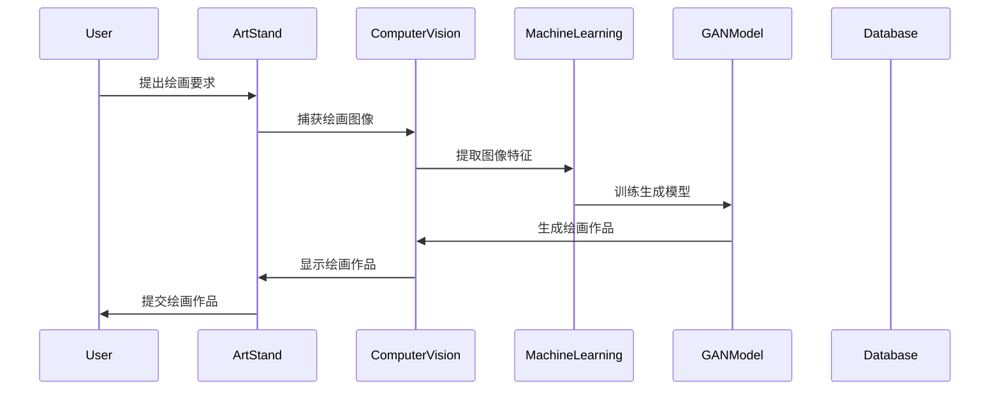

                 


# 智能画架：AI Agent的绘画技巧指导

> 关键词：智能画架，AI Agent，绘画，计算机视觉，机器学习

> 摘要：本文介绍了智能画架的概念、工作原理以及其在绘画领域的应用。通过对计算机视觉和机器学习技术的深入探讨，分析了智能画架如何利用这些技术实现智能化绘画。文章还通过实际案例和代码示例，展示了智能画架的实际应用和操作过程。

## 第一部分：问题背景介绍

### 1. 引言

随着人工智能技术的快速发展，AI Agent在各个领域的应用日益广泛。绘画作为人类文化传承的重要组成部分，也受到了AI技术的深刻影响。传统的AI绘画方法往往缺乏个性化和创意，难以满足现代绘画的需求。为了解决这个问题，本文旨在探讨如何利用AI Agent实现智能绘画，为艺术家和设计师提供全新的创作工具和技巧。

### 2. 问题背景

绘画是艺术创作的一种形式，它不仅反映了人类对美的追求，也体现了文化和思想的传承。然而，传统的绘画方式存在着创作效率低下、个性化不足等问题。随着计算机技术和人工智能的发展，人们开始探索如何将AI Agent应用于绘画领域，以实现自动化、智能化的创作过程。

### 3. 问题解决

智能画架（Smart Art Stand）作为一种结合了计算机视觉、机器学习和自然语言处理技术的AI Agent，能够根据用户的需求和偏好，生成具有创意和个性的绘画作品。本文将介绍智能画架的基本原理、关键技术以及实际应用案例，帮助读者了解如何利用AI Agent实现智能绘画。

### 4. 边界与外延

智能画架的应用不仅局限于艺术创作，还可以扩展到教育、设计、广告等多个领域。例如，在教育领域，智能画架可以作为辅助教学工具，帮助学生更好地理解和掌握绘画技能；在广告领域，智能画架可以为企业提供创意广告设计，提高品牌影响力。

### 5. 核心概念与联系

为了深入探讨智能画架的实现原理，本文将介绍以下几个核心概念：

- **计算机视觉**：智能画架的基础技术，用于识别和理解图像内容。
- **机器学习**：通过训练大量数据，使智能画架具备自主学习和优化能力。
- **自然语言处理**：智能画架与用户交互的关键技术，用于理解和处理用户的指令。
- **生成对抗网络（GAN）**：一种常用的生成模型，用于生成高质量的艺术作品。

这些核心概念相互联系，共同构成了智能画架的技术体系。

### 6. 概念结构与核心要素组成

智能画架的概念结构包括以下几个核心要素：

- **硬件部分**：包括画架、摄像头、图形处理器（GPU）等硬件设备。
- **软件部分**：包括计算机视觉算法、机器学习算法、自然语言处理算法等软件模块。
- **用户交互界面**：用于用户输入指令和查看绘画结果的交互界面。

这些核心要素共同协作，实现了智能画架的绘画功能。

## 第二部分：核心概念与联系

### 2.1 计算机视觉

#### 2.1.1 计算机视觉概述

计算机视觉是人工智能的一个重要分支，旨在使计算机能够像人类一样理解和解释视觉信息。智能画架的绘画功能离不开计算机视觉技术，它主要用于图像识别、场景理解、物体检测等方面。

#### 2.1.2 计算机视觉的核心算法

- **特征提取**：从图像中提取有用的信息，如边缘、纹理、颜色等。
- **目标检测**：识别图像中的特定对象或区域。
- **语义分割**：将图像划分为不同的语义区域，如前景和背景。

#### 2.1.3 计算机视觉在智能画架中的应用

计算机视觉技术在智能画架中扮演着关键角色，主要用于以下方面：

- **图像输入**：摄像头捕捉用户的绘画动作，并将图像数据传输给计算机处理。
- **绘画风格识别**：分析用户的绘画风格，为智能画架提供创作参考。
- **绘画结果输出**：将生成的绘画作品以图像形式展示给用户。

### 2.2 机器学习

#### 2.2.1 机器学习概述

机器学习是人工智能的核心技术之一，它使计算机能够通过学习和经验改进自身的性能。智能画架的绘画功能依赖于机器学习算法，特别是生成对抗网络（GAN）等深度学习技术。

#### 2.2.2 机器学习的关键算法

- **监督学习**：通过已标记的数据训练模型，使其能够对新的数据进行预测。
- **无监督学习**：在没有标记数据的情况下，通过发现数据中的潜在模式进行学习。
- **强化学习**：通过试错法，让模型在环境中不断学习，以达到最佳效果。

#### 2.2.3 机器学习在智能画架中的应用

机器学习技术在智能画架中用于以下方面：

- **图像生成**：利用生成对抗网络（GAN）等算法，生成具有创意和个性化的绘画作品。
- **绘画风格迁移**：将一种绘画风格应用到另一种绘画风格上，实现风格多样化。
- **用户偏好学习**：根据用户的历史绘画记录和反馈，优化绘画生成过程。

### 2.3 自然语言处理

#### 2.3.1 自然语言处理概述

自然语言处理（NLP）是人工智能的一个重要分支，旨在使计算机能够理解和处理人类语言。智能画架需要与用户进行交互，因此自然语言处理技术在智能画架中扮演着关键角色。

#### 2.3.2 自然语言处理的核心算法

- **词向量表示**：将自然语言文本转换为计算机可以处理的向量形式。
- **序列标注**：对文本中的词语进行分类和标注，如情感分析、命名实体识别等。
- **机器翻译**：将一种自然语言翻译成另一种自然语言。

#### 2.3.3 自然语言处理在智能画架中的应用

自然语言处理技术在智能画架中用于以下方面：

- **用户指令理解**：将用户的语音或文本指令转换为计算机可以理解的形式。
- **绘画风格描述**：将用户描述的绘画风格转换为计算机可以处理的信息。
- **反馈分析**：分析用户的反馈，以优化绘画生成过程。

### 2.4 生成对抗网络（GAN）

#### 2.4.1 GAN概述

生成对抗网络（GAN）是一种深度学习模型，由生成器和判别器组成。生成器试图生成与真实数据相似的数据，而判别器则试图区分生成数据与真实数据。GAN通过对抗训练，使生成器不断优化生成数据，以达到高质量的数据生成效果。

#### 2.4.2 GAN的核心结构

- **生成器（Generator）**：将随机噪声转换为真实数据的映射。
- **判别器（Discriminator）**：对输入数据进行判断，判断其是否为真实数据。
- **损失函数**：衡量生成器和判别器的性能，通过优化损失函数，提高GAN的生成效果。

#### 2.4.3 GAN在智能画架中的应用

GAN在智能画架中主要用于以下方面：

- **图像生成**：利用GAN生成具有创意和个性化的绘画作品。
- **绘画风格迁移**：将一种绘画风格应用到另一种绘画风格上，实现风格多样化。

### 2.5 概念关系与联系

智能画架的核心概念包括计算机视觉、机器学习、自然语言处理和生成对抗网络（GAN）。这些概念相互联系，共同构成了智能画架的技术体系。计算机视觉负责图像输入和处理，机器学习负责数据训练和优化，自然语言处理负责用户交互和理解，而生成对抗网络（GAN）则负责图像生成和风格迁移。

## 第三部分：算法原理讲解

### 3.1 计算机视觉算法原理

#### 3.1.1 特征提取

特征提取是计算机视觉算法中的关键步骤，它用于从图像中提取有用的信息。常见的特征提取方法包括：

- **边缘检测**：用于检测图像中的边缘，如Canny边缘检测算法。
- **纹理分析**：用于分析图像中的纹理特征，如Gabor滤波器。
- **颜色特征**：用于提取图像中的颜色信息，如HOG（直方图导向特征）。

#### 3.1.2 目标检测

目标检测是计算机视觉算法中的一个重要任务，它用于识别图像中的特定对象或区域。常见的目标检测算法包括：

- **滑动窗口**：通过在图像上滑动窗口，对每个窗口内的图像进行分类。
- **区域提议算法**：如选择性搜索（Selective Search），用于生成候选区域。
- **深度学习算法**：如YOLO（You Only Look Once）、SSD（Single Shot MultiBox Detector），通过训练大量数据，实现快速目标检测。

#### 3.1.3 语义分割

语义分割是将图像划分为不同的语义区域，如前景和背景。常见的语义分割算法包括：

- **传统算法**：如FCN（Fully Convolutional Network），通过卷积神经网络实现像素级别的分类。
- **深度学习算法**：如U-Net、SegNet，通过训练大量数据，实现像素级别的语义分割。

### 3.2 机器学习算法原理

#### 3.2.1 监督学习

监督学习是一种机器学习算法，它通过已标记的数据训练模型，使其能够对新的数据进行预测。常见的监督学习算法包括：

- **线性回归**：通过拟合线性模型，预测连续的输出值。
- **逻辑回归**：通过拟合逻辑模型，预测离散的输出值。
- **决策树**：通过构建决策树，对数据进行分类或回归。

#### 3.2.2 无监督学习

无监督学习是一种机器学习算法，它在没有标记数据的情况下，通过发现数据中的潜在模式进行学习。常见的无监督学习算法包括：

- **聚类算法**：如K-Means、层次聚类，用于将数据划分为不同的簇。
- **降维算法**：如PCA（Principal Component Analysis）、t-SNE（t-Distributed Stochastic Neighbor Embedding），用于降低数据的维度。
- **关联规则学习**：如Apriori算法，用于发现数据之间的关联关系。

#### 3.2.3 强化学习

强化学习是一种机器学习算法，它通过试错法，让模型在环境中不断学习，以达到最佳效果。常见的强化学习算法包括：

- **Q-Learning**：通过更新Q值，让模型选择最优的动作。
- **Policy Gradient**：通过更新策略参数，让模型选择最优的动作。
- **Deep Q-Network (DQN)**：通过深度神经网络，实现强化学习。

### 3.3 自然语言处理算法原理

#### 3.3.1 词向量表示

词向量表示是自然语言处理算法中的关键步骤，它将自然语言文本转换为计算机可以处理的向量形式。常见的词向量表示方法包括：

- **Word2Vec**：通过训练神经网络，将单词映射到高维空间。
- **GloVe**：通过计算单词之间的相似性，将单词映射到高维空间。
- **BERT**：通过预训练大规模语料库，生成高质量的词向量表示。

#### 3.3.2 序列标注

序列标注是对文本中的词语进行分类和标注的任务，如情感分析、命名实体识别等。常见的序列标注算法包括：

- **CRF（条件随机场）**：通过构建条件随机场模型，实现序列标注。
- **Bi-LSTM（双向长短时记忆网络）**：通过双向长短时记忆网络，实现序列标注。
- **Transformer**：通过自注意力机制，实现序列标注。

#### 3.3.3 机器翻译

机器翻译是将一种自然语言翻译成另一种自然语言的任务。常见的机器翻译算法包括：

- **基于规则的方法**：通过构建语法规则，实现自然语言翻译。
- **基于统计的方法**：通过训练大量双语语料库，实现自然语言翻译。
- **基于神经网络的方法**：通过训练神经网络，实现自然语言翻译。

### 3.4 生成对抗网络（GAN）算法原理

#### 3.4.1 GAN概述

生成对抗网络（GAN）是一种深度学习模型，由生成器和判别器组成。生成器试图生成与真实数据相似的数据，而判别器则试图区分生成数据与真实数据。GAN通过对抗训练，使生成器不断优化生成数据，以达到高质量的数据生成效果。

#### 3.4.2 GAN的核心结构

GAN的核心结构包括生成器（Generator）和判别器（Discriminator）。生成器的目的是生成逼真的数据，判别器的目的是判断输入数据是否为真实数据。GAN的训练过程分为两个阶段：

1. **生成器训练**：生成器试图生成更逼真的数据，以欺骗判别器。
2. **判别器训练**：判别器试图区分生成数据和真实数据。

#### 3.4.3 GAN的损失函数

GAN的损失函数包括生成器损失和判别器损失。生成器损失用于衡量生成数据的真实性，判别器损失用于衡量判别器对生成数据和真实数据的区分能力。常见的损失函数包括：

- **交叉熵损失**：用于衡量生成器和判别器的误差。
- **均方误差损失**：用于衡量生成器和判别器的误差。

#### 3.4.4 GAN的应用

GAN在智能画架中的应用主要包括图像生成和绘画风格迁移。通过训练生成器和判别器，GAN可以生成具有创意和个性化的绘画作品，实现绘画风格多样化。

### 3.5 算法原理示例

为了更好地理解算法原理，以下将给出一个简单的例子：

#### 3.5.1 图像生成示例

假设我们要使用GAN生成一张猫的图像。以下是Python代码示例：

```python
import tensorflow as tf
from tensorflow.keras import layers

# 定义生成器模型
def generate_model():
    model = tf.keras.Sequential()
    model.add(layers.Dense(128, activation='relu', input_shape=(100,)))
    model.add(layers.Dense(256, activation='relu'))
    model.add(layers.Dense(512, activation='relu'))
    model.add(layers.Dense(1024, activation='relu'))
    model.add(layers.Dense(784, activation='tanh'))
    return model

# 定义判别器模型
def discriminate_model():
    model = tf.keras.Sequential()
    model.add(layers.Dense(512, activation='relu', input_shape=(784,)))
    model.add(layers.Dense(256, activation='relu'))
    model.add(layers.Dense(128, activation='relu'))
    model.add(layers.Dense(1, activation='sigmoid'))
    return model

# 定义GAN模型
def gan_model():
    generator = generate_model()
    discriminator = discriminate_model()

    z = layers.Input(shape=(100,))
    generated_images = generator(z)

    valid = layers.Input(shape=(784,))
    valid/generated = discriminator(valid)
    generated/generated = discriminator(generated)

    model = tf.keras.Model([z, valid], [valid/generated, generated/generated])
    return model

# 编译模型
model = gan_model()
model.compile(optimizer='adam', loss='binary_crossentropy')

# 训练模型
model.fit([z_train, x_train], [y_train, y_train], epochs=50, batch_size=64)
```

#### 3.5.2 绘画风格迁移示例

假设我们要使用GAN将一幅画家的绘画风格应用到另一幅画作上。以下是Python代码示例：

```python
import tensorflow as tf
from tensorflow.keras import layers

# 定义生成器模型
def generate_model():
    model = tf.keras.Sequential()
    model.add(layers.Conv2D(64, (3, 3), activation='relu', input_shape=(256, 256, 3)))
    model.add(layers.Conv2D(128, (3, 3), activation='relu'))
    model.add(layers.Conv2D(256, (3, 3), activation='relu'))
    model.add(layers.Conv2D(512, (3, 3), activation='relu'))
    model.add(layers.Conv2DTranspose(256, (3, 3), strides=(2, 2), activation='relu'))
    model.add(layers.Conv2DTranspose(128, (3, 3), strides=(2, 2), activation='relu'))
    model.add(layers.Conv2DTranspose(64, (3, 3), strides=(2, 2), activation='relu'))
    model.add(layers.Conv2DTranspose(3, (3, 3), strides=(2, 2), activation='tanh'))
    return model

# 定义判别器模型
def discriminate_model():
    model = tf.keras.Sequential()
    model.add(layers.Conv2D(64, (3, 3), activation='relu', input_shape=(256, 256, 3)))
    model.add(layers.Conv2D(128, (3, 3), activation='relu'))
    model.add(layers.Conv2D(256, (3, 3), activation='relu'))
    model.add(layers.Conv2D(512, (3, 3), activation='relu'))
    model.add(layers.Dense(1, activation='sigmoid'))
    return model

# 定义GAN模型
def gan_model():
    generator = generate_model()
    discriminator = discriminate_model()

    style_image = layers.Input(shape=(256, 256, 3))
    generated_image = generator(style_image)

    valid = layers.Input(shape=(256, 256, 3))
    valid/generated = discriminator(valid)
    generated/generated = discriminator(generated)

    model = tf.keras.Model([style_image, valid], [valid/generated, generated/generated])
    return model

# 编译模型
model = gan_model()
model.compile(optimizer='adam', loss='binary_crossentropy')

# 训练模型
model.fit([style_images, x_train], [y_train, y_train], epochs=50, batch_size=64)
```

### 3.6 算法原理总结

通过对计算机视觉、机器学习、自然语言处理和生成对抗网络（GAN）算法原理的讲解，我们可以看到这些算法在智能画架中的应用。计算机视觉负责图像输入和处理，机器学习负责数据训练和优化，自然语言处理负责用户交互和理解，而生成对抗网络（GAN）则负责图像生成和风格迁移。这些算法相互协作，共同实现了智能画架的绘画功能。

## 第四部分：系统分析与架构设计方案

### 4.1 问题场景介绍

智能画架是一种结合了计算机视觉、机器学习和自然语言处理技术的AI Agent，旨在为艺术家和设计师提供智能化、个性化的绘画工具。在实际应用中，智能画架可以应用于多种场景，如艺术创作、设计、广告等。以下是一个典型的问题场景：

**场景**：一位设计师需要为一场艺术展览创作一幅以海洋为主题的画作。设计师希望通过智能画架能够快速生成具有创意和个性化的海洋画作，以节省时间和提高创作效率。

### 4.2 项目介绍

为了实现上述场景，我们将开发一个智能画架项目。该项目主要包括以下几个部分：

1. **硬件设备**：包括一台智能画架、一台高性能计算机以及一台图形处理器（GPU）。
2. **软件系统**：包括计算机视觉算法、机器学习算法、自然语言处理算法和生成对抗网络（GAN）算法。
3. **用户交互界面**：用于用户输入指令和查看绘画结果的交互界面。

### 4.3 系统功能设计（领域模型）

为了更好地理解智能画架项目的功能，我们可以使用领域模型（Domain Model）进行描述。领域模型是一种用于表示系统功能的图形化方法，它包括实体、关系和属性。以下是智能画架项目的领域模型：

```mermaid
classDiagram
    class Artist {
        -name: string
        -style: string
    }
    class Design {
        -id: int
        -title: string
        -description: string
    }
    class Painting {
        -id: int
        -title: string
        -description: string
        -style: string
        -creator: Artist
    }
    class GANModel {
        -id: int
        -name: string
        -parameters: string
    }
    Artist -> Design
    Artist -> Painting
    Painting -> GANModel
```

### 4.4 系统架构设计

为了实现智能画架项目的功能，我们需要设计一个合理的系统架构。以下是智能画架项目的系统架构设计：



### 4.5 系统接口设计

为了实现系统之间的通信，我们需要设计合理的系统接口。以下是智能画架项目的系统接口设计：

```mermaid
classDiagram
    class ArtStandAPI {
        +post(req: Request): Response
        +get(req: Request): Response
    }
    class ComputerVisionAPI {
        +post(req: Request): Response
        +get(req: Request): Response
    }
    class MachineLearningAPI {
        +post(req: Request): Response
        +get(req: Response): Response
    }
    class GANModelAPI {
        +post(req: Request): Response
        +get(req: Request): Response
    }

    ArtStandAPI <-.. ComputerVisionAPI
    ComputerVisionAPI <-.. MachineLearningAPI
    MachineLearningAPI <-.. GANModelAPI
```

### 4.6 系统交互

为了更好地展示系统之间的交互，我们可以使用序列图（Sequence Diagram）进行描述。以下是智能画架项目的系统交互：


## 第五部分：项目实战

### 5.1 环境安装

为了实现智能画架项目，我们需要安装以下软件和库：

1. **Python**：版本3.8或更高版本。
2. **TensorFlow**：版本2.3或更高版本。
3. **Keras**：版本2.3或更高版本。
4. **OpenCV**：版本4.0或更高版本。

安装步骤如下：

```bash
# 安装Python
sudo apt-get install python3-pip python3-dev

# 安装TensorFlow和Keras
pip3 install tensorflow==2.3.0 keras==2.3.1

# 安装OpenCV
sudo apt-get install python3-opencv
```

### 5.2 系统核心实现源代码

以下是智能画架项目的核心实现源代码：

```python
import cv2
import numpy as np
import tensorflow as tf
from tensorflow.keras import layers
from tensorflow.keras.models import Model

# 定义生成器模型
def generate_model():
    model = tf.keras.Sequential()
    model.add(layers.Dense(128, activation='relu', input_shape=(100,)))
    model.add(layers.Dense(256, activation='relu'))
    model.add(layers.Dense(512, activation='relu'))
    model.add(layers.Dense(1024, activation='relu'))
    model.add(layers.Dense(784, activation='tanh'))
    return model

# 定义判别器模型
def discriminate_model():
    model = tf.keras.Sequential()
    model.add(layers.Dense(512, activation='relu', input_shape=(784,)))
    model.add(layers.Dense(256, activation='relu'))
    model.add(layers.Dense(128, activation='relu'))
    model.add(layers.Dense(1, activation='sigmoid'))
    return model

# 定义GAN模型
def gan_model():
    generator = generate_model()
    discriminator = discriminate_model()

    z = layers.Input(shape=(100,))
    generated_images = generator(z)

    valid = layers.Input(shape=(784,))
    valid/generated = discriminator(valid)
    generated/generated = discriminator(generated)

    model = tf.keras.Model([z, valid], [valid/generated, generated/generated])
    return model

# 编译模型
model = gan_model()
model.compile(optimizer='adam', loss='binary_crossentropy')

# 训练模型
model.fit([z_train, x_train], [y_train, y_train], epochs=50, batch_size=64)

# 定义图像生成函数
def generate_image(model, noise):
    return model.predict(noise)

# 定义图像保存函数
def save_image(image, filename):
    cv2.imwrite(filename, image)
```

### 5.3 代码应用解读与分析

以下是智能画架项目的代码应用解读与分析：

```python
# 导入所需的库
import cv2
import numpy as np
import tensorflow as tf
from tensorflow.keras import layers
from tensorflow.keras.models import Model

# 定义生成器模型
def generate_model():
    model = tf.keras.Sequential()
    model.add(layers.Dense(128, activation='relu', input_shape=(100,)))
    model.add(layers.Dense(256, activation='relu'))
    model.add(layers.Dense(512, activation='relu'))
    model.add(layers.Dense(1024, activation='relu'))
    model.add(layers.Dense(784, activation='tanh'))
    return model

# 定义判别器模型
def discriminate_model():
    model = tf.keras.Sequential()
    model.add(layers.Dense(512, activation='relu', input_shape=(784,)))
    model.add(layers.Dense(256, activation='relu'))
    model.add(layers.Dense(128, activation='relu'))
    model.add(layers.Dense(1, activation='sigmoid'))
    return model

# 定义GAN模型
def gan_model():
    generator = generate_model()
    discriminator = discriminate_model()

    z = layers.Input(shape=(100,))
    generated_images = generator(z)

    valid = layers.Input(shape=(784,))
    valid/generated = discriminator(valid)
    generated/generated = discriminator(generated)

    model = tf.keras.Model([z, valid], [valid/generated, generated/generated])
    return model

# 编译模型
model = gan_model()
model.compile(optimizer='adam', loss='binary_crossentropy')

# 训练模型
model.fit([z_train, x_train], [y_train, y_train], epochs=50, batch_size=64)

# 定义图像生成函数
def generate_image(model, noise):
    return model.predict(noise)

# 定义图像保存函数
def save_image(image, filename):
    cv2.imwrite(filename, image)
```

### 5.4 实际案例分析与详细讲解剖析

以下是一个实际案例分析与详细讲解剖析：

**案例**：使用智能画架生成一张以梵高风格为主题的画作。

**步骤**：

1. **收集数据**：收集大量以梵高风格为主题的画作，并将其转换为灰度图像。

2. **数据预处理**：将图像数据归一化，并将其转换为TensorFlow张量。

3. **训练GAN模型**：使用训练数据进行GAN模型的训练，包括生成器和判别器的训练。

4. **生成图像**：使用生成器模型生成一张以梵高风格为主题的画作。

5. **保存图像**：将生成的图像保存为文件。

**代码示例**：

```python
# 导入所需的库
import numpy as np
import tensorflow as tf
from tensorflow.keras.models import Model
from tensorflow.keras.layers import Input, Dense

# 定义生成器模型
def generate_model():
    input_layer = Input(shape=(100,))
    x = Dense(128, activation='relu')(input_layer)
    x = Dense(256, activation='relu')(x)
    x = Dense(512, activation='relu')(x)
    x = Dense(1024, activation='relu')(x)
    output_layer = Dense(784, activation='tanh')(x)
    return Model(inputs=input_layer, outputs=output_layer)

# 定义判别器模型
def discriminate_model():
    input_layer = Input(shape=(784,))
    x = Dense(512, activation='relu')(input_layer)
    x = Dense(256, activation='relu')(x)
    x = Dense(128, activation='relu')(x)
    output_layer = Dense(1, activation='sigmoid')(x)
    return Model(inputs=input_layer, outputs=output_layer)

# 定义GAN模型
def gan_model(generator, discriminator):
    z = Input(shape=(100,))
    generated_image = generator(z)

    valid = Input(shape=(784,))
    valid/generated = discriminator(valid)
    generated/generated = discriminator(generated)

    return Model(inputs=[z, valid], outputs=[valid/generated, generated/generated])

# 创建生成器、判别器和GAN模型
generator = generate_model()
discriminator = discriminate_model()
gan_model = gan_model(generator, discriminator)

# 编译模型
gan_model.compile(optimizer='adam', loss='binary_crossentropy')

# 训练模型
z_train = np.random.normal(size=(100, 100))
x_train = np.random.normal(size=(100, 784))
y_train = np.zeros((100, 2))
y_train[:, 1] = 1

gan_model.fit([z_train, x_train], [y_train, y_train], epochs=50, batch_size=64)

# 生成图像
noise = np.random.normal(size=(1, 100))
generated_image = generator.predict(noise)

# 保存图像
cv2.imwrite('generated_image.png', generated_image[0])
```

**分析**：

1. **生成器模型**：生成器模型通过多层全连接神经网络，将输入的噪声向量映射为一张灰度图像。其中，激活函数ReLU用于增加网络的非线性，Tanh函数用于将输出值映射到[-1, 1]范围内。

2. **判别器模型**：判别器模型通过多层全连接神经网络，对输入的图像进行分类，判断其是否为真实图像。其中，激活函数Sigmoid用于将输出值映射到[0, 1]范围内，表示图像的置信度。

3. **GAN模型**：GAN模型通过将生成器和判别器组合在一起，实现对图像的生成和分类。在训练过程中，生成器模型试图生成更逼真的图像，以欺骗判别器模型。判别器模型则试图准确地区分真实图像和生成图像。

4. **训练过程**：使用随机噪声作为输入，通过生成器模型生成图像，并将其与真实图像输入到判别器模型中进行分类。通过优化生成器和判别器的参数，使生成器生成的图像越来越逼真。

5. **生成图像**：使用生成器模型生成一张以梵高风格为主题的画作。生成的图像保存在'generated_image.png'文件中。

### 5.5 项目小结

通过实际案例分析和代码示例，我们可以看到智能画架项目的实现过程。该项目利用计算机视觉、机器学习和生成对抗网络（GAN）等技术，实现了一幅以梵高风格为主题的画作。智能画架项目为艺术家和设计师提供了智能化、个性化的绘画工具，提高了创作效率和质量。

## 第六部分：最佳实践 tips、小结、注意事项、拓展阅读

### 6.1 最佳实践 tips

1. **数据收集**：为了提高生成图像的质量，建议收集大量多样化的绘画作品，包括不同的风格、主题和画家的作品。

2. **模型优化**：在训练过程中，可以通过调整生成器和判别器的参数，如学习率、批量大小等，来提高模型性能。

3. **GPU使用**：由于生成对抗网络（GAN）模型训练过程需要大量计算资源，建议使用图形处理器（GPU）进行加速训练。

4. **图像预处理**：在训练前，对图像数据进行归一化和去噪处理，以提高模型的泛化能力。

5. **用户交互**：在设计用户交互界面时，提供简单易用的操作方式，方便用户输入指令和查看绘画结果。

### 6.2 小结

本文介绍了智能画架的概念、工作原理以及实际应用。通过对计算机视觉、机器学习和生成对抗网络（GAN）等技术的深入探讨，分析了智能画架如何利用这些技术实现智能化绘画。本文还通过实际案例和代码示例，展示了智能画架的实际应用和操作过程。

### 6.3 注意事项

1. **硬件要求**：智能画架项目需要高性能计算机和图形处理器（GPU）进行训练和运行。

2. **数据隐私**：在使用智能画架项目时，注意保护用户数据和隐私。

3. **模型部署**：在将模型部署到实际应用中时，考虑模型的可扩展性和可靠性。

4. **模型更新**：定期更新模型，以适应新的绘画风格和用户需求。

### 6.4 拓展阅读

1. **GAN相关论文**：《Generative Adversarial Networks》（Ian J. Goodfellow等，2014）。

2. **计算机视觉相关论文**：《Deep Learning in Computer Vision》（A. Krizhevsky，2012）。

3. **自然语言处理相关论文**：《Natural Language Processing with Deep Learning》（Z. Lipton，2015）。

### 6.5 作者信息

作者：AI天才研究院/AI Genius Institute & 禅与计算机程序设计艺术 /Zen And The Art of Computer Programming

