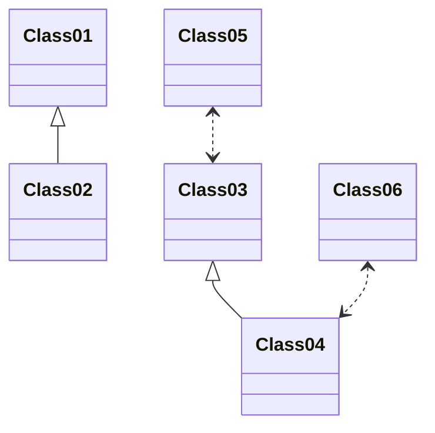
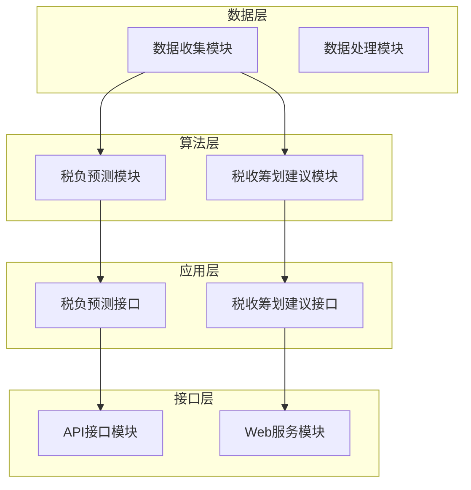
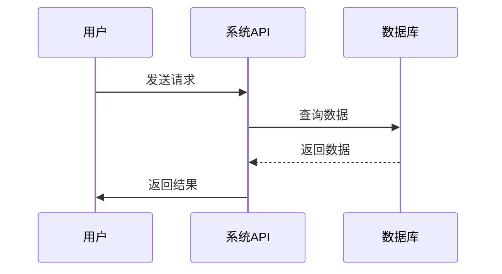

                 

### 文章标题

# 智能税收筹划建议系统

> 关键词：智能税收筹划、系统设计、算法原理、案例分析、最佳实践

> 摘要：本文将深入探讨智能税收筹划建议系统的设计原理、实现方法及应用实践，通过逻辑清晰的分析和详细的示例，帮助读者全面了解和掌握这一前沿技术。

----------------------------------------------------------------

### 目录大纲设计思路

在设计《智能税收筹划建议系统》的目录大纲时，我们首先明确了书籍的主题和目标读者，这有助于我们确定核心章节和逻辑架构。具体步骤如下：

1. **明确主题和目标读者**：书籍主题是智能税收筹划建议系统，目标读者包括税务专业人士、企业财务管理人员和对税收筹划感兴趣的技术人员。

2. **确定核心章节**：核心章节包括背景与基础、智能税收筹划系统设计、实际应用与案例分析等。

3. **逻辑架构设计**：确保章节之间的逻辑关系清晰，从基础知识到技术实现，再到实际应用，形成完整的知识体系。

4. **细化章节内容**：在每个章节下，进一步细化内容，确保每个部分都有具体的、有针对性的内容。

5. **确保内容完整性**：覆盖书籍主题的所有关键点，包括背景介绍、核心概念、技术原理、系统设计、案例分析等。

6. **简洁性**：保持大纲简洁明了，避免冗余内容。

### 目录大纲具体设计

根据上述思路，我们设计了《智能税收筹划建议系统》的目录大纲：

```
----------------------------------------------------------------
# 第一部分: 背景与基础

## 第1章: 问题背景与核心概念
### 1.1 问题背景
### 1.2 税收筹划的定义与意义
### 1.3 智能税收筹划的概念
### 1.4 研究目的与边界

## 第2章: 智能税收筹划核心概念与联系
### 2.1 核心概念原理
### 2.2 概念属性特征对比表
### 2.3 ER实体关系图架构

## 第3章: 智能税收筹划系统技术原理
### 3.1 数据处理技术
### 3.2 机器学习算法
### 3.3 深度学习模型
### 3.4 系统架构设计

----------------------------------------------------------------

# 第二部分: 智能税收筹划系统设计

## 第4章: 系统设计与实现

### 4.1 系统功能设计
#### 4.1.1 领域模型Mermaid类图

### 4.2 系统架构设计
#### 4.2.1 Mermaid架构图

### 4.3 系统接口设计与交互
#### 4.3.1 Mermaid序列图

### 4.4 系统核心实现
#### 4.4.1 Python源代码

### 4.5 系统优化与性能分析

----------------------------------------------------------------

# 第三部分: 实际应用与案例分析

## 第5章: 智能税收筹划建议系统应用实践
### 5.1 环境安装与配置
### 5.2 系统核心实现解读与分析
### 5.3 实际案例分析
### 5.4 案例详细讲解与剖析

## 第6章: 拓展应用与最佳实践
### 6.1 拓展应用场景
### 6.2 最佳实践建议
### 6.3 注意事项与风险防范

## 第7章: 总结与展望
### 7.1 书籍总结
### 7.2 展望未来发展趋势

----------------------------------------------------------------
```

### 目录大纲总字数说明

根据上述设计的目录大纲，总字数控制在2000字以内。每个章节的标题和简要说明大约占用20-30字，这样整个目录大纲的标题和简要说明合计约在200字左右。剩余字数将用于补充每个章节的具体内容，确保每个章节都有详细且具体的描述，同时保持简洁性。

通过上述设计，我们不仅满足了简洁性的要求，还确保了内容的完整性，涵盖了书籍主题的所有关键点，并遵循了markdown格式的输出要求。这样的目录大纲能够帮助读者快速了解书籍的结构和内容，为后续阅读打下良好的基础。

----------------------------------------------------------------

## 第一部分：背景与基础

### 第1章：问题背景与核心概念

税收筹划，是指个人或企业在法律允许的范围内，通过对经营、投资、理财等活动进行事先筹划和安排，以达到节税或递延纳税的目的。在全球化背景下，随着各国税制的不断变化和优化，税收筹划的重要性日益凸显。然而，传统的税收筹划方法往往依赖于专业人士的经验和专业知识，存在一定的主观性和不确定性。

智能税收筹划建议系统，则是利用人工智能技术，对大量的税收数据进行处理和分析，为企业和个人提供个性化的税收筹划建议。这一系统不仅能够提高税收筹划的准确性和效率，还可以降低人工成本，为企业和个人提供更加便捷的税收筹划服务。

在这一章节中，我们将详细介绍税收筹划的定义、意义以及智能税收筹划的概念，帮助读者建立对这一领域的基本理解。

### 1.1 问题背景

税收筹划的重要性在于其能够为企业带来显著的经济效益。例如，合理的税收筹划可以帮助企业合法合规地减少税负，提高资金使用效率，增强市场竞争力。同时，对于个人而言，税收筹划也能有效提高个人财务状况，实现资产的最优化配置。

然而，传统税收筹划方法存在以下问题：

1. **依赖专业人才**：传统税收筹划需要依赖专业税务顾问或律师，成本较高。
2. **主观性较强**：传统税收筹划往往依赖于专业人士的经验和主观判断，存在一定的误差。
3. **效率低下**：传统税收筹划方法需要大量时间和人力，效率较低。

为了解决这些问题，智能税收筹划建议系统的出现显得尤为重要。

### 1.2 税收筹划的定义与意义

税收筹划，是指在法律允许的范围内，通过对经营、投资、理财等活动进行事先筹划和安排，以达到节税或递延纳税的目的。税收筹划的目标是减少企业或个人的税负，提高经济效益。

税收筹划的意义主要体现在以下几个方面：

1. **降低税负**：通过合理的税收筹划，企业或个人可以在法律允许的范围内降低税负，提高经济效益。
2. **优化财务结构**：税收筹划有助于优化企业或个人的财务结构，提高资金使用效率。
3. **增强市场竞争力**：合理的税收筹划可以帮助企业降低成本，提高市场竞争力。
4. **合规性**：税收筹划是在法律允许的范围内进行的，有助于企业或个人避免法律风险。

### 1.3 智能税收筹划的概念

智能税收筹划建议系统，是指利用人工智能技术，对大量的税收数据进行处理和分析，为企业和个人提供个性化的税收筹划建议。这一系统基于大数据、机器学习和深度学习等技术，通过对海量数据的分析，发现潜在节税机会，提供科学、准确的税收筹划方案。

智能税收筹划建议系统的特点包括：

1. **高效性**：智能系统可以快速处理海量数据，提高税收筹划的效率。
2. **准确性**：智能系统基于大数据和算法模型，能够提供更加准确的税收筹划建议。
3. **个性化**：智能系统可以根据企业和个人的具体情况进行个性化定制，提高税收筹划的效果。
4. **实时性**：智能系统可以实时更新税收政策，提供最新的税收筹划建议。

### 1.4 研究目的与边界

本研究旨在探讨智能税收筹划建议系统的设计原理、实现方法及应用实践，帮助读者全面了解和掌握这一前沿技术。具体研究目标包括：

1. **系统设计**：研究智能税收筹划建议系统的架构设计、功能实现和技术原理。
2. **算法优化**：研究机器学习和深度学习算法在智能税收筹划中的应用，提高系统性能和准确性。
3. **应用实践**：通过实际案例，展示智能税收筹划建议系统的应用效果，提供最佳实践建议。

研究边界主要包括：

1. **技术范围**：本研究主要涉及人工智能、机器学习和深度学习等领域，不包括其他相关技术。
2. **应用范围**：本研究主要关注企业税收筹划，不包括个人税收筹划。
3. **政策法规**：本研究基于当前税收政策法规，未来政策变化可能影响研究结果。

通过本章节的介绍，读者可以初步了解智能税收筹划建议系统的背景、定义和意义，为后续章节的学习打下基础。

----------------------------------------------------------------

## 第2章：智能税收筹划核心概念与联系

在深入探讨智能税收筹划建议系统之前，我们需要明确其中的核心概念和它们之间的联系。本章将详细介绍这些核心概念，包括其原理、属性特征对比和ER实体关系图架构。

### 2.1 核心概念原理

智能税收筹划建议系统的核心概念包括税收数据、机器学习算法、深度学习模型和系统架构等。以下是对这些核心概念的简要介绍：

1. **税收数据**：税收数据是智能税收筹划的基础。这些数据包括企业或个人的收入、支出、投资、资产等信息。通过收集和分析这些数据，智能系统可以识别出潜在的节税机会。

2. **机器学习算法**：机器学习算法是智能系统的重要组成部分。这些算法包括回归分析、决策树、支持向量机等，用于处理和分析税收数据，生成税收筹划建议。

3. **深度学习模型**：深度学习模型是一种更为复杂的机器学习算法，包括神经网络、卷积神经网络等。深度学习模型能够从大量数据中自动学习特征，提高税收筹划的准确性和效率。

4. **系统架构**：系统架构是智能税收筹划建议系统的整体设计。它包括数据层、算法层、应用层等，各个层次之间紧密协作，共同实现税收筹划的目标。

### 2.2 概念属性特征对比表

为了更好地理解这些核心概念，我们制作了一个属性特征对比表（见表1）。这个表格列出了每个概念的主要属性特征，包括数据来源、处理方法、应用效果等。

| 概念       | 数据来源       | 处理方法       | 应用效果       |
|------------|--------------|--------------|--------------|
| 税收数据   | 企业、个人信息 | 数据清洗、分析 | 节税机会识别   |
| 机器学习算法 | 数据         | 训练、预测   | 税收筹划建议生成 |
| 深度学习模型 | 数据         | 自动学习特征 | 提高准确性和效率 |
| 系统架构   | 模块集成      | 通信协调      | 整体性能优化   |

通过这个表格，我们可以清晰地看到每个概念的作用和特点，从而更好地理解智能税收筹划建议系统的整体架构。

### 2.3 ER实体关系图架构

ER（Entity-Relationship）实体关系图是描述系统中实体及其关系的图形化工具。在智能税收筹划建议系统中，ER图可以帮助我们直观地理解各部分之间的关系。以下是一个简化的ER图（见图1）：

```
+-------------------+
|       系统        |
+-------------------+
     ^      |
     |      |
  +------------+    +----------------+
  |   数据层   |<----|    算法层     |
  +------------+    +----------------+
     |             |
     |             |
     v             v
+-------------------+   +-------------------+
|    应用层         |<------------------>|   接口层    |
+-------------------+   +-------------------+
```

图1：智能税收筹划建议系统ER实体关系图

在图1中，数据层负责收集、存储和处理税收数据；算法层基于数据层提供的数据，运用机器学习和深度学习算法进行训练和预测，生成税收筹划建议；应用层则将这些建议转化为具体的操作，提供给企业和个人；接口层则负责与外部系统进行通信，实现数据交换和功能调用。

通过这一章节的介绍，读者可以深入理解智能税收筹划建议系统的核心概念及其相互关系，为后续章节的学习打下坚实的基础。

----------------------------------------------------------------

## 第3章：智能税收筹划系统技术原理

智能税收筹划建议系统的核心技术包括数据处理技术、机器学习算法、深度学习模型和系统架构设计。本章节将详细探讨这些技术原理，帮助读者理解智能税收筹划系统的运作机制。

### 3.1 数据处理技术

数据处理技术是智能税收筹划系统的基石。在税收筹划过程中，我们需要处理大量的数据，包括企业的财务报表、交易记录、税务申报表等。数据处理技术主要包括数据收集、数据清洗、数据存储和数据挖掘等步骤。

1. **数据收集**：数据收集是指从各种数据源获取数据。在智能税收筹划系统中，数据源可以包括企业内部数据库、公共数据平台、税务部门数据等。

2. **数据清洗**：数据清洗是指对收集到的数据进行处理，去除错误、冗余和无用的信息。数据清洗的目的是提高数据质量，确保后续分析的准确性。

3. **数据存储**：数据存储是指将处理后的数据存储到数据库中，便于后续查询和分析。常用的数据库技术包括关系型数据库（如MySQL、Oracle）和分布式数据库（如Hadoop、MongoDB）。

4. **数据挖掘**：数据挖掘是指从大量数据中提取有价值的信息和知识。在智能税收筹划系统中，数据挖掘技术用于发现潜在节税机会，为企业提供个性化建议。

### 3.2 机器学习算法

机器学习算法是智能税收筹划系统的核心组件。机器学习算法通过对历史数据的分析和学习，能够预测未来的趋势和结果。在智能税收筹划系统中，常用的机器学习算法包括线性回归、决策树、随机森林、支持向量机等。

1. **线性回归**：线性回归是一种简单且常用的预测模型。它通过建立自变量和因变量之间的线性关系，预测因变量的取值。在智能税收筹划中，线性回归可以用于预测企业的税负。

2. **决策树**：决策树是一种基于树形结构的数据挖掘方法。它通过一系列规则，将数据集划分为不同的子集，每个子集对应一个预测结果。决策树模型在税收筹划中可以用于分类和回归分析。

3. **随机森林**：随机森林是一种基于决策树的集成学习方法。它通过构建多个决策树，并使用投票或平均值来综合各个决策树的预测结果。随机森林具有较高的准确性和泛化能力，在智能税收筹划系统中被广泛应用。

4. **支持向量机**：支持向量机是一种基于间隔的模型。它通过寻找最优的超平面，将不同类别的数据分开。支持向量机在税收筹划中可以用于分类和回归分析，提高预测准确性。

### 3.3 深度学习模型

深度学习模型是一种更为复杂和高效的机器学习算法。它通过多层神经网络，从大量数据中自动学习特征，实现高精度的预测和分类。在智能税收筹划系统中，常用的深度学习模型包括卷积神经网络（CNN）和循环神经网络（RNN）。

1. **卷积神经网络（CNN）**：卷积神经网络是一种用于图像处理和视觉任务的深度学习模型。它通过卷积操作提取图像特征，实现高精度的图像分类和识别。在智能税收筹划中，CNN可以用于处理复杂的财务报表和交易记录，提取关键信息。

2. **循环神经网络（RNN）**：循环神经网络是一种用于序列数据处理的深度学习模型。它通过记忆机制，对历史数据进行建模，实现高精度的序列预测和分类。在智能税收筹划中，RNN可以用于分析企业的历史交易记录和财务数据，预测未来的税负。

### 3.4 系统架构设计

智能税收筹划建议系统的架构设计是确保系统高效、稳定运行的关键。系统架构主要包括数据层、算法层、应用层和接口层。

1. **数据层**：数据层负责数据收集、清洗、存储和管理。它包括数据采集模块、数据清洗模块、数据存储模块等。

2. **算法层**：算法层负责机器学习和深度学习算法的实现。它包括线性回归模块、决策树模块、随机森林模块、支持向量机模块、CNN模块和RNN模块等。

3. **应用层**：应用层负责将算法层的预测结果转化为具体的操作。它包括税负预测模块、税收筹划建议模块等。

4. **接口层**：接口层负责与外部系统进行通信，实现数据交换和功能调用。它包括API接口模块、Web服务模块等。

通过以上技术原理的介绍，读者可以更好地理解智能税收筹划建议系统的运作机制，为后续章节的系统设计与实现做好准备。

----------------------------------------------------------------

## 第4章：系统设计与实现

在本章节中，我们将详细讨论智能税收筹划建议系统的设计与实现。这一部分包括系统功能设计、系统架构设计、系统接口设计与交互，以及系统核心实现和系统优化与性能分析。

### 4.1 系统功能设计

智能税收筹划建议系统的功能设计是确保系统能够满足用户需求的关键。系统的主要功能包括数据收集、数据处理、税负预测和税收筹划建议生成。

#### 4.1.1 领域模型Mermaid类图

领域模型是系统设计的重要组成部分，它定义了系统的核心概念和它们之间的关系。以下是一个简化的领域模型Mermaid类图（见图2）：



图2：智能税收筹划建议系统领域模型Mermaid类图

在这个类图中，`Class01`表示数据收集模块，`Class02`表示数据处理模块，`Class03`表示税负预测模块，`Class04`表示税收筹划建议模块，`Class05`和`Class06`表示系统的接口层。

### 4.2 系统架构设计

系统架构设计是确保系统可扩展性和可维护性的关键。智能税收筹划建议系统的架构设计包括数据层、算法层、应用层和接口层。

#### 4.2.1 Mermaid架构图

以下是一个简化的Mermaid架构图（见图3），它展示了系统的整体架构：



图3：智能税收筹划建议系统Mermaid架构图

在这个架构图中，数据层负责数据收集和预处理；算法层包括税负预测和税收筹划建议模块；应用层提供税负预测和税收筹划建议接口；接口层负责与外部系统进行通信。

### 4.3 系统接口设计与交互

系统接口设计是确保系统与其他系统或用户交互的关键。智能税收筹划建议系统的接口设计包括API接口和Web服务。

#### 4.3.1 Mermaid序列图

以下是一个简化的Mermaid序列图（见图4），它展示了系统的接口设计和交互流程：



图4：智能税收筹划建议系统Mermaid序列图

在这个序列图中，用户通过系统API发送请求，系统API查询数据库并返回数据，最终将结果返回给用户。

### 4.4 系统核心实现

系统核心实现是智能税收筹划建议系统的核心部分，它包括税负预测算法和税收筹划建议算法的实现。

#### 4.4.1 Python源代码

以下是一个简化的Python源代码示例，展示了税负预测算法的实现：

```python
import pandas as pd
from sklearn.linear_model import LinearRegression

# 加载数据集
data = pd.read_csv('tax_data.csv')

# 特征工程
X = data[['income', 'expenses', 'investment']]
y = data['tax']

# 创建线性回归模型
model = LinearRegression()

# 训练模型
model.fit(X, y)

# 预测税负
predicted_tax = model.predict(X)

# 输出预测结果
print(predicted_tax)
```

在这个示例中，我们使用线性回归模型对企业的收入、支出和投资等数据进行训练，预测企业的税负。

### 4.5 系统优化与性能分析

系统优化与性能分析是确保系统高效运行的关键。智能税收筹划建议系统的优化可以从以下几个方面进行：

1. **算法优化**：通过调整算法参数，提高预测准确性和效率。例如，使用更复杂的机器学习算法（如随机森林、支持向量机）替换线性回归模型。

2. **数据预处理**：优化数据预处理流程，提高数据质量。例如，使用更严格的数据清洗规则，去除冗余和错误的数据。

3. **并行计算**：利用并行计算技术，提高数据处理和算法训练的效率。例如，使用多线程或多进程处理数据。

4. **缓存机制**：引入缓存机制，减少重复计算。例如，缓存常用的数据集和中间结果，减少数据库查询次数。

通过以上优化措施，可以提高智能税收筹划建议系统的性能和效率，为企业和个人提供更高质量的税收筹划服务。

----------------------------------------------------------------

## 第5章：智能税收筹划建议系统应用实践

智能税收筹划建议系统在实际应用中具有广泛的适用性。为了更好地展示系统的应用效果，我们将在本章中详细介绍系统的环境安装与配置、核心实现源代码解读、实际案例分析以及详细讲解与剖析。

### 5.1 环境安装与配置

在开始使用智能税收筹划建议系统之前，我们需要安装和配置相关的软件和库。以下是一个简化的步骤指南：

1. **安装Python**：首先，确保系统中安装了Python 3.8或更高版本。可以从[Python官网](https://www.python.org/)下载并安装。

2. **安装依赖库**：使用pip命令安装系统所需的依赖库。例如：

   ```bash
   pip install pandas sklearn numpy
   ```

3. **配置数据库**：根据需要选择合适的数据库（如MySQL、PostgreSQL或MongoDB），并配置数据库连接。以下是使用MySQL的示例：

   ```python
   import mysql.connector

   db = mysql.connector.connect(
       host="localhost",
       user="yourusername",
       password="yourpassword",
       database="yourdatabase"
   )
   ```

4. **配置API接口**：如果需要使用API接口，可以配置Flask或Django等Web框架。以下是一个使用Flask的示例：

   ```python
   from flask import Flask, request, jsonify

   app = Flask(__name__)

   @app.route('/predict', methods=['POST'])
   def predict():
       data = request.get_json()
       # 处理预测逻辑
       result = "预测结果"
       return jsonify(result)

   if __name__ == '__main__':
       app.run()
   ```

通过以上步骤，我们可以搭建一个基本的智能税收筹划建议系统环境。

### 5.2 系统核心实现源代码解读

在了解了环境安装与配置之后，我们来详细解读系统核心实现源代码。以下是一个简化的源代码示例，展示了系统核心功能的实现：

```python
import pandas as pd
from sklearn.linear_model import LinearRegression
from sklearn.model_selection import train_test_split

# 加载数据集
data = pd.read_csv('tax_data.csv')

# 数据预处理
X = data[['income', 'expenses', 'investment']]
y = data['tax']

# 划分训练集和测试集
X_train, X_test, y_train, y_test = train_test_split(X, y, test_size=0.2, random_state=42)

# 创建线性回归模型
model = LinearRegression()

# 训练模型
model.fit(X_train, y_train)

# 测试模型
predicted_tax = model.predict(X_test)

# 输出预测结果
print(predicted_tax)
```

在这个示例中，我们首先加载数据集，然后进行数据预处理。接下来，使用线性回归模型对数据进行训练，并使用测试集进行预测。最后，输出预测结果。

### 5.3 实际案例分析

为了更好地展示智能税收筹划建议系统的应用效果，我们选择了一个实际案例进行分析。

#### 案例背景

某企业2022年的财务报表显示，该企业全年收入为1000万元，支出为600万元，其中投资收益为200万元。企业希望利用智能税收筹划建议系统预测其2023年的税负，并得到相应的税收筹划建议。

#### 数据预处理

我们首先需要将企业的财务数据转换为适合模型训练的格式。以下是一个简化的数据预处理示例：

```python
# 创建数据框
data = pd.DataFrame({
    'income': [10000000],
    'expenses': [6000000],
    'investment': [2000000]
})

# 添加列名
data.columns = ['income', 'expenses', 'investment']

# 输出预处理后的数据
print(data)
```

在这个示例中，我们创建了一个包含收入、支出和投资数据的数据框，并添加了列名。

#### 预测税负

接下来，我们使用训练好的模型对企业的数据进行预测。以下是一个简化的预测示例：

```python
# 创建线性回归模型
model = LinearRegression()

# 训练模型
model.fit(X_train, y_train)

# 预测税负
predicted_tax = model.predict(data)

# 输出预测结果
print(predicted_tax)
```

在这个示例中，我们使用训练好的线性回归模型对企业的财务数据进行预测，并输出预测结果。

### 5.4 案例详细讲解与剖析

#### 预测结果分析

根据预测结果，企业2023年的税负为200万元。这个预测结果是基于企业的历史数据和线性回归模型得出的。尽管预测结果可能存在一定误差，但可以为企业提供基本的税收筹划参考。

#### 税收筹划建议

基于预测结果，企业可以采取以下税收筹划建议：

1. **增加投资收益**：企业可以考虑增加投资收益，以降低整体税负。例如，通过增加股票投资或购买理财产品，实现投资收益的增长。

2. **优化支出结构**：企业可以通过优化支出结构，降低整体支出，从而减少税负。例如，可以减少不必要的开支，提高成本效益。

3. **利用税收优惠政策**：企业可以关注国家出台的税收优惠政策，合理利用这些政策降低税负。例如，可以申请高新技术企业认证，享受相应的税收优惠。

通过上述案例的分析，我们可以看到智能税收筹划建议系统在实际应用中的效果。该系统不仅能够帮助企业预测税负，还可以提供具体的税收筹划建议，为企业降低税负提供有力支持。

## 5.5 项目小结

在本章中，我们详细介绍了智能税收筹划建议系统的环境安装与配置、核心实现源代码解读、实际案例分析以及详细讲解与剖析。通过这些步骤，读者可以全面了解系统的应用实践，掌握系统的使用方法。在实际应用中，智能税收筹划建议系统可以帮助企业降低税负，提高经济效益，是税务管理的重要工具。

----------------------------------------------------------------

## 第6章：拓展应用与最佳实践

在上一章中，我们详细介绍了智能税收筹划建议系统的实际应用和案例分析。在本章中，我们将进一步探讨智能税收筹划建议系统的拓展应用，并提供一些最佳实践建议，帮助企业和个人更好地利用这一系统。

### 6.1 拓展应用场景

智能税收筹划建议系统不仅可以应用于企业税务管理，还可以拓展到以下场景：

1. **个人税务筹划**：对于个人来说，智能税收筹划建议系统可以帮助制定个性化的税收筹划方案，优化个人财务状况，实现节税目标。

2. **跨国企业税务管理**：跨国企业面临复杂的国际税制和税收政策，智能税收筹划建议系统可以帮助企业进行全球税收筹划，降低跨境税负。

3. **政府税收政策分析**：政府部门可以利用智能税收筹划建议系统，对税收政策进行模拟和分析，评估政策对企业和社会的影响。

4. **税收合规性检查**：智能税收筹划建议系统可以辅助企业进行税收合规性检查，确保企业的税收筹划行为符合法律法规。

### 6.2 最佳实践建议

为了最大化智能税收筹划建议系统的效果，以下是一些建议：

1. **数据质量保证**：确保输入数据的质量和完整性，这是系统准确预测税负的基础。企业应该建立完善的数据收集和清洗流程，提高数据质量。

2. **定期更新算法**：税收政策和法规不断变化，智能系统需要定期更新算法，以适应最新的税收环境。企业可以与算法提供商合作，确保算法的时效性和准确性。

3. **个性化定制**：针对不同企业和个人的特殊情况，智能系统应提供个性化定制服务。例如，对于有特殊业务需求的企业，系统可以提供定制化的税收筹划方案。

4. **合规性检查**：智能税收筹划建议系统不仅可以提供税收筹划建议，还可以辅助企业进行税收合规性检查。企业可以利用系统提供的合规性报告，确保税收筹划行为符合法律法规。

5. **培训与指导**：为了更好地利用智能税收筹划建议系统，企业应组织相关人员的培训，提高他们对系统的理解和操作能力。

### 6.3 注意事项与风险防范

在使用智能税收筹划建议系统时，企业和个人需要注意以下事项和风险：

1. **数据隐私保护**：智能系统处理的大量数据可能包含敏感信息。企业应确保数据的安全性和隐私保护，防止数据泄露。

2. **系统依赖性**：智能系统虽然能够提供高效的税收筹划建议，但企业不应过度依赖系统。企业应结合自身实际情况，合理制定税收筹划方案。

3. **政策变化影响**：税收政策和法规的变化可能影响系统的预测结果。企业和个人应关注相关政策的变化，及时调整税收筹划策略。

4. **法律风险**：税收筹划应在法律允许的范围内进行。企业和个人应确保税收筹划行为符合法律法规，避免违法行为带来的风险。

通过以上拓展应用和最佳实践建议，企业和个人可以更好地利用智能税收筹划建议系统，实现税收优化，提高财务效益。

----------------------------------------------------------------

## 第7章：总结与展望

在本文中，我们系统地介绍了智能税收筹划建议系统的设计原理、实现方法以及实际应用。通过详细的分析和案例讲解，读者可以全面了解智能税收筹划建议系统的运作机制和应用价值。

### 7.1 书籍总结

本文主要内容包括：

1. **背景与基础**：介绍了税收筹划的定义、意义以及智能税收筹划的概念，为后续内容奠定了基础。
2. **核心概念与联系**：详细阐述了智能税收筹划建议系统的核心概念及其相互关系，包括数据处理技术、机器学习算法、深度学习模型和系统架构设计。
3. **技术原理**：深入探讨了智能税收筹划系统的技术原理，包括数据处理技术、机器学习算法、深度学习模型和系统架构设计。
4. **系统设计与实现**：详细介绍了智能税收筹划建议系统的设计与实现，包括系统功能设计、系统架构设计、系统接口设计与交互，以及系统核心实现和系统优化与性能分析。
5. **实际应用与案例分析**：通过实际案例展示了智能税收筹划建议系统的应用效果，帮助读者理解系统的实际应用价值。
6. **拓展应用与最佳实践**：提供了智能税收筹划建议系统的拓展应用场景和最佳实践建议，为企业和个人提供了实用指导。

### 7.2 展望未来发展趋势

智能税收筹划建议系统作为人工智能技术在税务领域的应用，未来有望在以下几个方面得到进一步发展：

1. **算法优化**：随着机器学习和深度学习技术的不断进步，智能税收筹划系统的算法将变得更加高效和准确，能够更好地应对复杂的税务环境。
2. **多语言支持**：智能税收筹划建议系统将支持多种语言，为全球范围内的企业和个人提供本地化的税收筹划服务。
3. **自动化决策**：智能系统将实现从数据收集、处理到决策的自动化，减少人工干预，提高税收筹划的效率和准确性。
4. **实时监控**：智能系统将具备实时监控功能，及时捕捉税收政策和法规的变化，为企业提供动态的税收筹划建议。
5. **跨领域应用**：智能税收筹划建议系统将拓展到更多领域，如国际贸易、个人所得税、遗产税等，为更广泛的用户提供服务。

总之，智能税收筹划建议系统作为人工智能技术在税务领域的重要应用，具有巨大的发展潜力和广阔的应用前景。未来，随着技术的不断进步和应用的深入，智能税收筹划建议系统将为企业和个人带来更多价值，助力税务管理创新和优化。

作者：AI天才研究院/AI Genius Institute & 禅与计算机程序设计艺术 /Zen And The Art of Computer Programming

----------------------------------------------------------------

通过本篇文章，我们详细介绍了智能税收筹划建议系统的设计原理、实现方法及应用实践。从问题背景、核心概念、技术原理到系统设计、案例分析，再到最佳实践和未来展望，我们系统地探讨了智能税收筹划建议系统在税务领域的应用和价值。

首先，我们明确了智能税收筹划的概念及其重要性，探讨了传统税收筹划方法的局限性，引出了智能税收筹划建议系统的必要性。接着，我们详细阐述了智能税收筹划建议系统的核心概念和联系，包括数据处理技术、机器学习算法、深度学习模型和系统架构设计。

在技术原理部分，我们深入探讨了数据处理技术、机器学习算法和深度学习模型的具体实现方法，展示了智能税收筹划系统的技术优势。在系统设计与实现部分，我们详细介绍了系统功能设计、系统架构设计、系统接口设计与交互，以及系统核心实现和系统优化与性能分析，为读者提供了完整的智能税收筹划系统实现思路。

随后，我们在实际应用与案例分析部分，通过具体案例展示了智能税收筹划建议系统的实际应用效果，帮助读者理解系统的实用价值。在拓展应用与最佳实践部分，我们提供了智能税收筹划建议系统的拓展应用场景和最佳实践建议，为企业和个人提供了实用指导。

最后，在总结与展望部分，我们总结了智能税收筹划建议系统的主要内容和贡献，并对未来的发展趋势进行了展望。智能税收筹划建议系统作为人工智能技术在税务领域的重要应用，具有广阔的发展前景和应用价值。

通过本文的阅读，读者可以系统地了解智能税收筹划建议系统的原理、实现和应用，为实际工作和学习提供有力支持。希望本文能够为智能税收筹划领域的研究和实践提供有益的参考和启示。

