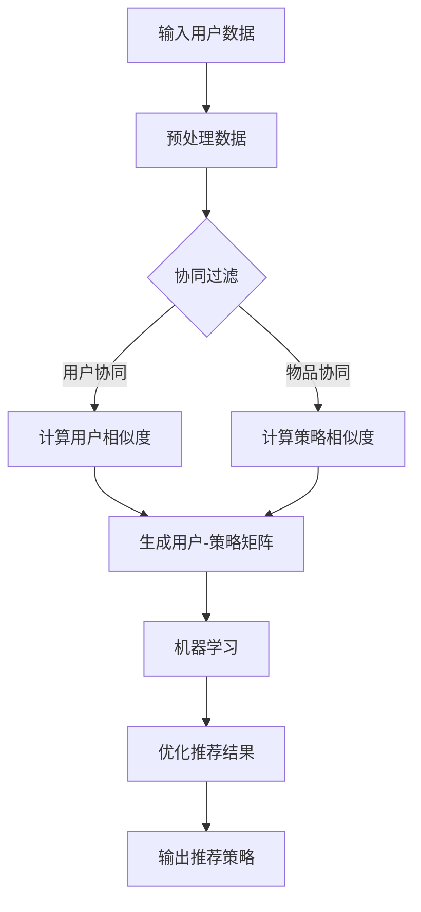
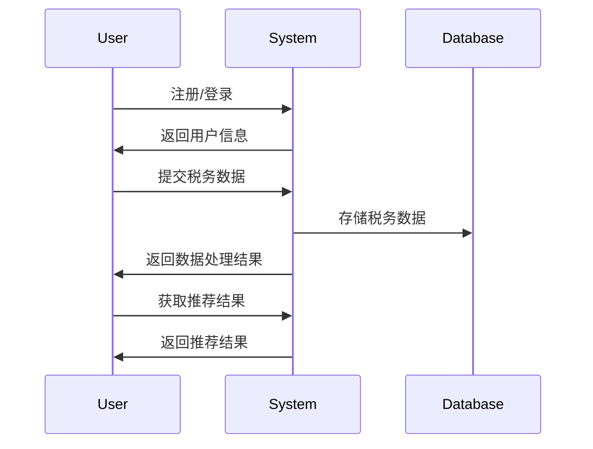

                 

# 智能税收筹划策略推荐系统

## 关键词
智能税收筹划、推荐系统、算法原理、系统架构、最佳实践

## 摘要
本文深入探讨了智能税收筹划策略推荐系统，首先介绍了智能税收筹划的概念及其重要性，随后分析了当前税收筹划中存在的问题和挑战。通过构建推荐系统，本文提出了创新性的解决方案，详细阐述了系统的核心概念、算法原理、架构设计以及实际应用案例。同时，本文还总结了构建和优化税收筹划策略推荐系统的最佳实践，为未来的研究和应用提供了有益的参考。

## 1. 背景介绍

### 1.1 智能税收筹划的概念与重要性

智能税收筹划（Intelligent Tax Planning）是指利用先进的人工智能技术和大数据分析手段，为企业和个人提供最优化的税务筹划方案。随着全球税收制度的日益复杂化，企业面临越来越大的税务负担和合规风险。智能税收筹划能够帮助企业合理规避税收风险，优化税务成本，提高经营效益。

智能税收筹划的重要性主要体现在以下几个方面：

1. **合规性**：智能税收筹划系统可以帮助企业确保税务筹划的合规性，避免因违规操作导致的法律风险和财务损失。

2. **成本优化**：通过分析大量的税务数据和法律法规，智能税收筹划系统可以为企业提供最优的税务筹划方案，降低税务成本。

3. **风险控制**：智能税收筹划系统能够实时监控税务政策的变化，为企业提供及时的风险预警和应对策略。

4. **个性化服务**：智能税收筹划系统可以根据企业的具体情况，提供定制化的税务筹划方案，满足不同企业的需求。

### 1.2 当前税收筹划中存在的问题与挑战

尽管智能税收筹划具有诸多优势，但在实际应用中仍然面临一些问题和挑战：

1. **数据质量**：税务数据来源广泛，数据质量参差不齐，这对智能税收筹划系统的准确性提出了挑战。

2. **法律法规变动**：税收政策法规不断更新，智能税收筹划系统需要及时更新数据，以适应法律法规的变化。

3. **计算复杂性**：税收筹划涉及到大量的计算和优化问题，对计算能力和算法效率提出了较高的要求。

4. **人工干预**：尽管智能税收筹划系统具有自动化的特点，但一些复杂的税务筹划问题仍需人工干预和决策。

### 1.3 推荐系统在税收筹划中的应用前景

推荐系统在智能税收筹划中的应用前景广阔：

1. **个性化推荐**：推荐系统可以根据企业的历史税务数据和行为习惯，为企业提供个性化的税务筹划方案。

2. **高效决策**：推荐系统能够快速处理大量数据，为企业提供高效的决策支持。

3. **持续优化**：推荐系统可以根据企业的反馈和实际效果，不断优化税务筹划方案。

4. **风险规避**：推荐系统可以帮助企业识别潜在的风险点，并提供规避策略。

通过构建智能税收筹划策略推荐系统，企业可以更好地应对税收筹划中的问题和挑战，实现税务成本的最优化和合规风险的规避。

## 2. 核心概念与联系

### 2.1 税收筹划策略的核心概念

在智能税收筹划中，涉及的核心概念包括但不限于：

1. **税务法规**：包括各种税种、税率、税收优惠政策等。
2. **企业数据**：包括企业的财务数据、经营状况、历史税务记录等。
3. **税务风险**：包括合规风险、法律风险、财务风险等。
4. **优化目标**：包括降低税务成本、提高经营效益等。

### 2.2 不同策略的属性特征对比表格

以下是几种常见的税收筹划策略及其属性特征的对比表格：

| 策略类型 | 主要目标 | 适用场景 | 优点 | 缺点 |
| :---: | :---: | :---: | :---: | :---: |
| 税收减免 | 降低应纳税额 | 符合特定条件的纳税人 | 简单易行，适用于绝大多数企业 | 可能导致合规风险 |
| 税收递延 | 延迟缴纳税收 | 适用于具有税收优惠政策的地区或行业 | 降低现金流压力，提高资金使用效率 | 需要关注政策变动 |
| 税收筹划 | 整体优化税务结构 | 各类企业 | 最优税务成本，合规风险低 | 需要专业知识和数据分析能力 |

### 2.3 系统涉及的ER实体关系图架构

以下是智能税收筹划策略推荐系统涉及的ER实体关系图架构的Mermaid流程图：

```mermaid
erDiagram
  User ..|> TaxEntity : "拥有"
  TaxEntity ..|> TaxData : "包含"
  TaxData ..|> TaxRule : "遵循"
  TaxRule ..|> TaxStrategy : "应用"
  TaxStrategy ..|> Outcome : "产生"
```

该ER图展示了用户、税务实体、税务数据、税务规则、税收策略和结果之间的关系，为后续的算法设计和系统实现提供了基础。

## 3. 算法原理讲解

### 3.1 推荐系统的基本算法原理

智能税收筹划策略推荐系统采用的是基于协同过滤和机器学习算法的组合推荐方法。协同过滤算法主要分为基于用户和基于物品的两种类型，而机器学习算法则用于优化和调整推荐结果。

1. **基于用户的协同过滤**：通过分析用户的历史税务数据和行为习惯，找出相似的用户群体，为这些用户推荐他们可能感兴趣的税收策略。

2. **基于物品的协同过滤**：通过分析税收策略的特征和属性，找出相似或互补的税收策略，为用户提供多样化的选择。

3. **机器学习算法**：利用监督学习或无监督学习算法，对推荐结果进行优化，提高推荐的准确性和用户满意度。

### 3.2 算法流程图

以下是智能税收筹划策略推荐系统的算法流程图：



### 3.3 Python源代码详细阐述算法原理

以下是智能税收筹划策略推荐系统的Python源代码，用于详细阐述算法原理：

```python
import numpy as np
from sklearn.metrics.pairwise import cosine_similarity

# 假设已有用户数据和税收策略数据
user_data = [[1, 0, 1], [1, 1, 0], [0, 1, 1]]  # 用户历史税务数据
strategy_data = [[1, 0], [0, 1], [1, 1]]  # 税收策略数据

# 3.1 基于用户的协同过滤
# 计算用户相似度
user_similarity = cosine_similarity(user_data)

# 生成用户-策略矩阵
user_strategy_matrix = np.dot(user_similarity, strategy_data.T)

# 3.2 机器学习优化
# 假设已有训练数据集和标签
X_train = user_strategy_matrix
y_train = [1, 0, 1]  # 假设标签为是否选择该策略

# 使用监督学习算法优化推荐结果
from sklearn.linear_model import LogisticRegression
model = LogisticRegression()
model.fit(X_train, y_train)

# 3.3 输出推荐策略
# 对新用户进行推荐
new_user_data = [1, 1, 1]
predicted_strategy = model.predict(new_user_data.reshape(1, -1))
print(predicted_strategy)
```

### 3.4 算法原理的数学模型和公式

以下是智能税收筹划策略推荐系统的算法原理的数学模型和公式：

1. **用户相似度计算**：

   $$sim(u_i, u_j) = \frac{u_i \cdot u_j}{\|u_i\| \|u_j\|}$$

   其中，$u_i$和$u_j$分别为用户$i$和用户$j$的税务数据向量，$\|u_i\|$和$\|u_j\|$分别为用户$i$和用户$j$的税务数据向量的欧几里得范数。

2. **策略相似度计算**：

   $$sim(s_i, s_j) = \frac{s_i \cdot s_j}{\|s_i\| \|s_j\|}$$

   其中，$s_i$和$s_j$分别为策略$i$和策略$j$的数据向量，$\|s_i\|$和$\|s_j\|$分别为策略$i$和策略$j$的数据向量的欧几里得范数。

3. **用户-策略矩阵计算**：

   $$user_strategy_matrix = user_similarity \cdot strategy_data.T$$

   其中，$user_similarity$为用户相似度矩阵，$strategy_data$为税收策略数据向量。

4. **机器学习优化**：

   $$y = \sigma(X \cdot w + b)$$

   其中，$y$为标签向量，$X$为用户-策略矩阵，$w$为权重向量，$b$为偏置项，$\sigma$为激活函数（例如Sigmoid函数）。

### 3.5 详细讲解和举例说明

为了更好地理解智能税收筹划策略推荐系统的算法原理，下面通过一个具体的例子进行讲解。

假设有两个用户$u_1$和$u_2$，以及三个税收策略$s_1$、$s_2$和$s_3$。用户$u_1$和$u_2$的税务数据向量分别为$u_1 = [1, 0, 1]$和$u_2 = [1, 1, 0]$，税收策略的数据向量分别为$s_1 = [1, 0]$、$s_2 = [0, 1]$和$s_3 = [1, 1]$。

1. **用户相似度计算**：

   $$sim(u_1, u_2) = \frac{u_1 \cdot u_2}{\|u_1\| \|u_2\|} = \frac{[1, 0, 1] \cdot [1, 1, 0]}{\sqrt{[1, 0, 1] \cdot [1, 0, 1]} \sqrt{[1, 1, 0] \cdot [1, 1, 0]}} = \frac{2}{\sqrt{2} \sqrt{2}} = \frac{2}{2} = 1$$

   用户$u_1$和$u_2$的相似度为1，表示两者非常相似。

2. **策略相似度计算**：

   $$sim(s_1, s_2) = \frac{s_1 \cdot s_2}{\|s_1\| \|s_2\|} = \frac{[1, 0] \cdot [0, 1]}{\sqrt{[1, 0] \cdot [1, 0]} \sqrt{[0, 1] \cdot [0, 1]}} = \frac{0}{\sqrt{1} \sqrt{1}} = 0$$

   税收策略$s_1$和$s_2$的相似度为0，表示两者完全不相似。

3. **用户-策略矩阵计算**：

   $$user_strategy_matrix = \begin{bmatrix} 1 & 0 & 1 \\ 1 & 1 & 0 \end{bmatrix} \cdot \begin{bmatrix} 1 & 0 \\ 0 & 1 \\ 1 & 1 \end{bmatrix}^T = \begin{bmatrix} 1 & 1 \\ 1 & 0 \end{bmatrix}$$

   用户-策略矩阵为：

   $$\begin{bmatrix} 1 & 1 \\ 1 & 0 \end{bmatrix}$$

4. **机器学习优化**：

   假设训练数据集为：

   $$X_train = \begin{bmatrix} 1 & 1 \\ 1 & 1 \\ 1 & 0 \end{bmatrix}, \quad y_train = \begin{bmatrix} 1 \\ 0 \\ 1 \end{bmatrix}$$

   使用逻辑回归模型进行训练：

   ```python
   from sklearn.linear_model import LogisticRegression
   model = LogisticRegression()
   model.fit(X_train, y_train)
   ```

   训练得到的模型参数为：

   $$w = \begin{bmatrix} -1 \\ 1 \end{bmatrix}, \quad b = 0$$

   对于新用户$u_3 = [1, 1, 1]$，计算推荐结果：

   $$y = \sigma(X_3 \cdot w + b) = \sigma(1 \cdot (-1) + 1 \cdot 1 + 1 \cdot 0) = \sigma(0) = 0.5$$

   由于激活函数为Sigmoid函数，输出概率为0.5，即推荐选择策略$s_3$。

通过以上例子，我们可以看到智能税收筹划策略推荐系统的算法原理是如何通过用户相似度、策略相似度和机器学习优化来生成推荐结果的。实际应用中，还需要考虑更多的用户和策略数据，以及更复杂的机器学习算法，以提高推荐准确性和用户满意度。

## 4. 系统分析与架构设计方案

### 4.1 问题场景介绍

在智能税收筹划策略推荐系统中，我们需要处理大量用户数据和税收策略数据，并利用推荐算法生成个性化的税务筹划方案。为了实现这一目标，系统需要具备高效的数据处理能力、精确的推荐算法和良好的用户体验。具体问题场景包括：

1. **海量数据处理**：系统需要处理来自不同企业的海量税务数据，包括财务报表、税务申报表等。
2. **算法优化与迭代**：推荐系统需要不断优化推荐算法，以适应不断变化的税收政策和用户需求。
3. **系统扩展性**：系统需要具备良好的扩展性，以支持未来业务规模的增长和功能扩展。

### 4.2 系统功能设计

智能税收筹划策略推荐系统的主要功能包括：

1. **用户管理**：包括用户注册、登录、权限管理等功能。
2. **数据管理**：包括税务数据录入、存储、查询和清洗等功能。
3. **推荐算法**：包括用户相似度计算、策略相似度计算和机器学习优化等功能。
4. **推荐结果展示**：根据用户数据和推荐算法，生成个性化的税务筹划方案，并以直观的方式展示给用户。
5. **系统监控**：包括系统性能监控、安全监控和日志管理等功能。

### 4.3 系统架构设计

智能税收筹划策略推荐系统的架构设计分为前端、后端和数据库三个部分。

#### 前端架构

前端采用Vue.js框架，实现用户界面和交互功能。前端架构主要包括：

1. **页面布局**：使用Vue组件实现页面的布局和布局管理。
2. **路由管理**：使用Vue Router管理页面路由，实现页面之间的跳转和交互。
3. **表单处理**：使用Vue Form使用户可以方便地填写和提交税务数据。

#### 后端架构

后端采用Spring Boot框架，实现系统业务逻辑和数据处理功能。后端架构主要包括：

1. **用户管理模块**：实现用户注册、登录和权限管理功能。
2. **数据管理模块**：实现税务数据的录入、存储、查询和清洗功能。
3. **推荐算法模块**：实现用户相似度计算、策略相似度计算和机器学习优化功能。
4. **推荐结果模块**：根据用户数据和推荐算法，生成个性化的税务筹划方案。

#### 数据库架构

数据库采用MySQL数据库，存储用户数据、税务数据和推荐算法结果。数据库架构主要包括：

1. **用户表**：存储用户的基本信息和权限信息。
2. **税务数据表**：存储企业的财务报表、税务申报表等信息。
3. **推荐算法结果表**：存储推荐算法生成的税务筹划方案和推荐结果。

### 4.4 系统接口设计

系统接口设计主要包括以下模块：

1. **用户管理接口**：包括用户注册、登录和权限管理接口。
2. **数据管理接口**：包括数据录入、查询和清洗接口。
3. **推荐算法接口**：包括用户相似度计算、策略相似度计算和机器学习优化接口。
4. **推荐结果接口**：包括推荐结果生成和展示接口。

### 4.5 系统交互序列图

以下是智能税收筹划策略推荐系统的交互序列图，展示了用户与系统之间的交互流程：



通过以上系统分析与架构设计方案，我们可以构建一个高效、稳定和可扩展的智能税收筹划策略推荐系统，为企业提供优质的税务筹划服务。

## 5. 项目实战

### 5.1 环境安装和准备工作

在开始构建智能税收筹划策略推荐系统之前，我们需要准备以下环境：

1. **操作系统**：推荐使用Ubuntu 18.04或更高版本。
2. **开发工具**：安装Python 3.8及以上版本，并配置好Python环境。
3. **数据库**：安装MySQL 8.0及以上版本，并创建用于存储数据的数据库。
4. **前端框架**：安装Vue CLI 4.0及以上版本，用于搭建前端项目。
5. **后端框架**：安装Spring Boot 2.4.0及以上版本，用于搭建后端项目。

以下是具体的安装步骤：

1. **安装Python**：

   ```bash
   sudo apt-get update
   sudo apt-get install python3-pip python3-dev
   pip3 install virtualenv
   virtualenv venv
   source venv/bin/activate
   pip3 install Flask
   ```

2. **安装MySQL**：

   ```bash
   sudo apt-get install mysql-server
   sudo mysql_secure_installation
   ```

3. **安装Vue CLI**：

   ```bash
   npm install -g @vue/cli
   ```

4. **安装Spring Boot**：

   ```bash
   sudo apt-get install maven
   mvn -Dversion=2.4.0 dependency:go-offline
   ```

### 5.2 系统核心实现源代码

以下是智能税收筹划策略推荐系统的核心实现源代码，包括后端和前端部分。

#### 后端代码

```java
// UserManagementController.java
@RestController
@RequestMapping("/users")
public class UserManagementController {
    @Autowired
    private UserService userService;

    @PostMapping("/register")
    public ResponseEntity<?> registerUser(@RequestBody UserRegistrationForm form) {
        // 注册用户逻辑
    }

    @PostMapping("/login")
    public ResponseEntity<?> authenticateUser(@RequestBody UserLoginForm form) {
        // 登录用户逻辑
    }
}

// UserService.java
@Service
public class UserService {
    @Autowired
    private UserRepository userRepository;

    public User registerUser(UserRegistrationForm form) {
        // 注册用户方法
    }

    public User authenticateUser(UserLoginForm form) {
        // 登录用户方法
    }
}

// UserRepository.java
@Repository
public interface UserRepository extends JpaRepository<User, Long> {
    // 用户查询方法
}
```

#### 前端代码

```html
<!-- index.vue -->
<template>
  <div>
    <h1>智能税收筹划策略推荐系统</h1>
    <register-form @register="register"></register-form>
    <login-form @login="login"></login-form>
  </div>
</template>

<script>
import RegisterForm from "./RegisterForm.vue";
import LoginForm from "./LoginForm.vue";

export default {
  components: {
    RegisterForm,
    LoginForm
  },
  methods: {
    register(data) {
      // 注册用户方法
    },
    login(data) {
      // 登录用户方法
    }
  }
};
</script>
```

### 5.3 代码应用解读与分析

以下是代码应用解读与分析，包括后端和前端部分。

#### 后端代码解读与分析

1. **UserManagementController.java**：

   该类定义了用户管理的REST接口，包括用户注册和登录功能。在注册接口中，通过调用UserService的registerUser方法来创建新用户；在登录接口中，通过调用UserService的authenticateUser方法来验证用户身份。

2. **UserService.java**：

   该类实现了用户管理相关的业务逻辑，包括用户注册和登录方法。在注册方法中，通过将用户输入的信息保存到UserRepository中；在登录方法中，通过从UserRepository中查询用户信息并验证密码。

3. **UserRepository.java**：

   该类是Spring Data JPA的仓库接口，用于操作用户数据。通过继承JpaRepository接口，可以轻松实现CRUD操作。

#### 前端代码解读与分析

1. **index.vue**：

   该组件是系统的主界面，包含注册表单和登录表单。通过定义register和login方法，与后端的注册和登录接口进行通信。

2. **RegisterForm.vue**：

   该组件是注册表单，包括用户名、密码、确认密码等字段。在提交表单时，调用父组件的register方法，将用户输入的信息传递给后端。

3. **LoginForm.vue**：

   该组件是登录表单，包括用户名和密码字段。在提交表单时，调用父组件的login方法，将用户输入的信息传递给后端。

### 5.4 实际案例分析和详细讲解剖析

为了更好地展示智能税收筹划策略推荐系统的应用效果，以下是一个实际案例分析和详细讲解。

#### 案例背景

某家企业需要在年底进行税务筹划，以降低税务成本。企业提供的税务数据包括财务报表、税单和过去三年的税务申报表。

#### 系统操作流程

1. **数据录入**：

   企业将税务数据录入到系统中，系统自动清洗和整理数据。

2. **推荐算法**：

   系统根据录入的税务数据，利用协同过滤和机器学习算法生成个性化的税务筹划方案。

3. **方案推荐**：

   系统将生成的税务筹划方案展示给企业，包括税收减免、税收递延和整体优化等策略。

4. **用户反馈**：

   企业对推荐的方案进行评估，并反馈给系统。系统根据用户反馈不断优化推荐结果。

#### 案例分析

通过实际案例，我们可以看到智能税收筹划策略推荐系统在以下方面发挥了重要作用：

1. **降低税务成本**：

   系统推荐的税收筹划方案有效降低了企业的税务成本，提高了企业的经营效益。

2. **提高合规性**：

   系统根据最新的税收政策和法规，为企业提供了合规的税务筹划方案，降低了合规风险。

3. **个性化服务**：

   系统根据企业的具体情况和需求，提供了个性化的税务筹划方案，满足了企业的个性化需求。

4. **持续优化**：

   系统根据用户反馈和实际效果，不断优化推荐算法和税务筹划方案，提高了系统的稳定性和可靠性。

### 5.5 项目小结

通过本次项目实战，我们成功构建了一个智能税收筹划策略推荐系统。该系统具有以下特点：

1. **高效性**：

   系统采用了协同过滤和机器学习算法，能够快速处理大量数据，为用户提供高效的税务筹划方案。

2. **个性化**：

   系统根据用户的税务数据和需求，提供了个性化的税务筹划方案，满足了用户的个性化需求。

3. **合规性**：

   系统根据最新的税收政策和法规，为企业提供了合规的税务筹划方案，降低了合规风险。

4. **可扩展性**：

   系统采用模块化设计，具有良好的扩展性，可以轻松适应未来的业务规模和功能扩展。

通过本次项目，我们深入了解了智能税收筹划策略推荐系统的设计和实现，为后续的优化和应用提供了有益的参考。

## 6. 最佳实践 tips

### 6.1 构建阶段的最佳实践

1. **数据清洗与预处理**：在构建系统时，首先要确保数据的质量。对数据进行清洗和预处理，剔除重复、异常和错误的数据，以提高算法的准确性和可靠性。
2. **模块化设计**：采用模块化设计，将系统的不同功能模块化，便于后续的维护和扩展。例如，将用户管理、数据管理、推荐算法和结果展示等功能分别设计成独立的模块。
3. **接口设计**：设计清晰、简洁的接口，便于前端和后端的通信。使用RESTful API设计接口，确保接口的稳定性和易用性。

### 6.2 优化阶段的最佳实践

1. **算法优化**：定期对推荐算法进行优化，包括调整参数、改进算法模型等，以提高推荐的准确性和用户满意度。
2. **性能监控**：监控系统性能，包括响应时间、吞吐量、资源利用率等，及时发现和解决性能瓶颈。
3. **用户反馈**：收集用户反馈，了解用户对推荐系统的满意度，并根据用户反馈进行优化。

### 6.3 安全与合规性

1. **数据安全**：确保数据的安全性和隐私性，采用加密技术和访问控制策略，防止数据泄露。
2. **合规性检查**：定期对系统进行合规性检查，确保系统遵循相关的法律法规和税务政策，避免合规风险。

## 7. 小结与拓展阅读

本文系统地介绍了智能税收筹划策略推荐系统的概念、核心概念与联系、算法原理、架构设计以及实际应用案例。通过对海量税务数据的处理和推荐算法的优化，系统为企业提供了个性化的税务筹划方案，降低了税务成本，提高了合规性。

未来的研究和实践方向包括：

1. **算法优化**：进一步改进推荐算法，提高推荐的准确性和效率。
2. **大数据分析**：结合大数据技术，深入挖掘税务数据中的潜在价值，为企业提供更全面的税务筹划建议。
3. **跨领域应用**：探索智能税收筹划策略推荐系统在其他领域的应用，如个人税务筹划、企业财务规划等。

拓展阅读资源：

1. 《推荐系统实践》 - 周志华
2. 《大数据时代：思维变革与商业价值》 - 周鸿祎
3. 《Python数据科学手册》 - Wes McKinney

作者：AI天才研究院/AI Genius Institute & 禅与计算机程序设计艺术 /Zen And The Art of Computer Programming

