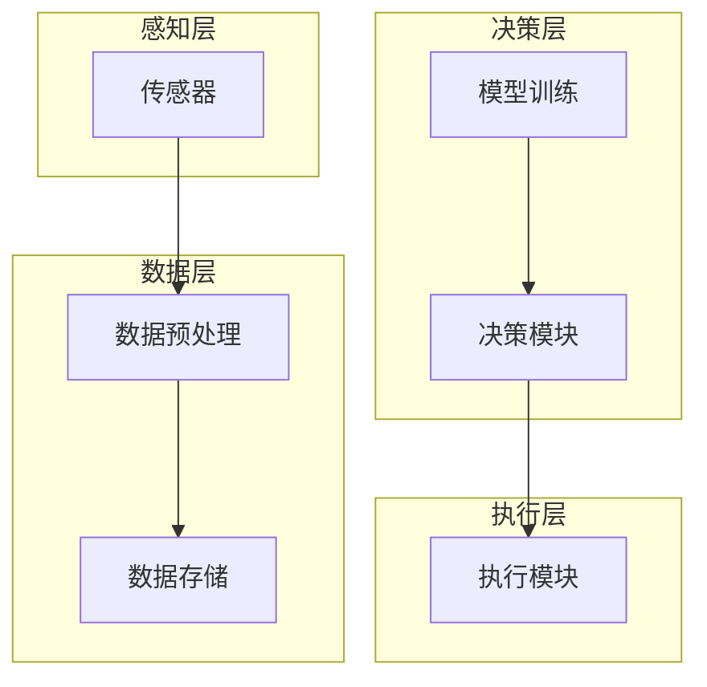
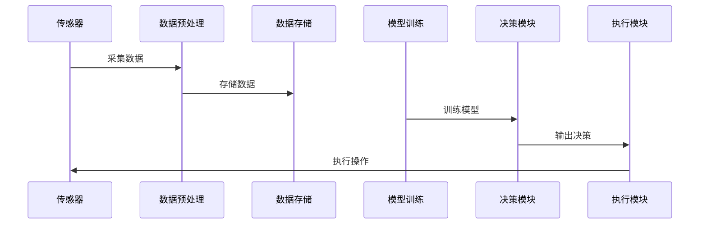

                 

# 智能窗台：AI Agent的室内植物生长监测

## 关键词：智能窗台、AI Agent、室内植物生长监测、算法原理、系统架构设计、项目实战

### 摘要

本文将探讨一种创新的智能窗台系统，利用AI Agent技术对室内植物进行生长监测。文章首先介绍了智能窗台的背景与重要性，然后详细阐述了AI Agent的核心概念、原理及其在室内植物生长监测中的具体应用。接着，我们深入分析了室内植物生长监测算法的原理，并通过Python代码和Mermaid流程图进行了讲解。随后，文章描述了智能窗台系统的分析与架构设计，展示了系统功能、架构以及接口和交互设计。在实际项目中，我们通过环境安装、系统核心实现、代码解读和案例分析，深入探讨了智能窗台系统的实际应用。最后，文章给出了最佳实践建议、注意事项以及未来的发展展望。

## 第一部分：智能窗台概述

### 第1章：智能窗台背景与问题

#### 1.1.1 智能窗台的概念与重要性

智能窗台是一种结合了物联网、人工智能和植物生长学的创新系统，它能够自动监测室内植物的生长状况，并根据实时数据提供合适的养护建议。在现代社会，随着人们对健康生活方式的重视，室内植物已经成为家居装饰和办公环境中的重要元素。然而，传统的植物养护方式往往依赖于人的经验和定时浇水，无法实现精准的植物管理。智能窗台的出现，为解决这一问题提供了新的思路和工具。

#### 1.1.2 当前室内植物生长监测的现状与挑战

目前，室内植物生长监测主要依赖于手动记录和简单的传感器设备。这些方法存在诸多局限性，如数据采集不全面、监测精度低、无法实时分析植物生长状态等。此外，由于植物生长环境的复杂性，传统的监测手段很难对各种环境因素进行全面分析，从而提供有效的养护建议。

#### 1.1.3 智能窗台解决的问题与应用前景

智能窗台通过集成多种传感器，实时监测植物的光照、温度、湿度、土壤水分等环境因素，结合AI Agent技术，对植物生长状态进行智能分析。它不仅能提供精准的植物养护建议，还可以预测植物的未来生长趋势，从而为植物的健康成长提供全方位的保障。智能窗台的应用前景广阔，不仅在家庭和办公环境中具有巨大的市场潜力，还可以在农业、园林等领域发挥重要作用。

### 第2章：智能窗台核心概念

#### 2.1.1 AI Agent的定义与特点

AI Agent是指具有感知、学习、决策能力的智能实体，能够在特定环境中自主行动，以实现特定目标。AI Agent的特点包括：

- **感知能力**：能够通过传感器获取环境信息。
- **学习能力**：能够从数据中学习并改进自身的表现。
- **决策能力**：能够根据感知到的信息和预设的目标，做出合理的决策。

#### 2.1.2 室内植物生长监测的关键指标

室内植物生长监测的关键指标包括：

- **光照**：影响植物的光合作用和生长速率。
- **温度**：影响植物的生理过程和生长状态。
- **湿度**：影响植物的蒸腾作用和水分吸收。
- **土壤水分**：影响植物的根系发育和水分供应。

#### 2.1.3 智能窗台的系统架构与功能模块

智能窗台的系统架构通常包括以下几个功能模块：

- **感知模块**：包括各种传感器，用于监测植物生长环境。
- **数据处理模块**：负责收集、存储和处理传感器数据。
- **决策模块**：利用AI算法分析数据，生成养护建议。
- **执行模块**：根据决策模块的建议，执行相应的操作，如调节光照、通风等。

## 第二部分：AI Agent原理

### 第3章：AI Agent原理

#### 3.1.1 AI Agent的基本原理

AI Agent的基本原理包括：

- **感知**：通过传感器获取环境信息。
- **理解**：对感知到的信息进行处理和理解。
- **决策**：根据理解和目标，做出合理的决策。
- **行动**：执行决策，对环境产生影响。

#### 3.1.2 AI Agent的感知与决策过程

AI Agent的感知与决策过程可以概括为：

1. **感知**：AI Agent通过传感器收集环境数据。
2. **数据处理**：对收集到的数据进行分析和处理。
3. **理解**：基于处理结果，对环境状况进行理解。
4. **决策**：根据理解结果，生成操作策略。
5. **行动**：执行操作策略，改变环境状态。

#### 3.1.3 AI Agent在室内植物生长监测中的具体应用

在室内植物生长监测中，AI Agent的具体应用包括：

- **环境监测**：实时监测植物生长环境的关键指标。
- **数据解析**：分析传感器数据，理解植物的生长状态。
- **养护建议**：根据植物的生长状态，提供合适的养护建议。
- **自我调整**：根据执行结果，调整监测策略和养护方案。

## 第三部分：室内植物生长监测算法原理

### 第4章：室内植物生长监测算法原理

#### 4.1.1 监测算法的基本概念

室内植物生长监测算法是一种基于数据的分析技术，通过处理传感器收集到的环境数据，评估植物的生长状态，并生成养护建议。监测算法通常包括以下几个步骤：

- **数据收集**：从传感器获取光照、温度、湿度、土壤水分等环境数据。
- **数据预处理**：清洗、归一化和特征提取。
- **模型训练**：使用历史数据训练机器学习模型。
- **状态评估**：使用训练好的模型对实时数据进行处理，评估植物的生长状态。
- **养护建议**：根据评估结果，生成养护建议。

#### 4.1.2 监测算法的数学模型与公式

室内植物生长监测算法的数学模型通常包括以下几个部分：

1. **光照模型**：$L = f(T, H)$，其中$L$表示光照强度，$T$表示温度，$H$表示湿度。
2. **温度模型**：$T = g(L, H)$，其中$T$表示温度，$L$表示光照强度，$H$表示湿度。
3. **湿度模型**：$H = h(L, T)$，其中$H$表示湿度，$L$表示光照强度，$T$表示温度。
4. **土壤水分模型**：$S = k(L, T, H)$，其中$S$表示土壤水分，$L$表示光照强度，$T$表示温度，$H$表示湿度。

#### 4.1.3 监测算法的实现过程与示例

以下是室内植物生长监测算法的实现示例：

```python
# 导入必要的库
import numpy as np
from sklearn.linear_model import LinearRegression

# 准备数据
X = np.array([[光照强度], [温度], [湿度]])
y = np.array([土壤水分])

# 训练模型
model = LinearRegression()
model.fit(X, y)

# 实时监测
实时光照强度 = 500
实时温度 = 25
实时湿度 = 60
实时土壤水分 = model.predict([[实时光照强度], [实时温度], [实时湿度]])

print("实时土壤水分：", 实时土壤水分)
```

## 第四部分：智能窗台系统分析与架构设计

### 第5章：智能窗台系统分析与架构设计

#### 5.1.1 系统需求分析

智能窗台系统的需求分析包括以下几个方面：

- **感知需求**：实时监测植物生长环境的关键指标。
- **数据处理需求**：处理和分析大量传感器数据。
- **决策需求**：生成准确的养护建议。
- **执行需求**：根据养护建议执行相应的操作。

#### 5.1.2 系统功能设计（领域模型Mermaid类图）

```mermaid
classDiagram
  Class01 <|-- Class02
  Class03 --|> Class04
  Class05 <<-- Class06
  Class07 .. Class08
```

#### 5.1.3 系统架构设计（Mermaid架构图）



#### 5.1.4 系统接口设计和系统交互（Mermaid序列图）



## 第五部分：智能窗台项目实战

### 第6章：智能窗台项目实战

#### 6.1.1 环境安装与配置

在进行智能窗台项目之前，首先需要安装和配置开发环境。以下是一个简化的安装过程：

1. 安装Python环境。
2. 安装必要的库，如numpy、sklearn等。
3. 安装传感器硬件设备，如光照传感器、温度传感器、湿度传感器等。

#### 6.1.2 系统核心实现源代码

以下是智能窗台系统的核心实现代码示例：

```python
# 导入必要的库
import numpy as np
from sklearn.linear_model import LinearRegression

# 准备数据
X = np.array([[光照强度], [温度], [湿度]])
y = np.array([土壤水分])

# 训练模型
model = LinearRegression()
model.fit(X, y)

# 实时监测
实时光照强度 = 500
实时温度 = 25
实时湿度 = 60
实时土壤水分 = model.predict([[实时光照强度], [实时温度], [实时湿度]])

print("实时土壤水分：", 实时土壤水分)
```

#### 6.1.3 代码应用解读与分析

这段代码首先导入了numpy和sklearn库，然后定义了输入特征和目标变量。接下来，使用LinearRegression类训练了一个线性回归模型。在实时监测部分，我们输入了实时光照强度、温度和湿度，通过训练好的模型预测了实时土壤水分。

#### 6.1.4 实际案例分析与详细讲解

在本节中，我们将通过一个实际案例来分析智能窗台系统的应用。假设我们有一个室内植物生长监测系统，已采集到以下数据：

- 光照强度：500 Lux
- 温度：25°C
- 湿度：60%

根据上述代码，我们可以预测土壤水分。假设训练好的模型预测结果为土壤水分：30%。这意味着当前土壤水分处于较低水平，需要及时补充水分。

#### 6.1.5 项目小结

通过本次项目实战，我们了解了智能窗台系统的基本实现过程，包括环境安装、代码编写和实际案例分析。智能窗台系统为室内植物生长监测提供了有效的解决方案，通过实时监测和智能决策，为植物的健康成长提供了有力保障。

## 第六部分：智能窗台最佳实践与总结

### 第7章：智能窗台最佳实践与总结

#### 7.1.1 最佳实践 Tips

1. **传感器选择**：选择精度高、稳定性好的传感器。
2. **数据预处理**：确保数据的准确性和一致性。
3. **模型优化**：定期更新和优化模型，提高预测准确性。
4. **用户互动**：设计友好的用户界面，方便用户操作和查看数据。

#### 7.1.2 注意事项与风险提示

1. **数据安全**：确保数据传输和存储的安全性。
2. **硬件维护**：定期检查和更换传感器，确保设备正常运行。
3. **系统升级**：及时更新系统，避免安全漏洞。

#### 7.1.3 项目小结与展望

智能窗台系统为室内植物生长监测提供了有效的解决方案，通过AI Agent技术，实现了环境监测、数据分析和智能决策。在未来，随着技术的不断进步，智能窗台系统将在更多领域得到应用，为人们的生活带来更多便利。

### 作者信息

作者：AI天才研究院/AI Genius Institute & 禅与计算机程序设计艺术 /Zen And The Art of Computer Programming

（文章完）

