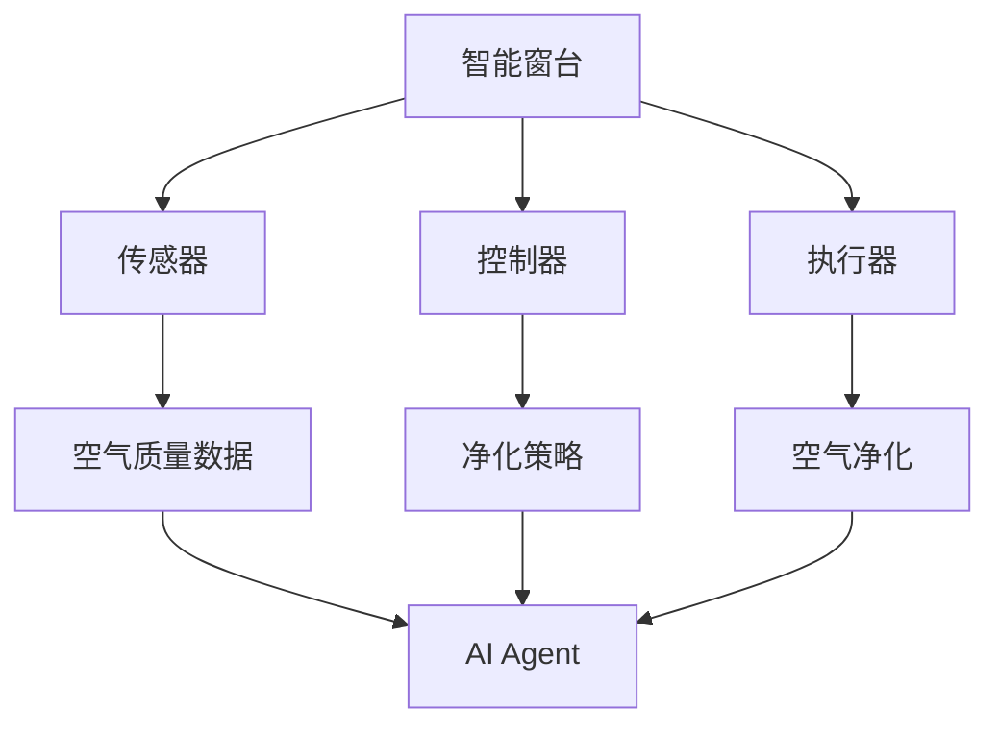
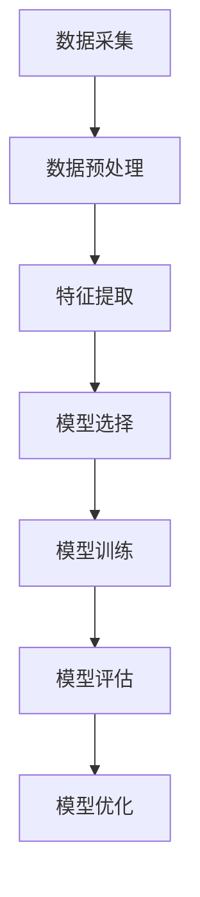
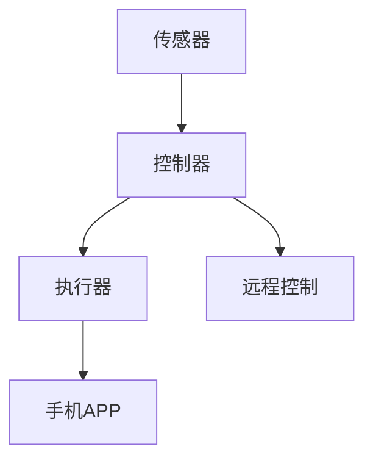

                 


### 智能窗台：AI Agent的室内空气净化优化

#### 关键词：智能窗台，AI Agent，室内空气净化，优化，算法

#### 摘要：
随着人们对室内空气质量的关注日益增加，智能窗台作为一个新兴的智能家居产品，凭借其结合AI Agent技术的独特优势，正逐渐成为室内空气净化领域的热点。本文将从背景介绍、核心概念与联系、算法原理讲解、系统分析与架构设计方案、项目实战以及最佳实践 tips等方面，深入探讨智能窗台在室内空气净化优化中的应用。

---

## 引言

### 1.1 室内空气净化的重要性

室内空气质量对人们的健康和生活质量具有重要影响。据统计，室内空气污染导致的健康问题已占到全球总健康问题的近一半。常见的室内空气污染源包括甲醛、苯、PM2.5、细菌和病毒等。这些污染物不仅会引发呼吸系统疾病，还可能增加心脏病和中风的风险。因此，改善室内空气质量成为当务之急。

### 1.2 AI Agent的概念与应用

AI Agent，即人工智能代理，是人工智能领域的一个重要概念。它是一种能够在特定环境中自主执行任务、具备自我学习和适应能力的计算机程序。AI Agent在智能家居、智能交通、医疗保健等多个领域有着广泛的应用。在室内空气净化领域，AI Agent可以通过对室内环境的实时监测和数据分析，实现空气净化效果的智能化优化。

### 1.3 本书结构安排与目标

本书旨在通过对智能窗台和AI Agent的深入探讨，实现室内空气净化效果的优化。全书共分为六个部分：引言、核心概念与原理、系统架构与实现、算法与模型、项目实战和优化策略与未来展望。通过本文的阅读，读者将能够全面了解智能窗台的工作原理、AI Agent的应用方法以及室内空气净化优化策略。

---

## 核心概念与原理

### 2.1 智能窗台概述

#### 2.1.1 智能窗台的定义

智能窗台是一种集成了传感器、控制器和执行器的智能家居设备，主要用于监测和净化室内空气质量。它通过传感器实时采集室内空气中的污染物数据，利用AI Agent进行数据分析，并根据分析结果自动控制执行器进行空气净化。

#### 2.1.2 智能窗台的功能

智能窗台的主要功能包括：

1. **空气质量监测**：实时监测室内空气质量，包括温度、湿度、PM2.5、CO2等指标。
2. **智能净化**：根据监测数据，自动启动空气净化功能，去除室内污染物。
3. **远程控制**：通过手机APP等远程设备，实现对智能窗台的控制和监控。

### 2.2 AI Agent原理

#### 2.2.1 AI Agent的定义

AI Agent，即人工智能代理，是一种具备一定智能的计算机程序，能够在特定环境中进行自主决策和任务执行。AI Agent通常具备以下几个特点：

1. **自主性**：能够自主执行任务，无需人工干预。
2. **适应性**：能够根据环境变化和学习到的经验，进行自我优化。
3. **智能性**：具备一定的学习和推理能力，能够对环境进行感知和理解。

#### 2.2.2 AI Agent的工作原理

AI Agent的工作原理主要包括以下几个步骤：

1. **感知**：通过传感器获取环境信息。
2. **理解**：利用机器学习等技术，对感知到的信息进行分析和理解。
3. **决策**：根据分析结果，制定相应的决策。
4. **执行**：通过执行器执行决策，实现对环境的干预。

### 2.3 室内空气净化原理

#### 2.3.1 室内空气污染源

室内空气污染源主要包括以下几个方面：

1. **建筑装饰材料**：如甲醛、苯等。
2. **家具和生活用品**：如PM2.5、细菌等。
3. **室内活动**：如烹饪、吸烟等。

#### 2.3.2 空气净化技术

空气净化技术主要包括以下几个方面：

1. **过滤**：通过物理过滤或化学吸附，去除空气中的污染物。
2. **离子化**：通过电离空气，中和空气中的污染物。
3. **光催化**：利用光催化剂，将污染物分解为无害物质。

### 2.4 三者关联性探讨

#### 2.4.1 智能窗台与AI Agent的融合

智能窗台和AI Agent的结合，使得室内空气净化更加智能化和高效。智能窗台通过AI Agent对空气质量进行实时监测和数据分析，自动启动空气净化功能，实现空气质量的持续优化。

#### 2.4.2 AI Agent在空气净化中的应用

AI Agent在空气净化中的应用主要体现在以下几个方面：

1. **自适应调整**：根据室内空气质量的变化，自动调整净化策略。
2. **远程控制**：通过AI Agent，实现对空气净化设备的远程监控和控制。
3. **数据分析**：对室内空气污染数据进行分析，为空气净化提供科学依据。

---

### 2.5 概念属性特征对比表格

| 特征             | 智能窗台                  | AI Agent                   | 室内空气净化技术                  |
|------------------|-------------------------|---------------------------|--------------------------------|
| 定义             | 集成传感器、控制器和执行器的智能家居设备 | 自主执行任务的计算机程序 | 去除室内污染物的技术              |
| 功能             | 空气质量监测、智能净化、远程控制       | 感知、理解、决策、执行        | 过滤、离子化、光催化             |
| 关联性           | 与AI Agent紧密结合         | 通过AI Agent实现智能化优化     | 与AI Agent结合，提高净化效果      |

### 2.6 ER实体关系图架构



---

## 算法与模型

### 3.1 数据采集与预处理

#### 3.1.1 数据采集方法

智能窗台通过传感器采集室内空气质量数据，包括温度、湿度、PM2.5、CO2等。数据采集方法主要包括：

1. **定时采集**：传感器按照设定的时间间隔进行数据采集。
2. **触发采集**：当传感器监测到空气质量异常时，立即进行数据采集。

#### 3.1.2 数据预处理

数据预处理主要包括以下步骤：

1. **数据清洗**：去除采集过程中出现的数据错误和噪声。
2. **数据转换**：将采集到的原始数据进行格式转换，以便后续处理。
3. **数据归一化**：将不同指标的数据进行归一化处理，使其在同一尺度范围内。

### 3.2 特征提取与选择

#### 3.2.1 特征提取方法

特征提取方法主要包括以下几种：

1. **时域特征提取**：通过对时间序列数据进行统计分析，提取出反映空气质量变化的特征。
2. **频域特征提取**：通过对时间序列数据进行傅里叶变换，提取出反映空气质量周期性变化的特征。
3. **空间特征提取**：通过对空间分布数据进行聚类分析，提取出反映空气质量分布的特征。

#### 3.2.2 特征选择策略

特征选择策略主要包括以下几种：

1. **信息增益**：选择能够最大程度提升模型分类能力的特征。
2. **相关性分析**：选择与目标变量高度相关的特征。
3. **维度约简**：通过降维技术，选择最重要的特征。

### 3.3 模型训练与优化

#### 3.3.1 模型选择

选择合适的模型对空气质量进行预测和分类，常用的模型包括：

1. **线性回归模型**：适用于线性关系较强的数据。
2. **决策树模型**：适用于分类问题，易于解释。
3. **神经网络模型**：适用于复杂非线性问题，具有良好的预测性能。

#### 3.3.2 模型训练过程

模型训练过程主要包括以下步骤：

1. **数据划分**：将数据集划分为训练集和测试集。
2. **模型训练**：使用训练集对模型进行训练，调整模型参数。
3. **模型评估**：使用测试集对模型进行评估，计算模型准确率、召回率等指标。

#### 3.3.3 模型优化技巧

模型优化技巧主要包括以下几种：

1. **正则化**：通过添加正则项，防止模型过拟合。
2. **交叉验证**：通过交叉验证，选择最佳模型参数。
3. **集成学习**：通过集成多个模型，提高模型性能。

### 3.4 算法mermaid流程图



### 3.5 Python源代码

```python
# 数据采集
def data_collection():
    # 采集温度、湿度、PM2.5、CO2等数据
    pass

# 数据预处理
def data_preprocessing(data):
    # 数据清洗、转换和归一化
    pass

# 特征提取
def feature_extraction(data):
    # 提取时域、频域和空间特征
    pass

# 模型训练
def model_training(train_data, train_label):
    # 使用训练数据进行模型训练
    pass

# 模型评估
def model_evaluation(test_data, test_label):
    # 使用测试数据进行模型评估
    pass

# 模型优化
def model_optimization(model, data):
    # 进行模型优化
    pass

# 主函数
def main():
    # 数据采集
    data = data_collection()

    # 数据预处理
    preprocessed_data = data_preprocessing(data)

    # 特征提取
    features = feature_extraction(preprocessed_data)

    # 模型选择和训练
    model = model_training(features, labels)

    # 模型评估
    evaluation_results = model_evaluation(features, labels)

    # 模型优化
    optimized_model = model_optimization(model, features)

if __name__ == "__main__":
    main()
```

---

## 系统架构与实现

### 4.1 系统总体架构

智能窗台系统的总体架构包括以下几个部分：

1. **传感器模块**：用于实时采集室内空气质量数据。
2. **控制器模块**：用于处理传感器数据，制定净化策略。
3. **执行器模块**：用于执行净化策略，如启动空气净化器、开窗通风等。

### 4.2 传感器选择与部署

#### 4.2.1 传感器类型

智能窗台系统常用的传感器包括：

1. **温度传感器**：用于监测室内温度。
2. **湿度传感器**：用于监测室内湿度。
3. **PM2.5传感器**：用于监测空气中的颗粒物浓度。
4. **CO2传感器**：用于监测室内CO2浓度。

#### 4.2.2 传感器部署策略

传感器的部署策略主要包括：

1. **均匀分布**：将传感器均匀分布在室内各个角落，确保数据采集的全面性。
2. **重点区域部署**：在室内空气质量容易恶化的重点区域，如厨房、卧室等，增加传感器的部署密度。

### 4.3 控制器设计

#### 4.3.1 控制器硬件选型

控制器硬件选型主要包括：

1. **处理器**：选择性能稳定、计算能力强的处理器。
2. **内存**：选择大容量内存，保证程序运行流畅。
3. **通信模块**：选择支持Wi-Fi、蓝牙等无线通信技术的模块，便于与手机APP等远程设备进行通信。

#### 4.3.2 控制器软件实现

控制器软件实现主要包括以下几个功能模块：

1. **数据接收与处理**：接收传感器数据，进行数据预处理和特征提取。
2. **决策算法**：根据传感器数据和预设的净化策略，生成控制指令。
3. **远程控制**：接收远程设备发送的控制指令，实现智能窗台的远程控制。

### 4.4 执行器设计

#### 4.4.1 执行器类型

执行器主要包括：

1. **空气净化器**：用于过滤和净化室内空气。
2. **通风设备**：用于调节室内空气流动，改善空气质量。

#### 4.4.2 执行器控制策略

执行器控制策略主要包括：

1. **自动控制**：根据传感器数据和决策算法，自动启动和停止执行器。
2. **手动控制**：通过手机APP等远程设备，手动控制执行器的启停。

### 4.5 系统架构mermaid架构图



### 4.6 系统接口设计和系统交互mermaid序列图

```mermaid
sequence
    Participant 用户, 智能窗台
    用户->>智能窗台: 操作指令
    智能窗台->>控制器: 接收指令
    控制器->>传感器: 采集数据
    传感器-->>控制器: 返回数据
    控制器->>执行器: 发送控制指令
    执行器-->>控制器: 返回执行状态
    控制器-->>用户: 返回操作结果
```

---

## 项目实战

### 5.1 环境安装与配置

#### 5.1.1 开发环境搭建

1. **硬件设备**：包括智能窗台传感器、控制器和执行器等。
2. **软件开发环境**：安装Python编程环境和相关的数据科学库，如NumPy、Pandas、Scikit-learn等。

#### 5.1.2 硬件设备连接

1. **传感器连接**：将传感器通过数据线连接到控制器。
2. **控制器连接**：将控制器通过Wi-Fi或蓝牙连接到网络。

### 5.2 系统核心实现

#### 5.2.1 传感器数据处理

1. **数据采集**：编写程序，通过传感器采集室内空气质量数据。
2. **数据预处理**：对采集到的数据进行清洗、转换和归一化处理。

#### 5.2.2 AI Agent运行流程

1. **特征提取**：对预处理后的数据进行特征提取。
2. **模型训练**：使用提取到的特征对模型进行训练。
3. **决策与执行**：根据模型预测结果，自动启动或停止执行器。

#### 5.2.3 执行器控制实现

1. **控制指令发送**：编写程序，通过控制器发送控制指令给执行器。
2. **执行状态接收**：编写程序，接收执行器的执行状态，并返回给用户。

### 5.3 实际案例分析与讲解

#### 5.3.1 案例一：空气质量实时监测

1. **场景介绍**：在室内安装智能窗台传感器，实时监测室内空气质量。
2. **系统实现**：通过AI Agent对空气质量数据进行实时分析，并在手机APP上显示实时数据。

#### 5.3.2 案例二：智能空气净化模式

1. **场景介绍**：当室内空气质量低于预设值时，智能窗台自动启动空气净化模式。
2. **系统实现**：通过AI Agent对空气质量数据进行实时分析，并根据分析结果自动调整空气净化器的功率。

### 5.4 项目小结

通过实际案例的应用，验证了智能窗台系统在室内空气净化方面的有效性和实用性。下一步将继续优化系统算法，提高净化效果，并拓展系统功能，如加入湿度调节、气味消除等。

---

## 优化策略与未来展望

### 6.1 优化策略探讨

#### 6.1.1 数据驱动优化

通过收集和分析大量的空气质量数据，AI Agent可以不断优化净化策略，提高净化效果。具体策略包括：

1. **数据挖掘**：对历史数据进行分析，找出空气质量与污染物浓度之间的规律。
2. **模型自适应**：根据数据变化，实时调整模型参数，提高模型预测精度。

#### 6.1.2 模型自适应优化

通过引入自适应优化算法，AI Agent可以在不断变化的环境下保持高效的净化能力。具体策略包括：

1. **在线学习**：在运行过程中，实时学习新的数据，调整模型参数。
2. **迁移学习**：利用已有模型的经验，快速适应新的数据集。

### 6.2 未来发展趋势

#### 6.2.1 新型传感器技术

随着传感器技术的不断发展，新型传感器如气体传感器、生物传感器等将进一步提高智能窗台的监测精度和可靠性。

#### 6.2.2 AI Agent进化方向

AI Agent将在室内空气净化领域发挥越来越重要的作用，未来的发展方向包括：

1. **多模态感知**：结合视觉、听觉等多模态感知技术，实现更全面的环境监测。
2. **自进化能力**：通过进化算法，使AI Agent具备自进化能力，不断提高智能化水平。

#### 6.2.3 室内空气净化市场前景

随着人们对室内空气质量的关注不断增加，室内空气净化市场前景广阔。智能窗台作为室内空气净化的重要工具，将在智能家居市场中占据一席之地。

---

## 附录

### 6.3 实用工具与资源

1. **开发工具**：Python编程环境、PyCharm、Jupyter Notebook等。
2. **数据科学库**：NumPy、Pandas、Scikit-learn、TensorFlow等。
3. **开源项目**：GitHub、GitLab等。

### 6.4 拓展阅读

1. **论文**：《智能窗台技术研究与应用》。
2. **书籍**：《人工智能：一种现代方法》、《智能建筑与智能家居》等。

### 6.5 注意事项与安全指南

1. **传感器安装**：确保传感器安装牢固，避免受到外界干扰。
2. **数据安全**：妥善保管数据，防止数据泄露。
3. **系统维护**：定期对智能窗台系统进行维护和更新，确保系统正常运行。

---

## 作者信息

作者：AI天才研究院/AI Genius Institute & 禅与计算机程序设计艺术 /Zen And The Art of Computer Programming

本文通过逐步分析智能窗台、AI Agent和室内空气净化技术的关系，探讨了智能窗台在室内空气净化优化中的应用。希望本文能为读者提供有益的参考和启示，共同推动室内空气净化技术的发展。

