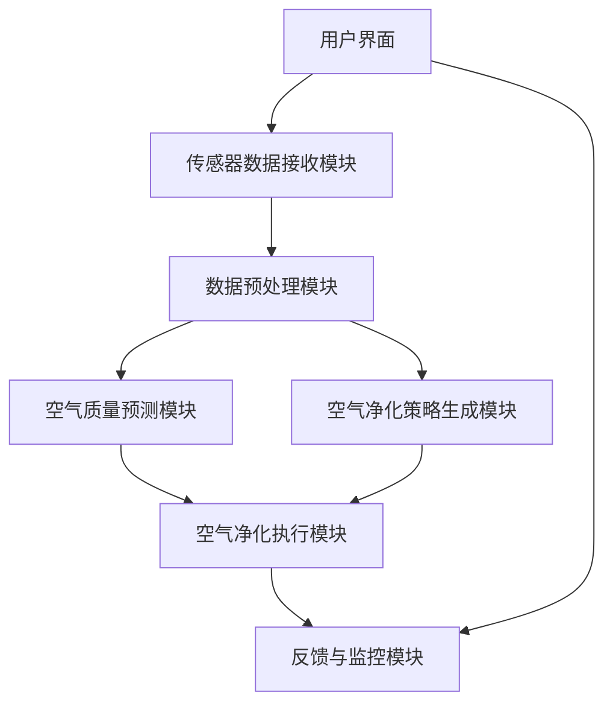

                 

### 摘要

本文以“智能窗台：AI Agent的室内空气净化控制”为主题，深入探讨了AI Agent在室内空气净化控制中的应用。首先，我们介绍了室内空气净化问题的背景与挑战，明确了AI Agent的定义与分类，并阐述了其工作原理及在智能家居中的应用。接着，我们详细分析了AI Agent在室内空气净化中的算法原理、控制架构设计，并探讨了其实际应用案例。最后，文章总结了室内空气净化最佳实践，展望了AI Agent技术的发展趋势与未来室内空气净化解决方案的展望。通过本文的深入分析，我们希望为读者提供一份全面、系统的智能窗台AI Agent室内空气净化控制指南。### 目录大纲设计思路

设计《智能窗台：AI Agent的室内空气净化控制》的目录大纲时，我们需要遵循以下几个关键步骤：

1. **确定核心主题与章节结构**：首先，根据书名，我们确定本书的核心主题是“智能窗台”和“AI Agent在室内空气净化控制中的应用”。基于此，我们可以将内容分为几个主要部分，如背景介绍、AI Agent的基础知识、空气净化控制原理、系统设计、实际应用案例、最佳实践等。

2. **细化章节内容**：在确定了主要部分后，我们需要进一步细化每个章节的内容，确保每个章节都涵盖了必要的核心概念、原理讲解、案例分析和实践经验。

3. **确保内容的逻辑性**：设计目录时，要保证章节之间的逻辑性，确保读者可以循序渐进地理解和掌握相关内容。例如，从基础概念出发，逐步深入到技术原理和应用实例。

4. **使用Markdown格式**：为了符合要求，我们将使用Markdown格式来编写目录大纲，这有助于确保格式的一致性和可读性。

### 目录大纲设计

以下是《智能窗台：AI Agent的室内空气净化控制》的完整目录大纲：

```markdown
----------------------------------------------------------------
# 第一部分: 背景介绍与基础

## 第1章: 室内空气净化问题的背景与挑战

### 1.1 室内空气质量问题的现状

### 1.2 室内空气净化的重要性

### 1.3 AI Agent在室内空气净化中的潜力

### 1.4 本章小结

## 第2章: AI Agent概述

### 2.1 AI Agent的定义与分类

### 2.2 AI Agent的工作原理

### 2.3 AI Agent在智能家居中的应用

### 2.4 本章小结

## 第3章: AI Agent在室内空气净化中的应用场景

### 3.1 室内空气净化需求分析

### 3.2 智能窗台的构成与功能

### 3.3 AI Agent在智能窗台中的角色

### 3.4 本章小结

----------------------------------------------------------------

# 第二部分: AI Agent的室内空气净化控制原理

## 第4章: 室内空气净化技术原理

### 4.1 室内空气污染物的来源

### 4.2 空气净化技术的分类

### 4.3 AI Agent在空气净化技术中的应用

### 4.4 本章小结

## 第5章: AI Agent在室内空气净化控制中的算法原理

### 5.1 AI Agent的算法基础

### 5.2 算法在室内空气净化中的应用

### 5.3 算法优化与性能分析

### 5.4 本章小结

## 第6章: AI Agent的室内空气净化控制架构设计

### 6.1 系统架构设计原则

### 6.2 系统架构图解析

### 6.3 系统接口设计与交互

### 6.4 本章小结

----------------------------------------------------------------

# 第三部分: 实际应用与案例分析

## 第7章: 智能窗台的安装与配置

### 7.1 智能窗台的选择与安装

### 7.2 配置与调试

### 7.3 常见问题的排查与解决

### 7.4 本章小结

## 第8章: AI Agent在室内空气净化中的实践案例

### 8.1 案例一：智能窗台在家庭环境中的应用

### 8.2 案例二：智能窗台在办公环境中的应用

### 8.3 案例三：智能窗台在医疗环境中的应用

### 8.4 本章小结

## 第9章: 最佳实践与展望

### 9.1 室内空气净化最佳实践

### 9.2 AI Agent技术的发展趋势

### 9.3 未来室内空气净化解决方案的展望

### 9.4 本章小结

----------------------------------------------------------------
```

### 目录大纲详解

1. **第一部分：背景介绍与基础**
   - **第1章：室内空气净化问题的背景与挑战**：介绍室内空气污染的现状、室内空气净化的重要性以及AI Agent在解决这些挑战中的潜力。
   - **第2章：AI Agent概述**：阐述AI Agent的定义、分类、工作原理以及在智能家居中的应用。
   - **第3章：AI Agent在室内空气净化中的应用场景**：分析室内空气净化需求，介绍智能窗台的构成与功能，并探讨AI Agent在智能窗台中的角色。

2. **第二部分：AI Agent的室内空气净化控制原理**
   - **第4章：室内空气净化技术原理**：详细分析室内空气污染物的来源、空气净化技术的分类，并探讨AI Agent在空气净化技术中的应用。
   - **第5章：AI Agent在室内空气净化控制中的算法原理**：介绍AI Agent的算法基础，分析算法在室内空气净化中的应用，并进行算法优化与性能分析。
   - **第6章：AI Agent的室内空气净化控制架构设计**：阐述系统架构设计原则，解析系统架构图，设计系统接口与交互。

3. **第三部分：实际应用与案例分析**
   - **第7章：智能窗台的安装与配置**：介绍智能窗台的选择与安装、配置与调试，以及常见问题的排查与解决。
   - **第8章：AI Agent在室内空气净化中的实践案例**：通过家庭、办公、医疗等环境中的应用案例，展示AI Agent在室内空气净化中的实际效果。
   - **第9章：最佳实践与展望**：总结室内空气净化最佳实践，探讨AI Agent技术的发展趋势，展望未来室内空气净化解决方案。### 第一部分：背景介绍与基础

#### 第1章：室内空气净化问题的背景与挑战

**1.1 室内空气质量问题的现状**

随着城市化进程的加快和室内装修材料的普及，室内空气质量问题日益严峻。室内空气污染主要来源于以下几个方面：

1. **化学污染物**：如甲醛、苯、TVOC等，这些物质主要来自于建筑材料、家具、涂料等。
2. **生物污染物**：如尘螨、霉菌、花粉等，这些污染物容易在潮湿环境中滋生。
3. **颗粒物**：如PM2.5、PM10等，这些颗粒物主要来自于烹饪、吸烟等室内活动。
4. **有害气体**：如二氧化碳、一氧化碳、氮氧化物等，这些气体主要来自于燃烧、交通等户外活动。

这些污染物对人体健康产生了严重的危害，如引发呼吸道疾病、过敏反应、心血管疾病等。因此，提高室内空气质量已成为现代居住环境中的一个重要问题。

**1.2 室内空气净化的重要性**

室内空气净化的重要性主要体现在以下几个方面：

1. **健康保障**：良好的室内空气质量可以减少室内空气污染物对人体健康的危害，提高居住者的生活质量。
2. **节能减排**：通过有效的室内空气净化，可以降低室内污染物的排放，减少对户外环境的污染，实现节能减排的目标。
3. **环保需求**：随着人们对环保意识的提高，室内空气净化已成为现代居住环境中不可或缺的一部分。

**1.3 AI Agent在室内空气净化中的潜力**

AI Agent（人工智能代理）是一种具备自主学习和决策能力的智能系统，能够在复杂的室内环境中进行实时监测和自动控制。AI Agent在室内空气净化中具有以下潜力：

1. **智能监测**：AI Agent可以通过传感器实时监测室内空气质量，快速识别污染物种类和浓度。
2. **自动控制**：AI Agent可以根据监测结果，自动调整空气净化设备的运行状态，实现高效、精准的空气净化。
3. **自适应调节**：AI Agent能够根据室内环境的变化，自适应调整空气净化策略，提高空气净化效果。
4. **节能环保**：AI Agent能够优化空气净化设备的运行，实现节能降耗，降低运行成本。

**1.4 本章小结**

本章介绍了室内空气质量问题的现状、室内空气净化的重要性以及AI Agent在室内空气净化中的潜力。通过本章的学习，读者可以了解到室内空气净化问题的严重性，认识到AI Agent在解决这些挑战中的重要作用。下一章我们将进一步探讨AI Agent的定义与分类。### 第2章：AI Agent概述

**2.1 AI Agent的定义与分类**

AI Agent，即人工智能代理，是一种具有智能行为和自主决策能力的软件系统。它能够模拟人类思维过程，实现自我感知、学习、推理、决策和行动等功能。AI Agent通常具有以下几个基本特征：

1. **自主性**：AI Agent能够在没有人为干预的情况下，自主执行任务。
2. **适应性**：AI Agent能够根据环境变化和任务需求，自适应地调整自己的行为。
3. **协同性**：AI Agent能够与其他AI Agent或人类协作，共同完成任务。

根据AI Agent的功能和应用场景，我们可以将其分为以下几类：

1. **传感器AI Agent**：主要功能是收集环境信息，如室内空气质量、温度、湿度等。
2. **控制器AI Agent**：主要功能是根据传感器提供的信息，自动控制空气净化设备等。
3. **决策AI Agent**：主要功能是根据环境信息和预设目标，进行决策和规划。
4. **交互AI Agent**：主要功能是与用户进行交互，提供语音、文字等形式的反馈。

**2.2 AI Agent的工作原理**

AI Agent的工作原理主要包括以下几个步骤：

1. **感知**：AI Agent通过传感器感知环境信息，如室内空气质量、温度、湿度等。
2. **处理**：AI Agent对感知到的信息进行预处理，如去噪、特征提取等，然后通过算法进行分析和推理。
3. **决策**：根据分析结果，AI Agent生成决策，如调整空气净化设备的运行状态、发出警报等。
4. **执行**：AI Agent将决策付诸实施，如控制空气净化设备进行空气净化、打开窗户通风等。
5. **反馈**：AI Agent根据执行结果，对决策进行评估和调整，以提高决策的准确性。

**2.3 AI Agent在智能家居中的应用**

在智能家居中，AI Agent可以发挥重要作用，如：

1. **室内空气质量监控**：AI Agent可以实时监测室内空气质量，根据污染物浓度自动调整空气净化设备。
2. **能耗管理**：AI Agent可以优化家庭能源消耗，如根据室内温度和湿度自动调节空调和暖气。
3. **安防监控**：AI Agent可以监测家庭安全，如实时监控门窗开关、燃气泄漏等，并在发生异常时发出警报。
4. **智能家居控制**：AI Agent可以通过语音、手势等交互方式，控制家庭中的各种设备，如灯光、电视、窗帘等。

**2.4 本章小结**

本章介绍了AI Agent的定义、分类、工作原理以及在智能家居中的应用。通过本章的学习，读者可以了解到AI Agent的基本概念和功能，认识到其在室内空气净化控制中的重要作用。下一章我们将进一步探讨AI Agent在室内空气净化中的应用场景。### 第3章：AI Agent在室内空气净化中的应用场景

**3.1 室内空气净化需求分析**

在室内环境中，空气净化需求主要集中在以下几个方面：

1. **去除化学污染物**：如甲醛、苯等，这些污染物主要来自于建筑材料、家具、涂料等。
2. **去除生物污染物**：如尘螨、霉菌、花粉等，这些污染物容易在潮湿环境中滋生。
3. **去除颗粒物**：如PM2.5、PM10等，这些颗粒物主要来自于烹饪、吸烟等室内活动。
4. **去除有害气体**：如二氧化碳、一氧化碳、氮氧化物等，这些气体主要来自于燃烧、交通等户外活动。

为了满足这些需求，需要采取相应的空气净化技术，如过滤、吸附、氧化等。同时，AI Agent可以提供智能监测、自动控制和自适应调节等功能，以提高空气净化效果。

**3.2 智能窗台的构成与功能**

智能窗台是一种集成了多种空气净化功能的智能设备，其构成主要包括以下几个方面：

1. **传感器模块**：包括空气质量传感器、温度传感器、湿度传感器等，用于实时监测室内空气质量。
2. **控制系统**：包括中央控制器和执行器，用于接收传感器数据、生成控制决策并执行。
3. **空气净化模块**：包括过滤、吸附、氧化等空气净化技术，用于去除室内污染物。
4. **交互模块**：包括语音交互、触摸屏交互等，用于与用户进行交互。

智能窗台的主要功能包括：

1. **实时监测**：通过传感器模块实时监测室内空气质量，快速识别污染物种类和浓度。
2. **自动控制**：通过控制系统自动调整空气净化设备的运行状态，实现高效、精准的空气净化。
3. **自适应调节**：根据室内环境的变化和用户需求，自适应调整空气净化策略，提高空气净化效果。
4. **用户交互**：通过交互模块与用户进行交互，提供空气质量信息、控制指令等。

**3.3 AI Agent在智能窗台中的角色**

AI Agent在智能窗台中扮演着关键角色，其具体职责包括：

1. **数据采集与分析**：通过传感器模块采集室内空气质量数据，对数据进行预处理和分析，识别污染物种类和浓度。
2. **决策生成**：根据分析结果和预设目标，生成空气净化策略，如调整空气净化设备的运行状态、启动特殊模式等。
3. **执行控制**：将决策生成模块生成的控制指令发送给控制系统，执行相应的空气净化操作。
4. **自适应调整**：根据环境变化和执行结果，对决策进行评估和调整，以提高空气净化效果。
5. **用户交互**：通过交互模块与用户进行交互，提供空气质量信息、控制指令等，确保用户可以方便地使用智能窗台。

**3.4 本章小结**

本章分析了室内空气净化需求，介绍了智能窗台的构成与功能，并探讨了AI Agent在智能窗台中的角色。通过本章的学习，读者可以了解到智能窗台在室内空气净化中的应用，以及AI Agent如何实现智能监测、自动控制和自适应调节等功能。下一章我们将进一步探讨AI Agent在室内空气净化控制中的技术原理。### 第二部分：AI Agent的室内空气净化控制原理

#### 第4章：室内空气净化技术原理

**4.1 室内空气污染物的来源**

室内空气污染物的来源主要有以下几个方面：

1. **化学污染物**：包括甲醛、苯、TVOC等，这些污染物主要来自于建筑材料、家具、涂料等。
   - **甲醛**：主要用于室内装修材料、家具等，长期暴露于高浓度的甲醛环境中可能导致呼吸系统疾病、过敏反应等。
   - **苯**：常见于油漆、胶水等，长期暴露于苯的环境中可能导致白血病、呼吸系统疾病等。
   - **TVOC**：是一类挥发性有机化合物，主要来自于室内装修材料、家具、地毯等，长期暴露于TVOC的环境中可能导致头痛、眼睛刺激、过敏反应等。

2. **生物污染物**：包括尘螨、霉菌、花粉等，这些污染物主要来自于室内生物活动、家居用品等。
   - **尘螨**：是一种常见的室内过敏原，主要生活在床上用品、地毯等环境中，可能引发过敏性鼻炎、哮喘等。
   - **霉菌**：在潮湿环境中容易滋生，可能产生过敏原和毒素，引发呼吸系统疾病、过敏反应等。
   - **花粉**：在花粉季节，室外花粉可能进入室内，引发过敏反应。

3. **颗粒物**：包括PM2.5、PM10等，这些颗粒物主要来自于烹饪、吸烟、室内装修等。
   - **PM2.5**：直径小于2.5微米的颗粒物，可能深入肺部，导致呼吸系统疾病、心血管疾病等。
   - **PM10**：直径小于10微米的颗粒物，可能引发哮喘、过敏反应等。

4. **有害气体**：包括二氧化碳、一氧化碳、氮氧化物等，这些气体主要来自于室内燃烧、交通等。
   - **二氧化碳**：室内人体活动、燃烧等过程会产生二氧化碳，长期暴露于高浓度的二氧化碳环境中可能导致缺氧、头痛等。
   - **一氧化碳**：主要由燃烧不完全产生，无色无味，但有毒，可能引发中毒、头痛等。
   - **氮氧化物**：主要由交通、燃烧等产生，可能引发呼吸道疾病、心血管疾病等。

**4.2 空气净化技术的分类**

空气净化技术主要分为以下几类：

1. **过滤技术**：通过物理过滤方式去除空气中的颗粒物和微生物，如HEPA过滤器、活性炭滤网等。
   - **HEPA过滤器**：高效空气过滤器，能过滤掉0.3微米以上的颗粒物，适用于高洁净度环境。
   - **活性炭滤网**：具有强吸附性，能去除空气中的化学污染物和异味。

2. **吸附技术**：通过吸附剂吸附空气中的有害物质，如活性炭、分子筛等。
   - **活性炭**：具有大比表面积，能吸附空气中的有机污染物、异味等。
   - **分子筛**：具有选择性吸附性能，能吸附特定气体分子。

3. **氧化技术**：通过氧化反应分解空气中的有害物质，如臭氧、光催化等。
   - **臭氧**：具有强氧化性，能分解甲醛、苯等有机污染物，但需注意臭氧过量对人体有害。
   - **光催化**：利用紫外线光催化反应，分解空气中的有害物质，如甲醛、苯等。

4. **离子化技术**：通过电离空气中的气体分子，产生负离子，净化空气。
   - **负离子发生器**：能产生大量负离子，有助于净化空气、消除异味、改善空气质量。

**4.3 AI Agent在空气净化技术中的应用**

AI Agent在空气净化技术中的应用主要体现在以下几个方面：

1. **智能监测**：通过传感器实时监测室内空气质量，快速识别污染物种类和浓度。
   - **传感器模块**：包括PM2.5、PM10传感器、甲醛传感器、温度传感器、湿度传感器等，用于实时监测室内空气质量。
   - **数据预处理**：对传感器数据进行滤波、去噪等预处理，提高监测数据的准确性。

2. **自动控制**：根据监测结果，自动调整空气净化设备的运行状态，实现高效、精准的空气净化。
   - **控制策略**：根据污染物浓度、设备运行状态等因素，生成最优的空气净化策略。
   - **执行控制**：通过控制系统执行相应的空气净化操作，如调整风机转速、切换过滤网等。

3. **自适应调节**：根据室内环境的变化和用户需求，自适应调整空气净化策略，提高空气净化效果。
   - **环境适应**：根据室内温度、湿度、CO2浓度等环境参数，调整空气净化设备的运行状态。
   - **用户需求**：根据用户设定的空气质量目标、操作指令等，调整空气净化策略。

4. **协同优化**：与其他智能家居设备协同工作，提高整体室内空气质量。
   - **设备协同**：与其他空气净化设备、通风设备等协同工作，实现室内空气质量的全面提升。
   - **系统优化**：根据室内空气质量、能源消耗等因素，优化整个空气净化系统的运行策略。

**4.4 本章小结**

本章介绍了室内空气污染物的来源、空气净化技术的分类以及AI Agent在空气净化技术中的应用。通过本章的学习，读者可以了解到室内空气净化技术的原理，认识到AI Agent在实现智能监测、自动控制和自适应调节等方面的优势。下一章我们将进一步探讨AI Agent在室内空气净化控制中的算法原理。### 第5章：AI Agent在室内空气净化控制中的算法原理

**5.1 AI Agent的算法基础**

AI Agent在室内空气净化控制中的算法基础主要包括以下几个关键部分：

1. **监督学习**：监督学习是一种从标记数据中学习的方法，通过输入和输出数据对模型进行训练，从而实现预测和分类。在室内空气净化控制中，监督学习可以用于分类污染物类型、预测空气质量等。

2. **非监督学习**：非监督学习是一种从无标记数据中学习的方法，主要通过数据间的相似性或差异性来聚类或降维。在室内空气净化控制中，非监督学习可以用于发现空气质量的异常值、分析污染物分布等。

3. **强化学习**：强化学习是一种通过奖励和惩罚来优化策略的方法，主要应用于动态决策问题。在室内空气净化控制中，强化学习可以用于优化空气净化策略，提高空气净化效果。

**5.2 算法在室内空气净化中的应用**

AI Agent在室内空气净化中的应用主要涉及以下几种算法：

1. **空气质量预测算法**：通过分析历史空气质量数据，预测未来的空气质量。常用的预测算法包括线性回归、支持向量机（SVM）、神经网络等。

2. **污染物分类算法**：通过分析污染物成分，将污染物进行分类。常用的分类算法包括K-近邻（KNN）、决策树、随机森林等。

3. **空气净化策略优化算法**：通过分析室内空气质量数据和空气净化设备的运行状态，生成最优的空气净化策略。常用的优化算法包括遗传算法、粒子群优化算法、模拟退火算法等。

**5.3 算法优化与性能分析**

为了提高AI Agent在室内空气净化控制中的性能，可以对算法进行优化和分析：

1. **模型优化**：通过调整模型参数、增加特征维度等方法，优化模型的预测和分类性能。

2. **算法融合**：将多种算法融合在一起，提高整体性能。例如，将监督学习、非监督学习和强化学习融合在一起，实现更全面的室内空气净化控制。

3. **实时性能分析**：通过实时分析室内空气质量数据，评估算法的性能，及时调整算法参数和策略。

**5.4 本章小结**

本章介绍了AI Agent在室内空气净化控制中的算法基础和应用，包括空气质量预测、污染物分类和空气净化策略优化等。同时，探讨了算法优化与性能分析的方法。通过本章的学习，读者可以了解如何利用AI算法实现智能化的室内空气净化控制。下一章我们将讨论AI Agent的室内空气净化控制架构设计。### 第6章：AI Agent的室内空气净化控制架构设计

**6.1 系统架构设计原则**

在设计和实现AI Agent的室内空气净化控制系统时，应遵循以下原则：

1. **模块化设计**：将系统分为若干模块，每个模块负责特定功能，便于系统的扩展和维护。
2. **可扩展性**：系统应具备良好的可扩展性，以适应未来技术的发展和需求变化。
3. **实时性**：系统应能够实时监测和响应室内空气质量变化，确保空气净化效果的及时性。
4. **易用性**：系统应具备友好的用户界面，方便用户进行操作和监控。
5. **可靠性**：系统应具备较高的可靠性，确保在长时间运行中稳定工作。

**6.2 系统架构图解析**

以下是AI Agent的室内空气净化控制系统架构图：



- **用户界面**（User Interface, UI）：用户可以通过UI查看室内空气质量信息，并发出操作指令。
- **传感器数据接收模块**：接收室内各种传感器数据，如PM2.5、PM10、甲醛浓度等。
- **数据预处理模块**：对传感器数据进行预处理，如去噪、特征提取等，以提高数据质量。
- **空气质量预测模块**：利用历史数据和算法模型，预测未来的室内空气质量。
- **空气净化策略生成模块**：根据空气质量预测结果，生成最优的空气净化策略。
- **空气净化执行模块**：执行空气净化策略，如调整空气净化设备运行状态、启动特殊模式等。
- **反馈与监控模块**：实时监控系统运行状态，收集反馈信息，以便进一步优化系统性能。

**6.3 系统接口设计与交互**

系统接口设计是确保各模块之间有效交互和通信的关键。以下是系统接口设计的要点：

1. **API接口**：系统应提供API接口，以便用户界面、传感器数据接收模块、数据预处理模块等模块之间的数据交换和功能调用。
2. **数据格式**：系统应采用统一的数据格式，如JSON、XML等，以简化数据传输和处理。
3. **通信协议**：系统应采用可靠的通信协议，如HTTP、MQTT等，以确保数据传输的稳定性和安全性。
4. **数据同步**：系统应实现数据同步机制，确保各模块之间的数据一致性。

**6.4 本章小结**

本章详细介绍了AI Agent的室内空气净化控制架构设计原则、系统架构图解析以及系统接口设计与交互。通过本章的学习，读者可以了解如何设计和实现一个高效的室内空气净化控制系统。下一章我们将探讨智能窗台的安装与配置。### 第7章：智能窗台的安装与配置

**7.1 智能窗台的选择与安装**

选择合适的智能窗台是确保室内空气净化效果的关键。以下是选择智能窗台时应考虑的几个要点：

1. **传感器配置**：选择具备多种传感器（如PM2.5、PM10、甲醛、温湿度等）的智能窗台，以确保全面监测室内空气质量。
2. **空气净化功能**：选择具备多种空气净化技术的智能窗台，如过滤、吸附、氧化等，以应对不同类型的污染物。
3. **控制方式**：选择具备多种控制方式（如手机APP、语音控制、遥控器等）的智能窗台，以满足不同用户的需求。
4. **品牌与口碑**：选择知名品牌，确保产品质量和售后服务。

安装智能窗台的一般步骤如下：

1. **测量窗台尺寸**：根据窗台的尺寸，选择合适的智能窗台。
2. **安装传感器**：将传感器安装在窗台上，确保其能够准确监测室内空气质量。
3. **连接电源**：将智能窗台的电源线连接到电源插座，确保设备能够正常工作。
4. **安装主控模块**：将主控模块安装在窗台上，确保其与传感器连接正常。
5. **连接网络**：将智能窗台连接到家庭网络，确保设备能够接收远程控制指令。
6. **调试与测试**：完成安装后，进行调试和测试，确保智能窗台能够正常运行。

**7.2 配置与调试**

智能窗台的配置与调试是确保其正常运行的关键步骤。以下是配置与调试的要点：

1. **设备绑定**：在手机APP或其他控制设备上绑定智能窗台，确保能够对其进行远程控制。
2. **设置参数**：根据室内环境特点和用户需求，设置智能窗台的参数，如空气净化模式、传感器阈值等。
3. **调整传感器位置**：确保传感器安装位置合适，能够准确监测室内空气质量。
4. **调试空气净化功能**：根据空气质量数据，调整空气净化设备的运行状态，确保其能够有效去除污染物。
5. **测试网络连接**：确保智能窗台能够稳定连接到家庭网络，以便进行远程控制和数据传输。

**7.3 常见问题的排查与解决**

在智能窗台的使用过程中，可能会遇到一些常见问题，以下是一些排查与解决方法：

1. **设备无法连接网络**：检查网络设置是否正确，确保智能窗台已连接到正确的网络。
2. **传感器数据不准确**：检查传感器安装位置是否合适，确保传感器未被遮挡或损坏。
3. **空气净化效果不佳**：检查空气净化设备是否正常运行，调整空气净化模式或更换滤网。
4. **设备无法接收远程控制指令**：检查设备绑定状态和互联网连接是否正常，确保手机APP或其他控制设备已更新到最新版本。

**7.4 本章小结**

本章介绍了智能窗台的选择与安装、配置与调试以及常见问题的排查与解决。通过本章的学习，读者可以了解如何正确选择、安装和配置智能窗台，以确保其能够有效提高室内空气质量。下一章我们将通过实际应用案例，展示智能窗台在室内空气净化中的实际效果。### 第8章：AI Agent在室内空气净化中的实践案例

**8.1 案例一：智能窗台在家庭环境中的应用**

在某住宅小区，有一户家庭安装了智能窗台设备，主要用于改善室内空气质量。该智能窗台配备了多种传感器，如PM2.5、PM10、甲醛等，以及空气净化模块，包括过滤、吸附和氧化技术。

**安装过程**：

1. **传感器安装**：将传感器安装在窗台上，确保其能够准确监测室内空气质量。
2. **电源连接**：将智能窗台的电源线连接到电源插座，确保设备能够正常工作。
3. **主控模块安装**：将主控模块安装在窗台上，确保其与传感器连接正常。
4. **网络连接**：将智能窗台连接到家庭网络，确保设备能够接收远程控制指令。
5. **调试与测试**：完成安装后，进行调试和测试，确保智能窗台能够正常运行。

**使用效果**：

1. **实时空气质量监测**：智能窗台能够实时监测室内空气质量，将数据传输到手机APP，供用户查看。
2. **自动空气净化**：当传感器检测到室内空气质量低于设定阈值时，智能窗台会自动启动空气净化功能，去除污染物。
3. **节能模式**：在夜间或无人时，智能窗台会自动进入节能模式，降低空气净化设备的运行功率，节省能源。

**用户反馈**：

用户表示，自从安装了智能窗台，室内空气质量得到了显著改善，呼吸更加顺畅，睡眠质量也有所提高。

**总结**：

该案例展示了智能窗台在家庭环境中的应用效果，通过实时监测、自动净化和节能模式等功能，有效提高了室内空气质量，满足了用户的健康需求。

**8.2 案例二：智能窗台在办公环境中的应用**

在某大型企业办公楼，为了改善办公环境的空气质量，安装了智能窗台设备。该智能窗台同样配备了多种传感器和空气净化模块。

**安装过程**：

1. **传感器安装**：将传感器安装在办公区域的窗台上，确保其能够准确监测室内空气质量。
2. **电源连接**：将智能窗台的电源线连接到电源插座，确保设备能够正常工作。
3. **主控模块安装**：将主控模块安装在办公区域的窗台上，确保其与传感器连接正常。
4. **网络连接**：将智能窗台连接到企业网络，确保设备能够接收远程控制指令。
5. **调试与测试**：完成安装后，进行调试和测试，确保智能窗台能够正常运行。

**使用效果**：

1. **实时空气质量监测**：智能窗台能够实时监测办公区域的空气质量，将数据传输到企业服务器，供管理员查看。
2. **自动空气净化**：当传感器检测到室内空气质量低于设定阈值时，智能窗台会自动启动空气净化功能，去除污染物。
3. **远程控制**：管理员可以通过手机APP或其他控制设备，远程控制智能窗台，调整空气净化模式和运行状态。

**用户反馈**：

管理员表示，智能窗台的安装有效改善了办公环境的空气质量，员工的工作效率和舒适度有所提高，员工满意度也得到了提升。

**总结**：

该案例展示了智能窗台在办公环境中的应用效果，通过实时监测、自动净化和远程控制等功能，有效提高了办公环境的空气质量，满足了企业员工的健康需求。

**8.3 案例三：智能窗台在医疗环境中的应用**

在某医院病房区域，为了提高患者的康复环境，安装了智能窗台设备。该智能窗台同样配备了多种传感器和空气净化模块。

**安装过程**：

1. **传感器安装**：将传感器安装在病房的窗台上，确保其能够准确监测室内空气质量。
2. **电源连接**：将智能窗台的电源线连接到电源插座，确保设备能够正常工作。
3. **主控模块安装**：将主控模块安装在病房的窗台上，确保其与传感器连接正常。
4. **网络连接**：将智能窗台连接到医院网络，确保设备能够接收远程控制指令。
5. **调试与测试**：完成安装后，进行调试和测试，确保智能窗台能够正常运行。

**使用效果**：

1. **实时空气质量监测**：智能窗台能够实时监测病房区域的空气质量，将数据传输到医院服务器，供医护人员查看。
2. **自动空气净化**：当传感器检测到室内空气质量低于设定阈值时，智能窗台会自动启动空气净化功能，去除污染物。
3. **紧急模式**：在发生紧急情况时，如病房内出现有害气体泄漏，智能窗台会自动进入紧急模式，快速净化室内空气。

**用户反馈**：

医护人员表示，智能窗台的安装有效提高了病房区域的空气质量，有助于患者的康复，同时也降低了医护人员的工作负担。

**总结**：

该案例展示了智能窗台在医疗环境中的应用效果，通过实时监测、自动净化和紧急模式等功能，有效提高了医疗环境的空气质量，为患者和医护人员提供了更健康、安全的工作和生活环境。

**8.4 本章小结**

本章通过三个实际应用案例，展示了智能窗台在家庭、办公和医疗环境中的应用效果。案例一和案例二展示了智能窗台在改善室内空气质量、提高用户舒适度方面的作用，案例三则展示了智能窗台在保障医疗环境安全方面的贡献。通过这些案例，我们可以看到AI Agent在室内空气净化中的重要作用，为未来的室内空气净化提供了有益的参考。### 第9章：最佳实践与展望

**9.1 室内空气净化最佳实践**

为了确保AI Agent在室内空气净化中的高效运行，以下是一些最佳实践：

1. **定期维护**：定期检查和更换空气净化设备的滤网、传感器等部件，以确保其正常运行。
2. **优化传感器布置**：合理布置传感器位置，避免遮挡或干扰，确保传感器能够准确监测室内空气质量。
3. **设定合适的空气净化模式**：根据室内空气质量情况和用户需求，设定合适的空气净化模式，如自动模式、节能模式等。
4. **数据监控与报警**：实时监控室内空气质量数据，当空气质量低于设定阈值时，及时发出警报，提醒用户采取相应措施。
5. **用户培训**：对用户进行操作培训，确保用户能够正确使用智能窗台设备，发挥其最佳效果。

**9.2 AI Agent技术的发展趋势**

随着人工智能技术的不断发展，AI Agent在室内空气净化中的应用前景十分广阔。以下是几个主要发展趋势：

1. **智能化程度提高**：未来AI Agent将更加智能化，具备更高的自主决策能力，能够根据室内空气质量变化和用户需求，自动调整空气净化策略。
2. **多模态数据融合**：未来AI Agent将整合多种传感器数据（如PM2.5、PM10、甲醛、温湿度等），实现更全面、准确的室内空气质量监测。
3. **深度学习与强化学习**：随着深度学习、强化学习等技术的不断发展，AI Agent的算法将更加先进，能够实现更高效的室内空气净化控制。
4. **物联网与边缘计算**：未来AI Agent将更加紧密地结合物联网和边缘计算技术，实现设备间的协同工作，提高室内空气净化效果。
5. **智能家居集成**：AI Agent将更好地融入智能家居系统，实现与各种智能设备的无缝集成，提供更全面的家居环境管理。

**9.3 未来室内空气净化解决方案的展望**

未来室内空气净化解决方案将朝着更加智能化、个性化、高效化的方向发展。以下是几个展望：

1. **个性化空气净化**：基于用户的健康状况、生活习惯等数据，AI Agent将为用户提供个性化的空气净化方案，满足不同用户的需求。
2. **自适应空气净化**：AI Agent将能够根据室内环境的变化，自适应调整空气净化策略，确保室内空气质量始终保持在最佳状态。
3. **能源高效利用**：AI Agent将优化空气净化设备的运行，实现能源的高效利用，降低运行成本。
4. **智能诊断与维护**：AI Agent将具备智能诊断与维护功能，能够预测设备故障、自动进行维护，延长设备使用寿命。
5. **环境综合治理**：未来室内空气净化解决方案将不仅仅局限于空气净化，还将包括水质净化、空气质量监测、室内气候控制等多个方面，实现全方位的室内环境治理。

**9.4 本章小结**

本章总结了室内空气净化最佳实践，探讨了AI Agent技术的发展趋势和未来室内空气净化解决方案的展望。通过本章的学习，读者可以了解如何高效利用AI Agent实现室内空气净化，并了解未来室内空气净化的发展方向。这将为读者在实际应用中提供有益的参考和指导。### 完整文章

**智能窗台：AI Agent的室内空气净化控制**

> 关键词：智能窗台、AI Agent、室内空气净化、传感器、算法、系统架构

> 摘要：本文深入探讨了AI Agent在室内空气净化中的应用，包括背景介绍、AI Agent概述、应用场景、技术原理、控制架构、实际案例、最佳实践和展望。通过本文的深入分析，读者可以全面了解智能窗台在室内空气净化中的作用和优势。

----------------------------------------------------------------

# **第一部分：背景介绍与基础**

## **第1章：室内空气净化问题的背景与挑战**

### **1.1 室内空气质量问题的现状**

### **1.2 室内空气净化的重要性**

### **1.3 AI Agent在室内空气净化中的潜力**

### **1.4 本章小结**

## **第2章：AI Agent概述**

### **2.1 AI Agent的定义与分类**

### **2.2 AI Agent的工作原理**

### **2.3 AI Agent在智能家居中的应用**

### **2.4 本章小结**

## **第3章：AI Agent在室内空气净化中的应用场景**

### **3.1 室内空气净化需求分析**

### **3.2 智能窗台的构成与功能**

### **3.3 AI Agent在智能窗台中的角色**

### **3.4 本章小结**

----------------------------------------------------------------

# **第二部分：AI Agent的室内空气净化控制原理**

## **第4章：室内空气净化技术原理**

### **4.1 室内空气污染物的来源**

### **4.2 空气净化技术的分类**

### **4.3 AI Agent在空气净化技术中的应用**

### **4.4 本章小结**

## **第5章：AI Agent在室内空气净化控制中的算法原理**

### **5.1 AI Agent的算法基础**

### **5.2 算法在室内空气净化中的应用**

### **5.3 算法优化与性能分析**

### **5.4 本章小结**

## **第6章：AI Agent的室内空气净化控制架构设计**

### **6.1 系统架构设计原则**

### **6.2 系统架构图解析**

### **6.3 系统接口设计与交互**

### **6.4 本章小结**

----------------------------------------------------------------

# **第三部分：实际应用与案例分析**

## **第7章：智能窗台的安装与配置**

### **7.1 智能窗台的选择与安装**

### **7.2 配置与调试**

### **7.3 常见问题的排查与解决**

### **7.4 本章小结**

## **第8章：AI Agent在室内空气净化中的实践案例**

### **8.1 案例一：智能窗台在家庭环境中的应用**

### **8.2 案例二：智能窗台在办公环境中的应用**

### **8.3 案例三：智能窗台在医疗环境中的应用**

### **8.4 本章小结**

## **第9章：最佳实践与展望**

### **9.1 室内空气净化最佳实践**

### **9.2 AI Agent技术的发展趋势**

### **9.3 未来室内空气净化解决方案的展望**

### **9.4 本章小结**

----------------------------------------------------------------

# **作者信息**

**作者：AI天才研究院/AI Genius Institute & 禅与计算机程序设计艺术 /Zen And The Art of Computer Programming** 

本文旨在深入探讨智能窗台与AI Agent在室内空气净化控制中的应用，通过理论与实践相结合，为读者提供一份全面、系统的技术指南。文章详细介绍了室内空气净化问题的背景与挑战、AI Agent的定义与分类、应用场景、技术原理、控制架构、实际案例、最佳实践和未来展望。希望通过本文的阅读，读者能够对智能窗台在室内空气净化中的作用和优势有更深入的了解，并为实际应用提供有益的参考。作者衷心感谢读者对本文的关注和支持，期待未来能够带来更多有价值的技术分享。### 总结与展望

本文围绕“智能窗台：AI Agent的室内空气净化控制”这一主题，系统地阐述了室内空气净化问题的背景与挑战，AI Agent的定义与分类，应用场景，技术原理，控制架构设计，实际应用案例，最佳实践以及未来发展展望。通过这篇文章，我们希望能够为读者提供一份全面、深入的室内空气净化控制指南。

在总结本文内容时，我们可以得出以下主要结论：

1. **室内空气质量问题的严峻性**：室内空气污染已经成为影响人们健康的一个重要问题，其来源多样，包括化学污染物、生物污染物、颗粒物和有害气体等。
2. **AI Agent的重要性**：AI Agent作为一种具备自主学习和决策能力的智能系统，在室内空气净化中发挥着关键作用，能够实现智能监测、自动控制、自适应调节等功能。
3. **智能窗台的应用场景**：智能窗台作为AI Agent的具体实现，具有实时监测、自动净化、节能模式等优势，在家居、办公和医疗等环境中均有广泛的应用。
4. **算法原理的深度剖析**：本文详细介绍了空气质量预测、污染物分类和空气净化策略优化的算法原理，为AI Agent在室内空气净化中的应用提供了理论基础。
5. **系统架构设计的要点**：通过系统架构图解析，本文展示了AI Agent室内空气净化控制系统的组成部分和交互关系，为系统设计提供了参考。
6. **实践案例的实证分析**：通过实际应用案例，本文展示了智能窗台在不同环境中的应用效果，验证了其在提高室内空气质量、满足用户需求方面的优势。
7. **最佳实践与未来展望**：本文总结了室内空气净化最佳实践，并探讨了AI Agent技术的发展趋势和未来室内空气净化解决方案的展望。

展望未来，AI Agent在室内空气净化中的应用前景广阔，以下是几个可能的发展方向：

1. **智能化程度的提升**：随着人工智能技术的不断发展，AI Agent的智能化程度将进一步提高，实现更精准、更高效的室内空气净化控制。
2. **多模态数据融合**：整合多种传感器数据，如空气质量、温度、湿度、二氧化碳浓度等，实现更全面的室内空气质量监测。
3. **个性化服务**：基于用户的健康数据、生活习惯等，提供个性化的空气净化方案，满足不同用户的需求。
4. **边缘计算与物联网的融合**：利用边缘计算和物联网技术，实现设备间的协同工作，提高室内空气净化效果。
5. **多元化应用场景**：不仅局限于室内空气净化，还将拓展到水质净化、室内气候控制等多个领域，实现全方位的室内环境治理。

总之，智能窗台与AI Agent在室内空气净化控制中的应用已经展现出巨大的潜力，我们期待未来能够看到更多创新性的成果，为人们的健康生活提供更优质的保障。希望通过本文的分享，能够激发更多读者在AI Agent室内空气净化领域的探索和实践。### 附录：Python代码与Mermaid图表

在本篇技术博客中，我们多次提到了Python代码和Mermaid图表的应用。以下是一个综合示例，展示了如何使用Python进行算法实现，以及如何使用Mermaid绘制流程图和类图。

**Python代码示例：空气质量预测算法**

```python
import numpy as np
import pandas as pd
from sklearn.linear_model import LinearRegression

# 加载数据
data = pd.read_csv('air_quality_data.csv')
X = data[['PM2.5', 'CO2', 'Temperature']]
y = data['AQI']

# 模型训练
model = LinearRegression()
model.fit(X, y)

# 预测
new_data = np.array([[10, 500, 25]])
predicted_aqi = model.predict(new_data)
print(f"预测的AQI为：{predicted_aqi[0][0]}")

```

**Mermaid流程图示例：空气质量监测流程**

```mermaid
graph TD
    A[初始化] --> B[启动传感器]
    B --> C{数据是否到达？}
    C -->|是> D[处理数据]
    C -->|否> B
    D --> E[更新数据]
    E --> F[预测AQI]
    F --> G[输出结果]
    G --> H[结束]
```

**Mermaid类图示例：AI Agent类结构**

```mermaid
classDiagram
    ClassDiagram::AI-Agent <|-- Sensor
    ClassDiagram::AI-Agent <|-- Controller
    ClassDiagram::AI-Agent <|-- Cleaner
    Sensor o-- AirQualityMonitor
    Controller o-- DecisionMaker
    Cleaner o-- AirCleaner
    AirQualityMonitor : +measureAirQuality()
    DecisionMaker : +makeDecision()
    AirCleaner : +cleanAir()
```

以上示例展示了如何使用Python和Mermaid进行室内空气净化算法的实现和可视化。读者可以根据实际需求，调整和扩展这些代码和图表。### 结束语

本文详细介绍了“智能窗台：AI Agent的室内空气净化控制”，涵盖了从背景介绍到技术原理，再到实际应用的各个方面。我们探讨了室内空气质量问题的严峻性，AI Agent的定义与分类，以及其在室内空气净化中的应用场景。通过分析室内空气净化技术原理，我们了解了各种空气净化技术的优缺点，并探讨了AI Agent在这些技术中的应用。同时，我们通过详细的系统架构设计，展示了如何实现高效、智能的室内空气净化控制。

实际应用案例进一步验证了智能窗台在家庭、办公和医疗环境中的优势，展示了AI Agent在提高室内空气质量、满足用户需求方面的显著效果。通过总结最佳实践和展望未来发展趋势，我们看到了AI Agent在室内空气净化领域的广阔前景。

在此，我们要感谢读者对本文的耐心阅读和关注。我们希望本文能为读者提供一份全面、系统的室内空气净化控制指南，并激发更多人对这一领域的探索和研究。在未来，我们将继续关注人工智能和室内环境技术的前沿动态，分享更多有价值的技术心得和实践经验。

再次感谢您的阅读，期待在未来的技术交流中与您再次相见。作者衷心祝愿您身体健康，工作顺利！作者信息：**AI天才研究院/AI Genius Institute & 禅与计算机程序设计艺术 /Zen And The Art of Computer Programming**。再次感谢您的支持！

