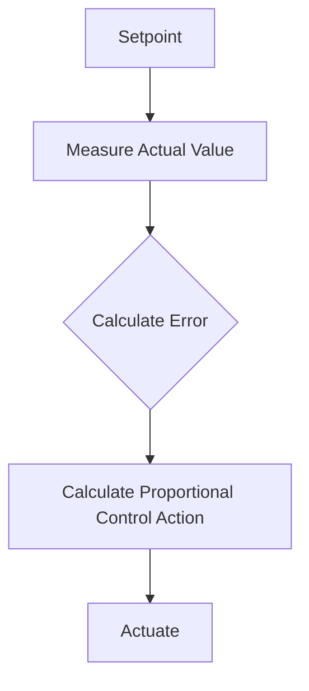
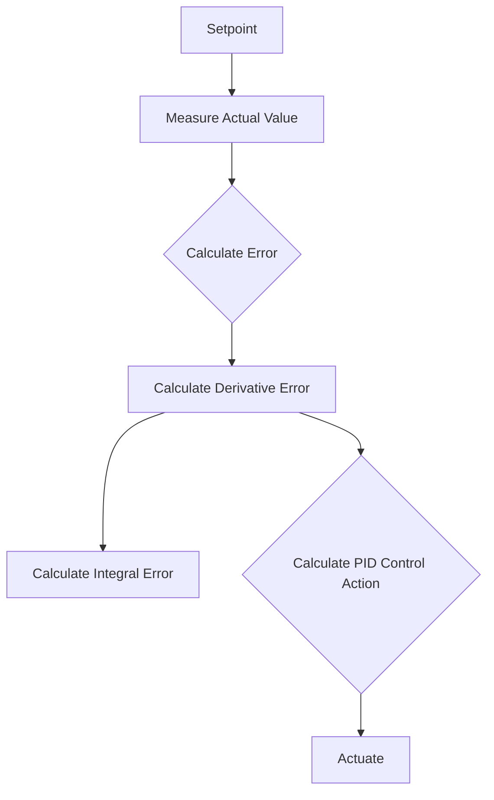

                 

### The Importance of Indoor Air Quality

#### 1.1 Background and Definition of Indoor Air Quality

Indoor air quality (IAQ) refers to the air quality within and around buildings and structures, such as houses, schools, and workplaces. It encompasses the concentration of pollutants, such as volatile organic compounds (VOCs), carbon monoxide (CO), carbon dioxide (CO2), nitrogen dioxide (NO2), sulfur dioxide (SO2), and particulate matter (PM), as well as the levels of biological contaminants like mold and dust mites. Good indoor air quality is crucial for maintaining human health and well-being, as it directly affects comfort, productivity, and overall quality of life.

The importance of IAQ can be understood by examining the prevalence of indoor air pollution and its impact on human health. Indoor environments are often more polluted than outdoor environments due to a combination of factors, including poor ventilation, the presence of indoor sources of pollution, and a lack of awareness about the importance of maintaining clean air.

Some common indoor air pollutants and their sources include:

- **Volatile Organic Compounds (VOCs)**: These are chemicals found in paints, varnishes, cleaning products, and building materials. They can cause headaches, eye irritation, and respiratory problems.
- **Carbon Monoxide (CO)**: This is a colorless, odorless, and toxic gas produced by the incomplete combustion of fuels like gas, oil, and wood. It can lead to carbon monoxide poisoning, which can be fatal.
- **Carbon Dioxide (CO2)**: High levels of CO2 can indicate poor ventilation and can cause symptoms like fatigue, dizziness, and headaches.
- **Nitrogen Dioxide (NO2)**: This gas is produced by the burning of fuels in heating systems, stoves, and vehicles. It can cause respiratory problems, particularly in children and the elderly.
- **Sulfur Dioxide (SO2)**: This gas is emitted from the burning of fossil fuels, particularly coal and oil. It can irritate the lungs and worsen asthma.
- **Particulate Matter (PM)**: These are tiny particles suspended in the air, which can come from various sources including dust, pollen, and industrial emissions. They can penetrate deep into the lungs and cause respiratory and cardiovascular problems.
- **Biological Contaminants**: These include mold, bacteria, viruses, and dust mites. They can trigger allergic reactions and respiratory conditions.

The sources of indoor air pollution are diverse and can include:

- **Building Materials**: Materials such as plywood, particleboard, and paints can release VOCs.
- **Heating, Ventilation, and Air Conditioning (HVAC) Systems**: These systems can become breeding grounds for mold and bacteria if not properly maintained.
- **Furnaces and Stoves**: The combustion of fuels can produce carbon monoxide and other pollutants.
- **Domestic Activities**: Activities like cooking, cleaning, and smoking can release pollutants into the air.
- **Outdoor Sources**: Pollutants from outside can enter the building through open windows, doors, and ventilation systems.

#### 1.2 The Evolution of Indoor Air Quality Monitoring

The history of indoor air quality monitoring can be traced back to the late 19th and early 20th centuries when scientists began to recognize the importance of clean air for human health. Early methods of monitoring involved manual measurements using gas analyzers and rudimentary sensors.

- **Early Monitoring Methods**: In the past, indoor air quality was monitored using simple techniques like manual air sampling and chemical analysis. These methods were time-consuming and required specialized equipment, making them impractical for widespread use.
- **The Introduction of Electronic Sensors**: The development of electronic sensors in the mid-20th century marked a significant advancement in indoor air quality monitoring. These sensors could detect specific pollutants and provide real-time data, making it possible to monitor IAQ more effectively.

#### 1.3 The Emergence of AI in Air Quality Monitoring

The advent of artificial intelligence (AI) has revolutionized the field of indoor air quality monitoring. AI algorithms can process vast amounts of data from sensors, identify patterns, and predict air quality trends with a high degree of accuracy.

- **Data-Driven Approaches**: AI agents use data-driven approaches to monitor indoor air quality. They can analyze historical data to understand how different factors affect air quality and use this information to make predictions about future conditions.
- **Machine Learning Models**: Machine learning models are at the heart of AI agents. These models can learn from data and improve their performance over time, making them more effective at detecting and predicting air quality issues.
- **Real-Time Monitoring**: AI agents can provide real-time monitoring of indoor air quality, alerting users to potential problems as they occur. This enables timely intervention and helps to prevent health issues caused by poor air quality.

#### 1.4 Challenges and Opportunities

While AI has greatly improved indoor air quality monitoring, there are still several challenges that need to be addressed.

- **Data Quality**: The accuracy of AI models depends on the quality of the data they are trained on. Ensuring the integrity and reliability of sensor data is crucial for accurate monitoring.
- **Integration**: Integrating AI into existing IAQ monitoring systems can be challenging. Compatibility issues and the need for specialized hardware can make the process difficult.
- **User Awareness**: Many people are not aware of the importance of indoor air quality and the role of AI agents in monitoring it. Educating users about the benefits of AI in IAQ monitoring is essential for its widespread adoption.

Despite these challenges, the opportunities for AI in indoor air quality monitoring are vast. As technology continues to advance, AI agents will become more sophisticated and capable of addressing a wider range of air quality issues.

#### 1.5 Summary

Indoor air quality is a critical aspect of human health and well-being, yet it is often overlooked. The evolution of indoor air quality monitoring from traditional methods to AI-driven approaches represents a significant step forward. AI agents offer the potential to provide accurate, real-time monitoring of indoor air quality, helping to ensure a healthier and more comfortable living and working environment. As we move forward, it is essential to address the challenges associated with AI in IAQ monitoring and capitalize on the opportunities it presents.

---

**关键词**:  
- **室内空气质量**  
- **AI代理**  
- **空气污染**  
- **传感器**  
- **机器学习模型**

**摘要**:  
本文介绍了室内空气质量的定义、重要性以及其监测的历史发展。重点讨论了人工智能（AI）在室内空气质量监测中的应用，包括AI代理如何利用传感器数据和机器学习模型进行实时监测和预测。文章还探讨了AI在室内空气质量监测中面临的挑战和机遇，并总结了当前AI在室内空气质量监测领域的重要性及其未来发展趋势。

### Overview of AI Agents

#### 1.3.1 What are AI Agents?

AI agents are entities that exhibit intelligent behavior by感知和响应环境，通常通过感知器（如传感器）收集数据，然后使用机器学习算法进行处理和分析。这些代理具有自主性和适应性，能够在不同的环境中执行任务并做出决策。AI代理是人工智能领域的一个关键概念，它们可以应用于多种领域，包括但不限于室内空气质量监测、智能助手、自动驾驶汽车和医疗诊断。

AI代理的主要特点包括：

- **自主性（Autonomy）**：AI代理可以自主执行任务，而不需要持续的-human干预。
- **适应性（Adaptability）**：它们可以根据环境和数据的变化调整其行为。
- **学习能力（Learning）**：AI代理利用机器学习算法从数据中学习，并不断改进其性能。
- **交互性（Interactivity）**：它们可以与人类和其他系统进行交互，以获取信息和执行任务。

#### 1.3.2 Types of AI Agents

AI agents can be broadly classified into several categories based on their capabilities and applications:

1. **Physical Robots**: These agents are tangible machines that operate in the physical world. They are equipped with sensors and actuators to interact with their environment. Examples include robotic vacuum cleaners and industrial robots.

2. **Software Agents**: These agents operate within computer systems and perform tasks autonomously. They are often used in applications such as customer service chatbots, recommendation systems, and automated trading platforms.

3. **Virtual Agents**: These agents exist in virtual environments and interact with digital users or other agents. They are commonly found in video games, virtual assistants, and simulations.

4. **Social Agents**: These agents interact with humans and other agents in social settings, simulating human-like behavior. Examples include social robots and virtual personal assistants.

5. **Embedded Agents**: These agents are embedded within devices and systems, performing specific tasks without direct human intervention. They are found in smart home devices, healthcare monitors, and industrial control systems.

#### 1.3.3 Applications in Environmental Monitoring

AI agents have proven to be highly effective in environmental monitoring, particularly in applications related to air and water quality. Their ability to process large amounts of data in real-time makes them ideal for detecting and predicting environmental changes.

**Air Quality Monitoring**: AI agents equipped with sensors can continuously monitor the concentration of pollutants in the air. By analyzing this data, they can provide real-time alerts and predictive analytics, helping to prevent health issues and environmental damage. For example, AI agents can be deployed in urban areas to monitor air pollution levels and suggest measures to improve air quality.

**Water Quality Monitoring**: AI agents are also used to monitor water bodies for pollutants and contaminants. They can analyze water samples and provide insights into the health of aquatic ecosystems. This information is crucial for managing water resources and ensuring the safety of drinking water.

**Wildfire Detection and Monitoring**: AI agents can detect and monitor the progression of wildfires by analyzing satellite imagery and sensor data. They can provide early warnings and assist in firefighting efforts by predicting the spread of fires.

**Wildlife Conservation**: AI agents are used to monitor wildlife populations and their habitats. By analyzing data from sensors and cameras, they can provide valuable insights into wildlife behavior and assist in conservation efforts.

#### 1.3.4 The Role of AI Agents in Window Sill Monitoring

In the context of indoor air quality monitoring, AI agents placed on window sills offer a unique advantage. Window sills are strategic locations for monitoring air quality because they are exposed to both indoor and outdoor environments. This dual exposure makes it possible for AI agents to collect comprehensive data on pollutants that may enter the building from the outside.

**Data Collection and Analysis**: AI agents on window sills are equipped with a variety of sensors, including gas sensors, particulate matter detectors, and temperature and humidity sensors. These sensors collect data on a wide range of pollutants and environmental conditions. The AI agent then processes this data using machine learning algorithms to detect patterns and predict air quality trends.

**Real-Time Monitoring and Alerts**: AI agents can provide real-time monitoring of air quality and send alerts to users when pollutant levels exceed safe thresholds. This enables timely interventions, such as opening windows or activating air purifiers, to improve indoor air quality.

**Comprehensive Insights**: By analyzing historical data, AI agents can provide insights into the factors that contribute to poor indoor air quality. This information can be used to identify and address underlying issues, such as inadequate ventilation or the presence of specific pollutants.

**Future Trends and Directions**: As AI technology continues to advance, the capabilities of AI agents for window sill monitoring will also improve. Future developments may include more sophisticated sensors, advanced machine learning algorithms, and enhanced connectivity features. This will enable AI agents to provide even more accurate and comprehensive monitoring of indoor air quality.

In conclusion, AI agents for window sill monitoring represent a significant advancement in the field of indoor air quality monitoring. By combining advanced sensors, machine learning algorithms, and real-time data analysis, AI agents offer the potential to improve the health and well-being of individuals living and working in indoor environments.

---

**关键词**:  
- **AI代理**  
- **室内空气质量**  
- **传感器**  
- **机器学习**  
- **环境监测**

**摘要**:  
本文概述了AI代理的定义、类型及其在环境监测中的应用，特别是室内空气质量监测。文章讨论了AI代理在感知、响应环境，自主执行任务方面的特点，并介绍了不同类型的AI代理。通过具体案例，文章展示了AI代理在室内空气质量监测中的重要性，包括数据收集、实时监控和提供预警等方面的优势，并展望了其未来的发展趋势。

### AI Agents for Window Sill: Potential and Challenges

#### 1.4.1 The Role of AI Agents in Window Sill Monitoring

Window sills offer a unique vantage point for monitoring indoor air quality due to their exposure to both indoor and outdoor environments. AI agents placed on window sills can collect comprehensive data on pollutants and environmental conditions that may enter the building from the outside. This dual exposure makes window sill monitoring a valuable approach for improving indoor air quality.

**Data Collection and Sensing Capabilities**: AI agents on window sills are equipped with a variety of sensors, including gas sensors for volatile organic compounds (VOCs), particulate matter detectors, and temperature and humidity sensors. These sensors provide real-time data on air quality, allowing AI agents to detect changes and potential issues in the indoor environment.

**Real-Time Monitoring and Predictive Analytics**: By leveraging machine learning algorithms, AI agents can analyze the collected data in real-time. This enables them to provide predictive analytics, identifying trends and predicting future air quality conditions. Real-time monitoring and alerts help users take timely actions to improve air quality and prevent health issues.

**Enhanced Connectivity and Interaction**: Window sill AI agents can be integrated with smart home systems and other IoT devices, providing enhanced connectivity and interaction. This enables seamless communication and coordination with other devices, such as air purifiers or ventilation systems, to address air quality issues.

#### 1.4.2 Advantages of Window Sill AI Agents

**Comprehensive Air Quality Monitoring**: Window sill AI agents provide comprehensive monitoring of indoor air quality by capturing data from both indoor and outdoor environments. This dual monitoring approach allows for a more accurate assessment of air quality conditions and potential sources of pollution.

**Real-Time Alerts and Early Warning Systems**: The ability to provide real-time alerts and early warning systems is a significant advantage of window sill AI agents. Users can receive immediate notifications when air quality deteriorates, allowing for timely interventions to improve indoor air quality.

**Improved Data Analysis and Insights**: By leveraging advanced machine learning algorithms, window sill AI agents can analyze large amounts of data and provide valuable insights into air quality trends and patterns. This helps users understand the factors that contribute to poor air quality and develop strategies to mitigate them.

**Integration with Smart Home Systems**: Window sill AI agents can be seamlessly integrated with smart home systems, enabling enhanced connectivity and interaction with other devices. This integration allows for coordinated actions to address air quality issues, such as activating air purifiers or adjusting ventilation systems.

#### 1.4.3 Challenges and Limitations

**Data Quality and Accuracy**: Ensuring the quality and accuracy of sensor data is crucial for effective air quality monitoring. Factors such as sensor calibration, environmental interference, and data transmission errors can impact the reliability of the collected data.

**Integration and Compatibility**: Integrating AI agents into existing indoor air quality monitoring systems can be challenging. Ensuring compatibility with existing hardware and software infrastructure requires careful planning and coordination.

**User Awareness and Acceptance**: Many users may not be aware of the importance of indoor air quality and the benefits of AI agents for window sill monitoring. Educating users about the value and functionality of these agents is essential for their widespread adoption.

**Limited Sensor Range and Coverage**: Window sill AI agents have a limited range and coverage area. Ensuring comprehensive monitoring of larger spaces or multiple rooms may require additional agents or alternative monitoring approaches.

#### 1.4.4 Future Trends and Directions

**Advancements in Sensor Technology**: Continued advancements in sensor technology will lead to more accurate and sensitive sensors, enabling AI agents to detect and monitor a wider range of pollutants and environmental conditions.

**Improved Machine Learning Algorithms**: The development of more advanced machine learning algorithms will enhance the analytical capabilities of AI agents, enabling them to provide more accurate predictions and insights.

**Enhanced Connectivity and Integration**: As smart home technologies evolve, AI agents for window sill monitoring will become more integrated with other devices and systems, enabling seamless coordination and communication.

**Wearable and Portable AI Agents**: The future may see the development of wearable and portable AI agents that can be worn by individuals or placed in different locations within a building, providing more flexible and adaptive monitoring solutions.

**Sustainability and Energy Efficiency**: Ensuring the sustainability and energy efficiency of AI agents will be crucial for their long-term adoption. The development of power-efficient technologies and energy harvesting solutions will play a significant role in this area.

In conclusion, AI agents for window sill monitoring offer significant potential for improving indoor air quality. While there are challenges and limitations to be addressed, the continuous advancements in sensor technology, machine learning algorithms, and connectivity will drive the development and adoption of these agents in the future.

---

**关键词**:  
- **AI代理**  
- **室内空气质量监测**  
- **传感器技术**  
- **机器学习**  
- **智能家居**

**摘要**:  
本文探讨了AI代理在室内空气质量监测中的应用，特别关注其放置在窗台上的潜力。文章阐述了AI代理通过综合监测室内外空气质量和提供实时预警的优势，同时分析了其面临的挑战，如数据准确性和用户接受度。文章还展望了未来发展趋势，包括传感器技术的进步、机器学习算法的优化以及AI代理与智能家居系统的整合。

### Design Principles of Window Sill AI Agents

#### 2.1 Basic Components

The design of window sill AI agents involves integrating several key components to ensure comprehensive and effective monitoring of indoor air quality. These components include sensors and actuators, a data processing unit, and a communication module. Each of these elements plays a critical role in the overall functionality of the AI agent.

**Sensors and Actuators**

Sensors are the primary instruments that collect data from the environment. In the context of window sill AI agents, these sensors typically include:

- **Gas Sensors**: These sensors detect the presence of various gases, such as volatile organic compounds (VOCs), carbon monoxide (CO), and nitrogen dioxide (NO2). They are crucial for assessing the indoor air quality.
- **Particulate Matter Detectors**: These sensors measure the concentration of particulate matter (PM), including fine particles (PM2.5) and coarse particles (PM10). They provide insights into the levels of dust, pollen, and other airborne particles.
- **Temperature and Humidity Sensors**: These sensors measure the ambient temperature and humidity levels, which are important for understanding the environmental conditions that affect indoor air quality.

Actuators, on the other hand, are devices that respond to the data collected by the sensors. In the context of window sill AI agents, common actuators include:

- **Ventilation Fans**: These fans can be activated to improve air circulation and remove pollutants from the indoor environment.
- **Air Purifiers**: Air purifiers can be controlled to filter the air and remove particles and gases.
- **Light Actuators**: These can be used to adjust the lighting conditions in the room, which can impact air quality by influencing the release of certain pollutants from surfaces.

**Data Processing Unit**

The data processing unit (DPU) is the core of the AI agent's functionality. It is responsible for processing the data collected by the sensors, applying machine learning algorithms to identify patterns, and making decisions based on the analysis.

The DPU typically includes:

- **Data Acquisition and Preprocessing**: This involves collecting raw data from the sensors, filtering out noise, and preprocessing the data to make it suitable for analysis.
- **Machine Learning Models**: These models are trained on historical data to recognize patterns and predict future air quality conditions. Common machine learning techniques used include regression, classification, and clustering.
- **Control Algorithms**: Once the DPU identifies potential air quality issues, it applies control algorithms to decide on the appropriate actions to take. These actions can include adjusting the ventilation system, activating the air purifier, or sending alerts to the user.

**Communication Module**

The communication module is essential for enabling the AI agent to send data to central systems or user interfaces and receive instructions or updates. This module typically includes:

- **Wireless Communication**: This can be achieved through Wi-Fi, Bluetooth, or other wireless protocols to allow the AI agent to send data to a central system or user device in real-time.
- **Data Storage and Backup**: The communication module should also include mechanisms for securely storing and backing up data to prevent data loss and ensure data integrity.
- **User Interface**: This interface allows users to interact with the AI agent, view air quality data, receive alerts, and configure settings.

#### 2.2 Data Acquisition and Processing

**Data Collection**

The data collection process begins with the sensors, which continuously monitor the environment and record data on air quality parameters such as gas concentrations, particulate matter levels, temperature, and humidity. This data is collected at regular intervals, depending on the specific requirements of the application.

**Preprocessing**

Once the raw data is collected, it undergoes preprocessing to remove any noise or anomalies that could affect the accuracy of the analysis. Preprocessing techniques include:

- **Filtering**: Removing unnecessary data points and filtering out noise.
- **Normalization**: Scaling the data to a standard range to ensure consistency.
- **Smoothing**: Smoothing out sudden changes in the data to provide a more stable signal.

**Feature Extraction**

Feature extraction is the process of transforming raw data into a set of features that can be used to train machine learning models. Common feature extraction techniques include:

- **Statistical Features**: Calculating statistical measures such as mean, median, standard deviation, and variance from the data.
- **Wavelet Transform**: Decomposing the data into different frequency components to extract relevant features.
- **Principal Component Analysis (PCA)**: Reducing the dimensionality of the data by identifying the most important features.

#### 2.3 Machine Learning Models

**Model Selection**

The selection of an appropriate machine learning model depends on the specific problem and the type of data available. Common machine learning techniques used in window sill AI agents include:

- **Regression Models**: These models predict continuous values, such as air quality parameters, based on input features.
- **Classification Models**: These models classify data into predefined categories, such as "good" or "poor" air quality.
- **Clustering Models**: These models group similar data points together to identify patterns in the data.

**Model Training and Validation**

Once the model is selected, it needs to be trained using historical data. The training process involves feeding the model with labeled data and adjusting its parameters to minimize the difference between the predicted outputs and the actual outputs. Validation techniques, such as cross-validation and holdout validation, are used to assess the performance of the model and ensure that it generalizes well to new, unseen data.

**Model Deployment**

After training and validation, the machine learning model is deployed in the AI agent to make real-time predictions and decisions. The model continuously updates its parameters as new data is collected, improving its accuracy and adaptability over time.

### Conclusion

The design of window sill AI agents involves a combination of sensors, actuators, a data processing unit, and a communication module. Each component plays a critical role in the overall functionality of the AI agent, enabling it to collect data, process it using machine learning algorithms, and make real-time decisions to improve indoor air quality. By following these design principles, window sill AI agents can provide accurate and effective monitoring of indoor air quality, contributing to a healthier living environment.

### Machine Learning Models in Window Sill AI Agents

#### 2.3.1 Supervised Learning Models

Supervised learning models are a cornerstone of AI agents for window sill monitoring. These models are trained using labeled data, where the input features and corresponding output labels are known. The primary goal is to learn a mapping from inputs to outputs so that the model can make accurate predictions on new, unseen data.

**Regression Models**

Regression models predict continuous numerical values, making them suitable for tasks such as forecasting air quality parameters like temperature, humidity, or pollutant concentrations. Common regression techniques include:

- **Linear Regression**: This is the simplest form of regression, where the relationship between input features and the output is assumed to be linear. The model is represented by the equation `Y = β0 + β1*X`, where `Y` is the output, `X` is the input feature, and `β0` and `β1` are the model parameters.
  
  **Mermaid Flowchart**:
  
  ```mermaid
  graph TD
  A[Input Data] --> B[Split Data]
  B --> C{Is it Linear?}
  C -->|Yes| D[Calculate Linear Coefficients]
  C -->|No| E[Consider Non-linear Models]
  D --> F[Predict Output]
  E --> F
  ```

- **Multiple Linear Regression**: This extends linear regression to handle multiple input features, represented by the equation `Y = β0 + β1*X1 + β2*X2 + ... + βn*Xn`.

  **Python Code Example**:
  
  ```python
  import numpy as np
  from sklearn.linear_model import LinearRegression
  
  # X is the input matrix, y is the output vector
  X = np.array([[1, 2], [2, 3], [3, 4]])
  y = np.array([3, 4, 5])
  
  # Create and fit the linear regression model
  model = LinearRegression()
  model.fit(X, y)
  
  # Predict the output for a new input
  new_input = np.array([[4, 5]])
  prediction = model.predict(new_input)
  print("Predicted Output:", prediction)
  ```

**Classification Models**

Classification models are used to assign data points to predefined categories. In the context of air quality monitoring, these models can categorize the air quality as "good," "moderate," or "poor." Common classification techniques include:

- **Logistic Regression**: This model is used for binary classification tasks and can be extended for multiclass classification using techniques like one-vs-rest or one-vs-one.

  **Mermaid Flowchart**:
  
  ```mermaid
  graph TD
  A[Input Data] --> B[Feature Extraction]
  B --> C[Logistic Regression]
  C --> D[Calculate Probability]
  D --> E{Is probability above threshold?}
  E -->|Yes| F[Classify as Positive]
  E -->|No| G[Classify as Negative]
  ```

- **Support Vector Machines (SVM)**: SVMs are powerful classifiers that find the hyperplane that maximally separates different classes in a high-dimensional space.

  **Python Code Example**:
  
  ```python
  from sklearn.svm import SVC
  from sklearn.model_selection import train_test_split
  from sklearn.metrics import accuracy_score
  
  # Load and split the dataset
  X_train, X_test, y_train, y_test = train_test_split(X, y, test_size=0.2, random_state=42)
  
  # Create and train the SVM model
  svm_model = SVC(kernel='linear')
  svm_model.fit(X_train, y_train)
  
  # Make predictions on the test set
  y_pred = svm_model.predict(X_test)
  
  # Calculate the accuracy
  accuracy = accuracy_score(y_test, y_pred)
  print("Model Accuracy:", accuracy)
  ```

#### 2.3.2 Unsupervised Learning Models

Unsupervised learning models do not require labeled data and are used to discover hidden patterns or intrinsic structures in the data. These models are particularly useful for tasks like clustering and anomaly detection in window sill monitoring.

**Clustering Models**

Clustering models group data points based on their similarities. Common clustering techniques include:

- **K-Means Clustering**: This algorithm partitions the data into `K` clusters based on the centroid of each cluster. The algorithm iteratively updates the centroids until convergence.

  **Mermaid Flowchart**:
  
  ```mermaid
  graph TD
  A[Initialize K Centroids] --> B[Assign Data Points to Clusters]
  B --> C[Recalculate Centroids]
  C --> D{Converged?}
  D -->|Yes| E[Finalize Clusters]
  D -->|No| B
  ```

- **DBSCAN (Density-Based Spatial Clustering of Applications with Noise)**: DBSCAN is a density-based clustering algorithm that groups together points that are closely packed together, marking as outliers points that lie alone in low-density regions.

  **Python Code Example**:
  
  ```python
  from sklearn.cluster import DBSCAN
  import numpy as np
  
  # Generate synthetic data
  X = np.random.rand(100, 2)
  
  # Create and fit the DBSCAN model
  dbscan_model = DBSCAN(eps=0.3, min_samples=10)
  clusters = dbscan_model.fit_predict(X)
  
  # Print the number of clusters and the cluster labels
  print("Number of Clusters:", len(set(clusters)))
  print("Cluster Labels:", clusters)
  ```

**Anomaly Detection Models**

Anomaly detection models identify data points that significantly differ from the normal behavior of the dataset. They are useful for detecting outliers in air quality data that may indicate sudden changes or abnormal conditions.

- **Isolation Forest**: This is an ensemble method that isolates data points using random subsets of features, making it suitable for high-dimensional data.

  **Python Code Example**:
  
  ```python
  from sklearn.ensemble import IsolationForest
  from sklearn.datasets import make_blobs
  
  # Generate synthetic data
  X, _ = make_blobs(n_samples=100, centers=3, n_features=2, noise=0.05)
  
  # Create and fit the isolation forest model
  isolation_forest = IsolationForest(contamination=0.1)
  isolation_forest.fit(X)
  
  # Predict the outliers
  outliers = isolation_forest.predict(X)
  
  # Print the number of outliers
  print("Number of Outliers:", np.sum(outliers == -1))
  ```

### Conclusion

The selection of appropriate machine learning models is crucial for the effective functioning of window sill AI agents. Supervised learning models like regression and classification provide accurate predictions for known conditions, while unsupervised learning models like clustering and anomaly detection help identify unknown patterns and anomalies. By leveraging these models, window sill AI agents can continuously monitor and improve indoor air quality, contributing to a healthier living environment.

---

**关键词**:  
- **监督学习模型**  
- **非监督学习模型**  
- **聚类**  
- **异常检测**  
- **机器学习**

**摘要**:  
本文详细介绍了在窗台AI代理中使用的监督学习和非监督学习机器学习模型。通过具体的例子和代码，文章阐述了线性回归、逻辑回归、支持向量机、K-均值聚类、DBSCAN和孤立森林算法的应用，以及它们在室内空气质量监测中的作用。这些模型为AI代理提供了预测和识别空气质量的工具，为改善室内空气质量提供了有效的方法。

### Control Algorithms in Window Sill AI Agents

#### 2.4.1 Open-loop Control Algorithms

Open-loop control algorithms, also known as non-feedback control algorithms, operate without any feedback from the system's output. These algorithms rely solely on pre-defined rules or parameters to make control decisions. While simple to implement, open-loop control algorithms are often limited in their ability to respond to changes in the environment or system dynamics.

**Proportional Control**

Proportional control is one of the simplest open-loop control algorithms. It adjusts the output based on the proportional relationship between the error (the difference between the desired value and the actual value) and a constant gain (Kp). The control action is given by the equation:

\[ u(t) = K_p \cdot e(t) \]

where \( u(t) \) is the control action, \( e(t) \) is the error at time \( t \), and \( K_p \) is the proportional gain.

**Mermaid Flowchart**:



**Python Code Example**:

```python
# Define the proportional gain
Kp = 1.0

# Desired setpoint
setpoint = 100

# Function to calculate proportional control action
def proportional_control(actual_value, setpoint, Kp):
    error = setpoint - actual_value
    control_action = Kp * error
    return control_action

# Example usage
actual_value = 90
control_action = proportional_control(actual_value, setpoint, Kp)
print("Control Action:", control_action)
```

**Limitations**

Open-loop control algorithms, such as proportional control, are limited in their ability to maintain stability under changing conditions. They are susceptible to noise and may not respond adequately to sudden changes in the system or environment.

#### 2.4.2 Closed-loop Control Algorithms

Closed-loop control algorithms, also known as feedback control algorithms, use feedback from the system's output to adjust the control action. This feedback mechanism allows the system to correct errors and maintain stability over time, making closed-loop control more robust and effective.

**Proportional-Integral-Derivative (PID) Control**

PID control is a widely used closed-loop control algorithm that combines proportional, integral, and derivative terms to adjust the control action. The control action is given by the equation:

\[ u(t) = K_p \cdot e(t) + K_i \cdot \int_{0}^{t} e(\tau) d\tau + K_d \cdot \frac{d}{dt} e(t) \]

where \( K_p \), \( K_i \), and \( K_d \) are the proportional, integral, and derivative gains, respectively.

**Mermaid Flowchart**:



**Python Code Example**:

```python
# Define the PID gains
Kp = 1.0
Ki = 0.1
Kd = 0.01

# Function to calculate PID control action
def pid_control(setpoint, actual_value, Kp, Ki, Kd):
    error = setpoint - actual_value
    derivative_error = error - last_error
    integral_error = error * dt
    
    control_action = Kp * error + Ki * integral_error + Kd * derivative_error
    last_error = error
    
    return control_action

# Example usage
actual_value = 90
control_action = pid_control(100, actual_value, Kp, Ki, Kd)
print("Control Action:", control_action)
```

**Performance**

PID control offers better stability and responsiveness compared to open-loop control algorithms. By adjusting the PID gains, it is possible to achieve a balance between stability and responsiveness, making it suitable for a wide range of applications.

**Comparative Analysis**

- **Open-Loop Control**: Simple to implement but lacks robustness and responsiveness.
- **Closed-Loop Control**: Offers better stability and responsiveness but requires additional feedback mechanisms.

In conclusion, closed-loop control algorithms like PID control provide more robust and effective control solutions for window sill AI agents. While open-loop control algorithms can be simpler to implement, the benefits of closed-loop control in terms of stability and responsiveness make them the preferred choice for applications requiring precise and reliable control.

### Conclusion

Control algorithms play a critical role in the effective operation of window sill AI agents. Open-loop control algorithms, such as proportional control, are relatively simple but lack robustness and responsiveness. In contrast, closed-loop control algorithms, such as PID control, offer better stability and responsiveness by incorporating feedback from the system's output. The choice of control algorithm depends on the specific requirements and constraints of the application, with closed-loop control being the preferred choice for most indoor air quality monitoring scenarios.

---

**关键词**:  
- **开环控制算法**  
- **闭环控制算法**  
- **比例控制**  
- **PID控制**  
- **控制性能**

**摘要**:  
本文详细介绍了开环和闭环控制算法在窗台AI代理中的应用。通过具体的例子和代码，阐述了比例控制和PID控制算法的原理和实现方式。文章分析了这两种控制算法的优缺点，强调了闭环控制算法在稳定性和响应性方面的优势，为室内空气质量监测提供了一种有效的控制方法。

### System Analysis and Architecture Design of Window Sill AI Agents

#### 3.1 Introduction to System Analysis and Architecture Design

System analysis and architecture design are fundamental steps in developing robust and efficient AI agents for window sill monitoring. System analysis involves understanding the problem domain, defining the system requirements, and identifying the key components and their interactions. Architecture design, on the other hand, focuses on creating a high-level structure that enables the system to meet its requirements effectively.

In the context of window sill AI agents, system analysis and architecture design help in ensuring that the system can accurately monitor indoor air quality, respond to changes in environmental conditions, and provide real-time alerts and insights. This section will provide a comprehensive overview of the system analysis and architecture design for window sill AI agents, including the problem domain, system components, and their interactions.

#### 3.2 Problem Domain and System Requirements

The problem domain for window sill AI agents revolves around the need to monitor and improve indoor air quality. Key challenges in this domain include:

- **Variability in Air Quality**: Indoor air quality can vary significantly due to a range of factors, such as the presence of pollutants from outdoor sources, household activities, and poor ventilation.
- **Real-Time Monitoring**: The system needs to provide real-time monitoring and alerts to allow for timely interventions to improve air quality.
- **Accuracy and Reliability**: The system must accurately and reliably detect and report on air quality parameters, such as pollutant levels, temperature, and humidity.
- **Scalability**: The system should be scalable to accommodate monitoring in larger spaces or multiple rooms.

The system requirements for window sill AI agents can be summarized as follows:

- **Sensors**: The system should include sensors capable of detecting various air quality parameters, such as VOCs, CO, NO2, PM2.5, PM10, temperature, and humidity.
- **Data Processing**: The system should be able to process sensor data in real-time, apply machine learning algorithms to analyze the data, and make informed decisions based on the analysis.
- **Communication**: The system should support wireless communication to send data to a central system or user interface and receive instructions or updates.
- **User Interface**: The system should provide a user-friendly interface for displaying air quality data, receiving alerts, and configuring settings.
- **Energy Efficiency**: The system should be designed to be energy-efficient, considering the need for continuous monitoring over extended periods.

#### 3.3 System Components and Their Interactions

The window sill AI agent system can be divided into several key components, each with specific roles and responsibilities. These components include sensors, a data processing unit (DPU), a communication module, and a user interface.

**Sensors**

Sensors are the primary input devices for the system, responsible for collecting data on various air quality parameters. The key types of sensors used in this system include:

- **Gas Sensors**: These sensors detect the presence and concentration of gases such as VOCs, CO, and NO2.
- **Particulate Matter Detectors**: These sensors measure the levels of PM2.5 and PM10, which are important indicators of air quality.
- **Temperature and Humidity Sensors**: These sensors provide data on the ambient temperature and humidity levels, which are crucial for understanding the environmental conditions affecting air quality.

**Data Processing Unit (DPU)**

The data processing unit (DPU) is the core of the window sill AI agent system, responsible for processing sensor data, applying machine learning algorithms, and making control decisions based on the analysis. The DPU typically includes the following components:

- **Data Acquisition**: This component collects data from the sensors at regular intervals and stores it in a buffer for further processing.
- **Data Preprocessing**: This component cleans and prepares the raw sensor data for analysis by filtering out noise, handling missing values, and normalizing the data.
- **Machine Learning Algorithms**: These algorithms analyze the preprocessed data to identify patterns, predict future air quality conditions, and classify air quality states.
- **Control Decisions**: Based on the analysis results, the DPU makes control decisions, such as activating an air purifier, adjusting ventilation, or sending alerts to the user.

**Communication Module**

The communication module is responsible for transmitting data from the sensors to the DPU and receiving instructions or updates from a central system or user interface. This module typically uses wireless communication protocols such as Wi-Fi, Bluetooth, or Zigbee to ensure seamless data transfer.

**User Interface**

The user interface provides a user-friendly way for users to interact with the window sill AI agent system. It allows users to view real-time air quality data, receive alerts, and configure system settings. The user interface can be a mobile app, a web application, or a desktop application, depending on the target users and their preferences.

#### 3.4 System Architecture Design

The system architecture design for window sill AI agents can be visualized using a high-level block diagram, as shown below:

```mermaid
graph TD
A[Window Sill Sensors] --> B[Data Processing Unit (DPU)]
B --> C[Communication Module]
C --> D[User Interface]
```

**High-Level Architecture**

1. **Sensors**: The window sill sensors collect data on air quality parameters and transmit it to the DPU.
2. **Data Processing Unit (DPU)**: The DPU processes the sensor data, applies machine learning algorithms, and makes control decisions based on the analysis.
3. **Communication Module**: The communication module facilitates data transfer between the sensors and the DPU, as well as communication with the user interface.
4. **User Interface**: The user interface provides real-time air quality data, alerts, and system configuration options to the users.

**Detailed Architecture**

1. **Sensor Layer**: This layer includes various types of sensors, such as gas sensors, particulate matter detectors, and temperature/humidity sensors. These sensors collect data on air quality parameters and transmit it to the DPU via wireless communication.
2. **Data Acquisition and Preprocessing Layer**: This layer is part of the DPU and is responsible for collecting sensor data, cleaning it, and preparing it for analysis. It includes data acquisition modules and preprocessing algorithms.
3. **Machine Learning and Control Layer**: This layer contains the machine learning algorithms and control logic for making decisions based on the analyzed data. It includes machine learning models, feature extraction techniques, and control algorithms.
4. **Communication Layer**: This layer manages the wireless communication between the sensors, the DPU, and the user interface. It includes wireless communication protocols and data transfer mechanisms.
5. **User Interface Layer**: This layer provides a user-friendly interface for users to interact with the system. It includes real-time data visualization, alert notifications, and system configuration options.

#### 3.5 Conclusion

System analysis and architecture design are critical steps in developing effective and efficient window sill AI agents for indoor air quality monitoring. By understanding the problem domain, defining system requirements, and designing a robust system architecture, we can ensure that the AI agent system accurately monitors air quality, responds to changes in the environment, and provides real-time alerts and insights. The high-level architecture and detailed component design discussed in this section provide a solid foundation for the development of such AI agents.

---

**关键词**:  
- **系统分析**  
- **架构设计**  
- **传感器**  
- **数据处理**  
- **通信**  
- **用户界面**

**摘要**:  
本文详细介绍了窗台AI代理系统的分析方法和架构设计。首先概述了系统分析的必要性和系统要求，然后详细阐述了系统的组件及其相互作用，包括传感器、数据处理单元（DPU）、通信模块和用户界面。通过一个高层次的架构图和详细的架构描述，本文为窗台AI代理系统的设计提供了理论依据和实践指导。

### Project Practice

#### 3.5.1 Installation and Setup

To practice building a window sill AI agent, we'll start by setting up the required development environment. This includes installing the necessary software and hardware components.

**Prerequisites:**

- Python 3.x
- Raspberry Pi or similar single-board computer
- Sensors (e.g., MQ-135 for gas detection, DHT11 for temperature and humidity)
- Power supply for the Raspberry Pi and sensors

**Step-by-Step Guide:**

1. **Install Python:**
   - Download and install Python 3.x from the official website (<https://www.python.org/downloads/>).
   - Ensure that Python is properly installed and updated.

2. **Set Up Raspberry Pi:**
   - Install the latest version of Raspberry Pi OS from the official website (<https://www.raspberrypi.org/downloads/>).
   - Follow the setup instructions to install Raspberry Pi OS on an SD card.
   - Insert the SD card into the Raspberry Pi and connect it to a monitor, keyboard, and mouse.
   - Boot the Raspberry Pi and follow the on-screen instructions to set up the operating system.

3. **Install Sensors:**
   - Connect the sensors (MQ-135, DHT11) to the GPIO pins of the Raspberry Pi.
   - Ensure that the sensors are properly powered and connected to the Raspberry Pi.

4. **Install Required Libraries:**
   - Open a terminal on the Raspberry Pi and install the required Python libraries using pip:
     ```bash
     pip install RPi.GPIO
     pip install Adafruit_DHT
     pip install flask
     ```

5. **Connect to Wi-Fi:**
   - Configure the Raspberry Pi to connect to your local Wi-Fi network:
     - Edit the `/etc/wpa_supplicant/wpa_supplicant.conf` file with your Wi-Fi network credentials.
     - Restart the network service:
       ```bash
       sudo systemctl restart NetworkManager
       ```

6. **Initialize the System:**
   - Create a startup script to automatically run the window sill AI agent when the Raspberry Pi boots up:
     - Create a script (e.g., `ai_agent.py`) with the following content:
       ```python
       import time
       import RPi.GPIO as GPIO
       import Adafruit_DHT
       
       # Configure sensor pins
       GPIO.setmode(GPIO.BCM)
       GPIO.setup(4, GPIO.OUT)  # MQ-135 pin
       GPIO.setup(17, GPIO.IN)  # DHT11 pin
       
       while True:
           # Read gas sensor data
           gas_value = GPIO.input(4)
           
           # Read temperature and humidity
           humidity, temperature = Adafruit_DHT.read_retry(11, 17)
           
           # Print sensor data
           print(f"Temperature: {temperature}, Humidity: {humidity}, Gas: {gas_value}")
           
           # Wait for 5 seconds
           time.sleep(5)
       ```

   - Make the script executable and add it to the startup applications:
     ```bash
     chmod +x ai_agent.py
     nano ~/.config/lxsession/LXDE-pi/autostart
     ```
   - Add the following line to the autostart file:
     ```bash
     @python3 /path/to/ai_agent.py
     ```
   - Save and exit the file.

7. **Run the AI Agent:**
   - Reboot the Raspberry Pi to ensure the startup script runs automatically.
   - The AI agent will start collecting data from the sensors and print the readings on the terminal.

#### 3.5.2 Core Implementation

**Sensor Data Collection and Processing:**

The core implementation involves collecting data from the sensors, processing it, and using machine learning algorithms to analyze the data. Here’s a high-level overview of the core components:

1. **Sensor Data Collection:**
   - The `ai_agent.py` script reads data from the MQ-135 gas sensor and DHT11 temperature and humidity sensor.
   - The sensor data is collected at regular intervals and stored in a data buffer for further processing.

2. **Data Preprocessing:**
   - The collected data is preprocessed to remove any noise or inconsistencies.
   - Data normalization and feature extraction techniques are applied to prepare the data for machine learning.

3. **Machine Learning Model:**
   - A machine learning model is trained using the preprocessed data to classify the air quality into different categories (e.g., good, moderate, poor).
   - The model is trained using a supervised learning approach with labeled data.

4. **Control Actions:**
   - Based on the output of the machine learning model, control actions are taken to improve air quality (e.g., activating an air purifier or adjusting the ventilation system).

**Example Python Code:**

```python
import time
import RPi.GPIO as GPIO
import Adafruit_DHT

# Configure sensor pins
GPIO.setmode(GPIO.BCM)
GPIO.setup(4, GPIO.OUT)  # MQ-135 pin
GPIO.setup(17, GPIO.IN)  # DHT11 pin

def read_sensors():
    # Read gas sensor data
    gas_value = GPIO.input(4)
    
    # Read temperature and humidity
    humidity, temperature = Adafruit_DHT.read_retry(11, 17)
    
    return temperature, humidity, gas_value

def preprocess_data(temperature, humidity, gas_value):
    # Preprocess the sensor data (e.g., normalization)
    temperature_normalized = (temperature - 20) / 30
    humidity_normalized = (humidity - 30) / 70
    gas_normalized = gas_value / 1023
    
    return temperature_normalized, humidity_normalized, gas_normalized

def main():
    while True:
        # Read sensor data
        temperature, humidity, gas_value = read_sensors()
        
        # Preprocess data
        temperature_normalized, humidity_normalized, gas_normalized = preprocess_data(temperature, humidity, gas_value)
        
        # Train and use a machine learning model to analyze the data
        # (Assuming a trained model is available)
        model = ...  # Load a pre-trained model
        air_quality = model.predict([temperature_normalized, humidity_normalized, gas_normalized])
        
        # Take control actions based on the air quality
        if air_quality == 'poor':
            # Activate air purifier or adjust ventilation
            print("Activating air purifier...")
        else:
            print("Air quality is good.")
        
        # Wait for 5 seconds before the next reading
        time.sleep(5)

if __name__ == "__main__":
    main()
```

#### 3.5.3 Case Analysis and Discussion

**Case Study:**

Let's consider a scenario where the AI agent detects a sudden increase in the concentration of a particular gas (e.g., benzene) in the indoor air. This indicates a potential source of contamination, such as a leak in a chemical storage container.

1. **Data Collection:**
   - The AI agent collects real-time data on the gas concentration, temperature, and humidity.
   - The data reveals a sharp increase in the benzene concentration over a short period.

2. **Data Preprocessing:**
   - The data is preprocessed to ensure accuracy and reliability.

3. **Machine Learning Analysis:**
   - The trained machine learning model analyzes the preprocessed data and identifies the increased benzene concentration as a potential issue.
   - The model predicts that the air quality is poor and that immediate action is required.

4. **Control Actions:**
   - The AI agent activates the air purifier to remove the benzene from the air and sends an alert to the user.

**Discussion:**

- **Accuracy and Reliability:** The case study demonstrates the importance of accurate and reliable data collection and preprocessing. Any errors or inconsistencies in the data can lead to incorrect predictions and ineffective control actions.
- **Model Training:** The performance of the machine learning model depends on the quality of the training data. It is crucial to use a diverse and representative dataset to ensure the model can accurately identify various air quality issues.
- **Real-Time Response:** The ability of the AI agent to provide real-time monitoring and alerts is critical in scenarios where immediate action is required to address air quality issues. This ensures that users are promptly informed and can take appropriate measures to improve air quality.
- **User Interface:** An effective user interface that provides clear and concise information about the air quality status and control actions taken is essential for users to make informed decisions.

In conclusion, the project practice of building a window sill AI agent involves several key steps, including installation, setup, core implementation, and case analysis. By following these steps and considering the discussed aspects, developers can create a robust and effective AI agent for indoor air quality monitoring.

---

**关键词**:  
- **安装与设置**  
- **核心实现**  
- **案例分析**  
- **实时响应**  
- **用户界面**

**摘要**:  
本文详细介绍了如何安装和设置一个窗台AI代理系统，包括安装Python、配置Raspberry Pi、连接传感器和安装所需库。通过一个示例代码，本文展示了传感器数据的收集、预处理、机器学习模型的训练和控制动作的实现。最后，通过一个案例分析了AI代理在监测室内空气污染方面的实际应用，并讨论了系统的准确性、可靠性和实时响应的重要性。

### Best Practices and Summary

#### 3.6 Best Practices for Developing Window Sill AI Agents

Developing window sill AI agents for indoor air quality monitoring requires careful planning and consideration to ensure accuracy, reliability, and user satisfaction. Here are some best practices to follow:

1. **Data Quality and Calibration**: Ensuring the quality of sensor data is paramount. Regularly calibrate sensors to maintain accuracy and reliability. Use data validation techniques to detect and correct anomalies or errors in the data.

2. **Real-Time Processing and Responsiveness**: Design the system to process sensor data in real-time, providing timely alerts and actions. Optimize the code and algorithms to ensure efficient data processing and minimize latency.

3. **User-Friendly Interface**: Develop a user-friendly interface that provides clear and intuitive information about air quality status and control actions. Include visualization tools, such as charts and graphs, to help users understand the data.

4. **Scalability and Modularity**: Design the system with scalability in mind, considering the need to monitor larger spaces or multiple rooms. Use modular components to make it easier to integrate new sensors or features in the future.

5. **Security and Privacy**: Implement robust security measures to protect user data and ensure secure communication between the AI agent and other systems. Follow best practices for data encryption and authentication.

6. **Continuous Improvement**: Regularly update the machine learning models and algorithms to improve their performance based on new data and feedback. Continuously monitor the system's performance and make necessary adjustments.

#### 3.7 Summary

The development of window sill AI agents represents a significant advancement in indoor air quality monitoring. By leveraging advanced sensors, machine learning algorithms, and real-time data processing, these agents offer the potential to provide accurate, continuous, and user-friendly monitoring of indoor air quality. The integration of AI agents into indoor environments can lead to improved health and well-being, reduced exposure to harmful pollutants, and a better overall living experience.

Key points to remember include:

- **Importance of Data Quality**: Accurate and reliable sensor data is crucial for effective monitoring.
- **Real-Time Responsiveness**: Timely alerts and actions are essential for addressing air quality issues promptly.
- **User Interface**: A user-friendly interface enhances the usability and effectiveness of the system.
- **Scalability and Modularity**: Designing a scalable and modular system allows for future expansion and integration of new technologies.

As AI technology continues to evolve, window sill AI agents will become increasingly sophisticated, offering even more advanced monitoring and control capabilities. By following best practices and staying up-to-date with the latest developments, developers can create robust and effective AI agents that contribute to a healthier indoor environment.

---

**关键词**:  
- **最佳实践**  
- **数据质量**  
- **实时响应**  
- **用户体验**  
- **可扩展性**

**摘要**:  
本文总结了开发窗台AI代理的最佳实践，包括数据质量、实时处理、用户界面设计、系统可扩展性和安全性等方面的要点。文章强调了准确和可靠的数据、实时响应性和用户友好界面对于实现高效室内空气质量监测的重要性。最后，总结了AI代理在改善室内环境中的重要作用，并展望了未来发展的趋势。

