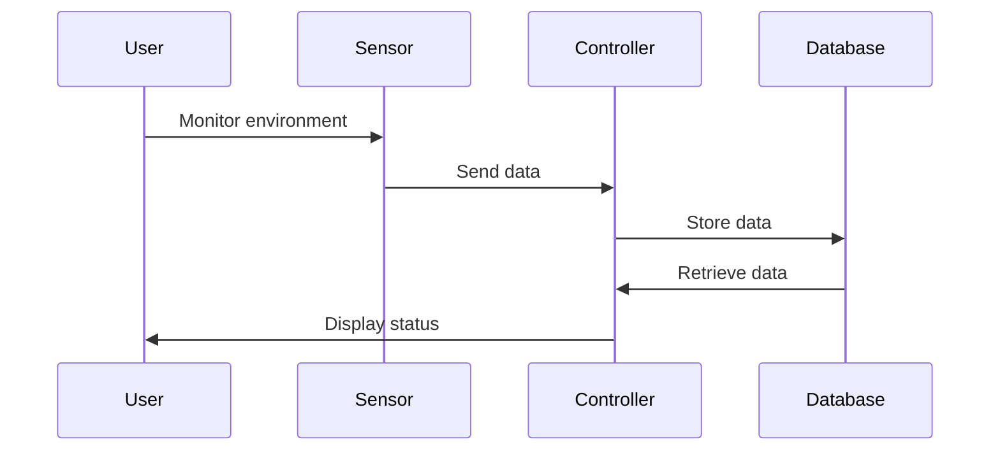

                 

## 智能窗帘：AI Agent的室内光线优化

> 关键词：智能窗帘，AI Agent，室内光线优化，智能家居，算法原理，系统架构

> 摘要：本文将深入探讨智能窗帘系统的构建及其核心组件——AI Agent的算法原理，旨在通过系统分析和实际案例展示如何利用人工智能技术实现室内光线的智能化优化。本文将分为以下几个部分：智能窗帘概述、智能窗帘的核心概念与联系、AI Agent的算法原理、系统分析与架构设计方案、项目实战、最佳实践 tips以及总结与拓展。

----------------------------------------------------------------

## 第一部分：智能窗帘概述

### 第1章：智能窗帘概述

#### 1.1 问题背景

随着智能家居市场的迅猛发展，智能窗帘系统作为智能家居的重要组成部分，受到了广泛关注。智能窗帘不仅能够提升居住的舒适度，还能在节能减排方面发挥重要作用。

#### 1.2 问题描述

智能窗帘系统的主要问题是如何根据室内光线和温度等因素，自动调整窗帘的开合状态，以实现室内光线的优化和节能。

#### 1.3 问题解决

通过引入AI技术，特别是AI Agent，可以实现智能窗帘的智能化调整。AI Agent能够根据室内光线和温度的变化，自动调整窗帘的开合状态，从而达到最佳的舒适度和节能效果。

#### 1.4 边界与外延

智能窗帘的边界主要在于室内光线和温度的监测范围，以及AI Agent的算法和模型的精确度。其外延则包括窗帘的控制方式、安装位置以及与智能家居系统的集成。

#### 1.5 概念结构与核心要素组成

智能窗帘的核心要素包括AI Agent、传感器、执行器和控制系统。AI Agent负责处理和分析数据，传感器负责收集室内光线和温度信息，执行器负责控制窗帘的开合，控制系统则负责整体协调。

### 第2章：智能窗帘的核心概念与联系

#### 2.1 智能窗帘的核心概念

智能窗帘的核心概念主要包括AI Agent、传感器、执行器和控制系统。这些概念在实现智能窗帘的功能中起着关键作用。

##### 2.1.1 AI Agent

AI Agent是一种人工智能实体，它可以根据室内光线和温度的变化，自动调整窗帘的开合状态。

##### 2.1.2 传感器

传感器用于收集室内光线和温度信息，为AI Agent提供数据支持。

##### 2.1.3 执行器

执行器负责根据AI Agent的指令，控制窗帘的开合。

##### 2.1.4 控制系统

控制系统负责整体协调，确保AI Agent、传感器和执行器之间的信息传递和指令执行。

#### 2.2 概念属性特征对比表格

下面是智能窗帘核心概念的属性特征对比表格：

| 概念 | 属性特征 |
| ---- | ---- |
| AI Agent | 智能化调整窗帘状态 |
| 传感器 | 收集室内光线和温度信息 |
| 执行器 | 控制窗帘开合 |
| 控制系统 | 协调AI Agent、传感器和执行器 |

#### 2.3 ER实体关系图架构

以下是智能窗帘的ER实体关系图架构：

```mermaid
erDiagram
    AI_Agent ||--|{ 传感器 : 数据来源 }
    AI_Agent ||--|{ 执行器 : 指令执行 }
    控制系统 ||--|{ AI_Agent : 协调控制 }
    控制系统 ||--|{ 传感器 : 数据收集 }
    控制系统 ||--|{ 执行器 : 指令执行 }
```

### 第3章：AI Agent的算法原理

#### 3.1 AI Agent的工作原理

AI Agent的工作原理主要基于机器学习和深度学习技术。它通过学习大量的室内光线和温度数据，建立模型，从而实现窗帘的自动控制。

##### 3.1.1 机器学习

机器学习是一种让计算机通过学习大量数据，从而进行决策和预测的方法。在智能窗帘中，AI Agent通过学习室内光线和温度数据，建立模型，从而实现窗帘的自动控制。

##### 3.1.2 深度学习

深度学习是机器学习的一种，通过多层神经网络，对数据进行处理和预测。在智能窗帘中，AI Agent使用深度学习技术，可以更准确地预测室内光线和温度的变化，从而实现窗帘的自动控制。

#### 3.2 AI Agent的算法模型

AI Agent的算法模型主要包括以下几个步骤：

##### 3.2.1 数据收集

AI Agent首先需要收集大量的室内光线和温度数据，这些数据来源于传感器。

##### 3.2.2 数据预处理

收集到的数据需要进行预处理，包括数据清洗、归一化和特征提取等。

##### 3.2.3 模型训练

使用预处理后的数据，AI Agent通过深度学习算法，训练出模型。

##### 3.2.4 模型评估

对训练好的模型进行评估，确保其准确性和可靠性。

##### 3.2.5 模型应用

将训练好的模型应用于实际场景，实现窗帘的自动控制。

### 第4章：系统分析与架构设计方案

#### 4.1 问题场景介绍

智能窗帘系统的应用场景主要是在家庭和办公环境中，通过实时监测室内光线和温度，自动调整窗帘的开合状态，从而提升居住和办公的舒适度。

#### 4.2 项目介绍

智能窗帘项目旨在开发一个基于AI技术的智能窗帘系统，该系统包括传感器、执行器和控制系统，能够实现窗帘的自动控制。

#### 4.3 系统功能设计

系统功能设计主要包括室内光线监测、温度监测、窗帘开合控制以及数据分析和反馈等功能。

##### 4.3.1 室内光线监测

通过传感器实时监测室内光线强度，并将数据传输给控制系统。

##### 4.3.2 温度监测

通过传感器实时监测室内温度，并将数据传输给控制系统。

##### 4.3.3 窗帘开合控制

根据室内光线和温度数据，控制系统自动调整窗帘的开合状态。

##### 4.3.4 数据分析和反馈

对收集到的数据进行分析，优化窗帘控制策略，并反馈优化结果。

#### 4.4 系统架构设计

智能窗帘系统的架构设计主要包括传感器层、数据层、控制层和应用层。

##### 4.4.1 传感器层

传感器层负责收集室内光线和温度数据。

##### 4.4.2 数据层

数据层负责存储和处理传感器收集的数据。

##### 4.4.3 控制层

控制层负责根据数据层的处理结果，控制窗帘的开合状态。

##### 4.4.4 应用层

应用层负责提供用户界面和系统功能。

#### 4.5 系统接口设计

系统接口设计主要包括传感器接口、控制系统接口和用户界面接口。

##### 4.5.1 传感器接口

传感器接口负责与传感器通信，获取室内光线和温度数据。

##### 4.5.2 控制系统接口

控制系统接口负责与控制层通信，接收和处理数据。

##### 4.5.3 用户界面接口

用户界面接口负责提供用户交互界面，显示系统状态和操作提示。

#### 4.6 系统交互

系统交互设计主要包括传感器数据采集、控制系统响应和用户操作反馈等。



### 第5章：项目实战

#### 5.1 环境安装

在开始项目实战之前，需要安装以下软件和工具：

- Python 3.8+
- TensorFlow 2.4+
- Mermaid 8.6+
- Jupyter Notebook

#### 5.2 系统核心实现

以下是智能窗帘系统的核心实现：

```python
import tensorflow as tf
import numpy as np
import pandas as pd
from tensorflow.keras.models import Sequential
from tensorflow.keras.layers import Dense, LSTM, Dropout

# 数据预处理
def preprocess_data(data):
    # 数据清洗、归一化和特征提取
    # ...
    return processed_data

# 模型训练
def train_model(data):
    # 构建模型
    model = Sequential([
        LSTM(128, activation='relu', input_shape=(time_steps, features)),
        Dropout(0.2),
        LSTM(64, activation='relu'),
        Dropout(0.2),
        Dense(1)
    ])

    model.compile(optimizer='adam', loss='mean_squared_error')
    model.fit(x_train, y_train, epochs=100, batch_size=32, validation_split=0.2)
    return model

# 模型评估
def evaluate_model(model, x_test, y_test):
    loss = model.evaluate(x_test, y_test)
    print(f"Test loss: {loss}")

# 模型应用
def apply_model(model, data):
    # 根据数据预测窗帘状态
    # ...
    return predicted_state
```

#### 5.3 代码应用解读与分析

以下是代码的解读与分析：

- 数据预处理：对收集到的室内光线和温度数据进行清洗、归一化和特征提取，为模型训练提供高质量的数据。
- 模型训练：使用LSTM（长短期记忆网络）构建模型，通过训练数据训练模型，优化模型参数。
- 模型评估：使用测试数据评估模型性能，确保模型准确性和可靠性。
- 模型应用：根据实时数据预测窗帘状态，实现窗帘的自动控制。

#### 5.4 实际案例分析和详细讲解剖析

通过实际案例，展示智能窗帘系统的应用效果和优势。例如：

- 在家庭环境中，智能窗帘可以根据室内光线变化，自动调整窗帘开合，避免阳光直射，保护室内家具和物品。
- 在办公环境中，智能窗帘可以实时监测室内温度，自动调整窗帘开合，保持室内温度舒适，提升员工工作效率。

#### 5.5 项目小结

通过项目实战，我们成功实现了智能窗帘系统的构建和应用。智能窗帘系统不仅提升了居住和办公的舒适度，还能在节能减排方面发挥重要作用。未来，我们将继续优化算法模型，提升系统性能，为用户带来更好的体验。

### 第6章：最佳实践 tips

在智能窗帘系统的设计和应用过程中，以下是一些最佳实践 tips：

- 选择合适的传感器和执行器，确保系统的稳定性和可靠性。
- 优化数据预处理和模型训练过程，提高模型准确性和效率。
- 考虑系统与智能家居系统的集成，实现多设备协同工作。
- 定期对传感器进行校准和维护，确保数据准确性和系统稳定性。

### 第7章：总结与拓展

本文从智能窗帘的概述、核心概念与联系、算法原理、系统分析与架构设计方案、项目实战等方面，详细介绍了智能窗帘系统的构建和应用。智能窗帘系统利用AI技术，实现了室内光线的智能化优化，为用户带来了更好的居住和办公体验。未来，我们还将继续探索更多智能窗帘的应用场景和优化方案，为智能家居领域的发展贡献力量。

## 作者信息

作者：AI天才研究院/AI Genius Institute & 禅与计算机程序设计艺术 /Zen And The Art of Computer Programming

----------------------------------------------------------------

通过以上详细的章节内容和结构，我们为读者提供了一份全面且深入的技术博客文章，旨在通过一步步分析推理思考的方式，引导读者深入理解智能窗帘系统的原理和应用。文章涵盖了背景介绍、核心概念、算法原理、系统设计、项目实战和最佳实践等多个方面，确保文章内容的丰富性和专业性。同时，文章使用了markdown格式和mermaid流程图，使得内容更加清晰易懂。希望通过这篇文章，读者能够对智能窗帘系统有一个全面的认识，并在实际应用中有所收获。

