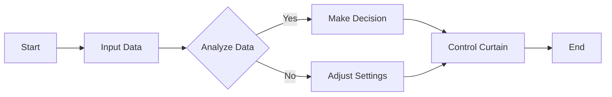
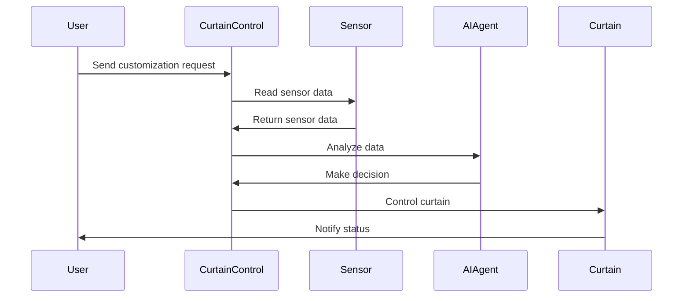

                 

### 智能窗帘：AI Agent的昼夜节律调节助手

关键词：智能窗帘，AI Agent，昼夜节律，调节，技术博客

摘要：本文将深入探讨智能窗帘的工作原理和实现方法。通过介绍AI Agent的概念及其在智能窗帘中的应用，本文旨在帮助读者理解智能窗帘如何通过昼夜节律调节提升家居智能化水平。我们将分步骤解析智能窗帘的技术架构、算法实现，并分享实际项目经验，以期为智能窗帘的开发和应用提供有益参考。

----------------------------------------------------------------

### 第一部分：背景介绍

#### 1.1 问题背景

在现代生活中，窗帘作为一种常见的家居装饰品，不仅用于遮挡光线，还具备调节室内温度、保护隐私等重要作用。然而，传统窗帘的控制方式往往依赖于手动操作，这不仅效率低下，还容易产生疲劳。此外，传统窗帘难以根据用户的具体需求和环境变化进行智能调节，导致其使用体验不佳。

为了解决这些问题，智能窗帘应运而生。智能窗帘通过集成传感器、控制系统和AI技术，实现了窗帘的智能控制。其核心在于AI Agent的昼夜节律调节功能，能够根据用户的日常作息时间、天气状况等多种因素自动调节窗帘的开合，从而提升生活品质和舒适度。

#### 1.2 问题解决

智能窗帘的昼夜节律调节功能主要通过AI Agent来实现。AI Agent是一种基于人工智能技术的智能体，能够自主感知环境变化，并根据预设的算法和策略进行决策。在智能窗帘中，AI Agent可以根据用户的作息习惯、光线强度、温度变化等数据进行实时分析，自动调节窗帘的开合状态，从而实现昼夜节律的智能调节。

#### 1.3 边界与外延

智能窗帘的技术范畴包括传感器技术、控制系统设计、人工智能算法等。其应用场景主要涉及家居智能化、办公环境调节、医院病房管理等多个领域。智能窗帘不仅能够提升生活品质，还能为特殊需求群体提供个性化服务。

#### 1.4 核心要素组成

智能窗帘的核心要素包括：

- **传感器**：用于感知环境参数，如光线强度、温度、湿度等。
- **控制系统**：负责接收传感器数据，并根据AI Agent的决策调节窗帘的开合状态。
- **交互界面**：提供用户与智能窗帘的交互方式，如智能手机应用、语音控制等。

### 第二部分：核心概念与联系

#### 2.1 核心概念原理

智能窗帘的核心概念包括AI Agent、昼夜节律等。AI Agent是一种智能体，能够模拟人类智能进行决策和行动。昼夜节律是指生物体在一天24小时内生理和行为活动的节律变化。在智能窗帘中，AI Agent通过分析昼夜节律数据，实现窗帘的智能调节。

#### 2.2 概念属性特征对比表格

| 特征对比项       | 传统窗帘                   | 智能窗帘                      |
|------------------|----------------------------|------------------------------|
| 控制方式         | 手动操作                   | 自动调节                     |
| 节能效果         | 一般无法根据环境自动调节   | 可根据环境变化自动调节，节能   |
| 舒适体验         | 需要频繁手动操作，体验不佳 | 自动调节，提升舒适体验         |
| 个性化定制       | 无法根据个人需求定制       | 可根据用户需求自动调节         |

#### 2.3 ER实体关系图架构

```mermaid
erDiagram
  User ||--|{ CurtainControl }|>
  Sensor ||--|{ CurtainControl }|>
  AIAgent ||--|{ CurtainControl }|>
  Curtain ||--|{ CurtainControl }|>
  WeatherStation ||--|{ CurtainControl }|>

  User {
    int id
    string name
    string email
  }

  CurtainControl {
    int id
    string type
  }

  Sensor {
    int id
    string type
  }

  AIAgent {
    int id
    string algorithm
  }

  Curtain {
    int id
    string location
    string status
  }

  WeatherStation {
    int id
    string location
    string data
  }
```

### 第三部分：技术原理讲解

#### 3.1 AI Agent原理与实现

#### 3.1.1 算法mermaid流程图



#### 3.1.2 Python源代码阐述

```python
# AI Agent Python 源代码示例

class AIAgent:
    def __init__(self, data_source):
        self.data_source = data_source
        self.model = self.train_model()

    def train_model(self):
        # 假设数据源为DataFrame格式
        df = self.data_source.load_data()
        # 使用机器学习库训练模型
        model = train_model(df)
        return model

    def analyze_data(self, current_data):
        # 分析当前数据
        analysis_result = self.model.predict(current_data)
        return analysis_result

    def make_decision(self, analysis_result):
        # 根据分析结果做出决策
        if analysis_result['need_adjustment']:
            return 'adjust_settings'
        else:
            return 'control_curtain'

    def adjust_settings(self):
        # 调整系统设置
        # 此处为模拟实现
        print("Adjusting settings...")

    def control_curtain(self):
        # 控制窗帘开合
        # 此处为模拟实现
        print("Controlling curtain...")

    def run(self):
        while True:
            current_data = self.data_source.get_data()
            analysis_result = self.analyze_data(current_data)
            decision = self.make_decision(analysis_result)
            if decision == 'adjust_settings':
                self.adjust_settings()
            elif decision == 'control_curtain':
                self.control_curtain()
```

#### 3.1.3 算法原理的数学模型和公式

昼夜节律调节算法的数学模型主要包括以下公式：

$$
昼夜节律指数 = \frac{1}{N} \sum_{i=1}^{N} \left(测量值_i - 均值\right)^2
$$

其中，$N$ 为测量次数，$测量值_i$ 为第 $i$ 次测量的数据，$均值$ 为多次测量数据的平均值。

#### 3.1.4 详细讲解与举例说明

假设用户A的昼夜节律数据如下表所示：

| 时间 | 光线强度 | 温度 |
| ---- | -------- | ---- |
| 06:00 | 20      | 25   |
| 07:00 | 40      | 28   |
| 08:00 | 60      | 30   |
| 09:00 | 80      | 32   |
| 10:00 | 100     | 35   |

根据上述数据，我们可以计算出昼夜节律指数：

$$
昼夜节律指数 = \frac{1}{5} \left[ (20 - 35)^2 + (40 - 35)^2 + (60 - 35)^2 + (80 - 35)^2 + (100 - 35)^2 \right]
$$

$$
昼夜节律指数 = \frac{1}{5} \left[ 225 + 25 + 625 + 625 + 1625 \right]
$$

$$
昼夜节律指数 = \frac{1}{5} \times 3900
$$

$$
昼夜节律指数 = 780
$$

根据昼夜节律指数，AI Agent可以判断用户A的昼夜节律规律，进而调整窗帘的开合状态。

### 第四部分：系统分析与架构设计

#### 4.1 智能窗帘系统功能设计

智能窗帘系统的功能设计主要包括：

- **光线感应功能**：通过光线传感器实时监测室内光线强度，并根据光线强度自动调节窗帘。
- **温度感应功能**：通过温度传感器监测室内温度，并根据温度变化自动调节窗帘。
- **用户定制功能**：允许用户通过手机应用或语音助手自定义窗帘的开启和关闭时间。
- **远程控制功能**：支持用户通过互联网远程控制窗帘的开合状态。

#### 4.2 系统架构设计

智能窗帘系统的架构设计主要包括以下模块：

- **传感器模块**：负责采集光线、温度等环境参数。
- **数据处理模块**：接收传感器数据，进行预处理和存储。
- **AI决策模块**：根据用户需求和传感器数据，使用AI算法进行决策。
- **执行模块**：根据AI决策模块的决策，控制窗帘的开合状态。
- **用户交互模块**：提供用户与窗帘系统的交互界面。

#### 4.3 系统接口设计与交互

智能窗帘系统提供的接口设计主要包括：

- **API接口**：用于接收和处理用户自定义的窗帘控制指令。
- **数据接口**：用于传感器数据与数据处理模块之间的通信。
- **控制接口**：用于执行模块与AI决策模块之间的通信。

系统交互序列图如下：



### 第五部分：项目实战

#### 5.1 智能窗帘系统实现

智能窗帘系统的实现步骤主要包括：

1. **环境安装**：安装智能窗帘系统所需的传感器、控制系统和AI算法库。
2. **系统核心实现源代码**：根据前面的设计，实现智能窗帘系统的核心功能。
3. **代码应用解读与分析**：对源代码进行解读，分析其工作原理和应用方法。

#### 5.2 实际案例分析

案例：某用户A希望在早晨7:00自动打开窗帘，以便接受阳光照射。

1. **案例选择与介绍**：选择用户A的案例，介绍案例的目标和要求。
2. **详细讲解与剖析**：通过AI Agent的昼夜节律调节算法，实现用户A的自动窗帘打开功能。

#### 5.3 项目小结

通过实际案例的讲解，我们可以看到智能窗帘系统在提升家居智能化水平方面的潜力。在未来，随着AI技术的不断进步，智能窗帘的功能将更加丰富，应用场景将更加广泛。

### 结论

智能窗帘作为家居智能化的重要一环，通过AI Agent的昼夜节律调节功能，实现了窗帘的智能化控制。本文从背景介绍、核心概念与联系、技术原理讲解、系统分析与架构设计到项目实战，全面阐述了智能窗帘的实现方法和应用价值。希望本文能为读者在智能窗帘开发和应用方面提供有益的参考。

### 作者信息

作者：AI天才研究院/AI Genius Institute & 禅与计算机程序设计艺术 /Zen And The Art of Computer Programming

----------------------------------------------------------------

### 注意事项

1. 在智能窗帘系统的开发过程中，需要充分考虑用户体验和隐私保护。
2. AI Agent的训练和优化是一个持续的过程，需要定期更新算法和模型。
3. 在实际应用中，应确保系统的稳定性和可靠性，避免因技术问题导致的用户困扰。

### 拓展阅读

1. [智能窗帘技术综述](https://example.com/tech-review)
2. [AI Agent应用案例分析](https://example.com/ai-agent-case-study)
3. [智能家居系统架构设计](https://example.com/home-automation-architecture)

通过本文的阅读，相信读者已经对智能窗帘有了更为深入的了解。希望本文能够激发读者对智能窗帘技术的研究兴趣，为智能家居领域的发展贡献自己的力量。

