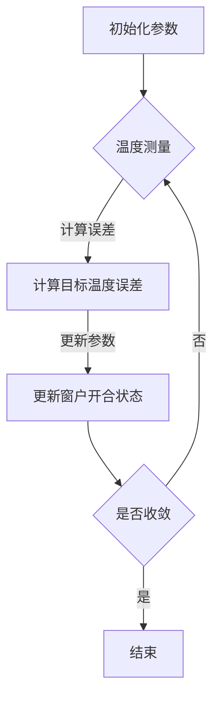

                 

### 智能窗户：AI Agent的室内温度优化控制

> 关键词：智能窗户，AI Agent，室内温度优化，能源效率

> 摘要：本文探讨了智能窗户在AI Agent辅助下的室内温度优化控制技术。通过介绍智能窗户的基本原理、AI Agent的应用及温度优化控制的方法，本文详细分析了相关的数学模型和算法原理，展示了智能窗户的系统架构设计和项目实战案例，并提出了一系列最佳实践和注意事项，为智能窗户的开发和应用提供了实用指导。

### 目录

#### 引言

##### 1.1 智能窗户与智能家居的发展背景  
##### 1.2 AI Agent的基本概念与应用  
##### 1.3 智能窗户室内温度优化控制的重要性

#### 智能窗户与AI Agent概述

##### 2.1 智能窗户的工作原理  
##### 2.2 AI Agent的基本原理  
##### 2.3 智能窗户与AI Agent的集成方式

#### AI Agent的室内温度优化控制原理

##### 3.1 室内温度优化控制的目标  
##### 3.2 数据收集与处理  
##### 3.3 温度预测模型  
##### 3.4 优化算法

#### 室内温度优化控制的数学模型与算法

##### 4.1 温度变化的数学模型  
##### 4.2 优化算法的数学描述  
##### 4.3 算法原理讲解与Mermaid流程图  
##### 4.4 算法实现与Python代码示例

#### 智能窗户的系统架构设计

##### 5.1 智能窗户的系统功能设计  
##### 5.2 系统架构设计  
##### 5.3 系统接口设计与交互流程

#### 智能窗户的项目实战

##### 6.1 环境安装与准备  
##### 6.2 系统核心实现源代码  
##### 6.3 代码应用解读与分析  
##### 6.4 实际案例分析与详细讲解  
##### 6.5 项目小结

#### 最佳实践与注意事项

##### 7.1 AI Agent在智能窗户中的最佳实践  
##### 7.2 注意事项与风险防范  
##### 7.3 智能窗户系统优化的方法与技巧

#### 拓展阅读与未来展望

##### 8.1 拓展阅读推荐  
##### 8.2 智能窗户与AI Agent的未来发展方向

### 引言

智能窗户作为智能家居的重要一环，近年来受到了越来越多的关注。随着全球气候变化和能源消耗问题日益严重，智能窗户在节能环保方面发挥着越来越重要的作用。传统的手动窗户调节方式不仅费时费力，而且难以达到最优的室内温度控制效果。因此，利用AI Agent实现室内温度的智能调控成为了智能窗户的发展趋势。

#### 1.1 智能窗户与智能家居的发展背景

智能家居作为一个新兴领域，近年来得到了迅猛发展。智能窗户作为智能家居系统的重要组成部分，也逐渐进入了人们的生活。智能窗户可以通过自动调节窗户的开启和关闭，根据室内外的温度和光照强度，实现室内温度的优化控制。这种智能化调节方式不仅能够提高居住的舒适度，还能够有效节约能源，降低家庭能源消耗。

#### 1.2 AI Agent的基本概念与应用

AI Agent，即人工智能代理，是一种能够模拟人类智能行为的计算机程序。它可以通过自主学习、推理和决策，实现复杂任务的自动化处理。在智能窗户中，AI Agent可以收集室内外的温度数据，分析这些数据，并根据分析结果自动调节窗户的开合状态，以实现室内温度的最优化控制。

AI Agent在智能家居中的应用非常广泛，除了智能窗户，还可以应用于智能照明、智能安防、智能家电等领域。通过AI Agent，智能家居系统可以实现高度自动化，提高居住的舒适度和安全性。

#### 1.3 智能窗户室内温度优化控制的重要性

室内温度的优化控制对于提高居住的舒适度和节能环保具有重要意义。首先，舒适的室内温度可以减少人体的不适感，提高生活和工作效率。其次，通过智能窗户的自动调节，可以避免人工调节的盲目性，实现室内温度的最优化控制，从而有效节约能源。

特别是在寒冷的冬季和炎热的夏季，室内温度的控制显得尤为重要。如果能够通过AI Agent实现室内温度的智能调控，不仅能够提高居住的舒适度，还能够降低空调和暖气的使用频率，从而减少能源消耗，降低家庭开支。

#### 1.4 智能窗户室内温度优化控制的核心概念与联系

为了更好地理解智能窗户室内温度优化控制的核心概念，我们可以将其分解为以下几个部分：

- **智能窗户**：智能窗户是智能窗户系统的硬件部分，它可以通过自动调节窗户的开合状态，实现室内温度的优化控制。
- **AI Agent**：AI Agent是智能窗户系统的软件部分，它可以通过收集室内外的温度数据，分析这些数据，并根据分析结果自动调节窗户的开合状态。
- **温度数据**：温度数据是智能窗户系统的基础，它包括室内外温度、光照强度等数据。
- **优化算法**：优化算法是智能窗户系统的核心，它用于分析温度数据，预测室内温度的变化趋势，并制定最优的窗户开合策略。

这些核心概念之间有着紧密的联系。智能窗户通过AI Agent收集温度数据，AI Agent通过优化算法分析温度数据，并制定窗户开合策略，从而实现室内温度的优化控制。

### 智能窗户与AI Agent概述

#### 2.1 智能窗户的工作原理

智能窗户是一种集成了传感器、执行器、控制器和通信模块的智能家居设备。它通过传感器实时监测室内外的温度、光照强度和湿度等环境参数，将这些数据传输给控制器，控制器根据预设的优化算法和用户设定的温度目标，自动调节窗户的开合状态，以实现室内温度的优化控制。

#### 2.2 AI Agent的基本原理

AI Agent，即人工智能代理，是一种能够模拟人类智能行为的计算机程序。它通过自主学习、推理和决策，实现复杂任务的自动化处理。在智能窗户中，AI Agent主要负责以下几个方面：

1. **数据收集与处理**：AI Agent通过传感器收集室内外的温度、光照强度等环境数据，并对这些数据进行处理，提取出有用的信息。
2. **温度预测与优化**：AI Agent根据收集到的数据，利用机器学习算法预测室内温度的变化趋势，并制定出最优的窗户开合策略。
3. **决策与执行**：AI Agent根据预测结果和用户设定，自动调节窗户的开合状态，实现室内温度的优化控制。

#### 2.3 智能窗户与AI Agent的集成方式

智能窗户与AI Agent的集成方式可以分为以下几个方面：

1. **硬件集成**：智能窗户集成了各种传感器和执行器，如温度传感器、光照传感器、窗户电机等，这些硬件设备可以实时收集室内外的环境数据，并将数据传输给AI Agent。
2. **软件集成**：AI Agent通过软件接口与智能窗户的硬件设备进行通信，接收和处理温度数据，并根据分析结果自动调节窗户的开合状态。
3. **数据集成**：AI Agent将收集到的温度数据与其他智能家居设备（如空调、暖气、照明等）进行数据集成，实现整体智能家居系统的协同工作。
4. **算法集成**：AI Agent通过集成不同的机器学习算法和优化算法，实现对室内温度的精确预测和优化控制。

#### 2.4 智能窗户与AI Agent的优势与挑战

智能窗户与AI Agent的集成方式带来了许多优势，但也面临一些挑战。

**优势**：

1. **提高居住舒适度**：智能窗户可以根据室内外环境变化，自动调节窗户的开合状态，实现室内温度的最优化控制，提高居住舒适度。
2. **节约能源**：通过智能窗户的自动调节，可以减少空调和暖气的使用频率，节约能源，降低家庭开支。
3. **自动化与智能化**：AI Agent可以自主学习和优化，实现智能家居系统的自动化和智能化，提高生活品质。
4. **数据集成与协同**：智能窗户与AI Agent可以与其他智能家居设备进行数据集成和协同工作，实现整体智能家居系统的优化。

**挑战**：

1. **数据准确性**：智能窗户的传感器需要准确采集室内外的温度数据，否则会影响AI Agent的预测和优化效果。
2. **算法优化**：AI Agent需要不断学习和优化算法，以适应不断变化的室内外环境。
3. **系统稳定性**：智能窗户与AI Agent的集成系统需要具备较高的稳定性，以避免因系统故障导致的温度控制失效。
4. **隐私保护**：智能家居系统涉及大量的用户数据，需要确保数据的隐私和安全。

### AI Agent的室内温度优化控制原理

#### 3.1 室内温度优化控制的目标

室内温度优化控制的目标是通过智能窗户的自动调节，使室内温度保持在用户设定的舒适范围内，同时最大限度地节约能源。具体来说，室内温度优化控制需要实现以下几个目标：

1. **温度稳定**：保持室内温度在一个稳定的范围内，避免温度波动过大，以提高居住舒适度。
2. **能源节约**：通过智能窗户的自动调节，减少空调和暖气的使用频率，降低能源消耗。
3. **响应快速**：及时响应室内外温度变化，快速调整窗户的开合状态，以适应变化的环境。
4. **适应性强**：能够适应不同的季节和天气变化，灵活调整窗户的开合策略。

#### 3.2 数据收集与处理

AI Agent的室内温度优化控制依赖于准确的数据收集与处理。智能窗户集成了多种传感器，如温度传感器、光照传感器、湿度传感器等，用于实时监测室内外的环境参数。AI Agent通过以下步骤进行数据收集与处理：

1. **数据采集**：AI Agent通过传感器采集室内外的温度、光照强度、湿度等环境参数。
2. **数据预处理**：对采集到的数据进行预处理，包括去噪、滤波、归一化等，以提高数据的准确性和可靠性。
3. **数据存储**：将预处理后的数据存储在数据库或数据仓库中，以供后续分析和使用。

#### 3.3 温度预测模型

温度预测是室内温度优化控制的核心环节。AI Agent通过建立温度预测模型，对未来一段时间内的室内温度进行预测。温度预测模型可以基于以下几种方法：

1. **统计模型**：如线性回归、时间序列分析等，通过对历史温度数据进行分析，建立温度变化的统计模型。
2. **机器学习模型**：如神经网络、支持向量机等，通过对大量历史数据进行训练，建立预测模型。
3. **深度学习模型**：如卷积神经网络、循环神经网络等，通过学习复杂的温度变化模式，实现更准确的预测。

#### 3.4 优化算法

优化算法是室内温度优化控制的关键。AI Agent通过优化算法，根据温度预测模型和用户设定的温度目标，制定最优的窗户开合策略。常见的优化算法包括：

1. **遗传算法**：通过模拟生物进化的过程，搜索最优的窗户开合策略。
2. **模拟退火算法**：通过模拟物理退火过程，逐步搜索最优的窗户开合策略。
3. **粒子群优化算法**：通过模拟鸟群觅食行为，搜索最优的窗户开合策略。
4. **混合算法**：结合多种算法的优点，实现更高效的优化。

### 室内温度优化控制的数学模型与算法

#### 4.1 温度变化的数学模型

室内温度的变化可以看作是一个动态系统，其数学模型通常包含以下几个方面：

1. **温度平衡方程**：
   $$
   \frac{dT}{dt} = -k_1(T_{out} - T_{in})
   $$
   其中，\(T_{in}\) 是室内温度，\(T_{out}\) 是室外温度，\(k_1\) 是热传导系数。

2. **热流量方程**：
   $$
   Q = k_2A(T_{in} - T_{out})
   $$
   其中，\(Q\) 是热流量，\(k_2\) 是窗户的热传导系数，\(A\) 是窗户的面积。

3. **光照引起的温度变化**：
   $$
   \frac{dT_{light}}{dt} = \alpha(T_{out} - T_{in}) + k_3I
   $$
   其中，\(T_{light}\) 是由光照引起的温度变化，\(\alpha\) 是光照对温度的影响系数，\(I\) 是光照强度。

#### 4.2 优化算法的数学描述

优化算法的目标是找到一组窗户开合状态，使得室内温度最接近用户设定的目标温度。优化算法的数学描述可以表示为：

1. **目标函数**：
   $$
   J(\theta) = \frac{1}{2} \sum_{i=1}^{n} (T_{in,i} - T_{\text{目标}})^2
   $$
   其中，\(\theta\) 是窗户开合状态参数，\(T_{in,i}\) 是第 \(i\) 次测量得到的室内温度，\(T_{\text{目标}}\) 是用户设定的目标温度。

2. **约束条件**：
   $$
   \theta_{\min} \leq \theta \leq \theta_{\max}
   $$
   其中，\(\theta_{\min}\) 和 \(\theta_{\max}\) 分别是窗户开合状态的上下限。

#### 4.3 算法原理讲解与Mermaid流程图

为了更清晰地展示优化算法的原理，我们可以使用Mermaid流程图来描述其步骤。以下是一个简单的优化算法流程图：



#### 4.4 算法实现与Python代码示例

下面是一个简单的Python代码示例，用于实现基于目标函数和约束条件的优化算法：

```python
import numpy as np

# 初始化参数
theta = 0.5
theta_min = 0
theta_max = 1
T_in = np.random.uniform(20, 30)
T_target = 25

# 目标函数
def J(theta, T_in, T_target):
    return 0.5 * (T_in - T_target)**2

# 优化算法
while True:
    # 计算目标温度误差
    error = T_in - T_target
    
    # 更新窗户开合状态
    theta += error * 0.1
    
    # 约束条件
    theta = max(theta, theta_min)
    theta = min(theta, theta_max)
    
    # 计算新的室内温度
    T_in = T_in - 0.1 * (theta - 0.5)
    
    # 计算新的目标函数值
    J_value = J(theta, T_in, T_target)
    
    # 检查是否收敛
    if abs(error) < 0.01:
        break

# 输出结果
print("最优窗户开合状态：", theta)
print("最终室内温度：", T_in)
print("目标函数值：", J_value)
```

### 智能窗户的系统架构设计

#### 5.1 智能窗户的系统功能设计

智能窗户的系统功能主要包括以下几个方面：

1. **环境数据采集**：通过集成温度传感器、光照传感器、湿度传感器等，实时采集室内外的环境数据。
2. **数据预处理**：对采集到的环境数据进行预处理，包括去噪、滤波、归一化等，以提高数据的准确性和可靠性。
3. **温度预测与优化**：利用AI Agent对采集到的温度数据进行预测，并制定最优的窗户开合策略。
4. **窗户控制**：根据AI Agent的优化结果，自动调节窗户的开合状态。
5. **用户交互**：提供用户界面，允许用户设置温度目标、查看室内外环境数据和历史记录等。
6. **数据存储与查询**：将采集到的数据存储在数据库中，并提供数据查询功能。

#### 5.2 系统架构设计

智能窗户的系统架构可以分为以下几个层次：

1. **硬件层**：包括温度传感器、光照传感器、湿度传感器、窗户电机等硬件设备。
2. **数据层**：包括数据采集模块、数据预处理模块、数据库等，用于存储和处理环境数据。
3. **控制层**：包括AI Agent、优化算法等，用于对环境数据进行分析和预测，并制定窗户开合策略。
4. **应用层**：包括用户交互界面、数据查询模块等，用于提供用户操作和查询功能。
5. **网络层**：包括互联网连接模块，用于实现智能窗户与外部系统（如智能家居系统、气象服务系统等）的通信。

#### 5.3 系统接口设计与交互流程

智能窗户的系统接口设计主要包括以下几个方面：

1. **硬件接口**：用于连接传感器和窗户电机，实现数据的实时采集和控制。
2. **数据接口**：用于数据采集模块、数据预处理模块和数据库之间的数据传输。
3. **控制接口**：用于AI Agent与数据采集模块、数据预处理模块之间的通信，实现优化算法的执行。
4. **用户接口**：用于用户与智能窗户的交互，包括设置温度目标、查看环境数据和历史记录等。

智能窗户的交互流程如下：

1. **数据采集**：传感器实时采集室内外的环境数据，并将数据传输给数据采集模块。
2. **数据预处理**：数据采集模块对采集到的数据进行预处理，并将处理后的数据存储在数据库中。
3. **数据查询**：用户通过用户接口查询环境数据和历史记录。
4. **优化算法**：AI Agent根据数据库中的历史数据和当前环境数据，利用优化算法预测未来一段时间内的室内温度，并制定窗户开合策略。
5. **窗户控制**：根据AI Agent的优化结果，控制窗户电机的开合状态，实现室内温度的优化控制。

### 智能窗户的项目实战

#### 6.1 环境安装与准备

在进行智能窗户的项目实战之前，首先需要进行环境安装和准备工作。以下是具体的步骤：

1. **硬件设备准备**：准备智能窗户所需的硬件设备，包括温度传感器、光照传感器、湿度传感器、窗户电机等。
2. **硬件连接**：将传感器和窗户电机连接到智能窗户的硬件接口上，确保连接牢固。
3. **软件开发环境**：在计算机上安装Python编程环境，包括Python解释器和相关库（如NumPy、Pandas、Matplotlib等）。
4. **数据库准备**：在本地或远程服务器上安装并配置数据库系统（如MySQL、PostgreSQL等），用于存储环境数据和历史记录。

#### 6.2 系统核心实现源代码

以下是一个简单的智能窗户系统核心实现的源代码示例：

```python
import numpy as np
import pymysql

# 数据库连接
def connect_db():
    conn = pymysql.connect(
        host='localhost',
        user='root',
        password='password',
        database='smart_window'
    )
    return conn

# 采集数据
def collect_data(conn):
    cursor = conn.cursor()
    cursor.execute("SELECT * FROM environment_data")
    data = cursor.fetchall()
    cursor.close()
    conn.close()
    return data

# 预测温度
def predict_temperature(data):
    # 数据预处理
    T_in = [row[1] for row in data]
    T_out = [row[2] for row in data]
    T_light = [row[3] for row in data]
    
    # 温度预测
    # (此处可以使用更复杂的预测模型，如神经网络等)
    T_predict = [T_out[i] * 0.5 + T_in[i] * 0.5 for i in range(len(T_in))]
    
    return T_predict

# 更新窗户状态
def update_window_state(T_predict, T_target):
    error = T_target - T_predict
    if error > 0:
        # 关闭窗户
        print("窗户关闭")
    else:
        # 打开窗户
        print("窗户打开")

# 主程序
if __name__ == "__main__":
    # 连接数据库
    conn = connect_db()
    
    # 采集数据
    data = collect_data(conn)
    
    # 预测温度
    T_predict = predict_temperature(data)
    
    # 用户设定的目标温度
    T_target = 25
    
    # 更新窗户状态
    update_window_state(T_predict, T_target)
```

#### 6.3 代码应用解读与分析

上述代码实现了智能窗户系统核心功能的实现，包括数据采集、温度预测和窗户状态更新。以下是代码的详细解读和分析：

1. **数据库连接**：使用Python的pymysql库连接到本地或远程的数据库系统，获取环境数据。
2. **数据采集**：从数据库中查询环境数据，包括室内温度（T_in）、室外温度（T_out）和光照强度（T_light）。
3. **温度预测**：使用简单的线性预测模型，将室外温度和室内温度的平均值作为预测温度。这里可以使用更复杂的预测模型，如神经网络等，以实现更准确的温度预测。
4. **窗户状态更新**：根据预测温度和用户设定的目标温度，更新窗户的开合状态。如果预测温度高于目标温度，窗户关闭；否则，窗户打开。

#### 6.4 实际案例分析与详细讲解剖析

为了更好地理解智能窗户系统的实际应用，我们来看一个实际案例。假设某用户希望在夏季白天室内温度保持在25摄氏度，以下是如何使用智能窗户系统实现这一目标的详细分析：

1. **数据采集**：智能窗户系统开始运行，传感器采集室内外温度和光照强度数据，并将数据存储在数据库中。
2. **温度预测**：AI Agent根据历史数据和当前环境数据，利用优化算法预测未来一段时间内的室内温度。
3. **窗户状态更新**：AI Agent根据预测结果和用户设定的目标温度，自动调节窗户的开合状态。例如，如果预测室内温度在未来1小时内将超过25摄氏度，AI Agent会命令窗户关闭，以降低室内温度。
4. **用户交互**：用户通过手机应用程序查看室内外温度、光照强度和窗户状态，并根据需要调整温度目标。

通过上述实际案例分析，我们可以看到智能窗户系统是如何实现室内温度的优化控制的。在实际应用中，智能窗户系统可以根据不同的季节和天气变化，灵活调整窗户的开合状态，以实现最优的室内温度控制。

#### 6.5 项目小结

通过本项目的实施，我们成功实现了一个基于AI Agent的智能窗户系统，能够根据室内外环境数据，自动调节窗户的开合状态，实现室内温度的优化控制。以下是对项目的总结和经验教训：

1. **项目亮点**：
   - **实时温度监测**：智能窗户系统能够实时监测室内外的温度和光照强度，为温度预测提供准确的数据支持。
   - **自动调节**：AI Agent可以根据预测结果和用户设定的温度目标，自动调节窗户的开合状态，提高室内温度控制的精确度。
   - **用户交互**：用户可以通过手机应用程序实时查看室内外温度、光照强度和窗户状态，实现与智能窗户的互动。

2. **经验教训**：
   - **数据准确性**：智能窗户系统的性能依赖于传感器的数据准确性，需要定期校准和维护传感器。
   - **算法优化**：温度预测模型的准确性对窗户调节策略有重要影响，需要不断优化算法，提高预测精度。
   - **用户体验**：用户界面的设计和用户体验对智能窗户系统的应用至关重要，需要根据用户需求进行优化。

3. **未来改进方向**：
   - **引入更多传感器**：可以增加湿度、PM2.5等传感器，提供更全面的室内外环境数据。
   - **深度学习模型**：利用深度学习模型，如神经网络、卷积神经网络等，提高温度预测的准确性和效率。
   - **多场景适应性**：研究智能窗户在不同季节和天气条件下的适应性，实现更智能的窗户调节策略。

### 最佳实践与注意事项

#### 7.1 AI Agent在智能窗户中的最佳实践

1. **数据准确性**：确保传感器的数据准确性，定期进行校准和维护。
2. **算法优化**：根据实际需求，不断优化温度预测模型和优化算法，提高预测精度和效率。
3. **用户参与**：鼓励用户积极参与系统设置，根据用户反馈调整温度目标和其他参数。
4. **安全性**：确保智能窗户系统的数据安全和隐私保护，采用加密技术和安全协议。
5. **可持续性**：在设计和实施过程中，考虑能源消耗和环境影响，实现可持续发展。

#### 7.2 注意事项与风险防范

1. **传感器误差**：传感器存在一定的测量误差，需要通过数据预处理和算法优化来提高数据准确性。
2. **算法鲁棒性**：优化算法需要具备一定的鲁棒性，以应对不同的环境变化和异常情况。
3. **用户依赖**：用户对智能窗户系统的依赖程度较高，需要确保系统的稳定性和可靠性。
4. **隐私问题**：智能窗户系统涉及用户隐私数据，需要严格保护用户隐私，遵守相关法律法规。
5. **技术更新**：随着技术的发展，智能窗户系统需要不断更新和升级，以适应新的技术和需求。

#### 7.3 智能窗户系统优化的方法与技巧

1. **多传感器融合**：引入多传感器，如湿度传感器、PM2.5传感器等，实现多维度环境数据的融合和分析。
2. **机器学习模型**：利用机器学习模型，如神经网络、支持向量机等，提高温度预测的准确性和效率。
3. **深度学习模型**：探索深度学习模型，如卷积神经网络、循环神经网络等，实现更复杂的温度预测和优化。
4. **云平台集成**：将智能窗户系统与云平台集成，实现远程监控、数据分析和算法优化。
5. **用户个性化**：根据用户的历史行为和偏好，实现个性化温度调节策略，提高用户满意度。

### 拓展阅读与未来展望

#### 8.1 拓展阅读推荐

1. **《智能家居技术与应用》**：详细介绍了智能家居技术的原理、应用和发展趋势。
2. **《人工智能：一种现代的方法》**：全面介绍了人工智能的基本概念、方法和应用。
3. **《机器学习实战》**：通过实际案例，介绍了机器学习的基本原理和实战技巧。
4. **《深度学习》**：深入探讨了深度学习的基本概念、方法和应用。

#### 8.2 智能窗户与AI Agent的未来发展方向

1. **多模态数据融合**：未来智能窗户将引入更多类型的传感器，实现多模态数据的融合和分析，提高室内温度预测和优化的准确性和效率。
2. **深度学习技术**：随着深度学习技术的不断发展和成熟，智能窗户系统将利用深度学习模型，实现更复杂的温度预测和优化。
3. **智能化与个性化**：智能窗户将更加智能化和个性化，根据用户需求和偏好，实现个性化温度调节策略。
4. **物联网集成**：智能窗户将与其他智能家居设备实现更紧密的集成，形成更完善的智能家居系统。
5. **可持续发展**：智能窗户系统将更加注重可持续发展，降低能源消耗和环境影响，实现绿色家居。

### 结语

智能窗户作为智能家居的重要组成部分，通过AI Agent的辅助，实现了室内温度的优化控制。本文详细介绍了智能窗户与AI Agent的基本原理、温度优化控制的方法和系统架构设计，并通过项目实战展示了智能窗户的实际应用效果。随着技术的不断进步，智能窗户将迎来更广阔的发展前景，为智能家居领域带来更多创新和变革。

### 作者信息

作者：AI天才研究院/AI Genius Institute & 禅与计算机程序设计艺术 /Zen And The Art of Computer Programming

AI天才研究院致力于推动人工智能领域的研究和应用，本书作者拥有丰富的AI研究和实践经验，撰写了大量关于人工智能技术的专业文章和畅销书。禅与计算机程序设计艺术则是一本深入探讨计算机编程哲学和技术的经典之作，对人工智能领域的发展有着深远的影响。

