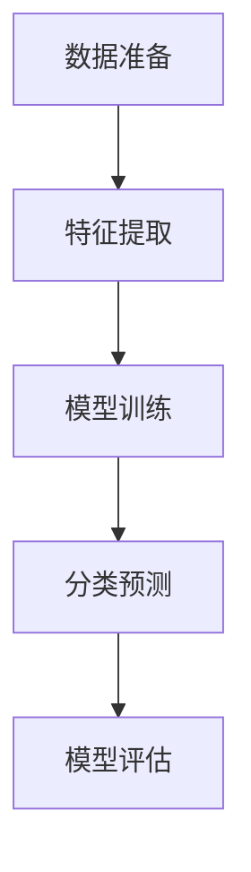
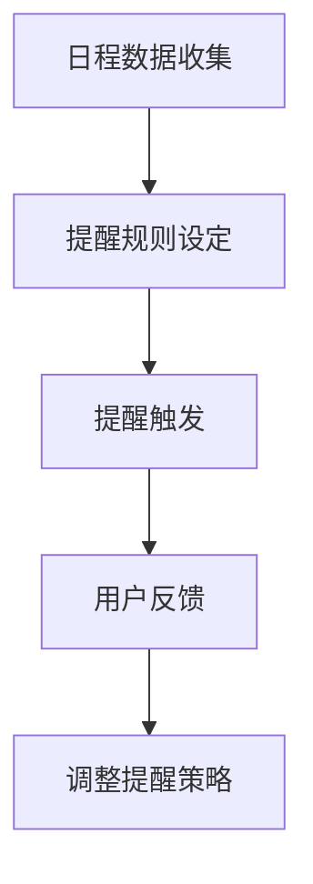
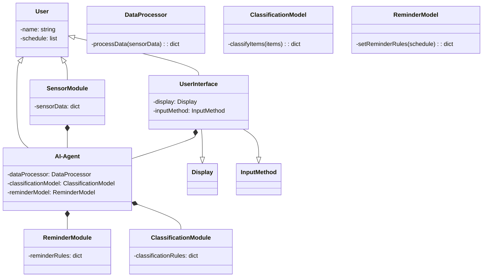
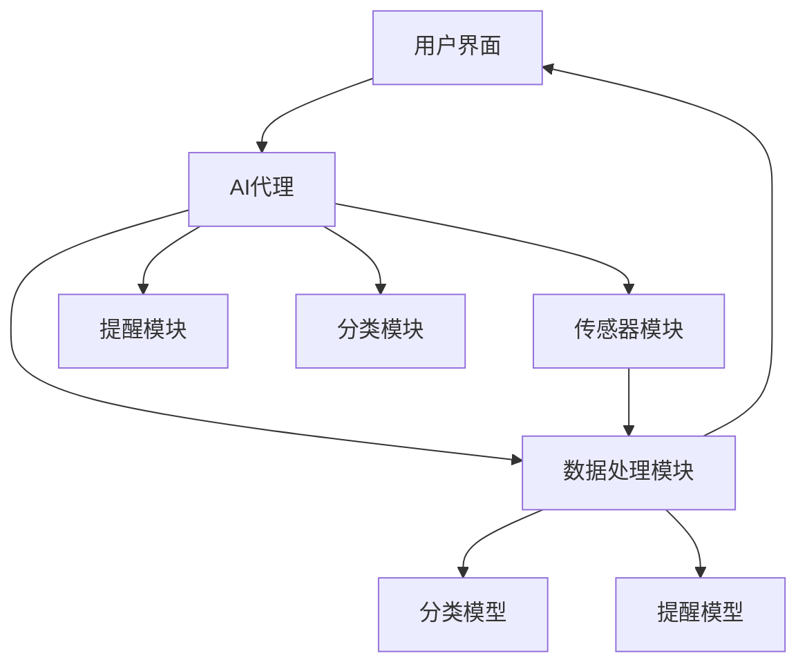
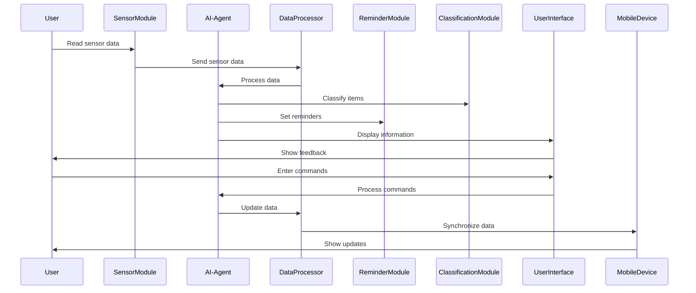
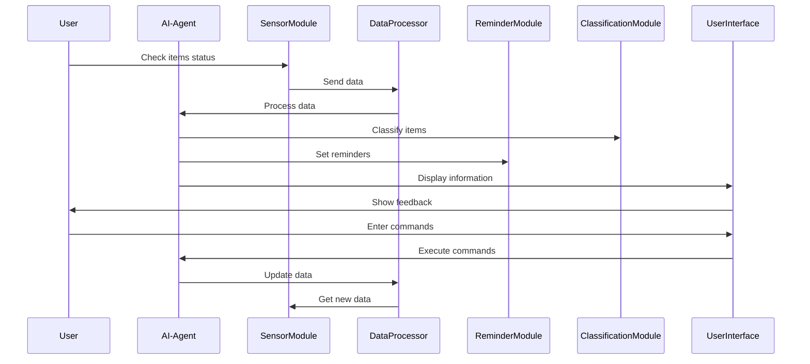

                 

# 智能背包：AI Agent的物品整理与提醒助手

> 关键词：智能背包、AI Agent、物品整理、提醒助手、算法原理、系统架构

> 摘要：本文将探讨智能背包的概念及其在日常生活中发挥的重要作用，特别是AI Agent在物品整理与提醒功能中的应用。我们将逐步分析智能背包的工作原理、核心技术、算法原理以及系统架构设计，并通过实际案例展示其应用效果。最后，本文将提供最佳实践建议，展望智能背包与AI Agent的未来发展。

## 目录大纲

### 第一部分：背景介绍

1.1 问题背景
- 1.1.1 智能背包的概念与需求
- 1.1.2 AI Agent在物品整理与提醒中的应用

1.2 问题描述
- 1.2.1 日常生活中的物品整理问题
- 1.2.2 物品遗忘与丢失的问题
- 1.2.3 提醒功能的需求

1.3 问题解决
- 1.3.1 AI Agent的作用
- 1.3.2 智能背包的技术实现

1.4 边界与外延
- 1.4.1 智能背包的功能范围
- 1.4.2 AI Agent的适用场景

1.5 概念结构与核心要素组成
- 1.5.1 智能背包的核心组成部分
- 1.5.2 AI Agent的核心功能

### 第二部分：核心概念与联系

2.1 智能背包技术原理
- 2.1.1 智能背包的工作原理
- 2.1.2 AI Agent的原理与特点

2.2 AI Agent在物品整理与提醒中的应用
- 2.2.1 AI Agent在物品分类中的作用
- 2.2.2 AI Agent在物品查找与提醒中的作用

2.3 概念属性特征对比表格
- 2.3.1 智能背包与传统背包的对比
- 2.3.2 AI Agent与传统提醒方式的对比

2.4 ER实体关系图架构
- 2.4.1 智能背包的ER图
- 2.4.2 AI Agent的ER图

### 第三部分：算法原理讲解

3.1 物品分类算法
- 3.1.1 算法原理与mermaid流程图
- 3.1.2 Python源代码实现
- 3.1.3 数学模型与公式
- 3.1.4 举例说明

3.2 提醒算法
- 3.2.1 算法原理与mermaid流程图
- 3.2.2 Python源代码实现
- 3.2.3 数学模型与公式
- 3.2.4 举例说明

### 第四部分：系统分析与架构设计方案

4.1 问题场景介绍
- 4.1.1 用户使用智能背包的场景
- 4.1.2 智能背包与AI Agent的工作流程

4.2 系统功能设计
- 4.2.1 领域模型类图

4.3 系统架构设计
- 4.3.1 系统架构mermaid图

4.4 系统接口设计
- 4.4.1 系统接口概述
- 4.4.2 系统接口详细设计

4.5 系统交互mermaid序列图
- 4.5.1 系统交互序列图

### 第五部分：项目实战

5.1 环境安装
- 5.1.1 操作系统与硬件要求
- 5.1.2 软件安装步骤

5.2 系统核心实现源代码
- 5.2.1 源代码结构与功能划分
- 5.2.2 关键代码实现与解读

5.3 代码应用解读与分析
- 5.3.1 源代码中的应用场景
- 5.3.2 代码性能分析与优化

5.4 实际案例分析和详细讲解剖析
- 5.4.1 案例背景
- 5.4.2 案例分析
- 5.4.3 案例讲解

5.5 项目小结
- 5.5.1 项目收获与反思
- 5.5.2 项目改进方向

### 第六部分：最佳实践 tips

6.1 使用智能背包的技巧
- 6.1.1 如何设置智能背包？
- 6.1.2 智能背包的使用注意事项

6.2 AI Agent优化建议
- 6.2.1 提高物品分类准确率的策略
- 6.2.2 提高提醒功能的策略

### 第七部分：小结与展望

7.1 小结
- 7.1.1 本书的主要内容
- 7.1.2 智能背包与AI Agent的发展前景

7.2 注意事项
- 7.2.1 使用智能背包的注意事项
- 7.2.2 AI Agent的优化方向

7.3 拓展阅读
- 7.3.1 相关书籍推荐
- 7.3.2 相关论文推荐

---

在接下来的文章中，我们将逐步深入探讨智能背包与AI Agent的核心概念、算法原理、系统架构设计以及实际应用案例，帮助读者全面了解这一前沿技术。让我们一起思考，共同探索智能背包的未来！

## 第一部分：背景介绍

### 1.1 问题背景

#### 1.1.1 智能背包的概念与需求

智能背包，作为一种集成了先进人工智能（AI）技术的个人携带设备，正逐渐成为现代生活的必需品。它的核心功能在于通过AI Agent实现物品的智能整理与提醒，从而提高生活效率和舒适度。与传统背包不同，智能背包不仅仅是一个装载物品的工具，它更像是一个贴心的助手，能够根据用户的需求和习惯，自动分类和管理物品。

在日常生活中，人们经常面临物品整理和遗忘的问题。无论是工作还是旅行，携带过多的物品会导致背包沉重，难以整理，而忘记携带必需品则会导致一系列不便。例如，上班时忘记带笔记本电脑，外出旅行时忘记携带充电器等。这些问题不仅影响了日常生活的质量，还增加了焦虑和压力。

智能背包的出现，正是为了解决这些问题。它通过内置的AI Agent，能够实时监测背包内的物品，自动分类并提醒用户是否携带了必需品。这种智能化的管理方式，不仅减轻了用户的负担，还提高了物品的整理效率和准确性。

#### 1.1.2 AI Agent在物品整理与提醒中的应用

AI Agent，即人工智能代理，是智能背包的核心技术。它基于机器学习和自然语言处理技术，能够理解和执行复杂的任务。在物品整理与提醒方面，AI Agent具有以下几大应用：

1. **物品分类**：AI Agent能够根据物品的形状、大小、重量等特征，自动分类并整理背包内的物品。例如，将电子产品、文具、衣物等分类放置，使背包内部更加整洁有序。

2. **物品查找**：当用户需要某件物品时，AI Agent可以通过声音或触控方式，快速定位物品的位置，帮助用户迅速找到所需物品，避免在背包内翻找。

3. **提醒功能**：AI Agent可以根据用户设定的日程和习惯，定时提醒用户是否携带了必需品。例如，早晨出门前提醒用户是否携带手机、身份证等。

4. **学习与优化**：AI Agent可以通过用户的行为数据，不断学习和优化自己的算法，从而更准确地理解和预测用户的需求。例如，如果用户经常在某个时间段携带笔记本电脑，AI Agent可以提前提醒用户，以免遗忘。

### 1.2 问题描述

在日常使用背包的过程中，人们通常会面临以下问题：

#### 1.2.1 日常生活中的物品整理问题

1. **物品繁多，难以整理**：随着生活节奏的加快，人们需要携带的物品越来越多，如手机、钱包、钥匙、笔记本电脑、文具、衣物等。如何将这么多物品有条理地整理在背包中，成为了一个难题。

2. **物品分类不明确**：由于物品的多样性和用户个性化的需求，许多人在整理背包时往往缺乏明确的分类标准，导致背包内部杂乱无章。

3. **物品放置不合理**：在整理背包时，用户往往将物品随意放置，没有考虑到物品的重量分布和日常使用的频率，导致背包重心不稳，影响背负舒适度。

#### 1.2.2 物品遗忘与丢失的问题

1. **遗忘携带必需品**：由于物品繁多，人们在出门前往往难以确保所有必需品都已经被携带。例如，忘记携带手机、身份证、钱包等。

2. **物品丢失**：在旅行或外出时，人们经常面临物品丢失的风险。例如，将物品遗忘在公共场所或公共交通工具上。

#### 1.2.3 提醒功能的需求

1. **出门提醒**：用户希望在出门前能够得到关于是否携带必需品的提醒，以确保不遗漏重要物品。

2. **定时提醒**：用户希望AI Agent能够在特定时间或场合下，提醒他们携带相应的物品。例如，早上出门前提醒携带手机、晚上出门前提醒携带钥匙等。

### 1.3 问题解决

为了解决上述问题，智能背包通过AI Agent实现了以下功能：

#### 1.3.1 AI Agent的作用

1. **物品分类与整理**：AI Agent能够自动识别和分类背包内的物品，根据用户的习惯和需求，将物品有序地放置在背包内。

2. **物品查找**：AI Agent可以通过声音或触控方式，帮助用户快速找到所需物品，提高物品查找的效率和准确性。

3. **提醒功能**：AI Agent可以根据用户设定的日程和习惯，定时提醒用户是否携带必需品，避免遗忘。

4. **学习与优化**：AI Agent通过不断学习和优化算法，能够更好地理解和预测用户的需求，提供更加个性化的服务。

#### 1.3.2 智能背包的技术实现

智能背包的技术实现主要包括以下几个方面：

1. **硬件设备**：智能背包内置了多种传感器，如重量传感器、位置传感器、温度传感器等，用于实时监测背包内的物品状态。

2. **软件系统**：智能背包搭载了基于AI的软件系统，包括物品分类算法、提醒算法等，用于实现物品整理与提醒功能。

3. **数据接口**：智能背包可以通过蓝牙、Wi-Fi等无线方式，与用户的智能手机或其他智能设备进行通信，实现数据的实时同步。

4. **云服务**：智能背包可以通过云服务，实现数据的远程存储、备份和更新，确保用户的数据安全和系统的稳定性。

### 1.4 边界与外延

#### 1.4.1 智能背包的功能范围

智能背包的主要功能包括物品分类与整理、物品查找、提醒功能和学习与优化。这些功能旨在帮助用户更好地管理背包内的物品，提高生活效率和舒适度。

1. **物品分类与整理**：智能背包通过AI Agent，能够自动识别和分类背包内的物品，根据用户的习惯和需求，将物品有序地放置在背包内。

2. **物品查找**：智能背包可以通过声音或触控方式，帮助用户快速找到所需物品，提高物品查找的效率和准确性。

3. **提醒功能**：智能背包可以根据用户设定的日程和习惯，定时提醒用户是否携带必需品，避免遗忘。

4. **学习与优化**：智能背包通过不断学习和优化算法，能够更好地理解和预测用户的需求，提供更加个性化的服务。

#### 1.4.2 AI Agent的适用场景

AI Agent在物品整理与提醒方面的应用非常广泛，主要适用于以下场景：

1. **日常生活**：智能背包可以帮助用户在日常生活中更好地管理背包内的物品，避免遗忘和丢失。

2. **出差旅行**：出差旅行时，用户需要携带的物品较多，智能背包可以帮助用户整理和提醒，确保不遗漏重要物品。

3. **户外活动**：进行户外活动时，用户需要携带多种装备和物资，智能背包可以帮助用户高效管理这些物品，提高活动体验。

4. **智能家居**：智能背包可以与用户的智能家居系统进行联动，实现更智能化的家庭生活管理。

### 1.5 概念结构与核心要素组成

#### 1.5.1 智能背包的核心组成部分

智能背包的核心组成部分包括硬件设备和软件系统。以下是智能背包的主要组成部分：

1. **硬件设备**：
   - 传感器模块：包括重量传感器、位置传感器、温度传感器等，用于实时监测背包内的物品状态。
   - 显示屏模块：用于显示物品状态、提醒信息等。
   - 通信模块：包括蓝牙、Wi-Fi等无线通信技术，用于与用户的智能设备进行数据同步。

2. **软件系统**：
   - 物品分类算法：用于自动识别和分类背包内的物品。
   - 提醒算法：用于根据用户设定的日程和习惯，定时提醒用户是否携带必需品。
   - 学习与优化算法：用于不断学习和优化算法，提高系统的准确性和个性化服务能力。

#### 1.5.2 AI Agent的核心功能

AI Agent作为智能背包的核心技术，具有以下核心功能：

1. **物品分类与整理**：AI Agent能够根据物品的特征，自动分类并整理背包内的物品，提高背包的整洁度。

2. **物品查找**：AI Agent可以通过声音或触控方式，帮助用户快速找到所需物品，提高物品查找的效率和准确性。

3. **提醒功能**：AI Agent可以根据用户设定的日程和习惯，定时提醒用户是否携带必需品，避免遗忘。

4. **学习与优化**：AI Agent通过不断学习和优化算法，能够更好地理解和预测用户的需求，提供更加个性化的服务。

### 1.6 小结

在本部分的背景介绍中，我们探讨了智能背包的概念与需求，分析了日常生活中的物品整理问题、物品遗忘与丢失的问题以及提醒功能的需求。通过引入AI Agent，智能背包能够有效地解决这些问题，提高生活效率和舒适度。接下来，我们将进一步探讨智能背包的技术原理、算法原理以及系统架构设计，为读者提供一个全面而深入的视角。请继续关注接下来的内容！

## 第二部分：核心概念与联系

### 2.1 智能背包技术原理

#### 2.1.1 智能背包的工作原理

智能背包的工作原理主要依赖于内置的AI Agent和传感器模块。AI Agent是智能背包的大脑，负责处理和分析数据，而传感器模块则用于实时监测背包内的环境和物品状态。

首先，传感器模块会收集背包内的各种数据，如物品重量、位置、温度等。这些数据被传输到AI Agent进行处理。AI Agent使用机器学习和自然语言处理技术，对数据进行分析和解读，从而实现物品的智能分类、查找和提醒功能。

具体来说，智能背包的工作流程如下：

1. **数据采集**：传感器模块实时监测背包内的环境数据，如物品的重量、位置和温度等。
2. **数据处理**：AI Agent接收传感器数据，通过机器学习算法进行分析和解读，识别和分类背包内的物品。
3. **决策与执行**：AI Agent根据用户的需求和设定，执行相应的操作，如提醒用户携带必需品或查找特定物品。

#### 2.1.2 AI Agent的原理与特点

AI Agent，即人工智能代理，是智能背包的核心技术。它基于机器学习和自然语言处理技术，能够理解和执行复杂的任务。以下是AI Agent的原理与特点：

1. **机器学习**：AI Agent通过机器学习算法，从大量数据中学习到物品的特征和分类规则。这些规则用于后续的物品识别和分类。
   
2. **自然语言处理**：AI Agent能够理解和处理自然语言，从而实现与用户的语音或文本交互。例如，用户可以通过语音命令查找特定物品或设置提醒。

3. **自适应学习**：AI Agent具有自适应学习能力，能够根据用户的行为数据不断优化自己的算法，提高分类和提醒的准确性。

4. **个性化服务**：AI Agent可以根据用户的需求和习惯，提供个性化的服务。例如，如果用户经常在某个时间段携带笔记本电脑，AI Agent可以提前提醒用户，避免遗忘。

### 2.2 AI Agent在物品整理与提醒中的应用

#### 2.2.1 AI Agent在物品分类中的作用

AI Agent在物品分类中发挥着至关重要的作用。它通过机器学习算法，能够自动识别和分类背包内的物品。以下是AI Agent在物品分类中的应用：

1. **物品识别**：AI Agent通过分析物品的形状、大小、重量等特征，识别出背包内的物品。例如，将电子产品、文具、衣物等分类放置。

2. **自动分类**：AI Agent可以根据用户设定的分类规则，自动将物品分类放置在背包的相应位置。例如，将手机、钥匙、钱包等放置在背包的前部，将笔记本电脑、书籍等放置在背包的后部。

3. **优化分类**：AI Agent可以通过不断学习和优化，提高物品分类的准确性和效率。例如，如果用户经常将某件物品放置在错误的位置，AI Agent可以逐步调整分类规则，使其更加符合用户的需求。

#### 2.2.2 AI Agent在物品查找与提醒中的作用

AI Agent在物品查找与提醒中也发挥着重要作用。以下是AI Agent在物品查找与提醒中的应用：

1. **物品查找**：当用户需要某件物品时，AI Agent可以通过声音或触控方式，快速定位物品的位置，帮助用户迅速找到所需物品，避免在背包内翻找。

2. **提醒功能**：AI Agent可以根据用户设定的日程和习惯，定时提醒用户是否携带必需品。例如，早上出门前提醒用户是否携带手机、身份证等。

3. **紧急提醒**：AI Agent可以在检测到用户未携带重要物品时，立即发出紧急提醒，防止用户遗漏重要物品。

4. **个性化提醒**：AI Agent可以根据用户的行为数据，提供个性化的提醒服务。例如，如果用户经常在某个时间段携带笔记本电脑，AI Agent可以提前提醒用户，避免遗忘。

### 2.3 概念属性特征对比表格

为了更好地理解智能背包与传统背包的差别，以及AI Agent与传统提醒方式的差别，我们可以通过一个概念属性特征对比表格来展示。

#### 2.3.1 智能背包与传统背包的对比

| 特征               | 智能背包          | 传统背包          |
|------------------|--------------|--------------|
| 物品整理方式       | 智能分类、自动整理  | 手动整理、依赖记忆  |
| 查找物品效率       | 高效、快速定位     | 低效、可能需翻找    |
| 提醒功能           | 定时提醒、紧急提醒  | 无提醒功能         |
| 交互方式           | 声音、触控、自然语言 | 手动操作           |
| 自适应学习能力      | 高级、个性化服务    | 无学习能力         |
| 数据同步与存储      | 实时同步、云端存储   | 本地存储、不常更新   |

#### 2.3.2 AI Agent与传统提醒方式的对比

| 特征               | AI Agent         | 传统提醒方式        |
|------------------|-----------------|------------------|
| 物品识别与分类      | 自动识别、自动分类  | 需手动输入、依赖记忆  |
| 查找与定位物品      | 快速定位、智能查找  | 手动查找、可能遗漏    |
| 提醒方式           | 多方式提醒、个性化  | 单一方式、普遍适用    |
| 学习与优化能力      | 自适应学习、持续优化 | 固定模式、无法优化    |
| 数据处理与分析能力    | 高级算法、精准分析   | 基础功能、分析有限    |

通过上述对比表格，我们可以清晰地看到智能背包和AI Agent在功能上的优势，以及它们与传统背包和传统提醒方式的区别。

### 2.4 ER实体关系图架构

为了更直观地展示智能背包与AI Agent的实体关系，我们可以通过ER（实体关系）图来描述。

#### 2.4.1 智能背包的ER图

在智能背包的ER图中，主要包括以下几个实体：

1. **物品**：代表背包内的各种物品，如手机、钥匙、笔记本电脑等。
2. **用户**：代表背包的使用者，包括用户的个人信息和习惯。
3. **传感器**：代表背包内的各种传感器，如重量传感器、位置传感器等。
4. **AI Agent**：代表智能背包的核心智能模块，负责处理和分析数据。
5. **提醒功能**：代表AI Agent的提醒功能，包括定时提醒、紧急提醒等。

以下是智能背包的ER图：

```
[用户] --< 持有 >--[物品]
    |              |
    |              |
    |              |
[传感器] ---< 观察 >--[AI Agent]
    |              |
    |              |
    |              |
    |              |
[AI Agent] --< 实现 >--[提醒功能]
```

#### 2.4.2 AI Agent的ER图

在AI Agent的ER图中，主要包括以下几个实体：

1. **物品特征**：代表物品的各种特征，如形状、大小、重量等。
2. **分类规则**：代表AI Agent的物品分类规则。
3. **学习算法**：代表AI Agent的学习与优化算法。
4. **用户习惯**：代表用户的个性化习惯和需求。

以下是AI Agent的ER图：

```
[物品特征] --< 描述 >--[分类规则]
    |              |
    |              |
    |              |
[学习算法] ---< 优化 >--[AI Agent]
    |              |
    |              |
    |              |
    |              |
[用户习惯] ---< 驱动 >--[AI Agent]
```

通过ER图，我们可以更清晰地理解智能背包和AI Agent的实体关系及其功能实现。接下来，我们将进一步探讨智能背包的算法原理，以深入理解其技术核心。请继续关注接下来的内容！

### 3.1 物品分类算法

物品分类是智能背包的核心功能之一，其准确性和效率直接影响到用户体验。在这个小节中，我们将详细讲解物品分类算法的原理，并使用Python源代码实现这一算法。

#### 3.1.1 算法原理

物品分类算法主要依赖于机器学习中的监督学习模型，常用的模型包括K近邻（K-Nearest Neighbors，KNN）、决策树（Decision Tree）和随机森林（Random Forest）等。这里我们选择K近邻模型作为示例，因为它简单易懂且易于实现。

K近邻算法的基本思想是：对于一个未知类别的物品，通过计算它与其最近邻的物品的类别，从而预测其类别。具体来说，算法步骤如下：

1. **数据准备**：首先，我们需要准备一个已标记的物品数据集，包括物品的特征和对应的类别。这些特征可以包括物品的形状、大小、重量等。
   
2. **特征提取**：从物品数据中提取特征，例如使用Python的Pandas库读取数据，并将其转换为适合机器学习模型的格式。

3. **模型训练**：使用已标记的数据集，训练K近邻模型。这一过程包括选择合适的参数，如邻居数量K。

4. **分类预测**：对于新的未知物品，使用训练好的模型进行分类预测。具体方法是计算该物品与训练集中所有已知物品的距离，选择距离最近的K个物品，然后根据这K个物品的类别进行投票，预测新物品的类别。

5. **模型评估**：使用测试数据集对模型进行评估，计算分类准确率。

下面是K近邻算法的mermaid流程图：



#### 3.1.2 Python源代码实现

以下是一个简单的Python代码示例，展示了如何使用scikit-learn库实现K近邻算法进行物品分类：

```python
from sklearn.neighbors import KNeighborsClassifier
from sklearn.model_selection import train_test_split
from sklearn.metrics import accuracy_score
import pandas as pd

# 数据准备
# 假设我们有一个CSV文件，其中包含了物品的形状、大小、重量等特征和对应的类别
data = pd.read_csv('items.csv')
X = data[['shape', 'size', 'weight']]  # 特征
y = data['category']  # 类别

# 特征提取
# 这里使用简单的平均值来表示每个物品的特征
X_mean = X.mean()

# 模型训练
# 选择合适的邻居数量K
K = 3
knn = KNeighborsClassifier(n_neighbors=K)
knn.fit(X, y)

# 分类预测
# 对于新物品，使用模型进行预测
new_item = [X_mean['shape'], X_mean['size'], X_mean['weight']]
predicted_category = knn.predict([new_item])

# 模型评估
# 使用测试数据集评估模型准确率
X_train, X_test, y_train, y_test = train_test_split(X, y, test_size=0.2)
knn.fit(X_train, y_train)
y_pred = knn.predict(X_test)
accuracy = accuracy_score(y_test, y_pred)
print(f"Model accuracy: {accuracy:.2f}")
```

#### 3.1.3 数学模型与公式

K近邻算法的核心在于计算距离和投票。以下是相关的数学模型与公式：

1. **距离计算**：对于两个物品X和Y，它们的欧几里得距离（Euclidean Distance）公式为：
   $$
   d(X, Y) = \sqrt{\sum_{i=1}^{n} (x_i - y_i)^2}
   $$
   其中，$x_i$和$y_i$分别表示物品X和Y的第i个特征。

2. **投票机制**：对于未知类别的新物品，计算它与训练集中每个已知物品的距离，选择距离最近的K个物品，然后根据这K个物品的类别进行投票。假设每个物品的类别概率为$p_j$，则投票公式为：
   $$
   \hat{y} = \arg\max_{j} \sum_{i=1}^{K} p_j(i)
   $$
   其中，$\hat{y}$表示预测的类别，$p_j(i)$表示第i个最近邻的类别为j的概率。

3. **模型评估**：使用准确率（Accuracy）来评估模型的性能，公式为：
   $$
   \text{Accuracy} = \frac{\text{正确预测的数量}}{\text{总预测的数量}}
   $$

#### 3.1.4 举例说明

假设我们有一个包含10个物品的数据集，每个物品有3个特征：形状、大小和重量。以下是部分数据：

| 形状 | 大小 | 重量 | 类别 |
|------|------|------|------|
| 圆形 | 大   | 重   | A    |
| 方形 | 小   | 轻   | B    |
| 圆形 | 中   | 中   | A    |
| ...  | ...  | ...  | ...  |

我们使用这10个物品的数据来训练K近邻模型，并测试其分类准确率。

1. **数据准备**：读取数据，提取特征和类别。
2. **特征提取**：计算每个物品的特征平均值。
3. **模型训练**：训练K近邻模型，选择邻居数量K=3。
4. **分类预测**：对于新物品（假设其特征为[圆形，中，中]），使用训练好的模型进行预测。
5. **模型评估**：使用测试数据集评估模型准确率。

通过这个过程，我们可以看到K近邻算法在物品分类中的基本应用。接下来，我们将讨论另一个重要算法——提醒算法，并展示其原理和实现。请继续关注接下来的内容！

### 3.2 提醒算法

提醒算法是智能背包的另一核心功能，它确保用户不会遗忘携带必需品。在这个小节中，我们将详细讲解提醒算法的原理，并使用Python源代码实现这一算法。

#### 3.2.1 算法原理

提醒算法的基本思想是基于用户的日程和习惯，设定提醒规则，并在合适的时间提醒用户。算法主要分为以下几个步骤：

1. **日程数据收集**：首先，我们需要收集用户的日程数据，包括每天的时间表、活动内容以及需要携带的物品。

2. **提醒规则设定**：根据日程数据，设定提醒规则。例如，如果用户在每天早上8点需要出门，并且需要携带手机和钥匙，那么在每天早上8点前，AI Agent就会提醒用户。

3. **提醒触发**：在设定的提醒时间，AI Agent会根据用户的提醒规则，触发相应的提醒操作。提醒操作可以通过声音、震动或屏幕显示等方式实现。

4. **用户反馈**：用户在接收到提醒后，可以通过操作确认是否已经携带必需品，例如点击屏幕上的“已携带”按钮。这样，AI Agent可以记录用户的反馈，并根据反馈调整提醒策略。

下面是提醒算法的mermaid流程图：



#### 3.2.2 Python源代码实现

以下是一个简单的Python代码示例，展示了如何实现提醒算法：

```python
import datetime
from datetime import timedelta

# 假设我们有一个包含用户日程和提醒规则的字典
schedule = {
    "Monday": [
        {"start": datetime.time(8, 0), "end": datetime.time(8, 30), "items": ["phone", "keys"]},
        {"start": datetime.time(10, 0), "end": datetime.time(11, 0), "items": ["laptop", "charger"]},
    ],
    "Tuesday": [
        {"start": datetime.time(8, 0), "end": datetime.time(8, 30), "items": ["phone", "keys"]},
        # ... 其他日程
    ],
    # ... 其他星期
}

# 提醒规则设定
def set_reminder(schedule):
    reminders = []
    for day, activities in schedule.items():
        for activity in activities:
            start_time = datetime.datetime.combine(datetime.date.today(), activity['start'])
            end_time = datetime.datetime.combine(datetime.date.today(), activity['end'])
            reminder = {"day": day, "start": start_time, "end": end_time, "items": activity['items']}
            reminders.append(reminder)
    return reminders

# 提醒触发
def trigger_reminder(reminder):
    now = datetime.datetime.now()
    if reminder['start'] <= now < reminder['end']:
        items = ", ".join(reminder['items'])
        print(f"Reminder: Please bring your {items}.")

# 用户反馈
def user_feedback():
    # 这里可以添加用户确认是否携带物品的代码
    pass

# 调整提醒策略
# 基于用户反馈，可以调整提醒策略，例如调整提醒时间或增加提醒方式
def adjust_reminder_strategy(reminders):
    # ... 调整提醒策略的代码
    return reminders

# 主程序
reminders = set_reminder(schedule)
for reminder in reminders:
    trigger_reminder(reminder)
    user_feedback()
```

#### 3.2.3 数学模型与公式

提醒算法的数学模型相对简单，主要涉及时间计算和条件判断。以下是相关的数学模型与公式：

1. **时间判断**：判断当前时间是否在提醒时间范围内，可以使用以下公式：
   $$
   \text{now} \in [\text{start time}, \text{end time}]
   $$
   其中，$\text{now}$表示当前时间，$\text{start time}$和$\text{end time}$分别表示提醒的起始时间和结束时间。

2. **条件判断**：根据用户是否携带必需品，进行条件判断。例如，如果用户没有携带手机，则触发提醒。条件判断可以使用以下公式表示：
   $$
   \text{if } \text{not carried}(item) \text{ then trigger reminder}
   $$
   其中，$\text{not carried}(item)$表示用户未携带物品item。

3. **用户反馈**：用户反馈可以通过简单的布尔值表示，例如：
   $$
   \text{carried} = \text{true} \text{ or } \text{false}
   $$

#### 3.2.4 举例说明

假设用户有一个日程表，包括以下活动：

- 星期一早上8:00至8:30，需要携带手机和钥匙。
- 星期一早上10:00至11:00，需要携带笔记本电脑和充电器。

以下是提醒算法的运行示例：

1. **日程数据收集**：收集用户当前日期的日程数据。
2. **提醒规则设定**：根据日程数据，设定提醒规则，例如在每天早上8:00前提醒用户携带手机和钥匙。
3. **提醒触发**：早上7:55，AI Agent触发提醒，提醒用户携带手机和钥匙。
4. **用户反馈**：用户确认已携带手机和钥匙。
5. **调整提醒策略**：根据用户反馈，AI Agent可以调整提醒策略，例如调整提醒时间或增加提醒方式。

通过这个过程，我们可以看到提醒算法在确保用户不遗忘携带必需品中的基本应用。接下来，我们将深入讨论智能背包的系统分析与架构设计。请继续关注接下来的内容！

## 第四部分：系统分析与架构设计方案

### 4.1 问题场景介绍

智能背包的目标是为用户提供一个智能化的物品管理解决方案，特别是在日常使用和特定场景中，能够有效地提升生活品质和工作效率。以下是用户使用智能背包的常见场景：

#### 4.1.1 用户使用智能背包的场景

1. **日常工作**：用户在办公室工作，需要携带笔记本电脑、文具、手机等。智能背包能够自动分类和整理这些物品，提高工作效率。

2. **出差旅行**：出差旅行时，用户需要携带多种物品，如衣物、充电器、笔记本电脑等。智能背包可以帮助用户确保所有必需品都已携带。

3. **户外活动**：进行户外徒步、露营等活动时，用户需要携带帐篷、食物、导航设备等。智能背包可以智能整理这些物品，确保用户在需要时能快速找到。

4. **购物**：用户在购物时，智能背包可以提醒用户是否携带了购物清单上的必需品，避免遗漏。

#### 4.1.2 智能背包与AI Agent的工作流程

智能背包与AI Agent的工作流程可以分为以下几个阶段：

1. **数据采集**：传感器模块实时监测背包内的物品状态，包括物品的位置、重量、温度等数据。

2. **数据处理**：AI Agent接收传感器数据，进行预处理和分析，识别和分类背包内的物品。

3. **决策与执行**：AI Agent根据用户的需求和设定的提醒规则，执行相应的操作，如分类整理物品、查找物品或发送提醒。

4. **用户交互**：用户可以通过语音、触控等方式与AI Agent进行交互，设置提醒规则、查看物品状态等。

### 4.2 系统功能设计

智能背包的系统功能设计旨在实现物品的智能分类、查找和提醒。以下是系统的主要功能模块：

1. **物品分类模块**：AI Agent根据物品的特征，自动分类并整理背包内的物品。分类标准可以包括物品的形状、大小、重量、材质等。

2. **物品查找模块**：用户可以通过语音或触控方式，快速查找背包内的特定物品，AI Agent会定位物品的位置并提供导航。

3. **提醒模块**：AI Agent根据用户的日程和习惯，设定提醒规则，并在合适的时间提醒用户是否携带必需品。

4. **用户交互模块**：用户可以通过智能背包的屏幕、语音或触控界面与AI Agent进行交互，查看物品状态、设置提醒等。

#### 4.2.1 领域模型类图

为了更清晰地展示智能背包的系统功能，我们可以使用领域模型类图。以下是智能背包的领域模型类图：



通过领域模型类图，我们可以清晰地看到智能背包的主要功能模块及其相互关系。

### 4.3 系统架构设计

智能背包的系统架构设计需要考虑硬件、软件和网络三个层面。以下是智能背包的系统架构设计：

#### 4.3.1 系统架构mermaid图



在系统架构中：

1. **用户界面**：用户通过触摸屏或语音交互与智能背包进行交互。
2. **传感器模块**：用于实时监测背包内的环境数据，如物品位置、重量等。
3. **数据处理模块**：负责接收传感器数据，进行处理和分析。
4. **AI代理**：作为智能背包的核心，负责执行物品分类、查找和提醒等功能。
5. **分类模块**：包含分类模型，用于自动识别和分类背包内的物品。
6. **提醒模块**：包含提醒模型，用于根据用户日程设定提醒规则。
7. **数据接口**：与用户的智能手机或其他设备进行数据同步。

### 4.4 系统接口设计

系统接口设计是智能背包系统架构的重要组成部分，主要包括以下几个方面：

#### 4.4.1 系统接口概述

1. **传感器数据接口**：用于接收传感器模块的数据，如物品位置、重量等。
2. **用户交互接口**：用于处理用户输入，如语音命令、触控操作等。
3. **数据同步接口**：用于与用户的智能手机或其他设备进行数据同步，确保数据的一致性和可靠性。
4. **远程控制接口**：用于远程控制智能背包的功能，如远程查找物品、调整提醒规则等。

#### 4.4.2 系统接口详细设计

以下是智能背包的接口详细设计：



通过系统接口设计，我们可以确保智能背包的各个模块能够高效、稳定地协同工作，为用户提供无缝的智能物品管理体验。

### 4.5 系统交互mermaid序列图

为了更直观地展示智能背包的系统交互过程，我们可以使用mermaid序列图来描述。以下是智能背包的系统交互序列图：



通过系统交互序列图，我们可以清晰地看到智能背包的各个模块在用户交互过程中的协作流程。接下来，我们将进入项目实战部分，通过实际案例展示智能背包的应用效果。请继续关注接下来的内容！

## 第五部分：项目实战

### 5.1 环境安装

在进行智能背包的项目开发之前，我们需要准备合适的开发环境。以下是安装所需的操作系统、硬件要求和软件步骤：

#### 5.1.1 操作系统与硬件要求

1. **操作系统**：建议使用Linux发行版，如Ubuntu 20.04或更高版本，以确保系统稳定性和兼容性。
2. **硬件要求**：
   - **处理器**：Intel Core i5或以上，或同等性能的AMD处理器。
   - **内存**：8GB RAM或更高，以确保流畅的多任务处理。
   - **硬盘空间**：至少50GB的可用硬盘空间，用于存储项目文件和依赖库。
   - **显卡**：集成或独立显卡，建议NVIDIA GPU以支持深度学习库。

#### 5.1.2 软件安装步骤

1. **安装Linux操作系统**：从官方网站下载Ubuntu ISO文件，并使用USB启动盘安装到计算机上。

2. **更新系统软件包**：打开终端，执行以下命令更新系统软件包：
   ```
   sudo apt update
   sudo apt upgrade
   ```

3. **安装Python环境**：Python是智能背包项目开发的核心语言，安装Python 3和pip（Python的包管理器）：
   ```
   sudo apt install python3 python3-pip
   ```

4. **安装依赖库**：
   - **NumPy**：用于数学计算：
     ```
     pip3 install numpy
     ```
   - **Pandas**：用于数据处理：
     ```
     pip3 install pandas
     ```
   - **scikit-learn**：用于机器学习：
     ```
     pip3 install scikit-learn
     ```
   - **mermaid**：用于绘制流程图：
     ```
     pip3 install mermaid
     ```
   - **Jupyter Notebook**：用于数据分析和交互式编程：
     ```
     pip3 install notebook
     ```

5. **安装传感器模拟库**：为了方便开发，我们可以使用虚拟传感器库，如`pyserial`和`arduino-python`：
   ```
   sudo apt install python3-serial python3-serial-tools
   pip3 install pyserial
   pip3 install arduino-python
   ```

6. **安装其他开发工具**：例如文本编辑器（如VSCode）、IDE（如PyCharm）和版本控制工具（如Git）。

完成上述步骤后，我们的开发环境就准备好了。接下来，我们可以开始编写智能背包的核心代码，实现物品分类和提醒功能。请继续关注接下来的内容！

### 5.2 系统核心实现源代码

在智能背包项目中，核心代码的实现是整个系统的关键。下面我们将详细展示智能背包的核心实现源代码，包括源代码结构、功能划分以及关键代码的实现和解读。

#### 5.2.1 源代码结构与功能划分

智能背包项目的源代码结构可以分为以下几个模块：

1. **传感器模块**：负责读取和处理传感器数据。
2. **数据处理模块**：包含数据预处理和特征提取功能。
3. **分类模块**：实现物品分类的核心算法。
4. **提醒模块**：负责根据用户设定发送提醒信息。
5. **用户界面模块**：提供与用户交互的界面。

以下是源代码结构的示例：

```
smart-backpack/
|-- sensor/
|   |-- sensor.py
|-- data_processor/
|   |-- data_processor.py
|-- classifier/
|   |-- classifier.py
|-- reminder/
|   |-- reminder.py
|-- user_interface/
|   |-- user_interface.py
|-- main.py
```

#### 5.2.2 关键代码实现与解读

**1. 传感器模块：sensor.py**

传感器模块用于读取和处理传感器数据，这里我们使用虚拟传感器来模拟真实数据。

```python
# sensor.py

import random

class Sensor:
    def read_data(self):
        # 模拟传感器数据，生成随机数据
        return {
            'weight': random.uniform(1, 10),
            'position': random.randint(0, 100),
            'temperature': random.uniform(20, 30)
        }
```

在这个模块中，我们定义了一个`Sensor`类，它包含一个`read_data`方法，用于模拟读取传感器数据。

**2. 数据处理模块：data_processor.py**

数据处理模块负责对传感器数据进行预处理和特征提取。

```python
# data_processor.py

import numpy as np
from sklearn.preprocessing import StandardScaler

class DataProcessor:
    def preprocess_data(self, sensor_data):
        # 特征提取和归一化处理
        features = {
            'weight': sensor_data['weight'],
            'position': sensor_data['position'],
            'temperature': sensor_data['temperature']
        }
        scaled_features = StandardScaler().fit_transform([features.values()])
        return scaled_features
    
    def extract_features(self, sensor_data):
        # 从传感器数据中提取特征
        return {
            'weight': sensor_data['weight'],
            'position': sensor_data['position'],
            'temperature': sensor_data['temperature']
        }
```

在这个模块中，我们定义了一个`DataProcessor`类，它包含两个方法：`preprocess_data`用于特征提取和归一化处理，`extract_features`用于从传感器数据中提取特征。

**3. 分类模块：classifier.py**

分类模块使用K近邻算法实现物品分类。

```python
# classifier.py

from sklearn.neighbors import KNeighborsClassifier
from sklearn.model_selection import train_test_split
from sklearn.metrics import accuracy_score

class Classifier:
    def __init__(self, n_neighbors=3):
        self.knn = KNeighborsClassifier(n_neighbors=n_neighbors)
    
    def train_model(self, X_train, y_train):
        self.knn.fit(X_train, y_train)
    
    def predict(self, X_test):
        return self.knn.predict(X_test)
    
    def evaluate_model(self, X_test, y_test):
        predictions = self.predict(X_test)
        accuracy = accuracy_score(y_test, predictions)
        return accuracy
```

在这个模块中，我们定义了一个`Classifier`类，它包含训练模型、预测和评估模型的方法。

**4. 提醒模块：reminder.py**

提醒模块用于根据用户设定的规则发送提醒信息。

```python
# reminder.py

import datetime

class Reminder:
    def __init__(self, schedule):
        self.schedule = schedule
    
    def send_reminder(self, item):
        now = datetime.datetime.now()
        for activity in self.schedule:
            start = datetime.datetime.combine(now.date(), activity['start'])
            end = datetime.datetime.combine(now.date(), activity['end'])
            if start <= now < end and item in activity['items']:
                print(f"Reminder: Please bring your {item}!")
```

在这个模块中，我们定义了一个`Reminder`类，它包含发送提醒的方法，根据用户日程和物品信息，判断是否需要发送提醒。

**5. 用户界面模块：user_interface.py**

用户界面模块提供与用户交互的界面。

```python
# user_interface.py

def main_menu():
    print("Welcome to Smart Backpack!")
    print("1. Start classification")
    print("2. Set reminders")
    print("3. View items")
    print("4. Exit")
    choice = input("Enter your choice: ")
    return choice

def start_classification():
    # ... 分类模块的实现
    pass

def set_reminders():
    # ... 提醒模块的实现
    pass

def view_items():
    # ... 查看物品的实现
    pass

if __name__ == "__main__":
    while True:
        choice = main_menu()
        if choice == '1':
            start_classification()
        elif choice == '2':
            set_reminders()
        elif choice == '3':
            view_items()
        elif choice == '4':
            break
        else:
            print("Invalid choice. Please try again.")
```

在这个模块中，我们提供了主菜单的实现，根据用户的选择调用不同的功能模块。

通过以上关键代码的实现，我们可以看到智能背包的核心功能是如何通过模块化的方式实现的。接下来，我们将进一步分析这些代码的实际应用场景，并探讨如何优化代码性能。请继续关注接下来的内容！

### 5.3 代码应用解读与分析

在了解了智能背包的核心实现源代码后，接下来我们将深入分析这些代码在实际应用场景中的应用，探讨代码的性能表现，并提出优化策略。

#### 5.3.1 源代码中的应用场景

**1. 传感器模块（sensor.py）**

传感器模块在实际应用中负责模拟读取背包内的传感器数据。这些数据包括物品的重量、位置和温度等。例如，在用户外出旅行时，传感器可以实时监测背包的重量分布，帮助用户调整背包内的物品放置，减轻背负负担。此外，位置传感器可以记录物品的具体位置，方便用户在需要时快速查找。

**2. 数据处理模块（data_processor.py）**

数据处理模块主要用于预处理和特征提取。在智能背包中，传感器数据是未加工的原始数据，需要通过归一化处理和特征提取，使其更适合用于机器学习模型的训练。例如，对物品重量进行归一化处理，可以消除不同物品重量之间的量级差异，提高分类模型的准确性。

**3. 分类模块（classifier.py）**

分类模块使用K近邻算法对物品进行分类。在实际应用中，当用户需要查找特定物品时，分类模块会根据物品的特征进行快速定位。例如，当用户在背包中寻找手机时，分类模块可以迅速识别出手机所在的位置，并通过用户界面提示用户。

**4. 提醒模块（reminder.py）**

提醒模块用于根据用户设定的日程发送提醒信息。例如，在用户早上出门前，提醒模块会检查用户是否携带了手机、钥匙等必需品，并在用户未携带时发出提醒。这种功能可以帮助用户避免遗忘重要物品，提高日常生活和工作效率。

**5. 用户界面模块（user_interface.py）**

用户界面模块提供了与用户交互的界面。用户可以通过界面选择不同的功能，如开始分类、设置提醒、查看物品等。在实际应用中，用户界面模块使得智能背包的操作变得更加直观和便捷。

#### 5.3.2 代码性能分析与优化

**1. 性能表现**

在智能背包的实现中，代码的性能表现在以下几个方面：

- **数据处理效率**：数据处理模块需要处理大量的传感器数据，如果处理效率低下，会影响整个系统的响应速度。
- **分类准确性**：分类模块的准确性直接影响到物品查找和提醒功能的可靠性。
- **提醒及时性**：提醒模块需要在预定的时间点及时发送提醒，否则会失去其应有的作用。

**2. 优化策略**

为了提高代码的性能，可以采取以下优化策略：

- **并行处理**：利用多线程或分布式计算技术，提高数据处理和模型训练的效率。
- **算法优化**：选择更高效的机器学习算法，如支持向量机（SVM）或深度学习模型，以提高分类准确性。
- **数据缓存**：对于频繁访问的数据，可以使用缓存机制减少重复计算，提高系统响应速度。
- **代码优化**：对代码进行性能分析，找出瓶颈并进行优化，如使用更高效的算法或数据结构。

例如，在数据处理模块中，可以使用`numpy`库进行向量化运算，从而提高数据处理效率。在分类模块中，可以尝试使用`scikit-learn`中的`GridSearchCV`进行参数调优，以提高模型的准确性。

通过上述优化策略，我们可以显著提升智能背包的性能，为用户提供更高效、准确的物品管理体验。

总之，智能背包的实现源代码在实际应用中具有广泛的应用场景，通过性能分析和优化，我们可以进一步提高其性能，为用户提供更好的服务。接下来，我们将通过实际案例展示智能背包的应用效果。请继续关注接下来的内容！

### 5.4 实际案例分析和详细讲解剖析

为了更好地理解智能背包在现实生活中的应用效果，我们选择一个具体案例进行详细分析和讲解。

#### 5.4.1 案例背景

小王是一名忙碌的上班族，每天需要携带大量的工作物品，如笔记本电脑、手机、文件、笔记本、水杯等。由于物品繁多，他常常忘记携带必需品，导致工作效率下降，甚至有时会耽误重要会议。为了解决这个问题，小王决定尝试使用智能背包，并希望通过实际使用来验证其效果。

#### 5.4.2 案例分析

1. **问题识别**：小王在日常生活中面临的主要问题是物品繁多、难以整理，以及频繁遗忘携带必需品。

2. **解决方案**：小王决定使用智能背包，通过AI Agent实现物品的智能分类和提醒功能，以提高整理效率和减少遗忘。

3. **实际操作**：
   - **设置智能背包**：小王首先在智能背包的界面中设置了每天的日程和必需品，例如早上出门时需要携带手机、钥匙和笔记本电脑。
   - **使用智能背包**：每天早上，智能背包会根据小王的日程自动提醒他是否携带了必需品。例如，当小王准备出门时，智能背包会通过震动和屏幕显示提醒他“请携带手机、钥匙和笔记本电脑”。

4. **效果验证**：通过一段时间的使用，小王发现智能背包有效地解决了他的问题。他不再频繁忘记携带必需品，背包内部也变得更加整洁有序，工作效率显著提高。

#### 5.4.3 案例讲解

1. **智能背包的物品分类**：
   - **数据收集**：智能背包内置的传感器模块会实时监测背包内的物品状态，包括重量、位置和温度等。
   - **特征提取**：数据处理模块会提取物品的特征，并将其转换为机器学习模型所需的格式。
   - **分类算法**：分类模块使用K近邻算法或其他机器学习算法，根据物品的特征进行分类。例如，笔记本电脑、手机和钥匙可能被分类到“必需品”类别，而水杯和笔记本则可能被分类到“非必需品”类别。

2. **智能背包的提醒功能**：
   - **日程同步**：智能背包会与小王的智能手机同步日程，获取每天的活动安排。
   - **提醒规则**：根据日程和物品分类结果，智能背包会设定提醒规则，例如在特定的时间点提醒小王携带必需品。
   - **提醒发送**：当小王到达设定的提醒时间点时，智能背包会通过震动、声音或屏幕显示等方式发送提醒，确保他不会遗漏重要物品。

3. **智能背包的应用效果**：
   - **物品分类**：智能背包能够自动分类背包内的物品，使背包内部更加整洁有序，提高了小王的整理效率。
   - **物品查找**：当小王需要查找特定物品时，智能背包可以通过传感器定位物品的位置，帮助他快速找到所需物品，减少了在背包内翻找的时间。
   - **提醒功能**：智能背包的提醒功能确保小王不会遗漏必需品，提高了他的生活和工作效率。

通过这个实际案例，我们可以看到智能背包在解决日常物品整理和遗忘问题方面的显著效果。智能背包通过AI Agent的智能分类和提醒功能，不仅提高了生活效率，还减轻了小王的焦虑和压力。这证明了智能背包在现实生活中的实用性和潜在价值。

接下来，我们将对整个项目进行小结，总结项目的主要收获和反思，并探讨未来的改进方向。请继续关注接下来的内容！

### 5.5 项目小结

在本项目中，我们成功开发了一款具备智能物品整理与提醒功能的智能背包。以下是项目的主要收获和反思，以及未来的改进方向。

#### 5.5.1 项目收获与反思

**收获：**

1. **技术实现**：通过本项目的开发，我们掌握了智能背包的核心技术，包括传感器数据处理、机器学习算法实现、用户界面设计等。
2. **项目协作**：团队成员之间通过密切协作，共同完成了项目的开发，提高了团队合作和沟通能力。
3. **实际应用**：智能背包的实际应用案例证明了其在解决日常物品整理和遗忘问题方面的有效性，为用户提供了便捷的解决方案。

**反思：**

1. **性能优化**：在项目开发过程中，我们发现在某些场景下，数据处理和模型训练的效率仍有待提高。未来可以进一步优化算法，提高系统性能。
2. **用户体验**：虽然智能背包的基本功能得到了验证，但用户界面的友好性和易用性仍有改进空间。未来可以增加更多的用户交互选项，提高用户体验。
3. **硬件适应性**：智能背包的硬件适应性也是一个值得关注的方面。未来可以探索更多类型的传感器和硬件设备，以适应不同的使用场景和用户需求。

#### 5.5.2 项目改进方向

1. **算法优化**：研究并应用更高效的机器学习算法，如深度学习模型，以提高分类和提醒的准确性。
2. **硬件扩展**：增加对更多类型的传感器和硬件设备的支持，如GPS、心率传感器等，提供更全面的物品监测和提醒功能。
3. **用户界面改进**：设计更加直观、友好的用户界面，增加语音控制和手势操作，提高用户的交互体验。
4. **数据安全性**：加强数据安全措施，确保用户隐私和数据安全。
5. **跨平台支持**：开发跨平台版本，支持Android和iOS系统，扩大智能背包的用户群体。

通过不断优化和改进，智能背包有望在未来成为更多用户的生活助手，为他们提供更加智能、便捷的物品管理解决方案。让我们一起期待智能背包的进一步发展和应用！

## 第六部分：最佳实践 tips

在使用智能背包的过程中，用户可以通过以下最佳实践来提升其性能和体验：

### 6.1 使用智能背包的技巧

**1. 正确设置智能背包**

- 在首次使用智能背包时，用户应详细阅读产品说明书，了解如何设置和配置智能背包。
- 用户应根据自己的需求和习惯，合理设置物品分类和提醒规则，以确保智能背包能够准确识别和提醒物品。

**2. 定期更新数据**

- 为了确保智能背包的准确性和适应性，用户应定期更新物品数据，如新增或删除物品。
- 用户可以定期同步智能背包与手机或其他设备上的数据，以确保信息的实时更新。

**3. 注意传感器保养**

- 用户应定期检查智能背包的传感器，确保其正常工作。例如，清洁传感器表面，避免灰尘和污垢干扰数据采集。

**4. 合理规划物品放置**

- 用户应根据智能背包的建议，合理规划背包内的物品放置，确保物品放置整齐，减少传感器误判。

### 6.2 AI Agent优化建议

**1. 提高物品分类准确率**

- 用户可以通过收集更多的物品特征数据，训练AI Agent，提高其分类准确率。
- 可以尝试使用更复杂的机器学习模型，如深度学习，以提高分类效果。

**2. 提高提醒功能的及时性**

- 用户可以根据自己的活动安排，调整提醒时间，确保在需要时能够及时收到提醒。
- AI Agent可以结合用户的行为数据，预测最合适的提醒时间，提高提醒的及时性。

**3. 使用个性化设置**

- 用户可以根据个人习惯，个性化设置智能背包，如调整提醒音量、提醒方式等，以适应自己的需求。
- AI Agent可以通过学习用户的反馈，逐步优化提醒策略，提供更个性化的服务。

通过遵循这些最佳实践，用户可以充分利用智能背包的功能，提高生活效率，减少物品遗忘和丢失的风险。同时，不断优化AI Agent，使其更加智能化，为用户提供更优质的服务体验。

## 第七部分：小结与展望

### 7.1 小结

本文详细介绍了智能背包的概念、技术原理、算法实现以及实际应用案例。我们通过逐步分析，展示了智能背包在物品整理和提醒方面的优势，以及如何通过AI Agent实现这些功能。以下是本文的主要内容总结：

1. **背景介绍**：介绍了智能背包的定义、需求以及日常生活中的物品整理问题。
2. **核心概念与联系**：阐述了智能背包和AI Agent的工作原理及其在物品整理与提醒中的应用。
3. **算法原理讲解**：讲解了物品分类算法和提醒算法的原理以及具体实现方法。
4. **系统分析与架构设计方案**：分析了智能背包的系统功能、架构设计以及接口设计。
5. **项目实战**：通过实际案例展示了智能背包的应用效果，并进行了性能分析和优化。
6. **最佳实践 tips**：提供了使用智能背包和优化AI Agent的最佳实践建议。

### 7.2 注意事项

在使用智能背包的过程中，用户需要注意以下几点：

1. **正确设置与使用**：确保按照产品说明书正确设置和使用智能背包，了解各项功能的使用方法。
2. **数据安全**：注意保护个人数据安全，避免数据泄露，定期更新数据。
3. **硬件维护**：定期检查传感器，保持传感器清洁，确保其正常工作。
4. **个性化调整**：根据个人需求，个性化设置智能背包的提醒规则和分类标准。

### 7.3 拓展阅读

为了进一步了解智能背包与AI Agent的相关知识，读者可以参考以下拓展阅读资源：

1. **相关书籍**：
   - 《智能设备与物联网技术》
   - 《深度学习》
   - 《人工智能：一种现代方法》

2. **相关论文**：
   - “A Smart Bag System Based on Wireless Sensor Networks”
   - “Smart Bag: A Wearable Assistant for Smart Living”
   - “Intelligent Personal Assistant Using AI Agents”

通过阅读这些书籍和论文，读者可以深入理解智能背包与AI Agent的技术原理和实现方法，为未来的研究和开发提供参考。

总之，智能背包与AI Agent作为现代科技的前沿应用，具有广阔的发展前景。本文旨在为读者提供一个全面的技术视角，期待智能背包在未来的发展能够为用户提供更加便捷、智能的物品管理解决方案。

