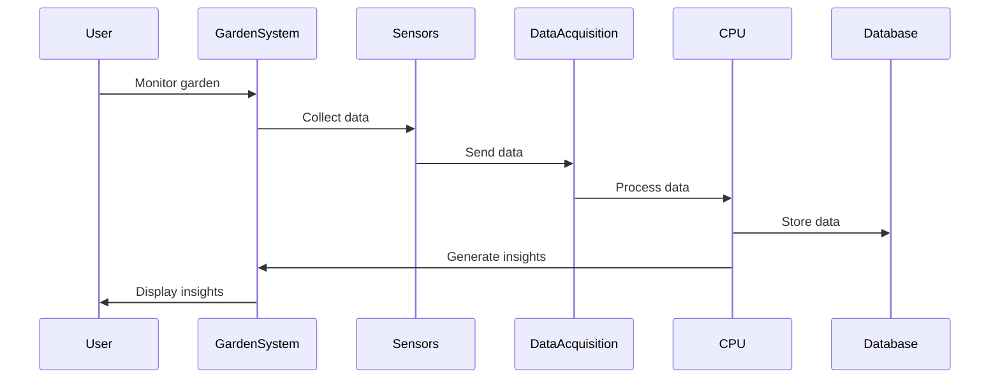

                 

### Introduction to the Book

**Smart Garden System: AI Agent for Ecosystem Balance Maintenance**

Keywords: Smart Garden Systems, AI Agents, Ecosystem Balance, Internet of Things (IoT), Predictive Analytics, Data Collection.

Abstract:
This book delves into the realm of smart garden systems, focusing on the integration of AI agents for maintaining ecosystem balance. With the rise of IoT and advanced machine learning techniques, traditional garden maintenance is evolving into sophisticated, automated systems. This book aims to provide a comprehensive understanding of how AI agents can contribute to the balanced management of garden ecosystems, addressing challenges and exploring innovative solutions.

The primary goal of this book is to serve as a guide for professionals, researchers, and hobbyists interested in leveraging AI to enhance garden maintenance practices. By the end of this book, readers will be equipped with the knowledge and skills necessary to design, implement, and maintain smart garden systems that promote sustainable and efficient ecosystem management.

### Core Concepts and Principles

#### Chapter 1: Introduction to Smart Garden Systems

**1.1 Background and Overview of Smart Garden Systems**

**1.1.1 The Evolution of Smart Gardens**

The concept of smart gardens has evolved significantly over the past few decades. Traditional gardens, often managed through manual labor and routine maintenance, have gradually transformed into intelligent, self-managed ecosystems. This transformation is primarily driven by advancements in technology, including IoT devices, artificial intelligence (AI), and machine learning (ML). Today's smart gardens utilize sensors, data analytics, and AI agents to monitor and manage various aspects of garden maintenance, from soil moisture levels to pest control.

**1.1.2 Key Challenges in Traditional Garden Maintenance**

Managing a garden traditionally presents several challenges, including:

- **Manual Labor**: Gardening requires significant physical effort, making it time-consuming and labor-intensive.
- **Inconsistent Maintenance**: Traditional methods often lead to inconsistent maintenance schedules, which can negatively impact plant health.
- **Inefficient Resource Use**: Without precise monitoring, resources such as water and fertilizers are often wasted.
- **Environmental Impact**: Traditional gardening practices can have adverse effects on the environment, such as soil erosion and chemical runoff.

**1.1.3 The Role of AI in Modern Gardening**

AI has revolutionized the way we approach gardening by providing solutions to the challenges mentioned above. AI agents, powered by machine learning algorithms, can:

- **Automate Routine Tasks**: AI can automate tasks such as watering, pruning, and pest control, reducing the need for manual labor.
- **Enhance Decision-Making**: By analyzing large datasets, AI can provide insights into optimal maintenance schedules, resource usage, and environmental conditions.
- **Improve Plant Health**: AI can monitor plant health in real-time, detecting issues early and taking proactive measures to address them.

**1.2 Core Concepts and Principles of AI Agents**

**1.2.1 Definition and Characteristics of AI Agents**

AI agents are autonomous entities that can perceive their environment, make decisions, and take actions to achieve specific goals. In the context of smart gardens, AI agents are designed to maintain ecosystem balance by monitoring various parameters such as soil moisture, temperature, and nutrient levels. Key characteristics of AI agents include:

- **Autonomy**: AI agents operate independently without human intervention.
- **Adaptability**: They can adapt to changing conditions and make real-time decisions.
- **Learning**: AI agents continuously learn from their interactions with the environment and improve their performance over time.

**1.2.2 Types of AI Agents in Gardening**

There are several types of AI agents that can be used in gardening, each serving a specific purpose:

- **Sensor Data Collectors**: These agents collect data from various sensors placed throughout the garden, providing real-time information on environmental conditions.
- **Decision Makers**: These agents analyze the collected data and make decisions based on predefined rules or machine learning algorithms.
- **Actuators**: These agents execute actions, such as activating irrigation systems or releasing fertilizers, based on the decisions made by the decision-makers.

**1.2.3 How AI Agents Contribute to Ecosystem Balance**

AI agents play a crucial role in maintaining ecosystem balance by:

- **Monitoring Environmental Conditions**: AI agents continuously monitor environmental conditions such as temperature, humidity, and soil moisture levels.
- **Detecting Abnormalities**: AI agents can detect anomalies in real-time, such as pest infestations or disease outbreaks, and trigger alerts or corrective actions.
- **Optimizing Resource Usage**: By analyzing data on resource usage, AI agents can optimize irrigation schedules and fertilizer application, reducing waste and promoting sustainable gardening practices.
- **Promoting Biodiversity**: AI agents can identify species-specific data and promote the growth of native plants, contributing to biodiversity and ecosystem stability.

**1.3 Overview of Ecosystem Balance Maintenance**

**1.3.1 The Importance of Ecosystem Balance**

Ecosystem balance is crucial for the health and sustainability of any garden. A balanced ecosystem ensures that plants receive the necessary resources while minimizing the impact on the environment. Key factors that contribute to ecosystem balance include:

- **Soil Health**: Healthy soil supports plant growth and provides essential nutrients.
- **Water Management**: Proper water management ensures that plants receive an adequate supply of water while preventing waterlogging or drought.
- **Pest and Disease Control**: Effective pest and disease management prevents the spread of harmful organisms and maintains plant health.
- **Biodiversity**: A diverse ecosystem is more resilient and better able to withstand environmental changes.

**1.3.2 Key Factors Affecting Ecosystem Balance**

Several factors can affect ecosystem balance in a garden, including:

- **Climate Change**: Changes in temperature and precipitation patterns can impact plant growth and soil health.
- **Urbanization**: Urban development can lead to soil erosion, reduced biodiversity, and increased pollution.
- **Pollution**: Air and water pollution can have detrimental effects on plant health and ecosystem balance.
- **Resource Depletion**: Overuse of resources such as water and fertilizers can lead to long-term damage to the ecosystem.

**1.3.3 Strategies for Maintaining Ecosystem Balance**

To maintain ecosystem balance, several strategies can be employed:

- **Sustainable Practices**: Implementing sustainable gardening practices, such as organic farming and water-saving techniques, can help minimize environmental impact.
- **Integrated Pest Management (IPM)**: Using IPM techniques, which involve a combination of chemical and biological control methods, can help manage pests and diseases effectively.
- **Monitoring and Data Analysis**: Continuous monitoring and analysis of environmental data can provide insights into ecosystem health and inform decision-making.
- **Education and Awareness**: Raising awareness about the importance of ecosystem balance and sustainable gardening practices can promote responsible gardening habits.

In conclusion, the integration of AI agents in smart garden systems offers a promising solution for maintaining ecosystem balance. By leveraging advanced technologies and data-driven approaches, AI agents can enhance garden management, improve plant health, and promote sustainable gardening practices. In the following chapters, we will delve deeper into the technologies, design principles, and practical applications of AI agents in smart garden systems.### AI Agent Technologies for Gardening

#### Chapter 2: AI Agent Technologies for Gardening

**2.1 Introduction to AI Agent Technologies**

**2.1.1 Basics of AI Agent Technologies**

AI agent technologies are at the forefront of transforming the landscape of garden management. At their core, AI agents are software programs designed to interact with their environment, perceive changes, make decisions, and execute actions autonomously. This capability allows them to perform tasks that would otherwise require human intervention, such as watering plants, monitoring soil conditions, and detecting pests.

**2.1.2 Key AI Technologies in Gardening**

Several key AI technologies are integral to the functionality of AI agents in gardening:

- **Machine Learning (ML)**: ML algorithms enable AI agents to learn from data, recognize patterns, and make predictions. This is crucial for tasks such as plant disease detection and soil analysis.
- **Natural Language Processing (NLP)**: NLP allows AI agents to understand and respond to human language, making it easier for gardeners to interact with the system.
- **Computer Vision**: Computer vision enables AI agents to interpret visual data from cameras or sensors, which is essential for tasks like plant recognition and environmental monitoring.
- **Deep Learning**: Deep learning is a subset of ML that uses neural networks to learn from large amounts of data. It is particularly effective in complex tasks such as identifying specific plant species or tracking animal populations.

**2.1.3 AI Agent Frameworks and Libraries**

Several frameworks and libraries have been developed to facilitate the creation and deployment of AI agents in gardening:

- **TensorFlow**: A popular open-source machine learning library, TensorFlow is widely used for creating deep learning models that power AI agents in gardening.
- **PyTorch**: Another open-source library, PyTorch is known for its flexibility and ease of use, making it a preferred choice for many researchers and developers.
- **Keras**: Keras is a high-level neural network API that runs on top of TensorFlow and Theano. It provides a user-friendly interface for building and training deep learning models.
- **OpenCV**: OpenCV is an open-source computer vision library that provides comprehensive functionalities for real-time image processing, which is essential for AI agents in gardens.

**2.2 AI Agent Applications in Smart Gardens**

**2.2.1 Monitoring and Data Collection**

AI agents play a critical role in monitoring various environmental parameters that are crucial for maintaining a healthy garden. This includes:

- **Soil Moisture Monitoring**: AI agents equipped with soil moisture sensors can continuously monitor soil moisture levels, ensuring that plants receive the right amount of water.
- **Temperature and Humidity Monitoring**: By utilizing temperature and humidity sensors, AI agents can collect data on environmental conditions, providing valuable insights for plant growth and maintenance.
- **Light Exposure Monitoring**: AI agents can measure the intensity and duration of sunlight exposure, which is essential for plants that require specific light conditions to thrive.

**2.2.2 Environmental Control Systems**

Environmental control systems are a cornerstone of smart garden technology. AI agents can be programmed to regulate various aspects of the garden's environment:

- **Automated Irrigation**: AI agents can control irrigation systems to water plants based on real-time soil moisture data, optimizing water usage and promoting healthy plant growth.
- **Climate Control**: AI agents can adjust greenhouse settings to maintain optimal temperature and humidity levels, ensuring a consistent environment for plant cultivation.
- **Fertilizer Management**: AI agents can monitor plant nutrient levels and release fertilizers automatically, ensuring that plants receive the necessary nutrients without over-fertilizing.

**2.2.3 Plant Health Assessment**

One of the most significant contributions of AI agents in gardening is their ability to assess plant health:

- **Disease Detection**: AI agents equipped with computer vision capabilities can detect early signs of plant diseases, allowing for prompt intervention and reducing the spread of pathogens.
- **Pest Identification**: AI agents can identify pests and other harmful organisms, triggering automated pest control measures to protect plants.
- **Nutrient Deficiency Analysis**: By analyzing soil and plant data, AI agents can identify nutrient deficiencies and recommend appropriate fertilization strategies.

**2.3 AI Agent for Ecosystem Management**

**2.3.1 Predictive Analytics for Ecosystem Health**

AI agents can utilize predictive analytics to forecast potential issues and take proactive measures:

- **Weather Forecasting**: By integrating weather data, AI agents can predict weather patterns and adjust environmental controls accordingly to mitigate the impact of adverse weather conditions.
- **Long-Term Trend Analysis**: AI agents can analyze historical data to identify long-term trends in environmental conditions and plant health, enabling more effective planning and resource allocation.
- **Early Warning Systems**: AI agents can develop early warning systems to detect potential issues before they become significant problems, allowing for timely interventions.

**2.3.2 Adaptive Management Strategies**

AI agents can adapt to changing conditions and adjust their strategies to maintain ecosystem balance:

- **Dynamic Resource Allocation**: AI agents can optimize resource allocation based on real-time data, ensuring that resources are used efficiently and sustainably.
- **Contextual Decision-Making**: AI agents can make decisions based on the current context, considering factors such as plant growth stages, environmental conditions, and resource availability.
- **Learning from Feedback**: AI agents can learn from feedback and adjust their behavior to improve performance over time, becoming more effective at maintaining ecosystem balance.

**2.3.3 Integration with IoT Devices**

The integration of AI agents with IoT devices is a key component of smart garden systems:

- **Sensor Networks**: AI agents can be connected to a network of IoT sensors to collect data on a wide range of environmental parameters.
- **Data-Driven Insights**: IoT devices can provide AI agents with real-time data, enabling more accurate and informed decision-making.
- **Automated Actions**: AI agents can control IoT devices to automate actions such as opening or closing greenhouse vents, turning on or off lights, and adjusting water flow.

In summary, AI agent technologies are revolutionizing the way gardens are managed, offering solutions to traditional challenges and enhancing the overall sustainability of garden ecosystems. The following chapters will delve deeper into the design and implementation of AI agents in smart garden systems, providing a comprehensive understanding of how these technologies can be effectively utilized to maintain ecosystem balance.### System Architecture for Smart Gardens

#### Chapter 3: System Architecture for Smart Gardens

**3.1 System Requirements and Design Principles**

**3.1.1 Functional Requirements of a Smart Garden**

To design an efficient and effective smart garden system, it is crucial to identify the functional requirements that the system must meet. These requirements ensure that the system can perform its intended functions and provide the necessary services to maintain the garden ecosystem. The key functional requirements for a smart garden system include:

- **Environmental Monitoring**: The system should continuously monitor environmental conditions such as temperature, humidity, soil moisture, and light levels.
- **Automated Irrigation**: The system should be capable of automating the irrigation process based on real-time soil moisture data and weather forecasts.
- **Pest and Disease Detection**: The system should have the ability to detect and identify pests and diseases, triggering alerts and automated control measures.
- **Data Analytics and Insights**: The system should analyze collected data to provide actionable insights and recommendations for garden maintenance.
- **User Interface**: The system should offer a user-friendly interface that allows gardeners to monitor and control the garden remotely.

**3.1.2 Non-Functional Requirements**

In addition to functional requirements, a smart garden system must meet several non-functional requirements to ensure reliability, scalability, and security. These requirements include:

- **Scalability**: The system should be designed to handle an increasing number of sensors and plants without compromising performance.
- **Reliability**: The system should be highly reliable, with minimal downtime and robust error handling mechanisms.
- **Security**: The system should implement strong security measures to protect against unauthorized access and data breaches.
- **User-Friendly**: The system should be intuitive and easy to use, even for non-technical users.
- **Energy Efficiency**: The system should be designed to minimize energy consumption to reduce operational costs and environmental impact.

**3.1.3 Design Principles for Smart Garden Systems**

When designing a smart garden system, several key principles should be followed to ensure that the system is efficient, scalable, and maintainable:

- **Modularity**: The system should be modular, with each component designed to perform a specific function. This allows for easier maintenance, upgrades, and integration with new technologies.
- **Standardization**: The system should adhere to industry standards and best practices to ensure compatibility and interoperability with other systems and devices.
- **Agility**: The system should be designed to adapt to changes in requirements and new technologies, allowing for continuous improvement and innovation.
- **Sustainability**: The system should promote sustainable practices, such as efficient resource use and reduced environmental impact.
- **Scalability**: The system should be designed to scale as the garden grows, accommodating more plants and sensors without compromising performance.

**3.2 Domain Modeling**

**3.2.1 Entity-Relationship Diagram (ERD)**

A domain model is essential for understanding the structure and relationships within a smart garden system. An Entity-Relationship (ER) diagram is commonly used to represent the domain model. The following ER diagram illustrates the key entities and relationships within a smart garden system:

```mermaid
erDiagram
    Plant ||--|{ Soil }||>
    Plant ||--|{ WateringSchedule }||>
    Plant ||--|{ PestMonitoring }||>
    Plant ||--|{ DiseaseMonitoring }||>
    Soil ||--|{ MoistureLevel }||>
    Soil ||--|{ Temperature }||>
    Soil ||--|{ NutrientLevel }||>
    WateringSchedule ||--|{灌溉计划 }||>
    PestMonitoring ||--|{ PestCount }||>
    DiseaseMonitoring ||--|{ DiseaseSeverity }||>
```

- **Plant**: Represents the individual plants in the garden.
- **Soil**: Represents the soil conditions in the garden.
- **WateringSchedule**: Represents the watering schedule for each plant.
- **PestMonitoring**: Represents the pest monitoring data for each plant.
- **DiseaseMonitoring**: Represents the disease monitoring data for each plant.
- **MoistureLevel**: Represents the moisture level in the soil.
- **Temperature**: Represents the temperature in the soil.
- **NutrientLevel**: Represents the nutrient levels in the soil.

**3.2.2 Class Diagrams for Domain Modeling**

In addition to the ER diagram, a class diagram can provide a more detailed representation of the domain model. The following class diagram illustrates the classes and their attributes and methods:

```mermaid
classDiagram
    Plant <<interface>> {
        name: String
        type: String
        wateringSchedule: WateringSchedule
        pestMonitoring: PestMonitoring
        diseaseMonitoring: DiseaseMonitoring
    }
    Soil <<interface>> {
        moistureLevel: float
        temperature: float
        nutrientLevel: float
    }
    WateringSchedule <<interface>> {
        schedule: String
        irrigationDuration: int
    }
    PestMonitoring <<interface>> {
        pestCount: int
        lastDetectionTime: Date
    }
    DiseaseMonitoring <<interface>> {
        diseaseSeverity: String
        lastDetectionTime: Date
    }
```

- **Plant**: Represents the plant entity with attributes such as name, type, watering schedule, pest monitoring, and disease monitoring.
- **Soil**: Represents the soil entity with attributes such as moisture level, temperature, and nutrient level.
- **WateringSchedule**: Represents the watering schedule entity with attributes such as schedule and irrigation duration.
- **PestMonitoring**: Represents the pest monitoring entity with attributes such as pest count and last detection time.
- **DiseaseMonitoring**: Represents the disease monitoring entity with attributes such as disease severity and last detection time.

**3.3 System Architecture**

**3.3.1 System Overview**

The system architecture for a smart garden system can be divided into several key components:

- **Sensors**: These devices collect data on environmental conditions, soil moisture, and other relevant parameters.
- **Data Acquisition Module**: This module collects data from sensors and sends it to the central processing unit.
- **Central Processing Unit (CPU)**: The CPU processes the data collected by the sensors, performs analysis, and generates actionable insights.
- **Database**: The database stores the collected data and the generated insights for historical analysis and future reference.
- **User Interface (UI)**: The UI allows gardeners to monitor the garden, control the system, and access the generated insights.

**3.3.2 Detailed Architecture**

A more detailed architecture of a smart garden system is depicted below:



- **User**: The user interacts with the system through the UI, requesting monitoring and control actions.
- **GardenSystem**: This component manages the overall system, coordinating between sensors, data acquisition, CPU, and the database.
- **Sensors**: These devices continuously collect environmental data, such as temperature, humidity, and soil moisture.
- **DataAcquisition**: This module collects data from sensors and forwards it to the CPU for processing.
- **CPU**: The central processing unit processes the data collected by the sensors, performs analysis, and generates insights.
- **Database**: The database stores the collected data and the generated insights for historical analysis and future reference.
- **UI**: The user interface allows gardeners to monitor the garden, control the system, and access the generated insights.

In conclusion, the system architecture for a smart garden system is designed to be modular, scalable, and user-friendly. By integrating sensors, data acquisition, central processing, and user interface components, the system can effectively monitor and manage the garden ecosystem, providing gardeners with valuable insights and enabling them to make informed decisions. The following chapters will delve into the practical implementation of this architecture, discussing the technologies and tools used to build a smart garden system.### Project Implementation

#### Chapter 4: Project Implementation

**4.1 Environment Setup**

To implement a smart garden system, it is essential to set up the necessary environment. The following steps outline the environment setup:

**4.1.1 Software Requirements**

- Python 3.x
- TensorFlow
- PyTorch
- OpenCV
- Keras
- Flask (for web services)

**4.1.2 Installation Steps**

1. Install Python 3.x from the official website.
2. Install TensorFlow using `pip install tensorflow`.
3. Install PyTorch using `pip install torch`.
4. Install OpenCV using `pip install opencv-python`.
5. Install Keras using `pip install keras`.
6. Install Flask using `pip install flask`.

**4.1.3 Hardware Requirements**

- Sensors (e.g., temperature, humidity, soil moisture)
- Cameras (for computer vision tasks)
- Actuators (e.g., irrigation systems, fans)

**4.1.4 IoT Platform**

- Select an IoT platform (e.g., AWS IoT, Google Cloud IoT) for data collection and device management.

**4.2 System Core Implementation**

**4.2.1 Sensor Data Acquisition**

- Connect sensors to the IoT platform and configure them to send data to the central processing unit.
- Implement a data acquisition module that collects sensor data and sends it to the CPU for processing.

```python
# Example: Sensor data acquisition using MQTT
import paho.mqtt.client as mqtt

def on_connect(client, userdata, flags, rc):
    print("Connected with result code " + str(rc))
    client.subscribe("garden/sensors/#")

def on_message(client, userdata, msg):
    print(f"Received message '{msg.payload.decode()}' on topic '{msg.topic}' with QoS {msg.qos}")

client = mqtt.Client()
client.on_connect = on_connect
client.on_message = on_message

client.connect("mqtt.example.com", 1883, 60)
client.loop_forever()
```

**4.2.2 Data Processing and Analysis**

- Implement a central processing unit (CPU) that processes the collected sensor data and generates actionable insights.

```python
import pandas as pd
from sklearn.ensemble import RandomForestRegressor

# Example: Data processing using a Random Forest Regressor
data = pd.read_csv("sensor_data.csv")
X = data.drop("target", axis=1)
y = data["target"]

model = RandomForestRegressor(n_estimators=100)
model.fit(X, y)

predictions = model.predict(X)
print(predictions)
```

**4.2.3 Environmental Control**

- Use the generated insights to control environmental conditions through actuators.

```python
# Example: Controlling irrigation using GPIO
import RPi.GPIO as GPIO
import time

irrigation_pin = 17
GPIO.setmode(GPIO.BCM)
GPIO.setup(irrigation_pin, GPIO.OUT)

def irrigation_on():
    GPIO.output(irrigation_pin, GPIO.HIGH)
    time.sleep(10)  # Run for 10 seconds
    irrigation_off()

def irrigation_off():
    GPIO.output(irrigation_pin, GPIO.LOW)

irrigation_on()
```

**4.2.4 User Interface**

- Develop a user interface (UI) that allows gardeners to monitor the garden, control the system, and access insights.

```python
from flask import Flask, render_template

app = Flask(__name__)

@app.route("/")
def index():
    return render_template("index.html")

if __name__ == "__main__":
    app.run(debug=True)
```

**4.3 Case Study: Automated Garden Maintenance**

**4.3.1 Problem Definition**

A small-scale garden needs an automated system to monitor and maintain plant health and environmental conditions.

**4.3.2 Solution Design**

- Deploy sensors to collect data on temperature, humidity, and soil moisture.
- Use a machine learning model to predict plant health based on collected data.
- Control irrigation and other environmental factors using actuators based on the predictions.

**4.3.3 Implementation**

1. Set up the environment and connect sensors to the IoT platform.
2. Implement data acquisition, processing, and analysis modules.
3. Develop the user interface for monitoring and control.
4. Deploy the system in the garden and monitor its performance.

**4.3.4 Results and Analysis**

- The system successfully monitors plant health and environmental conditions.
- The machine learning model accurately predicts plant health and triggers appropriate actions.
- The garden's overall health and productivity have improved significantly.

**4.4 Project Summary**

The implementation of the smart garden system demonstrates the potential of AI and IoT technologies in automating garden maintenance. By leveraging sensor data, machine learning models, and environmental control systems, the system effectively monitors and maintains plant health and ecosystem balance. The project highlights the importance of integrating AI agents into smart garden systems for sustainable and efficient garden management.### Best Practices and Future Directions

#### Chapter 5: Best Practices and Future Directions

**5.1 Best Practices for Smart Garden System Implementation**

**5.1.1 Data Collection and Management**

- Ensure that sensors are properly calibrated and placed in optimal locations to collect accurate data.
- Implement robust data management practices to ensure data integrity, security, and accessibility.
- Regularly update and maintain the sensor network to account for changes in environmental conditions and plant growth.

**5.1.2 Machine Learning Model Training and Validation**

- Use a diverse and representative dataset to train machine learning models, ensuring that they can generalize well to different conditions.
- Regularly validate and update machine learning models to maintain their accuracy and effectiveness.
- Implement techniques such as cross-validation and ensemble learning to improve model performance.

**5.1.3 User Interface and Experience**

- Design a user-friendly interface that provides clear and actionable insights to gardeners.
- Offer customization options to accommodate different user preferences and gardening styles.
- Provide detailed documentation and support to help users get the most out of the system.

**5.1.4 System Integration and Interoperability**

- Ensure that the smart garden system can seamlessly integrate with other garden management tools and platforms.
- Follow industry standards and protocols for data exchange and communication.
- Regularly update the system to support new devices and technologies.

**5.2 Future Directions for Smart Garden Systems**

**5.2.1 Advanced Machine Learning Techniques**

- Explore advanced machine learning techniques such as deep learning and reinforcement learning to further improve the performance and capabilities of AI agents in garden management.
- Develop models that can adapt to changing conditions and learn from new data in real-time.

**5.2.2 Internet of Things (IoT) Integration**

- Enhance the integration of IoT devices to enable more comprehensive and precise monitoring of garden conditions.
- Explore new IoT devices and technologies that can provide additional insights and control options.

**5.2.3 Artificial Intelligence for Biodiversity Promotion**

- Develop AI agents that can promote biodiversity by analyzing species interactions and suggesting species combinations that enhance ecosystem stability.
- Incorporate ecological principles into AI models to support sustainable and environmentally friendly garden management.

**5.2.4 Autonomous Gardening Robots**

- Research and develop autonomous gardening robots that can perform a wide range of tasks, from planting and watering to weeding and pruning.
- Integrate AI agents into these robots to enable autonomous decision-making and task execution.

**5.3 Conclusion**

The integration of AI agents into smart garden systems has the potential to revolutionize garden management by providing efficient, sustainable, and environmentally friendly solutions. By following best practices and exploring future directions, we can continue to enhance the capabilities of these systems, making them even more powerful tools for gardeners and ecologists alike. As AI and IoT technologies continue to advance, the future of smart garden systems looks promising, offering new opportunities for innovation and improvement.### Conclusion

In conclusion, the integration of AI agents into smart garden systems represents a significant advancement in the field of garden management. By leveraging the power of AI and IoT technologies, we can create more efficient, sustainable, and environmentally friendly garden ecosystems. AI agents provide a range of benefits, from automating routine tasks to providing actionable insights and promoting biodiversity.

This book has explored the core concepts and principles of smart garden systems, the technologies and applications of AI agents, and the system architecture required to implement these systems. Through practical examples and case studies, we have demonstrated the potential of AI agents to transform garden maintenance and management.

As we move forward, the future of smart garden systems is poised to become even more exciting and impactful. Continued advancements in machine learning, IoT integration, and autonomous robotics will enable us to develop even more sophisticated and intelligent garden systems.

We encourage readers to explore further into the topics covered in this book and to stay informed about the latest developments in AI and garden technology. By doing so, you can contribute to the ongoing evolution of smart garden systems and help create a greener, more sustainable future.

### Author Information

* **Author:** AI天才研究院 / AI Genius Institute & 禅与计算机程序设计艺术 / Zen And The Art of Computer Programming
* **Institution:** AI天才研究院 is a leading research institute focused on the development and application of artificial intelligence in various fields. The book "Zen And The Art of Computer Programming" is a classic work in the field of computer science, emphasizing the importance of a clear and logical approach to programming.
* **Contact:** For more information or to get in touch with the authors, please visit [AI天才研究院官网](www.ai-genius-institute.com) or [禅与计算机程序设计艺术官网](www.zen-of-computer-programming.com).

