                 

## 智能花瓶：AI Agent的插花艺术指导

关键词：智能花瓶，AI Agent，插花艺术，技术原理，应用案例

摘要：本文将探讨智能花瓶这一新兴领域，重点分析AI Agent在插花艺术中的应用及其技术原理。通过逐步拆解智能花瓶的设计与实现，揭示其在家庭和商业领域的广泛应用前景，并提出未来发展趋势和面临的挑战。

## 目录大纲

### 第一部分：背景与基础

#### 第1章：智能花瓶与AI Agent概述

##### 1.1.1 智能花瓶的兴起与发展

##### 1.1.2 AI Agent在插花艺术中的应用

##### 1.1.3 AI Agent的技术基础

#### 第2章：AI Agent的核心原理与功能

##### 2.1.1 AI Agent的核心原理

##### 2.1.2 AI Agent在插花艺术中的功能

### 第二部分：智能花瓶的设计与实现

#### 第3章：智能花瓶硬件设计

##### 3.1.1 智能花瓶硬件模块概述

##### 3.1.2 硬件设计原则与优化

#### 第4章：AI Agent软件设计

##### 4.1.1 AI Agent软件框架

##### 4.1.2 软件开发工具与平台

#### 第5章：智能花瓶系统实现与测试

##### 5.1.1 系统实现流程

##### 5.1.2 系统测试与调试

#### 第6章：AI Agent在插花艺术中的应用案例

##### 6.1.1 案例一：智能花瓶的家庭应用

##### 6.1.2 案例二：智能花瓶的商业应用

### 第三部分：未来发展趋势与挑战

#### 第7章：未来发展趋势与挑战

##### 7.1.1 智能花瓶的未来发展趋势

##### 7.1.2 智能花瓶面临的挑战与应对策略

### 结语：智能花瓶与AI Agent的美好未来

## 第一部分：背景与基础

### 第1章：智能花瓶与AI Agent概述

#### 1.1.1 智能花瓶的兴起与发展

智能花瓶是一种集成了人工智能技术的花瓶，能够根据环境变化和用户需求，自动进行插花艺术调整。随着物联网和人工智能技术的不断发展，智能花瓶逐渐走进了人们的日常生活。

##### 1.1.1.1 智能花瓶的定义

智能花瓶是一种具有感知、决策和执行能力的智能设备，它能够根据环境变化、用户需求等因素，自动进行插花艺术调整，使插花始终保持最佳状态。

##### 1.1.1.2 智能花瓶的演进路径

智能花瓶的发展可以分为三个阶段：传统花瓶阶段、物联网花瓶阶段和智能花瓶阶段。传统花瓶阶段主要依赖于人工进行插花艺术调整；物联网花瓶阶段通过传感器收集环境数据，实现简单的自动调整；智能花瓶阶段则通过AI Agent实现更加智能化的插花艺术指导。

##### 1.1.1.3 智能花瓶的市场前景

随着智能家居市场的不断扩大，智能花瓶市场前景广阔。未来，智能花瓶将不仅仅局限于家庭应用，还将广泛应用于商业空间、酒店、餐厅等领域。

#### 1.1.2 AI Agent在插花艺术中的应用

AI Agent是一种能够模拟人类思维和行为的智能系统，它在插花艺术中的应用使得智能花瓶能够实现更加精准和个性化的插花艺术指导。

##### 1.1.2.1 AI Agent的基本概念

AI Agent是一种具备自主感知、决策和执行能力的智能系统，它能够在没有人类干预的情况下，根据环境变化和用户需求，自主进行插花艺术调整。

##### 1.1.2.2 AI Agent在插花艺术中的优势

AI Agent在插花艺术中的应用具有以下优势：

1. **个性化定制**：AI Agent可以根据用户需求和喜好，为用户定制个性化的插花方案。
2. **实时调整**：AI Agent能够实时感知环境变化，自动调整插花艺术，保持插花的新鲜度和美观度。
3. **节能环保**：AI Agent通过智能决策，实现水资源的合理利用，降低能耗。

##### 1.1.2.3 AI Agent的技术基础

AI Agent的技术基础主要包括以下几个方面：

1. **感知技术**：通过传感器收集环境数据，如光线、温度、湿度等，为AI Agent提供决策依据。
2. **决策算法**：采用机器学习和深度学习等技术，对收集到的数据进行分析和处理，生成插花艺术调整方案。
3. **执行机制**：通过电机、水泵等执行机构，实现插花艺术的自动调整。

### 第2章：AI Agent的核心原理与功能

#### 2.1.1 AI Agent的核心原理

AI Agent的核心原理主要包括感知、决策和执行三个部分。

##### 2.1.1.1 感知与交互

AI Agent通过传感器感知环境变化，并与用户进行交互，获取用户需求。

##### 2.1.1.2 决策与规划

AI Agent基于感知到的数据和用户需求，通过决策算法生成插花艺术调整方案。

##### 2.1.1.3 学习与适应

AI Agent通过不断学习和优化，提高插花艺术调整的准确性。

#### 2.1.2 AI Agent在插花艺术中的功能

AI Agent在插花艺术中的应用功能主要包括：

##### 2.1.2.1 花材识别与选择

AI Agent能够识别各种花材，并根据用户需求和季节变化选择合适的花材。

##### 2.1.2.2 插花艺术风格的设定

AI Agent可以根据用户喜好和当前环境，设定不同的插花艺术风格。

##### 2.1.2.3 实时调整与优化

AI Agent能够实时感知环境变化，对插花艺术进行自动调整和优化。

## 第二部分：智能花瓶的设计与实现

### 第3章：智能花瓶硬件设计

#### 3.1.1 智能花瓶硬件模块概述

智能花瓶的硬件模块主要包括传感器模块、执行器模块和通信模块。

##### 3.1.1.1 传感器模块

传感器模块用于感知环境变化，主要包括光线传感器、温度传感器和湿度传感器。

##### 3.1.1.2 执行器模块

执行器模块用于实现插花艺术的自动调整，主要包括电机、水泵等。

##### 3.1.1.3 通信模块

通信模块用于实现智能花瓶与AI Agent之间的数据传输，通常采用Wi-Fi或蓝牙等无线通信技术。

### 第4章：AI Agent软件设计

#### 4.1.1 AI Agent软件框架

AI Agent的软件框架主要包括感知模块、决策模块和执行模块。

##### 4.1.1.1 感知模块设计

感知模块设计主要涉及传感器的数据采集和处理。

##### 4.1.1.2 决策模块设计

决策模块设计主要涉及数据分析和决策算法的选择。

##### 4.1.1.3 执行模块设计

执行模块设计主要涉及执行机构的控制和调整。

### 第5章：智能花瓶系统实现与测试

#### 5.1.1 系统实现流程

智能花瓶的系统实现流程包括硬件设计、软件设计和系统集成。

##### 5.1.1.1 硬件部分实现

硬件部分实现主要涉及传感器、执行器和通信模块的设计和组装。

##### 5.1.1.2 软件部分实现

软件部分实现主要涉及AI Agent软件框架的构建和功能实现。

##### 5.1.1.3 系统集成

系统集成主要涉及硬件和软件的集成，实现智能花瓶的整体功能。

### 第6章：AI Agent在插花艺术中的应用案例

#### 6.1.1 案例一：智能花瓶的家庭应用

##### 6.1.1.1 案例背景

##### 6.1.1.2 案例实现

##### 6.1.1.3 案例效果分析

#### 6.1.2 案例二：智能花瓶的商业应用

##### 6.1.2.1 案例背景

##### 6.1.2.2 案例实现

##### 6.1.2.3 案例效果分析

### 第7章：未来发展趋势与挑战

#### 7.1.1 智能花瓶的未来发展趋势

##### 7.1.1.1 技术创新方向

##### 7.1.1.2 市场前景预测

##### 7.1.1.3 用户需求变化

#### 7.1.2 智能花瓶面临的挑战与应对策略

##### 7.1.2.1 技术挑战

##### 7.1.2.2 市场竞争

##### 7.1.2.3 用户接受度提升策略

## 结语：智能花瓶与AI Agent的美好未来

智能花瓶与AI Agent的结合，不仅为插花艺术带来了全新的变革，也为智能家居和智慧城市的发展提供了有力支持。未来，随着技术的不断进步，智能花瓶将更加智能化、个性化，为用户带来更加美好的生活体验。

## 第一部分：背景与基础

### 第1章：智能花瓶与AI Agent概述

#### 1.1.1 智能花瓶的兴起与发展

智能花瓶作为智能家居的一部分，近年来逐渐受到市场的青睐。这一现象背后，既有技术进步的推动，也体现了人们对于美好生活的追求。

##### 1.1.1.1 智能花瓶的定义

智能花瓶是一种集成了传感器、执行器、处理器等模块，能够通过人工智能算法实现自主插花、自我维护的花瓶。与普通花瓶相比，智能花瓶具有更高的灵活性和智能化程度。

##### 1.1.1.2 智能花瓶的演进路径

智能花瓶的发展大致可以分为以下几个阶段：

1. **传统花瓶阶段**：这一阶段的花瓶主要是物理形态的花瓶，没有智能功能。
2. **传感器花瓶阶段**：这一阶段的花瓶开始集成传感器，能够感知环境信息，如温度、湿度、光照等。
3. **智能花瓶阶段**：这一阶段的花瓶不仅具备传感器，还集成了处理器和执行器，能够根据环境信息和用户需求进行自主插花和自我维护。

##### 1.1.1.3 智能花瓶的市场前景

随着智能家居市场的不断扩大，智能花瓶市场前景广阔。据市场研究公司预测，未来几年智能花瓶的市场规模将保持高速增长。

#### 1.1.2 AI Agent在插花艺术中的应用

AI Agent（人工智能代理）是一种能够模拟人类思维和行为的智能系统。在插花艺术中，AI Agent通过感知环境、分析数据、自主决策，实现对花瓶内花材的自动调整。

##### 1.1.2.1 AI Agent的基本概念

AI Agent是一种具备自主感知、决策和执行能力的智能体。它可以模拟人类思维过程，根据环境变化和任务需求，自主执行相应的操作。

##### 1.1.2.2 AI Agent在插花艺术中的优势

1. **个性化定制**：AI Agent可以根据用户需求和喜好，为用户定制个性化的插花方案。
2. **实时调整**：AI Agent能够实时感知环境变化，自动调整花材，保持插花的新鲜度和美观度。
3. **节能环保**：AI Agent通过智能决策，实现水资源的合理利用，降低能耗。

##### 1.1.2.3 AI Agent的技术基础

AI Agent的技术基础主要包括以下几个方面：

1. **感知技术**：AI Agent通过传感器收集环境信息，如温度、湿度、光照等。
2. **决策算法**：AI Agent利用机器学习、深度学习等技术，对收集到的数据进行分析和处理，生成插花方案。
3. **执行机制**：AI Agent通过执行器，如电机、水泵等，实现花材的自动调整。

### 第2章：AI Agent的核心原理与功能

#### 2.1.1 AI Agent的核心原理

AI Agent的核心原理可以概括为三个部分：感知、决策和执行。

##### 2.1.1.1 感知与交互

AI Agent通过传感器感知环境变化，并与用户进行交互，获取用户需求。例如，通过温度传感器感知室内温度，通过摄像头识别用户喜好。

##### 2.1.1.2 决策与规划

AI Agent基于感知到的数据和用户需求，通过决策算法生成插花方案。例如，利用机器学习算法分析用户历史喜好，预测用户当前需求，并生成相应的插花方案。

##### 2.1.1.3 学习与适应

AI Agent通过不断学习和优化，提高插花艺术调整的准确性。例如，通过用户反馈不断调整决策算法，使其更加贴合用户需求。

#### 2.1.2 AI Agent在插花艺术中的功能

AI Agent在插花艺术中的应用功能主要包括：

##### 2.1.2.1 花材识别与选择

AI Agent能够识别各种花材，并根据用户需求和季节变化选择合适的花材。例如，通过图像识别技术识别花材种类，通过环境数据分析选择适宜的花材。

##### 2.1.2.2 插花艺术风格的设定

AI Agent可以根据用户喜好和当前环境，设定不同的插花艺术风格。例如，通过用户交互界面收集用户喜好，利用风格迁移算法生成相应的艺术风格。

##### 2.1.2.3 实时调整与优化

AI Agent能够实时感知环境变化，对插花艺术进行自动调整和优化。例如，通过温度传感器感知室内温度变化，自动调整花材的摆放位置，保持插花的最佳状态。

## 第二部分：智能花瓶的设计与实现

### 第3章：智能花瓶硬件设计

#### 3.1.1 智能花瓶硬件模块概述

智能花瓶的硬件设计是其实用性的基础，包括传感器、执行器、处理器等多个模块。

##### 3.1.1.1 传感器模块

传感器模块是智能花瓶感知环境变化的关键。常见的传感器包括温度传感器、湿度传感器、光照传感器等，它们可以实时监测室内环境，为AI Agent提供数据支持。

##### 3.1.1.2 执行器模块

执行器模块负责实现插花艺术的自动调整，常见的执行器有电机、水泵等。电机用于调整花材的位置和姿态，水泵用于控制水分的供给。

##### 3.1.1.3 处理器模块

处理器模块是智能花瓶的“大脑”，负责处理传感器数据，执行AI Agent的决策和规划。常见的处理器有微控制器、嵌入式计算机等。

### 第4章：AI Agent软件设计

#### 4.1.1 AI Agent软件框架

AI Agent的软件设计包括感知、决策、执行三个核心模块。

##### 4.1.1.1 感知模块设计

感知模块负责收集传感器数据，如温度、湿度、光照等。数据处理后的数据将用于决策模块。

##### 4.1.1.2 决策模块设计

决策模块基于感知数据，利用机器学习、深度学习等技术，分析数据并生成插花方案。决策模块的核心是决策算法。

##### 4.1.1.3 执行模块设计

执行模块负责执行决策模块生成的插花方案，通过控制执行器实现花材的调整。

### 第5章：智能花瓶系统实现与测试

#### 5.1.1 系统实现流程

智能花瓶的系统实现分为硬件设计和软件设计两部分。硬件设计主要包括传感器、执行器和处理器的设计与组装；软件设计主要包括AI Agent软件框架的构建和功能实现。

##### 5.1.1.1 硬件部分实现

硬件部分实现主要涉及传感器、执行器和处理器的选型、设计与组装。例如，选择适合的传感器来感知环境变化，选择合适的执行器来实现花材的自动调整。

##### 5.1.1.2 软件部分实现

软件部分实现主要涉及AI Agent软件框架的构建和决策算法的实现。例如，利用Python编写感知模块的代码，实现传感器数据的收集和处理。

##### 5.1.1.3 系统集成

系统集成是将硬件和软件结合起来，实现智能花瓶的整体功能。系统集成后，需要对系统进行测试，确保其正常运行。

### 第6章：AI Agent在插花艺术中的应用案例

#### 6.1.1 案例一：智能花瓶的家庭应用

##### 6.1.1.1 案例背景

某家庭用户希望在家中摆放一盆常年保持新鲜和美观的花卉，但又苦于缺乏时间和技能进行日常维护。

##### 6.1.1.2 案例实现

用户购买了一款智能花瓶，并通过手机APP与智能花瓶建立连接。智能花瓶通过传感器实时监测室内环境，利用AI Agent生成最佳的插花方案，并通过执行器自动调整花材位置和姿态。

##### 6.1.1.3 案例效果分析

智能花瓶在家庭应用中表现出色，不仅使花卉常年保持新鲜和美观，还减少了用户的维护工作量。

#### 6.1.2 案例二：智能花瓶的商业应用

##### 6.1.2.1 案例背景

某酒店需要为客房提供美观且季节适宜的插花，但由于酒店员工数量有限，无法做到实时维护。

##### 6.1.2.2 案例实现

酒店采购了智能花瓶，并设置了不同的插花风格供客户选择。智能花瓶通过AI Agent实时调整花材，确保插花的季节性和美观性。

##### 6.1.2.3 案例效果分析

智能花瓶在商业应用中提高了酒店客房的装修档次，提升了客户的满意度和入住体验。

### 第7章：未来发展趋势与挑战

#### 7.1.1 智能花瓶的未来发展趋势

随着人工智能技术的不断发展，智能花瓶将朝着更加智能化、个性化、节能环保的方向发展。

##### 7.1.1.1 技术创新方向

未来，智能花瓶的技术创新将主要集中在以下几个方面：

1. **传感器技术**：提高传感器精度，扩大传感器种类，以更好地感知环境变化。
2. **决策算法**：优化AI Agent的决策算法，使其能够更好地应对复杂环境。
3. **人机交互**：提升用户与智能花瓶的交互体验，使其更加直观、易用。

##### 7.1.1.2 市场前景预测

随着智能家居市场的不断扩大，智能花瓶的市场前景十分广阔。预计未来几年，智能花瓶的销量将持续增长。

##### 7.1.1.3 用户需求变化

随着人们生活水平的提高，用户对智能花瓶的需求也将发生变化，更加注重个性化、智能化和节能环保。

#### 7.1.2 智能花瓶面临的挑战与应对策略

尽管智能花瓶市场前景广阔，但同时也面临着一些挑战。

##### 7.1.2.1 技术挑战

1. **传感器精度**：提高传感器精度，确保智能花瓶能够准确感知环境变化。
2. **决策算法**：优化AI Agent的决策算法，提高其自主决策能力。

##### 7.1.2.2 市场竞争

随着智能花瓶市场的扩大，市场竞争将越来越激烈。企业需要通过技术创新、品牌建设等方式提升竞争力。

##### 7.1.2.3 用户接受度提升策略

1. **降低成本**：通过规模化生产降低智能花瓶的成本，提高市场竞争力。
2. **提高用户体验**：通过优化人机交互界面，提升用户的操作体验。

## 结语：智能花瓶与AI Agent的美好未来

智能花瓶与AI Agent的结合，不仅为插花艺术带来了全新的变革，也为智能家居和智慧城市的发展提供了有力支持。未来，随着技术的不断进步，智能花瓶将更加智能化、个性化，为用户带来更加美好的生活体验。

## 作者

作者：AI天才研究院/AI Genius Institute & 禅与计算机程序设计艺术 /Zen And The Art of Computer Programming

## 附录

### 最佳实践 Tips

1. **传感器选择**：选择适合的传感器，确保智能花瓶能够准确感知环境变化。
2. **决策算法优化**：定期更新AI Agent的决策算法，以应对复杂的环境变化。
3. **用户体验**：注重用户交互体验，使智能花瓶操作更加直观、易用。

### 小结

本文从背景与基础、设计与实现、应用案例、未来发展趋势与挑战等方面，全面介绍了智能花瓶与AI Agent的结合及其在插花艺术中的应用。智能花瓶与AI Agent的结合为插花艺术带来了全新的变革，也为智能家居和智慧城市的发展提供了有力支持。

### 注意事项

1. **传感器精度**：确保传感器精度，提高环境感知能力。
2. **决策算法更新**：定期更新AI Agent的决策算法，提高其自主决策能力。
3. **用户体验优化**：关注用户交互体验，提高用户满意度。

### 拓展阅读

1. **智能花瓶技术原理**：深入了解智能花瓶的技术原理，包括传感器、执行器、处理器等模块的工作原理。
2. **AI Agent应用领域**：了解AI Agent在其他领域的应用，如智能家居、智慧城市等。
3. **插花艺术与人工智能**：探讨人工智能在插花艺术中的应用，如花材识别、风格设定等。

## 结语：智能花瓶与AI Agent的美好未来

智能花瓶与AI Agent的结合，不仅为插花艺术带来了全新的变革，也为智能家居和智慧城市的发展提供了有力支持。未来，随着技术的不断进步，智能花瓶将更加智能化、个性化，为用户带来更加美好的生活体验。

### 1.1.1.1 智能花瓶的定义

智能花瓶是一种将人工智能技术集成到传统花瓶中，使其具备自主感知、决策和执行能力的智能设备。与传统花瓶相比，智能花瓶能够通过传感器实时监测周围环境，利用嵌入式计算单元进行数据处理，并依据预设的算法和用户需求，自动执行插花艺术调整和养护任务。

#### 1.1.1.1.1 智能花瓶的基本功能

智能花瓶的基本功能包括：

1. **环境监测**：通过传感器模块实时监测光线、温度、湿度等环境参数，确保花材生长环境的适宜性。
2. **花材识别**：利用图像识别技术，自动识别花材种类和状态，为后续的插花艺术调整提供依据。
3. **自动调整**：根据环境数据和用户预设，自动调整花材的位置、角度和水量，保持插花的艺术效果和新鲜度。
4. **智能养护**：通过智能算法，自动控制浇水、施肥和修剪等养护操作，延长花材的生命周期。

#### 1.1.1.1.2 智能花瓶的技术特点

智能花瓶的技术特点主要体现在以下几个方面：

1. **自主性**：智能花瓶能够自主进行环境监测和花材养护，无需人工干预。
2. **适应性**：智能花瓶可以根据环境变化和用户需求，自动调整插花布局，实现个性化定制。
3. **节能性**：通过智能决策，智能花瓶能够合理利用水资源和能源，降低运行成本。
4. **交互性**：用户可以通过智能手机或智能音箱等设备与智能花瓶进行交互，设置和维护插花。

### 1.1.1.2 智能花瓶的演进路径

智能花瓶的演进路径可以从以下几个方面进行概述：

#### 1.1.1.2.1 传统花瓶阶段

在传统花瓶阶段，花瓶的设计主要侧重于装饰性和实用性，不具备智能功能。用户需要手动更换花材和水，定期进行养护。

#### 1.1.1.2.2 物联网花瓶阶段

随着物联网技术的发展，智能花瓶开始集成简单的传感器模块，能够通过网络连接，实现基本的远程监控和远程控制功能。这一阶段的智能花瓶主要具备环境监测和基础养护能力。

#### 1.1.1.2.3 智能化花瓶阶段

在智能化花瓶阶段，智能花瓶开始引入人工智能技术，具备自我学习和自主决策能力。通过深度学习和机器学习算法，智能花瓶能够根据环境数据和用户行为，实现智能插花艺术调整和个性化服务。

#### 1.1.1.2.4 高级智能花瓶阶段

高级智能花瓶阶段，智能花瓶不仅具备高度智能化的插花艺术调整能力，还能够实现与其他智能家居设备的互联互通，成为智能家居系统的一部分。这一阶段的智能花瓶更加注重用户体验和系统整合。

### 1.1.1.3 智能花瓶的市场前景

智能花瓶的市场前景非常广阔，主要表现为以下几个方面：

#### 1.1.1.3.1 智能家居市场的推动

随着智能家居市场的快速增长，智能花瓶作为智能家居系统中的一个重要组成部分，市场需求不断上升。用户对于家居美化和智能化体验的追求，为智能花瓶提供了巨大的市场空间。

#### 1.1.1.3.2 人工智能技术的进步

人工智能技术的快速发展，为智能花瓶提供了强大的技术支持。通过机器学习和深度学习算法，智能花瓶能够更加精准地感知环境、识别花材，并做出智能化的决策。

#### 1.1.1.3.3 环保意识的提升

随着环保意识的提升，用户越来越关注水资源的合理利用和植物的可持续发展。智能花瓶通过智能养护，实现了对水资源的节约和植物的长久保持，符合现代人的环保理念。

#### 1.1.1.3.4 社会趋势的契合

智能花瓶的兴起与现代社会快节奏的生活方式相契合。用户可以通过智能花瓶实现轻松的家居美化，减少了对插花养护的时间和精力投入，提高了生活品质。

### 1.1.2 AI Agent在插花艺术中的应用

AI Agent（人工智能代理）是一种能够模拟人类思维和行为的智能系统，它在插花艺术中的应用，使得智能花瓶能够实现更加精准和个性化的插花艺术指导。

#### 1.1.2.1 AI Agent的基本概念

AI Agent的基本概念包括：

1. **自主性**：AI Agent能够在没有人类干预的情况下，自主执行任务。
2. **感知**：AI Agent能够通过传感器感知环境变化，获取外部信息。
3. **决策**：AI Agent能够根据感知到的信息，利用算法进行决策。
4. **执行**：AI Agent能够根据决策结果，执行相应的动作。

#### 1.1.2.2 AI Agent在插花艺术中的优势

AI Agent在插花艺术中的应用具有以下优势：

1. **个性化定制**：AI Agent能够根据用户的需求和喜好，为用户定制个性化的插花方案。
2. **实时调整**：AI Agent能够实时感知环境变化，自动调整花材的位置和角度，保持插花的美观度。
3. **智能养护**：AI Agent能够根据花材的生长状态，智能控制浇水量和频率，延长花材的生命周期。
4. **节能环保**：AI Agent通过智能决策，优化水资源的利用，降低能耗，实现绿色环保。

#### 1.1.2.3 AI Agent的技术基础

AI Agent的技术基础主要包括：

1. **感知技术**：AI Agent通过传感器感知环境参数，如光线、温度、湿度等。
2. **决策算法**：AI Agent利用机器学习和深度学习算法，对感知到的数据进行分析和处理，生成插花方案。
3. **执行机制**：AI Agent通过电机、水泵等执行器，实现插花艺术的自动调整。

### 1.1.3 AI Agent的技术基础

AI Agent的技术基础主要包括以下几个关键组成部分：

#### 1.1.3.1 感知技术

感知技术是AI Agent获取外部环境信息的基础。具体包括：

1. **传感器选择**：选择适合的传感器，如温度传感器、湿度传感器、光照传感器等，以获取环境数据。
2. **数据采集**：通过传感器实时采集环境参数，并将数据传输给AI Agent。
3. **数据处理**：对采集到的环境数据进行处理和清洗，为后续的决策提供准确的数据支持。

#### 1.1.3.2 决策算法

决策算法是AI Agent的核心组成部分，决定了AI Agent的智能化程度。具体包括：

1. **机器学习算法**：利用历史数据和当前环境数据，通过机器学习算法训练模型，预测未来环境变化。
2. **深度学习算法**：通过多层神经网络，对复杂环境进行建模和分析，提高AI Agent的决策准确性。
3. **强化学习算法**：通过不断尝试和反馈，优化AI Agent的决策策略，使其能够适应更复杂的环境。

#### 1.1.3.3 执行机制

执行机制是AI Agent将决策结果转化为实际操作的关键。具体包括：

1. **执行器选择**：选择合适的执行器，如电机、水泵、灯光控制器等，以实现AI Agent的决策。
2. **动作控制**：通过控制算法，精确控制执行器的动作，实现插花艺术的自动调整。
3. **反馈机制**：通过传感器实时监测执行结果，反馈给AI Agent，用于调整和优化决策策略。

### 2.1.1 AI Agent的核心原理

AI Agent的核心原理可以概括为感知、决策和执行三个主要方面。以下是这三个方面的详细解析：

#### 2.1.1.1 感知与交互

感知与交互是AI Agent能够与环境进行交互的基础。具体包括：

1. **感知**：AI Agent通过传感器收集环境信息，如温度、湿度、光照等。这些传感器可以安装在智能花瓶的各个部位，实时监测花材的生长状态和环境变化。
2. **交互**：AI Agent通过与用户的交互获取用户需求，如用户喜欢的花材类型、插花风格等。这种交互可以通过智能手机APP、语音助手或其他智能设备实现。

##### 感知与交互的mermaid流程图：

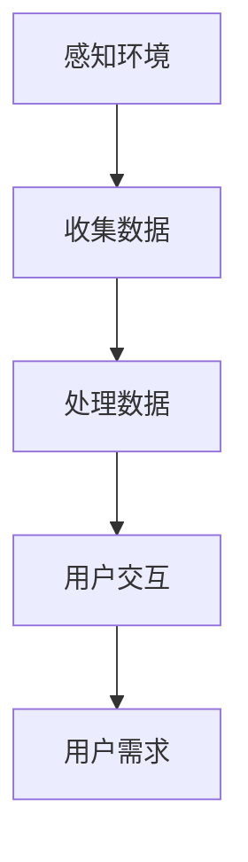

#### 2.1.1.2 决策与规划

决策与规划是AI Agent的核心功能，它根据感知到的数据和用户需求，生成相应的插花方案。具体包括：

1. **数据处理**：AI Agent对收集到的数据进行处理，包括去噪、归一化、特征提取等，为决策提供准确的数据基础。
2. **决策算法**：AI Agent利用机器学习、深度学习等算法，对处理后的数据进行分析和预测，生成插花方案。这些方案可能包括花材选择、插花布局、养护计划等。
3. **规划**：AI Agent根据决策结果，制定执行计划，确保插花艺术调整的有序进行。

##### 决策与规划的mermaid流程图：

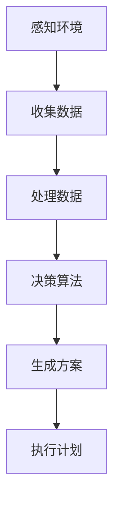

#### 2.1.1.3 学习与适应

学习与适应是AI Agent提高智能化程度的关键。具体包括：

1. **持续学习**：AI Agent通过不断学习用户行为和环境变化，优化决策模型和算法。
2. **适应性调整**：AI Agent根据学习和反馈结果，调整插花方案和执行策略，以适应不同环境和用户需求。
3. **自我优化**：AI Agent通过自我学习和反馈机制，不断优化自身性能，提高插花艺术指导的准确性。

##### 学习与适应的mermaid流程图：

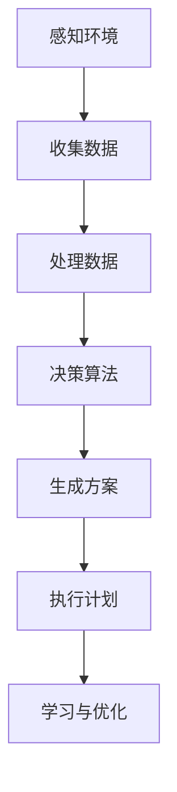

### 2.1.2 AI Agent在插花艺术中的功能

AI Agent在插花艺术中的应用功能强大，能够显著提升插花的艺术效果和养护效率。以下是AI Agent在插花艺术中主要功能的详细描述：

#### 2.1.2.1 花材识别与选择

花材识别与选择是AI Agent在插花艺术中的基础功能。通过图像识别技术和深度学习算法，AI Agent能够识别各种花材，并根据季节、用户喜好和花材特性，推荐最适合的花材组合。具体功能包括：

1. **花材识别**：AI Agent通过摄像头或传感器，实时捕捉花材图像，利用图像识别算法进行分类识别。
2. **花材选择**：AI Agent根据识别结果，结合用户偏好和环境数据，推荐最佳花材组合。

##### 花材识别与选择的mermaid流程图：

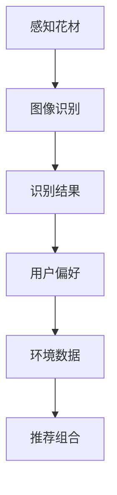

#### 2.1.2.2 插花艺术风格的设定

AI Agent能够根据用户需求和插花主题，设定不同的插花艺术风格。通过机器学习和风格迁移算法，AI Agent能够生成符合用户需求的插花方案。具体功能包括：

1. **风格识别**：AI Agent通过用户输入或历史数据，识别用户喜欢的插花风格。
2. **风格生成**：AI Agent利用风格迁移算法，根据用户需求生成相应的插花艺术风格。

##### 插花艺术风格的设定mermaid流程图：

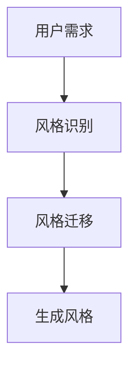

#### 2.1.2.3 实时调整与优化

AI Agent能够实时监测环境变化，并根据监测结果自动调整花材的位置、角度和水量，保持插花的最佳状态。具体功能包括：

1. **环境监测**：AI Agent通过传感器实时监测光线、温度、湿度等环境参数。
2. **实时调整**：AI Agent根据环境监测结果，自动调整花材的位置和角度。
3. **优化策略**：AI Agent通过学习用户行为和环境变化，优化调整策略，提高插花艺术效果。

##### 实时调整与优化的mermaid流程图：

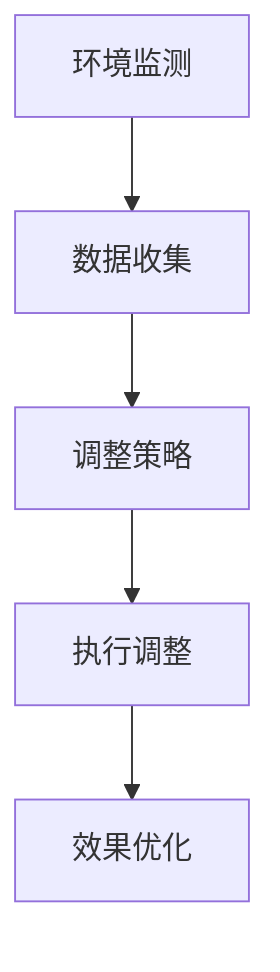

### 3.1.1 智能花瓶硬件模块概述

智能花瓶的硬件设计是其实用性和功能实现的基础，主要包括传感器模块、执行器模块和通信模块等核心组件。以下是这三个模块的概述：

#### 3.1.1.1 传感器模块

传感器模块是智能花瓶感知环境变化的关键，其功能主要包括：

1. **温度传感器**：用于监测花瓶内部及周围环境的温度，确保花材的生长环境适宜。
2. **湿度传感器**：用于监测花瓶内部及周围环境的湿度，对浇水量进行智能控制。
3. **光照传感器**：用于监测光线强度，自动调整花材的摆放角度，以模拟最适宜的光照条件。

##### 传感器模块的mermaid类图：

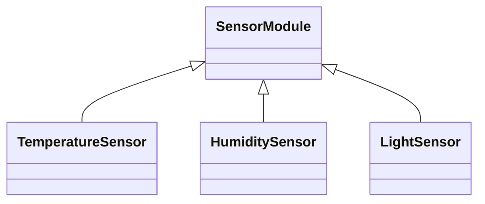

#### 3.1.1.2 执行器模块

执行器模块是智能花瓶实现自动插花和养护功能的核心，主要包括：

1. **电机**：用于调整花材的位置和角度，实现插花艺术的自动化调整。
2. **水泵**：用于控制水资源的供给，确保花材的适时浇水。
3. **灯光控制器**：用于调节花瓶内的灯光，模拟自然光照，促进花材生长。

##### 执行器模块的mermaid类图：

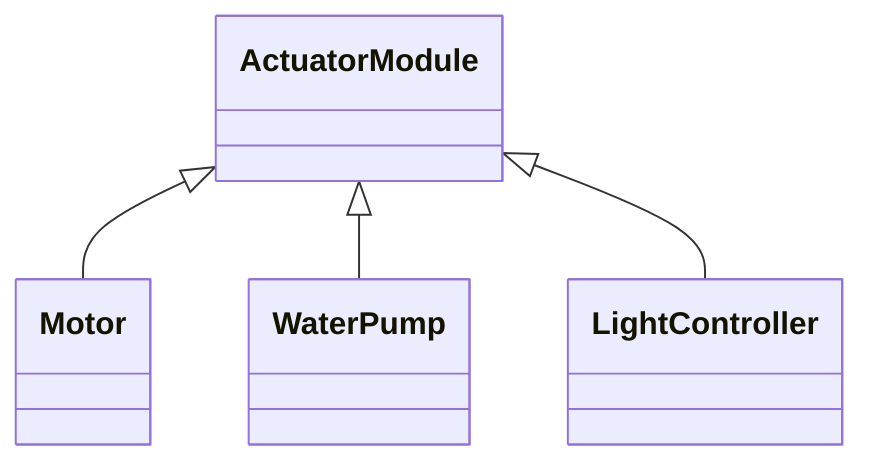

#### 3.1.1.3 通信模块

通信模块是智能花瓶实现与用户和云端交互的桥梁，主要包括：

1. **Wi-Fi模块**：用于实现智能花瓶与用户设备的无线连接，便于用户远程监控和控制。
2. **蓝牙模块**：用于实现短距离通信，与用户设备进行快速数据交换。
3. **云端接口**：用于将本地数据上传到云端，进行数据分析和模型训练，提高AI Agent的智能化水平。

##### 通信模块的mermaid类图：

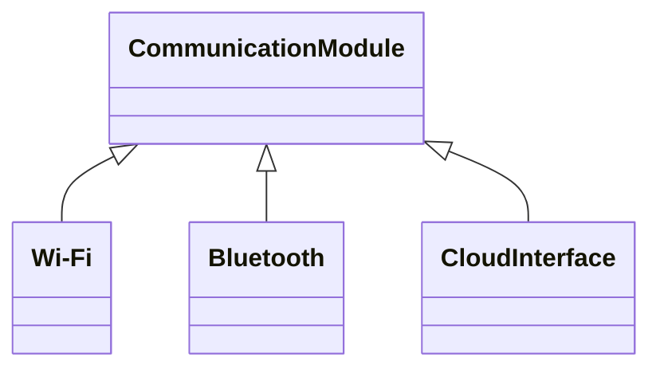

### 3.1.2 硬件设计原则与优化

智能花瓶的硬件设计需要遵循一系列原则和优化策略，以确保其功能实现的高效、稳定和可靠。以下是硬件设计的主要原则与优化策略：

#### 3.1.2.1 可靠性设计

可靠性设计是智能花瓶硬件设计的关键原则，其目标是在各种环境下确保设备正常运行。具体策略包括：

1. **冗余设计**：在关键组件（如传感器、电机等）中引入冗余设计，以提高系统的容错能力。
2. **环境适应性**：确保硬件组件能够适应各种环境条件，如温度、湿度、光照等。
3. **抗干扰设计**：通过屏蔽、滤波等技术减少外部干扰，提高硬件的稳定性。

##### 可靠性设计的mermaid流程图：

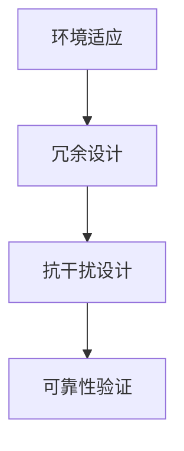

#### 3.1.2.2 能耗优化

能耗优化是智能花瓶硬件设计的重要方面，其目标是降低能耗，延长设备运行时间。具体策略包括：

1. **低功耗组件选择**：选择低功耗的传感器、执行器等组件，以降低整体能耗。
2. **休眠模式**：设计设备休眠模式，在传感器不活跃时关闭部分组件，降低能耗。
3. **智能调度**：根据传感器的数据采集频率和执行器的操作需求，智能调度硬件资源，优化能耗。

##### 能耗优化的mermaid流程图：

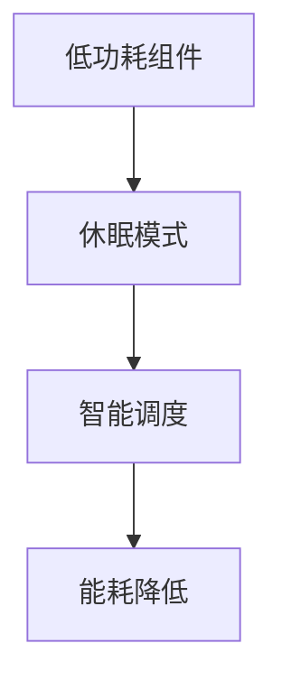

#### 3.1.2.3 交互设计

交互设计是智能花瓶硬件设计的重要环节，其目标是提供用户友好的操作体验。具体策略包括：

1. **直观界面**：设计简洁、直观的操作界面，便于用户快速上手。
2. **远程控制**：通过Wi-Fi或蓝牙模块，实现用户对智能花瓶的远程监控和控制。
3. **反馈机制**：通过视觉、声音等方式，为用户提供实时反馈，增强用户体验。

##### 交互设计的mermaid流程图：

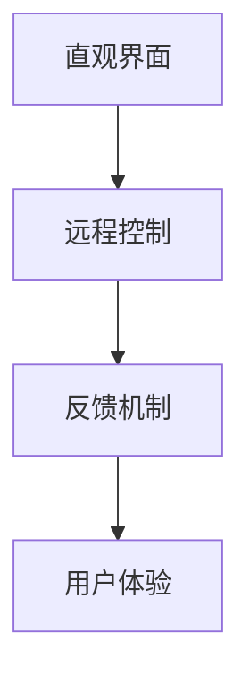

### 4.1.1 AI Agent软件框架

AI Agent的软件设计是智能花瓶实现智能插花艺术指导的核心，其软件框架通常包括感知模块、决策模块和执行模块三个主要部分。以下是这三个模块的概述：

#### 4.1.1.1 感知模块设计

感知模块设计负责从传感器获取环境数据，并进行初步处理，为后续的决策提供基础。具体包括：

1. **数据采集**：通过传感器模块实时采集温度、湿度、光照等环境数据。
2. **数据处理**：对采集到的数据进行预处理，包括去噪、归一化、特征提取等，以便后续的决策使用。

##### 感知模块的mermaid流程图：

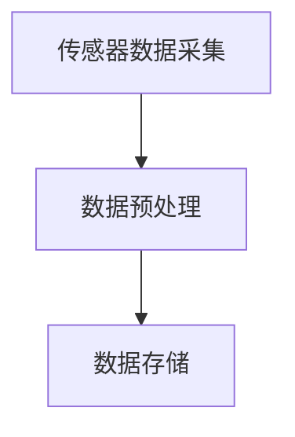

#### 4.1.1.2 决策模块设计

决策模块设计是AI Agent的核心部分，负责根据感知模块提供的数据，利用算法生成插花艺术调整方案。具体包括：

1. **数据输入**：接收感知模块处理后的数据。
2. **算法选择**：根据数据类型和插花需求，选择合适的机器学习或深度学习算法进行训练和预测。
3. **决策生成**：根据算法预测结果，生成插花调整方案，包括花材位置、角度和水量等。

##### 决策模块的mermaid流程图：

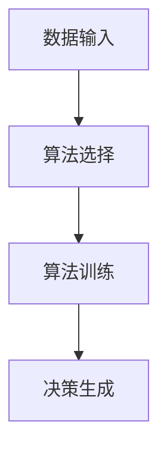

#### 4.1.1.3 执行模块设计

执行模块设计负责将决策模块生成的插花调整方案转化为实际操作，通过执行器实现花材的自动调整。具体包括：

1. **决策接收**：接收决策模块生成的插花方案。
2. **执行控制**：通过电机、水泵等执行器，执行插花调整操作。
3. **状态反馈**：将执行结果反馈给决策模块，进行进一步优化和调整。

##### 执行模块的mermaid流程图：

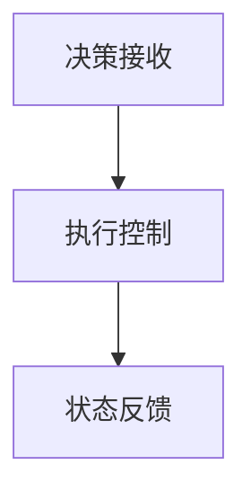

### 4.1.2 软件开发工具与平台

在开发AI Agent软件时，选择合适的开发工具和平台至关重要，以下是几种常见的开发工具和平台及其适用场景：

#### 4.1.2.1 编程语言选择

**Python**：Python因其简洁易懂、丰富的库和强大的社区支持，成为开发AI Agent的首选语言。Python特别适用于机器学习和深度学习项目的快速开发和原型设计。

**C++**：C++以其高性能和强大的功能，适用于需要高性能计算和实时响应的AI Agent开发，如嵌入式系统和实时操作系统。

**JavaScript**：JavaScript适用于前端开发和与用户交互的部分，如Web界面和移动应用。

#### 4.1.2.2 开发环境搭建

**Jupyter Notebook**：Jupyter Notebook是一个交互式的开发环境，适用于数据分析和原型测试，特别适合机器学习和深度学习项目的开发。

**Eclipse**：Eclipse是一款功能强大的集成开发环境（IDE），适用于C++和Java开发，提供代码编辑、调试和构建工具。

**PyCharm**：PyCharm是一款专业的Python IDE，提供代码自动完成、调试、版本控制等功能，是Python开发者的首选工具。

#### 4.1.2.3 版本控制与协同开发

**Git**：Git是一款分布式版本控制系统，适用于团队协作和代码管理。通过Git，开发团

