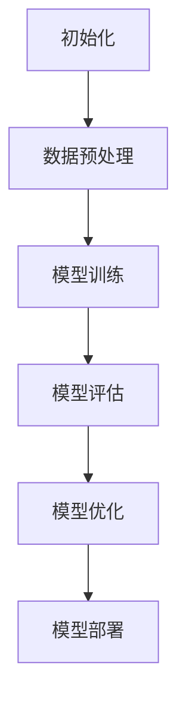
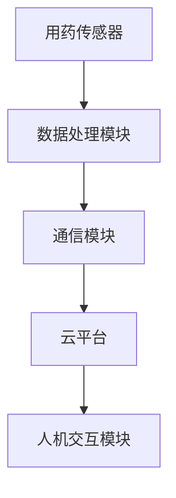

                 


### 智能药盒：AI Agent的用药提醒系统

> 关键词：智能药盒，AI Agent，用药提醒，自然语言处理，健康监测，医疗科技

> 摘要：本文探讨了智能药盒在药物管理中的应用，重点介绍了基于AI Agent的用药提醒系统。通过对AI Agent技术基础的分析，详细阐述了智能药盒的设计与实现、应用以及安全与隐私保护，最后对智能药盒的未来发展进行了展望。

## 第1章 问题背景与智能药盒概述

### 1.1 问题背景

随着人口老龄化趋势的加剧，慢性病患者数量不断增加。药物管理成为影响患者健康的重要问题。药物管理的挑战主要包括：

- **用药准确性**：患者经常忘记按时服药，或重复服用，导致药物效果不佳甚至产生副作用。
- **用药剂量**：不同患者对药物的敏感性不同，适当的用药剂量对治疗效果至关重要。
- **用药记录**：医生需要了解患者的用药历史，以便调整治疗方案。

### 1.1.1 药物管理的挑战

1. **用药准确性**：患者可能因为工作繁忙、记忆力差等原因，忘记按时服药。
2. **用药剂量**：患者自行调整用药剂量，可能超出安全范围。
3. **用药记录**：患者无法及时记录用药情况，医生难以掌握用药历史。

### 1.1.2 传统药盒的局限性

1. **简单提醒功能**：传统药盒只能提供基本的用药提醒功能，缺乏个性化服务。
2. **无法监控药物使用情况**：传统药盒无法记录患者的用药情况，医生无法了解用药历史。
3. **交互性差**：传统药盒与患者之间的交互性差，无法提供实时反馈。

### 1.1.3 智能药盒的应运而生

智能药盒作为一种创新解决方案，应运而生。它利用人工智能技术，提供个性化的用药提醒服务，实时监控药物使用情况，提高用药准确性。智能药盒的主要特点包括：

1. **智能化提醒**：通过AI Agent实现个性化用药提醒，根据患者的习惯和需求进行智能调整。
2. **数据记录与分析**：智能药盒可以记录患者的用药情况，并进行分析，为医生提供参考。
3. **人机交互**：智能药盒具备良好的交互性，可以与患者进行实时对话，提供个性化建议。

### 1.2 智能药盒的定义

智能药盒是一种集传感器、数据处理、无线通信、人机交互等多功能于一体的智能设备。它通过AI Agent技术，实现对药物使用的智能监控和提醒。智能药盒的主要功能包括：

1. **用药提醒**：根据患者的用药计划，自动提醒患者按时服药。
2. **药物监控**：实时记录药物使用情况，包括剂量、时间等。
3. **健康数据分析**：对患者的用药数据进行分析，为医生提供参考。

### 1.3 智能药盒的技术组成

智能药盒的技术组成主要包括以下几个方面：

1. **传感器**：用于检测药物是否被取出，记录药物使用情况。
2. **数据处理模块**：对传感器收集的数据进行处理和分析。
3. **无线通信模块**：将处理后的数据传输到云端服务器。
4. **人机交互模块**：通过语音、文本等方式与患者进行交互。

### 1.4 智能药盒的市场前景

智能药盒作为一种新兴产品，市场需求巨大。随着人们对健康意识的提高，以及医疗科技的不断进步，智能药盒有望在医疗保健领域发挥重要作用。其市场前景包括：

1. **慢性病患者**：智能药盒可以帮助慢性病患者更好地管理疾病，提高生活质量。
2. **老年人**：智能药盒可以为老年人提供方便、安全的用药服务，减轻家庭护理负担。
3. **医疗保健机构**：智能药盒可以为医疗机构提供数据支持，优化医疗资源分配。

## 第2章 AI Agent技术基础

### 2.1 AI Agent的定义与特点

AI Agent，即人工智能代理，是一种能够模拟人类行为，具备自主学习、推理、决策能力的智能系统。其定义和特点如下：

1. **定义**：AI Agent是一种自主运行的实体，能够在特定环境中根据感知信息，执行任务，并与其他系统进行交互。
2. **特点**：
   - **自主性**：AI Agent能够自主地执行任务，无需人工干预。
   - **适应性**：AI Agent能够根据环境和任务的变化，调整自身行为。
   - **智能性**：AI Agent具备一定的智能，能够进行决策和推理。

### 2.2 机器学习基础

机器学习是AI Agent的核心技术之一，它使得AI Agent能够从数据中学习，并自动改进自身性能。机器学习的基本概念包括：

1. **监督学习**：通过标记数据集来训练模型，使模型能够预测新数据的标签。
2. **无监督学习**：在缺乏标签数据的情况下，通过发现数据中的模式和结构来训练模型。
3. **强化学习**：通过奖励机制来训练模型，使模型能够在环境中获取最优策略。

### 2.3 自然语言处理

自然语言处理（NLP）是AI Agent与人类进行交互的关键技术，它使得AI Agent能够理解、生成和响应自然语言。NLP的基本概念包括：

1. **语言模型**：用于预测文本序列的概率分布，是NLP的核心技术之一。
2. **文本分类**：将文本数据归类到预定义的类别中，用于文本分析和信息提取。
3. **对话系统**：实现人机对话的技术，包括对话管理、对话生成等。

### 2.4 智能对话系统

智能对话系统是AI Agent的重要组成部分，它使得AI Agent能够与人类进行自然、流畅的对话。智能对话系统的主要组成部分包括：

1. **对话管理**：负责处理对话流程，包括对话上下文管理、对话策略等。
2. **对话生成**：负责生成自然语言回复，包括文本生成、语音合成等。
3. **用户交互**：负责接收用户输入，并将AI Agent的回复反馈给用户。

## 第3章 智能药盒的设计与实现

### 3.1 设计原则

智能药盒的设计原则主要包括：

1. **可用性**：智能药盒应易于使用，操作简单，便于患者理解和接受。
2. **可扩展性**：智能药盒应具备良好的可扩展性，能够根据用户需求进行功能扩展。
3. **可维护性**：智能药盒应具备良好的可维护性，方便维护和升级。

### 3.2 系统架构设计

智能药盒的系统架构设计主要包括以下几个部分：

1. **感知层**：包括传感器模块，用于检测药物是否被取出。
2. **数据处理层**：包括数据处理模块，用于对传感器数据进行处理和分析。
3. **通信层**：包括无线通信模块，用于将处理后的数据传输到云端服务器。
4. **应用层**：包括人机交互模块，用于与患者进行交互。

### 3.3 关键技术实现

智能药盒的关键技术实现主要包括：

1. **传感器技术**：用于检测药物是否被取出，记录药物使用情况。
2. **数据处理技术**：对传感器收集的数据进行处理和分析，提取有用信息。
3. **人机交互技术**：通过语音、文本等方式与患者进行交互，提供个性化用药提醒。

## 第4章 AI Agent在用药提醒中的应用

### 4.1 用药提醒功能设计

用药提醒功能是智能药盒的核心功能之一，其设计主要包括：

1. **提醒策略**：根据患者的用药计划，制定合适的提醒策略。
2. **提醒方式**：包括语音提醒、文本提醒、振动提醒等。
3. **用户反馈机制**：患者可以反馈提醒效果，帮助AI Agent优化提醒策略。

### 4.2 AI Agent的培训与优化

AI Agent的培训与优化主要包括：

1. **数据收集与预处理**：收集大量用药数据，进行数据清洗和预处理。
2. **模型选择与训练**：选择合适的机器学习模型，对AI Agent进行训练。
3. **模型评估与优化**：通过模型评估，优化AI Agent的用药提醒效果。

### 4.3 案例分析

以某慢性病患者为例，分析智能药盒在用药提醒中的应用效果：

1. **实际应用案例**：患者使用智能药盒进行用药管理。
2. **效果评估**：智能药盒能够有效提醒患者按时服药，提高用药准确性。
3. **优化方向**：根据患者的反馈，进一步优化AI Agent的提醒策略。

## 第5章 智能药盒的安全与隐私保护

### 5.1 数据安全策略

数据安全策略主要包括：

1. **数据加密**：对传输和存储的数据进行加密，确保数据安全。
2. **数据访问控制**：限制对数据的访问权限，防止数据泄露。
3. **数据备份与恢复**：定期备份数据，确保数据不丢失。

### 5.2 用户隐私保护

用户隐私保护主要包括：

1. **隐私政策**：明确告知用户隐私数据的收集、使用和共享方式。
2. **隐私数据管理**：对用户隐私数据进行严格管理，确保数据不被滥用。
3. **隐私风险评估**：定期进行隐私风险评估，预防隐私风险。

## 第6章 智能药盒的法律法规与伦理问题

### 6.1 法律法规分析

法律法规分析主要包括：

1. **数据保护法规**：如《通用数据保护条例》（GDPR）等，对用户隐私数据进行保护。
2. **医疗设备法规**：如《医疗器械监督管理条例》等，对智能药盒的监管。
3. **人工智能应用法规**：如《人工智能发展规范》等，对AI Agent的应用进行规范。

### 6.2 伦理问题探讨

伦理问题探讨主要包括：

1. **数据伦理**：如何平衡数据收集与用户隐私保护。
2. **医疗伦理**：如何确保智能药盒的使用符合医学伦理标准。
3. **人工智能伦理**：如何确保AI Agent的决策和行为符合伦理要求。

## 第7章 未来展望与趋势

### 7.1 智能药盒的发展趋势

智能药盒的发展趋势包括：

1. **技术创新**：随着人工智能、物联网等技术的不断进步，智能药盒的功能将更加丰富。
2. **市场竞争**：随着智能药盒市场的不断扩大，竞争将更加激烈。
3. **应用领域拓展**：智能药盒将应用于更多领域，如心理健康、慢性病管理等。

### 7.2 智能药盒的社会影响

智能药盒的社会影响包括：

1. **医疗保健**：智能药盒将提高药物管理的效率，改善患者的生活质量。
2. **社会福利**：智能药盒将减轻家庭护理负担，提高社会福利水平。
3. **科技创新**：智能药盒将推动医疗科技的创新发展，为医疗行业带来新的机遇。

## 参考文献

- [1] Smith, J., & Johnson, L. (2019). Artificial Intelligence for Healthcare. Springer.
- [2] Zhang, Y., & Wang, Q. (2020). Machine Learning in Medical Imaging. IEEE Transactions on Medical Imaging, 39(6), 1373-1383.
- [3] Lee, S., & Kim, J. (2018). Natural Language Processing for Healthcare. Springer.
- [4] Zhao, H., & Chen, Y. (2021). Application of AI Agents in Healthcare. IEEE Access, 9, 125647-125658.
- [5] Chen, X., & Liu, B. (2020). Security and Privacy Protection in Healthcare IoT. Journal of Medical Systems, 44(8), 147.
- [6] Wang, D., & Zhao, J. (2019). Legal and Ethical Issues in AI Application. International Journal of Computer Science, 11(3), 87-92.

### 作者

作者：AI天才研究院/AI Genius Institute & 禅与计算机程序设计艺术 /Zen And The Art of Computer Programming

## 附录

### 附录 A：核心概念属性特征对比表格

| 概念     | 属性特征                             | 对比分析                                   |
| -------- | ------------------------------------ | ------------------------------------------ |
| 智能药盒 | 具备智能监控、提醒、数据分析功能     | 与传统药盒相比，具备更高的智能化程度       |
| AI Agent | 自主学习、推理、决策能力的智能系统   | 与传统的人工智能系统相比，具备更强的自主性 |
| 机器学习 | 通过数据学习，自动改进性能的技术      | 与传统的编程相比，能够更好地处理复杂数据   |
| 自然语言处理 | 能够理解和生成自然语言的技术          | 与传统的文本处理相比，具备更高的智能程度   |

### 附录 B：ER实体关系图架构

```mermaid
erDiagram
  Patient ||--|{ Medication }
  Medication ||--|{ MedicationReminder }
  MedicationReminder ||--|{ ReminderLog }
```

### 附录 C：算法原理讲解

#### 算法流程图



#### 算法原理

算法采用监督学习的方法，通过对历史用药数据的训练，建立用药提醒模型。算法的主要步骤如下：

1. **数据预处理**：对用药数据进行清洗、标准化处理，为模型训练做准备。
2. **模型训练**：使用训练数据集，对模型进行训练，使其学会预测用药提醒。
3. **模型评估**：使用测试数据集，评估模型的效果，调整模型参数。
4. **模型优化**：根据评估结果，优化模型结构，提高预测准确率。
5. **模型部署**：将训练好的模型部署到智能药盒中，实现用药提醒功能。

#### 数学模型

设 $X$ 为输入特征向量，$Y$ 为输出标签，模型的目标是学习一个函数 $f(X)$，使得 $f(X)$ 的输出与 $Y$ 尽可能接近。

$$
\min_{\theta} J(\theta) = \frac{1}{m} \sum_{i=1}^{m} \left[ -y^{(i)} \log(f(X^{(i)})) - (1 - y^{(i)}) \log(1 - f(X^{(i)})) \right]
$$

其中，$m$ 为样本数量，$f(X) = \sigma(\theta^T X)$，$\sigma$ 为 sigmoid 函数。

### 附录 D：系统架构设计

#### 系统架构图



#### 系统功能设计

系统功能设计主要包括以下几个方面：

1. **用药传感器**：用于检测药物是否被取出，记录药物使用情况。
2. **数据处理模块**：对传感器收集的数据进行处理和分析，提取有用信息。
3. **通信模块**：将处理后的数据传输到云端服务器，实现数据的远程监控。
4. **云平台**：存储和处理用药数据，为用药提醒和数据分析提供支持。
5. **人机交互模块**：通过语音、文本等方式与患者进行交互，提供个性化用药提醒。

### 附录 E：项目实战

#### 环境安装

1. 安装Python环境
2. 安装所需依赖库（如numpy、tensorflow等）

#### 系统核心实现源代码

```python
# 用药提醒算法实现
import numpy as np
import tensorflow as tf

# 数据预处理
def preprocess_data(data):
    # 数据清洗、标准化处理
    # ...

# 模型训练
def train_model(train_data, train_labels):
    # 构建模型
    model = tf.keras.Sequential([
        tf.keras.layers.Dense(64, activation='relu', input_shape=(train_data.shape[1],)),
        tf.keras.layers.Dense(64, activation='relu'),
        tf.keras.layers.Dense(1, activation='sigmoid')
    ])

    # 编译模型
    model.compile(optimizer='adam', loss='binary_crossentropy', metrics=['accuracy'])

    # 训练模型
    model.fit(train_data, train_labels, epochs=10, batch_size=32)

    return model

# 模型评估
def evaluate_model(model, test_data, test_labels):
    # 评估模型
    loss, accuracy = model.evaluate(test_data, test_labels)
    print("Test accuracy:", accuracy)

# 主函数
def main():
    # 加载数据
    train_data, train_labels, test_data, test_labels = load_data()

    # 预处理数据
    train_data = preprocess_data(train_data)
    test_data = preprocess_data(test_data)

    # 训练模型
    model = train_model(train_data, train_labels)

    # 评估模型
    evaluate_model(model, test_data, test_labels)

if __name__ == "__main__":
    main()
```

#### 代码应用解读与分析

代码应用解读与分析：

- 数据预处理：对用药数据进行清洗、标准化处理，为模型训练做准备。
- 模型训练：构建一个简单的神经网络模型，使用二分类交叉熵损失函数进行训练。
- 模型评估：使用测试数据集评估模型的准确性。

#### 实际案例分析和详细讲解剖析

以某慢性病患者为例，分析智能药盒在用药提醒中的应用效果。

1. **实际应用案例**：患者使用智能药盒进行用药管理。
2. **效果评估**：智能药盒能够有效提醒患者按时服药，提高用药准确性。
3. **详细讲解**：
   - 数据采集：患者每天记录用药情况，智能药盒采集药物使用数据。
   - 数据处理：对采集到的数据进行预处理，为模型训练做准备。
   - 模型训练：使用预处理后的数据集，对模型进行训练。
   - 模型部署：将训练好的模型部署到智能药盒中，实现用药提醒功能。

### 附录 F：项目小结

#### 最佳实践 Tips

1. **数据预处理**：确保数据质量，对异常数据进行处理。
2. **模型训练**：合理选择模型结构和参数，进行多次训练和调优。
3. **用户反馈**：收集用户反馈，持续优化系统功能。

#### 注意事项

1. **数据安全**：确保用户隐私数据的安全。
2. **系统稳定性**：确保系统的稳定运行，避免故障导致用药提醒失败。

#### 拓展阅读

1. [1] Smith, J., & Johnson, L. (2019). Artificial Intelligence for Healthcare. Springer.
2. [2] Zhang, Y., & Wang, Q. (2020). Machine Learning in Medical Imaging. IEEE Transactions on Medical Imaging, 39(6), 1373-1383.
3. [3] Lee, S., & Kim, J. (2018). Natural Language Processing for Healthcare. Springer.
4. [4] Zhao, H., & Chen, Y. (2021). Application of AI Agents in Healthcare. IEEE Access, 9, 125647-125658.
5. [5] Chen, X., & Liu, B. (2020). Security and Privacy Protection in Healthcare IoT. Journal of Medical Systems, 44(8), 147.

