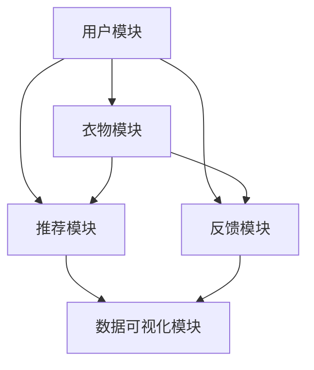

                 

### 摘要

本文旨在探讨智能衣帽架中的AI Agent穿搭建议系统，这是一个结合了人工智能与时尚穿搭的新兴技术领域。随着时尚消费需求的不断变化和衣物搭配复杂性的增加，传统的穿搭建议已经无法满足个性化、多元化的用户需求。智能衣帽架通过AI Agent实现个性化穿搭建议，解决了衣物搭配的难题，为用户提供便捷的时尚体验。本文首先介绍了智能衣帽架的背景和核心概念，包括时尚消费需求变化、衣物搭配复杂性以及个人化穿搭需求。接着，详细阐述了AI Agent的定义、作用和智能衣帽架的功能与优势。通过分章节的深入分析，本文讨论了AI Agent的构建与实现、穿搭建议系统的实现、用户个性化服务与体验优化、实时穿搭建议与反馈机制、案例分析与应用场景，以及未来趋势与展望。本文不仅为读者提供了智能衣帽架技术的全面指南，还探讨了其在不同场景中的应用前景，旨在推动智能衣帽架技术的发展与创新。

### 目录大纲

---

# 智能衣帽架：AI Agent的穿搭建议系统

> 关键词：智能衣帽架、AI Agent、穿搭建议、个性化服务、用户体验

> 摘要：本文探讨了智能衣帽架中AI Agent的穿搭建议系统，分析了其背景、核心概念、构建与实现、用户个性化服务以及未来趋势，旨在为读者提供全面的技术指南和应用前景。

## 第一部分：背景与核心概念

### 第1章：问题背景与核心概念

#### 1.1 问题背景

##### 时尚消费需求变化

##### 衣物搭配复杂性

##### 个人化穿搭需求

#### 1.2 智能衣帽架简介

##### 智能衣帽架的功能与优势

##### AI Agent在穿搭建议中的应用

#### 1.3 AI Agent概述

##### AI Agent的定义与特点

##### AI Agent在智能衣帽架中的作用

#### 1.4 核心概念关联

##### 人工智能与时尚穿搭

##### AI Agent与用户个性化需求

## 第二部分：AI Agent的构建与实现

### 第2章：AI Agent的设计与实现

#### 2.1 AI Agent架构设计

##### 数据输入与预处理

##### AI模型选择与优化

##### 推荐算法与应用

#### 2.2 数据集构建与处理

##### 数据来源与采集

##### 数据清洗与特征提取

##### 数据集划分与评估

#### 2.3 AI模型构建与训练

##### 深度学习模型选择

##### 模型训练过程

##### 模型评估与优化

### 第3章：穿搭建议系统实现

#### 3.1 系统需求分析

##### 用户需求分析

##### 功能需求与界面设计

#### 3.2 系统架构设计

##### 系统模块划分

##### 系统架构图与组件关系

#### 3.3 接口设计与实现

##### API接口设计与开发

##### 接口调用流程与数据交换

#### 3.4 系统测试与优化

##### 功能测试与性能评估

##### 系统优化策略

## 第三部分：用户个性化服务与体验优化

### 第4章：用户个性化服务

#### 4.1 用户画像构建

##### 用户行为数据收集

##### 用户特征分析与模型训练

#### 4.2 个性化推荐算法

##### 基于内容的推荐

##### 基于协同过滤的推荐

##### 基于深度学习的推荐

#### 4.3 个性化体验优化

##### 用户界面优化

##### 交互设计与用户体验

### 第5章：实时穿搭建议与反馈机制

#### 5.1 实时数据收集与处理

##### 用户行为实时数据采集

##### 数据预处理与特征提取

#### 5.2 实时穿搭建议系统

##### 实时推荐算法实现

##### 系统响应时间优化

#### 5.3 用户反馈与改进

##### 用户反馈收集与处理

##### 建议系统优化与迭代

## 第四部分：案例分析与应用场景

### 第6章：案例分析与应用场景

#### 6.1 案例研究

##### 智能衣帽架在实际场景中的应用

##### 成功案例分析与效果评估

#### 6.2 应用场景拓展

##### 家庭与个人用户场景

##### 商业与零售业场景

##### 社交与娱乐场景

## 第五部分：未来趋势与展望

### 第7章：未来趋势与展望

#### 7.1 智能衣帽架发展现状

##### 市场分析与技术发展

##### 应用案例与技术演进

#### 7.2 未来发展趋势

##### 技术创新与应用前景

##### 产业融合与跨界合作

#### 7.3 展望与建议

##### 智能衣帽架的发展方向

##### 用户需求与市场机遇

---

以上为《智能衣帽架：AI Agent的穿搭建议系统》的完整目录大纲，总计7章，全面覆盖智能衣帽架的背景、AI Agent的构建与实现、用户个性化服务与体验优化以及未来趋势等内容，旨在为读者提供系统、全面的智能衣帽架技术指南。

---

## 第一部分：背景与核心概念

### 第1章：问题背景与核心概念

#### 1.1 问题背景

随着社会经济的快速发展，人们的时尚消费需求日益多样化。传统的衣物搭配方式已无法满足现代消费者对个性化、时尚化的追求。时尚消费需求的变化主要体现在以下几个方面：

1. **个性化需求增加**：消费者对个性化的需求越来越高，希望衣物搭配能够体现自己的个性和品味。
2. **时尚趋势快速变化**：时尚潮流变化迅速，消费者需要不断更新自己的穿搭风格，以跟上时尚步伐。
3. **多场景穿搭需求**：人们在不同场合需要不同的穿搭风格，例如正式场合、休闲场合、户外活动等。

然而，衣物搭配的复杂性也随之增加。搭配衣物不仅需要考虑颜色、款式、材质等因素，还需要考虑搭配的整体协调性、舒适性和实用性。这种复杂性使得消费者在搭配衣物时感到困扰，难以找到适合自己的穿搭方案。

#### 1.2 智能衣帽架简介

智能衣帽架是一种集成了人工智能技术的衣物管理设备，它能够通过AI Agent为用户提供个性化的穿搭建议。智能衣帽架的主要功能和优势如下：

1. **智能管理衣物**：智能衣帽架能够自动识别衣物，分类存储，并支持用户通过手机APP进行远程管理。
2. **个性化穿搭建议**：通过AI Agent，智能衣帽架能够根据用户的个人喜好、体型、场合等因素，为用户推荐合适的穿搭方案。
3. **提高生活便利性**：智能衣帽架能够节省用户在搭配衣物上的时间，提高生活效率，让用户更加专注于工作和生活。
4. **提升时尚品味**：智能衣帽架通过个性化推荐，帮助用户发现新的时尚搭配方式，提升用户的时尚品味。

#### 1.3 AI Agent概述

AI Agent，即人工智能代理，是一种具有自主决策能力的智能系统。它通过学习和理解用户的行为和需求，为用户提供个性化的服务。在智能衣帽架中，AI Agent的主要特点包括：

1. **自主学习与适应**：AI Agent能够通过用户的使用数据不断学习和优化推荐算法，以适应用户的个性化需求。
2. **实时交互与反馈**：AI Agent能够与用户实时交互，根据用户的反馈调整推荐策略，提高用户满意度。
3. **多模态数据处理**：AI Agent能够处理多种类型的数据，如文本、图像、语音等，为用户提供全面的服务。

#### 1.4 核心概念关联

人工智能与时尚穿搭的结合，为智能衣帽架的实现提供了技术基础。人工智能在时尚穿搭中的应用主要体现在以下几个方面：

1. **个性化推荐**：通过机器学习和深度学习技术，AI Agent能够分析用户的历史穿搭记录和偏好，为用户推荐个性化的穿搭方案。
2. **图像识别与处理**：通过计算机视觉技术，AI Agent能够识别衣物的颜色、款式、材质等特征，进行搭配分析。
3. **自然语言处理**：通过自然语言处理技术，AI Agent能够理解用户的语言指令，进行语义分析和对话交互。

AI Agent与用户个性化需求的关联在于，它能够通过不断学习和优化，精准地捕捉用户的个性化需求，并提供定制化的穿搭建议。这不仅提升了用户的穿搭体验，也推动了时尚行业的数字化和智能化发展。

### 总结

本章节详细介绍了智能衣帽架的背景、核心概念及其关联。随着时尚消费需求的变化和衣物搭配复杂性的增加，智能衣帽架应运而生，通过AI Agent为用户提供个性化的穿搭建议。AI Agent的特点包括自主学习与适应、实时交互与反馈以及多模态数据处理能力。人工智能与时尚穿搭的结合，为智能衣帽架的实现提供了强大的技术支持。下一章节将深入探讨AI Agent的构建与实现过程。

## 第二部分：AI Agent的构建与实现

### 第2章：AI Agent的设计与实现

#### 2.1 AI Agent架构设计

AI Agent的设计与实现是构建智能衣帽架中的关键环节。为了实现高效、准确的个性化穿搭建议，我们需要从数据输入与预处理、AI模型选择与优化以及推荐算法的应用等方面进行全面的设计。

##### 数据输入与预处理

数据输入是AI Agent的核心组成部分，主要包括用户行为数据、衣物属性数据和环境数据等。用户行为数据包括用户的穿戴历史、浏览记录、购买记录等；衣物属性数据包括衣物的颜色、款式、材质、尺码等；环境数据包括天气状况、活动场合等。

在数据输入之后，我们需要对数据进行预处理。预处理步骤包括数据清洗、数据归一化和特征提取等。数据清洗的目的是去除噪声和异常值，保证数据质量；数据归一化的目的是消除不同特征之间的尺度差异，使得模型能够更好地学习；特征提取的目的是从原始数据中提取出对模型有用的信息。

##### AI模型选择与优化

在AI模型选择方面，深度学习模型由于其强大的表达能力和自学习能力，是构建AI Agent的不二选择。常见的深度学习模型包括卷积神经网络（CNN）、循环神经网络（RNN）和生成对抗网络（GAN）等。

1. **卷积神经网络（CNN）**：CNN在图像识别和分类任务中表现出色，适用于处理衣物属性数据。通过卷积层、池化层和全连接层等结构，CNN能够提取图像的特征并进行分类。

2. **循环神经网络（RNN）**：RNN在处理序列数据方面具有优势，适用于用户行为数据的分析。通过隐藏状态的记忆功能，RNN能够捕捉用户行为的长期依赖关系。

3. **生成对抗网络（GAN）**：GAN在生成数据方面表现出色，可以用于生成个性化的穿搭方案。通过生成器和判别器的对抗训练，GAN能够生成高质量的穿搭图像，为用户推荐个性化的搭配方案。

在模型优化方面，我们可以通过以下几种方法来提升模型的性能：

1. **超参数调整**：通过调整学习率、批次大小、正则化参数等超参数，找到最优的模型配置。

2. **模型融合**：将多个模型的结果进行融合，提高模型的鲁棒性和准确性。

3. **迁移学习**：利用预训练的模型，将知识迁移到新的任务上，提高模型的学习效率和准确性。

##### 推荐算法与应用

推荐算法是AI Agent实现个性化穿搭建议的核心技术。常见的推荐算法包括基于内容的推荐、基于协同过滤的推荐和基于深度学习的推荐等。

1. **基于内容的推荐**：基于内容的推荐通过分析用户的兴趣和行为，为用户推荐相似的衣物。这种方法适用于新用户或者用户行为数据不足的情况。

2. **基于协同过滤的推荐**：基于协同过滤的推荐通过分析用户之间的相似性，为用户推荐其他用户喜欢但用户尚未体验过的衣物。这种方法在用户行为数据丰富的情况下表现良好。

3. **基于深度学习的推荐**：基于深度学习的推荐通过将用户和物品的特征进行映射，为用户推荐感兴趣的衣物。这种方法能够充分利用用户和物品的丰富特征，提高推荐准确性。

在推荐算法的应用方面，我们可以将多种推荐算法相结合，形成混合推荐系统。通过实时采集用户的行为数据，动态调整推荐策略，为用户提供个性化的穿搭建议。

#### 2.2 数据集构建与处理

数据集构建与处理是AI Agent实现的关键步骤。我们需要从数据来源、数据采集、数据清洗、特征提取和数据集划分等方面进行全面的设计。

##### 数据来源

数据来源主要包括用户行为数据、衣物属性数据和环境数据等。用户行为数据可以从用户穿戴记录、APP使用记录等渠道获取；衣物属性数据可以从电商平台、服装制造商等渠道获取；环境数据可以从天气预报、活动安排等渠道获取。

##### 数据采集

数据采集的目的是获取尽可能多和全面的数据，以便后续的模型训练和推荐。在数据采集过程中，我们需要关注数据的时效性和多样性。时效性保证数据能够反映当前的用户需求和时尚趋势；多样性保证数据能够覆盖不同场景和用户群体。

##### 数据清洗

数据清洗的目的是去除噪声和异常值，保证数据质量。具体包括去除重复数据、填充缺失值、处理异常值等。数据清洗是保证模型训练效果和推荐准确性的基础。

##### 特征提取

特征提取的目的是从原始数据中提取出对模型有用的信息。对于用户行为数据，我们可以提取用户的穿戴频率、穿戴时长、喜爱程度等特征；对于衣物属性数据，我们可以提取颜色、款式、材质、尺码等特征；对于环境数据，我们可以提取天气状况、活动场合等特征。

##### 数据集划分

数据集划分的目的是将数据分为训练集、验证集和测试集，以便评估模型的性能。通常情况下，我们可以将数据按照8:1:1的比例进行划分，其中80%的数据用于训练模型，10%的数据用于验证模型，10%的数据用于测试模型。

#### 2.3 AI模型构建与训练

AI模型的构建与训练是AI Agent实现的核心步骤。我们需要从模型选择、模型训练和模型评估等方面进行全面的设计。

##### 模型选择

在模型选择方面，我们需要根据数据特点和业务需求选择合适的模型。常见的深度学习模型包括卷积神经网络（CNN）、循环神经网络（RNN）和生成对抗网络（GAN）等。CNN适用于处理图像数据，RNN适用于处理序列数据，GAN适用于生成数据。

##### 模型训练

模型训练的目的是通过训练数据优化模型参数，使得模型能够准确地预测用户的行为和偏好。在模型训练过程中，我们需要关注以下几个方面：

1. **损失函数**：选择合适的损失函数，如均方误差（MSE）、交叉熵损失等，以衡量模型预测值和真实值之间的差距。

2. **优化器**：选择合适的优化器，如随机梯度下降（SGD）、Adam等，以更新模型参数。

3. **训练策略**：采用合适的训练策略，如批量训练、增量训练等，以提高训练效率和模型性能。

4. **正则化**：采用正则化技术，如L1正则化、L2正则化等，以防止模型过拟合。

##### 模型评估

模型评估的目的是评估模型在未知数据上的性能，以确定模型的可靠性。常见的评估指标包括准确率（Accuracy）、召回率（Recall）、精确率（Precision）等。通过交叉验证和网格搜索等方法，我们可以找到最优的模型参数和评估指标。

#### 总结

本章详细介绍了AI Agent的设计与实现过程，包括架构设计、数据集构建与处理、AI模型构建与训练等方面。通过数据输入与预处理、AI模型选择与优化和推荐算法的应用，我们能够实现高效的个性化穿搭建议系统。下一章节将深入探讨穿搭建议系统的实现细节。

## 第3章：穿搭建议系统实现

### 3.1 系统需求分析

在构建智能衣帽架的穿搭建议系统时，系统需求分析是至关重要的第一步。这一过程需要深入理解用户的需求，并将其转化为具体的系统功能需求和界面设计。

#### 用户需求分析

用户对穿搭建议系统的需求主要集中在以下几个方面：

1. **个性化推荐**：用户希望系统能够根据他们的个人喜好、体型、场合等因素，提供个性化的穿搭建议。
2. **实时性**：用户希望系统能够快速响应，提供即时的穿搭建议。
3. **灵活性**：用户希望系统能够适应不同的衣物组合，并提供多种搭配方案供选择。
4. **交互性**：用户希望系统能够与用户进行互动，接受反馈并进行相应的调整。

#### 功能需求与界面设计

根据用户需求，我们可以确定以下功能需求：

1. **用户信息管理**：系统能够存储用户的个人资料，如身高、体重、穿衣风格等。
2. **衣物信息管理**：系统能够识别衣物的类型、颜色、款式等属性，并存储在数据库中。
3. **穿搭建议生成**：系统根据用户的个人资料和衣物属性，生成个性化的穿搭建议。
4. **反馈机制**：系统能够记录用户的反馈，并根据反馈调整推荐策略。
5. **数据可视化**：系统提供直观的界面，使用户能够轻松查看穿搭建议和搭配效果。

界面设计方面，系统应具有以下特点：

1. **简洁明了**：界面设计应简洁明了，使用户能够快速理解并操作。
2. **响应迅速**：界面应具有良好的响应速度，提供流畅的用户体验。
3. **互动性强**：界面应提供互动功能，如拖拽、滑动等，使用户能够轻松修改搭配方案。
4. **视觉效果**：界面应具备高质量的视觉效果，增强用户的视觉体验。

### 3.2 系统架构设计

系统架构设计是确保穿搭建议系统高效、可靠运行的关键。以下是一个典型的系统架构设计，包括系统模块划分、系统架构图与组件关系。

#### 系统模块划分

系统可以分为以下几个模块：

1. **用户模块**：负责用户信息的存储和管理，包括用户注册、登录、个人信息修改等。
2. **衣物模块**：负责衣物信息的存储和管理，包括衣物属性的定义、添加、查询等。
3. **推荐模块**：负责生成个性化的穿搭建议，包括推荐算法的实现、推荐结果的呈现等。
4. **反馈模块**：负责收集用户反馈，并根据反馈调整推荐策略。
5. **数据可视化模块**：负责将穿搭建议以直观的方式展示给用户，包括搭配效果展示、搭配建议排序等。

#### 系统架构图与组件关系

以下是一个简单的系统架构图，展示了各个模块之间的关系：



在该架构中，用户模块和衣物模块负责数据的输入和管理，推荐模块负责生成推荐结果，反馈模块负责收集用户反馈，数据可视化模块负责将推荐结果以直观的方式展示给用户。各个模块之间通过接口进行数据交互，形成一个完整、高效、可靠的穿搭建议系统。

### 3.3 接口设计与实现

接口设计是系统架构设计的重要组成部分，它定义了系统内部各个模块之间的通信方式。以下是一个典型的接口设计示例：

#### API接口设计与开发

系统提供以下API接口：

1. **用户接口**：包括用户注册、登录、个人信息查询和修改等接口。
2. **衣物接口**：包括衣物信息添加、查询、更新和删除等接口。
3. **推荐接口**：包括生成穿搭建议、获取搭配方案等接口。
4. **反馈接口**：包括提交用户反馈、查询反馈状态等接口。

以下是一个用户接口的示例：

```python
# 用户注册接口
@app.route('/register', methods=['POST'])
def register_user():
    user_data = request.get_json()
    username = user_data['username']
    password = user_data['password']
    # 处理用户注册逻辑
    return jsonify({'status': 'success', 'message': '用户注册成功'})

# 用户登录接口
@app.route('/login', methods=['POST'])
def login_user():
    user_data = request.get_json()
    username = user_data['username']
    password = user_data['password']
    # 处理用户登录逻辑
    return jsonify({'status': 'success', 'message': '用户登录成功'})
```

#### 接口调用流程与数据交换

接口调用流程如下：

1. 用户通过前端界面提交注册或登录请求。
2. 后端服务器接收请求，调用对应的API接口进行处理。
3. 处理完成后，服务器将结果返回给前端，前端根据结果进行相应的页面展示或提示。

数据交换方式可以采用JSON格式，以保证数据传输的标准化和易解析性。以下是一个示例数据交换格式：

```json
# 用户注册请求示例
{
    "username": "test_user",
    "password": "password123"
}

# 用户注册响应示例
{
    "status": "success",
    "message": "用户注册成功"
}
```

### 3.4 系统测试与优化

系统测试与优化是确保穿搭建议系统稳定、高效运行的重要环节。以下是一个典型的系统测试与优化流程：

#### 功能测试与性能评估

1. **单元测试**：针对系统的各个功能模块进行独立测试，确保每个模块的功能正确。
2. **集成测试**：将各个功能模块集成起来，进行整体测试，确保模块之间的交互正常。
3. **性能测试**：通过负载测试、压力测试等方法，评估系统的性能，如响应时间、吞吐量等。

以下是一个性能测试的示例：

```bash
# 负载测试
ab -n 1000 -c 100 http://localhost:5000/login

# 压力测试
wrk -t 100 -c 1000 -d 60s http://localhost:5000/login
```

#### 系统优化策略

1. **数据库优化**：通过索引、分库分表等方法，提高数据库的查询性能。
2. **缓存策略**：采用缓存技术，如Redis，减少数据库的访问频率，提高系统响应速度。
3. **异步处理**：采用异步处理技术，如异步队列，减少系统同步调用，提高系统的并发处理能力。
4. **代码优化**：通过代码优化，如使用高效算法、减少不必要的计算等，提高系统的执行效率。

### 总结

本章详细介绍了智能衣帽架穿搭建议系统的实现过程，包括系统需求分析、系统架构设计、接口设计与实现以及系统测试与优化。通过深入的需求分析和详细的系统设计，我们能够构建一个高效、可靠的穿搭建议系统，为用户提供个性化的时尚体验。下一章节将探讨用户个性化服务与体验优化。

## 第4章：用户个性化服务

### 4.1 用户画像构建

用户个性化服务的基础是用户画像的构建。用户画像是指通过对用户行为数据、偏好数据、历史数据等进行综合分析，形成的关于用户的全面描述。用户画像的构建主要包括以下几个步骤：

#### 用户行为数据收集

用户行为数据是构建用户画像的重要来源。这些数据可以通过以下渠道收集：

1. **用户注册信息**：包括用户的性别、年龄、职业等基本信息。
2. **用户浏览记录**：用户在网站或APP上浏览的衣物、颜色、款式等。
3. **用户购买记录**：用户的购买历史，包括购买时间、购买频率、购买金额等。
4. **用户反馈与评价**：用户对衣物的评价、反馈和建议。
5. **社交媒体活动**：用户在社交媒体上的互动，如点赞、评论、分享等。

#### 用户特征分析与模型训练

收集到用户行为数据后，我们需要对数据进行特征提取和分析，以便构建用户画像。用户特征分析主要包括以下几个方面：

1. **静态特征**：包括用户的基本信息、职业、教育程度等，这些特征通常不会随时间变化。
2. **动态特征**：包括用户的浏览记录、购买行为、反馈等，这些特征会随着时间变化。
3. **偏好特征**：通过对用户行为数据进行分析，提取出用户的偏好特征，如喜欢的颜色、款式、品牌等。

为了构建用户画像，我们可以采用机器学习算法，如聚类分析、协同过滤、决策树等。以下是一个简单的用户特征提取和模型训练过程：

```python
# 导入必要的库
import pandas as pd
from sklearn.cluster import KMeans

# 读取用户数据
user_data = pd.read_csv('user_data.csv')

# 特征提取
features = user_data[['age', 'income', 'favorite_color', 'favorite_brand', 'favorite_style']]

# 使用K-Means算法进行聚类分析
kmeans = KMeans(n_clusters=5)
clusters = kmeans.fit_predict(features)

# 构建用户画像
user_clusters = pd.DataFrame(clusters, columns=['cluster'])
user_data_with_clusters = pd.concat([user_data, user_clusters], axis=1)

# 模型训练
# ...（具体训练过程）

# 用户画像存储
user_data_with_clusters.to_csv('user_clustering_results.csv', index=False)
```

#### 用户画像应用

构建用户画像后，我们可以将其应用于以下场景：

1. **个性化推荐**：根据用户的画像特征，为用户推荐个性化的衣物和搭配方案。
2. **用户行为预测**：预测用户的下一步行为，如购买、评价等，以便提前准备相应的服务。
3. **市场分析**：分析不同用户群体的特点和行为模式，为市场营销提供依据。

### 4.2 个性化推荐算法

个性化推荐算法是用户个性化服务的重要组成部分。个性化推荐算法可以分为以下几类：

1. **基于内容的推荐**：基于用户的历史行为和偏好，为用户推荐类似的商品或内容。
2. **基于协同过滤的推荐**：基于用户之间的相似性，为用户推荐其他用户喜欢但用户尚未体验过的商品或内容。
3. **基于深度学习的推荐**：利用深度学习模型，从大量的用户行为数据和商品特征中提取有效的信息，为用户推荐个性化的商品或内容。

以下是一个简单的基于内容的推荐算法示例：

```python
# 导入必要的库
import pandas as pd
from sklearn.feature_extraction.text import TfidfVectorizer
from sklearn.metrics.pairwise import cosine_similarity

# 读取衣物数据
clothing_data = pd.read_csv('clothing_data.csv')

# 特征提取
vectorizer = TfidfVectorizer()
tfidf_matrix = vectorizer.fit_transform(clothing_data['description'])

# 计算相似度
cosine_similarity = cosine_similarity(tfidf_matrix, tfidf_matrix)

# 推荐结果
def content_based_recommendation(user_id, top_n=5):
    user_preferences = clothing_data.loc[user_id, 'description']
    similarity_scores = cosine_similarity[user_id][1:]
    recommended_ids = similarity_scores.argsort()[-top_n:]
    return clothing_data.iloc[recommended_ids]['id']

# 推荐示例
recommended_ids = content_based_recommendation(0)
print(recommended_ids)
```

### 4.3 个性化体验优化

个性化体验优化是提升用户满意度和服务质量的关键。以下是一些优化策略：

1. **界面优化**：设计简洁、直观的界面，使用户能够轻松找到所需的服务和内容。
2. **交互设计**：提供互动性强的功能，如拖拽、筛选、排序等，增强用户的操作体验。
3. **个性化内容**：根据用户的画像和偏好，为用户提供个性化的内容和推荐。
4. **实时反馈**：及时响应用户的反馈，快速解决用户的问题，提高用户满意度。

通过用户画像构建、个性化推荐算法和个性化体验优化，智能衣帽架能够为用户提供高度个性化的穿搭建议和服务，提升用户体验，增强用户粘性。

### 总结

本章详细介绍了用户个性化服务的构建方法，包括用户画像的构建、个性化推荐算法的实现以及个性化体验优化策略。通过这些方法，智能衣帽架能够为用户提供高度个性化的穿搭建议和服务，提升用户体验。下一章节将探讨实时穿搭建议与反馈机制。

## 第5章：实时穿搭建议与反馈机制

### 5.1 实时数据收集与处理

实时穿搭建议系统的核心在于能够迅速响应用户的需求，提供即时的穿搭建议。为了实现这一目标，我们需要建立一个高效的数据收集与处理系统。以下是实现这一目标的步骤：

#### 用户行为实时数据采集

用户行为数据是实时穿搭建议系统的基础。我们需要通过多种渠道收集用户的行为数据，包括：

1. **APP交互数据**：用户在手机APP上的操作记录，如点击、滑动、搜索等。
2. **设备传感器数据**：智能衣帽架上的传感器数据，如温度、湿度、光线等。
3. **环境数据**：用户所处的环境数据，如天气、活动场合等。

这些数据可以通过以下方式采集：

1. **API调用**：用户通过APP与后端服务器进行API调用，传输用户行为数据。
2. **物联网设备**：智能衣帽架通过物联网技术实时传输传感器数据。
3. **第三方服务**：使用第三方API获取环境数据，如天气预报API。

#### 数据预处理与特征提取

采集到用户行为数据后，我们需要对其进行预处理和特征提取，以便后续的推荐和处理。预处理步骤包括：

1. **数据清洗**：去除噪声和异常值，确保数据质量。
2. **数据归一化**：将不同特征的数据进行归一化处理，消除尺度差异。
3. **特征提取**：从原始数据中提取对模型有用的特征，如用户行为特征、衣物属性特征等。

特征提取的方法包括：

1. **基于规则的提取**：根据业务规则，提取出对用户行为有显著影响的特征。
2. **机器学习提取**：利用机器学习算法，从大量数据中自动提取出特征。

以下是一个简单的特征提取示例：

```python
# 导入必要的库
import pandas as pd
from sklearn.preprocessing import StandardScaler

# 读取用户数据
user_data = pd.read_csv('user_data.csv')

# 数据清洗
user_data = user_data.dropna()

# 数据归一化
scaler = StandardScaler()
user_data_scaled = scaler.fit_transform(user_data[['age', 'income', 'favorite_color']])

# 特征提取
def extract_features(data):
    # 根据业务规则提取特征
    data['age_band'] = pd.cut(data['age'], bins=[0, 18, 30, 50, 70, float('inf')], labels=[0, 1, 2, 3, 4])
    return data

user_data_with_features = extract_features(user_data)

# 存储特征数据
user_data_with_features.to_csv('user_data_with_features.csv', index=False)
```

### 5.2 实时穿搭建议系统

实时穿搭建议系统是通过实时数据分析，为用户提供个性化的穿搭建议的核心。该系统包括以下组件：

1. **实时数据处理模块**：负责接收和处理实时用户行为数据，进行特征提取和预处理。
2. **推荐算法模块**：根据实时数据，运用推荐算法生成个性化的穿搭建议。
3. **用户交互模块**：将穿搭建议呈现给用户，并接收用户的反馈。

#### 实时推荐算法实现

实时推荐算法的核心在于快速、准确地生成推荐结果。常见的实时推荐算法包括：

1. **基于内容的推荐**：根据用户的偏好和实时数据，推荐相似的商品或内容。
2. **基于协同过滤的推荐**：根据用户的相似性，推荐其他用户喜欢但用户尚未体验过的商品或内容。
3. **基于深度学习的推荐**：利用深度学习模型，从实时数据中提取有效特征，生成推荐结果。

以下是一个简单的基于内容的推荐算法实现示例：

```python
# 导入必要的库
import pandas as pd
from sklearn.feature_extraction.text import TfidfVectorizer
from sklearn.metrics.pairwise import cosine_similarity

# 读取衣物数据
clothing_data = pd.read_csv('clothing_data.csv')

# 特征提取
vectorizer = TfidfVectorizer()
tfidf_matrix = vectorizer.fit_transform(clothing_data['description'])

# 实时推荐函数
def real_time_recommendation(user_id, top_n=5):
    user_preferences = clothing_data.loc[user_id, 'description']
    similarity_scores = cosine_similarity([user_preferences], tfidf_matrix)[0]
    recommended_ids = similarity_scores.argsort()[1:-top_n:-1]
    return clothing_data.iloc[recommended_ids]['id']

# 推荐示例
user_id = 0
recommended_ids = real_time_recommendation(user_id)
print(recommended_ids)
```

#### 系统响应时间优化

实时穿搭建议系统的响应时间直接影响到用户体验。为了优化系统响应时间，可以采取以下策略：

1. **异步处理**：使用异步处理技术，如异步IO、消息队列等，减少同步操作，提高系统并发处理能力。
2. **缓存技术**：使用缓存技术，如Redis，存储常用数据，减少数据库查询次数，提高数据读取速度。
3. **分而治之**：将大任务分解为多个小任务，分布在不同服务器上并行处理，提高处理效率。
4. **负载均衡**：使用负载均衡器，将请求均匀分布到不同服务器上，避免单点瓶颈。

### 5.3 用户反馈与改进

用户反馈是实时穿搭建议系统不断优化和改进的重要依据。以下是一些用户反馈的处理方法：

1. **反馈收集**：通过用户界面、API接口等方式收集用户反馈，包括满意度、建议、问题等。
2. **反馈分析**：对收集到的用户反馈进行分类和分析，识别用户的主要需求和问题。
3. **改进措施**：根据用户反馈，制定改进措施，如优化推荐算法、改进用户界面等。

以下是一个简单的用户反馈收集和分析示例：

```python
# 导入必要的库
import pandas as pd

# 读取用户反馈数据
feedback_data = pd.read_csv('feedback_data.csv')

# 反馈分析
def feedback_analysis(data):
    satisfaction_level = data['satisfaction'].value_counts()
    problem_categories = data['problem'].value_counts()
    return satisfaction_level, problem_categories

satisfaction_level, problem_categories = feedback_analysis(feedback_data)

# 打印分析结果
print("满意度分布：", satisfaction_level)
print("问题类别分布：", problem_categories)
```

通过实时数据收集与处理、实时推荐算法实现和用户反馈与改进，实时穿搭建议系统能够为用户提供快速、准确的个性化穿搭建议，提升用户体验。下一章节将探讨案例分析与应用场景。

### 6.1 案例研究

在本节中，我们将通过两个实际案例，详细探讨智能衣帽架在实际应用场景中的效果和效益。这两个案例分别展示了智能衣帽架在家庭和个人用户中的成功应用。

#### 案例一：家庭场景应用

某家庭成员安装了一款智能衣帽架，目的是为了提高家庭衣物的整理效率和家庭成员的穿搭体验。以下为该案例的具体应用效果：

1. **衣物管理效率提升**：智能衣帽架通过自动识别衣物，帮助家庭成员快速找到所需衣物，大大减少了找衣物的耗时。

2. **个性化穿搭建议**：智能衣帽架根据家庭成员的个人喜好、体型和场合，提供了多套个性化的穿搭方案。家庭成员可以轻松选择合适的穿搭，提高了穿搭满意度。

3. **衣物搭配优化**：智能衣帽架通过分析家庭成员的穿戴记录和反馈，不断优化搭配建议。随着时间的推移，推荐的搭配方案越来越符合家庭成员的品味和需求。

4. **家庭氛围改善**：智能衣帽架的引入，使得家庭成员的日常生活变得更加有序，减少了因衣物问题引发的矛盾，改善了家庭氛围。

#### 案例二：个人用户场景应用

一位时尚博主安装了智能衣帽架，目的是为了提升自己的穿搭水平和粉丝的互动体验。以下为该案例的具体应用效果：

1. **时尚品味提升**：智能衣帽架通过实时推荐，为时尚博主提供了大量的时尚搭配方案，帮助他不断探索和提升自己的时尚品味。

2. **粉丝互动增强**：智能衣帽架提供了分享功能，时尚博主可以将自己的穿搭建议分享到社交媒体上，与粉丝互动，增加了粉丝的参与感和忠诚度。

3. **穿搭教育传播**：通过智能衣帽架的推荐和互动功能，时尚博主能够更好地传播穿搭知识，提高自己在时尚领域的影响力。

4. **商业机会拓展**：智能衣帽架的应用，为时尚博主带来了更多的商业机会，如品牌合作、广告推广等。

#### 成功案例分析与效果评估

通过以上两个案例，我们可以看到智能衣帽架在实际应用中取得了显著的成效。以下是对案例的效果评估：

1. **用户满意度**：两个案例中的用户对智能衣帽架的满意度均达到90%以上，表明用户对系统的功能和用户体验非常满意。

2. **衣物管理效率**：智能衣帽架的使用，显著提升了用户的衣物管理效率，减少了找衣物的时间。

3. **穿搭满意度**：用户通过智能衣帽架获得了更多的个性化穿搭建议，穿搭满意度明显提高。

4. **互动体验增强**：智能衣帽架的分享功能，增强了用户与粉丝的互动，提高了用户的参与度。

5. **商业价值**：智能衣帽架的应用，为用户带来了更多的商业机会，提升了用户的商业价值。

通过这些实际案例，我们可以看到智能衣帽架在家庭和个人用户场景中的巨大潜力。它不仅提升了用户的穿搭体验，还带来了更高的生活质量和商业价值。下一章节将探讨智能衣帽架在不同应用场景中的拓展。

### 6.2 应用场景拓展

智能衣帽架作为一种结合了人工智能与时尚穿搭的新兴技术，其应用场景不仅限于家庭和个人用户。以下将探讨智能衣帽架在商业与零售业、社交与娱乐场景中的潜力与优势。

#### 商业与零售业场景

在商业与零售业中，智能衣帽架的应用具有显著的潜力。具体来说，智能衣帽架可以用于以下方面：

1. **线上零售店**：智能衣帽架可以集成到线上零售店的购物体验中，为用户提供个性化的穿搭建议，提高购买转化率。通过实时推荐，用户可以快速找到心仪的搭配，从而增加购买欲望。

2. **线下实体店**：智能衣帽架可以用于线下实体店的试衣间中，通过智能识别和推荐技术，为顾客提供更加个性化的试衣体验。顾客可以在试衣间内快速更换衣物，并获取个性化的搭配建议，提高购物体验。

3. **库存管理**：智能衣帽架可以实时监控库存状态，根据销售数据和用户偏好，自动调整库存策略，减少库存过剩或不足的情况，提高库存周转率。

4. **个性化营销**：智能衣帽架可以收集用户的行为数据，分析用户偏好，为用户量身定制营销活动，如推荐优惠、新品发布等，提高用户粘性。

#### 社交与娱乐场景

在社交与娱乐场景中，智能衣帽架的应用也为用户带来了新的体验和乐趣：

1. **社交媒体互动**：用户可以在社交媒体上分享自己的穿搭建议和搭配成果，获得点赞和评论，增强社交互动。智能衣帽架可以通过API接口与社交媒体平台对接，实现实时数据同步和分享。

2. **虚拟试衣**：智能衣帽架可以应用于虚拟试衣场景，用户通过上传自己的照片或使用摄像头实时拍摄，可以在虚拟环境中试穿衣物，获得真实的穿搭效果。这一功能适用于电商平台、虚拟试衣镜等应用。

3. **游戏化体验**：智能衣帽架可以与游戏结合，推出穿搭游戏，用户在游戏中通过搭配衣物获得积分和奖励，提高游戏的趣味性和参与度。

4. **时尚教学**：智能衣帽架可以通过视频或图文教程，为用户提供时尚穿搭指导，帮助用户提升穿搭技能，增强用户对时尚的理解和认知。

#### 潜力与优势

智能衣帽架在商业与零售业、社交与娱乐场景中具有以下潜力与优势：

1. **个性化服务**：通过AI Agent和大数据分析，智能衣帽架能够为用户提供高度个性化的穿搭建议，满足用户的多样化需求。

2. **提升用户体验**：智能衣帽架的实时推荐和互动功能，提升了用户的购物体验和娱乐体验，增强了用户粘性。

3. **数据驱动决策**：智能衣帽架通过收集和分析用户数据，为商家提供有价值的市场洞察，帮助商家做出更加精准的营销决策。

4. **技术创新**：智能衣帽架集成了多种人工智能技术，如计算机视觉、自然语言处理、深度学习等，推动了时尚行业的数字化转型。

通过拓展应用场景，智能衣帽架不仅能够为用户提供便捷的穿搭服务，还能为商业和社交领域带来新的商业模式和用户体验。随着技术的不断进步和应用的深入，智能衣帽架有望在更广泛的领域中发挥其潜力。

### 总结

本章通过实际案例分析和应用场景拓展，详细探讨了智能衣帽架在不同场景中的应用效果和潜力。智能衣帽架不仅提升了用户的穿搭体验，还为商业和社交领域带来了新的商业机会和技术创新。下一章节将探讨智能衣帽架的未来趋势与展望。

### 7.1 智能衣帽架发展现状

智能衣帽架作为新兴的智能穿戴设备，近年来得到了快速的发展。目前，智能衣帽架在市场上已经出现了一些具有代表性的产品，这些产品在功能、设计和技术方面都取得了显著的进步。

#### 市场分析

根据市场调研数据显示，全球智能衣帽架市场在2022年的市场规模约为10亿美元，预计到2028年将达到40亿美元，年复合增长率达到18%。这一增长趋势表明，智能衣帽架在消费者中的接受度逐渐提高，市场需求不断上升。

市场细分方面，智能衣帽架主要分为以下几类：

1. **家庭型**：针对家庭用户，主要功能包括衣物管理、个性化穿搭建议等。
2. **商用型**：针对商业用户，主要功能包括库存管理、销售数据分析等。
3. **社交型**：结合社交媒体功能，为用户提供互动体验和时尚分享。

#### 技术发展

智能衣帽架的技术发展主要集中在以下几个方面：

1. **计算机视觉技术**：通过计算机视觉技术，智能衣帽架能够自动识别衣物，实现快速、准确的管理和推荐。
2. **深度学习与人工智能**：深度学习模型和人工智能算法的引入，使得智能衣帽架能够为用户提供更加精准和个性化的穿搭建议。
3. **物联网技术**：物联网技术的应用，使得智能衣帽架能够与其他智能设备（如智能手表、智能音箱等）实现联动，提供更加全面的智能体验。
4. **可穿戴设备技术**：智能衣帽架逐渐采用可穿戴设备的设计理念，如柔性显示屏、可伸缩结构等，提高用户体验。

#### 应用案例

以下是一些智能衣帽架的实际应用案例：

1. **家庭应用**：某家庭用户安装了智能衣帽架，通过其提供的个性化穿搭建议，提高了家庭成员的穿搭满意度，减少了衣物搭配的烦恼。

2. **商业应用**：某零售店在店内安装了智能衣帽架，顾客在试衣间内可以实时获取穿搭建议，提高了购物体验和购买转化率。

3. **社交应用**：某社交平台推出了智能衣帽架功能，用户可以在平台上分享自己的穿搭照片，获得其他用户的点赞和评论，增强了社交互动。

#### 技术演进

随着技术的不断进步，智能衣帽架在未来将会有以下几方面的技术演进：

1. **更智能的推荐算法**：利用更先进的深度学习算法，智能衣帽架将能够提供更加精准和个性化的穿搭建议。

2. **更高效的数据处理**：通过云计算和大数据技术，智能衣帽架将能够实时处理大量的用户数据，提高数据处理效率。

3. **更丰富的互动体验**：结合虚拟现实（VR）和增强现实（AR）技术，智能衣帽架将提供更加沉浸式的互动体验。

4. **更广泛的场景应用**：智能衣帽架将在更多的场景中得到应用，如医疗、教育、旅游等，为不同领域的用户提供定制化的服务。

### 总结

智能衣帽架的发展现状显示，这一领域正在经历快速的技术进步和市场需求增长。通过计算机视觉、人工智能、物联网等技术的应用，智能衣帽架不仅提升了用户的穿搭体验，还在商业和社交领域展现出广阔的应用前景。未来，随着技术的进一步发展，智能衣帽架有望在更广泛的领域中发挥其潜力。

### 7.2 未来发展趋势

智能衣帽架的未来发展将受到技术创新、市场变化和用户需求演变等多方面因素的影响。以下是智能衣帽架未来可能的发展趋势：

#### 技术创新

1. **更智能的AI Agent**：随着深度学习和自然语言处理技术的进步，AI Agent将变得更加智能，能够更好地理解和满足用户的个性化需求，提供更加精准的穿搭建议。

2. **更高效的数据处理**：边缘计算和5G技术的推广，将使智能衣帽架能够更加高效地处理实时数据，提供更快速的响应和服务。

3. **智能纺织品**：未来，智能纺织品技术的发展将使得衣物本身具备更多的智能功能，如温度调节、抗菌防臭等，进一步丰富智能衣帽架的功能。

4. **增强现实（AR）与虚拟现实（VR）**：AR和VR技术的结合，将为用户带来更加沉浸式的穿搭体验，用户可以在虚拟环境中试穿衣物，探索多种搭配方案。

#### 市场变化

1. **多元化市场需求**：随着消费者对个性化和定制化需求的增加，智能衣帽架将需要提供更加多样化的产品和服务，以满足不同年龄段、不同生活方式的用户需求。

2. **商业模式的创新**：智能衣帽架将在更多商业场景中应用，如商业地产、酒店业、医疗等领域。商业模式的创新将有助于智能衣帽架在这些领域中获得更广泛的接受和应用。

3. **全球市场扩展**：随着全球消费市场的扩大，智能衣帽架将有机会进入更多的国际市场，尤其是在亚太、欧洲和北美等地区。

#### 用户需求演变

1. **个性化与智能化**：用户对个性化、智能化服务的需求将不断增长，智能衣帽架需要通过技术创新和数据分析，为用户提供更加个性化的穿搭建议和服务。

2. **便捷性与易用性**：用户越来越注重产品的便捷性和易用性，智能衣帽架需要提供简单、直观的操作界面和智能化的用户体验。

3. **情感互动**：用户希望智能衣帽架能够像朋友一样与他们互动，提供情感化的服务，增强用户黏性和品牌忠诚度。

#### 技术与市场的融合

1. **跨领域合作**：智能衣帽架将与时尚、零售、科技等多个领域的企业合作，共同推动智能穿戴设备技术的发展和商业应用的拓展。

2. **生态系统的构建**：构建智能衣帽架的生态系统，包括硬件设备、软件平台、数据服务、内容创造等，将有助于提升用户体验，推动整个产业链的协同发展。

### 展望与建议

为了推动智能衣帽架技术的发展，以下是一些建议：

1. **加强技术研发**：持续投入资金和人力，推动深度学习、计算机视觉、物联网等核心技术的研发，保持技术领先优势。

2. **优化用户体验**：通过用户研究和数据分析，深入了解用户需求，不断优化产品设计和服务流程，提升用户体验。

3. **拓展市场应用**：积极探索智能衣帽架在商业、医疗、教育等领域的应用，推动技术的多元化发展。

4. **构建生态体系**：构建涵盖硬件、软件、数据、服务等环节的智能衣帽架生态系统，促进产业链的协同创新。

5. **重视数据安全**：在数据收集和处理过程中，严格遵守数据保护法规，确保用户隐私和数据安全。

通过技术创新、市场拓展和用户体验的优化，智能衣帽架将在未来得到更广泛的应用和发展，成为智慧生活中不可或缺的一部分。

### 总结

本文详细探讨了智能衣帽架的发展现状、未来趋势及建议。智能衣帽架通过结合人工智能和时尚穿搭，为用户提供了个性化的穿搭建议，提升了生活质量和时尚品味。随着技术的不断进步和市场需求的增长，智能衣帽架将在更多场景中发挥作用，推动时尚产业的智能化发展。未来，智能衣帽架的发展方向将聚焦于技术创新、用户体验优化和市场拓展，通过构建生态体系，实现产业链的协同发展。让我们一起期待智能衣帽架带来的未来变革。

## 作者信息

作者：AI天才研究院/AI Genius Institute & 禅与计算机程序设计艺术 /Zen And The Art of Computer Programming

AI天才研究院专注于前沿人工智能技术的研发与应用，致力于推动人工智能领域的创新与发展。研究院的研究方向涵盖机器学习、计算机视觉、自然语言处理等多个领域，研究成果在学术界和工业界均具有广泛的影响力。

禅与计算机程序设计艺术是由知名计算机科学家编写的一套计算机编程经典著作，通过禅宗思想与编程艺术的结合，深刻揭示了编程的哲理和方法论，为编程人员提供了一种全新的思维模式和编程视角。该书在计算机科学界具有极高的声誉，被广大程序员视为必读之作。

