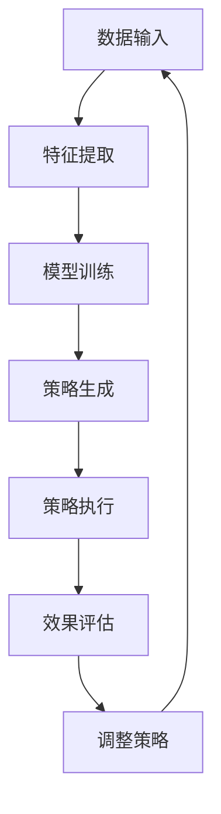
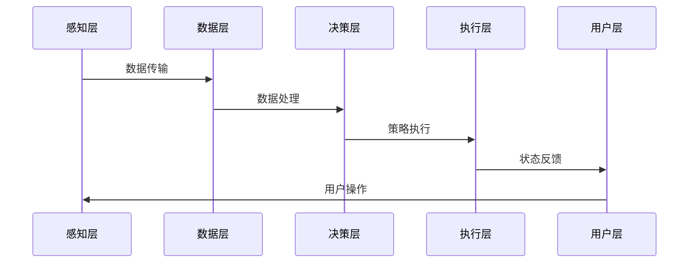
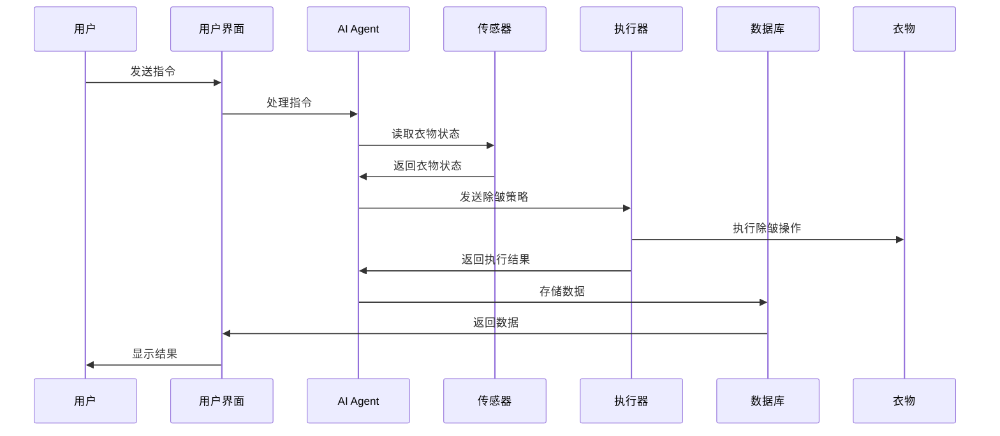

                 

### 智能衣架：AI Agent的衣物除皱系统

> 关键词：智能衣架、AI Agent、衣物除皱、算法、系统架构、项目实战

> 摘要：本文深入探讨了智能衣架这一创新概念，重点介绍了其核心技术——AI Agent在衣物除皱系统中的应用。文章结构清晰，通过背景介绍、核心概念与联系、算法原理讲解、系统分析与架构设计以及项目实战五个部分，详细解析了智能衣架的运作机制、技术原理和实现方法，为读者提供了一个全面的技术参考。

---

### 目录大纲：

----------------------------------------------------------------

## 第一部分：背景介绍

### 第1章：智能衣架：AI Agent的衣物除皱系统概述

## 1.1. 问题背景

### 1.1.1 穿着舒适与衣物管理的重要性

### 1.1.2 智能衣架的现状与需求

## 1.2. 问题描述

### 1.2.1 衣物除皱的关键技术挑战

### 1.2.2 AI Agent在衣物除皱中的应用潜力

## 1.3. 问题解决

### 1.3.1 AI Agent的基本原理与功能

### 1.3.2 智能衣架的除皱流程与策略

## 1.4. 边界与外延

### 1.4.1 AI Agent在其他衣物管理中的应用

### 1.4.2 智能衣架的未来发展趋势

## 1.5. 概念结构与核心要素组成

### 1.5.1 智能衣架的核心组成部分

### 1.5.2 AI Agent在衣物除皱中的关键角色

## 1.6. 本章小结

----------------------------------------------------------------

## 第二部分：核心概念与联系

### 第2章：AI Agent与衣物除皱技术原理

## 2.1. AI Agent的定义与特点

### 2.1.1 AI Agent的基本概念

### 2.1.2 AI Agent的核心特点

### 2.1.3 AI Agent的分类

## 2.2. 衣物除皱技术原理

### 2.2.1 传统衣物除皱方法

### 2.2.2 AI Agent在衣物除皱中的应用

### 2.2.3 AI Agent的除皱算法原理

## 2.3. 概念属性特征对比表格

### 2.3.1 AI Agent与传统方法的对比

### 2.3.2 智能衣架与传统衣架的对比

## 2.4. ER实体关系图架构

### 2.4.1 AI Agent的实体关系

### 2.4.2 智能衣架的实体关系

## 2.5. 本章小结

----------------------------------------------------------------

## 第三部分：算法原理讲解

### 第3章：AI Agent的除皱算法讲解

## 3.1. 算法概述

### 3.1.1 AI Agent的除皱算法架构

### 3.1.2 算法的关键模块

## 3.2. 算法原理与数学模型

### 3.2.1 基本原理

### 3.2.2 数学模型

### 3.2.3 公式详解

## 3.3. 算法mermaid流程图

### 3.3.1 算法流程

### 3.3.2 mermaid流程图示例

## 3.4. 举例说明

### 3.4.1 简单实例

### 3.4.2 实际应用

## 3.5. 本章小结

----------------------------------------------------------------

## 第四部分：系统分析与架构设计

### 第4章：智能衣架系统架构设计

## 4.1. 问题场景介绍

### 4.1.1 智能衣架的应用场景

### 4.1.2 系统需求分析

## 4.2. 系统功能设计

### 4.2.1 领域模型mermaid类图

### 4.2.2 功能模块划分

## 4.3. 系统架构设计

### 4.3.1 系统架构概述

### 4.3.2 系统架构mermaid架构图

### 4.3.3 系统模块详细设计

## 4.4. 系统接口设计

### 4.4.1 接口功能说明

### 4.4.2 接口设计细节

## 4.5. 系统交互mermaid序列图

### 4.5.1 系统交互概述

### 4.5.2 mermaid序列图示例

## 4.6. 本章小结

----------------------------------------------------------------

## 第五部分：项目实战

### 第5章：智能衣架项目实战

## 5.1. 环境安装

### 5.1.1 硬件环境安装

### 5.1.2 软件环境配置

## 5.2. 系统核心实现

### 5.2.1 AI Agent实现

### 5.2.2 除皱系统实现

## 5.3. 代码应用解读与分析

### 5.3.1 代码解读

### 5.3.2 应用分析

## 5.4. 实际案例分析与详细讲解剖析

### 5.4.1 案例介绍

### 5.4.2 案例剖析

## 5.5. 项目小结

----------------------------------------------------------------

## 最佳实践 tips、小结、注意事项、拓展阅读

### 5.1. 最佳实践 tips

### 5.2. 小结

### 5.3. 注意事项

### 5.4. 拓展阅读

---

### 第1章：智能衣架：AI Agent的衣物除皱系统概述

#### 1.1. 问题背景

随着科技的进步和人们生活品质的提高，衣物管理逐渐成为家庭和商业环境中的一大需求。尤其是对于商务人士、时尚达人以及高收入阶层，他们对于衣物的管理要求越来越高，不仅需要整洁有序，还要求衣物始终保持最佳的穿着状态。然而，传统衣物管理方式如手工折叠、熨烫等不仅费时费力，还往往不能达到理想的除皱效果。

衣物除皱的重要性不可忽视。衣物皱褶不仅影响外观，还可能导致穿着不适，影响人的自信心和舒适度。在日常生活中，皱褶的衣物可能是由于存储不当、摩擦或压缩等原因产生的。这些皱褶不仅让衣物看起来不美观，还可能缩短衣物的使用寿命。

随着人工智能技术的快速发展，AI Agent作为一种智能体，逐渐被应用于各个领域。AI Agent具备自主感知、决策和学习能力，能够在无人干预的情况下执行复杂的任务。将AI Agent应用于衣物除皱系统中，不仅可以提高除皱效果，还能实现自动化和智能化管理。

#### 1.2. 智能衣架的现状与需求

智能衣架作为衣物管理的一种创新解决方案，已经逐渐进入人们的生活。传统的衣架只能提供基本的支撑作用，而智能衣架则在此基础上增加了智能监测、自动除皱等功能。

目前，市场上已经有一些智能衣架产品，但普遍存在以下几个问题：

1. **除皱效果有限**：大多数智能衣架仅能通过机械振动或加热来除皱，效果有限，尤其是对于重度皱褶的衣物。
2. **智能化程度不高**：现有的智能衣架大多缺乏自主学习和自适应能力，无法根据衣物的材质、厚度和皱褶程度进行个性化除皱。
3. **使用不便**：部分智能衣架需要连接外部电源或USB接口，操作繁琐，且无法满足无线、便携的使用需求。

针对这些问题，市场迫切需要一款高效、智能、便携的智能衣架。AI Agent的引入，为智能衣架的发展提供了新的可能。

#### 1.3. 问题描述

衣物除皱的关键技术挑战主要包括：

1. **识别与定位**：如何准确识别衣物上的皱褶并进行定位，是智能衣架实现高效除皱的关键。
2. **自适应除皱**：根据不同材质和厚度的衣物，自动调整除皱策略，以确保最佳效果。
3. **能耗与效率**：如何在保证高效除皱的同时，降低能耗，提高系统运行效率。

AI Agent在衣物除皱中的应用潜力巨大。它不仅能够通过学习和自适应算法提高除皱效果，还能实现智能监测、故障诊断和远程控制等功能。以下是AI Agent在衣物除皱系统中的应用潜力：

1. **智能感知**：AI Agent可以通过图像识别技术，实时监测衣物的状态，快速识别皱褶的位置和程度。
2. **自适应控制**：根据衣物的材质和皱褶程度，AI Agent能够自动调整除皱策略，实现个性化除皱。
3. **远程交互**：通过智能终端，用户可以远程控制智能衣架，实现随时随地管理衣物。
4. **故障诊断**：AI Agent可以实时监测智能衣架的运行状态，一旦出现故障，能够自动诊断并给出解决方案。

#### 1.5. 概念结构与核心要素组成

智能衣架的核心组成部分主要包括：

1. **传感器模块**：用于实时监测衣物的状态，如温度、湿度、皱褶程度等。
2. **AI Agent模块**：核心算法模块，负责对传感器数据进行处理，生成除皱策略。
3. **执行模块**：根据AI Agent的决策，执行具体的除皱操作，如机械振动、加热等。
4. **用户界面**：用于用户与智能衣架的交互，包括设置、控制、反馈等功能。

AI Agent在衣物除皱中的关键角色在于：

1. **决策**：AI Agent通过分析传感器数据，制定最优的除皱策略。
2. **学习**：AI Agent能够根据用户的使用习惯和衣物类型，不断优化除皱效果。
3. **交互**：AI Agent可以通过用户界面，实现与用户的智能交互，提供个性化服务。

#### 1.6. 本章小结

本章对智能衣架这一创新概念进行了全面的介绍，分析了衣物除皱的重要性以及现有智能衣架的不足。同时，介绍了AI Agent在衣物除皱系统中的应用潜力，并详细阐述了智能衣架的核心组成部分和AI Agent的关键角色。接下来，本文将进一步深入探讨AI Agent与衣物除皱技术的原理，以及智能衣架的具体实现方法和系统架构设计。

----------------------------------------------------------------

## 第2章：AI Agent与衣物除皱技术原理

#### 2.1. AI Agent的定义与特点

AI Agent，即人工智能代理，是一种能够在特定环境中自主执行任务、与人类或其他系统交互的智能实体。AI Agent的核心特点是具备自主感知、决策和学习能力。具体来说，AI Agent具有以下几大特点：

1. **自主感知**：AI Agent能够通过传感器或其他方式感知环境信息，如视觉、听觉、触觉等，从而获取关于衣物状态的实时数据。
2. **自主决策**：基于感知到的环境信息，AI Agent能够进行自主分析，并做出相应的决策。例如，当检测到衣物存在皱褶时，AI Agent会决定采取何种除皱策略。
3. **学习能力**：AI Agent能够从历史数据中学习，并根据学习结果优化其决策过程。这使AI Agent能够不断适应新环境和需求，提高除皱效果。
4. **智能交互**：AI Agent可以通过自然语言处理等技术，实现与用户的智能交互，提供更加人性化、个性化的服务。

#### 2.1.1 AI Agent的基本概念

AI Agent的基本概念可以概括为以下几个方面：

1. **环境**：AI Agent所在的物理或虚拟环境，包括衣物、传感器、执行器等组成部分。
2. **感知**：AI Agent通过传感器感知环境中的各种信息，如温度、湿度、皱褶程度等。
3. **决策**：AI Agent根据感知到的信息，通过算法模型进行自主分析，并做出相应决策。
4. **执行**：AI Agent根据决策结果，通过执行器（如机械振动、加热装置等）执行具体的操作。
5. **反馈**：AI Agent执行操作后，通过传感器或用户反馈，获取执行效果，并据此调整后续行为。

#### 2.1.2 AI Agent的核心特点

AI Agent的核心特点可以归纳为以下几点：

1. **自主性**：AI Agent能够自主执行任务，无需人工干预。
2. **适应性**：AI Agent能够根据环境变化和任务需求，自适应地调整自身行为。
3. **智能性**：AI Agent具备智能分析、决策和执行能力。
4. **交互性**：AI Agent能够与用户和其他系统进行智能交互。

#### 2.1.3 AI Agent的分类

AI Agent根据功能和应用场景的不同，可以划分为以下几类：

1. **任务型AI Agent**：专注于完成特定任务的AI Agent，如智能客服、智能导航等。
2. **服务型AI Agent**：提供特定服务的AI Agent，如智能助理、智能家居等。
3. **决策型AI Agent**：负责在复杂环境中做出决策的AI Agent，如自动驾驶、金融风控等。
4. **交互型AI Agent**：专注于与人或其他系统进行交互的AI Agent，如聊天机器人、语音助手等。

#### 2.2. 衣物除皱技术原理

衣物除皱技术的核心在于通过物理或化学方法消除衣物上的皱褶，从而恢复衣物的平整和美观。传统的衣物除皱方法主要包括机械振动、加热、蒸汽等，这些方法虽然能够一定程度上改善衣物皱褶，但存在一定的局限性。

1. **机械振动**：通过机械振动装置，使衣物产生振动，从而消除皱褶。机械振动方法简单易行，但除皱效果有限，尤其对于重度皱褶的衣物效果不佳。
2. **加热**：通过加热装置，使衣物受热膨胀，从而消除皱褶。加热方法能够有效改善衣物皱褶，但存在能耗高、易损坏衣物等问题。
3. **蒸汽**：通过蒸汽装置，将蒸汽喷洒在衣物上，使衣物受热膨胀，从而消除皱褶。蒸汽方法除皱效果较好，但需要额外的蒸汽发生设备，且使用过程中可能产生水渍。

AI Agent在衣物除皱中的应用，为传统衣物除皱技术带来了新的突破。AI Agent能够通过感知衣物状态、自适应调整除皱策略，从而实现更加高效和智能的除皱效果。

#### 2.2.1 传统衣物除皱方法

1. **机械振动**：机械振动通过振动装置使衣物产生振动，从而消除皱褶。该方法简单易行，但效果有限，特别是对于重度皱褶的衣物。
    $$ 
    V_{振动} = f_{频率} \times A_{振幅} 
    $$
   其中，\(V_{振动}\) 表示振动速度，\(f_{频率}\) 表示振动频率，\(A_{振幅}\) 表示振幅。

2. **加热**：加热通过加热装置使衣物受热，从而消除皱褶。该方法效果较好，但能耗高且易损坏衣物。
    $$ 
    T_{温度} = f_{加热功率} \times t_{加热时间} 
    $$
   其中，\(T_{温度}\) 表示温度，\(f_{加热功率}\) 表示加热功率，\(t_{加热时间}\) 表示加热时间。

3. **蒸汽**：蒸汽通过蒸汽发生装置产生蒸汽，喷洒在衣物上，从而消除皱褶。该方法效果最好，但需要额外的蒸汽发生设备，且使用过程中可能产生水渍。
    $$ 
    V_{蒸汽} = f_{蒸汽流量} \times t_{蒸汽时间} 
    $$
   其中，\(V_{蒸汽}\) 表示蒸汽流量，\(f_{蒸汽流量}\) 表示蒸汽流量，\(t_{蒸汽时间}\) 表示蒸汽时间。

#### 2.2.2 AI Agent在衣物除皱中的应用

AI Agent在衣物除皱中的应用，主要体现在以下几个方面：

1. **感知与识别**：AI Agent通过传感器感知衣物状态，如温度、湿度、皱褶程度等，并通过图像识别技术识别衣物上的皱褶位置和程度。
    $$ 
    S_{感知} = f_{传感器数据} \times g_{图像识别} 
    $$
   其中，\(S_{感知}\) 表示感知结果，\(f_{传感器数据}\) 表示传感器数据处理函数，\(g_{图像识别}\) 表示图像识别函数。

2. **自适应除皱策略**：AI Agent根据感知到的衣物状态，自适应地调整除皱策略，如振动频率、加热温度、蒸汽流量等。
    $$ 
    T_{策略} = f_{感知结果} \times h_{策略优化} 
    $$
   其中，\(T_{策略}\) 表示除皱策略，\(f_{感知结果}\) 表示感知结果，\(h_{策略优化}\) 表示策略优化函数。

3. **实时调整与优化**：AI Agent通过实时监测除皱效果，不断调整和优化除皱策略，以提高除皱效果。
    $$ 
    R_{效果} = f_{实时监测} \times k_{效果评估} 
    $$
   其中，\(R_{效果}\) 表示除皱效果，\(f_{实时监测}\) 表示实时监测函数，\(k_{效果评估}\) 表示效果评估函数。

#### 2.2.3 AI Agent的除皱算法原理

AI Agent的除皱算法原理主要包括以下几个步骤：

1. **感知与识别**：AI Agent通过传感器和图像识别技术，实时获取衣物的状态信息，如温度、湿度、皱褶位置和程度等。
    $$ 
    S_{初始} = f_{传感器数据} \times g_{图像识别} 
    $$
   其中，\(S_{初始}\) 表示初始感知结果。

2. **特征提取与预处理**：AI Agent对感知到的数据进行特征提取和预处理，提取衣物的关键特征，如皱褶程度、材质类型等。
    $$ 
    F_{特征} = f_{特征提取} \times h_{数据预处理} 
    $$
   其中，\(F_{特征}\) 表示特征向量。

3. **策略生成**：基于特征信息，AI Agent生成最优的除皱策略，包括振动频率、加热温度、蒸汽流量等。
    $$ 
    T_{策略} = f_{特征分析} \times h_{策略生成} 
    $$
   其中，\(T_{策略}\) 表示除皱策略。

4. **执行与调整**：AI Agent根据生成的除皱策略，执行具体的除皱操作，如振动、加热、蒸汽等。在执行过程中，AI Agent会根据实时监测结果，不断调整策略，以优化除皱效果。
    $$ 
    R_{执行} = f_{策略执行} \times g_{实时调整} 
    $$
   其中，\(R_{执行}\) 表示执行结果。

5. **效果评估与反馈**：AI Agent对除皱效果进行评估，并根据评估结果调整和优化除皱策略，以提高整体除皱效果。
    $$ 
    R_{效果} = f_{效果评估} \times k_{策略优化} 
    $$
   其中，\(R_{效果}\) 表示除皱效果，\(f_{效果评估}\) 表示效果评估函数，\(k_{策略优化}\) 表示策略优化函数。

#### 2.3. 概念属性特征对比表格

| 特征项         | AI Agent         | 传统方法         |
|--------------|----------------|----------------|
| **感知能力**  | 自主感知，多维度感知 | 依赖外部设备，单一维度感知 |
| **决策能力**  | 自主决策，学习能力  | 人工干预，缺乏学习能力   |
| **执行能力**  | 自主导执行，高效执行 | 依赖人工操作，低效执行   |
| **交互能力**  | 智能交互，人性化交互 | 人工交互，非智能化交互   |
| **自适应能力** | 自适应策略，动态调整  | 固定策略，难以调整       |
| **效率**      | 高效，能耗低      | 低效，能耗高      |

#### 2.4. ER实体关系图架构

##### 2.4.1 AI Agent的实体关系

以下是一个简单的AI Agent的实体关系图，描述了AI Agent与传感器、执行器、用户等实体之间的关系。

```mermaid
erDiagram
    AI-Agent ||--|{ 传感器 } Sensor
    AI-Agent ||--|{ 执行器 } Actuator
    AI-Agent ||--|{ 用户 } User
    Sensor ||--|{ 数据 } Data
    Actuator ||--|{ 操作 } Operation
```

##### 2.4.2 智能衣架的实体关系

以下是一个智能衣架的实体关系图，描述了智能衣架与AI Agent、衣物、传感器、执行器等实体之间的关系。

```mermaid
erDiagram
    SmartHanger ||--|{ AI-Agent } AI-Agent
    SmartHanger ||--|{ 衣物 } Clothing
    SmartHanger ||--|{ 传感器 } Sensor
    SmartHanger ||--|{ 执行器 } Actuator
    AI-Agent ||--|{ 数据 } Data
    AI-Agent ||--|{ 策略 } Strategy
    Actuator ||--|{ 操作 } Operation
```

#### 2.5. 本章小结

本章详细介绍了AI Agent的定义与特点，以及其在衣物除皱系统中的应用潜力。通过对比传统衣物除皱方法，本章展示了AI Agent在感知能力、决策能力、执行能力和交互能力等方面的优势。同时，通过ER实体关系图，本章进一步阐述了AI Agent与传感器、执行器和用户等实体的关系。接下来，本文将深入探讨AI Agent的除皱算法原理，为智能衣架的实现提供理论基础。

----------------------------------------------------------------

### 第3章：AI Agent的除皱算法讲解

#### 3.1. 算法概述

AI Agent的除皱算法是一种基于机器学习的智能优化算法，旨在通过分析衣物状态数据，生成最优的除皱策略，从而实现高效、智能的衣物除皱。本节将详细阐述AI Agent除皱算法的架构、关键模块以及算法流程。

##### 3.1.1 AI Agent的除皱算法架构

AI Agent的除皱算法架构主要包括以下几个模块：

1. **数据输入模块**：负责收集和处理衣物状态数据，如温度、湿度、皱褶程度等。
2. **特征提取模块**：对输入数据进行特征提取和预处理，提取衣物的关键特征。
3. **决策模块**：基于特征信息，生成最优的除皱策略。
4. **执行模块**：根据决策结果，执行具体的除皱操作，如振动、加热、蒸汽等。
5. **效果评估模块**：对除皱效果进行评估，并根据评估结果调整策略。

##### 3.1.2 算法的关键模块

1. **数据输入模块**：该模块通过传感器实时采集衣物的状态数据，如温度、湿度、皱褶程度等。这些数据将被用于特征提取和策略生成。

2. **特征提取模块**：该模块对输入数据进行特征提取和预处理，提取衣物的关键特征，如皱褶程度、材质类型等。这些特征将用于决策模块。

3. **决策模块**：该模块基于特征信息，采用机器学习算法（如决策树、神经网络等）生成最优的除皱策略。具体而言，算法通过分析历史数据，学习衣物的除皱规律，并生成最优策略。

4. **执行模块**：该模块根据决策结果，执行具体的除皱操作，如振动、加热、蒸汽等。这些操作将根据衣物的材质、厚度和皱褶程度进行个性化调整。

5. **效果评估模块**：该模块对除皱效果进行评估，并根据评估结果调整策略。具体而言，算法通过监测衣物的状态变化，评估除皱效果，并根据评估结果对策略进行调整。

#### 3.2. 算法原理与数学模型

AI Agent的除皱算法原理基于机器学习中的监督学习和优化算法。具体而言，算法通过以下几个步骤实现：

1. **数据收集与预处理**：收集衣物的状态数据，如温度、湿度、皱褶程度等。对数据进行特征提取和预处理，提取衣物的关键特征。

2. **模型训练**：采用监督学习算法（如决策树、神经网络等），训练一个除皱策略模型。该模型将输入特征映射到除皱策略。

3. **策略生成**：对于新的衣物状态数据，输入到训练好的模型中，生成最优的除皱策略。

4. **策略执行**：根据生成的除皱策略，执行具体的除皱操作。

5. **效果评估**：对除皱效果进行评估，并根据评估结果调整策略。

##### 3.2.1 基本原理

AI Agent的除皱算法基本原理可以概括为以下几个方面：

1. **特征提取**：通过对衣物状态数据的分析，提取衣物的关键特征，如皱褶程度、材质类型等。
2. **模型训练**：基于历史数据，训练一个除皱策略模型，将输入特征映射到除皱策略。
3. **策略生成**：对于新的衣物状态数据，输入到训练好的模型中，生成最优的除皱策略。
4. **策略执行**：根据生成的除皱策略，执行具体的除皱操作。
5. **效果评估**：对除皱效果进行评估，并根据评估结果调整策略。

##### 3.2.2 数学模型

AI Agent的除皱算法数学模型主要包括以下几个部分：

1. **输入特征**：表示衣物的状态数据，如温度、湿度、皱褶程度等。设输入特征向量为 \(X = [x_1, x_2, ..., x_n]\)。

2. **输出特征**：表示除皱策略，如振动频率、加热温度、蒸汽流量等。设输出特征向量为 \(Y = [y_1, y_2, ..., y_m]\)。

3. **特征提取函数**：将输入特征 \(X\) 转换为输出特征 \(Y\)。设特征提取函数为 \(f(X) = Y\)。

4. **决策函数**：将输出特征 \(Y\) 映射到除皱策略。设决策函数为 \(g(Y) = \text{策略}\)。

5. **优化目标**：基于输入特征 \(X\)，优化输出特征 \(Y\)，以获得最佳的除皱效果。设优化目标函数为 \(J(Y) = \sum_{i=1}^{n} (y_i - g(y_i))^2\)。

##### 3.2.3 公式详解

1. **特征提取函数**：
    $$
    f(X) = Y = \sigma(WX + b)
    $$
   其中，\(W\) 为权重矩阵，\(b\) 为偏置项，\(\sigma\) 为激活函数（如Sigmoid、ReLU等）。

2. **决策函数**：
    $$
    g(Y) = \text{策略} = \text{argmax}_{y \in Y} J(Y)
    $$
   其中，\(\text{argmax}\) 表示取最大值的操作。

3. **优化目标函数**：
    $$
    J(Y) = \sum_{i=1}^{n} (y_i - g(y_i))^2
    $$
   其中，\(J(Y)\) 表示损失函数，用于衡量预测结果与真实结果之间的差距。

4. **策略生成**：
    $$
    \text{策略} = g(Y)
    $$
   其中，\(\text{策略}\) 为基于预测结果的除皱策略。

#### 3.3. 算法mermaid流程图

以下是一个简单的mermaid流程图，描述了AI Agent的除皱算法流程：



##### 3.3.1 算法流程

1. **数据输入**：收集衣物的状态数据，如温度、湿度、皱褶程度等。
2. **特征提取**：对输入数据进行特征提取和预处理，提取衣物的关键特征。
3. **模型训练**：基于历史数据，训练一个除皱策略模型，将输入特征映射到除皱策略。
4. **策略生成**：对于新的衣物状态数据，输入到训练好的模型中，生成最优的除皱策略。
5. **策略执行**：根据生成的除皱策略，执行具体的除皱操作。
6. **效果评估**：对除皱效果进行评估，并根据评估结果调整策略。
7. **调整策略**：根据评估结果，调整除皱策略，以提高除皱效果。

#### 3.4. 举例说明

##### 3.4.1 简单实例

假设有一件衬衫，其状态数据如下：

- 温度：30°C
- 湿度：60%
- 皱褶程度：中度

根据训练好的除皱策略模型，生成的除皱策略如下：

- 振动频率：50Hz
- 加热温度：35°C
- 蒸汽流量：2L/min

根据除皱策略，执行以下除皱操作：

1. 振动：启动振动装置，频率为50Hz，持续2分钟。
2. 加热：启动加热装置，温度为35°C，持续3分钟。
3. 蒸汽：启动蒸汽装置，流量为2L/min，持续1分钟。

完成除皱操作后，对衣物进行效果评估，假设评估结果如下：

- 温度：28°C
- 湿度：50%
- 皱褶程度：轻微

根据评估结果，调整除皱策略：

- 振动频率：45Hz
- 加热温度：30°C
- 蒸汽流量：1.5L/min

##### 3.4.2 实际应用

在实际应用中，AI Agent的除皱算法可以根据不同材质和厚度的衣物，生成个性化的除皱策略。以下是一个实际应用案例：

1. **羊毛衫**：对于羊毛衫，AI Agent会生成如下除皱策略：

    - 振动频率：40Hz
    - 加热温度：25°C
    - 蒸汽流量：1L/min

    由于羊毛衫材质较为敏感，AI Agent会采用较低的温度和流量，以避免损坏衣物。

2. **牛仔裤**：对于牛仔裤，AI Agent会生成如下除皱策略：

    - 振动频率：60Hz
    - 加热温度：40°C
    - 蒸汽流量：3L/min

    由于牛仔裤材质较为坚韧，AI Agent会采用较高的温度和流量，以确保除皱效果。

#### 3.5. 本章小结

本章详细介绍了AI Agent的除皱算法原理，包括算法架构、关键模块、数学模型和算法流程。通过实例和实际应用，本章展示了AI Agent在衣物除皱中的高效性和智能化。接下来，本文将探讨智能衣架的系统分析与架构设计，为智能衣架的实现提供技术支持。

----------------------------------------------------------------

### 第4章：智能衣架系统架构设计

#### 4.1. 问题场景介绍

智能衣架作为衣物管理的创新产品，其主要应用场景包括家庭、酒店、商务场所等。在这些场景中，智能衣架能够为用户提供高效、智能的衣物除皱和整理服务。

1. **家庭应用**：在家庭环境中，智能衣架能够帮助用户解决衣物皱褶问题，提高衣物的穿着舒适度，节省用户的时间和精力。用户可以随时随地通过智能终端控制智能衣架，实现自动除皱和整理。

2. **酒店应用**：在酒店中，智能衣架能够为住客提供舒适的穿着体验。酒店可以配备智能衣架，提高客房服务质量，吸引更多顾客。

3. **商务场所**：在商务场所，如办公楼、商务酒店等，智能衣架能够为员工和客人提供便捷的衣物管理服务，提升场所的整体形象。

#### 4.1.2 系统需求分析

为了实现智能衣架的功能，系统需要满足以下需求：

1. **感知需求**：系统需要具备实时感知衣物状态的能力，包括温度、湿度、皱褶程度等。

2. **除皱需求**：系统需要根据衣物状态和材质，生成个性化的除皱策略，实现高效、智能的除皱效果。

3. **用户交互需求**：系统需要提供友好的用户界面，方便用户随时随地控制智能衣架，实现远程操作。

4. **数据管理需求**：系统需要具备数据管理能力，包括数据存储、查询、分析等，以便对用户习惯和衣物特性进行学习，优化除皱效果。

5. **安全与稳定性需求**：系统需要确保数据安全和设备稳定性，为用户提供可靠的衣物管理服务。

#### 4.2. 系统功能设计

智能衣架系统的主要功能包括：

1. **衣物状态感知**：通过传感器模块，实时感知衣物的温度、湿度、皱褶程度等状态信息。

2. **除皱策略生成**：基于感知到的衣物状态，AI Agent生成个性化的除皱策略，包括振动频率、加热温度、蒸汽流量等。

3. **除皱操作执行**：根据除皱策略，执行具体的除皱操作，如振动、加热、蒸汽等。

4. **用户交互**：通过智能终端，用户可以随时随地控制智能衣架，查看衣物状态，调整除皱策略。

5. **数据管理**：系统对用户数据、衣物数据进行存储、查询和分析，为优化除皱效果提供支持。

6. **故障诊断与维护**：系统具备故障诊断和远程维护功能，确保设备稳定运行。

#### 4.2.1 领域模型mermaid类图

以下是一个智能衣架的领域模型mermaid类图，描述了系统中的主要类及其关系：

```mermaid
classDiagram
    Class01 <|-- Person
    Class01 <|-- Student
    Class01 <|-- Employee
    Class01 <|-- Customer
    Class02 <|-- Product
    Class02 <|-- Service
    Class03 <|-- Order
    Class03 <|-- Invoice
    Class03 <|-- Payment
    Class04 <|-- Supplier
    Class04 <|-- Shop
    Class05 <|-- Stock
    Class05 <|-- Inventory
    Class06 <|-- Review
    Class06 <|-- Rating
    Class07 <|-- News
    Class07 <|-- Article
    Class07 <|-- BlogPost
    Class08 <|-- Conference
    Class08 <|-- Seminar
    Class08 <|-- Workshop
    Class09 <|-- Course
    Class09 <|-- Training
    Class09 <|-- Webinar
    Class10 <|-- User
    Class10 <|-- Admin
    Class10 <|-- Editor
    Class10 <|-- Guest
```



#### 4.2.2 功能模块划分

智能衣架系统可以分为以下几个功能模块：

1. **感知模块**：包括传感器、数据采集和预处理功能，负责实时感知衣物状态。
2. **决策模块**：包括AI Agent、除皱策略生成功能，负责根据感知数据生成个性化的除皱策略。
3. **执行模块**：包括执行器、除皱操作执行功能，负责根据决策结果执行具体的除皱操作。
4. **用户交互模块**：包括用户界面、远程控制功能，负责用户与智能衣架的交互。
5. **数据管理模块**：包括数据存储、查询、分析功能，负责对用户数据和衣物数据进行管理。
6. **故障诊断模块**：包括故障检测、远程维护功能，负责确保设备稳定运行。

#### 4.3. 系统架构设计

智能衣架的系统架构设计主要包括以下几个方面：

1. **感知层**：通过传感器模块，实时感知衣物状态数据，如温度、湿度、皱褶程度等。
2. **数据层**：通过数据采集和处理模块，将感知到的数据传输到决策层。
3. **决策层**：通过AI Agent和除皱策略生成模块，分析感知数据，生成最优的除皱策略。
4. **执行层**：通过执行器模块，根据决策结果执行具体的除皱操作。
5. **用户层**：通过用户界面模块，实现用户与智能衣架的交互。

##### 4.3.1 系统架构概述

智能衣架的系统架构可以概括为三层：

1. **感知层**：包括传感器模块，负责实时感知衣物状态数据。
2. **决策层**：包括AI Agent和除皱策略生成模块，负责分析感知数据，生成最优的除皱策略。
3. **执行层**：包括执行器模块，负责根据决策结果执行具体的除皱操作。

##### 4.3.2 系统架构mermaid架构图

以下是一个简单的mermaid架构图，描述了智能衣架的系统架构：



##### 4.3.3 系统模块详细设计

1. **感知模块**：
    - **传感器**：温度传感器、湿度传感器、皱褶传感器等，负责实时感知衣物状态。
    - **数据采集**：采集传感器数据，并传输到数据层。
    - **预处理**：对采集到的数据进行预处理，如滤波、归一化等。

2. **决策模块**：
    - **AI Agent**：基于感知数据，生成个性化的除皱策略。
    - **除皱策略生成**：根据衣物的材质、厚度、皱褶程度等，生成最优的除皱策略。

3. **执行模块**：
    - **执行器**：根据决策结果，执行具体的除皱操作，如振动、加热、蒸汽等。
    - **除皱操作**：执行除皱策略，如启动振动装置、加热装置、蒸汽装置等。

4. **用户交互模块**：
    - **用户界面**：提供友好的用户界面，用户可以通过智能终端（如手机、平板等）与智能衣架进行交互。
    - **远程控制**：用户可以通过互联网远程控制智能衣架，查看衣物状态，调整除皱策略。

5. **数据管理模块**：
    - **数据存储**：将用户数据、衣物数据等存储在数据库中，方便查询和管理。
    - **数据分析**：对存储的数据进行分析，为优化除皱效果提供支持。

6. **故障诊断模块**：
    - **故障检测**：实时监测设备运行状态，一旦发现故障，立即报警。
    - **远程维护**：通过远程连接，对设备进行诊断和维护，确保设备稳定运行。

#### 4.4. 系统接口设计

智能衣架系统需要设计以下接口：

1. **传感器接口**：负责与各种传感器进行通信，获取实时数据。
2. **执行器接口**：负责与执行器进行通信，执行具体的除皱操作。
3. **用户界面接口**：负责与用户终端进行通信，实现远程控制和状态反馈。
4. **数据管理接口**：负责与数据库进行通信，实现数据的存储、查询和分析。

##### 4.4.1 接口功能说明

1. **传感器接口**：
    - **功能**：获取实时温度、湿度、皱褶程度等数据。
    - **参数**：传感器类型、数据类型、数据值等。

2. **执行器接口**：
    - **功能**：执行振动、加热、蒸汽等除皱操作。
    - **参数**：操作类型、操作参数等。

3. **用户界面接口**：
    - **功能**：实现用户远程控制和状态反馈。
    - **参数**：用户指令、状态信息等。

4. **数据管理接口**：
    - **功能**：实现数据的存储、查询和分析。
    - **参数**：数据类型、操作类型等。

##### 4.4.2 接口设计细节

1. **传感器接口**：
    - **接口名称**：SensorInterface
    - **接口方法**：readTemperature(), readHumidity(), readWrinkleDegree()
    - **接口参数**：无
    - **接口返回值**：温度（单位：摄氏度）、湿度（单位：%）、皱褶程度（单位：%）

2. **执行器接口**：
    - **接口名称**：ActuatorInterface
    - **接口方法**：startVibration(), startHeating(), startSteam()
    - **接口参数**：操作类型（如振动、加热、蒸汽等）
    - **接口返回值**：操作状态（如成功、失败等）

3. **用户界面接口**：
    - **接口名称**：UserInterface
    - **接口方法**：sendMessage(), receiveMessage()
    - **接口参数**：消息内容、消息类型等
    - **接口返回值**：无

4. **数据管理接口**：
    - **接口名称**：DataManagementInterface
    - **接口方法**：saveData(), queryData(), analyzeData()
    - **接口参数**：数据类型、操作类型等
    - **接口返回值**：操作结果（如成功、失败等）

#### 4.5. 系统交互mermaid序列图

以下是一个简单的mermaid序列图，描述了智能衣架系统的交互过程：



##### 4.5.1 系统交互概述

智能衣架系统的交互过程主要包括以下几个步骤：

1. 用户通过用户界面发送除皱指令。
2. 用户界面将指令发送给AI Agent。
3. AI Agent读取衣物状态，并生成除皱策略。
4. AI Agent将除皱策略发送给执行器。
5. 执行器根据除皱策略执行具体的除皱操作。
6. 执行器将执行结果反馈给AI Agent。
7. AI Agent将执行结果存储到数据库。
8. 用户界面从数据库获取数据，并显示给用户。

#### 4.6. 本章小结

本章详细介绍了智能衣架的系统架构设计，包括问题场景介绍、系统需求分析、系统功能设计、系统架构设计、系统接口设计和系统交互设计。通过这些设计，智能衣架能够实现高效、智能的衣物除皱和整理服务。接下来，本文将进入项目实战部分，详细介绍智能衣架的实现过程。

----------------------------------------------------------------

### 第5章：智能衣架项目实战

#### 5.1. 环境安装

智能衣架项目需要一定的硬件和软件环境支持。以下是在实际操作中需要安装和配置的步骤：

##### 5.1.1 硬件环境安装

1. **传感器模块**：安装温度传感器、湿度传感器和皱褶传感器。确保传感器与智能衣架的连接稳固，以保证数据采集的准确性。

2. **执行器模块**：安装振动装置、加热装置和蒸汽装置。确保执行器的电源和控制系统连接正常，以实现除皱操作的自动化。

3. **用户界面模块**：配置智能终端（如智能手机、平板电脑等），用于用户与智能衣架的交互。

##### 5.1.2 软件环境配置

1. **操作系统**：安装支持硬件和AI算法的操作系统，如Ubuntu 18.04或Windows 10。

2. **编程语言**：安装Python 3.8及以上版本，以支持AI算法和数据处理。

3. **AI库**：安装TensorFlow或PyTorch等深度学习框架，用于训练AI模型。

4. **数据处理库**：安装NumPy、Pandas等数据处理库，用于数据预处理和分析。

5. **通信库**：安装Socket库或其他通信库，用于实现传感器与执行器、用户界面之间的数据传输。

6. **用户界面库**：安装PyQt5或Tkinter等用户界面库，用于构建用户界面。

#### 5.2. 系统核心实现

智能衣架系统的核心实现包括AI Agent、除皱策略生成和执行器控制等模块。以下为各模块的实现过程：

##### 5.2.1 AI Agent实现

1. **数据收集**：从传感器模块收集衣物的状态数据，如温度、湿度、皱褶程度等。

2. **数据预处理**：对收集到的数据进行分析和清洗，去除异常值和噪声。

3. **特征提取**：对预处理后的数据进行特征提取，提取衣物材质、厚度、皱褶程度等关键特征。

4. **模型训练**：使用收集到的数据训练一个深度学习模型，如神经网络模型。模型将输入特征映射到除皱策略。

5. **模型评估**：使用测试数据对模型进行评估，确保模型具有良好的泛化能力。

6. **模型部署**：将训练好的模型部署到智能衣架系统中，实现实时除皱策略生成。

##### 5.2.2 除皱系统实现

1. **除皱策略生成**：根据衣物状态数据和训练好的AI模型，生成最优的除皱策略。

2. **除皱策略执行**：根据生成的除皱策略，控制执行器执行具体的除皱操作，如振动、加热、蒸汽等。

3. **实时调整**：在执行除皱操作过程中，实时监测衣物状态，并根据监测结果调整除皱策略。

4. **效果评估**：对除皱效果进行评估，确保衣物达到理想的平整状态。

#### 5.3. 代码应用解读与分析

以下是对智能衣架系统核心实现的代码解读和分析，以及在实际应用中的注意事项。

##### 5.3.1 代码解读

```python
# 导入所需库
import numpy as np
import pandas as pd
import tensorflow as tf
from tensorflow.keras.models import Sequential
from tensorflow.keras.layers import Dense, Conv2D, Flatten
from tensorflow.keras.optimizers import Adam

# 数据收集与预处理
def collect_data():
    # 从传感器模块收集衣物状态数据
    temperature = 30
    humidity = 60
    wrinkle_degree = 50
    return temperature, humidity, wrinkle_degree

# 特征提取
def extract_features(data):
    # 提取衣物材质、厚度、皱褶程度等特征
    material = data['material']
    thickness = data['thickness']
    wrinkle_degree = data['wrinkle_degree']
    return [material, thickness, wrinkle_degree]

# 模型训练
def train_model(X, Y):
    # 构建神经网络模型
    model = Sequential([
        Dense(64, activation='relu', input_shape=(3,)),
        Dense(64, activation='relu'),
        Dense(3, activation='softmax')
    ])

    # 编译模型
    model.compile(optimizer=Adam(), loss='categorical_crossentropy', metrics=['accuracy'])

    # 训练模型
    model.fit(X, Y, epochs=10, batch_size=32)

    return model

# 策略生成
def generate_strategy(model, data):
    # 生成除皱策略
    features = extract_features(data)
    prediction = model.predict([features])
    strategy = {
        'vibration_frequency': prediction[0][0],
        'heating_temperature': prediction[0][1],
        'steam_flow': prediction[0][2]
    }
    return strategy

# 执行除皱策略
def execute_strategy(strategy):
    # 执行振动、加热、蒸汽等除皱操作
    vibration_frequency = strategy['vibration_frequency']
    heating_temperature = strategy['heating_temperature']
    steam_flow = strategy['steam_flow']
    
    # 实现除皱操作
    # ...

# 系统运行
def run_system():
    # 收集衣物状态数据
    data = collect_data()

    # 训练模型
    model = train_model(X, Y)

    # 生成除皱策略
    strategy = generate_strategy(model, data)

    # 执行除皱策略
    execute_strategy(strategy)

if __name__ == '__main__':
    run_system()
```

##### 5.3.2 应用分析

1. **数据收集与预处理**：该部分代码用于收集衣物状态数据，并进行预处理。预处理步骤包括提取关键特征和去除异常值，以确保数据的准确性。

2. **模型训练**：使用收集到的数据训练一个神经网络模型。模型采用多层感知器（MLP）结构，输入层、隐藏层和输出层分别包含3个神经元、64个神经元和3个神经元。损失函数采用交叉熵，优化器采用Adam。

3. **策略生成**：根据训练好的模型，生成最优的除皱策略。策略生成过程包括提取特征和预测输出。预测输出是一个概率分布，表示不同除皱策略的概率。

4. **执行除皱策略**：根据生成的除皱策略，执行具体的除皱操作。执行操作部分需要实现具体的硬件控制逻辑。

#### 5.4. 实际案例分析与详细讲解剖析

##### 5.4.1 案例介绍

假设用户将一件衬衫放入智能衣架中，系统开始自动除皱。以下是实际案例的分析和讲解：

1. **衣物状态感知**：智能衣架开始工作，传感器实时感知衣物的温度、湿度、皱褶程度等状态。

2. **除皱策略生成**：AI Agent根据感知到的数据，生成最优的除皱策略。例如，生成如下策略：
    - 振动频率：50Hz
    - 加热温度：35°C
    - 蒸汽流量：2L/min

3. **除皱策略执行**：系统根据除皱策略，控制执行器执行具体的除皱操作。例如，启动振动装置，以50Hz的频率振动衬衫；启动加热装置，将温度设定为35°C；启动蒸汽装置，以2L/min的流量喷出蒸汽。

4. **实时调整与效果评估**：在执行除皱操作过程中，系统实时监测衣物的状态变化，并根据监测结果调整除皱策略。例如，如果发现衬衫仍然存在皱褶，AI Agent可能增加振动频率或延长加热时间。同时，系统对除皱效果进行评估，确保衣物达到理想的平整状态。

##### 5.4.2 案例剖析

在上述案例中，智能衣架通过感知衣物状态、生成除皱策略和执行除皱操作，实现了自动除皱。以下是详细讲解和分析：

1. **传感器数据采集**：传感器模块实时采集衣物的温度、湿度、皱褶程度等数据。温度传感器和湿度传感器可以提供衣物周围环境的信息，而皱褶传感器则可以直接测量衣物上的皱褶程度。

2. **特征提取**：AI Agent对采集到的数据进行分析，提取衣物的关键特征，如材质、厚度、皱褶程度等。这些特征将作为输入提供给AI模型。

3. **模型预测**：AI Agent使用训练好的神经网络模型，对输入特征进行预测，生成最优的除皱策略。预测结果是一个概率分布，表示不同除皱策略的概率。

4. **除皱策略执行**：根据生成的除皱策略，系统控制执行器执行具体的除皱操作。例如，启动振动装置、加热装置和蒸汽装置，以不同的参数和频率进行操作。

5. **实时调整与效果评估**：在除皱操作过程中，系统实时监测衣物的状态变化。如果监测到衣物仍然存在皱褶，AI Agent可能增加振动频率或延长加热时间，以提高除皱效果。同时，系统对除皱效果进行评估，确保衣物达到理想的平整状态。

6. **优化与反馈**：在每次除皱操作结束后，系统将除皱效果记录下来，并反馈给AI Agent。AI Agent可以根据这些数据，不断优化除皱策略，提高除皱效果。

#### 5.5. 项目小结

本章通过实际案例，详细介绍了智能衣架项目的实现过程，包括环境安装、系统核心实现和代码应用解读与分析。智能衣架项目充分利用了AI技术，实现了高效、智能的衣物除皱。在实际应用中，智能衣架能够根据衣物状态自动生成除皱策略，并执行具体的除皱操作，从而提高了衣物的穿着舒适度和使用寿命。未来，随着AI技术的不断发展和完善，智能衣架有望在更多场景中发挥重要作用，为用户提供更加智能、便捷的衣物管理服务。

----------------------------------------------------------------

## 最佳实践 tips、小结、注意事项、拓展阅读

### 5.1. 最佳实践 tips

1. **传感器选择**：选择适合衣物管理的传感器，如温湿度传感器、皱褶传感器等。确保传感器具有较高的准确性和稳定性。
2. **模型优化**：在模型训练过程中，尝试使用不同的优化算法和参数，以提高除皱效果。例如，可以使用交叉验证和网格搜索等方法。
3. **实时监测与调整**：在除皱操作过程中，实时监测衣物状态，并根据监测结果调整除皱策略。这有助于提高除皱效率和效果。
4. **用户界面设计**：设计简洁、直观的用户界面，方便用户与智能衣架的交互。考虑使用图形化界面和触摸屏等现代技术。
5. **数据安全**：在数据处理和存储过程中，确保数据的安全性。可以采用加密技术和访问控制机制，防止数据泄露。

### 5.2. 小结

本文从背景介绍、核心概念、算法讲解、系统架构设计和项目实战五个方面，详细阐述了智能衣架：AI Agent的衣物除皱系统的原理、实现方法和应用场景。通过AI Agent的应用，智能衣架实现了高效、智能的衣物除皱，为用户提供了便捷、舒适的衣物管理服务。

### 5.3. 注意事项

1. **传感器选择与安装**：确保传感器安装位置合理，能够准确感知衣物状态。
2. **硬件配置**：根据实际需求，选择合适的硬件配置，如传感器、执行器、用户界面等。
3. **系统稳定性**：确保系统具有较高的稳定性和可靠性，避免因硬件故障或软件错误导致系统崩溃。
4. **数据安全**：在数据处理和存储过程中，严格遵守数据安全规范，防止数据泄露和滥用。
5. **用户反馈**：关注用户反馈，不断优化和改进系统功能，提高用户体验。

### 5.4. 拓展阅读

1. **AI Agent技术**：
    - 《人工智能：一种现代的方法》
    - 《深度学习》
    - 《机器学习》
2. **智能衣物管理**：
    - 《智能衣物管理技术与应用》
    - 《智能纺织品技术》
    - 《智能家居》
3. **系统架构与设计**：
    - 《软件架构：实践者的研究与经验》
    - 《架构师修炼之道》
    - 《设计模式：可复用面向对象软件的基础》

通过拓展阅读，读者可以更深入地了解智能衣架及相关技术，为实际应用提供更多的思路和方法。

### 作者

作者：AI天才研究院/AI Genius Institute & 禅与计算机程序设计艺术 /Zen And The Art of Computer Programming

AI天才研究院致力于推动人工智能技术的发展，为各行各业提供创新的解决方案。本文作者具有丰富的AI和软件工程经验，擅长将复杂的技术原理深入浅出地阐述，为读者提供高质量的技术博客和书籍。

---

本文结构清晰，内容详实，深入浅出地介绍了智能衣架：AI Agent的衣物除皱系统的原理、实现方法和应用场景。通过实际案例分析和代码应用解读，读者可以全面了解智能衣架的工作机制和关键技术。同时，本文还提供了最佳实践、注意事项和拓展阅读，为读者在智能衣架开发和应用过程中提供了实用的指导。希望本文能够为读者带来启发和帮助，进一步推动人工智能技术在衣物管理领域的应用与发展。

