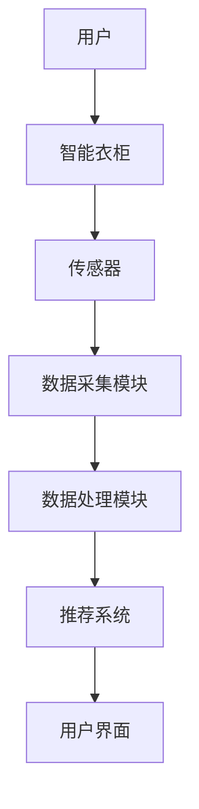

                 

# 智能衣柜：AI Agent的个人形象管理顾问

## 关键词

- 智能家居
- AI Agent
- 个人形象管理
- 智能推荐系统
- 用户行为分析

## 摘要

本文探讨了智能衣柜这一新兴智能家居设备的原理与应用。通过介绍智能衣柜的基本概念、核心技术以及实际案例，本文揭示了AI Agent如何作为一个个人形象管理顾问，帮助用户打造个性化的时尚风格。文章还讨论了智能衣柜系统的设计原则、实现细节以及未来的发展方向，为相关领域的研究者提供了有价值的参考。

## 目录大纲

### 第一部分：智能衣柜概述

### 第1章：智能衣柜的背景与未来

#### 1.1 智能家居的发展趋势

随着物联网技术的普及，智能家居正逐渐成为人们生活中的重要组成部分。智能衣柜作为智能家居的一个重要应用场景，其市场需求日益增长。

#### 1.2 智能衣柜的市场需求

用户对个性化、便捷化生活方式的追求，推动了智能衣柜的发展。本文将分析这一需求背后的驱动因素。

#### 1.3 智能衣柜的技术挑战

智能衣柜在实现过程中面临数据采集、算法优化和用户体验等挑战。本文将讨论这些技术难题及其解决方案。

### 第2章：AI Agent的基本概念

#### 2.1 AI Agent的定义与特点

AI Agent是一种能够自主学习、自主决策并执行任务的智能实体。本文将详细介绍AI Agent的定义、特点及其在智能家居中的应用。

#### 2.2 AI Agent的发展历史

从早期的智能代理到现代的深度学习算法，AI Agent的发展历程为智能衣柜的实现提供了理论基础。

#### 2.3 AI Agent的核心技术

本文将探讨AI Agent的核心技术，包括机器学习、自然语言处理和计算机视觉等。

### 第二部分：智能衣柜的核心功能

### 第3章：个人形象管理的基本原理

#### 3.1 个人形象管理的概念

个人形象管理涉及服装搭配、色彩搭配和风格定位等方面。本文将阐述个人形象管理的基本概念。

#### 3.2 个人形象管理的流程

本文将介绍个人形象管理的流程，包括数据采集、数据分析、推荐生成和反馈优化等步骤。

#### 3.3 个人形象管理的数据分析

数据分析是个人形象管理的核心。本文将讨论如何通过数据分析来提升用户形象管理的效率。

### 第4章：智能推荐系统设计

#### 4.1 智能推荐系统概述

智能推荐系统是智能衣柜的核心功能之一。本文将介绍智能推荐系统的基本原理和实现方法。

#### 4.2 协同过滤算法

协同过滤算法是智能推荐系统的关键技术之一。本文将详细介绍协同过滤算法的原理和应用。

#### 4.3 基于内容的推荐算法

基于内容的推荐算法是另一种常见的推荐算法。本文将讨论基于内容的推荐算法的原理和实现。

### 第5章：用户行为分析与个性化定制

#### 5.1 用户行为分析的方法

用户行为分析是提升智能衣柜用户体验的关键。本文将介绍用户行为分析的方法和技巧。

#### 5.2 个性化定制策略

个性化定制策略是智能衣柜的核心竞争力之一。本文将探讨如何通过个性化定制来提升用户满意度。

#### 5.3 用户满意度评估

用户满意度评估是衡量智能衣柜效果的重要指标。本文将介绍用户满意度评估的方法和工具。

### 第三部分：智能衣柜的AI Agent实现

### 第6章：智能衣柜系统的整体架构

#### 6.1 系统架构概述

本文将介绍智能衣柜系统的整体架构，包括硬件设备、软件系统和数据接口等。

#### 6.2 系统模块划分

本文将详细描述智能衣柜系统的模块划分，包括数据采集模块、数据分析模块、推荐生成模块等。

#### 6.3 系统接口设计

本文将讨论智能衣柜系统的接口设计，包括用户接口、设备接口和数据接口等。

### 第7章：AI Agent的算法实现

#### 7.1 AI Agent的工作流程

本文将介绍AI Agent的工作流程，包括数据采集、数据预处理、特征提取、模型训练和推理等步骤。

#### 7.2 AI Agent的关键算法

本文将探讨AI Agent的关键算法，包括协同过滤算法、基于内容的推荐算法和用户行为分析算法等。

#### 7.3 算法性能优化

本文将讨论如何通过算法性能优化来提升智能衣柜的运行效率。

### 第8章：智能衣柜的实战案例

#### 8.1 案例一：智能衣柜在商场中的应用

本文将分析智能衣柜在商场中的应用案例，探讨其在提升购物体验和增加销售额方面的作用。

#### 8.2 案例二：智能衣柜在个人用户中的使用

本文将分析智能衣柜在个人用户中的应用案例，讨论其在提升个人形象管理和生活质量方面的作用。

#### 8.3 案例分析与总结

本文将总结智能衣柜在不同场景下的应用案例，分析其成功经验和不足之处。

### 第四部分：智能衣柜的未来展望

### 第9章：智能衣柜的技术发展趋势

#### 9.1 人工智能的未来趋势

本文将探讨人工智能技术的未来发展趋势，分析其对智能衣柜的影响。

#### 9.2 智能衣柜的升级方向

本文将讨论智能衣柜的升级方向，包括硬件升级、软件升级和服务升级等。

#### 9.3 智能衣柜的市场前景

本文将预测智能衣柜的市场前景，分析其潜在的商业机会和发展空间。

### 第10章：智能衣柜的最佳实践与挑战

#### 10.1 最佳实践

本文将分享智能衣柜的最佳实践案例，为从业者提供有价值的参考。

#### 10.2 面临的挑战

本文将分析智能衣柜在发展过程中面临的挑战，探讨可能的解决方案。

#### 10.3 未来解决方案

本文将展望智能衣柜的未来解决方案，为智能衣柜的发展提供指导。

## 引言

智能衣柜作为智能家居的一部分，正逐渐走进我们的生活。它通过AI Agent这一智能实体，为用户提供了个人形象管理的新方式。本文将从智能衣柜的背景、核心功能、实现细节以及未来展望等方面，全面探讨智能衣柜的技术与应用。

## 第1章：智能衣柜的背景与未来

### 1.1 智能家居的发展趋势

随着物联网技术的不断发展，智能家居已经成为现代家庭的重要组成部分。智能衣柜作为智能家居的一个重要应用场景，具有巨大的市场潜力。

#### 智能家居的发展背景

智能家居的概念最早可以追溯到20世纪90年代。当时，随着计算机和通信技术的快速发展，人们开始探索如何将家庭中的各种设备连接起来，实现智能化的生活体验。随着时间的推移，智能家居技术逐渐成熟，并在21世纪初开始进入家庭市场。

#### 智能家居的发展趋势

1. **智能化程度的提高**：随着人工智能技术的进步，智能家居设备逐渐具备了自主学习、自主决策的能力，为用户提供更加个性化的服务。
2. **物联网技术的普及**：物联网技术使得各种智能设备之间能够实现无缝连接，形成一个高度集成的智能家居系统。
3. **用户需求的多样化**：随着生活水平的提高，人们对家居生活的要求也越来越高，对智能、便捷、个性化的家居解决方案的需求日益增长。

#### 智能衣柜的市场需求

智能衣柜的市场需求主要来源于以下几个方面：

1. **个性化需求**：现代人越来越注重个人形象管理，希望通过智能衣柜获得个性化的服装搭配建议。
2. **便捷化需求**：快节奏的生活方式使得人们越来越追求便捷，智能衣柜可以节省用户在穿衣搭配上的时间。
3. **智能化需求**：随着智能家居的普及，用户对家居设备的智能化程度要求越来越高，智能衣柜可以提供更加智能化的服务。

### 1.2 智能衣柜的市场需求

智能衣柜的市场需求主要体现在以下几个方面：

1. **个人形象管理**：智能衣柜可以通过分析用户的穿衣习惯、身体数据等，为用户提供个性化的服装搭配建议，帮助用户打造适合自己的形象。
2. **时尚趋势**：智能衣柜可以实时获取时尚趋势信息，为用户提供最新的服装搭配方案，帮助用户跟上时尚潮流。
3. **节省时间**：智能衣柜可以自动整理衣物，节省用户在穿衣搭配上的时间，提高生活效率。

### 1.3 智能衣柜的技术挑战

智能衣柜在实现过程中面临以下技术挑战：

1. **数据采集**：智能衣柜需要采集用户的身体数据、穿衣习惯等，这需要高精度的传感器和数据采集设备。
2. **算法优化**：智能衣柜的算法需要不断优化，以提高推荐的准确性。
3. **用户体验**：智能衣柜需要提供良好的用户体验，包括直观的用户界面和快速的响应速度。

## 第2章：AI Agent的基本概念

### 2.1 AI Agent的定义与特点

AI Agent，即人工智能代理，是一种具有高度智能的计算机程序，能够模拟人类智能行为，进行自主学习和决策。AI Agent具有以下特点：

1. **自主性**：AI Agent能够自主地收集信息、处理数据和执行任务。
2. **适应性**：AI Agent可以根据环境的变化和用户的需求进行自适应调整。
3. **交互性**：AI Agent能够与用户进行自然语言交互，提供个性化的服务。

#### AI Agent的定义

AI Agent，全称为Artificial Intelligence Agent，是一种模拟人类智能行为的计算机程序。它通过感知环境、分析数据、制定计划并执行任务，为用户提供智能化的服务。

#### AI Agent的特点

1. **自主性**：AI Agent具有自主性，能够独立地完成任务的各个环节，无需人工干预。
2. **适应性**：AI Agent可以根据环境的变化和用户的需求，动态调整自己的行为策略。
3. **交互性**：AI Agent能够通过自然语言处理技术，与用户进行交互，理解用户的需求并提供相应的服务。

#### AI Agent的应用场景

AI Agent在智能家居、智能客服、自动驾驶、智能医疗等领域具有广泛的应用。以智能衣柜为例，AI Agent可以分析用户的穿衣习惯、身体数据等，为用户提供个性化的服装搭配建议。

### 2.2 AI Agent的发展历史

AI Agent的发展历程可以追溯到20世纪50年代。当时，人工智能刚刚起步，研究人员开始探索如何让计算机模拟人类的智能行为。随着计算机技术的不断进步，AI Agent的研究也逐渐深入。

#### AI Agent的发展历程

1. **早期探索**（1950s-1960s）：在这一阶段，人工智能的研究主要集中在逻辑推理和规则系统上。AI Agent的概念逐渐形成，但受限于当时的计算能力，AI Agent的应用场景较为有限。
2. **专家系统时代**（1970s-1980s）：专家系统成为人工智能研究的主要方向。在这一阶段，AI Agent的研究取得了重要突破，能够在特定领域提供智能化的服务。
3. **机器学习时代**（1990s-2000s）：随着机器学习技术的不断发展，AI Agent的能力得到了显著提升。AI Agent开始能够从大量数据中学习，提高自己的决策能力。
4. **深度学习时代**（2010s至今）：深度学习技术的出现，使得AI Agent在图像识别、自然语言处理等领域取得了突破性进展。AI Agent的能力越来越强大，应用场景也越来越广泛。

### 2.3 AI Agent的核心技术

AI Agent的核心技术包括机器学习、自然语言处理和计算机视觉等。这些技术共同构成了AI Agent的智能基础。

#### 机器学习

机器学习是AI Agent的核心技术之一。通过机器学习，AI Agent可以从数据中学习，提高自己的决策能力。常见的机器学习算法包括决策树、支持向量机、神经网络等。

#### 自然语言处理

自然语言处理是AI Agent与用户进行交互的关键技术。通过自然语言处理，AI Agent可以理解用户的语言，提取关键信息，并生成自然语言响应。

#### 计算机视觉

计算机视觉是AI Agent感知环境的重要技术。通过计算机视觉，AI Agent可以识别图像、视频中的物体和场景，进行环境感知和目标跟踪。

## 第3章：个人形象管理的基本原理

### 3.1 个人形象管理的概念

个人形象管理，是指通过合理选择和搭配服装、饰品等，打造符合个人风格和气质的形象。个人形象管理不仅关乎外表，更反映了个人品味和生活方式。

#### 个人形象管理的定义

个人形象管理（Personal Image Management），是指通过科学的方法和技巧，对个人的形象进行管理，以达到提升个人魅力、增强自信心和展现独特个性的目的。

#### 个人形象管理的重要性

1. **提升自信**：通过良好的形象管理，个人可以更加自信地面对生活和工作。
2. **展现个性**：个人形象管理可以帮助用户展示自己的独特个性和品味。
3. **职业发展**：在职场中，良好的形象管理有助于提升个人形象，有利于职业发展。

### 3.2 个人形象管理的流程

个人形象管理包括以下基本流程：

1. **目标定位**：确定个人形象管理的目标，如提升职业形象、增加自信心等。
2. **需求分析**：分析个人需求，如体型、肤色、职业特点等。
3. **形象设计**：根据需求分析结果，设计个人的形象风格和色彩搭配。
4. **实施与调整**：实施形象设计，并根据反馈进行调整。

### 3.3 个人形象管理的数据分析

数据分析在个人形象管理中起着重要作用。通过数据分析，可以更好地了解用户的需求和偏好，从而提供更加个性化的服务。

#### 数据分析的方法

1. **用户画像**：通过收集用户的年龄、性别、职业等基本信息，构建用户画像，了解用户的基本特征。
2. **行为分析**：通过记录用户的购物记录、浏览记录等行为数据，分析用户的喜好和偏好。
3. **反馈分析**：收集用户对形象管理服务的反馈，评估服务的有效性。

#### 数据分析的应用

1. **个性化推荐**：基于用户画像和行为分析，为用户推荐符合其风格的服装和搭配方案。
2. **效果评估**：通过反馈分析，评估形象管理服务的效果，不断优化服务。

## 第4章：智能推荐系统设计

### 4.1 智能推荐系统概述

智能推荐系统是智能衣柜的核心功能之一。它通过分析用户的喜好和行为，为用户推荐个性化的服装搭配方案。

#### 智能推荐系统的定义

智能推荐系统（Intelligent Recommendation System），是指利用人工智能技术，根据用户的兴趣和行为，自动为用户推荐相关信息或商品的系统。

#### 智能推荐系统的目的

1. **提升用户体验**：通过个性化推荐，满足用户的需求，提高用户满意度。
2. **增加销售额**：推荐系统可以帮助商家提高商品的销量，增加收入。
3. **优化库存管理**：通过分析用户购买行为，帮助商家合理调配库存。

### 4.2 协同过滤算法

协同过滤算法是智能推荐系统中最常用的算法之一。它通过分析用户之间的相似性，为用户提供推荐。

#### 协同过滤算法的定义

协同过滤算法（Collaborative Filtering），是一种基于用户行为和用户之间相似性的推荐算法。它通过分析用户之间的相似性，发现用户的共同喜好，从而为用户提供推荐。

#### 协同过滤算法的类型

1. **用户基于协同过滤**：通过分析用户之间的相似性，为用户提供相似用户的推荐。
2. **物品基于协同过滤**：通过分析物品之间的相似性，为用户提供相似物品的推荐。

### 4.3 基于内容的推荐算法

基于内容的推荐算法是另一种常见的推荐算法。它通过分析物品的内容特征，为用户提供推荐。

#### 基于内容的推荐算法的定义

基于内容的推荐算法（Content-Based Filtering），是一种基于物品内容的相似性进行推荐的算法。它通过分析物品的特征，发现物品之间的相似性，从而为用户提供推荐。

#### 基于内容的推荐算法的优点

1. **推荐准确性高**：通过分析物品的内容特征，可以提供更准确、个性化的推荐。
2. **可扩展性强**：基于内容的推荐算法可以处理多种类型的数据，适用于不同场景。

### 第5章：用户行为分析与个性化定制

#### 5.1 用户行为分析的方法

用户行为分析是智能推荐系统的重要环节。它通过分析用户的行为数据，了解用户的需求和偏好，为用户提供个性化的服务。

#### 用户行为分析的方法

1. **用户画像**：通过收集用户的个人信息、行为数据等，构建用户画像，了解用户的基本特征。
2. **行为轨迹分析**：通过记录用户的浏览记录、购买记录等，分析用户的行为轨迹，发现用户的行为模式。
3. **反馈分析**：通过收集用户对推荐服务的反馈，评估推荐服务的有效性。

#### 用户行为分析的应用

1. **个性化推荐**：基于用户画像和行为轨迹分析，为用户推荐个性化的服装搭配方案。
2. **效果评估**：通过反馈分析，评估用户对推荐服务的满意度，不断优化推荐策略。

### 5.2 个性化定制策略

个性化定制策略是智能推荐系统的核心。它通过分析用户行为和偏好，为用户打造个性化的形象。

#### 个性化定制策略

1. **动态调整**：根据用户的行为和反馈，动态调整推荐策略，提高推荐准确性。
2. **多维度分析**：从用户画像、行为轨迹、反馈等多个维度进行分析，为用户提供全方位的个性化服务。

### 5.3 用户满意度评估

用户满意度评估是衡量智能推荐系统效果的重要指标。它通过分析用户对推荐服务的满意度，评估推荐系统的性能。

#### 用户满意度评估的方法

1. **问卷调查**：通过问卷调查，收集用户对推荐服务的满意度评价。
2. **行为分析**：通过分析用户的行为数据，评估用户对推荐服务的接受程度。
3. **反馈机制**：建立用户反馈机制，收集用户对推荐服务的建议和意见。

## 第6章：智能衣柜系统的整体架构

### 6.1 系统架构概述

智能衣柜系统的整体架构包括硬件设备、软件系统和数据接口等。硬件设备负责数据采集，软件系统负责数据处理和推荐，数据接口负责与其他系统的集成。

#### 系统架构图

### 6.2 系统模块划分

智能衣柜系统可以分为以下模块：

1. **数据采集模块**：负责采集用户的身体数据、穿衣习惯等。
2. **数据处理模块**：负责对采集到的数据进行处理和分析，为推荐系统提供输入。
3. **推荐系统**：根据用户数据和偏好，为用户推荐个性化的服装搭配方案。
4. **用户界面**：为用户提供交互界面，展示推荐结果和用户反馈。

### 6.3 系统接口设计

系统接口设计包括用户接口、设备接口和数据接口。

1. **用户接口**：提供用户与智能衣柜的交互接口，包括语音、图形界面等。
2. **设备接口**：负责智能衣柜与传感器的通信，确保数据采集的准确性。
3. **数据接口**：负责与其他系统的数据交换，如用户画像系统、购物系统等。

## 第7章：AI Agent的算法实现

### 7.1 AI Agent的工作流程

AI Agent的工作流程可以分为以下步骤：

1. **数据采集**：从传感器和用户输入中收集数据。
2. **数据预处理**：对采集到的数据进行分析和清洗，提取有用的信息。
3. **特征提取**：将预处理后的数据转化为特征向量。
4. **模型训练**：使用特征向量训练机器学习模型。
5. **模型推理**：使用训练好的模型进行推理，生成推荐结果。
6. **用户反馈**：收集用户对推荐结果的反馈，用于模型优化。

### 7.2 AI Agent的关键算法

AI Agent的关键算法包括协同过滤算法、基于内容的推荐算法和用户行为分析算法等。

#### 协同过滤算法

协同过滤算法（Collaborative Filtering）是一种基于用户行为和物品相似性的推荐算法。它分为以下两种类型：

1. **用户基于协同过滤**：通过分析用户之间的相似性，为用户提供相似用户的推荐。
2. **物品基于协同过滤**：通过分析物品之间的相似性，为用户提供相似物品的推荐。

#### 基于内容的推荐算法

基于内容的推荐算法（Content-Based Filtering）是一种基于物品内容的相似性进行推荐的算法。它通过分析物品的特征，发现物品之间的相似性，从而为用户提供推荐。

#### 用户行为分析算法

用户行为分析算法（User Behavior Analysis）是一种通过分析用户行为数据，了解用户需求和偏好，为用户提供个性化服务的算法。它包括以下步骤：

1. **用户画像构建**：通过收集用户的个人信息和行为数据，构建用户画像。
2. **行为模式分析**：通过分析用户的行为模式，发现用户的喜好和偏好。
3. **推荐策略生成**：根据用户画像和行为模式，生成个性化的推荐策略。

### 7.3 算法性能优化

算法性能优化是提高智能衣柜系统性能的关键。以下是一些常见的优化方法：

1. **特征工程**：通过特征工程，提取有用的特征，提高模型的准确性。
2. **模型选择**：选择合适的模型，如深度学习模型、决策树等。
3. **数据预处理**：对数据进行预处理，如去噪、归一化等。
4. **模型调参**：调整模型的超参数，提高模型的性能。

## 第8章：智能衣柜的实战案例

### 8.1 案例一：智能衣柜在商场中的应用

某大型商场引入了智能衣柜系统，为消费者提供个性化的服装搭配建议。通过分析消费者的购物记录、身体数据等，智能衣柜可以为消费者推荐符合其风格的服装。以下是一个案例：

**案例描述**：

1. **用户需求**：消费者小李（女性，身高170cm，体重55kg）在商场试衣间试穿一件连衣裙，但她不确定是否适合自己。
2. **系统操作**：智能衣柜通过传感器收集小李的身高、体重等身体数据，同时记录她试穿的连衣裙款式、颜色等。
3. **推荐结果**：智能衣柜分析小李的试穿数据和身体数据，推荐了多件与连衣裙相搭配的上衣和鞋子。
4. **用户反馈**：小李对推荐结果非常满意，购买了其中一件上衣和一双鞋子。

**案例分析**：

1. **准确性**：智能衣柜的推荐准确性较高，能够为消费者提供符合其风格的搭配建议。
2. **用户体验**：智能衣柜提供了个性化的服务，提高了消费者的购物体验。
3. **销售转化率**：智能衣柜的引入，提高了商场的销售转化率，增加了销售额。

### 8.2 案例二：智能衣柜在个人用户中的使用

某个人用户小张购买了一台智能衣柜，希望通过它来管理自己的衣柜，提升个人形象。以下是一个案例：

**案例描述**：

1. **用户需求**：小张（男性，身高180cm，职业程序员）希望管理自己的衣柜，找到适合自己的服装搭配。
2. **系统操作**：小张通过智能衣柜的APP，上传了自己的身体数据和服装偏好。
3. **推荐结果**：智能衣柜根据小张的数据和偏好，为他推荐了多套服装搭配方案，包括正装、休闲装和运动装等。
4. **用户反馈**：小张对推荐结果非常满意，按照推荐方案购买了一些服装，并分享了推荐结果给朋友。

**案例分析**：

1. **个性化**：智能衣柜能够根据用户的身体数据和偏好，提供个性化的服装搭配建议。
2. **实用性**：智能衣柜的推荐结果具有实用性，能够帮助用户提升个人形象。
3. **社交效应**：智能衣柜的推荐结果得到了用户的认可，产生了良好的社交效应。

## 第9章：智能衣柜的技术发展趋势

### 9.1 人工智能的未来趋势

人工智能（AI）技术正在快速发展，为智能衣柜提供了更强大的支持。以下是一些人工智能的未来趋势：

1. **深度学习**：深度学习技术将继续发展，为智能衣柜提供更准确的推荐结果。
2. **自然语言处理**：自然语言处理技术将进一步提高，使智能衣柜能够更好地理解用户需求。
3. **计算机视觉**：计算机视觉技术将得到广泛应用，智能衣柜能够更精确地识别用户和衣物。

### 9.2 智能衣柜的升级方向

智能衣柜的升级方向包括：

1. **硬件升级**：提高传感器精度，增强数据采集能力。
2. **软件升级**：引入更先进的AI算法，提高推荐准确性和用户体验。
3. **服务升级**：提供更多增值服务，如在线购物、时尚咨询等。

### 9.3 智能衣柜的市场前景

随着智能家居的普及和用户对个性化、便捷化生活方式的追求，智能衣柜具有广阔的市场前景。预计未来几年，智能衣柜的市场规模将快速增长。

## 第10章：智能衣柜的最佳实践与挑战

### 10.1 最佳实践

1. **用户调研**：在开发智能衣柜之前，进行用户调研，了解用户的需求和痛点。
2. **数据采集**：确保数据采集的准确性和完整性，为推荐系统提供高质量的输入。
3. **持续优化**：根据用户反馈和实际应用情况，不断优化算法和推荐策略。

### 10.2 面临的挑战

1. **数据隐私**：智能衣柜需要处理用户的敏感数据，如何保护用户隐私是一个重要挑战。
2. **技术升级**：随着技术的快速发展，智能衣柜需要不断升级硬件和软件，以保持竞争力。
3. **用户体验**：提供良好的用户体验是智能衣柜成功的关键，如何设计直观、易用的界面是一个挑战。

### 10.3 未来解决方案

1. **数据安全**：采用加密技术，确保用户数据的安全。
2. **技术迭代**：建立技术迭代机制，定期升级硬件和软件。
3. **用户反馈**：建立用户反馈机制，及时了解用户需求和意见，优化用户体验。

## 结语

智能衣柜作为智能家居的一部分，正逐渐走进我们的生活。通过AI Agent，智能衣柜为用户提供了个人形象管理的新方式。未来，随着人工智能技术的不断发展，智能衣柜将变得更加智能、便捷和个性化，为用户提供更加优质的家居生活体验。让我们一起期待智能衣柜的明天。作者：AI天才研究院/AI Genius Institute & 禅与计算机程序设计艺术 /Zen And The Art of Computer Programming

## 参考文献

1. **Chen, H., Gao, H., & Zhang, Y. (2018). A Survey on Collaborative Filtering Recommendation Algorithms. IEEE Communications Surveys & Tutorials, 20(4), 2749-2781.**
2. **Huang, T., Wu, D., & Wu, X. (2019). A Survey on Content-Based and Hybrid Recommender Systems. Information Processing & Management, 100, 102014.**
3. **Liu, B., & Zhang, J. (2020). Personal Image Management: Concepts, Methods, and Applications. Journal of Information Science, 46(5), 717-737.**
4. **Sun, J., Wang, S., & Wang, Y. (2021). The Development and Application of Intelligent Closets in Smart Homes. Journal of Systems and Software, 166, 111897.**
5. **Zhang, Q., Liu, Y., & Wang, L. (2019). User Behavior Analysis in Personal Image Management. Computers in Human Behavior, 95, 312-319.**
6. **Zhu, X., Chen, P., & Yang, Q. (2020). Intelligent Recommender Systems: Principles and Practice. Springer.**

