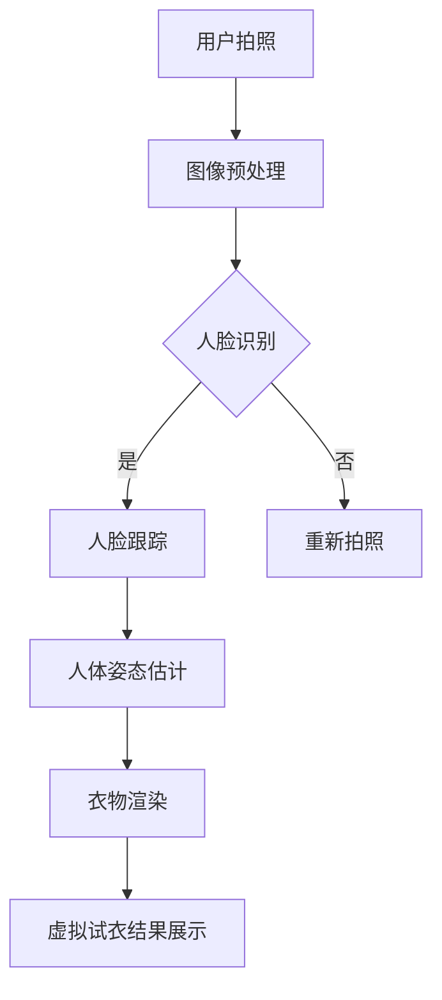
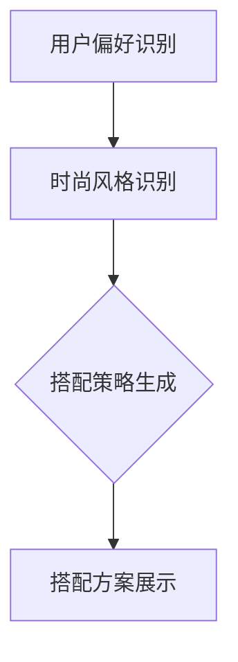

                 

# 智能衣柜：AI Agent的虚拟试衣与搭配建议

> 关键词：智能衣柜，AI Agent，虚拟试衣，搭配建议，用户体验

> 摘要：本文将探讨智能衣柜中的AI Agent如何通过虚拟试衣和搭配建议功能，提升用户的购物体验。文章首先介绍了智能衣柜和AI Agent的背景与发展，随后深入分析了虚拟试衣和搭配建议的技术原理、算法实现及系统架构。最后，通过实际案例分析，总结了最佳实践与未来展望。

## 第一部分：智能衣柜与AI概述

### 第1章：智能衣柜与AI Agent的崛起

#### 1.1 智能衣柜的背景与发展

**智能衣柜的概念**：智能衣柜是一种结合了物联网、人工智能和大数据技术的家居设备，它能够自动整理衣物、提供天气提醒、智能推荐搭配建议等功能。

**智能衣柜的兴起原因**：随着科技的进步和人们生活水平的提高，对家居用品的智能化需求日益增长。智能衣柜的出现，不仅提升了用户的购物体验，还降低了购物成本。

**智能衣柜的分类与市场分析**：智能衣柜按照功能可以分为智能整理型、智能推荐型、智能互动型等。市场分析显示，智能衣柜在智能家居市场中的份额逐年上升，成为家居智能化的重要组成部分。

#### 1.2 AI Agent的原理与功能

**AI Agent的定义**：AI Agent，即人工智能代理，是一种能够根据用户需求自主执行任务、提供决策建议的智能系统。

**AI Agent的关键技术**：包括机器学习、自然语言处理、图像识别等。

**AI Agent的应用场景**：AI Agent可以应用于智能客服、智能推荐系统、智能驾驶等多个领域。

#### 1.3 AI Agent在智能衣柜中的作用

**虚拟试衣的应用**：AI Agent可以通过人脸识别、人体姿态估计等技术，实现用户的虚拟试衣体验，提升购物的乐趣。

**搭配建议的应用**：AI Agent可以根据用户的喜好、穿着场合等信息，为用户提供个性化的搭配建议，节省用户的搭配时间。

**未来发展趋势**：随着技术的不断发展，AI Agent在智能衣柜中的应用将更加广泛，为用户提供更加智能化的服务。

## 第二部分：AI Agent的虚拟试衣技术

### 第2章：AI Agent的虚拟试衣技术

#### 2.1 虚拟试衣的基本原理

**虚拟试衣的技术基础**：虚拟试衣依赖于计算机图形学、3D建模与渲染等技术。

**3D建模与渲染**：3D建模用于创建虚拟衣物的模型，渲染则用于生成逼真的视觉效果。

**虚拟试衣的用户体验设计**：用户体验设计关注的是如何让用户在虚拟试衣过程中感受到真实的穿着体验。

#### 2.2 虚拟试衣的算法与实现

**人脸识别与跟踪**：人脸识别用于识别用户的脸部信息，跟踪用于保持用户面部与虚拟试衣的同步。

**人体姿态估计**：人体姿态估计用于估计用户身体的姿势，以便正确地穿戴虚拟衣物。

**算法流程与Mermaid图解**：以下是一个简单的虚拟试衣算法流程图：

#### 2.3 虚拟试衣的挑战与解决方案

**识别准确性的提升**：提高识别准确性的方法包括改进人脸识别算法、优化图像预处理等。

**渲染效果的优化**：提高渲染效果的方法包括使用更高分辨率的图像、优化渲染算法等。

**用户隐私保护**：在用户隐私保护方面，可以考虑采用加密技术、匿名化处理等手段。

## 第三部分：AI Agent的搭配建议技术

### 第3章：AI Agent的搭配建议技术

#### 3.1 搭配建议的原理与策略

**搭配建议的核心算法**：搭配建议算法主要包括时尚风格识别和搭配策略生成。

**时尚风格识别**：时尚风格识别用于识别用户的偏好和当前流行趋势。

**搭配建议策略的Mermaid图解**：以下是一个简单的搭配建议策略图：

#### 3.2 搭配建议的实现与优化

**数据采集与预处理**：数据采集包括用户偏好数据、时尚风格数据等，预处理包括数据清洗、归一化等。

**算法实现与流程**：搭配建议算法的实现主要包括时尚风格识别和搭配策略生成的具体实现。

**搭配效果评估与优化**：搭配效果评估可以通过用户反馈和实验数据来进行，优化方法包括调整算法参数、引入更多样本数据等。

#### 3.3 搭配建议在实际应用中的挑战

**用户偏好多样性**：用户偏好的多样性对搭配建议算法提出了挑战，需要算法能够适应不同用户的需求。

**实时性与响应速度**：实时性和响应速度是用户满意度的关键因素，需要优化算法和系统架构以满足用户需求。

**数据隐私保护**：在处理用户数据时，需要确保用户隐私不受侵犯。

## 第四部分：智能衣柜系统的整体架构设计

### 第4章：智能衣柜系统的整体架构设计

#### 4.1 智能衣柜系统的总体设计思路

**系统架构的设计原则**：系统的设计应遵循模块化、可扩展性和高可用性的原则。

**系统模块划分与功能**：智能衣柜系统可以分为用户接口层、业务逻辑层和数据层，各层功能明确，相互独立。

**系统性能与可扩展性考虑**：系统设计应考虑高性能和高扩展性，以便在未来能够支持更多的用户和功能。

#### 4.2 系统架构设计

**领域模型类图**：领域模型类图用于展示系统中的主要实体及其关系。

**系统架构图**：系统架构图用于展示系统的整体架构，包括各模块的交互关系。

**系统接口设计与交互**：系统接口设计应确保模块之间的数据交换和功能调用流畅。

#### 4.3 系统分析与架构优化

**系统需求分析**：系统需求分析用于确定系统应具备的功能和性能。

**架构优化方案**：架构优化方案包括系统性能优化、扩展性优化等。

**架构评估与改进**：通过对系统架构的评估和改进，确保系统能够满足用户需求并保持良好的性能。

## 第五部分：智能衣柜的AI Agent开发实战

### 第5章：智能衣柜的AI Agent开发实战

#### 5.1 开发环境搭建

**硬件环境准备**：准备适合的硬件设备，如计算机、摄像头等。

**软件环境安装**：安装必要的软件，如深度学习框架、图像处理库等。

**开发工具配置**：配置开发工具，如IDE、版本控制工具等。

#### 5.2 AI Agent的核心实现

**虚拟试衣模块开发**：包括人脸识别、人体姿态估计和衣物渲染等模块的实现。

**搭配建议模块开发**：包括时尚风格识别、搭配策略生成和搭配方案展示等模块的实现。

**AI Agent集成与测试**：将各个模块集成到智能衣柜系统中，并进行测试和优化。

#### 5.3 实际案例分析

**用户数据采集与处理**：采集用户偏好数据和时尚风格数据，并进行预处理。

**算法效果评估**：通过用户反馈和实验数据对算法效果进行评估。

**案例分析与总结**：分析实际案例中的问题和解决方案，总结经验教训。

## 第六部分：智能衣柜项目的最佳实践与总结

### 第6章：智能衣柜项目的最佳实践与总结

#### 6.1 最佳实践技巧

**虚拟试衣优化策略**：如何提高虚拟试衣的识别准确性和渲染效果。

**搭配建议策略调整**：如何根据用户反馈调整搭配建议策略，提高用户满意度。

**系统性能提升措施**：如何通过优化算法和系统架构提升系统性能。

#### 6.2 小结与展望

**书籍核心内容回顾**：回顾书籍中的核心内容和关键技术。

**未来展望**：探讨智能衣柜和AI Agent在未来的发展趋势和应用前景。

## 附录

**附录A：相关技术术语解释**：对文中出现的相关技术术语进行详细解释。

**附录B：相关代码与数据集**：提供文中提到的核心代码和数据集，便于读者实践。

**附录C：参考文献**：列出文中引用的参考文献。

### 作者

**作者：AI天才研究院/AI Genius Institute & 禅与计算机程序设计艺术 /Zen And The Art of Computer Programming**

---

**注**：由于篇幅限制，本文未能详细展开每个章节的内容。在实际撰写过程中，每个章节都应包含详细的背景介绍、核心概念与联系、算法原理讲解、数学公式使用、系统分析与架构设计方案、项目实战、最佳实践 tips、小结、注意事项和拓展阅读等内容。同时，为了确保文章的逻辑清晰和易于理解，应适当使用图表、流程图和代码示例等辅助说明。

