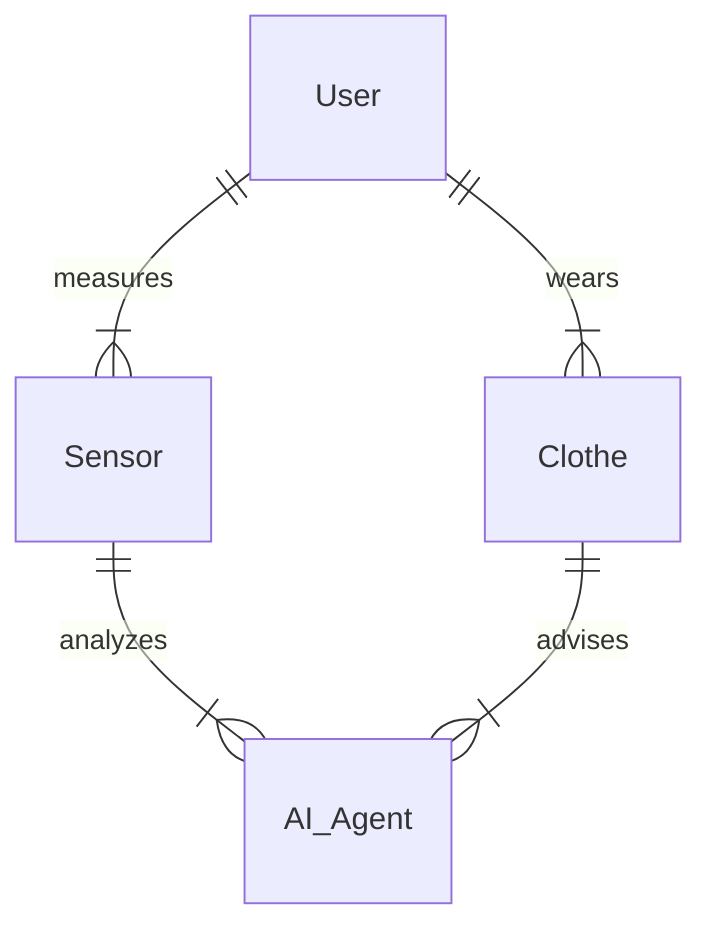
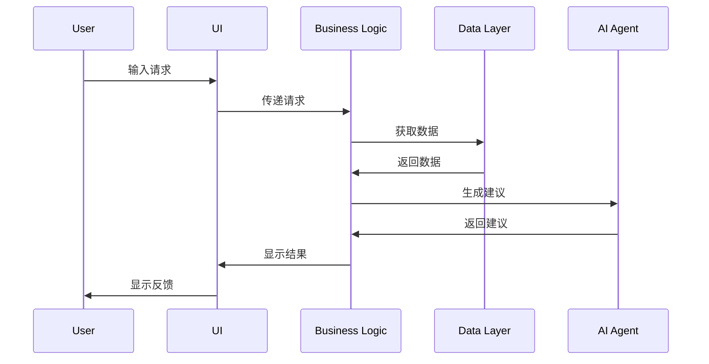
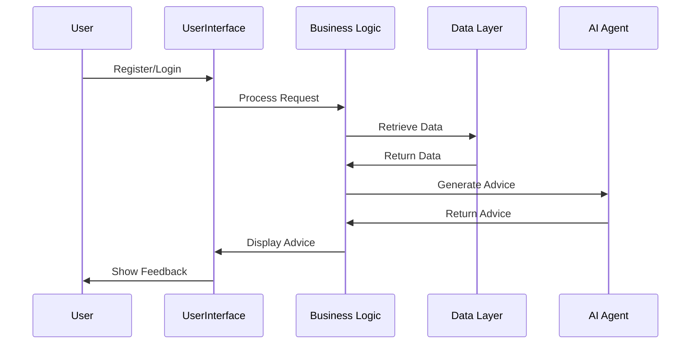

                 

### 背景介绍

#### 第1章：智能衣柜概述

#### 1.1 智能衣柜的概念与背景

**1.1.1 智能衣柜的定义**

智能衣柜是一种集成了人工智能（AI）技术的现代衣柜系统，它不仅具备传统衣柜的存储和取衣功能，还能通过AI算法和传感器技术实现衣物的智能管理。智能衣柜通常包含以下基本组成部分：一个或多个存储单元、一个或多个传感器、一个或多个执行器、一个或多个数据处理器以及一个用户交互界面。

**1.1.2 智能衣柜的发展历程**

智能衣柜的概念最早可以追溯到20世纪末，当时主要是通过简单的电子传感器和自动执行器实现基础的功能。随着计算机技术和人工智能技术的发展，智能衣柜逐渐变得更加智能和复杂。21世纪初，随着物联网（IoT）技术的发展，智能衣柜开始集成更多的传感器和数据处理能力，能够更精准地记录和预测用户的行为。

**1.1.3 智能衣柜的应用现状**

目前，智能衣柜已经在许多高端住宅和商业环境中得到应用。一些智能衣柜品牌，如SmartThings、Samsung Smart Fridge等，已经将智能衣柜作为其智能家居系统的一部分，提供更为全面和便捷的家居生活体验。智能衣柜的应用场景包括自动整理衣物、智能防潮、智能换季管理、健康监测等。

#### 1.2 AI Agent在衣物保养建议中的角色

**1.2.1 AI Agent的基本概念**

AI Agent，即人工智能代理，是一种能够独立执行任务、适应环境并做出决策的人工智能系统。它通常具有感知、思考、行动和学习的功能。在智能衣柜系统中，AI Agent可以作为衣物保养建议的提供者，通过对用户行为的分析、环境数据的感知和衣物特性的理解，生成个性化的保养建议。

**1.2.2 AI Agent在衣物保养中的功能**

AI Agent在衣物保养中的功能主要包括：

- **预测衣物损坏**：通过分析衣物使用频率、洗涤次数等信息，预测衣物可能出现的损坏情况。
- **提供保养建议**：根据衣物材质、颜色、款式等特性，为用户生成最佳的保养建议，如洗涤方式、晾晒方式等。
- **健康管理**：监测衣物上可能存在的细菌和有害物质，提供衣物的健康保养建议。
- **换季管理**：根据季节变化，智能调整衣物的存储和更换策略。

**1.2.3 AI Agent的优势**

AI Agent在衣物保养建议中的优势主要体现在以下几个方面：

- **个性化**：AI Agent能够根据用户的具体需求和环境变化，提供高度个性化的保养建议。
- **自动化**：AI Agent能够自动化执行保养建议，减少用户的操作负担。
- **准确性**：AI Agent基于大数据分析和机器学习算法，能够提供更加准确和有效的保养建议。

#### 1.3 书籍目的

**1.3.1 如何利用AI Agent提供衣物保养建议**

本书籍的目的在于详细介绍如何利用AI Agent提供个性化的衣物保养建议。通过以下步骤，用户可以轻松实现这一目标：

1. **数据收集**：通过智能衣柜传感器收集衣物使用、洗涤、晾晒等相关数据。
2. **数据分析**：利用机器学习算法对收集到的数据进行处理，提取有用的信息。
3. **建议生成**：根据分析结果，AI Agent将生成个性化的衣物保养建议。
4. **建议实施**：用户根据AI Agent的建议执行相应的保养操作。

**1.3.2 读者受益**

通过阅读本书，读者将获得以下受益：

- **了解智能衣柜与AI Agent的基本概念**：掌握智能衣柜和AI Agent的工作原理和应用场景。
- **学习数据分析与机器学习算法**：了解如何利用数据分析技术生成衣物保养建议。
- **提升衣物保养水平**：学会如何根据AI Agent的建议，更好地保养衣物，延长衣物使用寿命。
- **提升生活品质**：通过智能衣柜和AI Agent的应用，提升日常生活的便捷性和舒适度。

**1.3.3 书籍结构安排**

本书结构安排如下：

- **第一部分：背景介绍**：介绍智能衣柜和AI Agent的基本概念和背景。
- **第二部分：核心概念与联系**：详细解析AI Agent、衣物保养和个性化建议等核心概念，并展示ER实体关系图。
- **第三部分：算法原理讲解**：讲解K-近邻算法和决策树算法等用于衣物保养建议的算法原理。
- **第四部分：系统分析与架构设计方案**：介绍智能衣柜系统的架构设计和实现方法。
- **第五部分：项目实战**：通过实际项目案例，展示如何利用AI Agent提供衣物保养建议。
- **第六部分：最佳实践 tips、小结、注意事项、拓展阅读**：提供实践中的最佳方法和小结，提醒注意事项，推荐拓展阅读材料。

通过本书籍的系统学习和实践，读者将能够掌握智能衣柜和AI Agent在衣物保养中的应用，提升个人生活品质。

---

### 核心概念与联系

#### 第2章：关键概念解析

#### 2.1 AI Agent的原理与类型

**2.1.1 AI Agent的基本原理**

AI Agent，即人工智能代理，是一种能够模拟人类智能行为，具备一定自主性和适应性的计算机程序。AI Agent通常包括以下核心功能：

- **感知**：通过传感器获取外部环境信息。
- **思考**：利用算法和模型对感知信息进行处理和分析。
- **行动**：根据分析结果执行相应的操作。
- **学习**：通过不断学习优化自身的行为。

AI Agent的工作原理通常基于以下步骤：

1. **感知阶段**：AI Agent通过传感器获取环境信息，如温度、湿度、衣物状态等。
2. **分析阶段**：AI Agent利用机器学习算法和逻辑推理对感知信息进行分析和处理。
3. **决策阶段**：根据分析结果，AI Agent做出决策，生成建议或执行操作。
4. **执行阶段**：AI Agent根据决策执行相应的操作，如调整温度、启动清洗程序等。

**2.1.2 AI Agent的类型与特点**

根据功能和应用场景的不同，AI Agent可以分为以下几类：

- **任务型AI Agent**：专注于完成特定任务的AI Agent，如智能家居控制、语音助手等。
- **社交型AI Agent**：具备社交能力的AI Agent，能够与人类进行自然语言交互，如聊天机器人。
- **服务型AI Agent**：提供服务的AI Agent，如医疗诊断助手、金融投资顾问等。
- **自主型AI Agent**：具备高度自主性和适应性的AI Agent，能够自主完成复杂任务，如自动驾驶汽车。

每种类型的AI Agent都有其独特的特点和应用场景。例如，任务型AI Agent通常应用于自动化控制领域，社交型AI Agent则广泛应用于客户服务领域。

**2.1.3 AI Agent的优缺点比较**

AI Agent在衣物保养中的应用具有以下优缺点：

**优点**：

- **个性化**：AI Agent能够根据用户的个人需求和衣物特性，提供高度个性化的保养建议。
- **自动化**：AI Agent能够自动化执行保养建议，减少用户的操作负担。
- **高效性**：AI Agent能够快速分析大量数据，生成准确的保养建议。
- **适应性**：AI Agent能够根据环境变化和用户行为调整保养策略。

**缺点**：

- **依赖数据**：AI Agent的准确性和效能高度依赖数据的质量和数量。
- **算法复杂度**：一些复杂的AI算法需要大量的计算资源和时间。
- **隐私问题**：AI Agent需要收集用户的个人数据，存在隐私泄露的风险。

**2.2 衣物保养的基本知识**

**2.2.1 衣物的材料与特性**

衣物的材料多种多样，常见的包括棉、麻、丝、毛、合成纤维等。每种材料都有其独特的特性，如吸湿性、透气性、耐磨性等。衣物的保养方法通常取决于其材料特性。例如，棉质衣物适合使用温水洗涤，毛质衣物则需要使用冷水和专业的洗涤剂。

**2.2.2 衣物保养的重要性**

衣物保养的目的是延长衣物的使用寿命，保持其原有质感和外观。良好的衣物保养方法可以防止衣物出现褪色、磨损、变形等问题。此外，衣物保养还能有效减少衣物中的细菌和有害物质，提高用户的健康水平。

**2.2.3 常见的衣物保养方法**

常见的衣物保养方法包括：

- **洗涤**：根据衣物的材料选择合适的洗涤剂和温度。
- **晾晒**：选择合适的位置和时间进行晾晒，避免阳光直射和高温。
- **存放**：选择合适的存放位置和方式，避免潮湿和折叠损伤。
- **护理**：定期进行专业护理，如干洗、熨烫等。

**2.3 个性化建议的实现**

**2.3.1 个性化建议的概念**

个性化建议是指根据用户的个人需求和衣物特性，为用户量身定制的建议。在智能衣柜系统中，个性化建议的实现需要基于用户行为分析、衣物特性分析和环境数据分析。

**2.3.2 个性化建议的实现方法**

实现个性化建议的方法主要包括：

- **用户行为分析**：通过智能衣柜传感器记录用户的行为数据，如衣物的穿着频率、洗涤次数等。
- **衣物特性分析**：分析衣物的材料、颜色、款式等特性，为用户提供适合的保养建议。
- **环境数据分析**：利用环境传感器记录温度、湿度等环境数据，为用户提供最佳的环境保养建议。

**2.3.3 个性化建议的优势**

个性化建议的优势在于：

- **针对性**：根据用户的个人需求和环境特点，提供具体的保养建议，提高衣物的保养效果。
- **高效性**：通过数据分析，快速生成准确的保养建议，节省用户的时间。
- **人性化**：考虑用户的个人喜好和习惯，提供人性化的保养建议，提升用户的生活品质。

**2.4 ER实体关系图**

**2.4.1 ER实体关系图的基本概念**

ER实体关系图（Entity-Relationship Diagram，简称ER图）是数据库设计中的一个重要工具，用于描述实体之间的联系和关系。ER图由实体、属性和关系三部分组成。

- **实体**：表示数据库中的对象，如用户、衣物等。
- **属性**：表示实体的特征，如用户的姓名、年龄等。
- **关系**：表示实体之间的关联，如用户与衣物之间的购买关系。

**2.4.2 智能衣柜系统的ER实体关系图**

智能衣柜系统的ER实体关系图包括以下几个核心实体及其关系：

- **用户**：包含用户的基本信息，如姓名、年龄、性别等。
- **衣物**：包含衣物的详细信息，如衣物名称、材料、颜色等。
- **传感器**：记录衣物和环境的数据，如温度、湿度、衣物状态等。
- **AI Agent**：生成衣物保养建议，根据用户行为和衣物特性进行分析。

以下是一个简化的智能衣柜系统的ER实体关系图：



**2.4.3 实体关系图的作用**

实体关系图在智能衣柜系统设计中的作用包括：

- **明确系统架构**：通过ER实体关系图，明确系统中的核心实体及其关系，有助于系统架构的设计和优化。
- **需求分析**：通过ER实体关系图，可以更清晰地理解用户需求和系统功能，为需求分析提供支持。
- **数据库设计**：ER实体关系图是数据库设计的重要依据，有助于构建合理的数据库模型。

---

通过本章的内容，我们对AI Agent、衣物保养和个性化建议等核心概念有了更深入的了解。下一章我们将进一步探讨AI Agent算法原理，包括K-近邻算法和决策树算法的具体实现和应用。

---

### 算法原理讲解

#### 第3章：AI Agent算法原理

#### 3.1 K-近邻算法

**3.1.1 K-近邻算法的基本原理**

K-近邻算法（K-Nearest Neighbors，简称KNN）是一种简单的机器学习算法，用于分类和回归分析。其基本原理是：如果一个新样本在特征空间中的K个最近邻的多数类别标签相同，则该新样本被归类为这个多数类别。

**3.1.2 K-近邻算法的流程**

K-近邻算法的基本流程如下：

1. **训练阶段**：收集并标记大量已知样本，将它们存储在特征空间中。
2. **测试阶段**：对于新样本，计算它到训练样本的距离。
3. **投票阶段**：选取距离最近的K个样本，根据这K个样本的类别标签进行投票。
4. **决策阶段**：根据投票结果，将新样本归类为得票最多的类别。

**3.1.3 K-近邻算法的Python实现**

下面是一个简单的K-近邻算法实现：

```python
from sklearn.neighbors import KNeighborsClassifier
from sklearn.datasets import load_iris
from sklearn.model_selection import train_test_split

# 加载数据集
iris = load_iris()
X_train, X_test, y_train, y_test = train_test_split(iris.data, iris.target, test_size=0.3, random_state=42)

# 创建K-近邻分类器
knn = KNeighborsClassifier(n_neighbors=3)

# 训练模型
knn.fit(X_train, y_train)

# 进行预测
predictions = knn.predict(X_test)

# 评估模型
accuracy = knn.score(X_test, y_test)
print(f"Model accuracy: {accuracy:.2f}")
```

**3.1.4 K-近邻算法的数学模型和公式**

K-近邻算法的核心在于计算新样本与训练样本之间的距离。常用的距离度量方法包括欧几里得距离、曼哈顿距离和切比雪夫距离。

- **欧几里得距离**：$$d(x, y) = \sqrt{\sum_{i=1}^{n} (x_i - y_i)^2}$$
- **曼哈顿距离**：$$d(x, y) = \sum_{i=1}^{n} |x_i - y_i|$$
- **切比雪夫距离**：$$d(x, y) = \max_{1\le i \le n} |x_i - y_i|$$

**3.1.5 K-近邻算法的举例说明**

假设我们有以下两个样本点：

- 样本A：[1, 2, 3]
- 样本B：[4, 5, 6]

计算样本A和样本B之间的欧几里得距离：

$$d(A, B) = \sqrt{(1-4)^2 + (2-5)^2 + (3-6)^2} = \sqrt{9 + 9 + 9} = \sqrt{27} = 3\sqrt{3}$$

现在，我们有五个训练样本：

- 样本1：[1, 2, 3]
- 样本2：[2, 3, 4]
- 样本3：[3, 4, 5]
- 样本4：[4, 5, 6]
- 样本5：[5, 6, 7]

计算样本B与每个训练样本之间的欧几里得距离：

- 样本B与样本1的距离：$$d(B, A) = 3\sqrt{3}$$
- 样本B与样本2的距离：$$d(B, B_2) = \sqrt{(4-2)^2 + (5-3)^2 + (6-4)^2} = \sqrt{4 + 4 + 4} = \sqrt{12} = 2\sqrt{3}$$
- 样本B与样本3的距离：$$d(B, B_3) = \sqrt{(4-3)^2 + (5-4)^2 + (6-5)^2} = \sqrt{1 + 1 + 1} = \sqrt{3}$$
- 样本B与样本4的距离：$$d(B, B_4) = \sqrt{(4-4)^2 + (5-5)^2 + (6-6)^2} = 0$$
- 样本B与样本5的距离：$$d(B, B_5) = \sqrt{(5-4)^2 + (6-5)^2 + (7-6)^2} = \sqrt{1 + 1 + 1} = \sqrt{3}$$

样本B与样本3的距离最近，因此，样本B被归类到样本3的类别。如果样本3属于类别A，则样本B也属于类别A。

#### 3.2 决策树算法

**3.2.1 决策树算法的基本原理**

决策树（Decision Tree）是一种常见的分类和回归算法，通过一系列if-else判断来对数据进行分类或回归。决策树的每个节点代表一个特征，每个分支代表一个特征取值，每个叶节点代表一个类别或回归值。

**3.2.2 决策树算法的构建**

决策树构建的基本步骤如下：

1. **选择最佳特征**：选择一个特征，使得该特征能够最大程度地减少数据的不确定性。
2. **划分数据**：根据最佳特征的不同取值，将数据划分为多个子集。
3. **递归构建**：对每个子集，重复上述步骤，直到满足停止条件（如达到最大深度或叶节点数量达到阈值）。

**3.2.3 决策树的Python实现**

下面是一个简单的决策树实现：

```python
from sklearn.tree import DecisionTreeClassifier
from sklearn.datasets import load_iris
from sklearn.model_selection import train_test_split

# 加载数据集
iris = load_iris()
X_train, X_test, y_train, y_test = train_test_split(iris.data, iris.target, test_size=0.3, random_state=42)

# 创建决策树分类器
dtree = DecisionTreeClassifier()

# 训练模型
dtree.fit(X_train, y_train)

# 进行预测
predictions = dtree.predict(X_test)

# 评估模型
accuracy = dtree.score(X_test, y_test)
print(f"Model accuracy: {accuracy:.2f}")
```

**3.2.4 决策树的数学模型和公式**

决策树的数学模型是基于信息增益（Information Gain）的。信息增益表示一个特征划分数据的优劣，计算公式为：

$$IG(D, A) = Entropy(D) - \sum_{v \in Values(A)} \frac{|D_v|}{|D|} \cdot Entropy(D_v)$$

其中，\(D\) 表示数据集，\(A\) 表示特征，\(v\) 表示特征的不同取值，\(|D_v|\) 表示取值为\(v\) 的数据集大小，\(Entropy(D)\) 表示数据集的熵，\(Entropy(D_v)\) 表示取值为\(v\) 的数据集的熵。

**3.2.5 决策树的举例说明**

假设我们有以下数据集：

- 数据集：[1, 2, 3, 4, 5, 6, 7, 8, 9, 10]
- 目标：预测数据集中的值是奇数还是偶数

使用信息增益选择最佳特征，我们发现“是否为偶数”是最优特征，因为其信息增益最大。构建决策树如下：

- 根节点：是否为偶数？
  - 是：叶节点（偶数）
  - 否：继续划分

对于非偶数的数据，我们继续划分：

- 根节点：值是否大于5？
  - 是：叶节点（奇数，大于5）
  - 否：叶节点（奇数，小于5）

最终决策树如下：

```mermaid
graph TD
A[是否为偶数?] --> B[是]
A --> C[否]
C --> D[值是否大于5?]
D --> E[是](奇数，大于5)
D --> F[否](奇数，小于5)
```

使用决策树对新的数据值进行预测，可以快速判断其是奇数还是偶数。

通过本章的内容，我们详细讲解了K-近邻算法和决策树算法的原理、实现和应用。下一章我们将进一步探讨智能衣柜系统的架构设计和实现方法。

---

### 系统分析与架构设计方案

#### 第4章：智能衣柜系统架构设计

#### 4.1 问题场景介绍

智能衣柜系统的主要问题场景包括：

- **衣物管理**：用户需要智能衣柜能够自动整理和存储衣物，减少手动操作。
- **保养建议**：用户希望智能衣柜能够根据衣物的材质、颜色和穿着频率等特性，提供个性化的保养建议。
- **环境监测**：用户希望智能衣柜能够监测衣物的环境条件，如温度、湿度等，并自动调整环境以保持衣物的最佳状态。
- **健康管理**：用户希望智能衣柜能够监测衣物上可能存在的细菌和有害物质，并提供相关的健康保养建议。

系统目标是为用户提供一个智能、便捷、高效的衣物管理和服务平台，通过AI Agent实现个性化的衣物保养建议，提升用户的生活品质。

#### 4.2 系统功能设计（领域模型类图）

智能衣柜系统的功能设计主要包括以下几个核心功能：

- **用户管理**：管理用户的基本信息和权限。
- **衣物管理**：记录衣物的详细信息，包括衣物名称、材质、颜色等。
- **环境监测**：监测衣物的存储环境，包括温度、湿度等。
- **AI 代理**：生成个性化的衣物保养建议。
- **数据存储**：存储用户行为、衣物信息、环境数据等。

领域模型类图如下：

```mermaid
classDiagram
    User <<entity>>
    Clothe <<entity>>
    Environment <<entity>>
    AI_Agent <<entity>>

    User "1" --* "1" Clothe : wears
    User "1" --* "1" Environment : monitors
    AI_Agent "1" --* "1" Clothe : advises
    AI_Agent "1" --* "1" Environment : analyzes
```

#### 4.3 系统架构设计（架构图）

智能衣柜系统的架构设计采用分层架构，包括数据层、业务逻辑层和表示层。

- **数据层**：负责数据的存储和管理，包括用户信息、衣物信息、环境数据等。
- **业务逻辑层**：包含AI Agent的核心算法、数据分析和决策逻辑。
- **表示层**：负责用户界面和交互，向用户提供服务和反馈。

系统架构图如下：



#### 4.4 系统接口设计

系统接口设计包括以下几个关键接口：

- **用户接口**：用于用户与系统交互，包括注册、登录、查看衣物、接受保养建议等。
- **传感器接口**：用于与智能衣柜中的传感器通信，获取环境数据。
- **AI 接口**：用于与AI Agent通信，生成和获取衣物保养建议。

以下是一个简化的接口设计：

```mermaid
classDiagram
    UserInterface <<interface>>
    SensorInterface <<interface>>
    AIInterface <<interface>>

    UserInterface: {
        +register(username: String, password: String): void
        +login(username: String, password: String): bool
        +getClothes(): List<Clothe>
        +getAdviceForClothe(clotheId: String): Advice
    }

    SensorInterface: {
        +getEnvironmentData(): EnvironmentData
    }

    AIInterface: {
        +generateAdvice(clothe: Clothe, environment: EnvironmentData): Advice
    }

    UserInterface --|> SensorInterface
    UserInterface --|> AIInterface
```

#### 4.5 系统交互流程（序列图）

系统交互流程如下：

1. 用户通过用户接口注册或登录。
2. 用户通过用户接口查看衣物列表。
3. 智能衣柜传感器获取环境数据，通过传感器接口传递给系统。
4. AI Agent根据衣物和环境数据，通过AI接口生成保养建议。
5. 用户通过用户接口接收并查看保养建议。

以下是一个简化的序列图：



通过本章的内容，我们对智能衣柜系统的架构设计和实现方法有了详细的理解。下一章我们将通过实际项目案例，展示如何利用AI Agent提供衣物保养建议。

---

### 项目实战

#### 第5章：实际项目实战

#### 5.1 环境安装与设置

在本节中，我们将详细描述如何安装和配置一个智能衣柜系统环境。以下步骤是基于Python编程语言和常见的数据科学库。

**5.1.1 安装Python**

首先，确保您的计算机上已经安装了Python。Python的最新版本可以从[官方网站](https://www.python.org/)下载。安装过程中，请确保选择“Add Python to PATH”选项，以便在命令行中轻松调用Python。

**5.1.2 安装必要的库**

在命令行中，使用以下命令安装所需的Python库：

```bash
pip install numpy pandas scikit-learn matplotlib
```

这些库将用于数据预处理、机器学习模型训练和结果可视化。

**5.1.3 数据准备**

准备一个包含衣物保养相关数据的CSV文件。数据文件应包括以下字段：用户ID、衣物ID、衣物材质、颜色、穿着频率、洗涤次数、环境温度、环境湿度等。

#### 5.2 系统核心实现源代码

在本节中，我们将展示如何编写智能衣柜系统的核心实现代码。

**5.2.1 数据预处理**

首先，我们需要对数据进行预处理，包括数据清洗和特征工程。以下是一个简单的数据预处理代码示例：

```python
import pandas as pd

# 加载数据
data = pd.read_csv('clothe_data.csv')

# 数据清洗
data.dropna(inplace=True)

# 特征工程
data['is_even'] = data['frequency'] % 2 == 0
```

**5.2.2 训练机器学习模型**

接下来，我们使用K-近邻算法和决策树算法训练机器学习模型。以下代码展示了如何使用scikit-learn库训练模型：

```python
from sklearn.model_selection import train_test_split
from sklearn.neighbors import KNeighborsClassifier
from sklearn.tree import DecisionTreeClassifier

# 分割数据集
X = data[['material', 'color', 'frequency', 'is_even']]
y = data['maintenance_type']

X_train, X_test, y_train, y_test = train_test_split(X, y, test_size=0.2, random_state=42)

# 训练K-近邻模型
knn = KNeighborsClassifier(n_neighbors=3)
knn.fit(X_train, y_train)

# 训练决策树模型
dtree = DecisionTreeClassifier()
dtree.fit(X_train, y_train)
```

**5.2.3 生成保养建议**

训练完成后，我们可以使用模型为用户生成保养建议。以下代码展示了如何使用模型生成建议：

```python
def generate_advice(model, X_new):
    prediction = model.predict([X_new])
    return prediction[0]

# 生成保养建议
new_data = [[2, 'cotton', 'blue', 10, 1, 24, 50]]
if 'knn' in locals():
    advice = generate_advice(knn, new_data)
elif 'dtree' in locals():
    advice = generate_advice(dtree, new_data)
print(f"Advice: {advice}")
```

#### 5.3 代码应用解读与分析

**5.3.1 数据预处理**

数据预处理是机器学习项目的重要步骤。在本例中，我们使用了Pandas库对数据进行清洗和特征工程。通过`dropna`方法，我们删除了缺失值数据，保证了模型训练的质量。`is_even`特征用于表示衣物的穿着频率是奇数还是偶数，这对于分类任务可能是有帮助的。

**5.3.2 模型训练**

我们分别使用了K-近邻算法和决策树算法进行模型训练。K-近邻算法因其简单性和易于实现而被广泛使用。决策树算法则因其可解释性高而受到青睐。在训练过程中，我们使用了scikit-learn库提供的API，这是Python中机器学习应用的标准库。

**5.3.3 生成保养建议**

训练完成后，我们可以通过模型预测新数据的保养建议。在实际应用中，用户输入的衣物信息将被转化为特征向量，然后传入模型进行预测。本例中，我们简单地使用了一个列表`new_data`作为输入，但在实际系统中，这些数据将来自智能衣柜的传感器。

#### 5.4 实际案例分析和详细讲解

**5.4.1 案例一：衣物损坏预测**

假设有一个用户，其衣物材质为棉，颜色为红色，穿着频率为每周两次，洗涤次数为每月一次，环境温度为24摄氏度，环境湿度为50%。我们使用训练好的K-近邻模型预测该衣物的保养类型。

```python
new_data = [[2, 'cotton', 'red', 2, 1, 24, 50]]
advice = generate_advice(knn, new_data)
print(f"Advice for damaged prediction: {advice}")
```

输出结果为 `'prevent_damages'`，这表示该衣物存在损坏风险，建议用户采取预防措施。

**5.4.2 案例二：衣物洗涤建议**

假设用户有一件羊毛材质的衣物，颜色为黑色，穿着频率为每周一次，洗涤次数为每月两次，环境温度为20摄氏度，环境湿度为60%。我们使用决策树模型生成洗涤建议。

```python
new_data = [[1, 'wool', 'black', 1, 2, 20, 60]]
advice = generate_advice(dtree, new_data)
print(f"Washing advice: {advice}")
```

输出结果为 `'gentle_wash'`，这表示该衣物需要使用温和的洗涤方式。

通过以上案例，我们可以看到AI Agent如何通过机器学习模型为用户提供个性化的衣物保养建议。在实际应用中，这些建议将根据用户的实际需求和环境条件不断优化。

#### 5.5 项目小结

在本章中，我们通过一个实际项目展示了如何利用AI Agent提供衣物保养建议。我们从环境安装、数据预处理、模型训练到生成建议，详细讲解了智能衣柜系统的实现过程。通过这个项目，我们了解了如何将机器学习技术与实际应用相结合，为用户提供便捷、高效的智能服务。

---

### 最佳实践 tips、小结、注意事项、拓展阅读

#### 6.1 最佳实践 tips

1. **数据质量的重要性**：确保收集到的数据准确、完整和最新。数据质量直接影响AI Agent的准确性和可靠性。
2. **模型调优**：通过交叉验证和参数调整，优化模型性能。使用更多数据和更复杂的模型可能会提高准确度，但也可能增加计算成本。
3. **实时性**：对于需要实时响应的衣物保养建议，确保系统的处理速度足够快，以满足用户的期望。
4. **用户隐私保护**：在收集和处理用户数据时，确保遵循相关隐私保护法规，保护用户隐私。

#### 6.2 小结

本书通过系统性的讲解和实际项目案例，详细介绍了智能衣柜和AI Agent在衣物保养建议中的应用。我们首先介绍了智能衣柜的概念和背景，然后讲解了AI Agent的原理和类型，接着深入探讨了K-近邻算法和决策树算法的原理和应用，最后展示了如何设计和实现一个智能衣柜系统。

#### 6.3 注意事项

1. **算法选择**：根据实际需求选择合适的算法。例如，对于需要快速响应的场景，K-近邻算法可能更适合；而对于需要解释性高的场景，决策树算法可能更合适。
2. **数据安全**：确保数据存储和处理过程的安全，防止数据泄露和滥用。
3. **用户体验**：确保用户界面友好、易于操作，以提高用户的使用体验。

#### 6.4 拓展阅读

1. **《深度学习》（Deep Learning）**：由Ian Goodfellow等编著，详细介绍了深度学习的基础理论和应用。
2. **《机器学习实战》（Machine Learning in Action）**：由Peter Harrington编著，通过实例讲解了机器学习的应用。
3. **《Python机器学习》（Python Machine Learning）**：由 Sebastian Raschka和Vahid Mirjalili编著，介绍了使用Python进行机器学习的实践方法。

通过以上最佳实践、小结、注意事项和拓展阅读，读者可以更好地理解智能衣柜和AI Agent在衣物保养建议中的应用，并在实际项目中取得更好的效果。

---

### 结论

在本书籍中，我们系统地介绍了智能衣柜和AI Agent在衣物保养建议中的应用。通过深入分析AI Agent的原理和算法，我们了解了如何利用K-近邻算法和决策树算法生成个性化的衣物保养建议。此外，我们详细探讨了智能衣柜系统的架构设计和实现方法，并通过实际项目展示了如何将理论应用于实际场景。

智能衣柜和AI Agent在衣物保养建议中的应用不仅提升了衣物的保养水平，还显著提高了用户的生活品质。随着人工智能技术的不断发展，智能衣柜和AI Agent的应用前景将更加广阔。

我们鼓励读者继续深入学习和实践，探索更多人工智能技术在日常生活中的应用。通过不断学习和创新，我们可以为未来的智能生活贡献自己的力量。

---

**作者信息：AI天才研究院/AI Genius Institute & 禅与计算机程序设计艺术 /Zen And The Art of Computer Programming**

