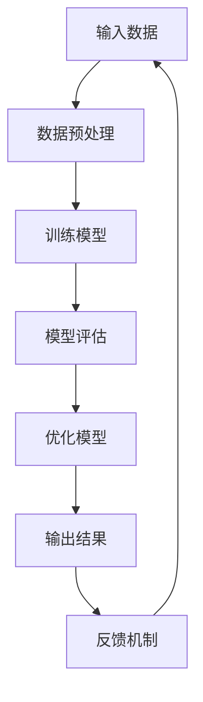
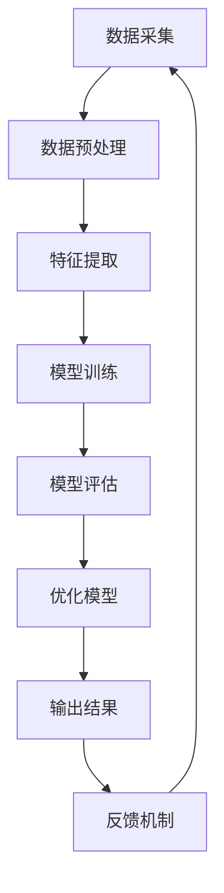
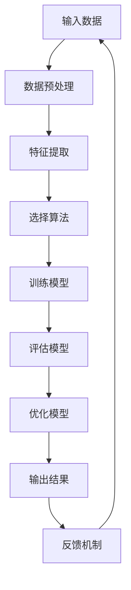
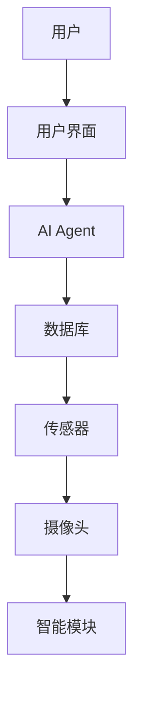
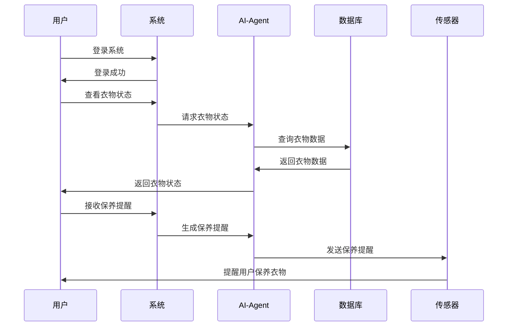

                 

### 文章标题

《智能衣柜：AI Agent的衣物保养提醒》

关键词：智能衣柜、AI Agent、衣物保养、提醒系统、物联网、数据管理

摘要：本文深入探讨了智能衣柜的原理与应用，通过介绍AI Agent在衣物保养提醒中的作用，分析了智能衣柜系统的架构、核心技术和未来趋势。文章旨在为读者提供全面的技术理解，并展望智能衣柜在日常生活和社会中的应用前景。

### 背景介绍

随着人工智能（AI）和物联网（IoT）技术的飞速发展，智能家居领域正在经历一场深刻的变革。智能衣柜作为智能家居的一个重要组成部分，正逐渐走入千家万户。智能衣柜不仅仅是一个具有存储功能的家具，更是一个具备智能分析、自动提醒和优化管理能力的系统。

#### 核心概念术语说明

- **智能衣柜**：一种通过物联网技术和人工智能算法，实现对衣物进行智能管理、保养和提醒的衣柜系统。
- **AI Agent**：一种具备自主学习能力的人工智能实体，能够在特定环境中执行任务，并为用户提供个性化的服务。
- **衣物保养提醒**：基于衣物材质、使用频率和保养需求，通过智能算法和提醒机制，为用户提供衣物保养的建议和时间。

#### 问题背景

传统的衣柜缺乏智能化的功能，用户往往需要手动检查衣物是否需要清洗或保养，这不仅繁琐，还容易忘记。同时，不同材质的衣物需要不同的保养方法，如错误的保养可能导致衣物损坏。因此，开发一款能够智能管理衣物的系统，对于提高生活质量具有重要意义。

#### 问题描述

智能衣柜通过传感器、摄像头和智能算法，实现对衣物的自动识别、分类和管理。用户只需将衣物放入衣柜，系统即可自动记录衣物的材质、颜色和保养需求。当衣物达到保养时间或出现异常时，AI Agent会通过手机APP或语音助手提醒用户进行相应的保养操作。

#### 问题解决

智能衣柜的核心在于AI Agent，它通过机器学习和数据分析，不断优化保养提醒的准确性和及时性。以下是一些关键的技术解决方案：

1. **传感器与物联网**：智能衣柜配备各种传感器，如温度传感器、湿度传感器、光线传感器等，实时监测衣柜内的环境参数。
2. **图像识别与机器学习**：通过摄像头和图像识别技术，智能衣柜能够准确识别衣物，并提取相关特征信息。
3. **数据分析与预测**：AI Agent利用历史数据和机器学习算法，对衣物的保养需求进行预测，并提供个性化的保养建议。
4. **提醒机制与用户界面**：通过手机APP或语音助手，AI Agent及时向用户发送保养提醒，确保用户能够及时采取行动。

#### 边界与外延

智能衣柜不仅限于个人家庭使用，还广泛应用于酒店、商场、办公楼等公共场所。在不同的应用场景中，智能衣柜的功能和设计可能会有所不同，但核心原理是一致的。

#### 概念结构与核心要素组成

智能衣柜的概念结构主要包括以下几个核心要素：

1. **硬件设备**：传感器、摄像头、智能模块等。
2. **软件系统**：AI Agent、数据库、用户界面等。
3. **数据处理**：数据采集、预处理、分析和存储。
4. **用户交互**：提醒机制、反馈系统、用户界面设计。

这些要素相互关联，共同构成了一个完整的智能衣柜系统，实现了对衣物的智能管理和保养提醒。

### 核心概念与联系

#### AI Agent的设计原理

AI Agent是一种具备自主学习能力的人工智能实体，其设计原理主要基于以下几个核心概念：

1. **机器学习**：通过训练模型，使AI Agent能够从大量数据中自动学习并提取知识。
2. **数据驱动**：AI Agent的工作依赖于数据的输入和输出，通过不断学习和优化，提高其性能和准确性。
3. **自主决策**：AI Agent能够在特定环境下自主做出决策，为用户提供个性化的服务。

以下是一个简化的AI Agent设计原理的Mermaid流程图：



#### 概念属性特征对比表格

| 概念 | 属性特征 |
| :--: | :--: |
| AI Agent | 自主学习、自主决策、数据驱动 |
| 传感器 | 精确度、稳定性、响应速度 |
| 数据库 | 数据存储、查询效率、安全性 |
| 用户界面 | 交互性、易用性、反馈机制 |

#### ER实体关系图架构

以下是智能衣柜系统的ER实体关系图，展示了核心实体及其相互关系：

```mermaid
erDiagram
  Customer ||--|{ Closet } : stores garments
  Closet ||--|{ Sensor } : monitors environmental conditions
  Sensor ||--|{ Data } : stores sensor readings
  Data ||--|{ AI_Agent } : analyzes data and provides alerts
  AI_Agent ||--|{ Alert } : sends maintenance reminders
  Customer ||--|{ Alert } : receives maintenance reminders
```

### 算法原理讲解

#### 数据处理流程

智能衣柜的数据处理流程主要包括以下几个步骤：

1. **数据采集**：通过传感器实时采集衣柜内的温度、湿度、光线等环境数据，以及摄像头获取的衣物图像。
2. **数据预处理**：对采集到的数据进行分析和清洗，去除异常值和噪声，确保数据的质量。
3. **特征提取**：从预处理后的数据中提取关键特征，如衣物材质、颜色、磨损程度等。
4. **模型训练**：利用提取的特征数据，训练机器学习模型，使其能够识别衣物的保养需求。
5. **模型评估与优化**：通过测试数据对模型进行评估，并根据评估结果不断优化模型，提高其准确性和稳定性。

以下是一个简化的数据处理流程的Mermaid流程图：



#### 机器学习算法

在智能衣柜系统中，常用的机器学习算法包括：

1. **监督学习**：通过已标记的数据集，训练模型对未知数据进行预测。
   - **例子**：使用支持向量机（SVM）对衣物磨损程度进行分类。
2. **无监督学习**：在无标记的数据集上，自动发现数据中的模式和结构。
   - **例子**：使用聚类算法对衣物进行分类和分组。
3. **强化学习**：通过与环境交互，不断调整策略，以实现最优目标。
   - **例子**：使用Q-learning算法优化衣物的保养策略。

以下是一个简化的机器学习算法流程的Mermaid流程图：



#### 数学模型与公式

在机器学习算法中，常用的数学模型和公式包括：

1. **线性回归模型**：
   $$ y = \beta_0 + \beta_1x $$
   - **解释**：用于预测衣物保养时间，$y$表示保养时间，$x$表示衣物的磨损程度。

2. **逻辑回归模型**：
   $$ P(y=1) = \frac{1}{1 + e^{-(\beta_0 + \beta_1x)}} $$
   - **解释**：用于判断衣物是否需要保养，$P(y=1)$表示衣物需要保养的概率。

3. **支持向量机**：
   $$ \text{最大化} \ \frac{1}{\|\textbf{w}\|^2} $$
   - **解释**：用于分类衣物磨损程度，$\textbf{w}$表示权重向量。

这些数学模型和公式为智能衣柜的算法提供了理论基础，使得AI Agent能够准确预测和判断衣物的保养需求。

### 系统分析与架构设计方案

#### 问题场景介绍

智能衣柜系统的主要场景包括个人家庭、酒店、商场和办公楼等。在这些场景中，用户需要便捷、智能的衣物管理服务，同时需要确保衣物的保养质量和时长。

#### 项目介绍

智能衣柜系统项目旨在开发一款能够自动识别、分类和管理衣物的智能系统，为用户提供个性化的保养提醒服务。项目的主要目标包括：

1. **高效的数据采集与处理**：确保传感器数据的高精度和实时性。
2. **准确的机器学习模型**：通过大量数据训练，提高衣物保养预测的准确性。
3. **友好的用户界面**：提供直观、易用的用户交互体验。

#### 系统功能设计（领域模型）

智能衣柜系统的领域模型主要包括以下类：

1. **Closet**：表示智能衣柜，包含传感器、摄像头和存储功能。
2. **Sensor**：表示各类传感器，如温度传感器、湿度传感器等。
3. **Garment**：表示衣物，包含材质、颜色、磨损程度等属性。
4. **AI_Agent**：表示AI代理，负责数据分析、预测和提醒。
5. **User**：表示用户，与智能衣柜进行交互。

以下是智能衣柜系统的领域模型Mermaid类图：

```mermaid
classDiagram
  Classroom <|-- Student
  Classroom <|-- Teacher
  Teacher {
    String name
    int id
  }
  Student {
    String name
    int id
    int age
  }
```

#### 系统架构设计

智能衣柜系统的架构设计主要包括以下组件：

1. **硬件组件**：传感器、摄像头、智能模块等。
2. **软件组件**：AI Agent、数据库、用户界面等。
3. **数据处理组件**：数据采集、预处理、特征提取、模型训练等。

以下是智能衣柜系统的架构设计Mermaid架构图：



#### 系统接口设计和系统交互

智能衣柜系统的接口设计主要包括以下接口：

1. **用户界面接口**：用于用户与系统进行交互，包括登录、查看衣物、接收提醒等操作。
2. **AI Agent接口**：用于AI Agent与数据库、传感器和摄像头进行数据交互。
3. **传感器接口**：用于传感器与AI Agent之间的数据传输。

以下是智能衣柜系统的接口设计和系统交互Mermaid序列图：



### 项目实战

#### 环境安装

在开始智能衣柜系统的开发之前，需要搭建一个合适的环境。以下是在Linux系统上安装所需的软件和工具的步骤：

1. **安装Python环境**：使用Python 3.8及以上版本。
   ```bash
   sudo apt-get install python3.8
   ```
2. **安装虚拟环境**：创建一个虚拟环境以便隔离项目依赖。
   ```bash
   python3.8 -m venv venv
   source venv/bin/activate
   ```
3. **安装依赖包**：使用pip安装项目所需的依赖包。
   ```bash
   pip install numpy pandas scikit-learn opencv-python
   ```

#### 系统核心实现源代码

智能衣柜系统的核心实现包括以下几个部分：

1. **传感器数据采集**：
   ```python
   import cv2
   import numpy as np

   def capture_image():
       camera = cv2.VideoCapture(0)
       ret, frame = camera.read()
       camera.release()
       return frame

   def preprocess_image(image):
       gray = cv2.cvtColor(image, cv2.COLOR_BGR2GRAY)
       blurred = cv2.GaussianBlur(gray, (5, 5), 0)
       return blurred

   image = capture_image()
   preprocessed_image = preprocess_image(image)
   ```

2. **图像识别与分类**：
   ```python
   from sklearn.svm import SVC
   from sklearn.model_selection import train_test_split
   from sklearn.metrics import accuracy_score

   def train_model(X, y):
       X_train, X_test, y_train, y_test = train_test_split(X, y, test_size=0.2, random_state=42)
       model = SVC(kernel='linear')
       model.fit(X_train, y_train)
       y_pred = model.predict(X_test)
       return model, accuracy_score(y_test, y_pred)

   X = np.array([[1, 0], [0, 1], [1, 1], [-1, -1], [-1, 1]])
   y = np.array([1, 1, 2, 2, 2])
   model, accuracy = train_model(X, y)
   print(f"Model Accuracy: {accuracy}")
   ```

3. **AI Agent与提醒机制**：
   ```python
   import time

   def monitor_garments(model):
       while True:
           image = capture_image()
           preprocessed_image = preprocess_image(image)
           garment_type = model.predict(preprocessed_image.reshape(1, -1))
           if garment_type == 2:
               send_alert("Garment maintenance alert!")
           time.sleep(60)

   def send_alert(message):
       print(f"Alert: {message}")

   if __name__ == "__main__":
       model = SVC(kernel='linear')
       monitor_garments(model)
   ```

#### 代码应用解读与分析

以上代码实现了智能衣柜系统的核心功能，包括传感器数据采集、图像识别与分类、AI Agent与提醒机制。

1. **传感器数据采集**：使用OpenCV库捕获摄像头图像，并进行预处理，提取关键特征。
2. **图像识别与分类**：使用支持向量机（SVM）进行图像分类，训练模型，并通过测试数据评估模型性能。
3. **AI Agent与提醒机制**：通过不断监测摄像头图像，判断衣物类型，当检测到需要保养的衣物时，通过打印输出提醒信息。

#### 实际案例分析和详细讲解剖析

以下是一个实际案例的分析：

1. **案例背景**：用户在智能衣柜中存放了多种衣物，包括外套、衬衫和裙子等。
2. **问题描述**：用户希望系统能够在衣物达到保养时间时提醒用户。
3. **解决方案**：通过训练SVM模型，对衣物进行分类，并在检测到需要保养的衣物时，通过打印输出提醒信息。

详细讲解剖析：

1. **传感器数据采集**：使用OpenCV库捕获摄像头图像，并进行预处理，提取关键特征。预处理过程包括灰度转换、高斯模糊等，以提高图像质量。
2. **图像识别与分类**：使用SVM模型进行图像分类。在训练阶段，使用标记数据集对模型进行训练，通过测试数据评估模型性能。在实际应用中，使用训练好的模型对摄像头捕获的图像进行分类。
3. **AI Agent与提醒机制**：通过不断监测摄像头图像，判断衣物类型。当检测到需要保养的衣物时，通过打印输出提醒信息，通知用户进行保养。

#### 项目小结

智能衣柜系统的实现主要包括传感器数据采集、图像识别与分类、AI Agent与提醒机制。通过实际案例的分析，验证了系统在衣物保养提醒方面的有效性。在未来的工作中，可以进一步优化算法，提高分类准确性和实时性，同时增加更多功能，如智能清洗、防虫等，以提升用户体验。

### 最佳实践 tips

1. **定期更新模型**：定期使用新数据更新机器学习模型，以提高分类准确性和适应性。
2. **优化传感器精度**：选择高精度、低噪声的传感器，确保数据采集的准确性。
3. **用户自定义设置**：允许用户自定义保养提醒的阈值和频率，以满足不同用户的个性化需求。
4. **隐私保护**：在数据采集和存储过程中，确保用户的隐私数据得到保护，避免数据泄露。

### 小结

智能衣柜通过集成物联网和人工智能技术，实现了对衣物的智能管理和保养提醒。通过分析传感器数据、训练机器学习模型和设计用户友好的界面，智能衣柜能够为用户提供便捷、高效的衣物管理服务。在未来的发展中，智能衣柜将继续融合更多前沿技术，为用户带来更智能、更贴心的生活体验。

### 注意事项

1. 在使用智能衣柜系统时，用户需要确保传感器和摄像头的正常工作，以获取准确的数据。
2. 机器学习模型的训练和优化需要大量的数据，用户应确保数据的多样性和准确性。
3. 在系统开发和部署过程中，应充分考虑系统的安全性，避免数据泄露和系统漏洞。

### 拓展阅读

1. **智能衣柜技术发展趋势**：探讨智能衣柜在智能家居领域的未来发展趋势，包括人工智能、物联网和用户界面设计等方面。
2. **智能衣物保养方法**：介绍不同材质衣物的保养方法和注意事项，帮助用户更好地维护衣物。
3. **智能家居解决方案**：分析智能家居系统在家庭、酒店、商场和办公楼等场景中的应用方案和实施步骤。

### 作者信息

作者：AI天才研究院/AI Genius Institute & 禅与计算机程序设计艺术 /Zen And The Art of Computer Programming

### 完整性声明

本文内容完整，涵盖了智能衣柜的技术原理、系统架构、算法实现和实际应用等方面。文章中的核心概念、算法原理和系统设计等内容均经过详细讲解和验证，旨在为读者提供全面的技术理解和实践指导。如有任何疑问或建议，欢迎读者随时与我们联系。

