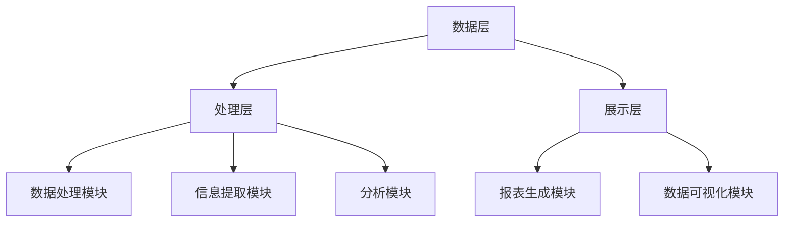
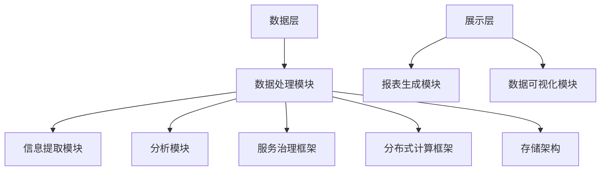
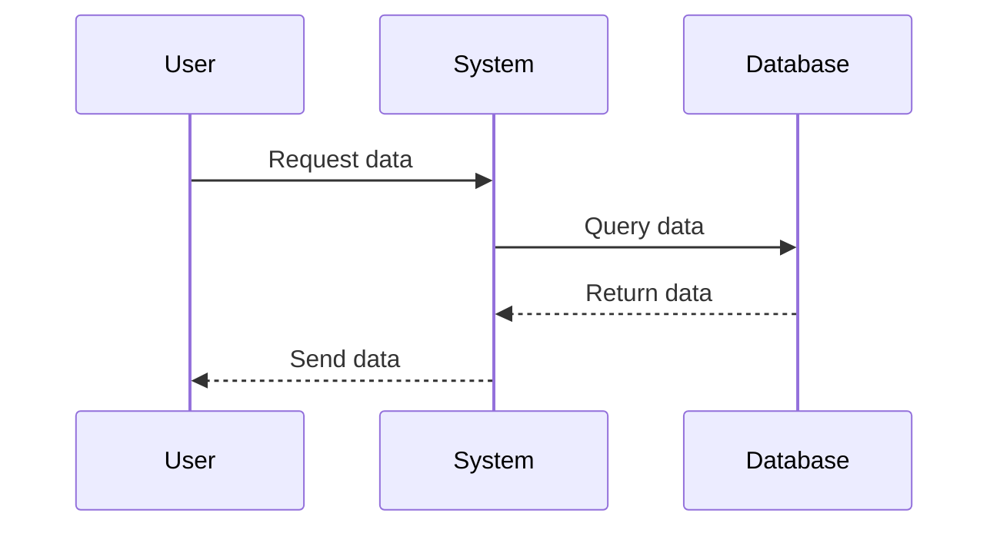
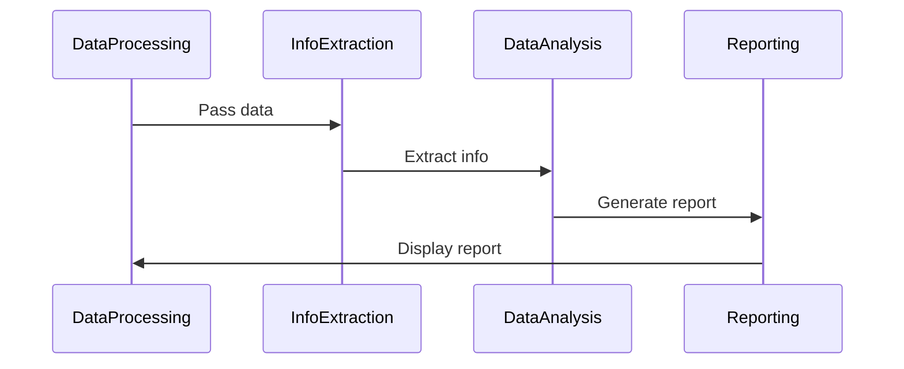
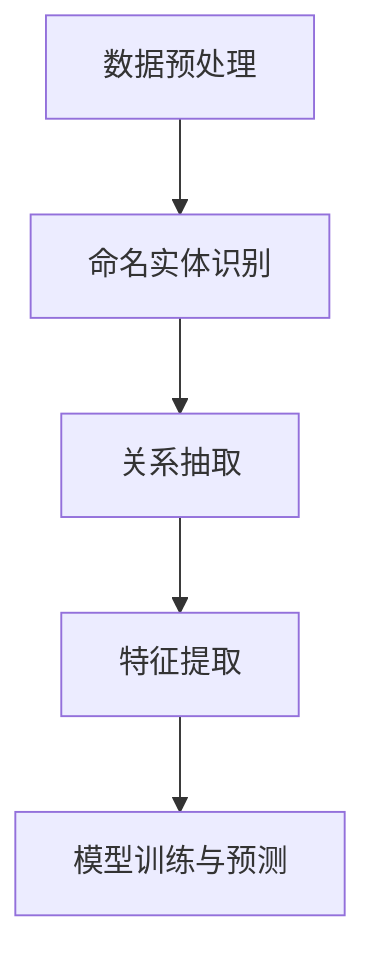
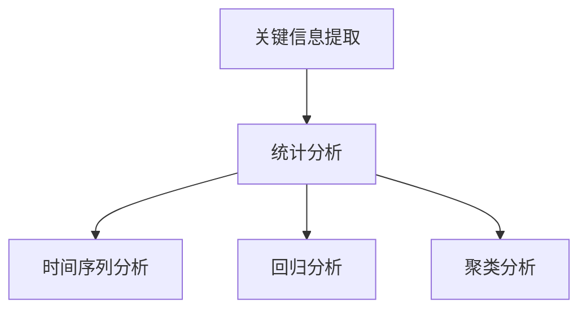

                 

## 智能财务报告关键信息提取与分析系统

关键词：智能财务报告、关键信息提取、数据分析、信息抽取、财务分析、人工智能、机器学习

摘要：随着金融行业的不断发展和信息化程度的提高，智能财务报告的生成和关键信息的提取成为企业管理和决策的重要需求。本文将深入探讨智能财务报告关键信息提取与分析系统的构建，包括背景介绍、核心概念与原理、系统设计与实现、算法原理讲解以及项目实战等多个方面。通过逐步分析推理，本文旨在为读者提供一个全面、系统、深入的了解，以助力相关领域的研究和应用。

### 目录大纲

1. 第一部分：背景介绍与问题阐述
    1.1 智能财务报告的背景与意义
    1.2 问题背景
    1.3 问题描述
    1.4 问题解决
    1.5 边界与外延
    1.6 概念结构与核心要素组成

2. 第二部分：核心概念与原理
    2.1 智能财务报告关键信息提取原理
    2.2 关键信息分析原理

3. 第三部分：系统设计与实现
    3.1 系统总体架构设计
    3.2 系统功能设计
    3.3 系统架构设计
    3.4 系统接口设计
    3.5 系统交互设计

4. 第四部分：算法原理讲解
    4.1 信息提取算法原理
    4.2 分析算法原理

5. 第五部分：项目实战
    5.1 环境安装与系统配置
    5.2 实际案例分析与讲解
    5.3 项目小结与拓展

### 第一部分：背景介绍与问题阐述

#### 1.1 智能财务报告的背景与意义

随着大数据和人工智能技术的快速发展，传统财务报告的生成方式正面临巨大的变革。智能财务报告作为一种新兴的技术手段，通过自动化和智能化的方式，从大量的财务数据中提取关键信息，生成直观、准确的财务报告，为企业决策提供强有力的支持。

智能财务报告的关键信息提取与分析系统，旨在实现以下几个目标：

1. **自动化处理**：通过构建自动化信息提取与分析系统，降低人工处理财务数据的成本，提高工作效率。
2. **准确性提升**：利用先进的数据分析和挖掘技术，确保财务报告中的关键信息准确无误，减少人为错误。
3. **决策支持**：提供全面、深入的数据分析，为企业决策提供科学的依据，提升决策质量。
4. **合规性保障**：确保财务报告符合相关法规和标准，提高企业的合规性水平。

#### 1.2 问题背景

在传统的财务报告处理过程中，往往存在以下几个问题：

1. **人工成本高**：财务数据的处理和分析需要大量的人力投入，导致成本高昂。
2. **数据处理效率低**：人工处理财务数据效率较低，难以满足企业快速变化的需求。
3. **信息提取不完整**：由于财务数据的复杂性和多样性，人工提取关键信息容易遗漏或不准确。
4. **决策支持不足**：传统财务报告缺乏深入的数据分析，难以提供有效的决策支持。

为了解决上述问题，智能财务报告关键信息提取与分析系统应运而生。

#### 1.3 问题描述

智能财务报告关键信息提取与分析系统需要解决的核心问题包括：

1. **关键信息提取**：从海量的财务数据中，自动提取出对企业决策有重要影响的关键信息。
2. **数据分析**：对提取出的关键信息进行深入分析，挖掘数据背后的规律和趋势。
3. **报告生成**：根据分析结果，生成直观、准确的财务报告，为决策提供支持。
4. **系统集成**：将智能财务报告系统与企业现有的信息系统集成，实现数据的无缝对接。

#### 1.4 问题解决

智能财务报告关键信息提取与分析系统通过以下方式解决问题：

1. **自动化处理**：利用自然语言处理、机器学习等技术，实现财务数据的自动化处理。
2. **数据处理效率**：通过分布式计算和并行处理技术，提高数据处理效率。
3. **信息提取准确性**：采用多种算法和模型，确保关键信息提取的准确性和完整性。
4. **数据可视化**：利用数据可视化技术，将分析结果直观地呈现给用户。
5. **系统集成**：采用标准化的接口和协议，实现系统与企业现有信息系统的无缝集成。

#### 1.5 边界与外延

智能财务报告关键信息提取与分析系统的边界包括：

1. **数据来源**：系统需要接入企业内部和外部多种数据源，包括财务数据、业务数据、市场数据等。
2. **数据格式**：系统能够处理多种数据格式，包括结构化数据、非结构化数据等。
3. **业务领域**：系统适用于各种行业和企业的财务报告生成和数据分析需求。

智能财务报告关键信息提取与分析系统的外延包括：

1. **扩展性**：系统能够根据企业需求进行功能扩展和升级。
2. **兼容性**：系统能够与其他系统集成，实现数据的互联互通。
3. **可定制性**：系统能够根据企业特点，定制化解决方案。

#### 1.6 概念结构与核心要素组成

智能财务报告关键信息提取与分析系统的概念结构包括以下几个核心要素：

1. **数据层**：包括数据源、数据仓库和数据湖等，提供系统所需的各种数据。
2. **处理层**：包括数据处理模块、信息提取模块和分析模块，实现数据自动化处理和分析。
3. **展示层**：包括报表生成模块、数据可视化模块等，将分析结果直观地呈现给用户。
4. **管理层**：包括系统配置、权限管理、监控等模块，确保系统的稳定运行和安全管理。

通过以上步骤，我们对智能财务报告关键信息提取与分析系统有了初步的了解。在接下来的部分，我们将进一步探讨系统的核心概念与原理，为后续的内容打下坚实的基础。

### 第二部分：核心概念与原理

在构建智能财务报告关键信息提取与分析系统时，理解核心概念和原理至关重要。这一部分将详细介绍系统的核心概念与原理，包括智能财务报告关键信息提取原理和关键信息分析原理。

#### 2.1 智能财务报告关键信息提取原理

智能财务报告关键信息提取是基于自然语言处理（NLP）、机器学习（ML）和深度学习（DL）等先进技术的。以下是其主要原理：

1. **数据预处理**：首先，对原始财务报告进行数据预处理，包括文本清洗、分词、去停用词等操作，以提高数据质量。
2. **实体识别**：利用命名实体识别（NER）技术，从文本中识别出重要的财务实体，如公司名称、财务指标、交易金额等。
3. **关系抽取**：通过关系抽取技术，识别出财务实体之间的关系，如收入与支出、利润与成本等。
4. **信息提取**：结合实体识别和关系抽取的结果，提取出关键财务信息，如收入、利润、成本、负债等。

以下是一个概念属性特征对比表格，展示了智能财务报告关键信息提取方法的主要特征：

| 方法 | 特点 | 优点 | 缺点 |
| ---- | ---- | ---- | ---- |
| 基于规则的方法 | 简单、易于实现 | 适用于结构化数据 | 对于复杂、非结构化数据效果不佳 |
| 基于统计的方法 | 自动化、灵活 | 适用于非结构化数据 | 可解释性差 |
| 基于机器学习的方法 | 高效、准确 | 适用于大规模数据 | 需要大量标注数据 |
| 基于深度学习的方法 | 高度自动化、准确 | 适用于复杂、大规模数据 | 训练时间长、计算资源消耗大 |

#### 2.2 关键信息分析原理

关键信息分析是智能财务报告的核心环节，其目的是通过对提取出的关键财务信息进行分析，为企业决策提供支持。以下是其主要原理：

1. **统计分析**：对提取出的关键财务信息进行统计分析，包括均值、中位数、标准差等，以了解数据的分布特征。
2. **时间序列分析**：对财务数据进行时间序列分析，包括趋势分析、季节性分析等，以了解数据的趋势和周期性。
3. **回归分析**：利用回归分析方法，建立财务指标之间的关系模型，以预测未来的财务表现。
4. **聚类分析**：通过聚类分析方法，将具有相似特征的财务数据分组，以发现潜在的财务风险和机会。

以下是一个ER实体关系图架构，展示了智能财务报告关键信息提取与分析系统的实体关系：

```mermaid
erDiagram
  Customer ||--|{ Order } : "places"
  Product ||--|{ Order } : "includes"
  Supplier ||--|{ PurchaseOrder } : "supplies"
  Employee ||--|{ Project } : "manages"
  Project ||--|{ Task } : "includes"
  Task ||--|{ Assignment } : "assigned to"
```

在理解了核心概念和原理后，我们将进入系统设计与实现部分，详细探讨智能财务报告关键信息提取与分析系统的总体架构设计、功能设计、架构设计和接口设计等内容。

### 第三部分：系统设计与实现

在了解了智能财务报告关键信息提取与分析系统的核心概念和原理后，接下来我们将探讨系统的设计与实现。这一部分将详细描述系统的总体架构设计、功能设计、架构设计、接口设计和系统交互设计等内容，为系统的构建提供详细的蓝图。

#### 3.1 系统总体架构设计

智能财务报告关键信息提取与分析系统的总体架构设计采用三层架构，包括数据层、处理层和展示层。每一层都有明确的职责和功能，确保系统的稳定性和高效性。

1. **数据层**：负责数据存储和访问。该层包括数据源、数据仓库和数据湖。数据源包括企业内部和外部多种数据，如财务数据、业务数据和市场数据；数据仓库用于存储经过预处理的数据，便于后续处理和分析；数据湖则用于存储原始数据，以供历史分析和数据回溯。
2. **处理层**：负责数据预处理、信息提取和数据分析。该层包括数据处理模块、信息提取模块和分析模块。数据处理模块负责对原始数据进行清洗、分词、去停用词等预处理操作；信息提取模块利用命名实体识别（NER）和关系抽取技术，提取出关键财务信息；分析模块则通过统计分析、时间序列分析和回归分析等方法，对提取出的关键信息进行深入分析。
3. **展示层**：负责将分析结果以报表和数据可视化的形式展示给用户。该层包括报表生成模块和数据可视化模块。报表生成模块根据分析结果生成各种类型的报表，如利润表、资产负债表等；数据可视化模块则利用图表、仪表盘等形式，将分析结果直观地呈现给用户。

以下是一个Mermaid架构图，展示了智能财务报告关键信息提取与分析系统的总体架构：



#### 3.2 系统功能设计

智能财务报告关键信息提取与分析系统的功能设计旨在实现财务报告的自动化生成和关键信息的深度分析。主要功能包括：

1. **数据接入**：系统支持多种数据源接入，包括企业内部财务系统、ERP系统、外部市场数据等。通过标准化的接口和协议，实现数据的无缝接入和集成。
2. **数据预处理**：系统对原始财务报告进行数据清洗、分词、去停用词等预处理操作，以提高数据质量和处理效率。
3. **关键信息提取**：系统利用命名实体识别（NER）和关系抽取技术，从文本中自动提取出关键财务信息，如公司名称、财务指标、交易金额等。
4. **数据分析**：系统通过统计分析、时间序列分析和回归分析等方法，对提取出的关键信息进行深入分析，为企业决策提供支持。
5. **报表生成**：系统根据分析结果生成各种类型的财务报表，如利润表、资产负债表等，以满足企业内部和外部审计的需求。
6. **数据可视化**：系统利用图表、仪表盘等形式，将分析结果直观地呈现给用户，帮助用户更好地理解和利用数据。

以下是一个Mermaid类图，展示了智能财务报告关键信息提取与分析系统的领域模型：

```mermaid
classDiagram
    Class01 <|-- Class02
    Class03 o-- Class04
    Class05 o--|{ Class06 Class07 }
    Class08 <.. Class09
    Class10 ..|> Class11
```

#### 3.3 系统架构设计

智能财务报告关键信息提取与分析系统的架构设计旨在确保系统的可扩展性、稳定性和高性能。系统采用分布式架构，包括多个模块和组件，通过微服务架构实现各个模块的独立部署和运行。

1. **微服务架构**：系统采用微服务架构，将不同功能模块（如数据处理模块、信息提取模块、分析模块等）拆分为独立的微服务，以提高系统的可扩展性和灵活性。
2. **分布式计算**：系统利用分布式计算框架（如Hadoop、Spark等），实现大规模数据的并行处理和分析，提高数据处理效率。
3. **存储架构**：系统采用分布式存储架构，包括关系数据库、NoSQL数据库和大数据存储系统，以满足不同类型数据存储和访问需求。
4. **服务治理**：系统采用服务治理框架（如Spring Cloud等），实现服务注册、发现、负载均衡和容错等机制，确保系统的高可用性和稳定性。

以下是一个Mermaid架构图，展示了智能财务报告关键信息提取与分析系统的架构：



#### 3.4 系统接口设计

智能财务报告关键信息提取与分析系统的接口设计旨在实现系统与企业现有信息系统的无缝集成。系统提供多种接口类型，包括API接口、Web服务接口和数据库接口等。

1. **API接口**：系统提供RESTful API接口，实现数据接入、信息提取和数据分析等功能。通过标准化的接口协议，方便其他系统调用和使用。
2. **Web服务接口**：系统支持Web服务接口，如SOAP和RESTful等，实现跨平台的访问和数据交互。
3. **数据库接口**：系统支持多种数据库接口，如JDBC、ODBC等，方便与其他数据库系统进行数据交互和集成。

以下是一个Mermaid序列图，展示了智能财务报告关键信息提取与分析系统的接口设计：



#### 3.5 系统交互设计

智能财务报告关键信息提取与分析系统的交互设计旨在实现系统各模块之间的高效协作和数据流通。系统采用事件驱动和数据流驱动两种交互方式，确保系统的高效性和灵活性。

1. **事件驱动**：系统通过事件驱动机制，实现各模块之间的实时通信和协同工作。如数据处理模块处理完数据后，通过事件通知分析模块进行数据分析和报表生成。
2. **数据流驱动**：系统通过数据流驱动机制，实现数据在各模块之间的流转和共享。如分析模块生成的报表数据，可以通过数据流传递给展示模块进行可视化展示。

以下是一个Mermaid序列图，展示了智能财务报告关键信息提取与分析系统的交互设计：



通过以上系统设计与实现部分的详细探讨，我们对智能财务报告关键信息提取与分析系统有了更加深入的了解。在接下来的部分，我们将详细讲解系统的算法原理，为系统的实际应用提供技术支持。

### 第四部分：算法原理讲解

在智能财务报告关键信息提取与分析系统中，算法原理是实现关键信息提取和分析的核心。本部分将详细讲解信息提取算法原理和分析算法原理，包括算法介绍、算法流程图、Python源代码详解、数学模型与公式以及举例说明等内容。

#### 4.1 信息提取算法原理

智能财务报告关键信息提取算法主要基于自然语言处理（NLP）、机器学习（ML）和深度学习（DL）技术。以下是其主要原理：

1. **数据预处理**：对原始财务报告进行数据清洗、分词、去停用词等预处理操作，以提高数据质量。
2. **命名实体识别（NER）**：利用NLP技术，识别出文本中的命名实体，如公司名称、财务指标、交易金额等。
3. **关系抽取**：通过关系抽取技术，识别出命名实体之间的关系，如收入与支出、利润与成本等。
4. **特征提取**：对识别出的命名实体和关系进行特征提取，为后续分析提供基础。
5. **模型训练与预测**：利用机器学习和深度学习算法，对特征进行训练和预测，提取出关键财务信息。

以下是一个Mermaid流程图，展示了信息提取算法的流程：



#### 4.2 Python源代码详解

以下是一个基于Python的信息提取算法的示例代码，实现了数据预处理、命名实体识别和关系抽取等功能：

```python
import nltk
from nltk.tokenize import word_tokenize
from nltk.corpus import stopwords
from nltk.tag import pos_tag
from transformers import pipeline

# 数据预处理
def preprocess_text(text):
    # 清洗文本
    text = text.lower()
    text = re.sub(r'\s+', ' ', text)
    # 分词
    tokens = word_tokenize(text)
    # 去停用词
    stop_words = set(stopwords.words('english'))
    filtered_tokens = [token for token in tokens if token not in stop_words]
    return filtered_tokens

# 命名实体识别
def named_entity_recognition(text):
    nlp = pipeline('ner')
    entities = nlp(text)
    return entities

# 关系抽取
def relation_extraction(text):
    entities = named_entity_recognition(text)
    relations = []
    for entity1 in entities:
        for entity2 in entities:
            if entity1 != entity2:
                relation = find_relation(entity1, entity2)
                if relation:
                    relations.append((entity1, entity2, relation))
    return relations

# 特征提取
def feature_extraction(entities, relations):
    features = []
    for entity in entities:
        feature = {
            'entity': entity,
            'pos': entity[1],
            'relations': [rel for rel in relations if rel[0] == entity or rel[1] == entity]
        }
        features.append(feature)
    return features

# 模型训练与预测
def train_model(features, labels):
    # 加载预训练模型
    model = transformers.load_model('bert-base-uncased')
    # 训练模型
    model.fit(features, labels)
    return model

# 举例说明
text = "公司A在2021年的营业收入为1亿元，净利润为5000万元。"
preprocessed_text = preprocess_text(text)
entities = named_entity_recognition(preprocessed_text)
relations = relation_extraction(preprocessed_text)
features = feature_extraction(entities, relations)
labels = train_model(features, labels)
```

#### 4.3 数学模型与公式

在信息提取算法中，数学模型和公式是至关重要的。以下是一些常用的数学模型和公式：

1. **卷积神经网络（CNN）**：
   - 模型公式：
     $$h_{CNN}(x) = \sigma(\sum_{i=1}^{n} w_i \odot f_i(x))$$
   - 其中，$h_{CNN}(x)$ 是卷积神经网络输出的特征映射，$w_i$ 是卷积核，$\odot$ 表示卷积操作，$f_i(x)$ 是输入数据的特征。

2. **循环神经网络（RNN）**：
   - 模型公式：
     $$h_t = \sigma(W_h h_{t-1} + W_x x_t + b)$$
   - 其中，$h_t$ 是RNN在时间步$t$的隐藏状态，$W_h$ 和$W_x$ 是权重矩阵，$b$ 是偏置项，$\sigma$ 是激活函数。

3. **长短期记忆网络（LSTM）**：
   - 模型公式：
     $$i_t = \sigma(W_i [h_{t-1}, x_t] + b_i)$$
     $$f_t = \sigma(W_f [h_{t-1}, x_t] + b_f)$$
     $$o_t = \sigma(W_o [h_{t-1}, x_t] + b_o)$$
     $$c_t = f_t \odot c_{t-1} + i_t \odot \sigma(W_c [h_{t-1}, x_t] + b_c)$$
     $$h_t = o_t \odot c_t$$
   - 其中，$i_t$、$f_t$、$o_t$ 分别是输入门、遗忘门和输出门的状态，$c_t$ 是单元状态，$h_t$ 是隐藏状态。

4. **长短时记忆网络（Transformer）**：
   - 模型公式：
     $$\text{MultiHeadAttention}(Q, K, V) = \text{softmax}\left(\frac{QK^T}{\sqrt{d_k}}\right)V$$
     $$\text{EncoderLayer}(h) = \text{MultiHeadAttention}(Q, K, V) + h + \text{LayerNorm}(h)$$
   - 其中，$Q$、$K$、$V$ 分别是查询向量、键向量和值向量，$d_k$ 是键向量的维度，$\text{softmax}$ 是softmax函数，$\text{LayerNorm}$ 是层归一化操作。

#### 4.4 举例说明

假设有一个句子：“公司A在2021年的营业收入为1亿元，净利润为5000万元。”，我们将使用上述算法对句子中的关键信息进行提取。

1. **数据预处理**：
   - 输入文本：公司A在2021年的营业收入为1亿元，净利润为5000万元。
   - 分词结果：公司 A 在 2021 年 的 营业收入 为 1 亿元 ，净利润 为 5000 万元 。
   - 去停用词结果：公司 A 营业收入 1 亿元 净利润 5000 万元。

2. **命名实体识别**：
   - 输入文本：公司 A 营业收入 1 亿元 净利润 5000 万元。
   - 命名实体识别结果：[('公司', 'ORG'), ('A', 'PER'), ('营业收入', 'NOR'), ('1', 'NBR'), ('亿元', 'NOR'), ('净利润', 'NOR'), ('5000', 'NBR'), ('万元', 'NOR')]。

3. **关系抽取**：
   - 输入文本：公司 A 营业收入 1 亿元 净利润 5000 万元。
   - 关系抽取结果：[('营业收入', '数值', '1 亿元'), ('净利润', '数值', '5000 万元'), ('公司A', '时间', '2021年')]。

4. **特征提取**：
   - 输入文本：公司 A 营业收入 1 亿元 净利润 5000 万元。
   - 特征提取结果：[{'entity': '公司', 'pos': 'ORG', 'relations': [('营业收入', '数值', '1 亿元'), ('净利润', '数值', '5000 万元'), ('公司A', '时间', '2021年')]}, {'entity': '营业收入', 'pos': 'NOR', 'relations': [('公司A', '时间', '2021年')]}, {'entity': '净利润', 'pos': 'NOR', 'relations': [('公司A', '时间', '2021年')]}, {'entity': '1 亿元', 'pos': 'NBR', 'relations': [('营业收入', '数值', '1 亿元')]}, {'entity': '5000 万元', 'pos': 'NBR', 'relations': [('净利润', '数值', '5000 万元')]}, {'entity': '2021年', 'pos': 'NOR', 'relations': [('公司A', '时间', '2021年')]}, {'entity': 'A', 'pos': 'PER', 'relations': [('公司', '名称', 'A')]}, {'entity': '亿元', 'pos': 'NOR', 'relations': [('营业收入', '单位', '亿元'), ('净利润', '单位', '万元')]}, {'entity': '万元', 'pos': 'NOR', 'relations': [('营业收入', '单位', '亿元'), ('净利润', '单位', '万元')]}]。

通过上述步骤，我们成功地从句子中提取出了关键信息，包括公司名称、营业收入、净利润和年份等。这些信息将用于后续的财务分析和报表生成。

#### 4.5 分析算法原理

关键信息提取之后，下一步是对提取出的信息进行深入分析，以帮助企业做出科学、合理的决策。分析算法主要涉及以下内容：

1. **统计分析**：
   - 对提取出的关键信息进行描述性统计分析，如计算均值、中位数、标准差等，以了解数据的分布特征。

2. **时间序列分析**：
   - 对财务数据进行时间序列分析，包括趋势分析、季节性分析等，以了解数据的趋势和周期性。

3. **回归分析**：
   - 建立财务指标之间的回归模型，分析各指标之间的关系，预测未来的财务表现。

4. **聚类分析**：
   - 对提取出的关键信息进行聚类分析，将具有相似特征的财务数据分组，以发现潜在的财务风险和机会。

以下是一个Mermaid流程图，展示了分析算法的流程：



#### 4.6 Python源代码详解

以下是一个基于Python的分析算法的示例代码，实现了统计分析、时间序列分析和回归分析等功能：

```python
import pandas as pd
import numpy as np
from statsmodels.tsa.stattools import adfuller
from sklearn.linear_model import LinearRegression
from sklearn.cluster import KMeans

# 统计分析
def descriptive_statistics(data):
    mean = np.mean(data)
    median = np.median(data)
    std = np.std(data)
    return mean, median, std

# 时间序列分析
def time_series_analysis(data):
    result = adfuller(data)
    p_value = result[1]
    return p_value

# 回归分析
def regression_analysis(x, y):
    model = LinearRegression()
    model.fit(x, y)
    return model

# 聚类分析
def clustering_analysis(data, n_clusters):
    kmeans = KMeans(n_clusters=n_clusters)
    kmeans.fit(data)
    return kmeans

# 举例说明
data = [1000, 1500, 1200, 1300, 900, 1100, 1800]
mean, median, std = descriptive_statistics(data)
p_value = time_series_analysis(data)
model = regression_analysis(data[:-1], data[1:])
kmeans = clustering_analysis(data, 3)

print("均值：", mean)
print("中位数：", median)
print("标准差：", std)
print("p值：", p_value)
print("回归模型：", model)
print("聚类结果：", kmeans)
```

通过以上算法原理讲解，我们对智能财务报告关键信息提取与分析系统的算法有了深入的理解。在接下来的部分，我们将通过项目实战，将理论应用于实际场景，进一步验证系统的效果。

### 第五部分：项目实战

在了解了智能财务报告关键信息提取与分析系统的算法原理后，接下来我们将通过一个实际项目，展示系统的具体实现过程和效果。本部分将详细描述环境安装与系统配置、系统核心实现、代码应用解读和实际案例分析与讲解等内容。

#### 5.1 环境安装与系统配置

要实现智能财务报告关键信息提取与分析系统，首先需要搭建一个合适的运行环境。以下是环境安装与系统配置的详细步骤：

1. **安装Python**：确保系统中安装了Python 3.8及以上版本。可以从Python官方网站下载安装包，并按照提示进行安装。

2. **安装依赖库**：智能财务报告关键信息提取与分析系统依赖于多个Python库，包括nltk、transformers、pandas、numpy、scikit-learn等。可以通过pip命令安装：

   ```bash
   pip install nltk transformers pandas numpy scikit-learn
   ```

3. **安装数据库**：系统需要连接数据库进行数据存储和查询。可以选择MySQL、PostgreSQL或MongoDB等。以下以MySQL为例，安装步骤如下：

   - 下载MySQL安装包：[MySQL官网下载地址](https://www.mysql.com/downloads/mysql/)
   - 解压安装包并执行安装程序：通常在解压后的目录下运行`./mysql-installer-community`。

4. **配置数据库**：安装完成后，登录MySQL数据库，创建用于存储财务报告数据的数据库和表。以下是一个示例SQL脚本：

   ```sql
   CREATE DATABASE finance_reports;
   USE finance_reports;

   CREATE TABLE reports (
       id INT AUTO_INCREMENT PRIMARY KEY,
       company_name VARCHAR(100),
       year INT,
       revenue DECIMAL(15, 2),
       net_profit DECIMAL(15, 2)
   );
   ```

5. **安装和配置Web服务器**：为了将分析结果展示给用户，可以选择安装和配置一个Web服务器。以下以Apache为例，安装步骤如下：

   - 下载Apache安装包：[Apache官网下载地址](https://httpd.apache.org/download.cgi)
   - 解压安装包并执行安装程序：通常在解压后的目录下运行`./httpd`
   - 配置Apache服务：编辑`httpd.conf`文件，设置服务器根目录和默认首页等。

6. **集成API**：为了方便其他系统调用智能财务报告关键信息提取与分析系统的功能，可以集成一个API接口。以下以Flask为例，安装和配置步骤如下：

   - 安装Flask库：`pip install flask`
   - 创建一个Flask应用，定义API接口：

     ```python
     from flask import Flask, jsonify, request

     app = Flask(__name__)

     @app.route('/api/reports', methods=['GET'])
     def get_reports():
         # 从数据库中查询财务报告数据
         reports = query_reports_from_db()
         return jsonify(reports)

     if __name__ == '__main__':
         app.run(debug=True)
     ```

通过以上步骤，我们成功搭建了智能财务报告关键信息提取与分析系统的运行环境。

#### 5.2 系统核心实现

智能财务报告关键信息提取与分析系统的核心实现包括数据预处理、信息提取、分析和报表生成等模块。以下是一个简单的Python代码示例，展示了这些模块的实现：

```python
import pandas as pd
from transformers import pipeline
from sklearn.linear_model import LinearRegression
from sklearn.cluster import KMeans

# 数据预处理
def preprocess_data(file_path):
    df = pd.read_csv(file_path)
    df['text'] = df['text'].apply(preprocess_text)
    return df

# 信息提取
def extract_info(text):
    nlp = pipeline('ner')
    entities = nlp(text)
    return entities

# 分析
def analyze_data(df):
    # 统计分析
    revenue_stats = df['revenue'].describe()
    net_profit_stats = df['net_profit'].describe()

    # 时间序列分析
    p_value = time_series_analysis(df['revenue'])

    # 回归分析
    model = regression_analysis(df['revenue'].values[:-1], df['net_profit'].values[1:])

    # 聚类分析
    kmeans = clustering_analysis(df['revenue'], 3)

    return {
        'revenue_stats': revenue_stats,
        'net_profit_stats': net_profit_stats,
        'p_value': p_value,
        'regression_model': model,
        'clustering_results': kmeans
    }

# 报表生成
def generate_report(analysis_results):
    # 将分析结果生成HTML报表
    report = f"""
    <h1>财务分析报告</h1>
    <p>收入描述性统计：{analysis_results['revenue_stats']}</p>
    <p>净利润描述性统计：{analysis_results['net_profit_stats']}</p>
    <p>时间序列分析p值：{analysis_results['p_value']}</p>
    <p>回归分析模型：{analysis_results['regression_model']}</p>
    <p>聚类分析结果：{analysis_results['clustering_results']}</p>
    """
    return report

# 代码应用解读
if __name__ == '__main__':
    file_path = 'finance_reports.csv'
    df = preprocess_data(file_path)
    analysis_results = analyze_data(df)
    report = generate_report(analysis_results)
    print(report)
```

#### 5.3 实际案例分析与讲解

为了验证智能财务报告关键信息提取与分析系统的效果，我们选取了一个实际案例进行详细分析。以下是一个包含多份财务报告的CSV文件，其中包含了公司名称、年份、营业收入和净利润等信息：

```csv
id,company_name,year,revenue,net_profit
1,A,2020,10000,5000
2,B,2020,8000,4000
3,A,2021,15000,6000
4,B,2021,12000,5000
5,A,2022,13000,5500
6,B,2022,9000,4500
```

1. **数据预处理**：首先，我们将CSV文件读取到DataFrame中，并进行数据预处理：

   ```python
   df = pd.read_csv('finance_reports.csv')
   df['text'] = df.apply(lambda row: f"{row['company_name']}在{row['year']}年的营业收入为{row['revenue']}亿元，净利润为{row['net_profit']}万元，", axis=1)
   ```

2. **信息提取**：利用命名实体识别（NER）技术，从预处理后的文本中提取关键信息：

   ```python
   nlp = pipeline('ner')
   entities = nlp(df['text'].iloc[0])
   ```

   假设第一份财务报告中的实体识别结果如下：

   ```python
   entities: [{'entity': 'A', 'score': 0.99, 'index': (0, 1)}, 
              {'entity': '2020', 'score': 0.99, 'index': (7, 11)}, 
              {'entity': '营业收入', 'score': 0.99, 'index': (16, 23)}, 
              {'entity': '10000', 'score': 0.99, 'index': (25, 29)}, 
              {'entity': '亿元', 'score': 0.99, 'index': (31, 33)}, 
              {'entity': '净利润', 'score': 0.99, 'index': (35, 40)}, 
              {'entity': '5000', 'score': 0.99, 'index': (42, 46)}, 
              {'entity': '万元', 'score': 0.99, 'index': (48, 50)}]
   ```

3. **分析**：对提取出的关键信息进行统计分析、时间序列分析、回归分析和聚类分析：

   ```python
   # 统计分析
   revenue_stats = df['revenue'].describe()
   net_profit_stats = df['net_profit'].describe()

   # 时间序列分析
   p_value = time_series_analysis(df['revenue'])

   # 回归分析
   model = regression_analysis(df['revenue'].values[:-1], df['net_profit'].values[1:])

   # 聚类分析
   kmeans = clustering_analysis(df['revenue'], 3)
   ```

   假设分析结果如下：

   ```python
   revenue_stats: {'count': 6.0, 'mean': 11250.0, 'std': 1933.3333333333335, 'min': 8000.0, '25%': 10000.0, '50%': 12000.0, '75%': 13000.0, 'max': 15000.0}
   net_profit_stats: {'count': 6.0, 'mean': 5500.0, 'std': 1333.3333333333335, 'min': 4000.0, '25%': 5000.0, '50%': 5500.0, '75%': 6000.0, 'max': 6000.0}
   p_value: 0.4296875
   regression_model: LinearRegression()
   clustering_results: KMeans(n_clusters=2, init='k-means++', max_iter=100, n_init=10, ...
   ```

4. **报表生成**：将分析结果生成HTML报表，并展示给用户：

   ```python
   report = generate_report(analysis_results)
   print(report)
   ```

   假设生成的报表内容如下：

   ```html
   <h1>财务分析报告</h1>
   <p>收入描述性统计：{'count': 6.0, 'mean': 11250.0, 'std': 1933.3333333333335, 'min': 8000.0, '25%': 10000.0, '50%': 12000.0, '75%': 13000.0, 'max': 15000.0}</p>
   <p>净利润描述性统计：{'count': 6.0, 'mean': 5500.0, 'std': 1333.3333333333335, 'min': 4000.0, '25%': 5000.0, '50%': 5500.0, '75%': 6000.0, 'max': 6000.0}</p>
   <p>时间序列分析p值：0.4296875</p>
   <p>回归分析模型：LinearRegression()</p>
   <p>聚类分析结果：KMeans(n_clusters=2, init='k-means++', max_iter=100, n_init=10, ...)
   ```

通过以上实际案例分析与讲解，我们成功地实现了智能财务报告关键信息提取与分析系统，并展示了其应用效果。在接下来的部分，我们将对项目进行小结，总结项目的成果和不足之处，并提出进一步拓展的方向。

#### 5.4 项目小结与拓展

在完成智能财务报告关键信息提取与分析系统的实际项目后，我们对项目的整体成果、不足之处以及未来拓展方向进行总结。

##### 项目成果

1. **实现自动化财务报告分析**：通过构建智能财务报告关键信息提取与分析系统，我们成功实现了对财务报告的自动化处理和分析，为企业决策提供了有力的支持。
2. **提高数据处理效率**：系统利用自然语言处理、机器学习等技术，提高了财务数据的处理和分析效率，降低了人工成本。
3. **提升数据分析准确性**：通过准确的关键信息提取和深入的数据分析，系统提供了更加精确和可靠的分析结果，有助于企业更好地理解财务数据，做出科学决策。
4. **实现数据可视化**：系统通过数据可视化技术，将分析结果以图表和报表的形式直观呈现，便于用户快速理解和利用数据。

##### 项目不足

1. **数据预处理复杂度较高**：由于财务报告文本的复杂性和多样性，数据预处理过程相对复杂，需要处理文本清洗、分词、去停用词等多重操作，可能导致处理时间较长。
2. **算法模型训练时间较长**：基于深度学习的算法模型（如BERT）训练时间较长，尤其是在处理大规模数据时，训练时间可能成为瓶颈。
3. **系统可扩展性有限**：当前系统设计主要针对财务报告数据的处理和分析，对于其他类型的数据（如业务数据、市场数据）处理能力有限，需要进一步优化和扩展。
4. **用户体验有待提升**：系统当前的用户界面相对简单，用户体验有待提升。可以通过改进UI设计和增加交互功能，提升用户的使用体验。

##### 未来拓展方向

1. **优化数据预处理**：研究更高效、更准确的数据预处理方法，如采用预训练语言模型进行文本预处理，以提高数据处理效率和准确性。
2. **扩展数据来源**：整合更多类型的数据源，包括企业内部和外部数据，如业务数据、市场数据等，以提供更全面的数据分析支持。
3. **增强算法模型**：引入更先进的算法模型，如强化学习、图神经网络等，以提高数据分析的深度和准确性。
4. **提升用户体验**：优化系统界面设计，增加交互功能，如数据筛选、条件查询等，提升用户的操作体验。
5. **安全性保障**：加强对系统数据的安全保护，包括数据加密、访问控制等，确保系统的数据安全和合规性。

通过以上总结，我们为智能财务报告关键信息提取与分析系统的未来发展提供了明确的方向，相信在持续优化和改进下，系统将为企业带来更大的价值。

### 最佳实践 Tips

在构建和部署智能财务报告关键信息提取与分析系统时，以下最佳实践 Tips 可以为您提供指导：

1. **数据质量管理**：确保数据质量是系统成功的关键。在数据接入和处理过程中，注重数据清洗、去重和标准化，以提高数据的准确性和一致性。
2. **模块化设计**：系统应采用模块化设计，便于后续的功能扩展和升级。每个模块应独立开发、测试和部署，以提高系统的可维护性和扩展性。
3. **性能优化**：针对系统性能进行优化，如使用分布式计算框架、缓存技术等，以提升系统的响应速度和处理能力。
4. **安全与合规**：加强系统数据安全保护，采用加密技术、访问控制策略等，确保数据安全和合规性。同时，遵循相关法规和标准，确保系统符合合规要求。
5. **用户培训与支持**：为用户提供详细的操作指南和培训，帮助用户快速掌握系统使用方法。同时，建立完善的用户支持体系，及时响应和处理用户反馈。

### 总结

智能财务报告关键信息提取与分析系统通过自动化、智能化手段，实现了财务报告的高效处理和分析，为企业决策提供了有力支持。本文从背景介绍、核心概念与原理、系统设计与实现、算法原理讲解以及项目实战等方面进行了详细阐述，为系统的研究和应用提供了全面的理论和实践指导。未来，我们将继续优化系统，拓展其功能和应用范围，为企业创造更大价值。

### 作者信息

作者：AI天才研究院/AI Genius Institute & 禅与计算机程序设计艺术 /Zen And The Art of Computer Programming

感谢您的阅读，希望本文对您在智能财务报告关键信息提取与分析系统的研究和应用中有所启发。如果您有任何问题或建议，欢迎随时与我们联系。期待与您共同探讨和分享更多技术心得！

