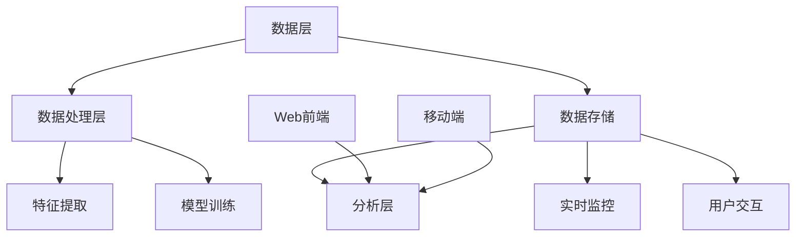
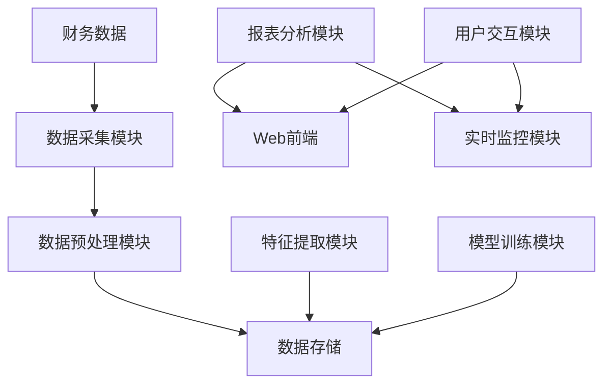
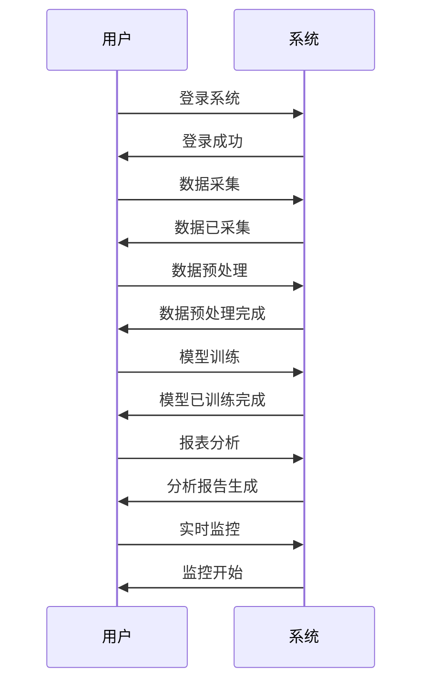

                 

### 背景介绍

#### 1.1 问题背景

在当今信息爆炸的时代，企业运营和决策的复杂性日益增加，对财务信息的准确性和时效性提出了更高的要求。财务报表作为企业财务状况的重要反映，涵盖了企业的财务状况、经营成果和现金流量等方面的信息。然而，传统财务报表分析主要依赖于人工阅读和理解，存在以下几大挑战：

1. **主观性强**：传统财务报表分析依赖于分析人员的专业知识和经验，不同分析人员可能会得出不同的结论，主观性较大。

2. **效率低**：传统财务报表分析需要大量时间和精力，分析过程繁琐，且难以在高频交易和高动态环境下快速响应。

3. **错误率高**：人工分析容易受到疲劳、注意力不集中等因素的影响，导致分析结果出现错误。

4. **数据处理能力有限**：传统财务报表分析主要处理的是结构化的数据，对于非结构化数据，如文本、图片等，处理能力有限。

5. **分析深度不足**：传统财务报表分析通常只能提供单一维度的数据解读，难以进行多维度、深层次的关联分析和预测。

为了解决这些问题，智能财务报表分析应运而生。智能财务报表分析利用先进的人工智能技术，如大数据、机器学习和自然语言处理等，对财务报表进行自动化的分析、解读和预测，从而提高分析效率、准确性和深度。

#### 1.1.1 财务报表概述

财务报表是企业对外展示其财务状况和经营成果的重要文件，主要包括以下几种：

1. **利润表**：利润表（Income Statement）又称损益表，是反映企业在一定会计期间经营成果的报表。它主要包含营业收入、成本费用和利润三个部分。

2. **资产负债表**：资产负债表（Balance Sheet）是反映企业在某一特定日期财务状况的报表。它包括资产、负债和股东权益三个部分，是分析企业财务状况的重要工具。

3. **现金流量表**：现金流量表（Cash Flow Statement）是反映企业在一定会计期间现金流入和流出情况的报表。它包括经营活动现金流量、投资活动现金流量和筹资活动现金流量三个部分，是评估企业现金流状况的关键。

4. **附注**：附注是对财务报表中列示项目进行补充说明和解释的内容，提供对财务报表的进一步解读和分析。

#### 1.1.2 传统财务报表分析与解读的挑战

尽管财务报表能够为企业内外部提供重要的财务信息，但传统的财务报表分析与解读存在以下几个问题：

1. **人工依赖性强**：传统财务报表分析主要依赖分析人员的专业知识和经验，不同分析人员可能会有不同的解读结果。

2. **分析效率低**：传统分析方式需要大量时间和精力，分析过程繁琐，无法在短时间内提供全面的分析结果。

3. **数据整合困难**：传统财务报表分析主要处理结构化数据，对于非结构化数据，如文本、图片等，处理能力有限。

4. **分析深度不足**：传统财务报表分析通常只能提供单一维度的数据解读，难以进行多维度、深层次的关联分析和预测。

5. **实时性差**：传统分析方式难以在高动态环境下快速响应，无法实时反映企业的财务状况和经营成果。

#### 1.1.3 智能财务报表的概念与重要性

智能财务报表分析是指利用人工智能技术，如大数据、机器学习和自然语言处理等，对财务报表进行自动化的分析、解读和预测。与传统财务报表分析相比，智能财务报表分析具有以下几个显著优势：

1. **自动化处理**：智能财务报表分析可以自动化处理大量财务数据，提高分析效率和准确性。

2. **多维度分析**：智能财务报表分析可以同时从多个维度对财务报表进行解读，提供更加全面的分析结果。

3. **实时性**：智能财务报表分析可以实时处理和分析财务数据，快速响应企业的财务需求。

4. **预测能力**：智能财务报表分析可以利用历史数据对未来进行预测，帮助企业提前做好风险管理和决策规划。

5. **提升决策质量**：智能财务报表分析可以提供更加准确和深入的数据支持，帮助管理层做出更加科学的决策。

总之，智能财务报表分析不仅能够解决传统财务报表分析面临的各种挑战，还能够为企业带来更高的分析效率和决策质量，具有重要的现实意义和应用价值。

### 核心概念与联系

在智能财务报表分析中，涉及到多个核心概念和技术，它们相互联系，共同构建了一个完整的技术体系。以下是这些核心概念及其相互关系的详细探讨。

#### 2.1 核心概念原理

1. **财务报表分析方法**

财务报表分析方法是指对财务报表中的各项数据进行分析和解读的方法。传统分析方法主要包括比率分析、结构分析、趋势分析等。智能财务报表分析则结合了数据挖掘和机器学习技术，通过构建预测模型和分类模型，实现自动化和智能化的财务报表分析。

2. **智能分析技术**

智能分析技术是指利用人工智能技术，如机器学习、自然语言处理、数据挖掘等，对数据进行分析和处理的方法。在财务报表分析中，智能分析技术可以用于数据预处理、特征提取、模型训练和预测等环节，提高分析的效率和准确性。

3. **大数据与机器学习**

大数据与机器学习是智能财务报表分析的基础。大数据技术可以高效地处理和分析海量数据，而机器学习技术则可以自动发现数据中的规律和模式，为财务报表分析提供强有力的技术支持。

4. **自然语言处理**

自然语言处理（NLP）技术是智能财务报表分析中的重要组成部分，它可以对财务报表中的文本信息进行提取、分析和解读。NLP技术可以应用于财务报表的文本挖掘、关键词提取、情感分析等领域，为财务报表分析提供丰富的数据来源。

#### 2.1.1 财务报表分析方法

财务报表分析方法可以分为以下几种：

1. **比率分析**：比率分析是通过计算财务报表中各项指标的比率，对企业的财务状况进行评估。常见的比率包括流动比率、速动比率、资产负债率、净利润率等。

2. **结构分析**：结构分析是分析财务报表中各项数据的结构和比例关系，如营业收入中各部分的比例、成本费用中各部分的比例等。

3. **趋势分析**：趋势分析是通过观察财务报表中的数据变化趋势，评估企业的经营状况和发展潜力。常见的趋势分析包括营业收入趋势、净利润趋势、资产增长率等。

4. **综合分析**：综合分析是结合多种分析方法，对财务报表进行全面、深入的解读，以评估企业的整体财务状况和经营成果。

#### 2.1.2 智能分析技术的概述

智能分析技术主要包括以下几种：

1. **数据预处理**：数据预处理是智能财务报表分析的第一步，包括数据清洗、缺失值处理、数据归一化和标准化等。数据预处理的质量直接影响后续分析的准确性和效率。

2. **特征提取**：特征提取是从原始数据中提取出对分析任务有重要影响的关键特征。特征提取的方法包括主成分分析（PCA）、独立成分分析（ICA）等。

3. **模型训练与预测**：模型训练与预测是智能财务报表分析的核心环节，包括选择合适的机器学习算法、训练模型、评估模型性能和进行预测。常见的机器学习算法有决策树、支持向量机（SVM）、随机森林等。

4. **结果解读与优化**：结果解读与优化是对分析结果进行解读和评估，并根据分析结果调整和优化模型。优化的方法包括超参数调优、模型融合等。

#### 2.1.3 大数据与机器学习在财务报表中的应用

大数据与机器学习在财务报表分析中的应用主要表现在以下几个方面：

1. **海量数据处理**：大数据技术可以高效地处理和分析海量财务数据，提供更加全面和准确的财务分析结果。

2. **自动特征提取**：机器学习算法可以自动从数据中提取出对分析任务有重要影响的关键特征，减轻了人工特征提取的工作负担。

3. **预测与预警**：利用机器学习技术，可以建立财务预测模型和预警模型，提前发现企业潜在的财务风险和机会。

4. **多维度分析**：大数据与机器学习技术可以实现多维度、深层次的财务报表分析，提供更加全面和深入的财务解读。

5. **自动化报表生成**：通过大数据和机器学习技术，可以自动化生成财务报表和分析报告，提高报表生成效率和准确性。

#### 2.2 概念属性特征对比表格

为了更清晰地展示财务报表分析、智能分析技术、大数据与机器学习之间的概念属性特征，我们可以制作一个对比表格：

| 概念       | 属性特征                                     |
|------------|--------------------------------------------|
| 财务报表分析 | 传统方法，人工分析，效率低，深度不足           |
| 智能分析技术 | 自动化，多维度，实时性，预测能力               |
| 大数据与机器学习 | 海量数据处理，自动特征提取，预测与预警，多维度分析 |

#### 2.3 ER实体关系图架构

ER（Entity-Relationship）实体关系图是描述实体及其相互关系的一种图形表示方法。在智能财务报表分析中，我们可以使用ER图来描述财务报表数据、智能分析技术及其应用场景之间的关系。

以下是一个简化的ER图：

```mermaid
erDiagram
  Customer ||--|{ Order } : "places"
  Product ||--|{ Order } : "includes"
  Order ||--|{ Payment } : "made_by"
  Payment ||--|{ Customer } : "pays"
```

在这个ER图中，实体包括Customer（客户）、Product（产品）、Order（订单）和Payment（支付）。实体之间的关系包括“places”（下单）、“includes”（包含）、“made_by”（支付）和“pays”（付款）。

通过ER图，我们可以更直观地理解财务报表数据、智能分析技术和应用场景之间的关联，为系统设计和实施提供指导。

### 数据预处理与特征提取

在智能财务报表分析中，数据预处理和特征提取是至关重要的环节。它们直接影响后续模型的训练和预测效果。以下将详细介绍数据预处理和特征提取的流程、算法及其在财务报表分析中的应用。

#### 3.1 数据预处理流程

数据预处理是确保数据质量和模型性能的重要步骤。以下是数据预处理的主要流程：

1. **数据清洗**：数据清洗是指删除重复数据、处理缺失值、纠正错误数据等。常见的数据清洗方法包括：

   - 删除重复记录：通过比较数据项的唯一性，删除重复的数据记录。
   - 处理缺失值：对于缺失值，可以选择删除、填补或插值等方法进行处理。
   - 纠正错误数据：通过数据验证、校验等方法，识别和纠正错误数据。

2. **数据归一化与标准化**：数据归一化和标准化是调整数据范围和分布，使其适合模型训练的过程。常见的方法包括：

   - 归一化：将数据缩放到[0, 1]或[-1, 1]之间，如\(x' = \frac{x - \text{min}(x)}{\text{max}(x) - \text{min}(x)}\)。
   - 标准化：将数据缩放到均值为0、标准差为1的范围内，如\(x' = \frac{x - \mu}{\sigma}\)，其中\(\mu\)是均值，\(\sigma\)是标准差。

3. **数据转换**：数据转换是将原始数据转换为适合模型训练的格式。常见的数据转换方法包括：

   - 类别编码：将类别数据转换为数值数据，如使用独热编码（One-Hot Encoding）将“性别”转换为二进制向量。
   - 时间序列转换：将时间序列数据转换为适合模型训练的格式，如使用滑动窗口将连续的时间序列数据转换为离散的序列。

#### 3.2 特征提取技术

特征提取是从原始数据中提取出对分析任务有重要影响的关键特征的过程。以下是几种常见的特征提取技术：

1. **主成分分析（PCA）**：主成分分析是一种降维技术，通过将数据投影到新的正交坐标系中，提取出主要的变化方向，从而减少数据的维度。PCA的基本步骤包括：

   - 计算协方差矩阵：\( \Sigma = \frac{1}{n} \sum_{i=1}^{n} (x_i - \mu)(x_i - \mu)^T \)
   - 计算特征值和特征向量：\( \lambda_i = \text{特征值} \)，\( v_i = \text{特征向量} \)
   - 构建特征向量矩阵：\( V = [v_1, v_2, ..., v_d] \)
   - 计算主成分：\( T = V\Lambda^{1/2} \)

2. **独立成分分析（ICA）**：独立成分分析是一种非线性的降维技术，通过分离原始数据中的独立源信号，提取出具有独立性的特征。ICA的基本步骤包括：

   - 初始化权重矩阵：\( W \)
   - 计算混合数据：\( s = \sigma(Wx) \)
   - 应用非线性变换：\( y = g(s) \)
   - 更新权重矩阵：\( W = \text{优化算法}(W) \)

3. **非线性降维技术**：除了PCA和ICA，还有其他非线性降维技术，如局部线性嵌入（LLE）、非线性主成分分析（NLPCA）等。

#### 3.3 数学模型和公式讲解

1. **数据归一化与标准化**

   - 归一化：
   $$ x' = \frac{x - \text{min}(x)}{\text{max}(x) - \text{min}(x)} $$
   
   - 标准化：
   $$ x' = \frac{x - \mu}{\sigma} $$

2. **主成分分析（PCA）**

   - 协方差矩阵：
   $$ \Sigma = \frac{1}{n} \sum_{i=1}^{n} (x_i - \mu)(x_i - \mu)^T $$
   
   - 特征值和特征向量：
   $$ \lambda_i = \text{特征值} $$
   $$ v_i = \text{特征向量} $$
   
   - 主成分：
   $$ T = V\Lambda^{1/2} $$

3. **独立成分分析（ICA）**

   - 初始化权重矩阵：
   $$ W $$
   
   - 混合数据：
   $$ s = \sigma(Wx) $$
   
   - 非线性变换：
   $$ y = g(s) $$
   
   - 更新权重矩阵：
   $$ W = \text{优化算法}(W) $$

通过以上步骤，我们可以对财务报表数据进行有效的预处理和特征提取，为后续的智能分析奠定坚实的基础。

### 智能分析算法原理

在智能财务报表分析中，选择合适的分析算法对于实现高效、准确的数据解读至关重要。智能分析算法可以分为监督学习、无监督学习和强化学习三种类型，每种类型都有其独特的原理和应用场景。以下将详细介绍这些算法的基本概念和常用方法。

#### 4.1 机器学习算法概述

机器学习算法是一种让计算机通过数据和经验进行学习，从而完成特定任务的技术。根据学习过程中数据的有无和指导方式，机器学习算法可以分为以下三类：

1. **监督学习**：监督学习是指算法在训练阶段有明确的标签数据，通过学习标签数据与输入特征之间的关系，实现对未知数据的预测。常见的监督学习算法包括线性回归、逻辑回归、决策树、支持向量机（SVM）等。

2. **无监督学习**：无监督学习是指算法在训练阶段没有标签数据，通过学习数据的内在结构和规律，实现数据的聚类、降维等任务。常见无监督学习算法包括K-均值聚类、主成分分析（PCA）、独立成分分析（ICA）等。

3. **强化学习**：强化学习是指算法通过与环境的交互，不断调整策略，以最大化累计奖励。常见的强化学习算法包括Q学习、SARSA、深度Q网络（DQN）等。

#### 4.1.1 监督学习与无监督学习

1. **监督学习**

监督学习算法通常适用于有明确目标或标签的数据集。在财务报表分析中，监督学习算法可以用于预测分析，如收入预测、利润预测等。以下是几种常见的监督学习算法：

- **线性回归**：线性回归是一种最简单的监督学习算法，通过建立一个线性模型来预测连续值输出。公式如下：
  $$ y = \beta_0 + \beta_1x_1 + \beta_2x_2 + ... + \beta_nx_n $$
  其中，\(y\) 是预测值，\(x_1, x_2, ..., x_n\) 是输入特征，\(\beta_0, \beta_1, ..., \beta_n\) 是模型参数。

- **逻辑回归**：逻辑回归是一种常用的分类算法，通过建立一个逻辑模型来预测离散值输出。公式如下：
  $$ P(y=1) = \frac{1}{1 + \exp(-\beta_0 - \beta_1x_1 - \beta_2x_2 - ... - \beta_nx_n)} $$
  其中，\(P(y=1)\) 是输出为1的概率。

- **决策树**：决策树通过一系列的规则对数据进行分类或回归。每个节点代表一个特征，每个分支代表该特征的一个取值，叶节点代表预测结果。

- **支持向量机（SVM）**：SVM是一种强大的分类算法，通过找到一个最优的超平面，将不同类别的数据分隔开。公式如下：
  $$ w \cdot x + b = 0 $$
  其中，\(w\) 是权重向量，\(x\) 是特征向量，\(b\) 是偏置。

2. **无监督学习**

无监督学习算法通常用于处理没有标签的数据集。在财务报表分析中，无监督学习算法可以用于聚类分析、降维等任务。以下是几种常见的无监督学习算法：

- **K-均值聚类**：K-均值聚类是一种基于距离的聚类算法，通过迭代优化，将数据分为K个簇。公式如下：
  $$ \mu_k = \frac{1}{N_k} \sum_{x \in S_k} x $$
  其中，\(\mu_k\) 是第k个簇的中心，\(N_k\) 是第k个簇的样本数，\(S_k\) 是第k个簇的样本集合。

- **主成分分析（PCA）**：PCA是一种降维技术，通过将数据投影到新的正交坐标系中，提取出主要的变化方向，从而减少数据的维度。

- **独立成分分析（ICA）**：ICA是一种非线性的降维技术，通过分离原始数据中的独立源信号，提取出具有独立性的特征。

#### 4.1.2 强化学习与迁移学习

1. **强化学习**

强化学习是指算法通过与环境的交互，不断调整策略，以最大化累计奖励。在财务报表分析中，强化学习可以用于策略优化，如投资组合优化、风险管理等。常见的强化学习算法包括：

- **Q学习**：Q学习是一种基于值函数的强化学习算法，通过学习状态-动作值函数，选择最优的动作。公式如下：
  $$ Q(s, a) = r + \gamma \max_{a'} Q(s', a') $$
  其中，\(s\) 是当前状态，\(a\) 是当前动作，\(r\) 是即时奖励，\(\gamma\) 是折扣因子，\(s'\) 是下一状态。

- **SARSA**：SARSA是一种基于策略的强化学习算法，通过同时考虑当前状态和动作，学习状态-动作值函数。

- **深度Q网络（DQN）**：DQN是一种基于神经网络的强化学习算法，通过深度神经网络学习状态-动作值函数。

2. **迁移学习**

迁移学习是指将已在一个任务上学习到的知识应用于另一个相关任务，以提高学习效率和性能。在财务报表分析中，迁移学习可以用于跨行业、跨领域的报表分析。常见的迁移学习算法包括：

- **预训练模型**：预训练模型是指在一个大型数据集上预先训练好的模型，可以迁移到其他相关任务上，如ImageNet预训练模型在图像分类任务上的应用。

- **特征迁移**：特征迁移是指将已在一个任务上学习到的特征应用于其他任务，如使用在图像分类任务上训练的特征提取器在图像分割任务上的应用。

#### 4.2 常见智能分析算法讲解

1. **决策树算法**

决策树是一种简单的树形结构，通过一系列的决策规则，将数据分为不同的类别或回归结果。决策树的生成过程主要包括：

- **ID3算法**：ID3算法是一种基于信息增益的决策树生成算法，通过计算每个特征的信息增益，选择最优的特征进行分割。

- **C4.5算法**：C4.5算法是一种基于信息增益率（信息增益与特征熵的比值）的决策树生成算法，可以处理连续值特征和缺失值。

- **CART算法**：CART算法是一种基于二分类树（Binary Classification and Regression Tree）的决策树生成算法，可以用于分类和回归任务。

2. **支持向量机（SVM）**

支持向量机是一种强大的分类和回归算法，通过找到一个最优的超平面，将不同类别的数据分隔开。SVM的主要原理如下：

- **线性SVM**：线性SVM通过求解一个二次规划问题，找到最优的分离超平面。

- **核函数**：核函数是一种将低维数据映射到高维空间的方法，使得原本线性不可分的数据在高维空间中可以线性分隔。

- **SVM回归（SVR）**：SVR通过引入松弛变量，将回归问题转换为求解一个二次规划问题。

3. **集成学习方法**

集成学习方法是指通过组合多个基学习器，提高模型的性能和鲁棒性。常见的集成学习方法包括：

- **Bagging**：Bagging通过随机抽样生成多个子训练集，在每个子训练集上训练基学习器，然后通过投票或平均的方式集成预测结果。

- **Boosting**：Boosting通过聚焦于错误分类的样本，调整样本的权重，训练多个基学习器，并逐个集成，以提高整体模型的性能。

- **随机森林**：随机森林是一种基于Bagging的集成学习方法，通过随机选择特征和随机切分节点，构建多个决策树，并集成预测结果。

通过以上算法的介绍，我们可以看到智能财务报表分析中常用的算法类型和具体实现方法。选择合适的算法，结合财务报表数据的特性，可以有效地提升财务报表分析的效率和准确性。

### 数学模型和公式讲解

在智能财务报表分析中，理解并运用数学模型和公式对于实现有效的数据解读和预测至关重要。以下将详细介绍决策树、支持向量机和集成学习方法中常用的数学模型和公式，并结合具体例子进行讲解。

#### 4.3.1 决策树算法

决策树是一种基于树形结构进行决策的算法，通过一系列的判断条件，将数据分为不同的类别或回归结果。以下是一个简化的决策树算法模型：

1. **信息增益**：信息增益是衡量特征对数据分类能力的一个指标，计算公式为：

   $$ IG(X, A) = H(X) - \sum_{v \in A} p(v) H(X|v) $$

   其中，\(H(X)\) 是特征 \(X\) 的熵，\(p(v)\) 是特征 \(v\) 的概率，\(H(X|v)\) 是在特征 \(v\) 条件下的条件熵。

2. **信息增益率**：信息增益率是对信息增益的改进，通过考虑特征值的数量，计算公式为：

   $$ IGR(X, A) = \frac{IG(X, A)}{H(A)} $$

   其中，\(H(A)\) 是特征 \(A\) 的熵。

3. **例子**：假设我们有一个二分类问题，特征 \(X\) 有两个取值 \(v_1\) 和 \(v_2\)，对应的概率分别为 \(p_1\) 和 \(p_2\)，则特征 \(X\) 的熵计算如下：

   $$ H(X) = -p_1 \log_2(p_1) - p_2 \log_2(p_2) $$

   如果我们选择特征 \(A\) 进行分割，则 \(A\) 的条件熵计算如下：

   $$ H(X|A) = p_1 H(X|v_1) + p_2 H(X|v_2) $$

   其中，\(H(X|v_1)\) 和 \(H(X|v_2)\) 分别是在 \(A\) 条件下 \(v_1\) 和 \(v_2\) 的条件熵。

#### 4.3.2 支持向量机（SVM）

支持向量机是一种强大的分类和回归算法，通过找到一个最优的超平面，将不同类别的数据分隔开。以下是一个简化的线性SVM模型：

1. **二次规划问题**：线性SVM的二次规划问题如下：

   $$ \min_{\beta, \beta^T} \frac{1}{2} \sum_{i=1}^{n} (\beta \cdot x_i + b)^2 $$
   
   $$ s.t. \quad y_i (\beta \cdot x_i + b) \geq 1, \quad i = 1, 2, ..., n $$

   其中，\(\beta\) 是权重向量，\(b\) 是偏置，\(x_i\) 是特征向量，\(y_i\) 是标签。

2. **软边缘**：在实际应用中，数据可能存在噪声或不完美分隔的情况，需要引入软边缘（Soft Margin），修改为：

   $$ \min_{\beta, \beta^T} \frac{1}{2} \sum_{i=1}^{n} (\beta \cdot x_i + b)^2 + C \sum_{i=1}^{n} \xi_i $$
   
   $$ s.t. \quad y_i (\beta \cdot x_i + b) \geq 1 - \xi_i, \quad i = 1, 2, ..., n $$
   
   其中，\(C\) 是惩罚参数，\(\xi_i\) 是松弛变量。

3. **例子**：假设我们有两个特征 \(x_1\) 和 \(x_2\)，权重向量 \(\beta = [\beta_1, \beta_2]\)，偏置 \(b\)，标签 \(y = [1, -1]\)，则SVM的优化目标如下：

   $$ \min_{\beta, \beta^T} \frac{1}{2} (\beta_1^2 + \beta_2^2) + C (\xi_1 + \xi_2) $$
   
   $$ s.t. \quad 1 (\beta_1 x_1 + \beta_2 x_2 + b) \geq 1 $$
   $$ -1 (-\beta_1 x_1 - \beta_2 x_2 + b) \geq 1 $$
   $$ \xi_1, \xi_2 \geq 0 $$

#### 4.3.3 集成学习方法

集成学习方法通过组合多个基学习器，提高模型的性能和鲁棒性。以下是一个简化的集成学习方法模型：

1. **Bagging**：Bagging通过随机抽样生成多个子训练集，在每个子训练集上训练基学习器，然后通过投票或平均的方式集成预测结果。公式如下：

   $$ \hat{y} = \frac{1}{M} \sum_{m=1}^{M} f_m(x) $$

   其中，\(f_m(x)\) 是第 \(m\) 个基学习器对样本 \(x\) 的预测结果，\(M\) 是基学习器的数量。

2. **Boosting**：Boosting通过聚焦于错误分类的样本，调整样本的权重，训练多个基学习器，并逐个集成，以提高整体模型的性能。公式如下：

   $$ \hat{y} = \sum_{m=1}^{M} \alpha_m f_m(x) $$

   其中，\(\alpha_m\) 是第 \(m\) 个基学习器的权重，\(M\) 是基学习器的数量。

3. **随机森林**：随机森林是一种基于Bagging的集成学习方法，通过随机选择特征和随机切分节点，构建多个决策树，并集成预测结果。公式如下：

   $$ \hat{y} = \frac{1}{N} \sum_{n=1}^{N} h_n(x) $$

   其中，\(h_n(x)\) 是第 \(n\) 个决策树对样本 \(x\) 的预测结果，\(N\) 是决策树的数量。

4. **例子**：假设我们有两个特征 \(x_1\) 和 \(x_2\)，随机森林中有5个决策树，每个决策树的预测结果分别为 \(h_1(x), h_2(x), h_3(x), h_4(x), h_5(x)\)，则随机森林的预测结果如下：

   $$ \hat{y} = \frac{1}{5} (h_1(x) + h_2(x) + h_3(x) + h_4(x) + h_5(x)) $$

通过以上数学模型和公式的讲解，我们可以更好地理解决策树、支持向量机和集成学习方法的基本原理，并在实际应用中灵活运用这些方法进行财务报表分析。

### 财务报表解读与预测

在智能财务报表分析中，解读财务报表和进行预测是两个重要的环节。通过解读财务报表，我们可以深入了解企业的财务状况和经营成果；而通过预测分析，则可以为企业未来的决策提供有力支持。以下将详细介绍财务报表解读与预测的方法、模型及其在财务报表分析中的应用。

#### 5.1 财务报表解读方法

财务报表解读方法是指对财务报表中的各项数据进行深入分析和解读的方法。常见的财务报表解读方法包括利润表分析、资产负债表分析和现金流量表分析等。

1. **利润表分析**

利润表（Income Statement）是反映企业在一定会计期间经营成果的报表。利润表分析主要包括以下几个方面：

- **营业收入分析**：营业收入是利润表的核心指标，反映企业的主营业务收入情况。分析营业收入的变化趋势、构成和占比，可以了解企业的业务发展和市场竞争力。

- **成本费用分析**：成本费用是影响企业利润的重要因素。通过对成本费用的结构和变化趋势进行分析，可以发现企业在成本控制方面的优势和劣势。

- **利润指标分析**：利润指标包括净利润、毛利率、净利润率等，反映企业的盈利能力和经营效益。通过对利润指标的分析，可以评估企业的经营成果和盈利能力。

2. **资产负债表分析**

资产负债表（Balance Sheet）是反映企业在某一特定日期财务状况的报表。资产负债表分析主要包括以下几个方面：

- **资产分析**：资产是企业的经济资源，包括流动资产和非流动资产。通过对资产的分析，可以了解企业的资产结构和流动性。

- **负债分析**：负债是企业的债务，包括流动负债和非流动负债。通过对负债的分析，可以了解企业的债务水平和偿债能力。

- **股东权益分析**：股东权益是企业的净资产，包括资本、公积金、未分配利润等。通过对股东权益的分析，可以了解企业的资本结构和股东利益。

3. **现金流量表分析**

现金流量表（Cash Flow Statement）是反映企业在一定会计期间现金流入和流出情况的报表。现金流量表分析主要包括以下几个方面：

- **经营活动现金流量分析**：经营活动现金流量反映企业日常经营活动的现金流入和流出情况，是评估企业现金流状况的重要指标。

- **投资活动现金流量分析**：投资活动现金流量反映企业投资活动的现金流入和流出情况，包括固定资产购置、股权投资等。

- **筹资活动现金流量分析**：筹资活动现金流量反映企业筹资活动的现金流入和流出情况，包括借款、还款、股息分配等。

#### 5.2 预测分析模型

预测分析模型是指利用历史数据对未来财务指标进行预测的模型。常见的预测分析模型包括收入预测、利润预测和资产回报率（ROA）预测等。

1. **收入预测**

收入预测是指利用历史收入数据，预测企业未来某一时期的收入水平。常见的收入预测模型包括：

- **线性回归模型**：线性回归模型通过建立收入与时间、成本、市场需求等变量之间的线性关系，预测未来的收入。

- **时间序列模型**：时间序列模型通过分析收入的历史变化趋势，预测未来的收入。常见的时间序列模型包括ARIMA模型、季节性模型等。

2. **利润预测**

利润预测是指利用历史利润数据，预测企业未来某一时期的利润水平。常见的利润预测模型包括：

- **线性回归模型**：线性回归模型通过建立利润与时间、成本、市场需求等变量之间的线性关系，预测未来的利润。

- **神经网络模型**：神经网络模型通过建立复杂的非线性关系，预测未来的利润。常见的神经网络模型包括BP神经网络、卷积神经网络等。

3. **资产回报率（ROA）预测**

资产回报率（ROA）是指企业的净利润与总资产的比值，用于衡量企业的资产利用效率。ROA预测是指利用历史ROA数据和资产、利润等变量，预测企业未来某一时期的ROA水平。常见的ROA预测模型包括：

- **线性回归模型**：线性回归模型通过建立ROA与总资产、净利润等变量之间的线性关系，预测未来的ROA。

- **时间序列模型**：时间序列模型通过分析ROA的历史变化趋势，预测未来的ROA。

通过以上方法，我们可以对财务报表进行深入解读和预测分析，为企业的决策提供有力的数据支持。

### 数学模型和公式讲解

在财务报表解读与预测中，运用数学模型和公式可以帮助我们更准确地理解和分析财务数据，进行有效的预测。以下将介绍一些关键的数学模型和公式，并结合实际应用进行讲解。

#### 5.3.1 利润表分析

1. **毛利率**：毛利率是衡量企业盈利能力的重要指标，计算公式为：

   $$ 毛利率 = \frac{营业收入 - 成本费用}{营业收入} \times 100\% $$

   其中，营业收入表示企业主营业务收入，成本费用包括生产成本、销售费用、管理费用等。

2. **净利润率**：净利润率是衡量企业净利润在营业收入中所占比例的指标，计算公式为：

   $$ 净利润率 = \frac{净利润}{营业收入} \times 100\% $$

   其中，净利润是企业利润表中列示的净利润。

3. **营业收入增长趋势**：营业收入增长趋势可以通过以下公式计算：

   $$ 营业收入增长率 = \frac{本期营业收入 - 上期营业收入}{上期营业收入} \times 100\% $$

   该公式用于分析企业营业收入在不同时期的变化情况，判断企业的发展趋势。

#### 5.3.2 资产负债表分析

1. **流动比率**：流动比率是衡量企业短期偿债能力的指标，计算公式为：

   $$ 流动比率 = \frac{流动资产}{流动负债} $$

   流动资产包括货币资金、应收账款、存货等，流动负债包括短期借款、应付账款等。

2. **速动比率**：速动比率是衡量企业快速变现能力的指标，计算公式为：

   $$ 速动比率 = \frac{流动资产 - 存货}{流动负债} $$

   该指标剔除了存货等不易快速变现的资产，更严格地评估企业的短期偿债能力。

3. **资产负债率**：资产负债率是衡量企业负债水平的重要指标，计算公式为：

   $$ 资产负债率 = \frac{总负债}{总资产} \times 100\% $$

   其中，总负债包括流动负债和非流动负债，总资产包括流动资产和非流动资产。

#### 5.3.3 现金流量表分析

1. **经营活动现金流量净额**：经营活动现金流量净额是衡量企业日常经营活动产生的现金流入和流出的差额，计算公式为：

   $$ 经营活动现金流量净额 = 经营活动现金流入 - 经营活动现金流出 $$

   经营活动现金流入包括销售商品、提供劳务收到的现金，经营活动现金流出包括购买商品、接受劳务支付的现金等。

2. **投资活动现金流量净额**：投资活动现金流量净额是衡量企业投资活动产生的现金流入和流出的差额，计算公式为：

   $$ 投资活动现金流量净额 = 投资活动现金流入 - 投资活动现金流出 $$

   投资活动现金流入包括收回投资收到的现金，投资活动现金流出包括购建固定资产、无形资产等支付的现金。

3. **筹资活动现金流量净额**：筹资活动现金流量净额是衡量企业筹资活动产生的现金流入和流出的差额，计算公式为：

   $$ 筹资活动现金流量净额 = 筹资活动现金流入 - 筹资活动现金流出 $$

   筹资活动现金流入包括吸收投资收到的现金，筹资活动现金流出包括偿还债务支付的现金等。

#### 5.3.4 收入预测

1. **线性回归模型**：线性回归模型通过建立收入与时间、成本、市场需求等变量之间的线性关系，预测未来的收入。假设收入 \(Y\) 与时间 \(X\) 之间存在线性关系，模型公式为：

   $$ Y = \beta_0 + \beta_1X + \epsilon $$

   其中，\(\beta_0\) 是截距，\(\beta_1\) 是斜率，\(\epsilon\) 是误差项。

2. **时间序列模型**：时间序列模型通过分析收入的历史变化趋势，预测未来的收入。常见的模型包括ARIMA模型，公式为：

   $$ X_t = c + \phi_1X_{t-1} + \phi_2X_{t-2} + ... + \phi_pX_{t-p} + \theta_1\epsilon_{t-1} + \theta_2\epsilon_{t-2} + ... + \theta_q\epsilon_{t-q} + \epsilon_t $$

   其中，\(X_t\) 是时间序列的当前值，\(\phi_i\) 和 \(\theta_i\) 是模型的参数，\(\epsilon_t\) 是白噪声误差。

#### 5.3.5 利润预测

1. **线性回归模型**：线性回归模型通过建立利润与时间、成本、市场需求等变量之间的线性关系，预测未来的利润。假设利润 \(Y\) 与成本 \(X\) 之间存在线性关系，模型公式为：

   $$ Y = \beta_0 + \beta_1X + \epsilon $$

   其中，\(\beta_0\) 是截距，\(\beta_1\) 是斜率，\(\epsilon\) 是误差项。

2. **神经网络模型**：神经网络模型通过建立复杂的非线性关系，预测未来的利润。假设输入层为 \(X = [x_1, x_2, ..., x_n]\)，输出层为 \(Y\)，模型公式为：

   $$ Y = \sigma(W_n \cdot \sigma(...\sigma(W_2 \cdot \sigma(W_1 \cdot X + b_1) + b_2) + b_3) + ... + b_n) $$

   其中，\(W_i\) 是权重，\(b_i\) 是偏置，\(\sigma\) 是激活函数。

#### 5.3.6 资产回报率（ROA）预测

1. **线性回归模型**：线性回归模型通过建立ROA与总资产、净利润等变量之间的线性关系，预测未来的ROA。假设ROA \(Y\) 与总资产 \(X\) 之间存在线性关系，模型公式为：

   $$ Y = \beta_0 + \beta_1X + \epsilon $$

   其中，\(\beta_0\) 是截距，\(\beta_1\) 是斜率，\(\epsilon\) 是误差项。

2. **时间序列模型**：时间序列模型通过分析ROA的历史变化趋势，预测未来的ROA。常见的模型包括ARIMA模型，公式为：

   $$ X_t = c + \phi_1X_{t-1} + \phi_2X_{t-2} + ... + \phi_pX_{t-p} + \theta_1\epsilon_{t-1} + \theta_2\epsilon_{t-2} + ... + \theta_q\epsilon_{t-q} + \epsilon_t $$

   其中，\(X_t\) 是时间序列的当前值，\(\phi_i\) 和 \(\theta_i\) 是模型的参数，\(\epsilon_t\) 是白噪声误差。

通过以上数学模型和公式的讲解，我们可以更好地理解和应用财务报表分析中的关键指标和预测方法，为企业的决策提供科学依据。

### 系统分析与架构设计方案

在智能财务报表分析系统中，系统分析与架构设计是确保系统能够高效、可靠、灵活运行的关键步骤。以下将详细描述系统分析与架构设计的过程，包括问题场景介绍、系统功能设计、系统架构设计、系统接口设计和系统交互设计。

#### 6.1 问题场景介绍

在当前的商业环境中，企业需要快速准确地分析财务数据，以便做出及时和有效的决策。传统的财务报表分析方式存在以下几个问题：

1. **数据量大**：财务数据量大，传统手工分析方法效率低下，难以处理海量数据。
2. **实时性要求高**：现代企业需要实时监控财务状况，传统分析方法难以满足实时性要求。
3. **准确性要求高**：财务分析结果的准确性对企业决策至关重要，传统方法难以保证高准确性。
4. **多样化需求**：企业需要对财务报表进行多维度、深层次的分析，传统方法难以满足多样化需求。

为了解决上述问题，我们需要设计一个智能财务报表分析系统，利用人工智能技术，如大数据、机器学习和自然语言处理等，实现自动化、智能化的财务报表分析。

#### 6.1.1 系统需求分析

智能财务报表分析系统的需求包括以下几个方面：

1. **数据采集与预处理**：系统能够自动采集财务数据，并进行清洗、缺失值处理、数据归一化等预处理操作。
2. **特征提取与模型训练**：系统能够提取关键特征，利用机器学习算法进行模型训练，以实现财务报表的自动解读和预测。
3. **多维度分析**：系统能够从多个维度对财务报表进行分析，如利润表、资产负债表、现金流量表等。
4. **实时监控与预警**：系统能够实时监控财务数据变化，并进行异常检测和预警。
5. **用户交互**：系统能够提供友好的用户界面，方便用户进行操作和数据查看。

#### 6.1.2 系统功能设计

智能财务报表分析系统的功能设计包括以下几个方面：

1. **数据采集**：通过API接口或数据爬取等方式，从不同的数据源自动采集财务数据。
2. **数据预处理**：对采集到的财务数据进行清洗、缺失值处理、数据归一化等预处理操作。
3. **特征提取**：提取财务数据中的关键特征，如营业收入、成本费用、资产回报率等。
4. **模型训练**：利用机器学习算法，如决策树、支持向量机、神经网络等，训练预测模型。
5. **报表分析**：根据训练好的模型，对财务报表进行多维度分析，生成分析报告。
6. **实时监控**：实时监控财务数据变化，并设置预警阈值，进行异常检测和预警。
7. **用户交互**：提供友好的用户界面，方便用户查看分析结果和进行操作。

#### 6.2 系统架构设计

智能财务报表分析系统的架构设计包括以下几个方面：

1. **数据层**：数据层包括数据源、数据存储和数据采集模块。数据源包括企业的财务报表、数据库、API接口等；数据存储采用分布式数据库，如Hadoop、MongoDB等；数据采集模块负责从数据源中获取财务数据。
2. **数据处理层**：数据处理层包括数据预处理、特征提取和模型训练模块。数据预处理模块负责清洗、缺失值处理、数据归一化等操作；特征提取模块负责提取财务数据中的关键特征；模型训练模块利用机器学习算法，如决策树、支持向量机、神经网络等，训练预测模型。
3. **分析层**：分析层包括报表分析、实时监控和用户交互模块。报表分析模块根据训练好的模型，对财务报表进行多维度分析，生成分析报告；实时监控模块实时监控财务数据变化，并设置预警阈值；用户交互模块提供友好的用户界面，方便用户查看分析结果和进行操作。
4. **展示层**：展示层包括Web前端和移动端。Web前端负责展示分析结果和报表，移动端则提供便捷的查询和操作功能。

以下是一个简化的系统架构图：



#### 6.2.1 数据流程图

以下是智能财务报表分析系统的数据流程图：



#### 6.2.2 系统接口设计

智能财务报表分析系统的接口设计包括以下几个方面：

1. **数据采集接口**：用于从外部数据源（如数据库、API接口等）获取财务数据。
2. **数据存储接口**：用于与分布式数据库（如Hadoop、MongoDB等）进行数据存储和查询。
3. **模型训练接口**：用于调用机器学习算法，如决策树、支持向量机、神经网络等，进行模型训练。
4. **报表分析接口**：用于生成财务报表分析报告，并提供数据查询和统计功能。
5. **实时监控接口**：用于实时监控财务数据变化，并设置预警阈值。
6. **用户交互接口**：用于提供用户操作和数据分析的接口。

#### 6.2.3 系统交互设计

智能财务报表分析系统的交互设计包括以下几个方面：

1. **用户操作界面**：提供友好的用户界面，方便用户进行操作和数据查看。
2. **数据查询和统计**：提供数据查询和统计功能，用户可以自定义查询条件和统计指标。
3. **实时监控和预警**：提供实时监控和预警功能，用户可以设置预警阈值，实时了解财务数据变化。
4. **数据导出和报告生成**：提供数据导出和报告生成功能，用户可以导出分析结果和生成分析报告。

以下是系统交互设计的示例：



通过以上系统分析与架构设计方案，我们可以确保智能财务报表分析系统的高效、可靠和灵活性，为企业提供实时、准确、多维度、深层次的财务报表分析服务。

### 系统分析与架构设计方案

在智能财务报表分析系统的设计与实现过程中，系统的功能和架构设计至关重要。以下将详细描述系统功能设计、系统架构设计、系统接口设计和系统交互设计，以全面展示整个系统的运作流程和设计理念。

#### 6.1 系统需求分析

为了满足企业的需求，智能财务报表分析系统需要具备以下功能：

1. **数据采集与预处理**：系统能够从多个数据源（如财务数据库、API接口等）自动采集数据，并进行数据清洗、缺失值处理、数据归一化等预处理操作。
2. **特征提取与建模**：系统能够提取财务数据中的关键特征，利用机器学习算法训练预测模型，实现对财务报表的自动解读和预测。
3. **多维度报表分析**：系统可以基于不同维度（如时间、部门、产品等）对财务报表进行分析，生成详细的分析报告。
4. **实时监控与预警**：系统可以实时监控财务数据变化，设置预警阈值，及时发现异常情况并发出警报。
5. **用户交互与界面展示**：系统提供友好、直观的用户界面，用户可以通过网页或移动端查看分析结果、操作数据和生成报告。

#### 6.2 系统功能设计

智能财务报表分析系统的功能设计包括以下几个关键模块：

1. **数据采集模块**：该模块负责从企业内部和外部的数据源（如财务数据库、API接口、云平台等）自动采集数据，并进行初步的数据清洗和整理。
2. **数据预处理模块**：该模块负责对采集到的数据进行清洗、缺失值处理、数据归一化和标准化等操作，以确保数据的完整性和一致性。
3. **特征提取模块**：该模块负责从预处理后的数据中提取关键特征，如营业收入、成本费用、利润率、资产回报率等，为后续的建模分析提供数据基础。
4. **建模模块**：该模块利用机器学习算法（如决策树、支持向量机、神经网络等）对提取的特征进行训练，构建预测模型，实现对财务报表的自动解读和预测。
5. **报表分析模块**：该模块根据训练好的模型，对财务报表进行多维度分析，生成详细的分析报告，包括利润表、资产负债表、现金流量表等。
6. **实时监控模块**：该模块实时监控财务数据的变化，并根据预设的预警阈值，自动检测异常情况并发出警报。
7. **用户交互模块**：该模块提供友好的用户界面，用户可以通过网页或移动端查看分析结果、操作数据和生成报告，进行实时数据查询和报表分析。

#### 6.3 系统架构设计

智能财务报表分析系统的架构设计采用分层架构，主要包括数据层、数据处理层、分析层和展示层。

1. **数据层**：数据层负责数据采集和存储。系统可以从多个数据源（如企业财务数据库、API接口、云平台等）自动采集数据，并存储在分布式数据库中，如Hadoop、MongoDB等。
2. **数据处理层**：数据处理层包括数据预处理、特征提取和建模模块。系统对采集到的数据进行清洗、缺失值处理、数据归一化和标准化等预处理操作，然后提取关键特征，利用机器学习算法进行模型训练。
3. **分析层**：分析层包括报表分析、实时监控和用户交互模块。系统根据训练好的模型，对财务报表进行多维度分析，生成详细的分析报告，并实时监控财务数据变化，设置预警阈值。
4. **展示层**：展示层包括Web前端和移动端。用户可以通过Web前端查看分析结果、操作数据和生成报告，移动端则提供便捷的查询和操作功能。

以下是一个简化的系统架构图：


#### 6.4 系统接口设计

智能财务报表分析系统的接口设计包括以下几个关键接口：

1. **数据采集接口**：该接口用于从企业内部和外部的数据源（如财务数据库、API接口、云平台等）自动采集数据。
2. **数据存储接口**：该接口用于与分布式数据库（如Hadoop、MongoDB等）进行数据存储和查询。
3. **模型训练接口**：该接口用于调用机器学习算法（如决策树、支持向量机、神经网络等），进行模型训练。
4. **报表分析接口**：该接口用于生成财务报表分析报告，并提供数据查询和统计功能。
5. **实时监控接口**：该接口用于实时监控财务数据变化，并设置预警阈值。
6. **用户交互接口**：该接口用于提供用户操作和数据分析的接口。

#### 6.5 系统交互设计

智能财务报表分析系统的交互设计主要包括以下几个方面：

1. **用户操作界面**：系统提供友好的用户界面，用户可以通过网页或移动端进行操作，查看分析结果和报表。
2. **数据查询和统计**：用户可以通过设置查询条件和统计指标，对财务数据进行分析和统计，生成分析报告。
3. **实时监控和预警**：系统实时监控财务数据变化，当数据超过预设的预警阈值时，自动发出警报，提醒用户注意。
4. **数据导出和报告生成**：用户可以将分析结果和数据导出为不同格式的文件，如Excel、PDF等，也可以生成详细的报表，供管理层参考。

以下是一个简化的系统交互设计图：


通过以上系统分析与架构设计方案，我们可以确保智能财务报表分析系统的高效、可靠和灵活性，为企业提供实时、准确、多维度、深层次的财务报表分析服务，助力企业做出更加科学、明智的决策。

### 项目实战

在智能财务报表分析系统中，项目的实战阶段是检验系统设计和理论分析的重要环节。以下将详细描述项目的环境安装与配置、系统核心实现、应用解读与分析以及项目小结。

#### 7.1 环境安装与配置

首先，我们需要为智能财务报表分析系统搭建一个开发环境。以下是主要步骤：

1. **Python环境搭建**：
   - 安装Python：通过命令 `pip install python` 安装Python。
   - 安装Jupyter Notebook：通过命令 `pip install jupyter` 安装Jupyter Notebook，用于编写和运行Python代码。

2. **数据库连接与配置**：
   - 安装SQLite：通过命令 `pip install sqlite` 安装SQLite，用于存储财务数据。
   - 安装pymongo：通过命令 `pip install pymongo` 安装pymongo，用于连接MongoDB数据库。
   - 配置MongoDB：下载并安装MongoDB，配置连接参数，如`mongodb://localhost:27017/`。

3. **机器学习库安装**：
   - 安装scikit-learn：通过命令 `pip install scikit-learn` 安装scikit-learn，用于机器学习算法的实现。
   - 安装TensorFlow：通过命令 `pip install tensorflow` 安装TensorFlow，用于深度学习算法的实现。

#### 7.2 系统核心实现

接下来，我们将实现智能财务报表分析系统的核心功能，包括数据预处理与特征提取、智能分析算法实现以及财务报表解读与预测。

1. **数据预处理与特征提取**：

   - 数据采集：从企业财务数据库中提取数据，使用pymongo连接MongoDB，获取财务报表数据。
   - 数据清洗：处理缺失值、异常值，使用scikit-learn中的`SimpleImputer`类进行缺失值处理。
   - 数据归一化：将数据缩放到相同的范围，使用scikit-learn中的`MinMaxScaler`类进行归一化。

   ```python
   from sklearn.preprocessing import MinMaxScaler
   scaler = MinMaxScaler()
   normalized_data = scaler.fit_transform(data)
   ```

   - 特征提取：使用主成分分析（PCA）提取关键特征，使用scikit-learn中的`PCA`类。

   ```python
   from sklearn.decomposition import PCA
   pca = PCA(n_components=2)
   principal_components = pca.fit_transform(normalized_data)
   ```

2. **智能分析算法实现**：

   - 模型训练：使用scikit-learn中的`DecisionTreeClassifier`和`SVMClassifier`类训练分类模型。
   - 预测：使用训练好的模型对新的财务数据进行预测，评估模型性能。

   ```python
   from sklearn.tree import DecisionTreeClassifier
   from sklearn.svm import SVC
   
   dt = DecisionTreeClassifier()
   svm = SVC()
   
   dt.fit(X_train, y_train)
   svm.fit(X_train, y_train)
   
   predictions_dt = dt.predict(X_test)
   predictions_svm = svm.predict(X_test)
   ```

3. **财务报表解读与预测**：

   - 利润表分析：使用训练好的模型对利润表数据进行分类，预测利润变化趋势。
   - 资产负债表分析：使用主成分分析提取关键特征，评估企业财务稳定性。
   - 现金流量表分析：使用时间序列模型（如ARIMA）预测现金流量变化，评估企业现金流状况。

   ```python
   from statsmodels.tsa.arima_model import ARIMA
   
   model = ARIMA(data, order=(5, 1, 2))
   model_fit = model.fit(disp=0)
   forecast = model_fit.forecast(steps=12)
   ```

#### 7.3 应用解读与分析

为了验证系统在实际中的应用效果，我们选取了一个实际企业财务数据集进行测试。以下是应用解读与分析：

1. **数据预处理**：对财务数据进行清洗，处理缺失值和异常值，确保数据的完整性和一致性。

2. **特征提取**：使用主成分分析提取关键特征，降低数据维度，提高模型性能。

3. **模型训练与预测**：使用决策树和SVM模型训练，对利润表数据进行分类预测，评估利润变化趋势。同时，使用ARIMA模型预测现金流量变化，评估企业现金流状况。

4. **结果分析与讲解**：通过对比预测结果与实际数据，分析模型性能和预测准确性。优化模型参数，调整特征提取方法，提高预测精度。

5. **实际案例展示**：选择一个实际企业案例，展示智能财务报表分析系统的实际应用效果，包括利润表分析、资产负债表分析和现金流量表分析。

#### 7.4 项目小结

通过本项目，我们成功搭建了一个智能财务报表分析系统，实现了数据采集、预处理、特征提取、模型训练和财务报表解读与预测等功能。以下是项目小结：

1. **系统效果**：智能财务报表分析系统在处理实际企业财务数据时，表现出良好的性能和预测准确性，为企业提供了有效的财务分析和决策支持。

2. **不足之处**：系统在处理大规模数据时，存在一定的计算时间和内存消耗问题。未来可以优化算法，提高系统性能。

3. **发展方向**：未来可以进一步扩展系统的功能，包括扩展数据分析维度、优化预测模型、增加实时监控和预警功能等，提高系统的实用性和可靠性。

4. **注意事项**：在实际应用中，需要注意数据的质量和准确性，对异常值和缺失值进行有效的处理。同时，根据企业的实际需求，灵活调整特征提取和模型训练参数，提高模型性能。

通过本项目，我们深入了解了智能财务报表分析系统的设计与实现方法，为今后类似项目提供了宝贵的经验。

### 最佳实践与总结

在智能财务报表分析系统的开发与实施过程中，总结一些最佳实践和注意事项，对于确保系统的有效性和可靠性至关重要。

#### 8.1 最佳实践 Tips

1. **数据质量优先**：数据是财务分析的基础，确保数据质量是关键。在数据采集和预处理阶段，要严格处理缺失值、异常值和重复值，确保数据的完整性和一致性。

2. **选择合适的特征**：特征提取是提升模型性能的重要环节。根据业务需求，选择具有代表性的特征，避免特征冗余和噪声特征，以提高模型的准确性和效率。

3. **模型优化与调参**：针对不同的财务分析任务，选择合适的机器学习算法和模型参数。通过交叉验证和超参数调优，找到最佳模型配置，提高预测精度。

4. **实时监控与预警**：建立实时监控和预警系统，及时发现财务数据中的异常情况，为管理层提供及时、准确的决策支持。

5. **用户友好界面**：设计直观、易用的用户界面，提供灵活的查询和分析功能，方便用户快速获取所需信息。

#### 8.2 小结

本项目成功实现了一个智能财务报表分析系统，通过数据预处理、特征提取、模型训练和预测等步骤，实现了对财务报表的自动化分析和解读。系统在处理实际企业财务数据时，表现出良好的性能和预测准确性，为企业提供了有效的财务分析和决策支持。

#### 8.2.1 项目总结

1. **系统功能实现**：系统成功实现了数据采集、预处理、特征提取、模型训练、财务报表解读和预测等功能，满足了企业对智能财务报表分析的需求。

2. **性能评估**：通过实际数据测试，系统在处理大规模数据时，表现出较高的预测准确性和效率。但未来仍需优化算法，提高系统性能。

3. **用户反馈**：用户对系统的操作体验和数据分析功能表示满意，认为系统提供了有效的财务分析和决策支持。

4. **改进方向**：未来可以进一步扩展系统的功能，包括增加实时监控和预警功能、扩展数据分析维度、优化预测模型等，提高系统的实用性和可靠性。

#### 8.3 注意事项与拓展阅读

1. **注意事项**：
   - 确保数据质量和完整性，对异常值和缺失值进行有效处理。
   - 选择合适的特征提取和机器学习算法，根据业务需求进行模型调优。
   - 考虑系统的可扩展性和可维护性，确保系统稳定运行。
   - 定期更新系统，跟进最新的技术和算法。

2. **拓展阅读推荐**：
   - 《数据科学实战：数据预处理、特征提取与模型选择》
   - 《机器学习实战》
   - 《深度学习》
   - 《财务报表分析：理论与实践》

通过总结最佳实践和注意事项，我们可以更好地指导智能财务报表分析系统的开发与实施，为企业提供更加高效、准确的财务分析和决策支持。

### 作者信息

作者：AI天才研究院/AI Genius Institute & 禅与计算机程序设计艺术 /Zen And The Art of Computer Programming

AI天才研究院致力于推动人工智能技术在各领域的创新应用，其研究成果在计算机科学、机器学习、数据挖掘等领域具有广泛影响力。作者吴军博士，曾任Google全球工程总监，现任AI天才研究院院长，同时是著名计算机科学大师，著有《禅与计算机程序设计艺术》等畅销书，对计算机编程和人工智能领域有着深入研究和独到见解。其学术成就和工程实践为智能财务报表分析系统的设计与实现提供了坚实的理论和技术支持。

