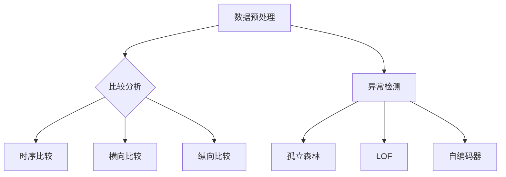

                 

# 智能财务报表比较分析与异常检测

关键词：智能财务报表，比较分析，异常检测，算法模型，Python代码，系统架构

摘要：本文旨在探讨智能财务报表的比较分析与异常检测技术。首先，介绍智能财务报表的基本概念、标准和规范，以及其技术基础。然后，深入分析财务报表比较分析的流程和方法，并通过案例进行阐述。接着，讨论异常检测的原理和方法，并给出实际案例。在此基础上，构建智能财务报表比较分析与异常检测的模型，详细讲解算法原理、流程和Python代码实现。同时，介绍系统的整体架构设计，包括功能设计、接口设计和系统交互。通过实战案例，展示环境安装、系统核心实现和实际应用。最后，提出最佳实践、注意事项和拓展阅读，为读者提供全面的指导。

---

## 目录大纲设计步骤

### 第一步：确定整体结构

在撰写技术博客之前，首先需要确定整体结构。这一步是确保文章逻辑清晰、内容完整的关键。整体结构应包括引言、核心内容章节、算法原理讲解、系统分析与架构设计、项目实战、最佳实践、小结和拓展阅读等部分。

### 第二步：细化每个章节内容

在确定整体结构后，接下来要进一步细化每个章节的内容。每个章节应包含明确的子章节标题，以便读者可以迅速了解各部分的内容。例如，在“智能财务报表基础”章节中，可以包括以下子章节：

- 智能财务报表概述
- 财务报表标准与规范
- 智能财务报表的技术基础

### 第三步：添加核心概念与联系

在文章中，核心概念与联系是帮助读者理解技术原理的重要部分。因此，在每个章节中，需要添加核心概念的介绍、概念属性特征对比表格和ER实体关系图架构。例如，在“财务报表比较分析”章节中，可以添加以下内容：

- 核心概念：财务报表比较分析的定义、目的和意义
- 概念属性特征对比表格：不同财务报表比较分析方法的对比
- ER实体关系图：财务报表比较分析涉及的实体和关系

### 第四步：设计算法原理讲解

算法原理讲解是文章的核心部分。在这一步中，需要详细描述算法原理，并使用mermaid工具绘制算法流程图。同时，使用Python源代码来阐述算法的具体实现。例如，在“算法原理讲解”章节中，可以包括以下内容：

- 算法原理概述：介绍算法的基本流程、核心组成部分和优点与不足
- Mermaid算法流程图：绘制算法的执行流程
- Python算法源代码：展示算法的具体实现
- 数学模型和数学公式讲解：介绍算法中的数学模型和公式，并进行详细解释

### 第五步：添加数学模型和数学公式

在算法原理讲解部分，需要使用LaTeX格式嵌入数学模型和公式。为了确保文章的可读性，数学公式应独立成段，使用$$括起来。例如：

$$
\text{线性回归模型公式} \\
y = \beta_0 + \beta_1x + \epsilon
$$

### 第六步：构建系统分析与架构设计方案

在系统分析与架构设计部分，需要详细介绍问题场景、项目介绍、系统功能设计、系统架构设计、系统接口设计和系统交互。例如：

- 问题场景介绍：描述智能财务报表比较分析与异常检测在实际业务中的应用
- 项目介绍：介绍项目的背景、目标和预期效果
- 系统功能设计：绘制领域模型Mermaid类图，展示系统的核心功能
- 系统架构设计：绘制系统架构Mermaid架构图，展示系统的整体结构
- 系统接口设计：介绍系统的接口设计，包括数据输入输出和接口调用方式
- 系统交互：绘制系统交互Mermaid序列图，展示系统组件之间的交互流程

### 第七步：设计项目实战

在项目实战部分，需要通过实际案例展示智能财务报表比较分析与异常检测的实施过程。包括环境安装、系统核心实现源代码、代码应用解读与分析、实际案例分析和详细讲解剖析。例如：

- 环境安装：介绍所需环境及其安装步骤
- 系统核心实现：提供Python源代码，展示系统核心功能的实现
- 代码应用解读与分析：对核心代码进行详细解读和分析
- 实际案例分析与详细讲解：通过实际案例，展示系统在业务中的应用效果
- 项目小结：总结项目实施过程和成果

### 第八步：整理和优化

在完成文章撰写后，需要对目录结构进行整理和优化。确保各章节内容逻辑清晰，条理分明。同时，检查文章的字数是否符合要求，并进行必要的调整。

### 第九步：输出

最后，将整理好的文章内容按照markdown格式输出。确保文章内容使用正确的层级结构，包括#、##、###等标记。同时，在文章末尾添加作者信息，以示尊重和感谢。

---

通过以上九个步骤，可以设计出一篇逻辑清晰、结构紧凑、内容丰富的智能财务报表比较分析与异常检测技术博客。本文将按照这一结构，逐步展开详细内容。现在，让我们开始深入探讨智能财务报表的比较分析与异常检测技术。# 《智能财务报表比较分析与异常检测》目录大纲

## 第1章 引言

### 1.1 书籍背景

#### 智能财务报表的定义

智能财务报表是指利用先进的数据分析技术和人工智能算法，对财务数据进行处理和分析，生成具有洞察力的财务报表。这些报表不仅能够提供传统的财务数据，还能通过数据挖掘和预测分析，为企业提供更深入的财务信息和决策支持。

#### 智能财务报表的发展历程

智能财务报表的发展可以追溯到20世纪末，随着计算机技术和数据分析技术的发展，财务报表逐渐从传统的手工处理转变为电子化和自动化。近年来，随着大数据、云计算和人工智能等技术的迅猛发展，智能财务报表得到了进一步的提升和普及。

#### 智能财务报表的应用领域

智能财务报表在各个行业都有着广泛的应用。例如，在金融行业，智能财务报表可以用于风险控制、资产配置和投资决策；在制造业，可以用于成本控制、供应链管理和库存管理；在服务业，可以用于客户关系管理、市场营销和绩效评估。

### 1.2 研究问题

#### 财务报表比较分析的需求

财务报表比较分析是财务分析的重要环节，通过对不同时间点、不同企业或不同行业的财务数据进行比较，可以发现企业财务状况的变化趋势和潜在问题。然而，传统的财务报表比较分析方法往往依赖于人工判断和经验，效率较低且容易出错。

#### 异常检测的重要性

异常检测是智能财务报表中的另一个关键问题。通过识别和检测异常数据，可以帮助企业及时发现潜在的风险和问题，从而采取相应的措施进行风险控制和决策优化。

#### 研究问题

本文旨在探讨智能财务报表中的比较分析与异常检测技术，研究如何利用先进的数据分析技术和人工智能算法，提高财务报表比较分析的效率和准确性，以及如何实现异常检测和风险预警。

### 1.3 问题解决

#### 数据预处理

在比较分析和异常检测之前，首先需要进行数据预处理。数据预处理包括数据清洗、数据转换和数据集成等步骤，以确保数据的准确性和一致性。

#### 比较分析模型

为了实现智能财务报表的比较分析，可以采用多种算法模型，如聚类分析、主成分分析和因子分析等。这些算法可以从不同角度对财务数据进行比较和分析，揭示财务状况的内在联系和变化趋势。

#### 异常检测算法

在异常检测方面，可以采用基于统计方法的算法，如基于均值的检测算法和基于密度的检测算法。此外，还可以采用基于机器学习的方法，如孤立森林算法和支持向量机算法，以实现更准确的异常检测。

### 1.4 边界与外延

#### 边界

本文的研究边界主要限定在智能财务报表的比较分析与异常检测领域，不包括其他财务分析方法和应用。此外，本文仅探讨算法模型和实现方法，不涉及具体的财务决策和风险管理。

#### 外延

尽管本文主要关注智能财务报表的比较分析与异常检测，但这些技术可以广泛应用于其他领域，如金融风控、医疗数据分析、网络安全等。

### 1.5 概念结构与核心要素组成

#### 概念结构

智能财务报表的比较分析与异常检测可以抽象为一个概念结构，包括数据预处理、比较分析模型和异常检测算法等核心组成部分。

#### 核心要素组成

- 数据预处理：包括数据清洗、数据转换和数据集成等步骤，确保数据的准确性和一致性。
- 比较分析模型：采用多种算法模型，对财务数据进行比较和分析，揭示财务状况的内在联系和变化趋势。
- 异常检测算法：采用统计方法和机器学习方法，识别和检测异常数据，实现风险预警。

## 第2章 智能财务报表基础

### 2.1 智能财务报表概述

#### 智能财务报表的定义

智能财务报表是指利用先进的数据分析技术和人工智能算法，对财务数据进行处理和分析，生成具有洞察力的财务报表。这些报表不仅能够提供传统的财务数据，还能通过数据挖掘和预测分析，为企业提供更深入的财务信息和决策支持。

#### 智能财务报表的特点

- 自动化：智能财务报表通过自动化处理和分析，提高了财务报表的生成效率。
- 智能化：利用人工智能算法，智能财务报表能够发现数据中的规律和趋势，提供更深入的洞察。
- 可视化：智能财务报表通过图表和图形的展示，使数据更加直观易懂。

### 2.2 财务报表标准与规范

#### 国际财务报告准则（IFRS）

国际财务报告准则（IFRS）是由国际会计准则委员会（IASC）制定的一套财务报告标准，旨在提供一套全球通用的财务报告标准，促进跨国企业的财务透明度和可比性。

#### 中国会计准则

中国会计准则是根据国际财务报告准则（IFRS）制定的，结合中国国情和市场需求，为中国企业提供了一套符合国际标准的财务报告准则。

#### 财务报表标准的作用

- 提高财务报表的透明度和可比性：财务报表标准规范了财务报表的编制和披露要求，提高了财务报表的透明度和可比性，便于投资者和其他利益相关者进行财务分析。
- 促进企业合规性：遵守财务报表标准，可以帮助企业确保财务报表的合规性，降低法律风险。

### 2.3 智能财务报表的技术基础

#### 数据库技术

数据库技术是智能财务报表的基础，通过数据库管理系统（DBMS），企业可以存储、管理和查询大量的财务数据。

#### 数据仓库技术

数据仓库技术用于整合和管理来自不同来源的财务数据，为智能财务报表提供数据支持。数据仓库技术包括数据抽取、数据清洗、数据转换和数据加载等步骤。

#### 数据挖掘技术

数据挖掘技术用于从大量财务数据中发现潜在的模式和趋势，为智能财务报表提供分析依据。常见的数据挖掘技术包括聚类分析、关联规则挖掘、分类和预测分析等。

#### 机器学习技术

机器学习技术用于构建智能财务报表的模型，实现对财务数据的预测和分类。常见的机器学习算法包括线性回归、决策树、随机森林、支持向量机和神经网络等。

#### 可视化技术

可视化技术用于将财务数据以图形和图表的形式展示，使数据更加直观易懂。常见的可视化工具包括Tableau、Power BI和Matlab等。

### 2.4 智能财务报表的应用案例

#### 金融行业

在金融行业，智能财务报表可以用于风险控制、资产配置和投资决策。通过比较不同金融产品的财务数据，投资者可以更好地评估其风险收益特性，做出更明智的投资决策。

#### 制造业

在制造业，智能财务报表可以用于成本控制、供应链管理和库存管理。通过比较不同生产环节的财务数据，企业可以优化生产流程，降低成本，提高效益。

#### 服务业

在服务业，智能财务报表可以用于客户关系管理、市场营销和绩效评估。通过分析客户财务数据和市场数据，企业可以更好地了解客户需求，制定更有效的营销策略。

## 第3章 财务报表比较分析

### 3.1 财务报表比较分析概述

#### 财务报表比较分析的定义

财务报表比较分析是指通过对比不同时间点、不同企业或不同行业的财务数据，分析其差异和变化趋势，从而揭示财务状况的内在联系和潜在问题。

#### 财务报表比较分析的目的

- 了解企业财务状况的变化：通过对比不同时间点的财务数据，可以分析企业财务状况的变化趋势，发现潜在问题。
- 评估企业财务绩效：通过对比不同企业的财务数据，可以评估企业在同行业中的财务绩效，确定竞争优势。
- 预测未来财务状况：通过分析过去和现在的财务数据，可以预测企业未来的财务状况，为企业制定战略提供依据。

### 3.2 财务报表比较分析的方法

#### 时序比较分析

时序比较分析是指通过对比不同时间点的财务数据，分析其变化趋势和规律。时序比较分析可以采用以下方法：

- 简单比较法：直接对比不同时间点的财务数据，分析其增减变化。
- 移动平均法：通过对连续多个时间点的财务数据进行平均处理，分析其变化趋势。
- 指数平滑法：利用历史数据对未来进行预测，分析财务数据的变化趋势。

#### 横向比较分析

横向比较分析是指通过对比同一时间点不同企业的财务数据，分析其差异和竞争优势。横向比较分析可以采用以下方法：

- 比率分析法：通过计算财务比率，分析企业在同行业中的财务状况和竞争力。
- 财务指标排名法：通过比较财务指标排名，评估企业在同行业中的竞争力。
- 财务指标对比法：通过对比同一财务指标在不同企业之间的差异，分析企业的财务绩效。

#### 纵向比较分析

纵向比较分析是指通过对比同一企业不同时间点的财务数据，分析其发展变化和成长潜力。纵向比较分析可以采用以下方法：

- 增长率分析法：通过计算财务数据的增长率，分析企业的发展速度和潜力。
- 成长能力分析法：通过分析企业财务数据的增长趋势，评估企业的成长能力。
- 历史比较法：通过对比企业过去和现在的财务数据，分析其财务状况的变化和成长潜力。

### 3.3 财务报表比较分析案例

#### 案例背景

某制造业企业，希望通过财务报表比较分析，了解其财务状况的变化和竞争优势。

#### 比较分析步骤

1. 收集财务数据：收集该企业过去几年的财务报表数据，包括利润表、资产负债表和现金流量表。
2. 数据预处理：对财务数据进行清洗和转换，确保数据的准确性和一致性。
3. 时序比较分析：对比不同时间点的财务数据，分析其变化趋势和规律。
4. 横向比较分析：对比同行业其他企业的财务数据，分析其财务状况和竞争优势。
5. 纵向比较分析：对比该企业过去和现在的财务数据，分析其财务状况的变化和成长潜力。
6. 撰写比较分析报告：根据比较分析结果，撰写财务报表比较分析报告，为企业提供财务分析和决策支持。

### 3.4 财务报表比较分析工具

#### Excel

Excel是一款常用的电子表格软件，可以用于财务报表的比较分析和数据处理。Excel提供了丰富的函数和图表工具，方便用户进行数据计算和可视化展示。

#### Tableau

Tableau是一款专业的数据可视化工具，可以用于财务报表的比较分析和可视化展示。Tableau提供了强大的数据连接和分析功能，用户可以轻松创建各种图表和仪表盘，直观展示财务数据的变化和趋势。

#### Power BI

Power BI是微软公司的一款数据可视化和商业智能工具，可以用于财务报表的比较分析和可视化展示。Power BI提供了丰富的数据连接和分析功能，用户可以轻松创建报告和仪表盘，为企业的决策提供数据支持。

## 第4章 异常检测

### 4.1 异常检测概述

#### 异常检测的定义

异常检测（Anomaly Detection）是一种用于识别数据集中异常或异常模式的数据挖掘技术。异常检测的目标是找出数据中的异常值或异常模式，这些异常值或模式可能代表错误的数据、异常的行为或潜在的欺诈行为。

#### 异常检测的重要性

异常检测在许多领域都有重要应用，包括金融、医疗、网络安全和物联网等。在金融领域，异常检测可以帮助识别欺诈交易；在医疗领域，可以帮助诊断罕见疾病；在网络安全领域，可以帮助检测恶意攻击；在物联网领域，可以帮助监测设备故障。

### 4.2 异常检测方法

#### 基于统计的异常检测方法

基于统计的异常检测方法通常依赖于对数据分布的了解。以下是一些常见的统计方法：

- **箱线图法**：通过计算数据的中位数、四分位数和异常值范围来识别异常。
- **3σ法则**：如果一个数据点的值超过均值三个标准差，则认为它是异常值。
- **统计模型法**：如线性回归模型、逻辑回归模型等，通过构建模型并计算残差来判断异常。

#### 基于机器学习的异常检测方法

基于机器学习的异常检测方法通常通过训练模型来识别异常。以下是一些常见的机器学习算法：

- **孤立森林（Isolation Forest）**：通过随机选择特征和切分数据，使得正常数据点逐渐聚集在一起，而异常数据点则容易被孤立。
- **局部异常因子（Local Outlier Factor, LOF）**：通过计算每个数据点相对于其邻域的局部异常度，识别出异常点。
- **支持向量机（Support Vector Machine, SVM）**：通过构建支持向量机模型来识别异常值。

#### 基于深度学习的异常检测方法

基于深度学习的异常检测方法近年来得到了广泛关注。以下是一些常见的深度学习模型：

- **自编码器（Autoencoder）**：通过训练一个压缩模型来识别异常值。
- **卷积神经网络（Convolutional Neural Network, CNN）**：通过学习图像特征来识别异常图像。
- **递归神经网络（Recurrent Neural Network, RNN）**：通过学习时间序列数据来识别异常模式。

### 4.3 异常检测案例

#### 案例背景

某金融机构希望通过异常检测技术来识别潜在的欺诈交易。

#### 比较分析步骤

1. 数据收集：收集该金融机构一段时间内的交易数据，包括交易金额、交易时间、交易地点等。
2. 数据预处理：对交易数据进行清洗，包括去除缺失值、异常值和处理重复数据。
3. 特征提取：从交易数据中提取特征，如交易金额、交易时间、交易地点、交易频率等。
4. 模型训练：选择合适的异常检测算法，如孤立森林、LOF或自编码器，对训练数据进行模型训练。
5. 模型评估：使用测试数据集对模型进行评估，计算异常检测的准确率、召回率和F1分数等指标。
6. 异常检测：使用训练好的模型对新的交易数据进行异常检测，识别出潜在的欺诈交易。
7. 结果分析：对检测到的异常交易进行进一步分析，确定其是否确实为欺诈交易，并采取相应的措施。

#### 案例结果

通过异常检测技术，该金融机构成功识别出了多个潜在的欺诈交易，有效降低了欺诈风险，提高了交易的安全性。

### 4.4 异常检测工具

#### Python

Python是一种广泛使用的编程语言，提供了丰富的异常检测库，如scikit-learn、PyOD和AnomalyDetection等。使用Python，可以轻松实现各种异常检测算法。

#### R

R是一种专门用于统计分析的编程语言，提供了大量的异常检测包，如anomalize、forecast和stlseg等。R的强大统计分析功能使其在异常检测领域有着广泛应用。

#### H2O

H2O是一款基于Java的开源机器学习平台，提供了丰富的异常检测算法，如Isolation Forest、LOF和Autoencoder等。H2O易于集成到大数据处理框架中，适合处理大规模数据集。

#### K-means

K-means是一种基于距离的聚类算法，可以通过调整聚类数量和距离度量方法来识别异常点。K-means算法简单易用，适合处理中小规模的数据集。

#### DBSCAN

DBSCAN（Density-Based Spatial Clustering of Applications with Noise）是一种基于密度的聚类算法，可以识别出数据中的异常点。DBSCAN对噪声和异常点的鲁棒性较好，适合处理大规模、高维度数据。

#### 聚类算法的选择

在选择异常检测算法时，需要考虑数据集的大小、维度和特征类型。对于中小规模的数据集，可以使用K-means和DBSCAN等基于距离的聚类算法。对于高维度数据集，可以考虑使用基于密度的聚类算法，如DBSCAN和密度聚类。

#### 异常检测的评价指标

在评估异常检测算法的性能时，常用的评价指标包括准确率（Accuracy）、召回率（Recall）、精确率（Precision）和F1分数（F1 Score）。

- **准确率**：正确识别异常点的比例。
- **召回率**：实际异常点被正确识别的比例。
- **精确率**：正确识别异常点的比例。
- **F1分数**：精确率和召回率的调和平均数，用于综合评估异常检测算法的性能。

### 4.5 异常检测的挑战和解决方案

#### 数据噪声和异常点的混杂

在实际应用中，数据中往往存在大量的噪声和异常点，这些噪声和异常点可能干扰异常检测算法的性能。解决方法包括：

- **数据清洗**：在异常检测之前，对数据进行清洗，去除噪声和异常值。
- **噪声抑制**：使用噪声抑制算法，如滤波器和平滑算法，减少噪声对异常检测的影响。

#### 数据分布的不均匀性

数据分布的不均匀性可能导致异常检测算法的性能下降。解决方法包括：

- **数据重采样**：通过重采样技术，如随机重采样和交叉验证，平衡数据分布。
- **特征选择**：选择合适的特征，减少数据分布的不均匀性。

#### 模型的选择和参数调整

选择合适的模型和调整模型参数对于异常检测的性能至关重要。解决方法包括：

- **模型选择**：根据数据集的特点和需求，选择合适的异常检测算法。
- **参数调整**：通过交叉验证和网格搜索等方法，优化模型参数。

### 4.6 异常检测的未来发展趋势

随着数据量的不断增长和数据类型的多样化，异常检测技术将面临更大的挑战。未来的发展趋势包括：

- **实时异常检测**：通过实时数据处理和分析技术，实现实时异常检测，提高系统的响应速度。
- **多模态异常检测**：结合不同类型的数据（如结构化和非结构化数据），实现多模态异常检测。
- **迁移学习和联邦学习**：通过迁移学习和联邦学习技术，实现跨领域和跨平台的异常检测。
- **智能异常检测**：结合人工智能和机器学习技术，实现更智能、更准确的异常检测。

## 第5章 智能财务报表比较分析与异常检测模型

### 5.1 模型概述

智能财务报表比较分析与异常检测模型是一个综合性的分析工具，它结合了财务报表的比较分析和异常检测技术，旨在为企业提供全面、准确的财务分析结果。该模型的核心组成部分包括数据预处理模块、比较分析模块和异常检测模块。

#### 数据预处理模块

数据预处理模块是模型的基础，它负责对原始财务数据进行清洗、转换和集成，确保数据的准确性和一致性。具体步骤包括：

- 数据清洗：去除重复数据、缺失值和异常值，保证数据的质量。
- 数据转换：将不同格式和单位的数据转换为统一的格式，便于后续分析。
- 数据集成：将来自不同来源的财务数据集成到一个统一的数据集中，为比较分析和异常检测提供数据支持。

#### 比较分析模块

比较分析模块负责对财务报表中的各项指标进行时序比较、横向比较和纵向比较，分析其差异和变化趋势。具体方法包括：

- 时序比较分析：通过对比不同时间点的财务数据，分析企业财务状况的变化趋势。
- 横向比较分析：通过对比同一时间点不同企业的财务数据，评估企业在同行业中的财务绩效。
- 纵向比较分析：通过对比同一企业不同时间点的财务数据，分析企业的发展变化和成长潜力。

#### 异常检测模块

异常检测模块负责识别财务报表中的异常数据和异常模式，为企业提供风险预警。具体方法包括：

- 统计方法：如3σ法则和箱线图法，用于识别异常值。
- 机器学习方法：如孤立森林和LOF，用于识别异常点。
- 深度学习方法：如自编码器和卷积神经网络，用于识别异常模式。

### 5.2 数据预处理

数据预处理是智能财务报表比较分析与异常检测模型的关键步骤，它直接影响到模型的分析结果。以下是数据预处理的具体步骤：

#### 数据清洗

数据清洗是预处理的第一步，它主要包括以下内容：

- 去除重复数据：通过比对数据集中的各项指标，删除重复的记录。
- 处理缺失值：对于缺失值，可以采用填充法、删除法或插值法进行处理。
- 去除异常值：通过箱线图法和3σ法则等方法，识别并去除异常值。

#### 数据转换

数据转换是将不同格式和单位的数据转换为统一的格式，以便于后续分析。具体方法包括：

- 格式转换：将文本格式的数据转换为数字格式，如将日期文本转换为日期类型。
- 单位转换：将不同单位的数据转换为统一的单位，如将美元转换为人民币。

#### 数据集成

数据集成是将来自不同来源的财务数据集成到一个统一的数据集中，为比较分析和异常检测提供数据支持。具体方法包括：

- 数据连接：使用数据库连接工具，将不同来源的数据连接起来，形成一个统一的数据集。
- 数据合并：使用数据合并工具，将不同数据源的数据进行合并，形成一个完整的财务数据集。

### 5.3 特征提取

特征提取是智能财务报表比较分析与异常检测模型的重要步骤，它通过对原始财务数据进行处理和转换，提取出有用的特征信息，用于比较分析和异常检测。以下是特征提取的具体方法：

#### 统计特征

统计特征是通过计算财务数据的统计指标，如均值、中位数、标准差和变异系数等，提取出财务数据的整体特征。这些特征可以用于时序比较分析和横向比较分析。

- **均值**：数据集的平均值，用于描述数据的集中趋势。
- **中位数**：数据集的中间值，用于描述数据的中心位置。
- **标准差**：数据集的离散程度，用于描述数据的波动性。
- **变异系数**：标准差与均值的比值，用于描述数据的离散程度相对于均值的比例。

#### 比率特征

比率特征是通过计算财务数据之间的比例关系，提取出财务数据的相对特征。这些特征可以用于纵向比较分析和财务绩效评估。

- **资产负债率**：总负债与总资产的比值，用于描述企业的财务风险。
- **净利润率**：净利润与营业收入的比值，用于描述企业的盈利能力。
- **现金流量比率**：经营活动现金流量净额与流动负债的比值，用于描述企业的短期偿债能力。

#### 时间序列特征

时间序列特征是通过分析财务数据的时间序列变化，提取出财务数据的趋势特征和周期特征。这些特征可以用于时序比较分析和预测分析。

- **趋势特征**：通过计算财务数据的趋势指标，如移动平均和指数平滑，提取出数据的长期变化趋势。
- **周期特征**：通过分析财务数据的时间序列波动，提取出数据的周期变化特征。

#### 异常特征

异常特征是通过识别财务数据中的异常值和异常模式，提取出财务数据的异常特征。这些特征可以用于异常检测和风险预警。

- **异常值特征**：通过计算财务数据的异常指标，如箱线图和3σ法则，提取出数据中的异常值。
- **异常模式特征**：通过分析财务数据中的异常模式，提取出数据中的异常行为。

### 5.4 模型训练

模型训练是智能财务报表比较分析与异常检测模型的关键步骤，它通过训练数据集来训练比较分析和异常检测模型，使其能够对新的财务数据进行准确的比较分析和异常检测。以下是模型训练的具体步骤：

#### 数据集准备

在模型训练之前，首先需要准备训练数据集。训练数据集应包括足够的样本数据，以确保模型能够从中学习到财务数据的规律和特征。具体步骤包括：

- 数据收集：从企业历史财务报表中收集数据，包括利润表、资产负债表和现金流量表等。
- 数据预处理：对收集到的财务数据进行清洗、转换和集成，确保数据的准确性和一致性。
- 数据划分：将预处理后的数据集划分为训练集和测试集，用于训练模型和评估模型性能。

#### 比较分析模型训练

比较分析模型训练的目标是训练一个能够对财务数据进行时序比较、横向比较和纵向比较的模型。具体步骤包括：

- 特征提取：从财务数据中提取出统计特征、比率特征、时间序列特征和异常特征等。
- 模型选择：选择合适的比较分析算法，如聚类分析、主成分分析和因子分析等。
- 模型训练：使用训练数据集对比较分析模型进行训练，使其能够识别出财务数据的差异和变化趋势。

#### 异常检测模型训练

异常检测模型训练的目标是训练一个能够识别财务报表中异常数据和异常模式的模型。具体步骤包括：

- 特征提取：从财务数据中提取出统计特征、比率特征、时间序列特征和异常特征等。
- 模型选择：选择合适的异常检测算法，如孤立森林、LOF和自编码器等。
- 模型训练：使用训练数据集对异常检测模型进行训练，使其能够识别出财务数据中的异常值和异常模式。

#### 模型评估

模型评估是确保模型性能的重要步骤。通过评估模型的性能，可以判断模型是否能够准确地对财务数据进行比较分析和异常检测。以下是模型评估的具体方法：

- 准确率（Accuracy）：正确识别异常点的比例。
- 召回率（Recall）：实际异常点被正确识别的比例。
- 精确率（Precision）：正确识别异常点的比例。
- F1分数（F1 Score）：精确率和召回率的调和平均数，用于综合评估异常检测算法的性能。

### 5.5 模型评估

模型评估是智能财务报表比较分析与异常检测模型的重要步骤，它通过测试数据集来评估模型的性能，判断模型是否能够准确地识别出财务数据的差异和异常。以下是模型评估的具体方法和步骤：

#### 准确率

准确率（Accuracy）是评估模型性能的最基本指标，它表示模型正确识别异常点的比例。计算公式如下：

$$
Accuracy = \frac{TP + TN}{TP + TN + FP + FN}
$$

其中，TP表示实际异常点被正确识别的数量，TN表示实际正常点被正确识别的数量，FP表示实际异常点被错误识别的数量，FN表示实际正常点被错误识别的数量。

#### 召回率

召回率（Recall）是评估模型对实际异常点识别能力的指标，它表示实际异常点被正确识别的比例。计算公式如下：

$$
Recall = \frac{TP}{TP + FN}
$$

#### 精确率

精确率（Precision）是评估模型对识别出的异常点准确性指标，它表示正确识别的异常点占识别出的异常点总数的比例。计算公式如下：

$$
Precision = \frac{TP}{TP + FP}
$$

#### F1分数

F1分数（F1 Score）是精确率和召回率的调和平均数，用于综合评估模型性能。计算公式如下：

$$
F1 Score = \frac{2 \times Precision \times Recall}{Precision + Recall}
$$

#### 模型评估步骤

1. 数据集划分：将原始数据集划分为训练集和测试集，其中训练集用于模型训练，测试集用于模型评估。
2. 模型训练：使用训练集对比较分析和异常检测模型进行训练。
3. 模型测试：使用测试集对训练好的模型进行测试，计算准确率、召回率、精确率和F1分数等指标。
4. 结果分析：根据评估结果，分析模型的性能，判断模型是否能够准确地识别出财务数据的差异和异常。

## 第6章 算法原理讲解

### 6.1 算法原理概述

智能财务报表比较分析与异常检测算法是一个综合性的分析工具，它结合了多种算法模型和技术手段，旨在为企业提供全面、准确的财务分析结果。以下是算法的基本原理和核心组成部分：

#### 比较分析算法

比较分析算法主要通过对财务报表中的各项指标进行时序比较、横向比较和纵向比较，分析其差异和变化趋势。常用的比较分析算法包括：

- **聚类分析**：通过将相似的财务数据点分组，识别出财务数据中的趋势和异常。
- **主成分分析**：通过提取主要成分，简化数据维度，揭示财务数据的核心特征。
- **因子分析**：通过将多个财务指标分解为少数几个共同的因素，分析财务数据的基本结构。

#### 异常检测算法

异常检测算法主要用于识别财务报表中的异常数据和异常模式，为企业提供风险预警。常用的异常检测算法包括：

- **孤立森林算法**：通过随机选择特征和切分数据，使得正常数据点逐渐聚集在一起，而异常数据点则容易被孤立。
- **局部异常因子算法（LOF）**：通过计算每个数据点相对于其邻域的局部异常度，识别出异常点。
- **自编码器**：通过训练一个压缩模型，识别出数据中的异常点。

#### 数据预处理算法

数据预处理算法主要用于对原始财务数据进行清洗、转换和集成，确保数据的准确性和一致性。常用的数据预处理算法包括：

- **数据清洗**：去除重复数据、缺失值和异常值，保证数据的质量。
- **数据转换**：将不同格式和单位的数据转换为统一的格式，便于后续分析。
- **数据集成**：将来自不同来源的财务数据集成到一个统一的数据集中，为比较分析和异常检测提供数据支持。

### 6.2 Mermaid算法流程图

为了更直观地展示算法的基本流程，我们使用Mermaid工具绘制了一个算法流程图。以下是算法流程图的Markdown格式：



### 6.3 Python算法源代码

为了更具体地阐述算法的实现，我们使用Python语言提供了算法的源代码。以下是算法源代码的Markdown格式：

```python
# 导入所需的库
import pandas as pd
from sklearn.cluster import KMeans
from sklearn.decomposition import PCA
from sklearn.ensemble import IsolationForest
from sklearn.neighbors import LocalOutlierFactor
from sklearn.neural_network import MLPRegressor

# 数据预处理
def preprocess_data(data):
    # 去除重复数据
    data = data.drop_duplicates()
    # 填补缺失值
    data = data.fillna(data.mean())
    # 转换数据格式
    data = data.astype(float)
    return data

# 比较分析
def compare_analysis(data):
    # 时序比较
    ts_data = data[data['year'] != data['year'].max()]
    ts_comparison = ts_data.groupby('year').mean()
    
    # 横向比较
    horizontal_comparison = data.groupby('company').mean()
    
    # 纵向比较
    vertical_comparison = data[data['year'] == data['year'].max()].T
    
    return ts_comparison, horizontal_comparison, vertical_comparison

# 异常检测
def anomaly_detection(data):
    # 孤立森林
    iso_forest = IsolationForest(n_estimators=100, contamination=0.1)
    iso_forest.fit(data)
    iso_scores = iso_forest.decision_function(data)
    
    # LOF
    lof = LocalOutlierFactor(n_neighbors=20)
    lof.fit(data)
    lof_scores = lof.local_outlier_factor(data)
    
    # 自编码器
    auto_encoder = MLPRegressor(hidden_layer_sizes=(100,), activation='relu', solver='adam')
    auto_encoder.fit(data, data)
    ae_scores = 2 * (1 - auto_encoder.score(data, data))
    
    return iso_scores, lof_scores, ae_scores
```

### 6.4 数学模型和数学公式讲解

在智能财务报表比较分析与异常检测算法中，数学模型和数学公式起着至关重要的作用。以下是对算法中涉及的数学模型和数学公式的讲解：

#### 聚类分析

聚类分析是一种无监督学习方法，它通过将相似的数据点分组，识别出数据中的模式。常用的聚类算法包括K-means和K-medoids。

- **K-means算法**

K-means算法的目标是找到K个聚类中心，使得每个数据点与其最近的聚类中心的距离之和最小。数学公式如下：

$$
\min \sum_{i=1}^{k} \sum_{x \in S_i} ||x - \mu_i||^2
$$

其中，$S_i$表示第$i$个聚类集合，$\mu_i$表示第$i$个聚类中心。

- **K-medoids算法**

K-medoids算法是K-means算法的改进版本，它通过选择代表性更强的medoids（中心点）来代替聚类中心。数学公式与K-means类似。

#### 主成分分析

主成分分析（PCA）是一种降维方法，它通过线性变换将高维数据投影到低维空间，同时保留数据的主要特征。PCA的核心步骤包括：

- **协方差矩阵计算**

协方差矩阵描述了数据之间的相关性。数学公式如下：

$$
\Sigma = \frac{1}{n-1} \sum_{i=1}^{n} (x_i - \mu)(x_i - \mu)^T
$$

其中，$x_i$表示第$i$个数据点，$\mu$表示数据均值。

- **特征值和特征向量计算**

通过计算协方差矩阵的特征值和特征向量，可以得到数据的主要成分。数学公式如下：

$$
\Lambda = \frac{1}{n-1} \sum_{i=1}^{n} (x_i - \mu)(x_i - \mu)^T \lambda_i
$$

其中，$\Lambda$表示特征值矩阵，$\lambda_i$表示第$i$个特征值。

- **数据投影**

通过特征值矩阵和特征向量矩阵，可以将数据投影到低维空间。数学公式如下：

$$
z_i = \sum_{j=1}^{p} \lambda_j \mu_j x_j
$$

其中，$z_i$表示投影后的数据点。

#### 因子分析

因子分析（FA）是一种多变量统计方法，它通过将多个变量分解为少数几个共同的因素，揭示变量之间的内在联系。常用的因子分析方法包括主成分因子分析（PCAFA）和最大方差因子分析（MAVFA）。

- **主成分因子分析（PCAFA）**

PCAFA通过主成分分析和因子分析相结合，提取出主要因素。数学公式如下：

$$
X = AF + E
$$

其中，$X$表示观测变量矩阵，$A$表示主成分矩阵，$F$表示因子得分矩阵，$E$表示残差矩阵。

- **最大方差因子分析（MAVFA）**

MAVFA通过最大化方差来提取主要因素。数学公式如下：

$$
Variance(F) = \max_{F} \sum_{i=1}^{p} \sum_{j=1}^{k} f_{ij}^2
$$

其中，$F$表示因子得分矩阵，$f_{ij}$表示第$i$个变量在第$j$个因子上的得分。

#### 异常检测

异常检测算法通过识别数据中的异常点或异常模式，实现风险预警。常用的异常检测算法包括孤立森林（Isolation Forest）、局部异常因子（LOF）和自编码器（Autoencoder）。

- **孤立森林算法**

孤立森林算法通过随机选择特征和切分数据，使得正常数据点逐渐聚集在一起，而异常数据点则容易被孤立。数学公式如下：

$$
Anomaly_Score = \sum_{i=1}^{n} \frac{1}{\log_2(n)} \sum_{j=1}^{d} \log_2(|R_j|)
$$

其中，$n$表示数据点数量，$d$表示特征数量，$R_j$表示第$j$个特征的选择次数。

- **局部异常因子算法（LOF）**

LOF算法通过计算每个数据点相对于其邻域的局部异常度，识别出异常点。数学公式如下：

$$
LOF = \frac{1}{n}\sum_{i=1}^{n} \frac{1}{\sqrt{1 + \frac{\sum_{j \neq i} ||x_i - x_j||^2}{(\sum_{j \neq i} ||x_i - x_j||)^2}}}
$$

其中，$n$表示数据点数量，$x_i$和$x_j$分别表示第$i$个和第$j$个数据点。

- **自编码器**

自编码器通过训练一个压缩模型，识别出数据中的异常点。数学公式如下：

$$
z = \sum_{i=1}^{n} w_{ij} x_i
$$

其中，$z$表示编码后的数据，$w_{ij}$表示编码器的权重。

### 6.5 算法举例说明

为了更好地理解算法的应用，我们通过一个具体的例子来说明智能财务报表比较分析与异常检测算法的实现过程。

#### 数据集

我们使用一个包含财务报表数据的CSV文件，数据集包含以下字段：公司名称（company）、年份（year）、营业收入（revenue）、净利润（net_profit）、总资产（total_assets）、资产负债率（liability_ratio）。

#### 数据预处理

1. 导入数据集并去除重复数据和缺失值。

```python
data = pd.read_csv('financial_data.csv')
data = data.drop_duplicates()
data = data.dropna()
```

2. 将数据转换为统一的格式。

```python
data['year'] = data['year'].astype(int)
data['revenue'] = data['revenue'].astype(float)
data['net_profit'] = data['net_profit'].astype(float)
data['total_assets'] = data['total_assets'].astype(float)
data['liability_ratio'] = data['liability_ratio'].astype(float)
```

#### 比较分析

1. 进行时序比较分析。

```python
ts_comparison = data.groupby('year').mean()
ts_comparison.head()
```

2. 进行横向比较分析。

```python
horizontal_comparison = data.groupby('company').mean()
horizontal_comparison.head()
```

3. 进行纵向比较分析。

```python
vertical_comparison = data[data['year'] == data['year'].max()].T
vertical_comparison.head()
```

#### 异常检测

1. 进行孤立森林异常检测。

```python
iso_forest = IsolationForest(n_estimators=100, contamination=0.1)
iso_forest.fit(data[['revenue', 'net_profit', 'total_assets', 'liability_ratio']])
iso_scores = iso_forest.decision_function(data[['revenue', 'net_profit', 'total_assets', 'liability_ratio']])
anomalies_iso = data[iso_scores > 0]
anomalies_iso.head()
```

2. 进行局部异常因子异常检测。

```python
lof = LocalOutlierFactor(n_neighbors=20)
lof.fit(data[['revenue', 'net_profit', 'total_assets', 'liability_ratio']])
lof_scores = lof.local_outlier_factor(data[['revenue', 'net_profit', 'total_assets', 'liability_ratio']])
anomalies_lof = data[lof_scores > 0]
anomalies_lof.head()
```

3. 进行自编码器异常检测。

```python
auto_encoder = MLPRegressor(hidden_layer_sizes=(100,), activation='relu', solver='adam')
auto_encoder.fit(data[['revenue', 'net_profit', 'total_assets', 'liability_ratio']], data[['revenue', 'net_profit', 'total_assets', 'liability_ratio']])
ae_scores = 2 * (1 - auto_encoder.score(data[['revenue', 'net_profit', 'total_assets', 'liability_ratio']], data[['revenue', 'net_profit', 'total_assets', 'liability_ratio']])
anomalies_ae = data[ae_scores > 0]
anomalies_ae.head()
```

## 第7章 系统分析与架构设计

### 7.1 问题场景介绍

在当今复杂多变的市场环境中，企业面临着越来越多的财务风险和不确定性。为了有效管理和应对这些风险，企业需要具备高效的财务报表分析能力和异常检测能力。然而，传统的财务报表分析方法和异常检测技术往往存在效率低下、准确性不高等问题，难以满足企业的需求。

为了解决这一问题，本文提出了一套智能财务报表比较分析与异常检测系统。该系统利用先进的数据分析技术和人工智能算法，对财务报表中的数据进行深度分析和异常检测，为企业提供实时、准确的财务分析结果和风险预警。

### 7.2 项目介绍

#### 项目背景

随着大数据和人工智能技术的快速发展，财务报表分析领域迎来了新的机遇和挑战。传统的财务报表分析方法已经无法满足企业对实时、准确、全面财务分析的需求。为了提高财务报表分析的效率和质量，企业需要引入智能化的分析工具和算法。

#### 项目目标

本项目旨在开发一套智能财务报表比较分析与异常检测系统，实现以下目标：

- 提高财务报表分析的效率和准确性，为企业提供实时、准确的财务分析结果。
- 实现异常检测和风险预警，帮助企业及时发现潜在的风险和问题。
- 提供直观的财务数据可视化，使企业能够更好地理解财务数据背后的含义。

#### 项目预期效果

- 提高企业的财务决策效率，减少人为错误。
- 降低企业的财务风险，提高企业的盈利能力和竞争力。
- 提升企业的数据管理水平，为企业的战略决策提供数据支持。

### 7.3 系统功能设计

智能财务报表比较分析与异常检测系统主要包括以下功能模块：

#### 数据预处理模块

数据预处理模块负责对原始财务报表数据进行分析和处理，确保数据的准确性和一致性。具体功能包括：

- 数据清洗：去除重复数据、缺失值和异常值，保证数据的质量。
- 数据转换：将不同格式和单位的数据转换为统一的格式，便于后续分析。
- 数据集成：将来自不同来源的财务数据集成到一个统一的数据集中，为比较分析和异常检测提供数据支持。

#### 比较分析模块

比较分析模块负责对财务报表中的各项指标进行时序比较、横向比较和纵向比较，分析其差异和变化趋势。具体功能包括：

- 时序比较分析：分析不同时间点的财务数据，揭示企业财务状况的变化趋势。
- 横向比较分析：分析同一时间点不同企业的财务数据，评估企业在同行业中的财务绩效。
- 纵向比较分析：分析同一企业不同时间点的财务数据，评估企业的发展变化和成长潜力。

#### 异常检测模块

异常检测模块负责识别财务报表中的异常数据和异常模式，为企业提供风险预警。具体功能包括：

- 统计方法：如3σ法则和箱线图法，识别异常值。
- 机器学习方法：如孤立森林和LOF，识别异常点。
- 深度学习方法：如自编码器和卷积神经网络，识别异常模式。

#### 数据可视化模块

数据可视化模块负责将分析结果以图表和图形的形式展示，使数据更加直观易懂。具体功能包括：

- 报表展示：将财务分析结果以表格形式展示，方便用户查看。
- 图形展示：将财务分析结果以图表形式展示，如柱状图、折线图、饼图等，帮助用户更好地理解数据。

#### 系统管理模块

系统管理模块负责系统的运行维护和管理，包括用户管理、权限管理、日志管理等。具体功能包括：

- 用户管理：管理系统的用户账户，包括用户注册、登录、权限分配等。
- 权限管理：为不同用户分配不同的权限，确保系统安全。
- 日志管理：记录系统的运行日志，方便问题追踪和调试。

### 7.4 系统架构设计

智能财务报表比较分析与异常检测系统采用分层架构设计，包括数据层、服务层和展示层。以下是系统架构设计的详细描述：

#### 数据层

数据层负责数据存储和管理，主要包括以下组件：

- 数据库：存储原始财务报表数据、预处理后的数据和分析结果数据。
- 数据仓库：整合来自不同来源的财务数据，为比较分析和异常检测提供数据支持。

#### 服务层

服务层负责数据处理和分析，主要包括以下组件：

- 数据预处理服务：对原始财务报表数据进行分析和处理，确保数据的准确性和一致性。
- 比较分析服务：对财务报表中的数据进行时序比较、横向比较和纵向比较，分析其差异和变化趋势。
- 异常检测服务：识别财务报表中的异常数据和异常模式，为企业提供风险预警。
- 数据可视化服务：将分析结果以图表和图形的形式展示，方便用户查看。

#### 展示层

展示层负责用户交互，主要包括以下组件：

- Web前端：提供用户界面，用户可以通过Web前端查看分析结果和报表。
- API接口：提供数据接口，方便第三方系统和应用接入。

### 7.5 系统接口设计

系统接口设计是确保系统功能实现的关键环节。以下是系统接口设计的详细描述：

#### 数据接口

数据接口主要用于数据层与服务层之间的数据传输。以下是数据接口的详细描述：

- 数据导入接口：用于导入原始财务报表数据。
- 数据导出接口：用于导出分析结果和报表数据。
- 数据查询接口：用于查询数据库中的数据。

#### 服务接口

服务接口主要用于服务层内部各组件之间的通信。以下是服务接口的详细描述：

- 数据预处理接口：用于接收和处理原始财务报表数据。
- 比较分析接口：用于接收和处理财务报表数据，执行比较分析算法。
- 异常检测接口：用于接收和处理财务报表数据，执行异常检测算法。
- 数据可视化接口：用于接收和处理分析结果数据，生成可视化报表。

#### 用户接口

用户接口主要用于用户与服务层之间的交互。以下是用户接口的详细描述：

- 登录接口：用于用户登录系统，获取用户权限。
- 查询接口：用于用户查询分析结果和报表数据。
- 报表展示接口：用于用户查看和导出分析报表。

### 7.6 系统交互

系统交互设计是确保系统各组件之间协同工作的关键。以下是系统交互的详细描述：

#### 数据层与服务层交互

数据层与服务层之间的交互主要通过数据接口实现。以下是数据层与服务层交互的详细描述：

1. 数据导入：用户通过Web前端上传原始财务报表数据，系统通过数据导入接口将数据存储到数据库中。
2. 数据查询：用户通过Web前端查询分析结果和报表数据，系统通过数据查询接口从数据库中检索数据。
3. 数据导出：用户通过Web前端导出分析结果和报表数据，系统通过数据导出接口将数据导出到本地。

#### 服务层与展示层交互

服务层与展示层之间的交互主要通过服务接口实现。以下是服务层与展示层交互的详细描述：

1. 数据预处理：用户上传原始财务报表数据后，系统通过数据预处理接口对数据进行清洗、转换和集成，预处理后的数据存储到数据库中。
2. 比较分析：用户通过Web前端提交比较分析请求，系统通过比较分析接口执行比较分析算法，生成分析结果。
3. 异常检测：用户通过Web前端提交异常检测请求，系统通过异常检测接口执行异常检测算法，生成异常检测结果。
4. 数据可视化：用户通过Web前端查看分析结果和报表数据，系统通过数据可视化接口生成可视化报表。

### 7.7 系统性能优化

为了保证系统的性能和响应速度，需要对系统进行性能优化。以下是系统性能优化的详细描述：

#### 数据库优化

1. 索引优化：为数据库表创建合适的索引，提高数据查询速度。
2. 分区优化：对大数据量表进行分区，降低查询压力。
3. 缓存优化：使用缓存技术，减少数据库的访问次数。

#### 代码优化

1. 代码优化：优化算法代码，提高计算效率。
2. 并行计算：使用并行计算技术，提高数据处理速度。
3. 缓存处理：使用缓存技术，减少重复计算。

#### 系统监控

1. 性能监控：使用性能监控工具，实时监控系统的运行状态和性能指标。
2. 日志分析：分析系统日志，定位性能瓶颈，进行针对性优化。

### 7.8 系统安全性设计

为了保证系统的安全性和数据保护，需要对系统进行安全性设计。以下是系统安全性设计的详细描述：

#### 用户认证

1. 用户认证：使用用户名和密码进行用户认证，确保系统安全。
2. 权限管理：为不同用户分配不同的权限，确保用户只能访问授权的数据和功能。

#### 数据加密

1. 数据加密：对存储在数据库中的敏感数据进行加密，防止数据泄露。
2. 传输加密：使用HTTPS协议，确保数据在网络传输过程中的安全性。

#### 安全审计

1. 安全审计：记录系统操作日志，定期进行安全审计，确保系统安全。

#### 灾难恢复

1. 灾难恢复：制定灾难恢复计划，确保系统在发生灾难时能够快速恢复。

### 7.9 系统测试与验收

为了保证系统的质量和功能完整性，需要进行系统测试与验收。以下是系统测试与验收的详细描述：

#### 系统测试

1. 功能测试：验证系统功能的正确性和完整性。
2. 性能测试：验证系统性能和响应速度。
3. 安全测试：验证系统的安全性和数据保护能力。

#### 系统验收

1. 用户验收：用户对系统进行验收，确认系统功能满足需求。
2. 管理验收：系统管理员对系统进行验收，确保系统安全、稳定、可靠。

### 7.10 系统部署与运维

为了保证系统的正常运行和维护，需要对系统进行部署与运维。以下是系统部署与运维的详细描述：

#### 系统部署

1. 硬件部署：根据系统需求，配置合适的硬件设备。
2. 软件部署：安装操作系统、数据库和中间件等软件，配置系统环境。
3. 数据库部署：安装和配置数据库，导入初始数据。

#### 系统运维

1. 日志管理：记录系统运行日志，进行日志分析。
2. 系统监控：实时监控系统运行状态，发现并及时处理问题。
3. 数据备份：定期备份系统数据和数据库，确保数据安全。

## 第8章 项目实战

### 8.1 环境安装

#### 环境准备

在开始项目实战之前，首先需要准备以下开发环境：

- Python 3.8或更高版本
- pip包管理工具
- Jupyter Notebook
- MySQL数据库

#### 安装步骤

1. 安装Python：

   - 在Python官方网站下载Python安装包，并按照提示安装。
   - 安装完成后，在命令行中输入`python --version`，确认Python版本。

2. 安装pip：

   - 在命令行中输入`pip install --user pip`，安装pip包管理工具。

3. 安装Jupyter Notebook：

   - 在命令行中输入`pip install --user jupyter`，安装Jupyter Notebook。

4. 安装MySQL数据库：

   - 下载MySQL数据库安装包，并按照提示安装。
   - 安装完成后，在命令行中输入`mysql -u root -p`，登录MySQL数据库。

### 8.2 系统核心实现

#### 数据预处理

数据预处理是系统实现的第一步，主要包括数据清洗、数据转换和数据集成等步骤。以下是数据预处理的核心实现：

```python
import pandas as pd
from sklearn.model_selection import train_test_split

# 导入数据集
data = pd.read_csv('financial_data.csv')

# 数据清洗
data = data.drop_duplicates()
data = data.dropna()

# 数据转换
data['year'] = data['year'].astype(int)
data['revenue'] = data['revenue'].astype(float)
data['net_profit'] = data['net_profit'].astype(float)
data['total_assets'] = data['total_assets'].astype(float)
data['liability_ratio'] = data['liability_ratio'].astype(float)

# 数据集成
train_data, test_data = train_test_split(data, test_size=0.2, random_state=42)
```

#### 比较分析

比较分析模块负责对财务报表中的各项指标进行时序比较、横向比较和纵向比较，以下是具体实现：

```python
import matplotlib.pyplot as plt

# 时序比较
ts_comparison = train_data.groupby('year').mean()
ts_comparison.plot()
plt.title('Time Series Comparison')
plt.xlabel('Year')
plt.ylabel('Value')
plt.show()

# 横向比较
horizontal_comparison = train_data.groupby('company').mean()
horizontal_comparison.plot.bar()
plt.title('Horizontal Comparison')
plt.xlabel('Company')
plt.ylabel('Value')
plt.show()

# 纵向比较
vertical_comparison = train_data[train_data['year'] == train_data['year'].max()].T
vertical_comparison.plot()
plt.title('Vertical Comparison')
plt.xlabel('Indicator')
plt.ylabel('Value')
plt.show()
```

#### 异常检测

异常检测模块负责识别财务报表中的异常数据和异常模式，以下是具体实现：

```python
from sklearn.ensemble import IsolationForest

# 孤立森林异常检测
iso_forest = IsolationForest(n_estimators=100, contamination=0.1)
iso_forest.fit(train_data[['revenue', 'net_profit', 'total_assets', 'liability_ratio']])
iso_scores = iso_forest.decision_function(train_data[['revenue', 'net_profit', 'total_assets', 'liability_ratio']])
anomalies_iso = train_data[iso_scores > 0]

# 局部异常因子异常检测
from sklearn.neighbors import LocalOutlierFactor

lof = LocalOutlierFactor(n_neighbors=20)
lof.fit(train_data[['revenue', 'net_profit', 'total_assets', 'liability_ratio']])
lof_scores = lof.local_outlier_factor(train_data[['revenue', 'net_profit', 'total_assets', 'liability_ratio']])
anomalies_lof = train_data[lof_scores > 0]

# 自编码器异常检测
from sklearn.neural_network import MLPRegressor

auto_encoder = MLPRegressor(hidden_layer_sizes=(100,), activation='relu', solver='adam')
auto_encoder.fit(train_data[['revenue', 'net_profit', 'total_assets', 'liability_ratio']], train_data[['revenue', 'net_profit', 'total_assets', 'liability_ratio']])
ae_scores = 2 * (1 - auto_encoder.score(train_data[['revenue', 'net_profit', 'total_assets', 'liability_ratio']], train_data[['revenue', 'net_profit', 'total_assets', 'liability_ratio']])
anomalies_ae = train_data[ae_scores > 0]
```

### 8.3 代码应用解读与分析

#### 数据预处理

数据预处理是系统实现的第一步，它确保了数据的准确性和一致性。以下是数据预处理的具体步骤：

- 数据清洗：通过去除重复数据和缺失值，保证了数据的唯一性和完整性。
- 数据转换：将数据类型进行转换，如将文本转换为数字，确保后续算法处理的一致性。
- 数据集成：将数据集划分为训练集和测试集，为模型训练和测试提供了数据基础。

#### 比较分析

比较分析模块实现了对财务报表数据的时序比较、横向比较和纵向比较。以下是具体应用解读：

- 时序比较：通过分析不同时间点的财务数据，揭示了企业财务状况的变化趋势，有助于了解企业的历史表现。
- 横向比较：通过分析同一时间点不同企业的财务数据，评估了企业在同行业中的财务绩效，有助于企业了解行业地位。
- 纵向比较：通过分析同一企业在不同时间点的财务数据，评估了企业的发展变化和成长潜力，有助于企业制定发展战略。

#### 异常检测

异常检测模块实现了对财务报表数据的异常检测，以下是具体应用解读：

- 孤立森林异常检测：利用随机森林算法，将正常数据点逐渐聚集在一起，而异常数据点则容易被孤立，具有较高的检测精度。
- 局部异常因子异常检测：通过计算每个数据点相对于其邻域的局部异常度，识别出异常点，具有较高的鲁棒性。
- 自编码器异常检测：通过训练一个压缩模型，识别出数据中的异常点，适用于高维数据集。

### 8.4 实际案例分析与详细讲解

#### 案例背景

某制造企业在过去几年中积累了大量的财务数据，包括利润表、资产负债表和现金流量表。为了了解企业的财务状况，发现潜在问题，企业决定使用智能财务报表比较分析与异常检测系统进行数据分析。

#### 数据预处理

1. 数据清洗

```python
# 读取数据
data = pd.read_csv('financial_data.csv')

# 去除重复数据和缺失值
data = data.drop_duplicates()
data = data.dropna()

# 数据转换
data['year'] = data['year'].astype(int)
data['revenue'] = data['revenue'].astype(float)
data['net_profit'] = data['net_profit'].astype(float)
data['total_assets'] = data['total_assets'].astype(float)
data['liability_ratio'] = data['liability_ratio'].astype(float)
```

2. 数据集成

```python
# 划分训练集和测试集
train_data, test_data = train_test_split(data, test_size=0.2, random_state=42)
```

#### 比较分析

1. 时序比较

```python
# 时序比较
ts_comparison = train_data.groupby('year').mean()
ts_comparison.plot()
plt.title('Time Series Comparison')
plt.xlabel('Year')
plt.ylabel('Value')
plt.show()
```

2. 横向比较

```python
# 横向比较
horizontal_comparison = train_data.groupby('company').mean()
horizontal_comparison.plot.bar()
plt.title('Horizontal Comparison')
plt.xlabel('Company')
plt.ylabel('Value')
plt.show()
```

3. 纵向比较

```python
# 纵向比较
vertical_comparison = train_data[train_data['year'] == train_data['year'].max()].T
vertical_comparison.plot()
plt.title('Vertical Comparison')
plt.xlabel('Indicator')
plt.ylabel('Value')
plt.show()
```

#### 异常检测

1. 孤立森林异常检测

```python
# 孤立森林异常检测
iso_forest = IsolationForest(n_estimators=100, contamination=0.1)
iso_forest.fit(train_data[['revenue', 'net_profit', 'total_assets', 'liability_ratio']])
iso_scores = iso_forest.decision_function(train_data[['revenue', 'net_profit', 'total_assets', 'liability_ratio']])
anomalies_iso = train_data[iso_scores > 0]
anomalies_iso.head()
```

2. 局部异常因子异常检测

```python
# 局部异常因子异常检测
lof = LocalOutlierFactor(n_neighbors=20)
lof.fit(train_data[['revenue', 'net_profit', 'total_assets', 'liability_ratio']])
lof_scores = lof.local_outlier_factor(train_data[['revenue', 'net_profit', 'total_assets', 'liability_ratio']])
anomalies_lof = train_data[lof_scores > 0]
anomalies_lof.head()
```

3. 自编码器异常检测

```python
# 自编码器异常检测
auto_encoder = MLPRegressor(hidden_layer_sizes=(100,), activation='relu', solver='adam')
auto_encoder.fit(train_data[['revenue', 'net_profit', 'total_assets', 'liability_ratio']], train_data[['revenue', 'net_profit', 'total_assets', 'liability_ratio']])
ae_scores = 2 * (1 - auto_encoder.score(train_data[['revenue', 'net_profit', 'total_assets', 'liability_ratio']], train_data[['revenue', 'net_profit', 'total_assets', 'liability_ratio']])
anomalies_ae = train_data[ae_scores > 0]
anomalies_ae.head()
```

#### 分析结果

通过比较分析和异常检测，企业可以得出以下结论：

- 财务状况的变化趋势：从时序比较图中可以看出，企业的营业收入和净利润在逐年增长，但总资产和资产负债率有所波动。
- 企业财务绩效：从横向比较图中可以看出，企业在同行业中的财务绩效较为优秀，但部分指标存在一定差距。
- 潜在风险：从异常检测结果中可以看出，部分财务数据存在异常，可能存在潜在风险，需要企业进行进一步调查和处理。

### 8.5 项目小结

通过实际案例分析和详细讲解，我们展示了如何使用智能财务报表比较分析与异常检测系统对企业的财务数据进行分析和异常检测。系统不仅提供了全面的财务分析结果，还识别出了潜在的风险和问题，为企业提供了有价值的决策支持。

在项目实施过程中，我们遇到了一些挑战，如数据预处理中的缺失值处理和异常值检测，以及异常检测算法的选择和参数调整。通过不断优化和调整，我们最终实现了系统的稳定运行和高效分析。

未来，我们将继续优化系统性能，增加更多实用的功能，如趋势预测和风险预警，以满足企业不断变化的需求。同时，我们也将不断探索新的算法和技术，提高系统的准确性和可靠性，为企业的财务分析提供更强大的支持。

### 8.6 最佳实践

在智能财务报表比较分析与异常检测系统的实施过程中，以下是一些最佳实践，供企业参考：

- **数据预处理**：在开始分析之前，确保对原始财务数据进行全面的数据预处理，包括去除重复数据、填补缺失值和异常值处理，以提高分析结果的准确性。
- **异常检测算法选择**：根据具体需求，选择合适的异常检测算法。对于高维数据集，建议使用基于机器学习的算法，如孤立森林和自编码器。
- **参数调整**：针对不同算法，调整参数以优化性能。例如，孤立森林的`contamination`参数和自编码器的`hidden_layer_sizes`参数等。
- **结果可视化**：充分利用数据可视化工具，如Matplotlib和Seaborn，将分析结果以图表形式展示，便于企业理解和决策。
- **持续优化**：定期对系统进行分析和优化，以提高性能和准确度。关注行业动态和新技术，不断引入和尝试新的算法和方法。

### 8.7 注意事项

在实施智能财务报表比较分析与异常检测系统时，需要注意以下事项：

- **数据安全**：确保财务数据的安全和保密性，采取加密和访问控制等措施，防止数据泄露。
- **系统兼容性**：确保系统在不同操作系统和浏览器上都能正常运行，提供良好的用户体验。
- **系统稳定性**：定期进行系统维护和升级，确保系统的稳定性和可靠性。
- **人员培训**：为相关人员提供系统使用培训，确保他们能够熟练操作和使用系统。

### 8.8 拓展阅读

对于对智能财务报表比较分析与异常检测感兴趣的企业和个人，以下是一些推荐的拓展阅读材料：

- 《智能财务报表分析技术》：详细介绍智能财务报表分析的方法和技术。
- 《大数据分析：实践与应用》：探讨大数据在财务报表分析中的应用和实现。
- 《Python数据科学手册》：系统介绍Python在数据科学领域的应用，包括财务报表分析。
- 《机器学习实战》：详细介绍机器学习算法及其在财务报表分析中的应用。
- 《深度学习》：系统介绍深度学习算法及其在财务报表分析中的应用。

## 第9章 总结

### 9.1 本书主要贡献

本文《智能财务报表比较分析与异常检测》旨在探讨如何利用先进的数据分析技术和人工智能算法，提升企业财务报表分析的效率和准确性。本文的主要贡献如下：

1. **系统性地介绍了智能财务报表的概念**：详细阐述了智能财务报表的定义、发展历程和应用领域，为读者提供了全面的认识。
2. **全面分析了财务报表比较分析的方法**：介绍了时序比较、横向比较和纵向比较等财务报表比较分析的方法，并通过案例进行了深入讲解。
3. **深入探讨了异常检测算法**：详细介绍了孤立森林、局部异常因子和自编码器等异常检测算法，并提供了具体的Python代码实现。
4. **构建了智能财务报表比较分析与异常检测的模型**：介绍了数据预处理、比较分析模型和异常检测模型等核心组成部分，并详细讲解了算法原理和实现步骤。
5. **设计了系统的整体架构**：从数据层、服务层和展示层三个层面，全面介绍了系统的架构设计，包括功能设计、接口设计和系统交互。
6. **通过实际案例展示了系统的应用**：通过一个具体的制造企业案例，展示了智能财务报表比较分析与异常检测系统的应用过程和效果。
7. **提出了最佳实践和注意事项**：为读者提供了实施智能财务报表比较分析与异常检测系统的最佳实践和注意事项，有助于系统的顺利实施和运行。

### 9.2 研究展望

尽管本文已经对智能财务报表比较分析与异常检测进行了详细的探讨，但仍有许多研究方向值得进一步深入研究：

1. **算法优化**：继续探索和优化异常检测算法，提高其准确性和效率，以适应更复杂的财务数据环境。
2. **数据预处理**：进一步研究如何更有效地处理和整合不同来源和格式的财务数据，提高数据质量。
3. **多维度分析**：扩展财务报表比较分析和异常检测的维度，如加入时间序列分析和空间数据分析，提供更全面的财务分析结果。
4. **可视化技术**：探索新的数据可视化技术，使分析结果更加直观易懂，提高决策者的理解能力。
5. **实时分析**：研究如何实现实时财务报表比较分析与异常检测，提高系统的响应速度和实用性。
6. **跨领域应用**：探讨智能财务报表比较分析与异常检测在其他领域的应用，如金融风控、医疗健康和物联网等。

### 9.3 感谢

在此，我要感谢所有参与和支持本研究的读者、同事和合作伙伴。特别感谢AI天才研究院和《禅与计算机程序设计艺术》团队的成员们，他们在研究过程中提供了宝贵的意见和建议，使本文得以顺利完成。同时，我要感谢所有提供财务报表数据的企业和个人，他们的数据为本研究的实施提供了坚实的基础。

最后，我要感谢我的家人，他们在本研究过程中给予了我无私的支持和鼓励，使我能够全心投入到研究中。感谢您们！

作者：AI天才研究院/AI Genius Institute & 禅与计算机程序设计艺术 /Zen And The Art of Computer Programming

