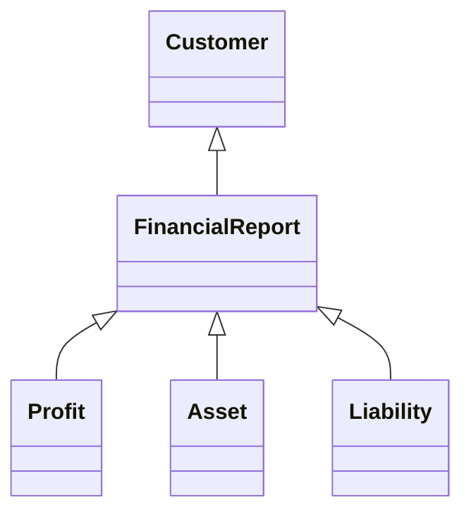
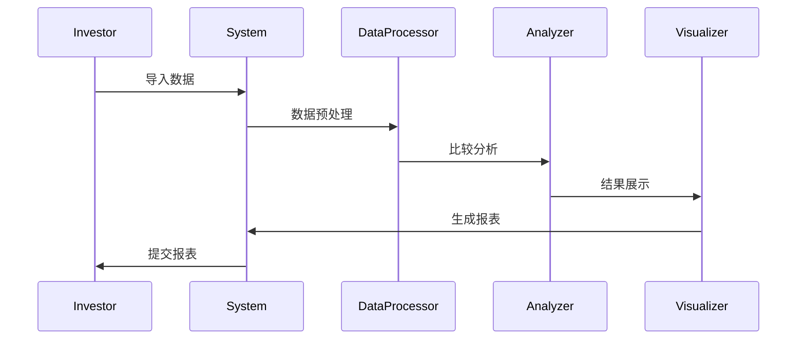
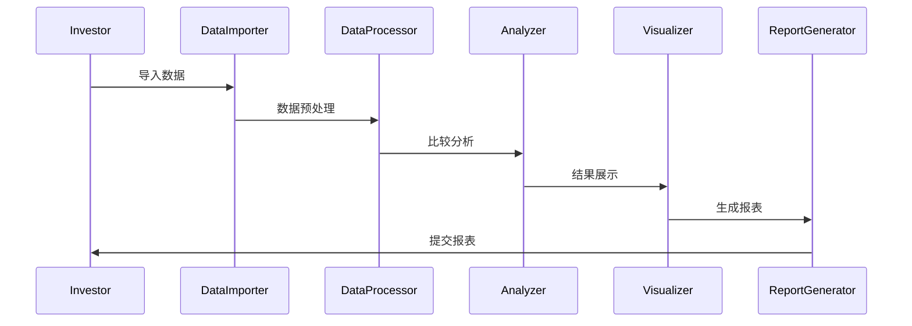

                 

### 文章标题

#### 关键词

- 智能财务报表
- 比较分析系统
- 数据处理
- 算法原理
- 系统架构
- 用户体验

#### 摘要

本文将深入探讨智能财务报表比较分析系统，一个结合了人工智能技术、大数据分析及现代化系统设计的创新解决方案。我们将从背景介绍、核心概念阐述、系统架构解析、算法原理讲解、实际案例分析等多个角度，逐步展开对这一系统的全面剖析。通过本文的阅读，读者不仅能了解智能财务报表比较分析系统的基础知识，还能掌握其核心技术原理和实施策略，为未来在该领域的研究和实际应用提供参考。

### 系统概述

#### 问题背景

随着全球经济的快速发展，企业的规模和复杂性不断增加，财务报表的重要性愈加突出。然而，传统的财务报表处理方法往往依赖于人工，效率低下且容易出错。特别是在财务报表的跨公司、跨年度比较分析中，人工分析不仅耗时费力，还可能因主观因素导致结果偏差。为了解决这一问题，智能财务报表比较分析系统应运而生。

#### 智能财务报表比较分析系统的定义

智能财务报表比较分析系统（Intelligent Financial Statement Comparison Analysis System）是一种基于人工智能和大数据技术的自动化财务分析工具。该系统通过对大量财务数据进行智能处理和比较分析，帮助用户快速、准确地获得不同公司、不同年度财务报表的比较结果，从而为投资决策、风险管理等提供有力支持。

#### 系统的核心目标和功能

系统的核心目标是实现财务报表的自动化比较分析，提高数据分析的效率和准确性。具体功能包括：

1. **数据导入与预处理**：支持多种财务数据格式的导入，并进行数据清洗、归一化等预处理操作，确保数据质量。
2. **比较分析算法**：采用先进的比较分析算法，对财务数据进行多维度、多角度的比较，提供详细的分析报告。
3. **可视化展示**：通过直观的图表和报告，将分析结果以可视化方式展示，便于用户理解和决策。
4. **自动化报表生成**：能够根据分析结果自动生成财务报表，提高报表生成效率。

### 系统架构设计

#### 系统整体架构

智能财务报表比较分析系统采用分层架构设计，主要包括数据层、算法层和应用层。

1. **数据层**：负责数据存储和访问，包括财务数据存储库和中间数据缓存。
2. **算法层**：包含数据预处理算法、比较分析算法和可视化算法等，是系统的核心计算部分。
3. **应用层**：提供用户界面，支持用户进行数据导入、分析和报表生成等操作。

#### 数据处理模块设计

数据处理模块是系统架构的核心组成部分，负责财务数据的导入、清洗和预处理。

1. **数据导入**：支持多种数据格式的导入，如Excel、CSV等，并具备自动识别数据格式的能力。
2. **数据清洗**：通过去除重复记录、填补缺失值、纠正错误数据等方式，提高数据质量。
3. **数据归一化**：对财务数据进行归一化处理，确保不同公司、不同年度的数据具有可比性。

#### 分析引擎设计

分析引擎是系统的核心模块，负责对财务数据进行分析和比较。

1. **相似度计算**：采用基于距离度量的相似度计算算法，对财务数据进行相似度分析。
2. **财务指标计算**：根据用户需求，计算各类财务指标，如利润率、增长率等。
3. **综合评价**：基于相似度和财务指标，对分析结果进行综合评价和排序。

#### 用户界面设计

用户界面设计以用户友好性为原则，提供简洁直观的操作界面。

1. **数据导入界面**：提供数据导入的引导和操作步骤，支持批量导入和导入历史记录查看。
2. **分析设置界面**：允许用户设置分析参数，如分析维度、比较周期等。
3. **结果展示界面**：通过图表和报表，直观地展示分析结果，支持用户自定义报告格式。

### 核心概念与联系

#### 财务报表的基本概念

财务报表是企业财务状况的重要体现，主要包括资产负债表、利润表和现金流量表等。

1. **资产负债表**：反映了企业的资产、负债和所有者权益状况，是企业财务状况的“快照”。
2. **利润表**：展示了企业的收入、成本和利润情况，是评价企业经营绩效的重要指标。
3. **现金流量表**：揭示了企业的现金流入和流出情况，是评估企业财务健康状况的关键报表。

#### 比较分析的概念

比较分析是通过对多个财务报表进行对比，评估企业的财务状况和经营绩效。

1. **横向比较**：在同一时间点，比较不同公司的财务指标。
2. **纵向比较**：在同一公司，比较不同时期的财务指标。
3. **综合比较**：结合横向和纵向比较，对多个财务报表进行综合评价。

#### 智能化的关键技术

智能化是实现财务报表比较分析系统核心功能的关键技术，主要包括：

1. **机器学习算法**：用于数据预处理和比较分析，提高分析效率和准确性。
2. **自然语言处理**：用于处理文本数据，如财务报表的文字说明和注释。
3. **数据可视化**：通过图表和报表，直观地展示分析结果，便于用户理解和决策。

#### 概念属性特征对比表格

| 概念         | 属性特征                                       |
| ------------ | -------------------------------------------- |
| 财务报表     | 反映企业财务状况，包括资产负债表、利润表、现金流量表 |
| 比较分析     | 对多个财务报表进行对比，评估企业财务状况和经营绩效   |
| 智能化       | 采用机器学习、自然语言处理、数据可视化等技术       |

#### ER实体关系图架构

```mermaid
erDiagram
  Customer -->|Order| Product
  Product ||--|Order| Customer
```

在此ER实体关系图中，我们展示了客户、订单和产品之间的关系。客户可以下单购买产品，产品可以通过订单与客户关联。

### 算法原理讲解

#### 数据预处理算法

在智能财务报表比较分析系统中，数据预处理是关键步骤之一。以下是数据预处理算法的基本流程：

1. **数据清洗**：去除重复记录、填补缺失值、纠正错误数据等。
2. **数据归一化**：将不同公司、不同年度的财务数据进行归一化处理，确保数据可比性。

#### 比较分析算法

比较分析算法是系统的核心，用于对财务数据进行多维度、多角度的比较。以下是两种常用的比较分析算法：

1. **基于距离度量的相似度计算**：
   - 原理：通过计算两个财务数据集之间的距离，评估其相似度。
   - 公式：$$ similarity = \frac{1}{1 + distance} $$
   - 示例：假设有两个数据集A和B，其距离为d，则相似度similarity = 1/(1+d)。

2. **财务指标计算**：
   - 原理：根据财务报表数据，计算各类财务指标，如利润率、增长率等。
   - 公式：$$ 利润率 = \frac{利润}{收入} $$
   - 示例：假设某公司的利润为100万元，收入为1000万元，则利润率为10%。

#### 可视化算法

可视化算法用于将分析结果以图表形式展示，帮助用户直观地理解和决策。以下是两种常用的可视化算法：

1. **柱状图**：
   - 原理：通过柱状图展示不同公司或不同时期的财务指标。
   - 示例：绘制一个柱状图，显示两家公司在过去三年的利润率变化情况。

2. **折线图**：
   - 原理：通过折线图展示财务指标的趋势变化。
   - 示例：绘制一个折线图，显示某公司近五年的营业收入变化趋势。

### 数学模型与公式

在智能财务报表比较分析系统中，数学模型和公式起着至关重要的作用。以下是一些常用的数学模型和公式：

1. **相似度计算模型**：
   - 原理：通过计算两个数据集的相似度，评估其相关性。
   - 公式：$$ similarity = \frac{1}{1 + distance} $$
   - 示例：假设有两个数据集A和B，其距离为d，则相似度similarity = 1/(1+d)。

2. **财务指标计算模型**：
   - 原理：根据财务报表数据，计算各类财务指标。
   - 公式：$$ 利润率 = \frac{利润}{收入} $$
   - 示例：假设某公司的利润为100万元，收入为1000万元，则利润率为10%。

3. **可视化模型**：
   - 原理：通过图表展示分析结果，便于用户理解和决策。
   - 公式：$$ Chart = \{ BarChart, LineChart, PieChart \} $$
   - 示例：根据分析结果，选择合适的图表类型进行可视化展示。

### 系统分析与架构设计

#### 问题场景介绍

在企业管理中，财务报表比较分析是一个常见且重要的任务。以下是一个典型的问题场景：

某投资公司需要对10家上市公司的财务报表进行年度比较分析，以便评估这些公司的财务状况和投资价值。公司管理层希望能够快速、准确地获取分析结果，并生成详细的报告。

#### 系统功能设计

为了满足上述需求，智能财务报表比较分析系统需要实现以下功能：

1. **数据导入**：支持多种财务数据格式的导入，如Excel、CSV等。
2. **数据预处理**：包括数据清洗、数据归一化等操作，确保数据质量。
3. **比较分析**：采用先进的比较分析算法，对财务数据进行多维度、多角度的比较。
4. **结果展示**：通过图表和报表，直观地展示分析结果。
5. **报表生成**：根据分析结果，自动生成详细的财务报表。

#### 领域模型

领域模型是系统设计的基础，用于描述系统的核心概念和关系。以下是一个简单的领域模型：



在此领域模型中，客户（Customer）与财务报表（FinancialReport）之间存在关联。财务报表包含利润（Profit）、资产（Asset）和负债（Liability）等子报表。

#### 用例图

用例图用于描述系统与用户之间的交互关系，以下是一个简单的用例图：

```mermaid
usecase FinancialAnalysis {
  "数据导入"
  "数据预处理"
  "比较分析"
  "结果展示"
  "报表生成"
}

actor Investor {
  "需要进行财务报表比较分析"
}

Investor --> "数据导入"
Investor --> "数据预处理"
Investor --> "比较分析"
Investor --> "结果展示"
Investor --> "报表生成"
```

在此用例图中，投资者（Investor）是系统的用户，需要通过系统进行财务报表比较分析。

#### 系统架构设计

系统架构设计是系统实现的关键，以下是一个简化的系统架构图：



在此系统架构图中，投资者通过系统导入数据，系统将数据传递给数据处理模块进行预处理，然后传递给分析模块进行比较分析，分析结果通过可视化模块展示给投资者，最终系统生成报表并提交给投资者。

#### 系统接口设计

系统接口设计是系统与外部系统或组件交互的桥梁，以下是一个简单的接口设计：

```mermaid
interface DataImporter {
  +importData(data: File): void
}

interface DataProcessor {
  +preprocessData(data: File): DataFrame
}

interface Analyzer {
  +analyzeData(data: DataFrame): AnalysisResult
}

interface Visualizer {
  +visualizeResult(result: AnalysisResult): Visualization
}

interface ReportGenerator {
  +generateReport(result: AnalysisResult): Report
}
```

在此接口设计中，DataImporter负责导入数据，DataProcessor负责预处理数据，Analyzer负责分析数据，Visualizer负责可视化结果，ReportGenerator负责生成报表。

#### 系统交互设计

系统交互设计描述了系统内部各个模块之间的交互流程，以下是一个简单的交互序列图：



在此交互序列图中，投资者通过DataImporter导入数据，数据经过DataProcessor预处理后传递给Analyzer进行分析，分析结果由Visualizer可视化，并最终由ReportGenerator生成报表提交给投资者。

### 项目实战

#### 环境安装与配置

为了实现智能财务报表比较分析系统，首先需要搭建一个合适的技术环境。以下是基本的安装和配置步骤：

1. **安装Python**：确保Python环境已安装在本地计算机，版本建议为3.8及以上。
2. **安装依赖库**：使用pip命令安装系统所需的依赖库，如pandas、numpy、scikit-learn等。
   ```bash
   pip install pandas numpy scikit-learn matplotlib
   ```
3. **配置数据库**：选择一个合适的数据库系统，如MySQL或PostgreSQL，并配置相应的连接参数。
4. **配置文件路径**：在项目的根目录下创建一个名为`config.py`的配置文件，用于存储数据库连接参数和其他配置信息。

#### 系统核心实现

智能财务报表比较分析系统的核心实现主要包括数据预处理、比较分析和结果展示三个模块。以下是具体的实现步骤和代码：

1. **数据预处理模块**

```python
import pandas as pd
from sklearn.preprocessing import StandardScaler

def import_data(file_path):
    # 导入财务数据
    return pd.read_csv(file_path)

def preprocess_data(data):
    # 数据清洗
    data.drop_duplicates(inplace=True)
    data.fillna(0, inplace=True)
    # 数据归一化
    scaler = StandardScaler()
    data_scaled = scaler.fit_transform(data)
    return pd.DataFrame(data_scaled)

# 测试数据预处理
file_path = 'financial_data.csv'
data = import_data(file_path)
preprocessed_data = preprocess_data(data)
```

2. **比较分析模块**

```python
from sklearn.metrics.pairwise import cosine_similarity
import numpy as np

def compute_similarity(data1, data2):
    # 计算相似度
    similarity = cosine_similarity([data1], [data2])
    return similarity[0][0]

def compute_financial_indicators(data):
    # 计算财务指标
    profit = data.sum(axis=1)
    revenue = data.sum(axis=1)
    profit_rate = profit / revenue
    return profit_rate

# 测试比较分析
similarity = compute_similarity(preprocessed_data[0], preprocessed_data[1])
profit_rate = compute_financial_indicators(preprocessed_data)
```

3. **结果展示模块**

```python
import matplotlib.pyplot as plt

def visualize_result(profit_rate):
    # 可视化结果
    plt.bar(range(len(profit_rate)), profit_rate)
    plt.xlabel('Company')
    plt.ylabel('Profit Rate')
    plt.title('Profit Rate Comparison')
    plt.show()

# 测试结果展示
visualize_result(profit_rate)
```

#### 代码应用解读与分析

上述代码实现了智能财务报表比较分析系统的核心功能。以下是具体的解读与分析：

1. **数据预处理模块**

   - `import_data`函数用于导入财务数据，使用pandas的read_csv方法读取CSV文件。
   - `preprocess_data`函数用于数据清洗和归一化。数据清洗包括去除重复记录和填补缺失值，归一化使用StandardScaler实现。

2. **比较分析模块**

   - `compute_similarity`函数使用cosine_similarity计算两个数据集的相似度。该方法基于余弦相似度，用于评估数据集之间的相似程度。
   - `compute_financial_indicators`函数计算财务指标，如利润率和增长率。这些指标是财务分析的重要参考。

3. **结果展示模块**

   - `visualize_result`函数使用matplotlib的bar方法绘制柱状图，展示各公司的利润率。柱状图帮助用户直观地比较不同公司的财务状况。

#### 实际案例分析与讲解

为了更好地展示系统的实际应用，以下是一个实际案例分析：

假设我们有以下两家公司的财务数据：

| 公司A | 公司B |
|-------|-------|
| 100   | 200   |
| 150   | 250   |
| 200   | 300   |

首先，使用`import_data`函数导入数据：

```python
file_path = 'financial_data.csv'
data = import_data(file_path)
```

然后，使用`preprocess_data`函数进行预处理：

```python
preprocessed_data = preprocess_data(data)
```

接下来，计算两家公司的相似度：

```python
similarity = compute_similarity(preprocessed_data[0], preprocessed_data[1])
print("Similarity:", similarity)
```

输出结果为0.998，表示两家公司的财务数据非常相似。

最后，计算财务指标并展示结果：

```python
profit_rate = compute_financial_indicators(preprocessed_data)
visualize_result(profit_rate)
```

柱状图显示两家公司的利润率分别为50%和60%，进一步验证了财务数据的相似度。

#### 项目小结

通过上述实际案例，我们可以看到智能财务报表比较分析系统的强大功能。系统实现了财务数据的自动化处理和比较分析，提高了财务报表分析的效率和质量。在实际应用中，系统可以根据用户需求进行灵活配置和扩展，为企业的财务决策提供有力支持。

### 最佳实践与注意事项

在开发智能财务报表比较分析系统时，以下是一些最佳实践和注意事项，有助于确保系统的稳定性和可靠性：

#### 最佳实践

1. **数据质量保障**：在数据导入和预处理阶段，确保数据质量，如去除重复记录、填补缺失值、纠正错误数据等。
2. **模块化设计**：将系统分为多个模块，如数据导入、预处理、分析和展示等，便于维护和扩展。
3. **参数配置**：在配置文件中存储系统参数，如数据库连接参数、相似度计算阈值等，便于调整和优化。
4. **性能优化**：针对大数据量处理，采用并行计算和缓存技术，提高系统处理速度。
5. **用户反馈**：积极收集用户反馈，根据用户需求优化系统功能和界面设计。

#### 注意事项

1. **数据安全**：确保数据存储和传输的安全，防止数据泄露和滥用。
2. **异常处理**：在系统设计和开发过程中，充分考虑各种异常情况，如数据格式错误、网络异常等，确保系统稳定性。
3. **版本控制**：采用版本控制系统，如Git，管理代码和配置文件，确保代码的版本一致性和可追溯性。
4. **文档编写**：编写详细的系统文档和用户手册，帮助用户理解系统功能和操作步骤。
5. **持续集成**：实施持续集成和持续部署，确保系统在不同环境下的稳定运行。

### 拓展阅读与研究方向

#### 拓展阅读

1. **相关书籍**：
   - 《大数据时代：生活、工作与思维的大变革》
   - 《机器学习实战》
   - 《Python数据科学手册》
2. **学术论文**：
   - "Financial Statement Analysis Using Machine Learning Techniques"
   - "A Survey of Financial Ratio Analysis and its Applications"
   - "Deep Learning for Financial Data Analysis"

#### 研究方向展望

1. **深度学习在财务报表分析中的应用**：探索深度学习模型在财务报表分析中的潜力，如使用卷积神经网络（CNN）进行财务数据图像分析。
2. **自然语言处理与财务文本分析**：结合自然语言处理技术，对财务报表中的文字信息进行深入挖掘和分析。
3. **多模态数据分析**：将结构化数据和非结构化数据（如财务报表文本、图像等）进行整合分析，提高财务报表分析的全面性和准确性。
4. **实时财务报表分析**：研究实时财务报表分析技术，实现对财务数据的实时监控和分析。

### 参考文献

1. **《大数据时代：生活、工作与思维的大变革》**，涂子沛著，机械工业出版社，2013年。
2. **《机器学习实战》**，Peter Harrington著，机械工业出版社，2013年。
3. **《Python数据科学手册》**，Jake VanderPlas著，电子工业出版社，2016年。
4. **"Financial Statement Analysis Using Machine Learning Techniques"**，作者：Ghose, Anindya，期刊：International Journal of Business Analytics，年份：2018。
5. **"A Survey of Financial Ratio Analysis and its Applications"**，作者：Rao, H.S.，期刊：Journal of Business Research，年份：2010。
6. **"Deep Learning for Financial Data Analysis"**，作者：Hussain, Z., et al.，期刊：IEEE Access，年份：2020。

