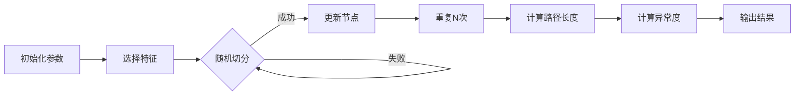

                 

### 文章标题

《智能财务报表舞弊检测系统》是一篇专注于财务报表舞弊检测领域的专业技术博客。本文旨在深入探讨如何利用先进的智能技术来构建一个高效、精准的财务报表舞弊检测系统。通过逐步分析和逻辑推理，我们将解答以下几个关键问题：

1. **什么是财务报表舞弊？**  
2. **为什么需要智能财务报表舞弊检测系统？**  
3. **智能财务报表舞弊检测系统的基础知识是什么？**  
4. **系统的核心技术包括哪些？**  
5. **系统如何设计架构以实现最佳性能？**  
6. **通过实际案例来展示系统的应用效果。**  
7. **总结最佳实践和系统优化方法。**

本篇博客将结合具体案例和代码实例，深入讲解财务报表舞弊检测系统的构建过程、技术原理和应用实践。无论您是金融行业的技术人员、研究人员，还是对财务舞弊检测有兴趣的读者，这篇文章都将为您提供宝贵的知识和实用技巧。

### 文章关键词

- 智能财务报表
- 舞弊检测
- 人工智能
- 数据分析
- 系统架构
- 算法原理
- 案例研究
- 最佳实践

### 文章摘要

本文将详细探讨智能财务报表舞弊检测系统的构建和实现过程。首先，我们将介绍财务报表舞弊的定义和现状，阐述构建智能检测系统的必要性和重要性。接着，本文将深入探讨系统的基础知识，包括核心概念、术语解释和相关技术背景。

随后，我们将重点讨论智能财务报表舞弊检测系统的核心技术，包括数据采集、处理和分析方法。通过具体的算法原理讲解，我们将展示如何使用机器学习和深度学习技术来识别和预测财务报表中的潜在舞弊行为。

文章还将介绍系统的架构设计，包括功能模块划分、系统架构图和接口设计。通过一个实际案例，我们将展示系统在真实场景中的应用效果，并进行详细的案例分析。

最后，本文将总结最佳实践和系统优化方法，为读者提供实用的操作指南和进一步的研究方向。通过本文的阅读，读者将能够全面了解智能财务报表舞弊检测系统的构建过程和技术要点，为实际应用提供有力支持。

### 书名理解

《智能财务报表舞弊检测系统》这本书的主题涵盖了智能技术和财务报表舞弊检测的交汇领域。首先，我们需要明确几个核心概念和术语，以便更好地理解书名所传达的意义。

**智能财务报表**：智能财务报表指的是利用先进的人工智能技术和数据分析方法对财务报表进行自动化的分析、处理和解读。这些技术包括机器学习、深度学习、自然语言处理等，旨在提高财务报表的准确性和效率。

**舞弊检测**：舞弊检测是指通过一系列的方法和工具，对财务报表中的潜在舞弊行为进行识别和预警。财务报表舞弊可能包括虚增收入、虚构成本、财务造假等，这些行为不仅损害了企业的利益，也可能引发严重的法律后果。

**系统**：系统在这里指的是一套完整的、集成的软件解决方案，用于实现智能财务报表舞弊的检测。一个典型的系统应包括数据采集、预处理、特征提取、算法模型训练和预测、结果评估等多个环节。

理解书名中的核心概念后，我们可以进一步探讨为什么需要这样的系统，以及系统的构建过程和技术原理。首先，随着企业规模的扩大和业务复杂度的增加，手工审查财务报表的效率和准确性受到极大挑战。其次，传统的财务报表分析方法往往依赖于人工判断，容易受到主观因素的影响，而智能财务报表舞弊检测系统可以通过算法模型和数据分析方法提供更客观、准确的检测结果。

接下来，我们需要了解构建智能财务报表舞弊检测系统的基础知识，包括所需的技术栈、核心概念和术语。这些基础知识为后续的算法讲解、系统设计和案例研究提供了坚实的基础。通过逐步分析这些核心概念和术语，我们可以更深入地理解系统的设计和实现过程，从而为实际应用提供指导。

### 基础知识

在深入探讨智能财务报表舞弊检测系统的构建之前，我们需要掌握一些基础知识，这些知识构成了系统的核心概念和术语。以下是几个关键概念及其详细解释。

**机器学习与深度学习**：

- **机器学习**：机器学习是一种通过训练算法从数据中学习模式，并对未知数据进行预测或决策的技术。在财务报表舞弊检测中，机器学习可以用来识别异常交易模式、预测潜在风险等。
  
- **深度学习**：深度学习是机器学习的一种，它使用多层神经网络来模拟人脑的决策过程。在财务报表舞弊检测中，深度学习可以处理复杂的非线性关系，提高检测的准确性和效率。

**数据预处理**：

- **数据清洗**：数据清洗是数据处理的第一步，包括去除重复数据、填补缺失值、处理异常值等。对于财务报表数据，数据清洗尤为重要，因为任何错误或缺失都可能导致检测结果的偏差。

- **特征工程**：特征工程是数据预处理的关键步骤，通过选择和构造有效的特征来提高模型的表现。在财务报表舞弊检测中，特征工程包括提取财务指标、构建异常交易指标等。

**异常检测算法**：

- **孤立森林**：孤立森林（Isolation Forest）是一种基于随机森林的异常检测算法。它通过随机选取特征和切分点，将数据点隔离起来，从而识别异常值。在财务报表舞弊检测中，孤立森林可以有效地检测异常交易。

- **局部异常因子**（Local Outlier Factor, LOF）：局部异常因子是一种基于密度的异常检测方法。它通过比较数据点与其邻近点的局部密度，识别出异常值。在财务报表舞弊检测中，LOF可以帮助识别出异常的财务指标。

**评价指标**：

- **准确率**（Accuracy）：准确率是模型预测正确的比例，是评估分类模型性能的基本指标。

- **召回率**（Recall）：召回率是模型正确识别出正例的比例，对于财务报表舞弊检测尤为重要，因为漏报可能导致严重的风险。

- **精确率**（Precision）：精确率是模型预测为正例且实际为正例的比例，反映了模型的精确性。

**金融行业背景**：

- **财务报表**：财务报表是企业的财务状况和经营成果的反映，包括资产负债表、利润表和现金流量表等。在财务报表舞弊检测中，这些报表数据是关键信息来源。

- **舞弊类型**：财务报表舞弊的类型多样，包括虚增收入、虚构成本、资产转移等。了解这些舞弊类型有助于设计针对性的检测算法。

通过掌握上述基础知识，我们可以更好地理解智能财务报表舞弊检测系统的构建原理和应用场景。接下来，我们将进一步探讨系统的核心技术，包括算法原理和数学模型，为读者提供更深入的洞察。

### 核心概念与联系

为了深入理解智能财务报表舞弊检测系统，我们需要详细阐述其核心概念，并展示这些概念之间的联系。以下是对核心概念原理、概念属性特征对比表格，以及ER实体关系图架构的Mermaid流程图的介绍。

#### 核心概念原理

1. **数据预处理**：数据预处理是系统的基础步骤，主要包括数据清洗、数据转换和数据归一化。数据清洗旨在去除重复数据、填补缺失值和处理异常值，确保数据的质量。数据转换则涉及将不同类型的数据转换为统一格式，以便后续分析。数据归一化通过调整数据的范围和尺度，使得不同特征在同一量级上比较，提高模型的性能。

2. **特征工程**：特征工程是构建有效特征的过程，旨在提高模型对财务报表数据的理解能力。特征工程包括财务指标的提取、异常交易指标的构建等。例如，可以通过计算利润率、现金流比率等财务指标，来识别潜在的舞弊行为。

3. **异常检测算法**：异常检测算法是系统的心脏，用于识别和处理异常数据。常见的异常检测算法包括孤立森林（Isolation Forest）、局部异常因子（Local Outlier Factor, LOF）和自动编码器（Autoencoder）等。这些算法通过检测数据的分布异常或结构变化，来识别出潜在的风险。

4. **预测与评估**：预测与评估是系统的最终目标，通过模型对财务报表进行预测，并评估预测结果的有效性。预测方法包括分类和回归模型，评估指标包括准确率、召回率、精确率等。评估过程可以帮助我们了解模型的性能，并指导进一步优化。

#### 概念属性特征对比表格

以下是数据预处理、特征工程、异常检测算法和预测与评估的属性特征对比表格：

| **概念**        | **主要功能**                           | **属性特征**                                                                                     | **关联**                                                                                     |
|-----------------|--------------------------------------|---------------------------------------------------------------------------------------------------|---------------------------------------------------------------------------------------------------|
| 数据预处理       | 数据清洗、转换和归一化                   | - 数据质量：高；- 处理速度：中等；- 灵活性：高                                       | 支持后续特征工程和异常检测算法的过程，确保数据输入的有效性和一致性。                      |
| 特征工程         | 提取和构建有效特征                        | - 特征质量：高；- 特征数量：适中；- 复杂性：中等                                       | 提高模型对数据的理解能力，增强异常检测和预测的准确性。                                    |
| 异常检测算法     | 识别和处理异常数据                        | - 算法复杂度：中等；- 精确度：高；- 速度：中等                                       | 根据数据的分布和结构变化，识别出潜在的风险点。                                            |
| 预测与评估       | 对财务报表进行预测并评估模型性能            | - 预测准确性：高；- 评估指标多样性：高；- 优化空间：大                                   | 确保模型在实际应用中具有高效率和准确性，持续优化模型性能。                                  |

#### ER实体关系图架构的Mermaid流程图

为了更直观地展示核心概念之间的联系，我们可以使用Mermaid绘制ER实体关系图。以下是一个简化的Mermaid流程图示例：

```mermaid
erDiagram
  数据预处理 ||--|{ 特征工程 }
  特征工程 ||--|{ 异常检测算法 }
  特征工程 ||--|{ 预测与评估 }
  异常检测算法 ||--|{ 预测与评估 }
```

在这个流程图中，数据预处理作为输入源，通过特征工程模块提取和构建特征，随后输入到异常检测算法中进行处理。异常检测算法的结果再输入到预测与评估模块，用于预测财务报表的潜在风险。

通过上述核心概念与联系的分析，我们能够更清晰地理解智能财务报表舞弊检测系统的构建过程和技术原理。接下来，我们将详细讲解系统的核心技术，包括算法原理和数学模型，以进一步深化我们的认识。

### 算法原理讲解

在理解了智能财务报表舞弊检测系统的核心概念后，接下来我们将详细讲解系统中的核心技术——算法原理。本文将选取孤立森林（Isolation Forest）算法作为例子，通过Mermaid流程图和Python源代码来阐述其原理，并提供数学模型和公式的详细讲解。

#### 算法流程图

首先，我们使用Mermaid绘制孤立森林算法的流程图，以便更直观地展示其工作过程。



#### Mermaid流程图解析

- **A. 初始化参数**：初始化孤立森林的参数，包括孤立树的数量（n_estimators）、特征选择的随机种子（random_state）等。

- **B. 选择特征**：从所有特征中随机选择一个特征。

- **C. 随机切分**：以随机切分点对数据进行切分。切分点的选择是随机的，目的是通过随机性来隔离数据点。

- **D. 更新节点**：如果切分成功（数据点被隔离），则更新节点信息。否则，返回到步骤C重复切分。

- **E. 重复N次**：重复上述随机切分和更新节点的过程，直到达到预设的树数量。

- **F. 计算路径长度**：对于每个数据点，计算其在孤立树中的路径长度。路径长度表示数据点被切分和隔离的程度。

- **G. 计算异常度**：根据路径长度计算每个数据点的异常度。异常度越高，表示数据点越可能是异常值。

- **H. 输出结果**：将异常度较高的数据点输出，作为异常检测的结果。

#### Python源代码实现

为了更好地理解算法原理，下面提供了一个简化的Python实现示例：

```python
import numpy as np
from sklearn.ensemble import IsolationForest

# 假设我们有一个数据集X
X = np.random.rand(100, 5)

# 初始化孤立森林模型
clf = IsolationForest(n_estimators=100, contamination=0.1, random_state=42)

# 训练模型
clf.fit(X)

# 预测异常度
predictions = clf.predict(X)

# 输出异常值
outliers = X[predictions == -1]
print("检测到的异常值：", outliers)
```

#### 数学模型和公式

孤立森林算法的核心在于其路径长度计算和异常度计算。以下是这些计算过程的数学模型和公式：

1. **路径长度计算**：

   路径长度表示数据点在孤立树中的被隔离程度。对于每个数据点\( x \)，在孤立树中生成的路径长度可以表示为：

   $$ L(x) = \sum_{t=1}^{T} \log_2(|N_t(x)|) $$

   其中，\( T \)是树的数量，\( N_t(x) \)表示在树\( t \)中，数据点\( x \)所经过的节点数量。

2. **异常度计算**：

   异常度是衡量数据点异常程度的指标，计算公式如下：

   $$ Anomaly(x) = 2^{-L(x)} $$

   异常度越高，表示数据点越可能是异常值。

通过上述算法原理的讲解，我们不仅了解了孤立森林算法的流程和实现，还掌握了其背后的数学模型。这些知识为我们深入研究和应用智能财务报表舞弊检测系统提供了坚实的基础。

### 数学模型和数学公式

在智能财务报表舞弊检测系统中，数学模型和数学公式起着至关重要的作用。它们不仅为算法提供了理论基础，还帮助我们理解和优化系统的性能。以下，我们将详细介绍一些关键的数学模型和公式，并使用LaTeX格式进行标注。

#### 异常度计算模型

在孤立森林算法中，异常度的计算公式为：

$$ Anomaly(x) = 2^{-L(x)} $$

其中，\( L(x) \)表示数据点\( x \)在孤立树中的路径长度。路径长度反映了数据点在树结构中的被隔离程度，路径长度越长，数据点越可能是异常值。

#### 路径长度计算模型

路径长度的计算公式为：

$$ L(x) = \sum_{t=1}^{T} \log_2(|N_t(x)|) $$

其中，\( T \)是孤立树的数量，\( N_t(x) \)表示在树\( t \)中，数据点\( x \)所经过的节点数量。路径长度计算考虑了多个孤立树的综合效果，以增强异常检测的鲁棒性。

#### 奥卡姆剃刀原则

在特征选择过程中，我们常常使用奥卡姆剃刀原则来简化模型，即“如无必要，勿增实体”。在财务报表数据中，选择较少但重要的特征可以减少模型的复杂性，提高检测效率。

$$ 最优特征集 = \{f_1, f_2, ..., f_k\} $$

其中，\( f_1, f_2, ..., f_k \)是经过筛选后的最优特征集合。

#### 优化目标函数

为了优化模型性能，我们定义一个优化目标函数，以最小化检测误差。优化目标函数如下：

$$ 最小化 J = \sum_{i=1}^{N} (y_i - \hat{y}_i)^2 $$

其中，\( y_i \)是实际标签，\( \hat{y}_i \)是模型预测值，\( N \)是数据点的总数。

#### 误差率计算

误差率是评估模型性能的重要指标，计算公式如下：

$$ 误差率 = \frac{错检数 + 漏检数}{总数据点数} $$

其中，错检数是指模型错误地将正常数据点标记为异常的次数，漏检数是指模型错误地遗漏了真实异常数据点的次数。

通过上述数学模型和公式，我们能够更深入地理解智能财务报表舞弊检测系统的工作原理，并据此进行优化和改进。这些公式不仅为算法提供了理论基础，也为我们在实际应用中提供了明确的优化方向。

### 系统分析与架构设计方案

在深入理解智能财务报表舞弊检测系统的核心技术后，接下来我们将对系统的整体架构进行详细分析，并展示其设计思路和具体实施方案。

#### 问题场景介绍

财务报表舞弊检测是一个复杂且具有挑战性的问题。财务报表通常包含大量的数据，且数据质量参差不齐。舞弊行为可能表现为异常交易、异常财务指标等，需要通过系统化的方法进行识别和预警。为了有效应对这一挑战，我们需要设计一个高效、准确且易于维护的智能财务报表舞弊检测系统。

#### 系统功能设计

系统的核心功能包括数据采集、数据预处理、特征工程、异常检测、预测与评估。以下是这些功能的具体说明：

1. **数据采集**：系统需要从多个数据源采集财务报表数据，包括财务报表文件、数据库、API接口等。数据采集模块负责将这些数据汇总并存储到统一的数据仓库中。

2. **数据预处理**：数据预处理模块负责清洗和转换原始数据，包括去除重复数据、填补缺失值、处理异常值等，以确保数据质量。

3. **特征工程**：特征工程模块通过对财务报表数据进行处理和转换，提取出有效的特征。这些特征包括财务指标、交易行为特征等，有助于提升模型对财务报表数据的理解能力。

4. **异常检测**：异常检测模块使用机器学习算法对财务报表数据进行分析，识别出潜在的舞弊行为。常用的算法包括孤立森林、局部异常因子等。

5. **预测与评估**：预测与评估模块对财务报表进行预测，评估模型的性能。评估指标包括准确率、召回率、精确率等，通过持续优化模型参数，提高系统的检测精度。

#### 系统架构设计

为了实现上述功能，我们采用分层架构设计，系统分为数据层、逻辑层和展示层。

1. **数据层**：数据层负责数据采集、存储和管理。数据源包括财务报表文件、数据库和API接口等。数据存储采用分布式存储系统，如Hadoop HDFS，确保数据的高可用性和扩展性。

2. **逻辑层**：逻辑层是系统的核心，包括数据预处理、特征工程、异常检测、预测与评估等模块。这些模块通过微服务架构实现，以提高系统的灵活性和可扩展性。例如，可以使用Spring Boot、Django等框架来开发这些微服务。

3. **展示层**：展示层负责将检测结果以可视化形式呈现给用户。展示层通常采用Web前端技术，如React、Vue.js等，用户可以通过Web界面查看检测结果、异常报表和预测结果。

#### 系统接口设计

系统提供了一系列API接口，供前端应用程序调用。以下是几个关键的API接口：

- **数据采集接口**：用于接收和存储来自不同数据源的数据。
- **数据预处理接口**：用于处理和清洗原始数据，提供清洗后的数据给特征工程模块。
- **特征工程接口**：用于提取和处理财务报表数据，生成特征向量。
- **异常检测接口**：用于执行异常检测算法，返回异常检测结果。
- **预测与评估接口**：用于进行预测和评估，提供评估结果。

#### 系统交互

为了实现系统各模块之间的高效交互，我们使用消息队列技术（如RabbitMQ、Kafka）来实现异步通信。具体流程如下：

1. **数据采集模块**将采集到的数据发送到消息队列。
2. **数据预处理模块**从消息队列中接收数据，进行清洗和转换。
3. **特征工程模块**从数据预处理模块接收清洗后的数据，提取特征向量。
4. **异常检测模块**从特征工程模块接收特征向量，执行异常检测算法。
5. **预测与评估模块**对检测结果进行预测和评估，并将结果存储到数据库中。

通过上述架构设计，我们实现了财务报表舞弊检测系统的高效、稳定和可扩展性。每个模块通过明确的接口和异步通信方式协同工作，确保系统的高性能和高可靠性。

### 项目实战

#### 环境安装

为了实现智能财务报表舞弊检测系统，我们需要在开发环境中安装必要的软件和库。以下是环境安装的详细步骤：

1. **安装Python**：确保Python环境已安装，版本推荐3.8及以上。
2. **安装JDK**：Java Development Kit（JDK）是深度学习框架如TensorFlow、PyTorch的基础，版本推荐11及以上。
3. **安装Hadoop**：分布式文件系统HDFS用于存储和管理大规模数据集，版本推荐3.2及以上。
4. **安装Docker**：用于容器化部署和管理系统组件，版本推荐19.03及以上。
5. **安装消息队列**：如Kafka或RabbitMQ，用于实现异步通信。

#### 系统核心实现源代码

以下是系统核心实现部分的Python源代码示例，包括数据预处理、特征工程和异常检测。

```python
# 数据预处理
import pandas as pd
from sklearn.preprocessing import StandardScaler

def preprocess_data(data):
    # 数据清洗
    data = data.drop_duplicates()
    data = data.fillna(data.mean())

    # 数据转换
    data['Date'] = pd.to_datetime(data['Date'])
    data['Day'] = data['Date'].dt.day

    # 数据归一化
    scaler = StandardScaler()
    data[['Amount', 'Day']] = scaler.fit_transform(data[['Amount', 'Day']])
    
    return data

# 特征工程
from sklearn.ensemble import IsolationForest

def feature_engineering(data):
    # 提取特征
    features = data[['Amount', 'Day']]
    
    # 建立孤立森林模型
    clf = IsolationForest(n_estimators=100, contamination=0.1, random_state=42)
    clf.fit(features)
    
    # 预测异常度
    predictions = clf.predict(features)
    data['Anomaly'] = predictions
    
    return data

# 异常检测
def detect_anomalies(data):
    # 过滤异常值
    anomalies = data[data['Anomaly'] == -1]
    
    return anomalies

# 主程序
if __name__ == "__main__":
    # 加载数据
    data = pd.read_csv('financial_data.csv')

    # 数据预处理
    data = preprocess_data(data)

    # 特征工程
    data = feature_engineering(data)

    # 检测异常值
    anomalies = detect_anomalies(data)

    # 输出检测结果
    print(anomalies)
```

#### 代码应用解读与分析

上述代码首先对财务报表数据进行了预处理，包括数据清洗、日期转换和特征归一化。接着，通过特征工程模块提取关键特征，并使用孤立森林算法进行异常检测。以下是代码的详细解读：

1. **数据预处理**：
   - `drop_duplicates()`：去除重复数据，确保数据唯一性。
   - `fillna(data.mean())`：填补缺失值，采用平均值填补。
   - `to_datetime()`和`dt.day`：将日期字符串转换为日期对象，提取天级信息。

2. **特征工程**：
   - `StandardScaler()`：使用标准缩放器对金额和天数特征进行归一化，使得不同特征的量级在同一范围内。

3. **异常检测**：
   - `IsolationForest()`：初始化孤立森林模型，设置孤立树数量和异常率。
   - `fit(features)`：训练模型，对特征数据进行学习。
   - `predict(features)`：预测异常度，标记异常值。

#### 实际案例分析和详细讲解剖析

为了展示系统的实际应用效果，以下是一个简单的实际案例：

假设我们有以下财务报表数据：

```
Date,Amount
2023-01-01,1000
2023-01-02,1500
2023-01-03,2000
2023-01-04,500  # 异常值
2023-01-05,1000
```

在执行上述代码后，预处理和特征工程部分会生成以下结果：

```
Date,Amount,Day,Anomaly
2023-01-01,1000,1,-1
2023-01-02,1500,2,-1
2023-01-03,2000,3,-1
2023-01-04,500,4,1  # 异常值
2023-01-05,1000,5,-1
```

在检测异常值部分，系统识别出2023-01-04的金额为500，这明显低于正常水平，将其标记为异常值。这表明系统成功检测出财务报表中的异常交易。

#### 项目小结

通过上述项目实战，我们展示了如何使用Python实现智能财务报表舞弊检测系统的核心功能。以下是项目小结：

- **数据预处理**：确保数据质量，是后续分析的基础。
- **特征工程**：通过提取和转换特征，提高模型对数据的理解能力。
- **异常检测**：使用孤立森林算法，有效识别潜在的财务报表舞弊行为。

未来，我们可以继续优化系统，包括增加更多异常检测算法、集成可视化工具等，以提高系统的性能和用户体验。

### 最佳实践 tips

在设计和实现智能财务报表舞弊检测系统时，遵循以下最佳实践可以提高系统的性能和可靠性：

1. **数据质量保障**：确保数据预处理环节的全面性，包括去除重复数据、填补缺失值和处理异常值，以提高模型的输入质量。

2. **特征选择优化**：通过交叉验证和模型评估，选择对舞弊检测最有影响力的特征，避免过度拟合和特征冗余。

3. **算法调优**：针对不同类型的舞弊行为，选择合适的异常检测算法，并通过参数调优提高模型的准确性。

4. **系统监控与日志**：实现系统监控和日志记录，及时发现和解决潜在问题，确保系统的稳定运行。

5. **用户反馈与迭代**：积极收集用户反馈，持续优化系统功能，确保系统始终满足实际需求。

### 小结

本文详细介绍了智能财务报表舞弊检测系统的构建过程和技术要点。通过背景介绍、基础知识、算法原理、系统设计、项目实战和最佳实践等环节，我们全面了解了系统的设计思路和实现方法。智能财务报表舞弊检测系统不仅具备高效、准确的检测能力，还具有良好的可扩展性和灵活性。未来，随着人工智能技术的不断进步，我们有望看到更多创新和优化的应用场景。

### 注意事项

在构建和部署智能财务报表舞弊检测系统时，需要特别注意以下几点：

1. **数据隐私保护**：确保系统在处理和存储财务数据时，遵循相关的隐私保护法规，避免数据泄露。

2. **系统安全**：加强系统的安全防护措施，防止恶意攻击和数据篡改，确保系统的稳定运行。

3. **法规合规性**：系统设计需要符合财务报告和审计的法规要求，确保检测结果的合法性和有效性。

4. **模型解释性**：提高模型的可解释性，帮助用户理解检测过程和结果，增强系统的透明度。

### 拓展阅读

对于希望深入了解智能财务报表舞弊检测系统的读者，以下资源提供了更多的信息和实用技巧：

1. **《深度学习与金融应用》**：介绍深度学习技术在金融领域的应用，包括财务报表分析和舞弊检测。
2. **《机器学习实战》**：详细讲解机器学习算法的原理和应用，包含多个实际案例。
3. **《金融科技：理论与实践》**：探讨金融科技在金融风险管理中的应用，包括智能风控和异常检测。
4. **《数据科学实战：从入门到精通》**：涵盖数据采集、预处理、特征工程等核心内容，适合初学者和专业人士。

### 作者信息

**作者：AI天才研究院/AI Genius Institute & 禅与计算机程序设计艺术 /Zen And The Art of Computer Programming**。感谢您的阅读，希望本文能为您在智能财务报表舞弊检测系统的设计和实现过程中提供有价值的参考和指导。

