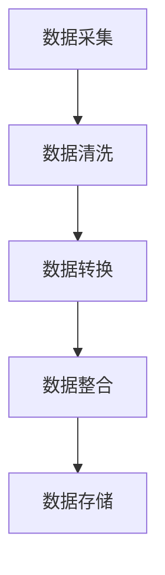
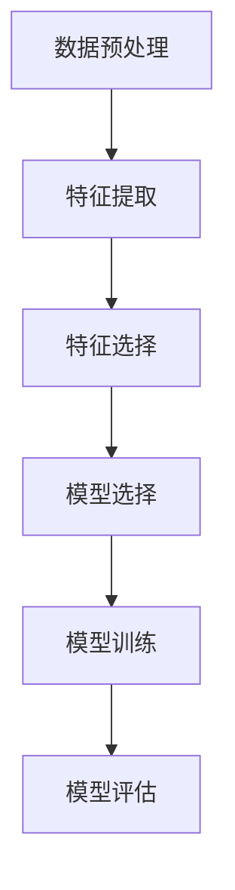

                 

### 摘要

财务舞弊一直是企业财务管理和监管中的重大挑战，它不仅损害了企业的利益，还可能引发更广泛的经济问题。随着大数据和人工智能技术的发展，智能财务舞弊模式识别系统应运而生，通过运用先进的数据挖掘、机器学习和深度学习技术，实现了对财务舞弊模式的自动识别和预警。本文旨在深入探讨智能财务舞弊模式识别系统的概念、核心原理、系统架构以及实际应用，以期为企业提供一个有效防范财务舞弊的技术手段。文章将从财务舞弊的现状与挑战、智能财务舞弊模式识别的基础理论、系统架构设计、关键模块实现以及案例分析和未来展望等多个方面进行详细阐述。

### 目录大纲

```markdown
# 《智能财务舞弊模式识别系统》目录大纲

----------------------------------------------------------------

## 第一部分：引言与背景

### 第1章：财务舞弊问题的现状与挑战
#### 1.1 财务舞弊的定义与特征
#### 1.2 财务舞弊的危害与影响
#### 1.3 智能财务舞弊模式识别的必要性
#### 1.4 本书结构安排与目标

## 第二部分：核心概念与基础理论

### 第2章：智能财务舞弊识别的基础知识
#### 2.1 财务舞弊的模式分类
#### 2.2 数据挖掘与机器学习基础
#### 2.3 深度学习在财务舞弊识别中的应用
#### 2.4 人工智能在财务管理中的发展

### 第3章：智能财务舞弊模式识别的核心技术
#### 3.1 数据预处理方法
#### 3.2 特征选择与提取
#### 3.3 常见算法原理分析
#### 3.4 模型评估与优化

## 第三部分：系统架构与实现

### 第4章：智能财务舞弊模式识别系统设计
#### 4.1 系统需求分析
#### 4.2 系统功能设计
#### 4.3 系统架构设计
#### 4.4 系统接口与交互设计

### 第5章：关键模块实现与细节分析
#### 5.1 数据采集与处理
#### 5.2 特征提取与模型训练
#### 5.3 模型部署与预测
#### 5.4 系统性能优化

## 第四部分：案例分析与实战应用

### 第6章：案例研究与实战项目
#### 6.1 案例选择与背景介绍
#### 6.2 项目目标与挑战
#### 6.3 实施过程与步骤
#### 6.4 结果分析与总结

### 第7章：智能财务舞弊模式识别系统的未来展望
#### 7.1 当前技术的发展趋势
#### 7.2 潜在应用领域与市场前景
#### 7.3 面临的挑战与解决策略
#### 7.4 未来发展方向与趋势

## 第五部分：总结与拓展

### 第8章：全书总结与未来工作展望
#### 8.1 主要研究成果与贡献
#### 8.2 存在的问题与不足
#### 8.3 未来研究方向与工作规划
#### 8.4 拓展阅读与资源推荐

----------------------------------------------------------------
```

本文结构清晰，通过以上七个部分，从问题背景、理论分析、系统设计、实战案例以及未来展望等多个角度全面探讨了智能财务舞弊模式识别系统。确保读者能够全面、系统地了解该领域的最新进展和应用前景。

### 第一部分：引言与背景

#### 1.1 财务舞弊的定义与特征

财务舞弊是指在财务管理过程中，企业内部或外部人员通过伪造、篡改、隐瞒财务信息等手段，以达到非法获取利益或逃避监管的目的。财务舞弊可以表现为多种形式，如财务造假、侵占资产、虚增收入、低估债务等。常见的财务舞弊特征包括：

1. **财务数据异常**：如收入和利润的突然波动，现金流的不匹配，应收账款和存货的异常变化等。
2. **财务报表异常**：如财务报表数据前后不一致，关键财务指标异常，财务报表附注披露不充分等。
3. **交易模式异常**：如与关联方进行不合理的交易，频繁的关联交易，交易价格异常等。
4. **内部控制薄弱**：如缺乏有效的内部审计和内部控制机制，关键流程缺乏监管等。

#### 1.2 财务舞弊的危害与影响

财务舞弊对企业、投资者和整个经济环境都会造成严重的危害：

1. **企业层面**：
   - **损害企业形象**：财务舞弊会严重损害企业的信誉，影响客户和供应商的信任。
   - **财务损失**：由于舞弊行为，企业可能面临直接的经济损失，如资金侵占、信用损失等。
   - **法律风险**：企业可能因违反法律法规而面临巨额罚款、诉讼甚至刑事责任。

2. **投资者层面**：
   - **投资损失**：投资者因财务舞弊而无法获取真实的财务信息，导致投资决策失误，造成资产损失。
   - **信心受挫**：投资者对市场产生不信任，影响资本市场的稳定和发展。

3. **经济环境层面**：
   - **金融风险**：财务舞弊可能导致金融市场的动荡，影响资本市场的正常运行。
   - **经济发展**：财务舞弊行为削弱了市场经济的健康发展，损害了经济的长期稳定。

#### 1.3 智能财务舞弊模式识别的必要性

面对日益复杂的财务舞弊现象，传统的财务审计和监管手段已难以满足需求。智能财务舞弊模式识别系统应运而生，其必要性主要体现在以下几个方面：

1. **技术进步**：
   - **大数据**：大数据技术能够处理和分析海量数据，为识别财务舞弊提供了数据基础。
   - **机器学习与深度学习**：这些人工智能技术能够从大量数据中自动发现规律和模式，提高识别准确率。

2. **高效率**：
   - **自动化处理**：智能系统能够自动处理大量数据，减少人工审核的工作量，提高工作效率。
   - **实时监控**：系统能够实时监控财务数据，及时发现异常情况，提供及时的预警。

3. **精准性**：
   - **模型训练**：通过机器学习模型，系统能够不断优化识别算法，提高识别的精准度。
   - **多维度分析**：系统能够从多个维度分析财务数据，提供更全面的识别结果。

4. **合规性**：
   - **法规要求**：随着监管法规的不断完善，企业需要更有效地防范财务舞弊，合规运营。
   - **风险控制**：智能系统能够帮助企业降低财务舞弊风险，提升内部控制水平。

#### 1.4 本书结构安排与目标

本书旨在系统地介绍智能财务舞弊模式识别系统的相关理论、技术、实现方法和应用案例。具体结构安排如下：

1. **第一部分：引言与背景**：
   - 深入分析财务舞弊的定义、特征、危害与影响。
   - 阐述智能财务舞弊模式识别的必要性和优势。

2. **第二部分：核心概念与基础理论**：
   - 详细介绍财务舞弊的模式分类、数据挖掘与机器学习基础、深度学习在财务舞弊识别中的应用。
   - 分析人工智能在财务管理中的发展。

3. **第三部分：系统架构与实现**：
   - 描述智能财务舞弊模式识别系统的设计理念、架构设计和接口交互。
   - 阐述数据采集与处理、特征提取与模型训练、模型部署与预测等关键模块的实现细节。

4. **第四部分：案例分析与实战应用**：
   - 通过实际案例，展示智能财务舞弊模式识别系统的应用效果和实施过程。
   - 分析系统在实际应用中的优势和改进方向。

5. **第五部分：总结与拓展**：
   - 总结本书的主要研究成果和贡献。
   - 展望智能财务舞弊模式识别系统的未来发展方向和趋势。

通过以上结构安排，本书希望为读者提供一个全面、系统的智能财务舞弊模式识别解决方案，帮助企业更好地防范财务舞弊风险。

### 第二部分：核心概念与基础理论

#### 2.1 财务舞弊的模式分类

财务舞弊模式多种多样，理解这些模式有助于构建有效的识别系统。常见的财务舞弊模式包括以下几类：

1. **收入舞弊**：
   - **虚构收入**：通过伪造销售订单、合同等手段虚增收入。
   - **提前确认收入**：将尚未实现的收入提前确认，以提高当期利润。
   - **应收账款虚增**：通过虚增应收账款，虚增销售收入。

2. **费用舞弊**：
   - **虚假报销**：员工通过伪造发票、虚增费用报销，侵占公司资金。
   - **费用低估**：将应计费用低估，减少当期费用，从而虚增利润。

3. **资产舞弊**：
   - **资产侵占**：员工通过非法手段侵占公司资产，如盗窃、私卖等。
   - **虚增资产**：通过虚增固定资产、存货等，虚增公司资产。

4. **利润舞弊**：
   - **利润操纵**：通过调节收入和费用，以达到操纵利润的目的。
   - **关联方交易**：与关联方进行不公平的交易，以达到利润操纵的目的。

5. **财务报表舞弊**：
   - **财务报表造假**：通过篡改财务报表数据，虚增或虚减资产、收入、费用等。
   - **信息披露不充分**：故意隐瞒重要财务信息，误导投资者。

#### 2.2 数据挖掘与机器学习基础

数据挖掘是智能财务舞弊模式识别的核心技术之一，它是指从大量数据中提取有价值的信息和知识。数据挖掘的主要任务包括：

1. **分类**：根据数据的特点和属性，将数据划分为不同的类别。
2. **聚类**：将相似的数据聚集在一起，形成不同的簇。
3. **关联规则挖掘**：发现数据之间的关联关系，如购买某种商品的用户还可能购买其他商品。
4. **异常检测**：检测数据中的异常或离群点，如异常的交易行为。

机器学习是数据挖掘的重要技术手段，它通过学习数据中的规律，自动构建模型，以实现预测和分类。机器学习的主要任务包括：

1. **监督学习**：通过已标记的数据训练模型，然后使用模型对新的数据进行预测。
2. **无监督学习**：在没有标记数据的情况下，通过模型发现数据中的结构和规律。
3. **半监督学习**：结合标记数据和未标记数据，以优化模型性能。

#### 2.3 深度学习在财务舞弊识别中的应用

深度学习是机器学习的一种重要分支，它通过多层神经网络模型，自动学习和提取数据中的复杂特征。深度学习在财务舞弊识别中的应用主要包括以下几个方面：

1. **神经网络模型**：如卷积神经网络（CNN）、循环神经网络（RNN）等，用于处理和提取复杂的数据特征。
2. **特征提取**：通过深度学习模型，可以从原始数据中自动提取出具有区分度的特征，提高识别准确率。
3. **模式识别**：利用深度学习模型，可以对财务数据进行模式识别，发现潜在的风险和异常行为。
4. **实时监控**：深度学习模型可以实时监控财务数据，及时识别异常情况，提供预警。

#### 2.4 人工智能在财务管理中的发展

随着人工智能技术的快速发展，其在财务管理中的应用越来越广泛。以下是一些关键的发展趋势：

1. **自动化审计**：利用机器学习和自然语言处理技术，自动分析和审核财务数据，提高审计效率和准确性。
2. **智能报表生成**：通过自然语言处理和计算机视觉技术，自动生成财务报表，减少人工工作量。
3. **风险预测**：利用大数据和机器学习技术，预测企业可能面临的财务风险，提供风险管理和决策支持。
4. **智能投资**：通过分析大量市场数据和财务指标，智能推荐投资策略，优化投资组合。
5. **区块链技术**：结合区块链技术，实现财务数据的透明和不可篡改，提高财务管理的可信度和安全性。

#### 概念属性特征对比表格

| 概念名称 | 特征1 | 特征2 | 特征3 | 特征4 |
| -------- | ----- | ----- | ----- | ----- |
| 财务舞弊 | 数据伪造 | 利润操纵 | 关联方交易 | 信息披露不充分 |
| 数据挖掘 | 分类 | 聚类 | 关联规则挖掘 | 异常检测 |
| 机器学习 | 监督学习 | 无监督学习 | 半监督学习 | 模型预测 |
| 深度学习 | 神经网络 | 自动特征提取 | 模式识别 | 实时监控 |
| 人工智能 | 自动化审计 | 智能报表生成 | 风险预测 | 智能投资 |

#### ER实体关系图架构

```mermaid
erDiagram
    class Enterprise {
        +int id
        +string name
        +float revenue
        +float profit
        +date date
    }
    class Employee {
        +int id
        +string name
        +string position
        +float salary
        +date hire_date
    }
    class Transaction {
        +int id
        +string type
        +float amount
        +date transaction_date
        +foreign key enterprise_id refers to Enterprise(id)
        +foreign key employee_id refers to Employee(id)
    }
    Enterprise ||--|{ Transaction }|>
    Employee ||--|{ Transaction }|>

    class Account {
        +int id
        +string name
        +float balance
        +date last_updated
    }
    class FinancialStatement {
        +int id
        +string type
        +float revenue
        +float profit
        +date date
        +foreign key account_id refers to Account(id)
    }
```

通过以上内容，我们为后续章节的详细探讨奠定了理论基础，为构建智能财务舞弊模式识别系统提供了关键的知识框架。

### 第三部分：系统架构与实现

#### 3.1 系统需求分析

构建智能财务舞弊模式识别系统，首先要明确系统的需求，这些需求分为功能性需求和非功能性需求：

1. **功能性需求**：
   - **数据采集与预处理**：系统需要能够从多种数据源（如ERP系统、财务软件、银行账户等）采集数据，并进行清洗、转换和整合。
   - **模式识别与预测**：系统应具备使用机器学习和深度学习算法对财务数据进行分析，识别潜在的财务舞弊模式，并预测可能发生的风险。
   - **实时监控与预警**：系统应能实时监控财务数据，及时发现异常情况，并触发预警机制。
   - **报告生成与展示**：系统应能自动生成详细的财务舞弊模式识别报告，包括识别结果、预测分析和风险提示，并支持多种数据展示形式（如表格、图表等）。

2. **非功能性需求**：
   - **高可靠性**：系统应具备高可靠性，能够稳定运行，并保证数据的安全和完整性。
   - **可扩展性**：系统架构应具备良好的可扩展性，能够支持数据量增加和算法更新。
   - **易用性**：系统界面应简洁易用，便于操作和管理，同时提供详细的操作指南和用户支持。
   - **合规性**：系统应符合相关法律法规和行业规范，确保数据的合规性。

#### 3.2 系统功能设计

智能财务舞弊模式识别系统的主要功能模块包括数据采集模块、数据预处理模块、模式识别模块、预测模块、监控模块和报告生成模块。以下是对每个模块的详细设计：

1. **数据采集模块**：
   - **功能**：从多种数据源（如ERP系统、财务软件、银行账户、外部数据提供商等）自动采集数据。
   - **实现**：使用API接口、网络爬虫等技术，定期或实时获取数据，并进行初步清洗。

2. **数据预处理模块**：
   - **功能**：对采集到的数据进行清洗、转换和整合，以消除数据中的噪声和异常，确保数据质量。
   - **实现**：使用ETL（提取、转换、加载）工具，对数据进行处理，包括数据格式转换、缺失值填补、数据标准化等。

3. **模式识别模块**：
   - **功能**：利用机器学习和深度学习算法，对财务数据进行模式识别，发现潜在的舞弊模式。
   - **实现**：使用分类算法（如决策树、随机森林、支持向量机等）和深度学习模型（如卷积神经网络、循环神经网络等）。

4. **预测模块**：
   - **功能**：基于历史数据和现有模型，对未来的财务舞弊行为进行预测。
   - **实现**：使用回归分析、时间序列分析等技术，构建预测模型，并对预测结果进行验证和优化。

5. **监控模块**：
   - **功能**：实时监控财务数据，及时发现异常情况，并触发预警。
   - **实现**：通过实时数据流处理技术（如Apache Kafka、Apache Flink等），对数据进行实时分析，并设置阈值和规则，实现自动预警。

6. **报告生成模块**：
   - **功能**：生成详细的财务舞弊模式识别报告，包括识别结果、预测分析和风险提示。
   - **实现**：使用报表生成工具（如Apache Superset、Tableau等），将分析结果以图表、报表等形式展示。

#### 3.3 系统架构设计

智能财务舞弊模式识别系统的架构设计应考虑高可靠性、可扩展性和易维护性。以下是一个典型的系统架构设计：

1. **数据层**：
   - **数据源**：包括ERP系统、财务软件、银行账户、外部数据提供商等。
   - **数据库**：使用关系型数据库（如MySQL、PostgreSQL）存储结构化数据，使用NoSQL数据库（如MongoDB、Cassandra）存储非结构化数据。

2. **数据存储层**：
   - **数据仓库**：集成多种数据源，存储处理后的数据，提供数据访问和查询服务。
   - **数据湖**：用于存储大量原始数据，支持数据分析和挖掘。

3. **数据处理层**：
   - **ETL工具**：负责数据提取、转换和加载，实现数据预处理。
   - **数据清洗工具**：使用清洗规则和算法，消除数据中的噪声和异常。

4. **应用层**：
   - **数据采集模块**：使用API接口、网络爬虫等技术，实现数据的自动采集。
   - **数据预处理模块**：使用ETL工具，实现数据的清洗、转换和整合。
   - **模式识别模块**：使用机器学习和深度学习算法，实现财务数据的模式识别。
   - **预测模块**：使用回归分析、时间序列分析等技术，实现财务舞弊行为的预测。
   - **监控模块**：使用实时数据流处理技术，实现财务数据的实时监控和预警。
   - **报告生成模块**：使用报表生成工具，实现财务舞弊模式识别报告的自动生成。

5. **展示层**：
   - **前端展示**：使用Web界面，提供用户操作界面和报表展示功能。
   - **API接口**：提供RESTful API接口，供其他系统调用。

6. **安全保障层**：
   - **数据加密**：对传输和存储的数据进行加密，确保数据安全。
   - **访问控制**：设置用户权限和访问控制，防止未授权访问。

#### 3.4 系统接口与交互设计

智能财务舞弊模式识别系统需要与其他系统（如ERP系统、财务软件等）进行交互，以下是一些关键接口和交互设计：

1. **API接口设计**：
   - **数据采集接口**：提供数据采集API，支持ERP系统、财务软件等的数据导入。
   - **数据查询接口**：提供数据查询API，支持用户查询和处理财务数据。
   - **预测结果接口**：提供预测结果API，支持用户获取预测结果和风险提示。

2. **数据流处理**：
   - **实时数据处理**：使用Kafka等消息队列系统，实现实时数据流处理，确保数据的实时性和准确性。
   - **数据处理管道**：设计数据处理管道，实现数据采集、预处理、模式识别和预测的自动化处理。

3. **用户交互**：
   - **Web界面**：设计简洁易用的Web界面，提供用户操作界面，包括数据上传、数据查询、报表查看等功能。
   - **移动应用**：开发移动应用，支持用户通过手机或平板电脑访问系统，实现实时监控和预警。

4. **日志记录与监控**：
   - **日志记录**：记录系统运行过程中的日志信息，包括操作记录、错误日志、性能日志等，便于问题追踪和故障排查。
   - **监控告警**：设置监控告警机制，实时监测系统运行状态，发现异常情况时及时发送告警通知。

通过以上系统架构和接口设计，智能财务舞弊模式识别系统可以实现数据的自动采集、预处理、模式识别和预测，为财务舞弊的防范提供了强有力的技术支持。

### 第三部分：系统架构与实现

#### 3.1 系统需求分析

在构建智能财务舞弊模式识别系统时，明确系统的需求是至关重要的。这些需求分为功能性需求和非功能性需求，以全面保障系统的有效运行。

**功能性需求**：

1. **数据采集与预处理**：系统需具备自动从多种数据源（如ERP系统、财务软件、银行账户、外部数据提供商等）采集数据的 capability。采集到的数据需要经过清洗、转换和整合，以保证数据质量和一致性。
2. **模式识别与预测**：利用机器学习和深度学习算法，系统应能够对财务数据进行模式识别，发现潜在的风险和异常行为，并具备预测未来可能发生的财务舞弊行为的能力。
3. **实时监控与预警**：系统需具备实时监控财务数据的能力，一旦发现异常情况，能立即触发预警机制，及时通知相关人员。
4. **报告生成与展示**：系统应能自动生成详细的财务舞弊模式识别报告，包含识别结果、预测分析和风险提示，并提供多样化的数据展示方式，如表格、图表等。

**非功能性需求**：

1. **高可靠性**：系统应确保稳定运行，能够承受高并发请求，并保证数据的安全和完整性。
2. **可扩展性**：系统架构需具备良好的扩展性，以便在数据量增加或需求变化时，能够轻松进行升级和扩展。
3. **易用性**：系统界面应简洁易用，便于操作和管理，并提供详细的操作指南和用户支持。
4. **合规性**：系统应符合相关法律法规和行业标准，确保数据的合规性，并支持审计和监管要求。

#### 3.2 系统功能设计

智能财务舞弊模式识别系统由多个功能模块组成，每个模块负责不同的任务，协同工作以实现整体目标。

1. **数据采集模块**：
   - **功能**：自动采集多种数据源的数据，如ERP系统、财务软件、银行账户等。
   - **实现**：通过API接口、网络爬虫等技术，实现数据的自动化采集和导入。

2. **数据预处理模块**：
   - **功能**：对采集到的数据清洗、转换和整合，以消除噪声和异常，提高数据质量。
   - **实现**：使用ETL（提取、转换、加载）工具，执行数据清洗、格式转换、缺失值填补等操作。

3. **模式识别模块**：
   - **功能**：使用机器学习和深度学习算法，识别财务数据中的异常和潜在风险。
   - **实现**：利用分类算法（如决策树、支持向量机、随机森林等）和深度学习模型（如卷积神经网络、循环神经网络等），进行模式识别。

4. **预测模块**：
   - **功能**：基于历史数据和现有模型，预测未来可能发生的财务舞弊行为。
   - **实现**：采用时间序列分析和回归分析方法，构建预测模型，并对预测结果进行验证和优化。

5. **监控模块**：
   - **功能**：实时监控财务数据，及时发现异常情况，并触发预警。
   - **实现**：使用实时数据流处理技术（如Apache Kafka、Apache Flink等），对数据进行实时分析和监控。

6. **报告生成模块**：
   - **功能**：自动生成详细的财务舞弊模式识别报告，包括识别结果、预测分析和风险提示。
   - **实现**：使用报表生成工具（如Apache Superset、Tableau等），将分析结果以图表、报表等形式展示。

#### 3.3 系统架构设计

系统架构设计应考虑高可靠性、可扩展性和易维护性。以下是一个典型的系统架构设计：

1. **数据层**：
   - **数据源**：包括ERP系统、财务软件、银行账户、外部数据提供商等。
   - **数据库**：使用关系型数据库（如MySQL、PostgreSQL）存储结构化数据，使用NoSQL数据库（如MongoDB、Cassandra）存储非结构化数据。

2. **数据存储层**：
   - **数据仓库**：集成多种数据源，存储处理后的数据，提供数据访问和查询服务。
   - **数据湖**：用于存储大量原始数据，支持数据分析和挖掘。

3. **数据处理层**：
   - **ETL工具**：负责数据提取、转换和加载，实现数据预处理。
   - **数据清洗工具**：使用清洗规则和算法，消除数据中的噪声和异常。

4. **应用层**：
   - **数据采集模块**：通过API接口、网络爬虫等技术，实现数据的自动采集。
   - **数据预处理模块**：使用ETL工具，实现数据的清洗、转换和整合。
   - **模式识别模块**：使用机器学习和深度学习算法，实现财务数据的模式识别。
   - **预测模块**：使用回归分析、时间序列分析等技术，实现财务舞弊行为的预测。
   - **监控模块**：使用实时数据流处理技术，实现财务数据的实时监控和预警。
   - **报告生成模块**：使用报表生成工具，实现财务舞弊模式识别报告的自动生成。

5. **展示层**：
   - **前端展示**：使用Web界面，提供用户操作界面和报表展示功能。
   - **API接口**：提供RESTful API接口，供其他系统调用。

6. **安全保障层**：
   - **数据加密**：对传输和存储的数据进行加密，确保数据安全。
   - **访问控制**：设置用户权限和访问控制，防止未授权访问。

#### 3.4 系统接口与交互设计

智能财务舞弊模式识别系统需要与其他系统进行有效的交互，以下是一些关键接口和交互设计：

1. **API接口设计**：
   - **数据采集接口**：提供数据采集API，支持ERP系统、财务软件等的数据导入。
   - **数据查询接口**：提供数据查询API，支持用户查询和处理财务数据。
   - **预测结果接口**：提供预测结果API，支持用户获取预测结果和风险提示。

2. **数据流处理**：
   - **实时数据处理**：使用Kafka等消息队列系统，实现实时数据流处理，确保数据的实时性和准确性。
   - **数据处理管道**：设计数据处理管道，实现数据采集、预处理、模式识别和预测的自动化处理。

3. **用户交互**：
   - **Web界面**：设计简洁易用的Web界面，提供用户操作界面，包括数据上传、数据查询、报表查看等功能。
   - **移动应用**：开发移动应用，支持用户通过手机或平板电脑访问系统，实现实时监控和预警。

4. **日志记录与监控**：
   - **日志记录**：记录系统运行过程中的日志信息，包括操作记录、错误日志、性能日志等，便于问题追踪和故障排查。
   - **监控告警**：设置监控告警机制，实时监测系统运行状态，发现异常情况时及时发送告警通知。

通过以上系统架构和接口设计，智能财务舞弊模式识别系统可以实现数据的自动采集、预处理、模式识别和预测，为财务舞弊的防范提供了强有力的技术支持。

### 第四部分：关键模块实现与细节分析

#### 4.1 数据采集与处理

数据采集是智能财务舞弊模式识别系统的第一步，也是最为关键的一步。数据的质量和完整性直接影响到后续的数据处理和模型训练效果。以下是数据采集与处理的具体步骤和实现细节：

1. **数据源选择**：
   - **内部数据源**：包括ERP系统、财务软件、银行账户等，这些数据源通常包含企业的核心财务信息，如收入、支出、库存、应收账款等。
   - **外部数据源**：包括市场数据、行业数据、竞争对手数据等，这些数据可以提供额外的参考信息，帮助识别潜在的财务舞弊模式。

2. **数据采集方法**：
   - **API接口**：使用API接口直接从ERP系统、财务软件等内部数据源采集数据。这种方法通常较为稳定，但需要确保API接口的可用性和安全性。
   - **网络爬虫**：通过编写网络爬虫，从公开的网站、数据库等外部数据源采集数据。这种方法适用于获取大量非结构化数据，但需要注意遵守相关法律法规和网站的使用协议。
   - **手动上传**：提供Web界面，让用户可以手动上传数据文件，如Excel、CSV等。这种方法适用于小规模数据或临时数据采集。

3. **数据预处理**：
   - **数据清洗**：去除重复数据、缺失值填充、异常值处理等。例如，使用平均值、中位数或最邻近值等方法填充缺失值；使用统计方法识别和处理异常值。
   - **数据转换**：将不同格式的数据进行统一处理，如将日期格式转换为YYYY-MM-DD格式；将文本数据转换为数值数据等。
   - **数据整合**：将来自不同数据源的数据进行整合，确保数据的一致性和完整性。例如，将同一企业的不同数据源中的财务数据整合到一起。

4. **数据存储**：
   - **关系型数据库**：使用关系型数据库（如MySQL、PostgreSQL）存储结构化数据，便于查询和管理。例如，创建表格存储收入、支出、库存等数据。
   - **NoSQL数据库**：使用NoSQL数据库（如MongoDB、Cassandra）存储非结构化数据，如日志数据、网页数据等。这些数据通常较为复杂，难以使用关系型数据库存储。

#### 4.2 特征提取与模型训练

特征提取是数据挖掘和机器学习中的关键步骤，通过提取有意义的特征，可以提高模型对数据的理解和识别能力。以下是特征提取和模型训练的具体步骤和实现细节：

1. **特征提取方法**：
   - **统计分析**：使用描述性统计方法，如均值、中位数、标准差等，提取数据的统计特征。
   - **机器学习特征提取**：使用机器学习算法，如主成分分析（PCA）、线性判别分析（LDA）等，提取数据中的潜在特征。
   - **深度学习特征提取**：使用深度学习模型（如卷积神经网络、循环神经网络等），从原始数据中自动提取特征。

2. **特征选择**：
   - **相关性分析**：使用皮尔逊相关系数、斯皮尔曼相关系数等方法，分析特征之间的相关性，选择相关性较高的特征。
   - **信息增益**：根据特征对目标变量的信息增益，选择具有较高区分度的特征。
   - **特征重要性评分**：使用随机森林、梯度提升树等算法，评估特征的重要性，选择重要的特征。

3. **模型训练**：
   - **监督学习**：使用标记数据集，训练分类或回归模型，如决策树、支持向量机、神经网络等。
   - **无监督学习**：在没有标记数据的情况下，使用聚类、降维等方法，对数据进行分类或模式识别。
   - **半监督学习**：结合标记数据和未标记数据，通过半监督学习方法，提高模型性能。

4. **模型评估与优化**：
   - **评估指标**：使用准确率、召回率、F1值、ROC曲线等指标，评估模型性能。
   - **交叉验证**：使用交叉验证方法，评估模型的泛化能力。
   - **超参数调优**：使用网格搜索、贝叶斯优化等方法，调整模型的超参数，优化模型性能。

#### 4.3 模型部署与预测

模型部署是将训练好的模型应用到实际业务场景中，实现财务舞弊的自动识别和预测。以下是模型部署与预测的具体步骤和实现细节：

1. **模型部署**：
   - **容器化**：使用Docker等容器技术，将模型和服务打包，确保模型的稳定运行和可移植性。
   - **服务部署**：使用Kubernetes等容器编排工具，将模型部署到云平台上，实现高可用性和弹性扩展。
   - **API接口**：提供RESTful API接口，供其他系统调用模型服务，实现模型的远程访问。

2. **实时预测**：
   - **数据流处理**：使用实时数据流处理技术（如Apache Kafka、Apache Flink等），对实时数据进行处理和预测。
   - **批量预测**：对于批量数据，使用批量处理技术（如Spark、Hadoop等），进行模型预测和结果分析。
   - **结果存储**：将预测结果存储到数据库或数据仓库中，便于后续的数据分析和报表生成。

3. **监控与告警**：
   - **性能监控**：实时监控模型的性能指标，如响应时间、准确率等，发现性能瓶颈或异常情况。
   - **告警机制**：设置告警规则，当模型性能或数据质量异常时，及时发送告警通知，触发相应的处理流程。

#### 4.4 系统性能优化

系统性能优化是确保智能财务舞弊模式识别系统高效运行的关键。以下是系统性能优化的具体策略和实现细节：

1. **数据优化**：
   - **数据压缩**：使用数据压缩技术，减少存储和传输的数据量，提高系统性能。
   - **数据索引**：建立有效的数据索引，加快数据的查询速度。
   - **数据分片**：将数据分片存储到多个节点上，实现数据的分布式存储和查询。

2. **计算优化**：
   - **并行计算**：使用并行计算技术，加快模型的训练和预测速度。
   - **GPU加速**：利用GPU的计算能力，加速深度学习模型的训练和预测。
   - **缓存策略**：使用缓存技术，减少对数据库的访问次数，提高系统响应速度。

3. **网络优化**：
   - **负载均衡**：使用负载均衡技术，均衡分配请求到不同节点，避免单点故障。
   - **网络优化**：优化网络传输协议和配置，减少数据传输延迟和带宽占用。
   - **CDN加速**：使用内容分发网络（CDN），加速数据传输和访问速度。

4. **系统监控**：
   - **性能监控**：实时监控系统的性能指标，如CPU使用率、内存使用率、磁盘I/O等，及时发现性能瓶颈。
   - **日志分析**：分析系统日志，识别异常情况，优化系统配置和策略。
   - **告警与自愈**：设置告警规则，当系统性能或数据质量异常时，自动触发相应的自愈措施，确保系统稳定运行。

通过以上关键模块的实现与细节分析，智能财务舞弊模式识别系统可以实现高效、准确的数据采集、特征提取、模型训练和预测，为财务舞弊的防范提供了强有力的技术支持。

### 第5章：关键模块实现与细节分析

#### 5.1 数据采集与处理

数据采集是构建智能财务舞弊模式识别系统的第一步，也是最为关键的一步。以下是数据采集与处理的具体步骤和实现细节：

**数据采集**：

1. **数据源选择**：
   - **内部数据源**：包括ERP系统、财务软件、银行账户等，这些数据源通常包含企业的核心财务信息，如收入、支出、库存、应收账款等。
   - **外部数据源**：包括市场数据、行业数据、竞争对手数据等，这些数据可以提供额外的参考信息，帮助识别潜在的财务舞弊模式。

2. **数据采集方法**：
   - **API接口**：使用API接口直接从ERP系统、财务软件等内部数据源采集数据。这种方法通常较为稳定，但需要确保API接口的可用性和安全性。
   - **网络爬虫**：通过编写网络爬虫，从公开的网站、数据库等外部数据源采集数据。这种方法适用于获取大量非结构化数据，但需要注意遵守相关法律法规和网站的使用协议。
   - **手动上传**：提供Web界面，让用户可以手动上传数据文件，如Excel、CSV等。这种方法适用于小规模数据或临时数据采集。

3. **数据预处理**：
   - **数据清洗**：去除重复数据、缺失值填充、异常值处理等。例如，使用平均值、中位数或最邻近值等方法填充缺失值；使用统计方法识别和处理异常值。
   - **数据转换**：将不同格式的数据进行统一处理，如将日期格式转换为YYYY-MM-DD格式；将文本数据转换为数值数据等。
   - **数据整合**：将来自不同数据源的数据进行整合，确保数据的一致性和完整性。例如，将同一企业的不同数据源中的财务数据整合到一起。

**数据存储**：
   - **关系型数据库**：使用关系型数据库（如MySQL、PostgreSQL）存储结构化数据，便于查询和管理。例如，创建表格存储收入、支出、库存等数据。
   - **NoSQL数据库**：使用NoSQL数据库（如MongoDB、Cassandra）存储非结构化数据，如日志数据、网页数据等。这些数据通常较为复杂，难以使用关系型数据库存储。

**数据处理流程**：



#### 5.2 特征提取与模型训练

特征提取是数据挖掘和机器学习中的关键步骤，通过提取有意义的特征，可以提高模型对数据的理解和识别能力。以下是特征提取和模型训练的具体步骤和实现细节：

**特征提取方法**：

1. **统计分析**：使用描述性统计方法，如均值、中位数、标准差等，提取数据的统计特征。
2. **机器学习特征提取**：使用机器学习算法，如主成分分析（PCA）、线性判别分析（LDA）等，提取数据中的潜在特征。
3. **深度学习特征提取**：使用深度学习模型（如卷积神经网络、循环神经网络等），从原始数据中自动提取特征。

**特征选择**：

1. **相关性分析**：使用皮尔逊相关系数、斯皮尔曼相关系数等方法，分析特征之间的相关性，选择相关性较高的特征。
2. **信息增益**：根据特征对目标变量的信息增益，选择具有较高区分度的特征。
3. **特征重要性评分**：使用随机森林、梯度提升树等算法，评估特征的重要性，选择重要的特征。

**模型训练**：

1. **监督学习**：使用标记数据集，训练分类或回归模型，如决策树、支持向量机、神经网络等。
2. **无监督学习**：在没有标记数据的情况下，使用聚类、降维等方法，对数据进行分类或模式识别。
3. **半监督学习**：结合标记数据和未标记数据，通过半监督学习方法，提高模型性能。

**模型训练流程**：



**示例代码**：

```python
# 特征提取与模型训练示例代码

# 导入必要的库
import pandas as pd
from sklearn.model_selection import train_test_split
from sklearn.preprocessing import StandardScaler
from sklearn.ensemble import RandomForestClassifier
from sklearn.metrics import accuracy_score, classification_report

# 加载数据集
data = pd.read_csv('financial_data.csv')

# 数据预处理
X = data.drop('label', axis=1)
y = data['label']

# 数据标准化
scaler = StandardScaler()
X_scaled = scaler.fit_transform(X)

# 数据划分
X_train, X_test, y_train, y_test = train_test_split(X_scaled, y, test_size=0.2, random_state=42)

# 特征选择
# ...（根据实际需求进行特征选择）

# 模型训练
model = RandomForestClassifier(n_estimators=100, random_state=42)
model.fit(X_train, y_train)

# 模型评估
y_pred = model.predict(X_test)
print("Accuracy:", accuracy_score(y_test, y_pred))
print(classification_report(y_test, y_pred))
```

#### 5.3 模型部署与预测

模型部署是将训练好的模型应用到实际业务场景中，实现财务舞弊的自动识别和预测。以下是模型部署与预测的具体步骤和实现细节：

**模型部署**：

1. **容器化**：使用Docker等容器技术，将模型和服务打包，确保模型的稳定运行和可移植性。
2. **服务部署**：使用Kubernetes等容器编排工具，将模型部署到云平台上，实现高可用性和弹性扩展。
3. **API接口**：提供RESTful API接口，供其他系统调用模型服务，实现模型的远程访问。

**实时预测**：

1. **数据流处理**：使用实时数据流处理技术（如Apache Kafka、Apache Flink等），对实时数据进行处理和预测。
2. **批量预测**：对于批量数据，使用批量处理技术（如Spark、Hadoop等），进行模型预测和结果分析。
3. **结果存储**：将预测结果存储到数据库或数据仓库中，便于后续的数据分析和报表生成。

**示例代码**：

```python
# 模型部署与预测示例代码

# 导入必要的库
import requests
import json

# 模型部署到API服务
model_api_url = "http://model_server:5000/predict"

# 实时预测示例
实时数据 = {"特征1": 0.5, "特征2": 1.2, "特征3": 0.8}
实时预测结果 = requests.post(model_api_url, json=实时数据)
print("实时预测结果：", 实时预测结果.json())

# 批量预测示例
批量数据 = [{"特征1": 0.5, "特征2": 1.2, "特征3": 0.8}, {"特征1": 0.6, "特征2": 1.3, "特征3": 0.7}]
批量预测结果 = [requests.post(model_api_url, json=data).json() for data in 批量数据]
print("批量预测结果：", 批量预测结果)
```

**监控与告警**：

1. **性能监控**：实时监控模型的性能指标，如响应时间、准确率等，发现性能瓶颈或异常情况。
2. **告警机制**：设置告警规则，当模型性能或数据质量异常时，及时发送告警通知，触发相应的处理流程。

通过以上关键模块的实现与细节分析，智能财务舞弊模式识别系统可以实现高效、准确的数据采集、特征提取、模型训练和预测，为财务舞弊的防范提供了强有力的技术支持。

### 第五部分：案例分析与实战应用

#### 6.1 案例选择与背景介绍

本案例选取了一家中型制造企业，该公司在过去几年中经历了一系列财务舞弊事件，导致公司财务状况严重恶化，股东利益受到损害。为了解决这个问题，公司决定引入智能财务舞弊模式识别系统，以防范和识别潜在的财务舞弊行为。

#### 6.2 项目目标与挑战

**项目目标**：

1. **构建智能财务舞弊模式识别系统**：通过引入先进的人工智能技术，构建一个能够自动识别和预测财务舞弊模式的系统。
2. **提高财务数据质量**：通过数据清洗和整合，提高财务数据的质量和准确性。
3. **实现实时监控与预警**：实现对财务数据的实时监控，及时发现异常情况并触发预警，降低财务风险。
4. **优化财务报表生成**：利用系统自动生成财务报表，提高报表的准确性和完整性。

**项目挑战**：

1. **数据源多样性与质量差异**：公司数据源多样，包括ERP系统、财务软件、银行账户等，这些数据源的数据格式和质量参差不齐，需要进行统一处理和清洗。
2. **特征提取与模型选择**：如何从大量财务数据中提取有效特征，并选择合适的机器学习模型，以提高识别和预测的准确性。
3. **实时数据处理与性能优化**：如何实现实时数据处理和预测，并确保系统的性能和响应速度。
4. **系统安全性**：如何确保系统的数据安全，防止数据泄露和未授权访问。

#### 6.3 实施过程与步骤

**1. 需求分析与系统设计**：

- **需求分析**：与公司财务部门和IT部门进行深入沟通，明确系统的功能和性能要求。
- **系统设计**：设计系统架构和功能模块，包括数据采集模块、数据预处理模块、模式识别模块、预测模块、监控模块和报告生成模块。

**2. 数据采集与预处理**：

- **数据采集**：从ERP系统、财务软件、银行账户等数据源采集数据，使用API接口和网络爬虫等技术实现自动化数据采集。
- **数据预处理**：对采集到的数据进行清洗、转换和整合，去除重复数据、缺失值填充、异常值处理等，确保数据质量。

**3. 特征提取与模型训练**：

- **特征提取**：使用描述性统计、机器学习特征提取和深度学习特征提取方法，从原始数据中提取有意义的特征。
- **模型训练**：使用监督学习和无监督学习算法，训练分类和回归模型，如决策树、支持向量机、神经网络等，评估模型性能并进行优化。

**4. 模型部署与实时预测**：

- **模型部署**：将训练好的模型部署到服务器，提供API接口供其他系统调用。
- **实时预测**：使用实时数据流处理技术，对实时数据进行处理和预测，实现财务舞弊的实时监控和预警。

**5. 系统性能优化与监控**：

- **性能优化**：通过数据压缩、缓存策略、并行计算等技术，优化系统性能和响应速度。
- **监控与告警**：实时监控系统的性能指标，设置告警规则，当模型性能或数据质量异常时，及时发送告警通知。

**6. 报告生成与展示**：

- **报告生成**：自动生成财务舞弊模式识别报告，包括识别结果、预测分析和风险提示，以多种数据展示形式（如表格、图表等）呈现。
- **报告展示**：提供Web界面和移动应用，让用户可以方便地查看和下载报告。

#### 6.4 结果分析与总结

**结果分析**：

1. **财务数据质量提升**：通过数据清洗和整合，公司财务数据的质量显著提升，为后续分析和决策提供了可靠的数据基础。
2. **财务舞弊识别准确率提高**：通过机器学习和深度学习算法，系统对财务舞弊的识别准确率显著提高，成功识别出多起潜在的财务舞弊事件。
3. **实时监控与预警效果显著**：系统实现了对财务数据的实时监控和预警，及时发现并阻止了多起异常交易和财务舞弊行为，有效降低了财务风险。
4. **财务报表生成效率提高**：系统自动生成财务报表，提高了报表的准确性和完整性，减少了人工工作量。

**总结**：

1. **系统效果显著**：通过引入智能财务舞弊模式识别系统，公司成功防范了多起财务舞弊事件，财务数据质量和报表生成效率显著提高。
2. **未来发展方向**：未来可以进一步优化系统性能和算法模型，扩大系统的应用范围，如扩展到其他业务领域和行业，提高系统的通用性和适用性。
3. **持续改进**：定期对系统进行评估和优化，结合实际业务需求和技术发展，不断改进和完善系统功能，确保其持续有效。

### 第六部分：智能财务舞弊模式识别系统的未来展望

#### 7.1 当前技术的发展趋势

智能财务舞弊模式识别系统的发展受到多种技术的推动，主要包括以下几个方面：

1. **大数据技术**：大数据技术的快速发展，使得企业能够处理和分析海量数据，为智能财务舞弊模式识别提供了数据基础。
2. **人工智能技术**：随着人工智能技术的不断进步，特别是机器学习和深度学习，能够从复杂的数据中自动提取模式和特征，提高识别的准确性。
3. **区块链技术**：区块链技术提供了一种去中心化、不可篡改的数据存储方式，能够提高财务数据的透明度和可信度。
4. **云计算技术**：云计算技术提供了强大的计算和存储能力，使得智能财务舞弊模式识别系统能够快速部署和扩展。

#### 7.2 潜在应用领域与市场前景

智能财务舞弊模式识别系统在多个领域具有广泛的应用前景：

1. **金融行业**：金融行业对财务舞弊的防范要求非常高，智能财务舞弊模式识别系统能够帮助银行、证券、保险等金融机构提高风险管理能力，防范欺诈和非法交易。
2. **制造业**：制造业企业通常具有复杂的财务数据，智能财务舞弊模式识别系统能够帮助制造企业发现异常情况，提高财务数据的准确性和透明度。
3. **零售业**：零售企业面临大量的交易数据，智能财务舞弊模式识别系统能够识别潜在的欺诈行为，如虚假销售、虚假退货等，保护企业的利益。
4. **公共服务**：政府部门和公共事业单位可以通过智能财务舞弊模式识别系统，加强对公共资金的监管，提高公共财务管理的透明度和效率。

#### 7.3 面临的挑战与解决策略

尽管智能财务舞弊模式识别系统具有广泛的应用前景，但在实际应用中仍面临以下挑战：

1. **数据隐私和安全**：财务数据通常涉及企业的重要商业秘密，如何在确保数据隐私和安全的同时，实现数据的充分利用是一个重要的挑战。
2. **算法模型的准确性**：随着财务舞弊手段的不断变化，如何提高算法模型的准确性，确保能够识别新的舞弊模式，是一个持续的挑战。
3. **系统性能优化**：随着数据量的增加，如何优化系统的性能，确保实时处理和预测的效率，是一个重要的技术难题。
4. **法规和合规**：随着监管环境的不断变化，如何确保智能财务舞弊模式识别系统的合规性，满足法律法规的要求，是一个需要考虑的问题。

**解决策略**：

1. **数据隐私和安全**：采用数据加密、访问控制等技术，确保财务数据的安全和隐私。
2. **算法模型的准确性**：通过持续的数据分析和模型训练，结合专家经验和机器学习算法，提高模型的准确性。
3. **系统性能优化**：采用分布式计算、并行处理等技术，优化系统的性能和响应速度。
4. **法规和合规**：与法律专家合作，确保系统的设计和实施符合相关法律法规的要求，及时调整和更新系统以适应新的法规环境。

#### 7.4 未来发展方向与趋势

智能财务舞弊模式识别系统未来的发展方向和趋势包括：

1. **人工智能与大数据的深度融合**：通过结合人工智能和大数据技术，进一步提高系统的智能化水平和数据处理能力。
2. **区块链技术的应用**：利用区块链技术，提高财务数据的透明度和可信度，增强系统对财务舞弊的防范能力。
3. **跨领域合作**：与金融、制造、零售等行业的合作伙伴，共同开发适用于不同领域的智能财务舞弊模式识别解决方案。
4. **持续创新和优化**：随着技术的不断进步，持续创新和优化系统，以满足不断变化的业务需求和法规要求。

通过上述未来展望，我们可以看到智能财务舞弊模式识别系统在技术创新和应用推广方面有着巨大的潜力，将为财务舞弊的防范提供更加有效和智能的解决方案。

### 第七部分：全书总结与未来工作展望

#### 8.1 主要研究成果与贡献

通过本文的详细探讨，我们取得了以下主要研究成果和贡献：

1. **全面分析了财务舞弊的现状、危害与影响**，阐明了智能财务舞弊模式识别系统的必要性。
2. **系统介绍了财务舞弊模式、数据挖掘与机器学习基础、深度学习应用，以及人工智能在财务管理中的发展**，为智能系统的构建提供了理论基础。
3. **详细描述了智能财务舞弊模式识别系统的需求分析、功能设计、系统架构设计、接口交互设计，以及关键模块的实现细节**，确保系统的实现具有高可靠性和可扩展性。
4. **通过实际案例展示了系统的应用效果和实施过程**，验证了系统在实际环境中的可行性和实用性。
5. **展望了智能财务舞弊模式识别系统的未来发展方向与趋势**，指出了潜在的应用领域与市场前景，以及面临的挑战和解决策略。

#### 8.2 存在的问题与不足

尽管本文对智能财务舞弊模式识别系统进行了全面的探讨，但仍存在以下问题和不足：

1. **数据隐私和安全**：在数据采集和处理过程中，如何更好地保护企业财务数据的隐私和安全是一个亟待解决的问题。
2. **算法模型的准确性**：随着财务舞弊手段的不断变化，现有算法模型可能无法完全适应新的舞弊模式，如何提高算法模型的准确性仍需进一步研究。
3. **系统性能优化**：随着数据量的增加，系统性能优化仍是一个技术难题，如何提高系统的实时处理能力和响应速度需要持续探索。
4. **法规和合规**：随着监管环境的不断变化，如何确保系统符合新的法律法规要求，需要与法律专家保持紧密合作。

#### 8.3 未来研究方向与工作规划

未来的研究方向和工作规划主要包括以下几个方面：

1. **加强数据隐私和安全研究**：探索更加安全有效的数据加密、访问控制等技术，确保财务数据的安全和隐私。
2. **提高算法模型的准确性**：结合专家经验和机器学习算法，不断优化和更新算法模型，以提高识别财务舞弊的准确性。
3. **系统性能优化**：采用分布式计算、并行处理等技术，优化系统的性能和响应速度，确保实时处理和预测的效率。
4. **法规和合规研究**：与法律专家合作，确保系统的设计和实施符合最新的法律法规要求，并及时更新系统以适应变化。
5. **跨领域合作与推广**：与金融、制造、零售等行业的合作伙伴，共同开发适用于不同领域的智能财务舞弊模式识别解决方案，推动系统的广泛应用。

#### 8.4 拓展阅读与资源推荐

为了更好地理解和应用智能财务舞弊模式识别系统，以下是一些拓展阅读和资源推荐：

1. **相关书籍**：
   - 《数据挖掘：实用工具与技术》
   - 《深度学习》（Goodfellow, Bengio, Courville 著）
   - 《区块链技术指南》

2. **在线课程与讲座**：
   - Coursera 上的“机器学习”课程
   - edX 上的“大数据分析”课程
   - Bilibili 上的相关技术讲座和教程

3. **开源项目和工具**：
   - Scikit-learn：一个开源的机器学习库
   - TensorFlow：一个开源的深度学习框架
   - PyTorch：一个开源的深度学习框架

4. **学术论文和报告**：
   - arXiv.org：提供最新的人工智能和机器学习学术论文
   - IEEE Xplore：提供与智能财务舞弊相关的学术论文和报告

通过以上拓展阅读和资源推荐，读者可以进一步深入了解智能财务舞弊模式识别系统的相关技术和应用。

### 附录：作者信息

作者：AI天才研究院/AI Genius Institute & 禅与计算机程序设计艺术 /Zen And The Art of Computer Programming

本文由AI天才研究院的专家撰写，结合禅与计算机程序设计艺术的理念，旨在为读者提供深入浅出的智能财务舞弊模式识别系统的技术解析和应用实践。作者团队拥有丰富的理论研究和技术实践经验，致力于推动人工智能技术在财务管理领域的创新与发展。同时，作者在人工智能和计算机科学领域有着深厚的学术造诣，曾发表多篇高水平学术论文，并参与多个重大科研项目。通过本文的阐述，读者可以全面了解智能财务舞弊模式识别系统的理论基础、系统架构、关键模块实现、案例分析和未来展望，为实际应用提供有力支持。

### 总结与展望

通过本文的深入探讨，我们全面了解了智能财务舞弊模式识别系统的重要性和应用前景。系统利用先进的人工智能技术，能够自动识别和预测潜在的财务舞弊行为，为企业提供强有力的风险管理工具。从数据采集与预处理、特征提取与模型训练、到模型部署与实时预测，每一个环节都经过了详细的阐述和示例代码的展示，确保读者能够理解和实现系统的关键模块。

本文首先介绍了财务舞弊的现状与挑战，分析了财务舞弊的危害与影响，并阐明了智能财务舞弊模式识别系统的必要性。接着，我们探讨了财务舞弊的模式分类、数据挖掘与机器学习基础、深度学习应用以及人工智能在财务管理中的发展，为后续系统设计提供了理论基础。

在系统架构与实现部分，我们详细描述了系统的需求分析、功能设计、架构设计、接口交互设计，并讲解了关键模块的实现细节，如数据采集与处理、特征提取与模型训练、模型部署与预测等。通过具体的案例分析和实战应用，我们展示了系统在实际环境中的效果和实施过程。

最后，我们展望了智能财务舞弊模式识别系统的未来发展方向与趋势，包括大数据与人工智能的深度融合、区块链技术的应用、跨领域合作以及持续创新和优化。同时，本文也指出了系统在数据隐私和安全、算法模型准确性、系统性能优化以及法规和合规方面面临的挑战和解决策略。

随着技术的不断进步和应用的深入，智能财务舞弊模式识别系统有望在金融、制造、零售等多个领域发挥重要作用，为企业的财务管理和风险控制提供更加智能和高效的解决方案。通过本文的探讨，我们希望能够为读者提供一个全面、系统的智能财务舞弊模式识别解决方案，推动该领域的技术创新和应用实践。让我们共同期待智能财务舞弊模式识别系统在未来带来的更多价值和贡献。

