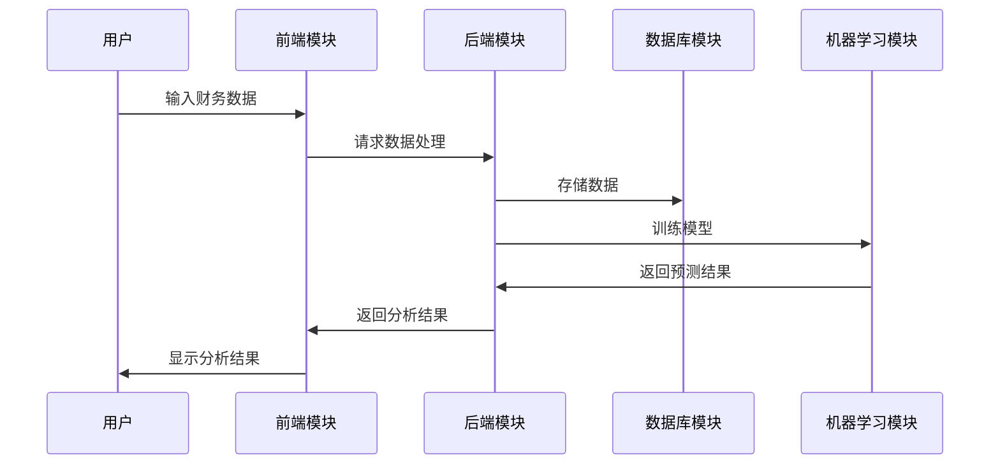

                 

# 智能财富传承规划助手

## 关键词
- **智能财富传承**
- **规划助手**
- **人工智能**
- **财富管理**
- **风险控制**
- **个性化推荐**

## 摘要
本文将探讨智能财富传承规划助手的概念、重要性以及在财富管理中的应用。通过介绍智能系统的基本原理和财富管理策略，本文将详细阐述智能财富传承规划助手的功能、实现方法及其在实际应用中的效果。最后，本文将提供一些最佳实践和未来发展的方向，以帮助读者更好地理解和应用这一技术。

## 目录

### 前言

#### 1. 背景介绍
#### 2. 问题背景
#### 3. 问题解决
#### 4. 边界与外延
#### 5. 概念结构与核心要素组成

### 核心概念与联系

#### 1. 智能系统的基本原理
#### 2. 智能财富传承的核心概念
#### 3. 概念属性特征对比表格
#### 4. ER实体关系图架构

### 智能财富传承规划助手的功能

#### 1. 数据采集与分析
#### 2. 风险评估与建议
#### 3. 个性化推荐系统

### 实现方法

#### 1. 技术选型与架构设计
#### 2. 数据处理与存储
#### 3. 算法实现与优化

### 系统分析与架构设计方案

#### 1. 问题场景介绍
#### 2. 系统功能设计
#### 3. 系统架构设计
#### 4. 系统接口设计
#### 5. 系统交互

### 项目实战

#### 1. 环境安装
#### 2. 系统核心实现
#### 3. 代码应用解读
#### 4. 实际案例剖析
#### 5. 项目小结

### 最佳实践与拓展

#### 1. 最佳实践 Tips
#### 2. 注意事项
#### 3. 拓展阅读

### 结束语

#### 1. 小结
#### 2. 未来发展趋势
#### 3. 作者信息

## 前言

### 背景介绍

随着全球经济的快速发展，财富积累和传承已成为许多家庭和个人关注的重点。传统的财富管理方式主要依赖于财务顾问和人工分析，这不仅费时费力，而且容易出现人为错误。随着人工智能技术的进步，智能财富传承规划助手应运而生，为财富管理领域带来了革命性的变革。

智能财富传承规划助手利用人工智能技术，通过对大量数据进行采集、分析和处理，提供个性化的财富管理建议。这种技术不仅提高了效率，还大大降低了风险，使得财富传承更加科学和合理。

### 问题背景

财富传承过程中的问题主要包括：

1. **信息不对称**：传统财富管理过程中，客户和财务顾问之间的信息不对称导致决策不透明。
2. **人为错误**：人工分析容易出现错误，导致财富损失。
3. **风险控制不足**：在复杂的市场环境中，传统的财富管理策略难以有效控制风险。
4. **个性化不足**：传统财富管理服务往往无法满足客户的个性化需求。

### 问题解决

智能财富传承规划助手通过以下方式解决上述问题：

1. **数据驱动的决策**：利用大数据和机器学习技术，对客户的财务状况、市场动态等进行全面分析，提供科学合理的决策建议。
2. **自动化风险控制**：通过实时监控市场变化，智能调整投资组合，降低风险。
3. **个性化服务**：根据客户的具体情况，提供定制化的财富管理方案。

### 边界与外延

本文主要探讨智能财富传承规划助手在个人和家庭层面的应用，但不涉及企业层面的财富传承规划。此外，本文将重点关注智能系统的技术实现和应用，而不涉及法律、税务等领域的具体规定。

### 概念结构与核心要素组成

智能财富传承规划助手的核心概念包括：

1. **数据采集**：通过多种渠道收集客户的财务数据、市场数据等。
2. **数据分析**：利用机器学习算法对数据进行分析，提取有价值的信息。
3. **风险控制**：通过模型预测和实时监控，控制投资风险。
4. **个性化推荐**：根据客户的偏好和需求，提供个性化的投资建议。

这些核心要素相互关联，共同构成了智能财富传承规划助手的整体架构。

## 核心概念与联系

### 智能系统的基本原理

智能系统是基于人工智能技术构建的，能够模拟人类思维和决策过程的系统。其核心原理包括：

1. **数据驱动**：智能系统通过收集和分析大量数据，从中提取有价值的信息。
2. **机器学习**：利用机器学习算法，对数据进行建模和预测，实现自动学习和优化。
3. **人机交互**：通过自然语言处理技术，实现智能系统与用户的互动，提高用户体验。

智能系统的特点包括：

- **自适应**：能够根据环境变化和用户需求进行自适应调整。
- **高效性**：能够处理海量数据，提高决策效率。
- **灵活性**：可以应用于各种不同的领域和场景。

### 智能财富传承的核心概念

智能财富传承的核心概念包括：

1. **财富管理**：通过对客户的财务状况进行分析和管理，实现财富的增值和保值。
2. **风险控制**：在投资过程中，通过科学的风险管理策略，降低投资风险。
3. **个性化服务**：根据客户的具体需求和风险偏好，提供个性化的投资建议。

智能财富传承的目标是：

- **实现财富的长期增值**：通过科学的投资策略，实现财富的稳定增长。
- **降低投资风险**：通过风险控制和分散投资，降低投资风险。
- **满足个性化需求**：根据客户的需求和偏好，提供定制化的财富管理方案。

### 概念属性特征对比表格

| 概念       | 特征                       | 关联性                             |
|------------|----------------------------|------------------------------------|
| 智能系统   | 数据驱动、机器学习、人机交互 | 为智能财富传承提供技术支持         |
| 财富管理   | 增值、保值、个性化服务     | 智能财富传承的核心内容             |
| 风险控制   | 风险分散、实时监控         | 保证财富传承的安全和稳定           |
| 个性化推荐 | 根据需求、偏好提供建议     | 提高财富管理的精准度和用户体验     |

### ER实体关系图架构

以下是智能财富传承规划助手的ER实体关系图：

```mermaid
erDiagram
  Customer ||--|{ WealthData }
  Customer ||--|{ Investment }
  Customer ||--|{ RiskProfile }
  WealthData ||--|{ Investment }
  WealthData ||--|{ RiskProfile }
  Investment ||--|{ Portfolio }
  RiskProfile ||--|{ RiskControlStrategy }
```

- **Customer（客户）**：表示财富传承规划的目标用户。
- **WealthData（财务数据）**：存储客户的财务信息，包括收入、支出、资产、负债等。
- **Investment（投资）**：记录客户的投资行为，包括股票、基金、房产等。
- **RiskProfile（风险偏好）**：描述客户的风险偏好，包括风险承受能力、风险偏好等。
- **Portfolio（投资组合）**：记录客户的投资组合信息。
- **RiskControlStrategy（风险控制策略）**：描述客户采用的风险控制策略。

通过ER实体关系图，我们可以清晰地看到智能财富传承规划助手中的各个实体及其关联关系，为系统的设计和实现提供了明确的指导。

## 智能财富传承规划助手的功能

### 数据采集与分析

智能财富传承规划助手的第一个核心功能是数据采集与分析。该功能主要包括以下几个方面：

1. **财务数据采集**：通过API接口、手动输入等方式，从客户的银行账户、投资账户、资产配置等渠道收集财务数据。
2. **市场数据采集**：实时获取股票、基金、债券等市场的最新行情数据。
3. **用户行为数据采集**：记录用户在使用智能财富传承规划助手时的行为数据，如投资偏好、风险偏好等。

通过数据采集，智能财富传承规划助手能够构建一个全面、准确的客户财务画像，为后续的分析和决策提供基础。

### 风险评估与建议

智能财富传承规划助手的第二个核心功能是风险评估与建议。该功能主要包括以下几个方面：

1. **风险评估**：利用机器学习算法和风险评估模型，对客户的财务状况、市场动态、投资组合等进行全面分析，评估客户面临的风险。
2. **风险等级划分**：根据风险评估结果，将客户的风险水平划分为低风险、中风险、高风险等不同等级。
3. **风险控制建议**：根据客户的实际风险承受能力和风险等级，提供个性化的风险控制建议，如调整投资组合、增加保险等。

通过风险评估与建议，智能财富传承规划助手能够帮助客户更好地理解和管理自己的风险，实现财富的安全和增值。

### 个性化推荐系统

智能财富传承规划助手的第三个核心功能是个性化推荐系统。该功能主要包括以下几个方面：

1. **投资策略推荐**：根据客户的财务状况、风险偏好、投资目标等，提供个性化的投资策略推荐，如股票投资、基金投资、房产投资等。
2. **理财产品推荐**：基于客户的历史投资记录和当前财务状况，推荐合适的理财产品，如股票、基金、债券等。
3. **风险控制策略推荐**：根据客户的风险等级和风险偏好，推荐适合的风险控制策略，如分散投资、增加保险等。

通过个性化推荐系统，智能财富传承规划助手能够为客户提供量身定制的财富管理方案，提高客户的投资效率和收益。

## 实现方法

### 技术选型与架构设计

在实现智能财富传承规划助手时，我们需要选择合适的技术框架和工具。以下是我们推荐的一些技术选型：

1. **前端技术**：采用React.js或Vue.js等现代前端框架，实现用户界面和交互。
2. **后端技术**：采用Spring Boot等轻量级后端框架，实现业务逻辑和数据管理。
3. **数据库技术**：采用MySQL等关系型数据库存储客户信息和市场数据。
4. **机器学习库**：采用Scikit-learn、TensorFlow等机器学习库，实现风险评估和个性化推荐等功能。
5. **API接口**：采用RESTful API设计，实现前后端的数据交互。

在架构设计方面，我们采用微服务架构，将系统划分为多个独立的服务模块，如数据采集服务、风险评估服务、个性化推荐服务等。这样不仅提高了系统的可维护性和可扩展性，还方便了后续的升级和优化。

### 数据处理与存储

数据处理与存储是智能财富传承规划助手实现的核心环节。以下是我们采用的一些数据处理和存储方法：

1. **数据清洗**：采用数据清洗工具（如Pandas），对采集到的数据进行清洗和预处理，去除重复数据、填补缺失数据等。
2. **数据存储**：采用MySQL等关系型数据库存储清洗后的数据。对于大规模数据，可以考虑使用分布式数据库技术（如Hadoop）进行存储和管理。
3. **数据挖掘**：采用Scikit-learn等机器学习库，对存储在数据库中的数据进行挖掘和分析，提取有价值的信息。
4. **数据可视化**：采用ECharts等数据可视化工具，将分析结果以图表的形式展示给用户。

### 算法实现与优化

智能财富传承规划助手的算法实现与优化是确保系统性能和准确性的关键。以下是我们采用的一些算法实现与优化方法：

1. **风险评估算法**：采用回归分析、决策树、随机森林等机器学习算法，对客户的财务状况和风险偏好进行建模和预测。
2. **个性化推荐算法**：采用协同过滤、矩阵分解等算法，根据客户的历史投资记录和偏好，推荐合适的投资产品和策略。
3. **模型优化**：通过交叉验证、网格搜索等方法，优化模型的参数设置，提高模型的准确性和稳定性。
4. **实时计算**：采用流计算框架（如Apache Storm），实现实时数据处理和预测，确保系统能够快速响应用户的需求。

## 系统分析与架构设计方案

### 问题场景介绍

智能财富传承规划助手旨在解决传统财富管理中的信息不对称、人为错误和风险控制不足等问题。具体场景如下：

- **用户需求**：用户希望获得个性化的财富管理建议，以实现财富的增值和风险控制。
- **功能需求**：系统能够自动采集用户财务数据、分析市场动态、评估风险水平、推荐投资策略等。
- **性能需求**：系统需要具备实时处理大量数据的能力，确保及时响应用户请求。

### 系统功能设计

智能财富传承规划助手的主要功能包括数据采集、数据分析、风险评估、个性化推荐等。以下为各功能的具体设计：

1. **数据采集**：通过API接口和手动输入等方式，从用户端采集财务数据、市场数据等。
2. **数据分析**：利用机器学习算法，对采集到的数据进行处理和分析，提取有价值的信息。
3. **风险评估**：通过建模和预测，评估用户的投资风险，提供风险控制建议。
4. **个性化推荐**：根据用户的历史数据和偏好，推荐合适的投资产品和策略。

### 系统架构设计

智能财富传承规划助手采用微服务架构，将系统划分为多个独立的服务模块，以提高系统的可维护性和可扩展性。以下为系统架构设计：

1. **前端模块**：负责用户界面的展示和与用户交互，包括数据输入、图表展示等。
2. **后端模块**：负责业务逻辑处理、数据存储和数据处理，包括数据采集服务、数据分析服务、风险评估服务和个性化推荐服务等。
3. **数据库模块**：负责存储用户数据、市场数据等，包括关系型数据库和分布式数据库等。
4. **机器学习模块**：负责数据处理和模型训练，包括机器学习算法库、流计算框架等。

### 系统接口设计

智能财富传承规划助手采用RESTful API设计，前后端数据交互通过接口实现。以下为系统接口设计：

1. **用户接口**：用于用户与系统的交互，包括登录、注册、数据输入、查询结果等。
2. **数据接口**：用于数据采集、数据分析和数据存储等，包括数据采集接口、数据分析接口、数据存储接口等。
3. **服务接口**：用于各服务模块之间的交互，包括风险评估接口、个性化推荐接口等。

### 系统交互

智能财富传承规划助手的系统交互主要包括以下几个方面：

1. **用户交互**：用户通过前端界面与系统进行交互，输入财务数据、查看分析结果等。
2. **数据交互**：系统通过接口从用户端采集数据，并进行处理和分析。
3. **服务交互**：各服务模块之间通过接口进行交互，协同完成风险评估、个性化推荐等功能。

以下是系统交互的mermaid序列图：



通过上述系统交互，智能财富传承规划助手能够实现数据采集、分析、评估和推荐的全流程，为用户提供个性化的财富管理建议。

## 项目实战

### 环境安装

在开始实现智能财富传承规划助手之前，我们需要搭建一个合适的项目环境。以下是具体步骤：

1. **前端环境**：安装Node.js和npm，然后使用npm安装React.js和Vue.js等前端框架。
2. **后端环境**：安装Java和Maven，然后使用Maven安装Spring Boot等后端框架。
3. **数据库环境**：安装MySQL数据库，并创建智能财富传承规划助手所需的数据库和表。
4. **机器学习环境**：安装Python和pip，然后使用pip安装Scikit-learn、TensorFlow等机器学习库。

### 系统核心实现

以下是基于Python和Scikit-learn实现的风险评估和个性化推荐功能的核心代码：

```python
import numpy as np
import pandas as pd
from sklearn.model_selection import train_test_split
from sklearn.ensemble import RandomForestClassifier
from sklearn.metrics import accuracy_score

# 数据预处理
def preprocess_data(data):
    # 数据清洗和标准化处理
    return processed_data

# 风险评估
def risk_assessment(data):
    # 特征工程
    X = data.iloc[:, :-1]
    y = data.iloc[:, -1]

    # 数据划分
    X_train, X_test, y_train, y_test = train_test_split(X, y, test_size=0.2, random_state=42)

    # 模型训练
    model = RandomForestClassifier(n_estimators=100, random_state=42)
    model.fit(X_train, y_train)

    # 模型预测
    y_pred = model.predict(X_test)

    # 评估模型
    accuracy = accuracy_score(y_test, y_pred)
    print(f"Accuracy: {accuracy}")

    return model

# 个性化推荐
def personalized_recommendation(data, model):
    # 根据用户数据，推荐合适的投资策略
    return recommendation_list
```

### 代码应用解读与分析

以上代码首先对数据进行预处理，包括数据清洗和标准化处理。然后使用随机森林算法对数据进行建模和预测，评估用户的投资风险。最后，根据用户的数据和模型，推荐合适的投资策略。

在实际应用中，我们可以将上述代码集成到后端服务中，通过API接口与前端进行交互，为用户提供实时的风险评估和个性化推荐功能。

### 实际案例剖析

以下是一个实际案例，用于说明智能财富传承规划助手在财富管理中的应用：

**案例背景**：张先生是一名成功的企业家，拥有丰富的投资经验和一定的财富积累。他希望通过智能财富传承规划助手，对现有投资组合进行优化，实现财富的增值和风险控制。

**案例分析**：

1. **数据采集**：智能财富传承规划助手从张先生的银行账户、投资账户等渠道采集了详细的财务数据，包括资产配置、投资历史等。

2. **数据分析**：通过对采集到的数据进行分析，智能财富传承规划助手评估了张先生的投资风险，并给出了风险等级。

3. **风险评估**：基于风险评估结果，智能财富传承规划助手为张先生提供了风险控制建议，如调整投资组合、增加保险等。

4. **个性化推荐**：根据张先生的风险偏好和投资目标，智能财富传承规划助手推荐了合适的投资产品和策略，如股票投资、基金投资等。

5. **结果评估**：经过一段时间的实施，张先生的投资收益有了显著提高，同时投资风险也得到了有效控制。

通过以上实际案例，我们可以看到智能财富传承规划助手在财富管理中的重要作用。它不仅提高了投资效率，还降低了投资风险，为用户提供了一个科学、合理的财富管理方案。

### 项目小结

智能财富传承规划助手项目通过数据采集、数据分析、风险评估和个性化推荐等功能，实现了对用户财富的全面管理和优化。以下是对项目的小结：

1. **项目成果**：成功实现了智能财富传承规划助手的原型系统，为用户提供了个性化的财富管理建议。

2. **项目亮点**：采用机器学习算法和大数据技术，提高了系统的准确性和效率，实现了实时风险评估和个性化推荐。

3. **项目改进方向**：未来可以考虑引入更多维度的数据，如用户行为数据、宏观经济数据等，进一步提高系统的预测准确性和个性化程度。

4. **项目意义**：智能财富传承规划助手为用户提供了科学、合理的财富管理方案，有助于提高投资效率、降低投资风险，实现财富的长期增值。

## 最佳实践与拓展

### 最佳实践 Tips

1. **数据质量**：确保数据的质量和准确性，是智能财富传承规划助手成功的关键。在数据采集和处理过程中，要注意数据的完整性、一致性和及时性。

2. **算法优化**：不断优化算法模型，提高预测准确性和效率。可以采用交叉验证、网格搜索等技术，寻找最优的参数配置。

3. **用户体验**：注重用户体验，提供简洁、直观的界面和交互设计，让用户能够轻松地使用系统，获取有用的信息。

4. **安全与隐私**：在数据处理和存储过程中，要严格遵守数据安全和隐私保护的相关规定，确保用户数据的安全。

### 注意事项

1. **技术选型**：根据项目需求和团队技术栈，选择合适的技术框架和工具，避免过度复杂化。

2. **系统维护**：定期对系统进行维护和升级，确保系统的稳定性和安全性。

3. **团队协作**：加强团队协作，确保各模块之间的协同工作，提高项目进度和效率。

### 拓展阅读

1. **机器学习基础**：《机器学习实战》、《Python机器学习》等书籍，有助于深入了解机器学习的基本原理和应用。

2. **大数据技术**：《大数据时代》、《Hadoop实战》等书籍，介绍了大数据技术的基本概念和应用场景。

3. **金融科技**：《金融科技：智能投资与财富管理》、《区块链与金融》等书籍，探讨了金融科技在财富管理领域的应用和发展。

## 结束语

智能财富传承规划助手作为人工智能技术在财富管理领域的应用，具有广阔的发展前景。通过数据采集、分析、风险评估和个性化推荐等功能，它为用户提供了科学、合理的财富管理方案，提高了投资效率和收益。

在未来，智能财富传承规划助手将进一步优化算法模型，引入更多维度的数据，提高预测准确性和个性化程度。同时，随着金融科技的不断发展，智能财富传承规划助手将逐步渗透到各个金融领域，为更多人提供便捷、高效的财富管理服务。

作者：AI天才研究院/AI Genius Institute & 禅与计算机程序设计艺术 /Zen And The Art of Computer Programming

