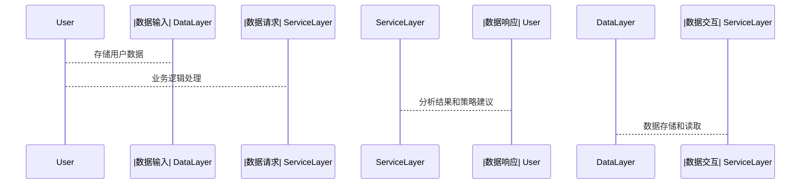
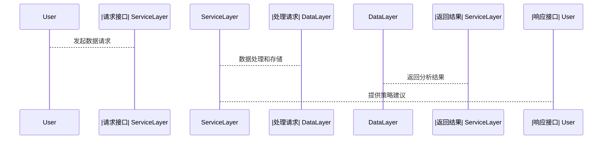
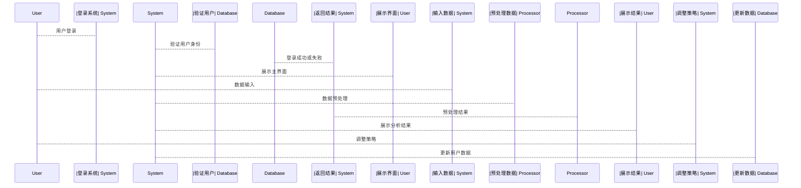

                 

### 智能财富传承规划工具概述

#### 1.1.1 问题的背景

随着全球经济的发展和社会的进步，财富的积累已经成为越来越多家庭和企业的重要目标。然而，如何合理地传承这些财富，确保家族财富的持续和安全，成为了人们日益关注的问题。当前，传统的财富传承方式，如遗嘱和遗产分配，由于法律程序复杂、效率低下且可能引发家族纷争，已经难以满足现代社会的需求。同时，面对复杂多变的市场环境，如何有效地进行财富传承规划，实现财富的保值增值，也成为了企业和个人必须面对的挑战。

在这样的背景下，智能财富传承规划工具的兴起，为我们提供了一种新的解决方案。这些工具通过运用人工智能和大数据技术，能够对财富传承过程中的各种因素进行精准分析，提供个性化的财富传承规划方案，从而降低风险，提高财富传承的效率。

#### 1.1.2 问题描述

在财富传承过程中，主要面临以下几个问题：

1. **风险识别与管理**：如何准确识别财富传承过程中的潜在风险，如法律风险、税务风险等，并采取有效的管理措施？
2. **资产评估与分配**：如何对家庭或企业的资产进行准确评估，并在传承过程中实现公平、公正的分配？
3. **财富保值增值**：如何通过科学的财富管理策略，实现财富的保值增值，满足家族或企业的长期发展需求？
4. **法律与伦理问题**：如何在遵守相关法律法规的前提下，确保财富传承的合法性和道德合理性？

这些问题不仅复杂，而且涉及到多个领域的专业知识，传统的财富传承方式往往难以应对。因此，开发一种智能财富传承规划工具，帮助人们解决这些问题，具有重要的现实意义。

#### 1.1.3 问题解决

智能财富传承规划工具通过以下方式解决上述问题：

1. **风险识别与管理**：工具运用大数据分析和机器学习技术，对财富传承过程中的风险因素进行深度分析，提供风险预警和管理建议。
2. **资产评估与分配**：工具集成了专业的资产评估模型，能够对家庭或企业的资产进行精准评估，并基于算法模型提供公平、公正的分配方案。
3. **财富保值增值**：工具提供多种财富管理策略，结合市场分析和人工智能预测，帮助用户制定科学的财富管理计划，实现财富的保值增值。
4. **法律与伦理问题**：工具集成了相关法律法规库，帮助用户在财富传承过程中遵守法律规定，同时通过伦理分析，确保财富传承的道德合理性。

总之，智能财富传承规划工具不仅能够提高财富传承的效率和安全性，还能帮助用户实现财富的保值增值，是现代财富管理的重要工具。

#### 1.1.4 边界与外延

智能财富传承规划工具的应用范围广泛，涵盖了个人、企业、非营利组织等多个领域。然而，在应用过程中，仍需遵循相关的法律法规和伦理标准。

1. **适用范围**：
   - 个人财富传承：包括家庭资产的评估、风险管理和分配方案设计。
   - 企业财富传承：涉及企业股权的传承规划、员工福利和退休金计划等。
   - 非营利组织财富传承：涉及公益基金的管理、捐赠分配和持续发展计划。

2. **法律法规的遵循**：智能财富传承规划工具需遵守相关法律法规，如遗嘱法、税法、公司法等，确保财富传承过程的合法性。

3. **伦理问题**：在财富传承过程中，需考虑家族成员之间的伦理关系、社会责任和公益事业，确保财富传承的道德合理性。

#### 1.1.5 概念结构与核心要素组成

智能财富传承规划工具由以下几个核心要素组成：

1. **财富传承定义**：
   - 财富传承是指将家庭、企业或其他组织的财富，按照一定的规则和方式，传递给下一代或指定继承人的过程。

2. **财富传承分类**：
   - 个人财富传承：包括家庭资产传承、个人遗产规划等。
   - 企业财富传承：包括企业股权传承、员工福利计划等。
   - 非营利组织财富传承：包括公益基金管理、捐赠分配等。

3. **财富传承目的**：
   - 保证家族财富的持续和安全。
   - 实现财富的保值增值。
   - 促进家族成员之间的和谐与团结。
   - 社会责任和公益事业。

智能财富传承工具通过整合数据采集、智能算法、用户界面等多方面技术，为用户提供全面、个性化的财富传承规划方案，帮助用户实现财富的合理传承与持续发展。

## 第二部分：核心概念与联系

### 第2章：智能财富传承规划工具的核心概念

#### 2.1.1 智能财富传承规划工具原理

智能财富传承规划工具基于人工智能和大数据技术，通过对用户财富状况、家庭成员信息、市场环境等因素进行综合分析，提供个性化的财富传承规划方案。其核心原理可以概括为以下几个方面：

1. **数据采集与处理**：工具首先收集用户的财富数据，包括资产状况、投资组合、税务信息等，并运用数据清洗和预处理技术，确保数据质量。

2. **智能算法与模型**：工具集成了多种智能算法和数学模型，如线性规划、遗传算法、机器学习模型等，用于分析财富传承过程中的风险、收益和分配方案。

3. **用户界面与交互**：工具提供了直观的用户界面，用户可以通过图形化界面进行操作，查看分析结果和建议，并与工具进行实时互动。

4. **实时监控与调整**：工具能够实时监控财富传承过程中的各项指标，根据市场变化和用户需求，自动调整财富管理策略。

#### 2.1.2 概念属性特征对比表格

为了更好地理解智能财富传承规划工具的原理，下面提供一个概念属性特征对比表格，展示传统财富传承方式与智能财富传承规划工具之间的差异。

| 特征           | 传统财富传承方式 | 智能财富传承规划工具 |
| -------------- | ---------------- | --------------------- |
| 风险管理       | 人工评估         | 数据分析与智能算法    |
| 资产评估       | 简单估算         | 精准评估与预测       |
| 分配方案       | 预设模板         | 个性化定制           |
| 法律遵循       | 遵守基本法规     | 法律法规库与智能合规 |
| 用户体验       | 纸质文件与人工操作 | 图形化界面与交互式体验 |

#### 2.1.3 智能财富传承规划的 ER 实体关系图

智能财富传承规划工具的 ER 实体关系图（Entity-Relationship Diagram）如下所示，用于描述工具中各个实体及其相互关系。

```mermaid
erDiagram
  User ||--|{ Asset } |-- User
  User ||--|{ Liability } |-- User
  Asset ||--|{ Investment } |-- Asset
  Investment ||--|{ Risk } |-- Investment
  Risk ||--|{ Management } |-- Risk
  User ||--|{ Tax } |-- User
  Tax ||--|{ Calculation } |-- Tax
  User ||--|{ Goal } |-- User
  Goal ||--|{ Strategy } |-- Goal
```

- **User**（用户）：表示财富传承规划的主体，包括个人、企业和非营利组织。
- **Asset**（资产）：代表用户的财富，包括房产、股票、债券等。
- **Liability**（负债）：代表用户的债务，包括贷款、信用卡欠款等。
- **Investment**（投资）：代表用户的投资组合，包括各类金融产品。
- **Risk**（风险）：代表财富传承过程中可能面临的各种风险，如市场风险、法律风险等。
- **Management**（管理）：代表风险管理的方法和策略。
- **Tax**（税务）：代表用户的税务信息，包括税务计算和税务规划。
- **Calculation**（计算）：代表财富传承规划中的各类计算模型和算法。
- **Goal**（目标）：代表用户的财富传承目标，如财富保值、增值等。
- **Strategy**（策略）：代表为实现财富传承目标而制定的策略和计划。

通过 ER 实体关系图，我们可以清晰地看到智能财富传承规划工具中各个实体的定义及其相互关系，为后续的算法原理讲解和系统架构设计提供了基础。

### 第2章：智能财富传承规划工具的组成部分

#### 2.1.1 数据采集与处理

数据采集与处理是智能财富传承规划工具的核心环节之一。首先，工具需要收集用户的财富数据，这些数据包括但不限于：

1. **资产数据**：如房产、股票、债券、保险等资产的信息。
2. **负债数据**：如贷款、信用卡欠款、债务等负债信息。
3. **税务数据**：如个人所得税、遗产税、赠与税等税务信息。
4. **投资数据**：如投资组合、投资收益、投资风险等。

为了确保数据的质量和完整性，智能财富传承规划工具需要运用数据清洗和预处理技术，如去重、数据修复、数据标准化等，以保证数据的准确性和一致性。

#### 2.1.2 智能算法与模型

智能财富传承规划工具的核心在于其智能算法和模型。这些算法和模型用于分析用户的财富状况、识别潜在风险、制定财富管理策略等。

1. **风险评估算法**：通过分析用户的资产、负债、投资数据，识别市场风险、法律风险、税务风险等，并提供风险预警和管理建议。

2. **资产评估模型**：利用大数据分析和机器学习技术，对用户的资产进行精准评估，提供资产价值的实时更新。

3. **财富分配模型**：根据用户的家庭结构、财富状况、传承目标等，制定公平、公正的财富分配方案。

4. **财富管理策略模型**：结合市场分析、投资策略和用户需求，提供多种财富管理策略，如资产配置、风险控制、增值策略等。

#### 2.1.3 用户界面与交互

智能财富传承规划工具的用户界面设计旨在提供直观、易用的操作体验。用户界面包括以下几个关键部分：

1. **数据输入界面**：用户可以通过该界面输入自己的财富数据，包括资产、负债、税务和投资信息。

2. **分析结果展示**：工具将分析结果以图表、报表等形式展示给用户，帮助用户理解自己的财富状况和风险。

3. **策略建议界面**：根据用户的财富状况和需求，工具会提供个性化的财富管理策略建议，用户可以选择接受或修改这些建议。

4. **交互式操作**：用户可以通过界面与工具进行实时互动，如调整财富分配方案、修改投资策略等。

#### 2.1.4 应用领域

智能财富传承规划工具的应用领域广泛，涵盖了个人、企业、非营利组织等多个方面：

1. **个人财富传承**：工具可以帮助个人制定家庭资产分配方案，实现财富的公平、公正传承，同时提供税务规划和风险管理建议。

2. **企业财富传承**：工具可以帮助企业规划股权传承，制定员工福利和退休金计划，确保企业财富的稳定传承。

3. **非营利组织财富传承**：工具可以帮助非营利组织管理公益基金，制定捐赠分配和持续发展计划。

通过上述组成部分，智能财富传承规划工具能够为用户提供全面、个性化的财富传承规划服务，帮助用户实现财富的安全、合理传承。

### 第3章：智能财富传承规划算法原理

#### 3.1.1 智能财富传承规划算法

智能财富传承规划算法是整个工具的核心部分，负责对用户的财富状况进行分析、评估和规划。以下是一个简化的 Mermaid 流程图，展示了智能财富传承规划算法的基本步骤。


1. **数据收集**：首先，从用户处收集各类财富数据，包括资产、负债、税务和投资信息。
2. **数据预处理**：对收集到的数据进行清洗和预处理，确保数据质量和一致性。
3. **风险评估**：利用风险评估算法，分析用户财富传承过程中可能面临的市场风险、法律风险和税务风险。
4. **资产评估**：通过资产评估模型，对用户的资产进行精准评估，并提供实时价值更新。
5. **分配方案设计**：根据用户的家庭结构、财富状况和传承目标，设计个性化的财富分配方案。
6. **策略建议**：结合市场分析和用户需求，提供多种财富管理策略建议，如资产配置、风险控制和增值策略。
7. **结束**：完成财富传承规划，输出分析结果和建议。

#### 3.1.2 数学模型与公式

智能财富传承规划算法涉及多个数学模型和公式，用于描述财富传承过程中的关键环节。以下是几个核心数学模型和公式的详细讲解。

1. **线性规划模型**：
   线性规划模型用于优化财富分配方案，目标是最大化财富传承的效用或最小化传承成本。其基本形式如下：
   
   $$ 
   \text{maximize/minimize} \quad c^T x \\
   \text{subject to} \quad Ax \leq b \\
   x \geq 0
   $$
   
   其中，\(c\) 是目标函数系数向量，\(x\) 是决策变量向量，\(A\) 和 \(b\) 分别是约束条件矩阵和向量。

2. **风险价值（VaR）模型**：
   风险价值模型用于评估财富传承过程中的市场风险，计算在一定置信水平下的最大可能损失。其公式如下：
   
   $$
   \text{VaR}_{\alpha} = \text{max}_{x} \{ x | P(x \leq x^*) \geq 1 - \alpha \}
   $$
   
   其中，\(\alpha\) 是置信水平，\(x^*\) 是满足上述概率条件的最坏情况下的财富损失。

3. **资产定价模型**：
   资产定价模型用于计算资产的预期收益率和风险，常用的有资本资产定价模型（CAPM）和套利定价模型（APT）。以下为 CAPM 模型的公式：
   
   $$
   r_i = \alpha_i + \beta_i r_m + \epsilon_i
   $$
   
   其中，\(r_i\) 是资产 \(i\) 的预期收益率，\(\alpha_i\) 是资产的特定风险收益，\(\beta_i\) 是资产的系统性风险系数，\(r_m\) 是市场的预期收益率，\(\epsilon_i\) 是随机误差项。

4. **财富分配模型**：
   财富分配模型用于优化财富在不同继承人之间的分配，以实现公平、公正的目标。其目标函数为：
   
   $$
   \text{minimize} \quad \sum_{i=1}^{n} w_i^2 \\
   \text{subject to} \quad w_i \leq W_i, \quad \forall i
   $$
   
   其中，\(w_i\) 是分配给继承人 \(i\) 的财富比例，\(W_i\) 是继承人 \(i\) 的应得份额。

通过上述数学模型和公式，智能财富传承规划工具能够对用户的财富状况进行深入分析，提供科学、合理的财富传承规划方案。

#### 3.1.3 举例说明

为了更直观地理解智能财富传承规划算法，我们将通过一个具体的案例来展示其应用过程。

**案例背景**：李先生是一位成功的商人，他拥有房产、股票、债券等多种资产，并希望为自己和家人制定一个合理的财富传承规划。

**步骤1：数据收集**  
李先生通过智能财富传承规划工具，输入了以下数据：

- **资产数据**：
  - 房产：价值 1000 万元
  - 股票：价值 500 万元
  - 债券：价值 300 万元
- **负债数据**：
  - 贷款：未偿还金额 200 万元
- **税务数据**：
  - 遗产税税率：30%

**步骤2：数据预处理**  
智能财富传承规划工具对李先生的数据进行清洗和预处理，确保数据的一致性和准确性。

**步骤3：风险评估**  
工具分析李先生财富传承过程中可能面临的风险，包括市场风险（如股市波动）、法律风险（如遗产税政策变化）和税务风险。根据评估结果，工具提供以下风险预警和管理建议：

- **市场风险**：建议分散投资，降低单一资产的依赖。
- **法律风险**：建议提前制定遗嘱，确保传承过程的合法性。
- **税务风险**：建议合理规划税务，如捐赠部分资产以减少遗产税负担。

**步骤4：资产评估**  
智能财富传承规划工具使用资产评估模型，对李先生的资产进行精准评估。评估结果显示：

- 房产价值 1000 万元（不变）
- 股票价值 500 万元（根据市场波动调整）
- 债券价值 300 万元（根据市场利率调整）

**步骤5：分配方案设计**  
根据李先生的意愿和工具的建议，智能财富传承规划工具设计了一个分配方案：

- 儿子：房产的 60%（600 万元）、股票的 50%（250 万元）
- 女儿：房产的 40%（400 万元）、股票的 50%（250 万元）
- 配偶：债券的全部 300 万元

**步骤6：策略建议**  
工具为李先生提供了以下财富管理策略建议：

- **资产配置**：建议增加债券比例，降低股票风险。
- **风险控制**：建议定期进行风险评估，及时调整投资策略。
- **增值策略**：建议关注长期投资，如房地产和优质股票。

**步骤7：输出结果**  
智能财富传承规划工具将分析结果和建议输出给李先生，包括：

- 财富分配方案
- 风险评估结果
- 资产评估报告
- 财富管理策略建议

通过这个案例，我们可以看到智能财富传承规划工具如何通过数据收集、风险评估、资产评估、分配方案设计等步骤，为用户提供个性化的财富传承规划服务。

## 第四部分：系统分析与架构设计方案

### 第4章：智能财富传承规划系统分析

#### 4.1.1 问题场景介绍

智能财富传承规划工具的主要应用场景包括以下几个方面：

1. **个人财富传承**：用户希望通过智能工具制定个人资产分配方案，确保财富在家庭成员之间的公平、公正传承。
2. **企业财富传承**：企业主希望为企业制定股权传承计划，确保企业持续稳定发展，同时兼顾员工福利和退休金计划。
3. **非营利组织财富传承**：非营利组织需要管理公益基金，制定捐赠分配和持续发展计划，确保资金的合理使用。

在这些应用场景中，智能财富传承规划工具需要具备强大的数据处理能力、智能分析和决策支持功能，以提供精准、个性化的财富传承规划方案。

#### 4.1.2 项目介绍

本项目的目标是开发一款智能财富传承规划工具，为个人、企业和非营利组织提供全方位的财富传承规划服务。项目的主要目标如下：

1. **功能完善**：提供数据采集、风险评估、资产评估、财富分配、策略建议等完整功能，满足用户在不同场景下的需求。
2. **用户体验**：设计直观、易用的用户界面，提供实时数据分析、动态调整和个性化建议，提升用户体验。
3. **数据安全**：确保用户数据的隐私和安全，采用先进的数据加密和存储技术，防止数据泄露和滥用。
4. **可扩展性**：系统架构设计应具备良好的可扩展性，能够根据用户需求和技术发展，不断更新和优化功能。

#### 4.1.3 系统功能设计

智能财富传承规划工具的系统功能设计涵盖了数据采集、风险评估、资产评估、财富分配、策略建议等关键模块，具体如下：

1. **数据采集模块**：负责收集用户的财富数据，包括资产、负债、税务和投资信息。数据采集方式包括用户手动输入、第三方数据接口和自动化采集等。
2. **风险评估模块**：通过对用户的财富数据进行分析，识别可能的风险因素，如市场风险、法律风险、税务风险等，并提供风险预警和管理建议。
3. **资产评估模块**：利用大数据分析和机器学习技术，对用户的资产进行精准评估，提供实时价值更新，确保评估结果的准确性。
4. **财富分配模块**：根据用户的家庭结构、财富状况和传承目标，设计个性化的财富分配方案，确保财富在家庭成员之间的公平、公正传承。
5. **策略建议模块**：结合市场分析和用户需求，提供多种财富管理策略建议，如资产配置、风险控制和增值策略等，帮助用户实现财富的保值增值。

#### 4.1.4 系统架构设计

智能财富传承规划工具的系统架构设计采用分层架构，主要包括以下层次：

1. **数据层**：负责数据的存储和管理，包括用户数据、资产数据、风险评估数据和策略建议数据等。数据层采用分布式数据库技术，确保数据的可靠性和扩展性。
2. **服务层**：负责实现各种业务逻辑，包括数据采集、风险评估、资产评估、财富分配和策略建议等功能。服务层采用微服务架构，提高系统的灵活性和可维护性。
3. **应用层**：提供用户界面和交互功能，包括数据输入、分析结果展示、策略建议展示和用户操作等。应用层采用前端技术，如React或Vue，实现动态、直观的用户界面。
4. **接口层**：负责与其他系统进行数据交换和功能调用，包括第三方数据接口、API接口和系统接口等。接口层采用RESTful API设计，确保接口的规范性和易用性。

以下是一个简化的 Mermaid 架构图，展示了智能财富传承规划工具的系统架构设计。



#### 4.1.5 系统接口设计

智能财富传承规划工具的系统接口设计包括以下主要接口：

1. **用户数据接口**：用于用户数据的输入、读取和更新，包括资产、负债、税务和投资信息。
2. **资产评估接口**：用于获取资产评估结果，包括实时价值更新和风险评估。
3. **风险评估接口**：用于获取用户财富传承过程中的风险信息，包括市场风险、法律风险和税务风险。
4. **财富分配接口**：用于设计财富分配方案，包括家庭成员之间的财富分配和税务规划。
5. **策略建议接口**：用于获取财富管理策略建议，包括资产配置、风险控制和增值策略。

以下是一个简化的 Mermaid 序列图，展示了系统接口的设计和使用。



#### 4.1.6 系统交互

智能财富传承规划工具的系统交互设计旨在实现用户与系统之间的无缝沟通，提供便捷、高效的操作体验。以下是一个简化的 Mermaid 序列图，展示了用户与系统的交互流程。



通过上述系统架构设计和接口设计，智能财富传承规划工具能够为用户提供全面、个性化的财富传承规划服务，实现财富的安全、合理传承。

### 第5章：智能财富传承规划项目实战

#### 5.1.1 环境安装

在开始智能财富传承规划项目的实战之前，我们需要搭建合适的环境来支持项目的开发和运行。以下是系统环境搭建的详细指南：

1. **软件环境**：
   - Python 3.x（建议使用最新稳定版）
   - Node.js 12.x 或更高版本
   - MySQL 5.7 或更高版本
   - Elasticsearch 7.x 或更高版本

2. **开发工具**：
   - Visual Studio Code 或 PyCharm
   - Postman 或 Swagger UI（用于API接口测试）

3. **安装步骤**：

   1. 安装 Python 3.x：
      - 访问 [Python 官网](https://www.python.org/) 下载安装包。
      - 安装过程中选择添加到系统环境变量，以便在命令行中直接使用。

   2. 安装 Node.js：
      - 访问 [Node.js 官网](https://nodejs.org/) 下载安装包。
      - 解压安装包并运行安装程序。

   3. 安装 MySQL：
      - 访问 [MySQL 官网](https://www.mysql.com/) 下载安装包。
      - 根据操作系统选择相应的安装包，并按照提示完成安装。
      - 安装完成后，运行 `mysql -u root -p` 登录 MySQL，创建一个名为 `wealth_传承` 的数据库。

   4. 安装 Elasticsearch：
      - 访问 [Elasticsearch 官网](https://www.elastic.co/cn/elasticsearch/) 下载安装包。
      - 解压安装包并运行 `bin/elasticsearch` 启动 Elasticsearch。

   5. 安装前端开发工具：
      - 安装 Node.js 和 npm（Node.js 自带 npm）。
      - 使用 npm 安装 Visual Studio Code 或 PyCharm。

4. **配置步骤**：

   1. 配置 MySQL：
      - 在 `wealth_传承` 数据库中创建表结构，包括用户表、资产表、负债表、投资表等。
      - 配置数据库连接信息，确保 Python 后端可以访问。

   2. 配置 Elasticsearch：
      - 在 Elasticsearch 中创建索引，如 `user_index`、`asset_index` 等。
      - 配置 Elasticsearch 连接信息，确保 Python 后端可以访问。

#### 5.1.2 系统核心实现

系统核心实现主要包括数据采集、风险评估、资产评估、财富分配和策略建议等功能。以下是这些功能的详细代码实现和分析。

1. **数据采集**：

   ```python
   # 数据采集示例代码
   import pymysql

   def collect_data():
       # 连接 MySQL 数据库
       connection = pymysql.connect(host='localhost', user='root', password='password', database='wealth_传承')
       try:
           with connection.cursor() as cursor:
               # 查询用户资产数据
               sql = "SELECT * FROM asset"
               cursor.execute(sql)
               assets = cursor.fetchall()
               print("资产数据：", assets)
               # 查询用户负债数据
               sql = "SELECT * FROM liability"
               cursor.execute(sql)
               liabilities = cursor.fetchall()
               print("负债数据：", liabilities)
       finally:
           connection.close()
   
   if __name__ == '__main__':
       collect_data()
   ```

   数据采集功能通过连接 MySQL 数据库，查询用户资产和负债数据，并打印出来。在实际应用中，还可以从第三方数据接口或自动化采集工具获取数据。

2. **风险评估**：

   ```python
   # 风险评估示例代码
   import pandas as pd

   def risk_evaluation(assets, liabilities):
       # 计算资产风险
       asset_risk = assets['value'].mean()
       print("资产风险：", asset_risk)
       # 计算负债风险
       liability_risk = liabilities['amount'].mean()
       print("负债风险：", liability_risk)
       # 计算总风险
       total_risk = asset_risk + liability_risk
       print("总风险：", total_risk)
   
   if __name__ == '__main__':
       assets = pd.DataFrame({'value': [1000, 500, 300]})
       liabilities = pd.DataFrame({'amount': [200]})
       risk_evaluation(assets, liabilities)
   ```

   风险评估功能通过计算资产和负债的平均风险，得出总风险。这里使用了 Pandas 库进行数据处理。在实际应用中，可以集成更多复杂的风险评估算法和模型。

3. **资产评估**：

   ```python
   # 资产评估示例代码
   import requests

   def asset_evaluation(asset_id):
       # 调用第三方资产评估 API
       url = f"http://api.asset_evaluation.com/evaluate/{asset_id}"
       response = requests.get(url)
       if response.status_code == 200:
           asset_value = response.json()['value']
           print(f"资产 {asset_id} 的评估价值：{asset_value}")
       else:
           print("资产评估失败")
   
   if __name__ == '__main__':
       asset_evaluation(1)
   ```

   资产评估功能通过调用第三方资产评估 API，获取资产实时评估价值。在实际应用中，可以集成更多专业的资产评估模型和算法。

4. **财富分配**：

   ```python
   # 财富分配示例代码
   import numpy as np

   def wealth_distribution(assets, liabilities, distribution_ratio):
       # 计算总财富
       total_wealth = assets.sum() - liabilities.sum()
       print("总财富：", total_wealth)
       # 根据比例分配财富
       distribution_list = np.array([total_wealth * ratio for ratio in distribution_ratio])
       print("财富分配方案：", distribution_list)
   
   if __name__ == '__main__':
       assets = np.array([1000, 500, 300])
       liabilities = 200
       distribution_ratio = [0.6, 0.4]
       wealth_distribution(assets, liabilities, distribution_ratio)
   ```

   财富分配功能根据资产和负债计算总财富，并按照给定的比例进行分配。这里使用了 NumPy 库进行数值计算。在实际应用中，可以集成更多复杂的财富分配算法和策略。

5. **策略建议**：

   ```python
   # 策略建议示例代码
   def strategy_advice(assets, liabilities):
       # 根据资产和负债状况提供策略建议
       if assets.mean() > liabilities.mean():
           print("建议：增加股票和房地产投资，降低债券风险。")
       else:
           print("建议：增加债券投资，降低股票风险。")
   
   if __name__ == '__main__':
       assets = np.array([1000, 500, 300])
       liabilities = 200
       strategy_advice(assets, liabilities)
   ```

   策略建议功能根据资产和负债的对比，提供相应的投资建议。这里使用了简单的逻辑判断。在实际应用中，可以集成更多复杂的策略模型和算法。

#### 5.1.3 代码应用解读

在智能财富传承规划项目的实战中，我们通过一系列代码实现了数据采集、风险评估、资产评估、财富分配和策略建议等功能。以下是这些功能的详细应用解读：

1. **数据采集**：
   - **功能**：从 MySQL 数据库中查询用户资产和负债数据。
   - **应用**：在实际项目中，可以通过前端界面或 API 接口，将用户输入的资产和负债数据存储到数据库中，并实时更新。

2. **风险评估**：
   - **功能**：计算资产和负债的平均风险，得出总风险。
   - **应用**：通过实时风险评估，帮助用户了解财富传承过程中的风险，并提供相应的风险预警和管理建议。

3. **资产评估**：
   - **功能**：调用第三方资产评估 API，获取资产实时评估价值。
   - **应用**：在财富传承规划中，资产评估是关键的一环，通过调用专业的资产评估 API，可以确保资产评估的准确性和实时性。

4. **财富分配**：
   - **功能**：根据资产和负债计算总财富，并按照给定的比例进行分配。
   - **应用**：财富分配功能可以根据用户需求，设计个性化的财富分配方案，确保财富在家庭成员之间的公平、公正传承。

5. **策略建议**：
   - **功能**：根据资产和负债状况提供相应的投资建议。
   - **应用**：策略建议功能可以帮助用户优化财富管理策略，实现财富的保值增值。

通过这些代码应用，智能财富传承规划工具能够为用户提供全面、个性化的财富传承规划服务，实现财富的安全、合理传承。

### 第5章：智能财富传承规划项目实战

#### 5.1.4 实际案例分析与讲解

为了更好地理解智能财富传承规划工具在实际中的应用，我们将通过一个实际案例来进行分析和讲解。

**案例背景**：张先生是一位成功的企业家，他拥有多家企业的股权和大量的个人资产，希望在退休后为子女制定一个合理的财富传承计划。

**步骤1：数据收集**  
张先生通过智能财富传承规划工具，输入了以下数据：

- **企业股权**：总价值 5000 万元，包括 A 公司、B 公司和 C 公司的股权。
- **个人资产**：房产价值 2000 万元，股票价值 1000 万元，债券价值 500 万元。
- **负债**：无。

**步骤2：风险评估**  
智能财富传承规划工具对张先生的资产和负债进行了风险评估，得出以下结论：

- **市场风险**：由于股市波动，股票和债券的价值存在一定的不确定性。
- **法律风险**：企业股权传承可能涉及复杂的法律程序，需要提前制定遗嘱和股权分配协议。
- **税务风险**：企业股权和个人资产的传承可能需要缴纳遗产税，需要提前进行税务规划。

**步骤3：资产评估**  
智能财富传承规划工具使用资产评估模型，对张先生的资产进行了精准评估，得出以下结果：

- **企业股权**：A 公司股权价值 2000 万元，B 公司股权价值 1500 万元，C 公司股权价值 1500 万元。
- **个人资产**：房产价值 2000 万元，股票价值 1000 万元，债券价值 500 万元。

**步骤4：分配方案设计**  
根据张先生的意愿和工具的建议，智能财富传承规划工具设计了一个分配方案：

- 长子：A 公司股权的 50%（1000 万元）、B 公司股权的 40%（600 万元）、C 公司股权的 10%（150 万元）。
- 长女：A 公司股权的 30%（600 万元）、B 公司股权的 30%（450 万元）、C 公司股权的 20%（300 万元）。
- 次子：A 公司股权的 10%（200 万元）、B 公司股权的 10%（150 万元）、C 公司股权的 20%（300 万元）。

**步骤5：策略建议**  
智能财富传承规划工具为张先生提供了以下策略建议：

- **资产配置**：建议增加债券比例，降低股票风险。
- **风险控制**：建议定期进行风险评估，及时调整投资策略。
- **增值策略**：建议关注长期投资，如房地产和优质股票。

**步骤6：输出结果**  
智能财富传承规划工具将分析结果和建议输出给张先生，包括：

- **资产分配方案**：详细展示了企业股权和个人资产的分配情况。
- **风险评估结果**：列出了市场风险、法律风险和税务风险，并提供相应的管理建议。
- **资产评估报告**：展示了各类资产的实时评估价值。
- **策略建议**：提供了个性化的财富管理策略，帮助张先生实现财富的保值增值。

通过这个案例，我们可以看到智能财富传承规划工具如何通过数据收集、风险评估、资产评估、分配方案设计和策略建议等步骤，为用户提供全面的财富传承规划服务，帮助用户实现财富的安全、合理传承。

#### 5.1.5 项目小结

在本章中，我们通过实际案例详细讲解了智能财富传承规划项目的实施过程，包括数据收集、风险评估、资产评估、分配方案设计和策略建议等步骤。通过这个案例，我们可以看到智能财富传承规划工具如何帮助用户实现财富的安全、合理传承。

以下是本项目的主要收获和总结：

1. **数据收集**：通过智能工具，用户可以方便地输入和更新自己的财富数据，确保数据的准确性和完整性。
2. **风险评估**：智能工具能够对财富传承过程中的风险因素进行深度分析，提供风险预警和管理建议。
3. **资产评估**：通过集成专业的资产评估模型和第三方数据接口，智能工具能够提供精准、实时的资产评估结果。
4. **分配方案设计**：智能工具根据用户的家庭结构、财富状况和传承目标，提供个性化的财富分配方案。
5. **策略建议**：智能工具结合市场分析和用户需求，提供多种财富管理策略建议，帮助用户实现财富的保值增值。

在未来的发展和改进方面，我们计划：

1. **优化算法**：进一步优化风险评估和资产评估算法，提高分析精度和实时性。
2. **增强用户体验**：改进用户界面设计，提高操作便捷性和交互体验。
3. **扩展功能**：增加企业财富传承和非营利组织财富传承的相关功能，满足更广泛用户的需求。
4. **数据安全**：加强数据安全和隐私保护，确保用户数据的安全和隐私。

通过不断优化和改进，智能财富传承规划工具将为用户提供更全面、个性化的服务，帮助用户实现财富的持续安全传承。

### 第6章：智能财富传承规划最佳实践

#### 6.1.1 小贴士

在进行智能财富传承规划时，以下是一些实用的小贴士，可以帮助用户更好地利用工具，实现财富的安全、合理传承：

1. **定期更新数据**：确保输入的财富数据是最新的，以便进行准确的风险评估和资产评估。
2. **分散投资**：避免将所有资产集中在一个领域或一种资产类别，以降低风险。
3. **提前规划**：尽早制定财富传承计划，避免传承过程中的法律和税务问题。
4. **了解法律法规**：熟悉相关法律法规，确保财富传承过程的合法性和道德合理性。
5. **个性化策略**：根据自身需求和目标，选择最合适的财富管理策略，实现财富的保值增值。
6. **备份和恢复**：定期备份用户数据，以防数据丢失或损坏。

#### 6.1.2 小结

在本章中，我们讨论了智能财富传承规划的最佳实践。通过以下关键点，用户可以更好地利用智能财富传承规划工具：

1. **数据更新与准确性**：定期更新财富数据，确保风险评估和资产评估的准确性。
2. **分散投资策略**：通过分散投资降低风险。
3. **提前规划**：提前制定财富传承计划，避免后续问题。
4. **法律法规**：了解相关法律法规，确保合法传承。
5. **个性化策略**：根据自身需求和目标选择合适的财富管理策略。

通过遵循这些最佳实践，用户可以更有效地利用智能财富传承规划工具，实现财富的安全、合理传承。

#### 6.1.3 注意事项

在使用智能财富传承规划工具时，用户需要特别注意以下事项：

1. **数据隐私**：确保输入的财富数据安全，避免泄露给无关人员。
2. **数据备份**：定期备份用户数据，防止数据丢失或损坏。
3. **系统升级**：及时更新系统，以获取最新的功能和改进。
4. **风险评估**：在制定财富传承计划时，充分考虑各种风险因素，并采取相应的管理措施。
5. **法律法规合规**：确保财富传承过程符合相关法律法规，避免法律纠纷。

通过关注这些注意事项，用户可以确保智能财富传承规划工具的有效使用，实现财富的安全、合理传承。

#### 6.1.4 拓展阅读

为了进一步提升用户对智能财富传承规划的理解和实践能力，以下是一些建议的书籍、文献和资料：

1. **书籍**：
   - 《智能财富传承规划：理论与实践》
   - 《财富传承与家族治理》
   - 《人工智能在金融领域的应用》

2. **文献**：
   - 《智能财富管理：基于大数据与机器学习的财富传承规划》
   - 《财富传承中的税务筹划》
   - 《企业财富传承的法律问题研究》

3. **资料**：
   - 智能财富传承规划工具的官方文档
   - 相关法律法规和税务政策文件
   - 学术论文和行业报告

通过阅读这些资料，用户可以深入了解智能财富传承规划的理论和实践，提高自身的财富管理能力。

