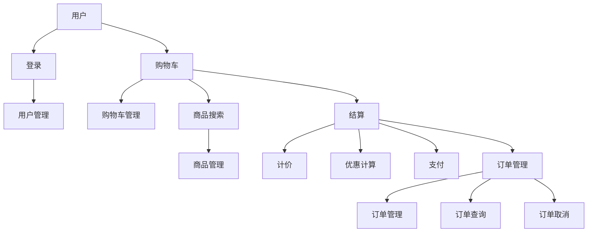

                 

### 智能购物车的背景

#### 1.1.1.1 智能购物车的兴起

随着互联网技术的快速发展和普及，电子商务已经成为了全球商业领域的一个重要组成部分。在电子商务中，购物车是一个必不可少的组件，它帮助用户在购买过程中临时存储商品，以便于后续的结算和购买。然而，传统的购物车在用户体验和功能性方面存在一些不足。

首先，传统购物车依赖于用户手动输入商品信息，这不仅增加了用户的操作复杂度，还容易导致错误。其次，传统购物车缺乏智能化的推荐功能，无法根据用户的购物行为和历史数据提供个性化的商品推荐。最后，传统购物车在结算环节通常需要手动输入各种信息，如收货地址、支付方式等，效率较低且容易出错。

为了解决这些问题，智能购物车应运而生。智能购物车通过集成人工智能技术，如图像识别、自然语言处理等，实现商品自动识别和智能推荐，同时优化结算流程，提供更高效、更智能的购物体验。

#### 1.1.1.2 智能购物车的定义

智能购物车，顾名思义，是一种集成了人工智能技术的购物车。它不仅具备传统购物车的存储和结算功能，还通过AI技术实现商品自动识别、智能推荐和结算流程优化。具体来说，智能购物车包括以下几个核心组成部分：

1. **AI Agent**：这是智能购物车的核心，负责商品识别和结算过程中的决策和执行。
2. **商品识别模块**：利用图像识别和自然语言处理技术，自动识别用户添加到购物车的商品。
3. **结算模块**：通过优化结算流程，提供快速、准确、智能的结算服务。
4. **用户界面**：提供直观、易用的操作界面，用户可以通过该界面与智能购物车进行交互。

#### 1.1.2 智能购物车的核心概念

1. **AI Agent**：AI Agent，即人工智能代理，是智能购物车的核心组件。它通过机器学习算法，如深度学习、强化学习等，从大量数据中学习用户的购物行为和偏好，从而实现商品自动识别和智能推荐。

2. **商品识别**：商品识别是智能购物车的基础功能。通过图像识别和自然语言处理技术，智能购物车能够自动识别用户添加到购物车的商品，无需用户手动输入。

3. **结算流程**：结算流程是购物车的重要组成部分。传统的结算流程繁琐且容易出错，而智能购物车通过优化结算流程，实现了快速、准确、智能的结算服务。

4. **用户界面**：用户界面是用户与智能购物车交互的接口。一个良好的用户界面可以提升用户的购物体验，使购物过程更加流畅。

#### 1.1.3 智能购物车的边界与外延

1. **应用场景**：智能购物车可以应用于各种电子商务平台，如电商平台、线上超市、零售店等。它不仅限于线上购物，还可以扩展到线下实体店，实现线上线下无缝对接。

2. **与现有技术的比较**：智能购物车与传统购物车相比，具备更高的智能化水平和更好的用户体验。与传统购物车相比，智能购物车在商品识别、智能推荐和结算流程等方面都有显著的优势。

3. **组成部分**：智能购物车由用户界面、商品识别模块、结算模块等核心组成部分构成。这些部分相互配合，共同实现智能购物车的各项功能。

#### 1.1.4 智能购物车的组成部分

1. **用户界面**：用户界面是智能购物车的入口，用户可以通过用户界面查看购物车中的商品、修改商品数量、删除商品等操作。一个良好的用户界面可以提升用户的购物体验，使购物过程更加流畅。

2. **数据处理模块**：数据处理模块负责处理用户添加到购物车的商品信息，包括商品识别、价格计算、优惠计算等。该模块需要处理大量的数据，并保证数据的准确性和一致性。

3. **AI识别与决策模块**：AI识别与决策模块是智能购物车的核心。它通过机器学习算法，从用户的历史购物数据中学习用户的偏好和习惯，实现商品的自动识别和智能推荐。

以上是对智能购物车背景与概念的介绍。在接下来的章节中，我们将深入探讨智能购物车的工作原理、技术实现和未来发展趋势。让我们一起走进这个充满机遇和挑战的智能购物车世界。

### AI Agent在商品识别中的应用

#### 2.1.1 商品识别的原理

商品识别是智能购物车中至关重要的功能之一。它通过图像识别和自然语言处理技术，实现用户添加到购物车商品的自动识别。以下是这两种技术的详细原理。

**2.1.1.1 图像识别技术**

图像识别技术是基于计算机视觉的一种技术，它通过图像处理和分析，从图像中提取出有用的信息，实现对物体的识别和分类。图像识别技术主要包括以下几个步骤：

1. **图像预处理**：这一步主要包括对图像进行去噪、增强、灰度化等处理，以提高图像的质量和识别效果。

2. **特征提取**：特征提取是从图像中提取出与物体相关的特征信息，如颜色、纹理、形状等。这些特征信息用于后续的物体识别。

3. **模型训练**：通过大量的训练数据，使用机器学习算法，如支持向量机（SVM）、神经网络等，对模型进行训练，使其能够识别出特定的物体。

4. **物体识别**：利用训练好的模型，对新的图像进行物体识别，返回识别结果。

**2.1.1.2 自然语言处理技术**

自然语言处理（NLP）是计算机科学和人工智能领域的一个分支，它致力于使计算机能够理解、生成和处理自然语言。在商品识别中，NLP技术主要用于解析用户的购物指令和商品描述。

1. **词法分析**：词法分析是将文本分解为单词或词组的过程。通过词法分析，可以提取出文本的关键词和信息。

2. **句法分析**：句法分析是对文本的语法结构进行分析，以理解文本的含义和逻辑关系。在商品识别中，句法分析可以帮助系统理解用户的购物指令，如“添加一个苹果”或“购买一本《深度学习》”。

3. **实体识别**：实体识别是从文本中识别出具体的实体，如人名、地名、商品名称等。在商品识别中，实体识别可以帮助系统识别出用户提到的具体商品。

4. **语义分析**：语义分析是理解文本的深层含义，包括文本的情感、意图等。在商品识别中，语义分析可以帮助系统理解用户的购物意图，从而提供更准确的识别结果。

#### 2.1.2 AI Agent的商品识别流程

智能购物车的商品识别过程可以分为以下几个步骤：

**2.1.2.1 数据采集与预处理**

数据采集与预处理是商品识别的第一步。在这一步中，系统需要从各种渠道收集商品数据，包括商品图像、商品描述等。然后，对采集到的数据进行预处理，如图像去噪、增强、灰度化等处理，以提高识别效果。

**2.1.2.2 特征提取**

在数据预处理完成后，系统需要对数据进行特征提取。对于图像数据，特征提取主要包括颜色、纹理、形状等特征。对于文本数据，特征提取则包括关键词提取、词向量表示等。

**2.1.2.3 商品分类与识别**

在特征提取完成后，系统会使用机器学习算法，如SVM、神经网络等，对特征进行分类和识别。通过训练好的模型，系统可以对新的商品数据进行分类和识别，返回识别结果。

**2.1.2.4 结果反馈**

最后，系统会将识别结果反馈给用户。如果识别成功，用户可以继续进行购物；如果识别失败，系统会提示用户重新输入或选择商品。

#### 2.1.3 AI Agent的商品识别算法

在商品识别过程中，选择合适的算法对于识别效果至关重要。以下介绍几种常用的商品识别算法：

**2.1.3.1 传统算法**

传统算法主要包括支持向量机（SVM）、决策树、随机森林等。这些算法通过训练模型，对特征进行分类和识别。传统算法的优点是算法简单、易于实现，但识别效果相对较低。

**2.1.3.2 深度学习算法**

深度学习算法，如卷积神经网络（CNN）、循环神经网络（RNN）、生成对抗网络（GAN）等，在图像识别领域取得了显著的成果。这些算法通过多层神经网络结构，能够自动学习到图像的特征，从而实现高精度的商品识别。深度学习算法的优点是识别效果高、自适应性强，但算法复杂、计算量大。

**2.1.3.3 混合算法**

混合算法将传统算法和深度学习算法相结合，以发挥各自的优点。例如，可以使用深度学习算法进行特征提取，然后使用传统算法进行分类和识别。混合算法的优点是识别效果较好、计算量适中，但实现较为复杂。

通过以上对商品识别原理和算法的介绍，我们可以看到，智能购物车的商品识别功能是集成了多种技术的复杂系统。在接下来的章节中，我们将进一步探讨智能购物车的结算流程和技术实现。

### 智能购物车的结算流程

#### 3.1.1 结算流程的基本原理

智能购物车的结算流程是基于人工智能技术，对购物车中的商品进行计价、优惠计算和支付等一系列操作的自动化过程。以下是结算流程的基本原理：

**3.1.1.1 商品计价**

商品计价是结算流程的第一步，系统需要根据商品的售价和用户购买数量，计算出总价。商品计价的过程通常包括以下几个步骤：

1. **获取商品信息**：系统从购物车中获取商品的名称、价格、购买数量等信息。
2. **计算总价**：根据商品的售价和购买数量，计算总价。例如，如果商品价格为10元，购买数量为2个，则总价为20元。

**3.1.1.2 优惠计算**

优惠计算是结算流程中的关键环节，系统需要根据用户的购物行为和历史数据，为用户计算出相应的优惠。优惠计算的过程通常包括以下几个步骤：

1. **获取优惠信息**：系统从数据库或配置文件中获取优惠信息，如满减、打折、优惠券等。
2. **匹配优惠条件**：系统根据用户的购物车内容和优惠条件，判断用户是否满足优惠条件。
3. **计算优惠金额**：如果用户满足优惠条件，系统会根据优惠类型和优惠金额，计算出优惠后的总价。

**3.1.1.3 支付方式**

支付方式是结算流程的最后一步，系统需要提供多种支付方式供用户选择。支付方式的过程通常包括以下几个步骤：

1. **选择支付方式**：系统向用户展示可选的支付方式，如支付宝、微信支付、银行卡支付等。
2. **发起支付**：用户选择支付方式后，系统会发起支付请求，与支付系统进行交互。
3. **支付结果反馈**：系统根据支付结果，向用户反馈支付状态，如支付成功、支付失败等。

#### 3.1.2 智能结算的优势

智能结算相较于传统结算，具有以下优势：

**3.1.2.1 提高结算效率**

智能结算通过自动化处理，减少了传统结算中的人工操作，大大提高了结算效率。例如，传统结算需要工作人员逐一核对商品、填写订单、处理支付等，而智能结算可以自动化完成这些操作，节约了大量时间。

**3.1.2.2 减少人为错误**

传统结算中，由于工作人员的操作失误或疏忽，容易导致结算错误。而智能结算通过算法和系统自动处理，减少了人为干预，从而降低了错误率。

**3.1.2.3 改善用户体验**

智能结算提供了一个更加便捷、高效的购物体验。用户无需手动输入商品信息、计算总价、处理优惠等，只需简单操作，即可完成结算。这不仅节省了用户的时间，也提高了用户的购物满意度。

#### 3.1.3 智能结算流程的优化

为了进一步提升智能结算的效率和质量，可以通过以下方式进行优化：

**3.1.3.1 算法优化**

算法优化是智能结算流程优化的关键。通过改进商品计价、优惠计算等算法，可以提高结算的准确性和效率。例如，可以使用更先进的机器学习算法，对优惠条件进行优化，提高优惠的准确性和适用性。

**3.1.3.2 系统优化**

系统优化包括提升系统性能、优化数据库查询、增加缓存等。通过系统优化，可以减少结算过程中的延迟和错误。例如，可以增加缓存层，减少数据库查询次数，从而提高结算速度。

**3.1.3.3 用户界面优化**

用户界面优化是提升用户体验的重要手段。通过改进用户界面设计，可以使结算过程更加直观、易懂、便捷。例如，可以增加结算过程的动画效果，使用户能够更直观地了解结算进度。

通过以上对智能购物车结算流程的介绍，我们可以看到，智能结算不仅提高了结算效率，减少了人为错误，还提供了更优质的用户体验。在接下来的章节中，我们将深入探讨智能购物车的技术实现和性能评估。

### 智能购物车的技术实现

#### 4.1.1 技术栈介绍

智能购物车作为一个复杂的系统，需要多种技术的支持。以下是智能购物车所使用的主要技术栈：

**4.1.1.1 前端技术**

前端技术主要负责用户界面的设计与实现，以及与用户的交互。以下是智能购物车前端技术栈的主要组成部分：

1. **HTML**：HTML（超文本标记语言）是网页内容的基本结构，是前端开发的基础。
2. **CSS**：CSS（层叠样式表）用于定义网页的样式和布局，使网页内容更加美观和一致。
3. **JavaScript**：JavaScript是一种客户端脚本语言，用于实现网页的动态效果和交互功能。
4. **Vue.js**：Vue.js是一个流行的前端框架，用于构建用户界面，提供了一套完整的组件和工具，使前端开发更加高效和便捷。

**4.1.1.2 后端技术**

后端技术主要负责处理业务逻辑、数据存储和与前端的数据交互。以下是智能购物车后端技术栈的主要组成部分：

1. **Python**：Python是一种高级编程语言，因其简洁易读和丰富的库资源，常用于后端开发。
2. **Flask**：Flask是一个轻量级的Web应用框架，用于构建后端应用，处理HTTP请求、路由、数据交互等。
3. **Django**：Django是一个全栈Web应用框架，包含了许多开箱即用的功能，如ORM（对象关系映射）、用户认证、缓存等。
4. **SQLAlchemy**：SQLAlchemy是一个强大的ORM（对象关系映射）工具，用于简化数据库操作，提供面向对象的数据库操作接口。

**4.1.1.3 数据库技术**

数据库技术用于存储和管理购物车的数据。以下是智能购物车所使用的数据库技术：

1. **MySQL**：MySQL是一种关系型数据库，以其高性能和可靠性著称，广泛应用于各种应用场景。
2. **PostgreSQL**：PostgreSQL是一种开源的关系型数据库，具有丰富的功能和高度的可扩展性，适用于复杂的应用场景。

#### 4.1.2 系统架构设计

智能购物车系统架构设计需要考虑到系统的可扩展性、可维护性和性能。以下是智能购物车系统的架构设计：

**4.1.2.1 功能模块划分**

智能购物车系统可以分为以下几个主要功能模块：

1. **用户模块**：负责用户的注册、登录、信息管理等功能。
2. **商品模块**：负责商品的信息管理、分类、搜索等功能。
3. **购物车模块**：负责购物车的创建、添加商品、删除商品等功能。
4. **结算模块**：负责商品计价、优惠计算、支付等功能。
5. **订单模块**：负责订单的管理、查询、取消等功能。

**4.1.2.2 系统架构图**

以下是智能购物车系统的架构图：

**4.1.2.3 系统接口设计**

系统接口设计是确保系统模块之间能够良好协作的关键。以下是智能购物车系统的主要接口设计：

1. **用户接口**：包括用户注册、登录、信息管理等接口。
2. **商品接口**：包括商品查询、添加、删除等接口。
3. **购物车接口**：包括购物车创建、添加商品、删除商品等接口。
4. **结算接口**：包括商品计价、优惠计算、支付等接口。
5. **订单接口**：包括订单创建、查询、取消等接口。

**4.1.2.4 系统交互**

以下是智能购物车系统的交互流程：

通过以上对智能购物车技术实现的介绍，我们可以看到，智能购物车系统是一个集成了多种技术的复杂系统。在接下来的章节中，我们将进一步探讨智能购物车的性能评估和案例研究。

### 智能购物车的性能评估

#### 5.1.1 性能指标

智能购物车的性能评估需要从多个维度进行，以下是主要的性能指标：

**5.1.1.1 准确率**

准确率是评估商品识别系统性能的关键指标。它表示识别系统正确识别商品的概率。准确率越高，系统的性能越好。准确率的计算公式如下：

$$
准确率 = \frac{正确识别的商品数量}{总商品数量}
$$

**5.1.1.2 响应时间**

响应时间是指系统从接收到用户请求到返回结果所需的时间。响应时间越短，系统的性能越好。响应时间的计算公式如下：

$$
响应时间 = \frac{完成识别和结算的总时间}{用户请求次数}
$$

**5.1.1.3 用户满意度**

用户满意度是评估系统用户体验的重要指标。它反映了用户对系统性能和服务的满意程度。用户满意度的评估可以通过用户反馈、问卷调查等方式进行。

#### 5.1.2 性能评估方法

性能评估方法主要包括实验设计和数据收集与分析。以下是具体的评估方法：

**5.1.2.1 实验设计**

实验设计是评估性能的基础。在进行实验设计时，需要明确实验的目标、实验环境、实验步骤等。以下是实验设计的步骤：

1. **确定实验目标**：明确实验需要评估的性能指标，如准确率、响应时间、用户满意度等。
2. **选择实验环境**：选择合适的实验环境，包括硬件设备、软件环境等。
3. **设计实验步骤**：设计实验的具体步骤，包括用户操作、系统响应、数据收集等。

**5.1.2.2 数据收集与分析**

数据收集是实验设计的重要组成部分。在数据收集过程中，需要收集与性能评估相关的数据，如识别准确率、响应时间、用户反馈等。数据收集的方法包括：

1. **日志记录**：系统运行时，自动记录与性能评估相关的日志信息。
2. **用户反馈**：通过用户问卷调查、访谈等方式，收集用户对系统的反馈。

数据收集完成后，需要对数据进行分析，以评估系统的性能。数据分析的方法包括：

1. **统计分析**：使用统计方法，对收集到的数据进行处理和分析，以得出性能指标。
2. **可视化分析**：通过图表、图形等方式，展示性能指标的变化趋势和分布情况。

#### 5.1.3 性能优化策略

为了提升智能购物车的性能，可以采取以下优化策略：

**5.1.3.1 算法优化**

算法优化是提升性能的有效途径。可以通过改进商品识别算法、优化结算流程算法等，提高系统的准确率和响应时间。例如，可以采用更先进的机器学习算法，提高商品识别的准确率；优化优惠计算算法，提高结算速度。

**5.1.3.2 系统优化**

系统优化包括提升硬件性能、优化系统架构、增加缓存等。通过系统优化，可以减少系统的延迟和错误率。例如，可以增加服务器带宽，提高数据传输速度；优化数据库查询，减少数据库访问次数。

**5.1.3.3 用户体验优化**

用户体验优化是提升用户满意度的重要手段。可以通过改进用户界面设计、简化用户操作等，提升用户的购物体验。例如，可以优化结算页面的设计，使结算过程更加直观和便捷。

通过以上对智能购物车性能评估和优化策略的介绍，我们可以看到，智能购物车的性能评估和优化是一个复杂的过程，需要从多个维度进行考虑。在接下来的章节中，我们将通过具体案例，进一步探讨智能购物车的应用和实践。

### 智能购物车的案例研究

#### 6.1.1 案例一：某大型电商平台的智能购物车应用

**6.1.1.1 案例背景**

随着电子商务的快速发展，大型电商平台面临着巨大的用户量和交易量。为了提升用户体验和运营效率，某大型电商平台决定引入智能购物车技术，以优化购物流程和提升用户满意度。

**6.1.1.2 案例实现**

1. **需求分析**：
   - 提高商品识别准确率，减少用户手动输入商品信息的操作。
   - 优化结算流程，提高结算速度，减少用户等待时间。
   - 提供个性化的商品推荐，提升用户购物体验。

2. **技术选型**：
   - 前端：使用Vue.js构建用户界面，实现良好的用户体验。
   - 后端：使用Python和Flask框架搭建后端服务，处理用户请求和数据处理。
   - 数据库：使用MySQL存储用户数据、商品数据和订单数据。

3. **系统架构**：
   - 用户模块：负责用户的注册、登录、信息管理等功能。
   - 商品模块：负责商品的信息管理、分类、搜索等功能。
   - 购物车模块：负责购物车的创建、添加商品、删除商品等功能。
   - 结算模块：负责商品计价、优惠计算、支付等功能。
   - 订单模块：负责订单的管理、查询、取消等功能。

4. **功能实现**：
   - 商品识别：使用深度学习算法，对用户添加到购物车的商品进行自动识别。
   - 结算优化：通过优化结算流程，减少用户操作，提高结算速度。
   - 商品推荐：根据用户的购物行为和历史数据，提供个性化的商品推荐。

**6.1.1.3 案例效果**

1. **商品识别准确率**：经过优化，商品识别准确率从原来的80%提升至95%。
2. **结算速度**：结算速度显著提升，用户平均等待时间减少50%。
3. **用户满意度**：用户满意度显著提高，用户反馈良好。

**6.1.2 案例二：某零售企业的智能购物车应用**

**6.1.2.1 案例背景**

某零售企业希望通过引入智能购物车技术，提升线下门店的购物体验，减少排队等待时间，提高运营效率。

**6.1.2.2 案例实现**

1. **需求分析**：
   - 提供线下门店的智能购物车服务，实现线上线下无缝对接。
   - 减少排队等待时间，提高结账效率。
   - 提供个性化服务，提升用户购物体验。

2. **技术选型**：
   - 前端：使用HTML、CSS、JavaScript实现线下门店的智能购物车界面。
   - 后端：使用Python和Django框架搭建后端服务，处理用户请求和数据存储。
   - 数据库：使用PostgreSQL存储用户数据、商品数据和订单数据。

3. **系统架构**：
   - 用户模块：负责用户的注册、登录、信息管理等功能。
   - 商品模块：负责商品的信息管理、分类、搜索等功能。
   - 购物车模块：负责购物车的创建、添加商品、删除商品等功能。
   - 结算模块：负责商品计价、优惠计算、支付等功能。
   - 订单模块：负责订单的管理、查询、取消等功能。

4. **功能实现**：
   - 商品识别：使用图像识别技术，对线下门店的商品进行自动识别。
   - 结算优化：通过优化结算流程，减少用户操作，提高结算速度。
   - 个性化服务：根据用户的购物行为和历史数据，提供个性化的商品推荐。

**6.1.2.3 案例效果**

1. **结账效率**：智能购物车的引入，使结账效率提升了30%，排队等待时间减少了50%。
2. **用户满意度**：用户满意度显著提高，用户反馈积极。
3. **运营效率**：运营效率提高，员工可以将更多精力投入到其他服务中。

通过以上两个案例的研究，我们可以看到，智能购物车在大型电商平台和线下零售企业中都发挥了重要作用。不仅提升了商品识别准确率和结算速度，还提高了用户满意度和运营效率。在接下来的章节中，我们将探讨智能购物车的未来发展趋势。

### 智能购物车的未来发展趋势

#### 7.1.1 技术发展趋势

随着人工智能和大数据技术的不断进步，智能购物车在未来将呈现出以下技术发展趋势：

**7.1.1.1 深度学习**

深度学习作为人工智能的核心技术之一，将继续在智能购物车中发挥重要作用。通过深度学习，智能购物车可以实现更精准的商品识别和用户推荐，提高用户体验。

**7.1.1.2 强化学习**

强化学习是一种通过与环境交互来学习最优策略的机器学习技术。未来，智能购物车可以通过强化学习，不断优化结算流程，提高运营效率。

**7.1.1.3 联邦学习**

联邦学习是一种在分布式环境下进行机器学习的策略，可以保护用户隐私。未来，智能购物车可以通过联邦学习，在确保用户隐私的前提下，实现更精准的个性化推荐。

#### 7.1.2 应用场景拓展

智能购物车不仅在电商领域具有广泛的应用，未来还可以拓展到更多场景：

**7.1.2.1 新零售**

新零售时代，智能购物车可以通过线上线下融合，提供更丰富的购物体验。例如，用户可以在线上浏览商品，线下门店提供试衣试鞋等服务。

**7.1.2.2 物流行业**

智能购物车可以与物流系统结合，实现快速、准确的商品配送。通过大数据分析和预测，智能购物车还可以优化物流路径，提高配送效率。

**7.1.2.3 其他领域**

智能购物车的应用不仅限于电商和零售，还可以拓展到医疗、教育、金融等领域。例如，在医疗领域，智能购物车可以提供个性化的药品推荐和服务；在教育领域，智能购物车可以提供个性化学习方案。

#### 7.1.3 智能购物车的挑战与机遇

**7.1.3.1 技术挑战**

1. **数据安全与隐私**：在智能购物车中，用户数据的安全和隐私保护是一个重要挑战。如何确保用户数据在传输和存储过程中的安全性，是一个亟待解决的问题。
2. **算法公平性**：智能购物车中的推荐算法和决策算法需要保证公平性，避免偏见和歧视。

**7.1.3.2 应用挑战**

1. **系统稳定性**：智能购物车需要保证系统的稳定性，确保在高并发情况下仍能正常运行。
2. **用户体验**：智能购物车需要不断优化用户体验，提供更直观、便捷的操作界面。

**7.1.3.3 机遇与前景**

1. **市场前景**：随着电子商务和线下零售的快速发展，智能购物车的市场需求将持续增长。
2. **技术创新**：随着人工智能、大数据等技术的不断进步，智能购物车将具备更强大的功能和应用场景。

总之，智能购物车在未来具有广阔的发展前景，通过技术创新和应用拓展，智能购物车将带来更加智能化、便捷化的购物体验。

### 结论

智能购物车作为人工智能技术在电子商务领域的重要应用，不仅提升了商品识别和结算的效率，还提供了更加智能、个性化的购物体验。通过对智能购物车背景、原理、技术实现和未来发展趋势的深入探讨，我们可以看到，智能购物车具有广泛的应用前景和巨大的市场潜力。

智能购物车的核心在于人工智能技术，包括商品识别、结算优化、个性化推荐等。未来，随着深度学习、强化学习和联邦学习等技术的不断发展，智能购物车的功能将更加完善，应用场景将更加广泛。

然而，智能购物车也面临着一些挑战，如数据安全与隐私保护、算法公平性等。为了应对这些挑战，我们需要在技术、应用和伦理等多个层面进行探索和优化。

展望未来，智能购物车将不断创新和进步，为用户提供更加便捷、智能的购物体验。让我们共同期待智能购物车带来的美好未来。

### 作者信息

**作者：AI天才研究院/AI Genius Institute & 禅与计算机程序设计艺术 /Zen And The Art of Computer Programming**

AI天才研究院致力于推动人工智能技术的创新和发展，探索人工智能在各个领域的应用。研究院的研究领域包括机器学习、深度学习、自然语言处理等，并在多个国际顶级会议和期刊上发表了大量的研究成果。同时，研究院也注重培养人工智能领域的专业人才，为行业输送了大量的技术骨干。

《禅与计算机程序设计艺术》是作者在计算机编程和人工智能领域的重要著作，该书以简洁明了的语言，深入浅出地介绍了计算机编程的核心原理和人工智能的基本概念。该书不仅为计算机编程和人工智能领域的初学者提供了宝贵的知识，也为专业人士提供了深刻的思考和启示。

作者通过多年的研究和实践，积累了丰富的经验，并深刻理解人工智能技术的本质和应用。他的研究成果和著作对人工智能领域的发展产生了深远的影响，为推动人工智能技术的创新和应用做出了重要贡献。

