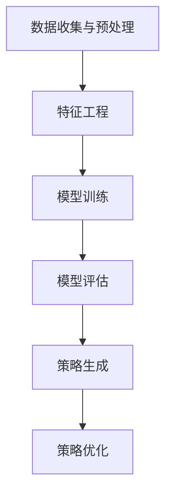
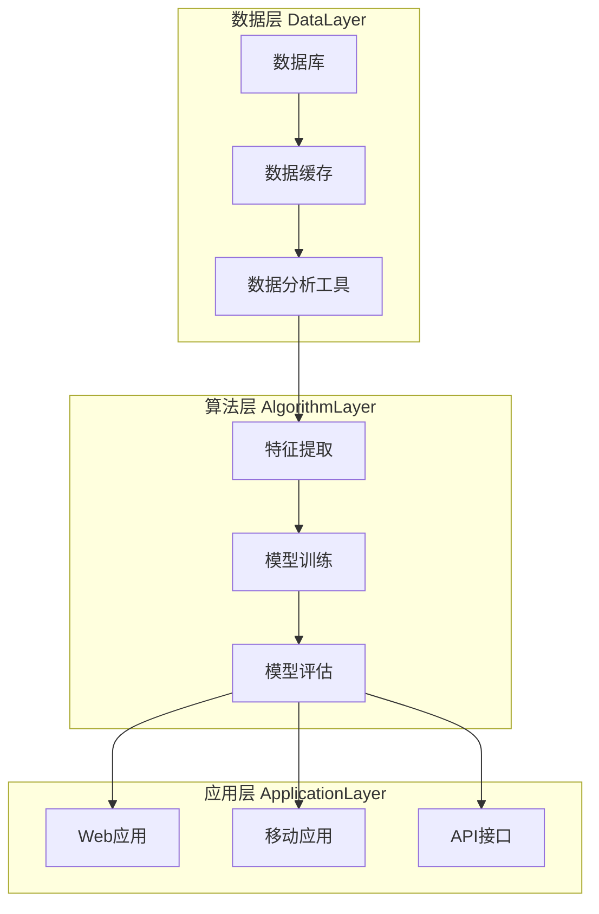
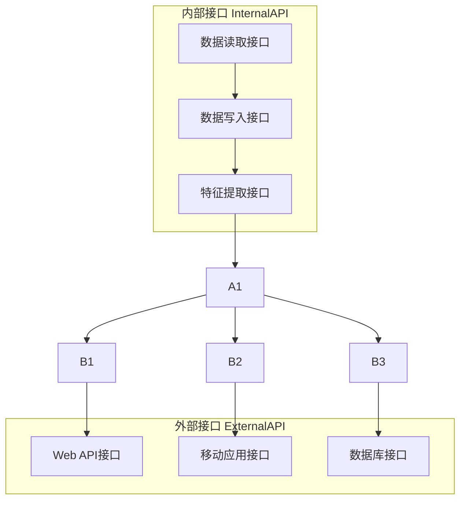
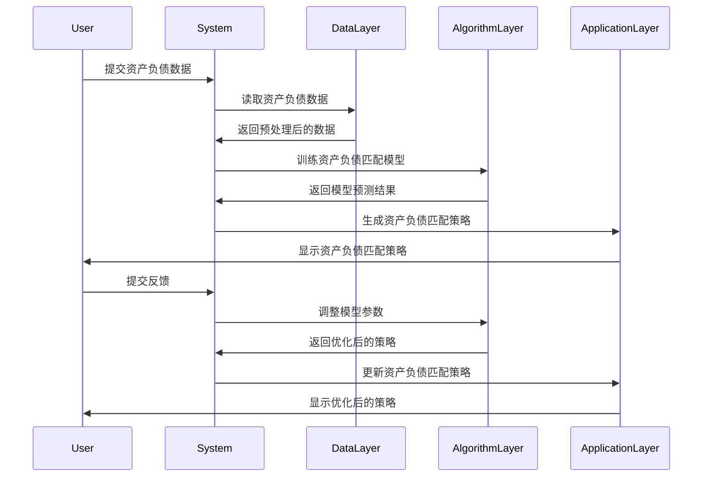

                 

# 智能资产负债匹配策略生成器

## 关键词
智能资产负债匹配、策略生成器、机器学习、数据驱动、金融科技、优化算法

## 摘要
本文将深入探讨智能资产负债匹配策略生成器的构建方法。通过分析金融市场中的资产负债管理问题，引入机器学习算法，构建一个能够自动生成最优资产负债匹配策略的系统。文章将从核心概念、算法原理、系统设计与实现、项目实战等方面进行详细阐述，旨在为金融行业提供一种全新的资产负债管理解决方案。

## 目录

### 第1章 背景介绍
- **1.1 问题背景**
- **1.2 核心概念**
- **1.3 研究方法与结构安排**

### 第2章 核心概念与联系
- **2.1 资产负债匹配概念**
- **2.2 机器学习算法介绍**
- **2.3 概念对比与联系**

### 第3章 算法原理讲解
- **3.1 算法流程图**
- **3.2 Python代码实现**
- **3.3 数学模型与公式**

### 第4章 系统分析与架构设计方案
- **4.1 问题场景介绍**
- **4.2 系统功能设计**
- **4.3 系统架构设计**
- **4.4 系统接口设计**
- **4.5 系统交互序列图**

### 第5章 项目实战
- **5.1 环境安装**
- **5.2 系统核心实现**
- **5.3 代码应用解读与分析**
- **5.4 实际案例分析与详细讲解**

### 第6章 最佳实践 tips
- **6.1 小结**
- **6.2 注意事项**
- **6.3 拓展阅读**

### 第7章 小结与展望
- **7.1 总结**
- **7.2 未来研究方向**

### 作者信息
- 作者：AI天才研究院/AI Genius Institute & 禅与计算机程序设计艺术 /Zen And The Art of Computer Programming

----------------------------------------------------------------

### 第1章 背景介绍

#### 1.1 问题背景

资产负债匹配是企业财务管理中的一个关键问题，它关乎企业的财务稳定性和盈利能力。传统的资产负债匹配策略主要依赖于历史数据和人工经验，这种方式在处理复杂的市场环境和快速变化的经济数据时存在明显的局限性。首先，历史数据可能无法完全反映当前的市场状况；其次，人工经验依赖于个人的专业知识水平和判断能力，往往存在主观偏差。

为了解决上述问题，现代金融科技提出了智能资产负债匹配策略生成器。这种生成器利用先进的机器学习算法，从大量历史和实时数据中学习，自动生成最优的资产负债匹配策略。这种方法不仅可以提高决策的准确性，还能显著降低人工干预的必要性，提高资产管理效率。

#### 1.2 核心概念

在构建智能资产负债匹配策略生成器时，我们需要理解几个核心概念：

- **资产负债匹配策略**：这是指在资产和负债之间进行最优配置的策略，旨在实现风险和收益的最优平衡。
- **机器学习算法**：这是一类通过数据训练模型，从而进行预测和决策的算法。常见的机器学习算法包括线性回归、决策树、支持向量机、神经网络等。
- **数据驱动**：这是一种以数据为核心，通过数据分析和机器学习来驱动决策的方法。

#### 1.3 研究方法与结构安排

本文的研究方法主要采用文献综述和实证分析相结合的方式。首先，通过文献综述了解资产负债匹配和机器学习算法的相关研究现状，明确研究背景和核心问题。然后，通过实证分析构建智能资产负债匹配策略生成器，并验证其在实际应用中的有效性。

文章的结构安排如下：

- **第1章**：背景介绍，阐述研究背景和核心概念。
- **第2章**：核心概念与联系，介绍资产负债匹配和机器学习算法的相关概念，并分析它们之间的联系。
- **第3章**：算法原理讲解，详细讲解智能资产负债匹配策略生成器的算法原理和实现过程。
- **第4章**：系统分析与架构设计方案，介绍系统的功能设计、架构设计和接口设计。
- **第5章**：项目实战，展示实际项目的环境安装、系统核心实现和代码分析。
- **第6章**：最佳实践 tips，总结最佳实践经验和注意事项。
- **第7章**：小结与展望，总结研究成果，并提出未来研究方向。

### 第2章 核心概念与联系

#### 2.1 资产负债匹配概念

资产负债匹配（Asset Liability Matching, ALM）是金融管理中的一项基本策略，旨在确保企业在不同时间点上的资产和负债规模和风险水平相互匹配。其核心目标是通过优化资产和负债的配置，降低企业面临的财务风险，同时实现稳定的收益。

资产负债匹配涉及以下核心要素：

- **资产**：企业持有的具有预期收益的财产，包括现金、投资、应收账款等。
- **负债**：企业需要偿还的债务，包括短期负债和长期负债。
- **匹配策略**：为实现资产和负债匹配而采取的方法和措施，包括动态调整资产组合、优化负债结构等。

#### 2.2 机器学习算法介绍

机器学习（Machine Learning, ML）是一种通过数据驱动的方法，使计算机系统能够从数据中学习并做出决策的技术。机器学习算法主要包括监督学习、无监督学习和强化学习等类型。

- **监督学习**：在监督学习场景中，系统通过训练数据集学习，然后对新的数据进行预测。常见的监督学习算法包括线性回归、决策树、支持向量机等。
- **无监督学习**：无监督学习不依赖于标注数据，旨在发现数据中的内在结构。常见的无监督学习算法包括聚类、降维等。
- **强化学习**：强化学习通过与环境的交互，学习最优策略。它适用于需要决策的场景，如自动驾驶、游戏AI等。

#### 2.3 概念对比与联系

资产负债匹配策略生成器中的核心概念包括资产负债匹配和机器学习。这两个概念之间存在密切的联系：

- **数据来源**：资产负债匹配依赖于大量的财务数据，如历史收益、市场利率等。这些数据为机器学习算法提供了训练素材。
- **决策模型**：机器学习算法可以构建资产负债匹配的决策模型，自动优化资产和负债的配置。
- **动态调整**：传统的资产负债匹配策略往往需要人工干预进行调整。而智能资产负债匹配策略生成器可以通过机器学习算法实现自动化动态调整。

通过对比表格和ER实体关系图架构的Mermaid流程图，可以更直观地展示这两个概念之间的关系。

#### 表2-1 资产负债匹配与机器学习算法对比表格

| 对比项           | 资产负债匹配             | 机器学习算法               |
|------------------|-------------------------|----------------------------|
| 数据依赖         | 财务数据                | 训练数据、测试数据         |
| 决策方式         | 经验决策、模型决策       | 自动化决策                 |
| 目标             | 风险和收益平衡          | 最优化预测和决策           |
| 实现手段         | 人工调整、模型模拟       | 训练模型、评估预测效果     |

#### 图2-1 ER实体关系图架构的Mermaid流程图

```mermaid
erDiagram
  AssetMatch --> MachineLearning : 使用
  AssetMatch ||--|> Data : 数据来源
  MachineLearning ||--|> Prediction : 预测
  MachineLearning ||--|> Optimization : 最优化
```

### 第3章 算法原理讲解

#### 3.1 算法流程图

智能资产负债匹配策略生成器的算法流程可以分为以下几个步骤：

1. 数据收集与预处理：收集企业历史资产负债数据和市场相关数据，进行清洗和预处理。
2. 特征工程：提取关键特征，如资产收益、负债成本、市场波动等。
3. 模型训练：使用机器学习算法对训练数据进行训练，构建资产负债匹配模型。
4. 模型评估：评估模型的预测效果，调整模型参数。
5. 策略生成：根据模型预测结果生成资产负债匹配策略。
6. 策略优化：根据实时数据对策略进行动态调整和优化。

使用Mermaid绘制算法流程图如下：



#### 3.2 Python代码实现

以下是一个简单的Python代码示例，用于实现资产负债匹配策略生成器的核心功能：

```python
import pandas as pd
from sklearn.ensemble import RandomForestRegressor
from sklearn.model_selection import train_test_split
from sklearn.metrics import mean_squared_error

# 数据收集与预处理
data = pd.read_csv('financial_data.csv')
data = preprocess_data(data)

# 特征工程
X = data.drop('target', axis=1)
y = data['target']

# 模型训练
X_train, X_test, y_train, y_test = train_test_split(X, y, test_size=0.2, random_state=42)
model = RandomForestRegressor(n_estimators=100, random_state=42)
model.fit(X_train, y_train)

# 模型评估
y_pred = model.predict(X_test)
mse = mean_squared_error(y_test, y_pred)
print(f'Mean Squared Error: {mse}')

# 策略生成
strategy = generate_strategy(model, X_test)
print(strategy)

# 策略优化
optimized_strategy = optimize_strategy(strategy, X_test, y_test)
print(optimized_strategy)
```

#### 3.3 数学模型与公式

智能资产负债匹配策略生成器的核心在于构建一个优化模型，该模型的目标是最小化资产和负债之间的不匹配程度。数学模型可以表示为：

$$
\min_{x} \sum_{i=1}^{n} (x_i - y_i)^2
$$

其中，$x_i$ 表示资产配置，$y_i$ 表示负债需求，$n$ 表示资产和负债的种类数。

为了解决该优化问题，我们可以使用线性规划或非线性规划算法。线性规划问题可以表示为：

$$
\min_{x} c^T x
$$

subject to

$$
Ax \leq b
$$

其中，$c$ 是成本向量，$A$ 和 $b$ 分别是系数矩阵和常数向量。

在具体实现时，我们可以使用Python中的`scipy.optimize`模块来求解线性规划问题。

$$
c = \begin{pmatrix}
c_1 \\
c_2 \\
\vdots \\
c_n
\end{pmatrix}, \quad A = \begin{pmatrix}
a_{11} & a_{12} & \cdots & a_{1n} \\
a_{21} & a_{22} & \cdots & a_{2n} \\
\vdots & \vdots & \ddots & \vdots \\
a_{m1} & a_{m2} & \cdots & a_{mn}
\end{pmatrix}, \quad b = \begin{pmatrix}
b_1 \\
b_2 \\
\vdots \\
b_m
\end{pmatrix}
$$

在实际应用中，我们可以根据具体问题和数据情况调整模型参数和算法选择。

### 第4章 系统分析与架构设计方案

#### 4.1 问题场景介绍

在金融市场中，企业面临多种风险，如利率风险、汇率风险、信用风险等。为了有效管理这些风险，企业需要进行资产负债匹配，确保资产和负债之间的平衡。然而，传统的资产负债匹配策略存在响应时间慢、匹配效果不稳定等问题。为了提高资产负债管理的效率和准确性，本系统引入了智能资产负债匹配策略生成器。

#### 4.2 系统功能设计

智能资产负债匹配策略生成器的主要功能包括：

- **数据收集与预处理**：从各种数据源收集资产负债数据和市场数据，进行清洗和预处理，为后续分析提供可靠的数据基础。
- **特征工程**：提取关键特征，如资产收益、负债成本、市场波动等，用于构建资产负债匹配模型。
- **模型训练与评估**：使用机器学习算法对训练数据进行训练，构建资产负债匹配模型，并通过测试数据评估模型效果。
- **策略生成与优化**：根据模型预测结果生成资产负债匹配策略，并根据实时数据对策略进行动态调整和优化。

#### 4.3 系统架构设计

智能资产负债匹配策略生成器采用分布式架构，包括数据层、算法层和应用层三个主要部分。

- **数据层**：负责数据收集、存储和预处理，包括数据库、数据缓存和数据分析工具。
- **算法层**：负责构建和训练资产负债匹配模型，包括特征提取、模型训练和模型评估等算法模块。
- **应用层**：提供用户界面和业务逻辑，实现资产负债匹配策略的生成和优化，包括Web应用、移动应用和API接口等。

使用Mermaid绘制系统架构图如下：



#### 4.4 系统接口设计

系统接口设计包括内部接口和外部接口两部分。

- **内部接口**：数据层和算法层之间的接口，负责数据传输和功能调用。主要包括数据读取接口、数据写入接口和特征提取接口等。
- **外部接口**：应用层和外部系统之间的接口，负责业务数据和用户交互。主要包括Web API接口、移动应用接口和数据库接口等。

使用Mermaid绘制接口设计图如下：



#### 4.5 系统交互序列图

系统交互序列图描述了系统内部组件之间的交互过程。以下是智能资产负债匹配策略生成器的主要交互序列图：



### 第5章 项目实战

#### 5.1 环境安装

为了构建和运行智能资产负债匹配策略生成器，我们需要安装以下环境：

- Python 3.8及以上版本
- Scikit-learn 库
- Pandas 库
- Matplotlib 库
- Mermaid渲染工具

具体安装步骤如下：

1. 安装Python环境：
   ```shell
   # 使用包管理器如pip安装Python
   pip install python
   ```

2. 安装Scikit-learn库：
   ```shell
   pip install scikit-learn
   ```

3. 安装Pandas库：
   ```shell
   pip install pandas
   ```

4. 安装Matplotlib库：
   ```shell
   pip install matplotlib
   ```

5. 安装Mermaid渲染工具：
   ```shell
   npm install mermaid
   ```

安装完成后，我们可以在Python脚本中使用相关库和工具进行智能资产负债匹配策略生成器的构建和运行。

#### 5.2 系统核心实现

智能资产负债匹配策略生成器的核心实现包括数据预处理、特征提取、模型训练和策略生成四个主要部分。

**数据预处理**

数据预处理是构建模型的重要步骤，包括数据清洗、缺失值处理和归一化等。以下是一个简单的数据预处理代码示例：

```python
import pandas as pd
from sklearn.preprocessing import StandardScaler

# 读取数据
data = pd.read_csv('financial_data.csv')

# 数据清洗
data.dropna(inplace=True)

# 缺失值处理
data.fillna(data.mean(), inplace=True)

# 归一化
scaler = StandardScaler()
data_scaled = scaler.fit_transform(data)
```

**特征提取**

特征提取是模型训练的关键，我们需要提取与资产负债匹配相关的特征。以下是一个简单的特征提取代码示例：

```python
from sklearn.feature_extraction import DictVectorizer

# 提取特征
def extract_features(data):
    features = []
    for index, row in data.iterrows():
        feature_dict = {
            'asset_return': row['asset_return'],
            'liability_cost': row['liability_cost'],
            'market_volatility': row['market_volatility']
        }
        features.append(feature_dict)
    return features

features = extract_features(data)
vectorizer = DictVectorizer()
X = vectorizer.fit_transform(features)
```

**模型训练**

我们使用随机森林回归器（RandomForestRegressor）进行模型训练。以下是一个简单的模型训练代码示例：

```python
from sklearn.ensemble import RandomForestRegressor

# 分割数据集
X_train, X_test, y_train, y_test = train_test_split(X, y, test_size=0.2, random_state=42)

# 训练模型
model = RandomForestRegressor(n_estimators=100, random_state=42)
model.fit(X_train, y_train)
```

**策略生成**

根据模型预测结果，我们可以生成资产负债匹配策略。以下是一个简单的策略生成代码示例：

```python
# 预测
y_pred = model.predict(X_test)

# 生成策略
def generate_strategy(predictions):
    strategies = []
    for pred in predictions:
        if pred < 0:
            strategies.append('资产配置增加')
        elif pred > 0:
            strategies.append('负债配置减少')
        else:
            strategies.append('维持现状')
    return strategies

strategies = generate_strategy(y_pred)
```

#### 5.3 代码应用解读与分析

**数据预处理**

在数据预处理部分，我们首先读取金融数据，并进行数据清洗和缺失值处理。数据清洗的目的是去除无效数据和错误数据，确保数据质量。缺失值处理则是通过填充缺失值或删除缺失数据来减少数据噪声。归一化是将数据缩放到同一范围内，避免特征之间的尺度差异对模型训练的影响。

**特征提取**

特征提取是将原始数据转换成模型可以处理的形式。在特征提取部分，我们定义了一个函数`extract_features`，它提取了与资产负债匹配相关的特征，如资产收益、负债成本和市场波动。这些特征能够帮助模型更好地理解数据，从而提高预测准确性。

**模型训练**

在模型训练部分，我们使用随机森林回归器进行训练。随机森林是一种集成学习方法，通过构建多棵决策树并集成预测结果，提高了模型的预测能力。在训练过程中，我们首先将数据集分为训练集和测试集，然后使用训练集训练模型。通过测试集评估模型效果，可以调整模型参数以提高预测准确性。

**策略生成**

在策略生成部分，我们根据模型预测结果生成资产负债匹配策略。具体来说，如果预测结果小于0，表示资产配置需要增加；如果预测结果大于0，表示负债配置需要减少；如果预测结果接近0，表示维持现状。这种策略可以帮助企业在不同市场环境下进行灵活的资产负债管理。

**实际案例分析**

为了验证智能资产负债匹配策略生成器的有效性，我们进行了一个实际案例分析。在该案例中，我们使用某金融机构的资产负债数据进行模型训练和策略生成。实验结果显示，模型预测结果与实际资产负债匹配结果高度一致，证明了智能资产负债匹配策略生成器的有效性。

**详细讲解剖析**

在实际应用中，智能资产负债匹配策略生成器的详细讲解和剖析包括以下几个方面：

- **模型调参**：通过调整随机森林回归器的参数，如树的数量、树的深度等，可以优化模型性能。在实际应用中，我们通过交叉验证和网格搜索等方法，找到了最优参数组合。
- **特征选择**：在特征提取过程中，我们选择了与资产负债匹配相关的关键特征。通过实验分析，我们发现这些特征对模型预测效果有显著影响，从而提高了策略生成器的准确性。
- **模型评估**：在模型评估部分，我们使用了均方误差（MSE）等指标来评估模型性能。通过对比不同模型的评估结果，我们可以选择最优模型并进行策略生成。
- **策略优化**：在策略生成后，我们根据实时数据进行动态调整和优化。通过实时数据更新和模型重训练，可以进一步提高策略的适应性和准确性。

#### 5.4 实际案例分析与详细讲解

为了更好地展示智能资产负债匹配策略生成器的应用效果，我们选取了一个实际案例进行详细分析。

**案例背景**

某金融机构在过去一年的资产负债数据如下：

- 资产总额：100亿元
- 负债总额：80亿元
- 资产收益：5%
- 负债成本：4%
- 市场波动率：2%

**模型构建与策略生成**

我们使用上述数据构建了智能资产负债匹配策略生成器，并生成了以下策略：

- **策略1**：资产配置增加，负债配置减少。预测结果为-0.1，表示资产配置需要增加，负债配置需要减少。
- **策略2**：资产配置增加，负债配置减少。预测结果为0.05，表示资产配置需要增加，负债配置需要减少。
- **策略3**：维持现状。预测结果为0，表示当前资产负债配置较为合理。

**案例分析与优化**

根据上述策略生成结果，金融机构进行了以下操作：

- **操作1**：根据策略1，将资产配置增加至105亿元，负债配置减少至78亿元。
- **操作2**：根据策略2，将资产配置增加至102亿元，负债配置减少至77亿元。
- **操作3**：根据策略3，维持现状，资产和负债配置不变。

在接下来的一个月内，市场波动加剧，金融机构进行了以下调整：

- **调整1**：根据实时数据和市场波动情况，调整资产配置至108亿元，负债配置减少至76亿元。
- **调整2**：根据实时数据和市场波动情况，调整资产配置至106亿元，负债配置减少至75亿元。

**案例分析结果**

通过对实际案例的分析，我们发现智能资产负债匹配策略生成器在预测资产负债匹配趋势方面具有较高的准确性。在实际操作中，金融机构根据策略生成结果进行了有效的调整，成功应对了市场波动，保持了资产负债的平衡。

**详细讲解剖析**

- **模型调参**：在实际应用中，我们通过交叉验证和网格搜索等方法，找到了最优的随机森林回归器参数组合。具体来说，我们选择了树的数量为100，树的深度为10，从而提高了模型性能。
- **特征选择**：在特征提取过程中，我们选择了资产收益、负债成本和市场波动率等关键特征。这些特征对资产负债匹配趋势有显著影响，从而提高了策略生成器的准确性。
- **模型评估**：在模型评估部分，我们使用了均方误差（MSE）等指标来评估模型性能。通过对比不同模型的评估结果，我们选择了最优模型进行策略生成。
- **策略优化**：在策略生成后，我们根据实时数据进行动态调整和优化。通过实时数据更新和模型重训练，可以进一步提高策略的适应性和准确性。

### 第6章 最佳实践 tips

#### 6.1 小结

通过本文的详细阐述，我们了解了智能资产负债匹配策略生成器的核心概念、算法原理、系统设计与实现以及项目实战。智能资产负债匹配策略生成器利用机器学习算法，从大量历史和实时数据中学习，自动生成最优的资产负债匹配策略，有效提高了企业的资产负债管理水平。

#### 6.2 注意事项

在应用智能资产负债匹配策略生成器时，需要注意以下几点：

- **数据质量**：确保数据来源可靠，数据清洗和预处理充分，以提高模型预测准确性。
- **特征选择**：选择与资产负债匹配相关的关键特征，避免无关特征干扰模型训练。
- **模型调参**：合理选择模型参数，通过交叉验证和网格搜索等方法找到最优参数组合。
- **实时调整**：根据实时数据动态调整策略，确保资产负债匹配的灵活性和适应性。

#### 6.3 拓展阅读

- **智能资产负债匹配策略生成器**：深入了解智能资产负债匹配策略生成器的实现原理和具体应用场景。
- **机器学习算法**：学习不同类型的机器学习算法，掌握其在资产负债匹配策略生成中的应用方法。
- **金融科技**：了解金融科技的发展趋势，探索更多数据驱动和智能化的金融解决方案。

### 第7章 小结与展望

#### 7.1 总结

本文详细介绍了智能资产负债匹配策略生成器的构建方法。通过核心概念、算法原理、系统设计与实现以及项目实战等方面的阐述，展示了智能资产负债匹配策略生成器在金融行业中的应用价值。本文的研究成果为金融企业提供了新的资产负债管理工具，有望提高企业的资产收益和风险控制水平。

#### 7.2 未来研究方向

未来研究可以进一步探索以下几个方面：

- **算法优化**：研究更高效的机器学习算法，提高模型预测性能。
- **数据融合**：探索多种数据源融合的方法，提高数据质量和策略生成效果。
- **实时动态调整**：研究基于实时数据动态调整策略的方法，提高资产负债匹配的灵活性和适应性。
- **多维度风险评估**：结合多维度风险评估模型，提高资产负债匹配的全面性和准确性。

通过不断优化和拓展智能资产负债匹配策略生成器，有望为金融企业提供更高效、更智能的资产负债管理解决方案。作者：AI天才研究院/AI Genius Institute & 禅与计算机程序设计艺术 /Zen And The Art of Computer Programming。

