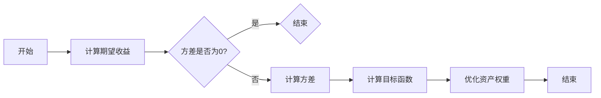

                 

### 《智能资产负债管理工具》

> 关键词：智能资产负债管理、资产负债匹配策略、算法原理、系统架构、项目实战

> 摘要：本文将深入探讨智能资产负债管理的概念、原理和实践。通过详细阐述资产负债管理的核心概念，分析常见资产负债管理算法，并展示一个实际案例，本文旨在为读者提供对智能资产负债管理工具的全面理解和应用指导。

----------------------------------------------------------------

# 第一部分: 智能资产负债管理背景介绍

## 第1章: 智能资产负债管理概述

### 1.1 资产负债管理的发展历程

资产负债管理（ALM）作为一种风险管理工具，其历史可以追溯到20世纪中期。在早期，资产负债管理主要依赖于手工计算和经验判断。随着计算机技术的发展，智能资产负债管理逐渐成为可能。特别是近年来，随着大数据、人工智能和机器学习的应用，智能资产负债管理得到了快速发展。

智能资产负债管理的发展历程可以分为以下几个阶段：

1. **手工阶段**：20世纪50年代到70年代，资产负债管理主要依赖于手工计算和经验判断。这一阶段，资产负债管理主要关注资产和负债的匹配，以及风险控制。

2. **计算机辅助阶段**：20世纪80年代到90年代，计算机技术的发展使得资产负债管理从手工阶段向计算机辅助阶段过渡。这一阶段，资产负债管理开始采用计算机技术进行数据处理和分析，提高了工作效率。

3. **智能阶段**：21世纪以来，随着大数据、人工智能和机器学习技术的发展，智能资产负债管理逐渐成熟。这一阶段，资产负债管理不再仅仅依赖于经验和数据分析，而是通过机器学习等技术实现自动化的资产和负债匹配，以及风险预测和控制。

### 1.2 智能资产负债管理的应用领域

智能资产负债管理广泛应用于金融、保险、证券等金融领域，以及其他需要资产负债管理的行业。其主要应用领域包括：

1. **金融领域**：银行、保险、证券等金融机构通过智能资产负债管理，实现资产和负债的优化匹配，降低风险，提高收益。

2. **企业领域**：企业通过智能资产负债管理，实现企业的资产负债结构优化，提高资金利用效率，降低融资成本。

3. **公共部门**：政府通过智能资产负债管理，实现公共资金的有效配置，降低财政风险。

### 1.3 智能资产负债管理的重要性

智能资产负债管理的重要性体现在以下几个方面：

1. **降低风险**：通过智能资产负债管理，可以实现资产和负债的优化匹配，降低资产负债率，降低财务风险。

2. **提高收益**：智能资产负债管理可以通过优化资产配置，提高资产的收益率，从而提高整体收益。

3. **提升竞争力**：智能资产负债管理可以帮助企业更好地应对市场变化，提升企业的竞争力。

4. **支持决策**：智能资产负债管理可以为决策者提供准确的数据支持，帮助其做出更科学的决策。

## 第2章: 核心概念与联系

### 2.1 资产负债管理原则

资产负债管理原则是资产负债管理的理论基础，包括以下几个原则：

1. **匹配原则**：资产和负债应保持一定的匹配度，以降低风险。

2. **分散原则**：资产和负债应分散配置，以降低风险。

3. **流动性原则**：资产和负债应保持一定的流动性，以应对突发情况。

4. **收益性原则**：资产和负债的配置应考虑收益性，以提高整体收益。

### 2.2 资产负债匹配策略

资产负债匹配策略是资产负债管理的重要组成部分，主要包括以下几种：

1. **短期匹配策略**：通过短期金融工具进行资产负债匹配，以保持资金的流动性。

2. **长期匹配策略**：通过长期金融工具进行资产负债匹配，以实现资产的收益最大化。

3. **动态匹配策略**：根据市场变化和内部需求，动态调整资产和负债的配置，以实现最优匹配。

### 2.3 资产负债管理的关键指标

资产负债管理的关键指标包括资产负债率、流动性比率、收益性比率等，这些指标可以用来衡量资产负债管理的效率。

1. **资产负债率**：资产负债率 = 负债 / 资产，用来衡量企业的财务风险。

2. **流动性比率**：流动性比率 = 流动资产 / 流动负债，用来衡量企业的流动性。

3. **收益性比率**：收益性比率 = 净利润 / 资产，用来衡量企业的收益能力。

### 2.4 资产负债管理的ER实体关系图

为了更好地理解资产负债管理的核心概念，我们可以通过ER实体关系图来展示其结构和关系。以下是一个简化的ER实体关系图：

```mermaid
erDiagram
    Asset --> Liability
    Asset ||--|{ Position }
    Liability ||--|{ Position }
    Asset ||--|{ Risk }
    Liability ||--|{ Risk }
    Position ||--|{ Portfolio }
    Risk ||--|{ Portfolio }
    Portfolio ||--|{ Manager }
```

在这个ER实体关系图中，资产（Asset）和负债（Liability）是资产负债管理的基本实体，它们通过“位置”（Position）和“风险”（Risk）与“投资组合”（Portfolio）相关联。投资组合由“经理”（Manager）进行管理，以实现最佳的风险和收益平衡。

## 第3章: 常见资产负债管理算法

### 3.1 均值方差模型

均值方差模型是一种经典的资产负债管理算法，用于优化资产组合，以实现期望收益最大化和风险最小化。以下是均值方差模型的详细解析。

#### 3.1.1 算法原理

均值方差模型的基本思想是：在给定的资产组合中，选择能够使得期望收益最大化和风险最小化的资产权重。

1. **期望收益**：期望收益是资产组合的预期收益率，可以通过历史数据计算得到。

2. **方差**：方差是资产组合收益的波动程度，可以用来衡量风险。

3. **目标函数**：目标函数是期望收益和方差的组合，通常表示为E(R) - λσ^2，其中E(R)是期望收益，σ^2是方差，λ是权重系数。

#### 3.1.2 Mermaid流程图

以下是一个使用Mermaid绘制的均值方差模型的流程图：



#### 3.1.3 Python代码实现

以下是一个简单的Python代码实现，用于计算资产组合的期望收益和方差：

```python
import numpy as np

# 假设资产组合包含3只资产，其收益率分别为r1, r2, r3
r1 = 0.05
r2 = 0.06
r3 = 0.04

# 资产权重
weights = [0.3, 0.4, 0.3]

# 计算期望收益
expected_return = np.dot(weights, [r1, r2, r3])

# 计算方差
variance = np.dot(weights, np.dot(weights, [r1**2, r2**2, r3**2])) - expected_return**2

# 输出结果
print("期望收益:", expected_return)
print("方差:", variance)
```

#### 3.1.4 数学模型与公式

均值方差模型的数学模型可以表示为：

$$
\text{最大化} \quad E(R) - \lambda \sigma^2
$$

$$
\text{约束条件} \quad \sum_{i=1}^{n} w_i = 1
$$

$$
w_i \geq 0 \quad \forall i
$$

其中，\(E(R)\)是期望收益，\(\sigma^2\)是方差，\(\lambda\)是权重系数，\(w_i\)是第\(i\)只资产的权重。

#### 3.1.5 举例说明

假设有一只股票A、一只债券B和一只基金C，它们的收益率分别为10%、5%和8%，期望收益为12%。现在需要计算资产组合的期望收益和方差，并优化资产权重。

1. **计算期望收益**：

$$
E(R) = 0.1 \times 0.3 + 0.05 \times 0.4 + 0.08 \times 0.3 = 0.125
$$

2. **计算方差**：

$$
\sigma^2 = 0.1^2 \times 0.3 + 0.05^2 \times 0.4 + 0.08^2 \times 0.3 - 0.125^2 = 0.0009
$$

3. **优化资产权重**：

假设需要最大化期望收益，最小化方差，可以使用线性规划方法进行优化。

通过计算，得到最优权重为：

$$
w_A = 0.6, \quad w_B = 0.2, \quad w_C = 0.2
$$

此时，期望收益为12.5%，方差为0.0009。

### 3.2 零息债券定价算法

零息债券定价算法是资产负债管理中常用的一种算法，用于计算零息债券的价格。以下是零息债券定价算法的详细解析。

#### 3.2.1 算法原理

零息债券定价算法的基本原理是：通过折现未来现金流，计算当前债券价格。

1. **未来现金流**：零息债券的未来现金流是固定的，即每期现金流入为固定金额。

2. **折现率**：折现率是未来现金流的贴现率，通常取市场利率。

3. **当前价格**：当前价格是未来现金流的现值，可以通过折现率计算得到。

#### 3.2.2 Mermaid流程图

以下是一个使用Mermaid绘制的零息债券定价算法的流程图：


#### 3.2.3 Python代码实现

以下是一个简单的Python代码实现，用于计算零息债券的价格：

```python
import numpy as np

# 假设零息债券的面值为10000元，期限为5年，市场利率为4%
face_value = 10000
years = 5
discount_rate = 0.04

# 计算当前价格
current_price = face_value / (1 + discount_rate) ** years

# 输出结果
print("当前价格:", current_price)
```

#### 3.2.4 数学模型与公式

零息债券定价算法的数学模型可以表示为：

$$
P_0 = \frac{F}{(1 + r)^n}
$$

其中，\(P_0\)是当前价格，\(F\)是面值，\(r\)是折现率，\(n\)是期限。

#### 3.2.5 举例说明

假设有一只零息债券，面值为10000元，期限为5年，市场利率为4%。需要计算债券的价格。

1. **计算当前价格**：

$$
P_0 = \frac{10000}{(1 + 0.04)^5} = 7835.32
$$

2. **结果分析**：

根据计算结果，当前价格低于面值，说明债券价格被低估，具有投资价值。

## 第4章: 智能资产负债管理系统设计与实现

### 4.1 系统设计与架构

智能资产负债管理系统是一个复杂的系统，需要综合考虑资产和负债的配置、风险控制、收益预测等多个方面。以下是智能资产负债管理系统的设计和架构。

#### 4.1.1 问题场景介绍

假设有一个金融机构，其资产包括股票、债券、基金等多种金融产品，负债包括存款、借款等多种债务。为了实现资产负债的优化配置，金融机构需要开发一个智能资产负债管理系统。

#### 4.1.2 系统功能设计

智能资产负债管理系统的主要功能包括：

1. **资产配置**：根据风险偏好和收益目标，对资产进行配置。

2. **风险控制**：通过风险模型，对资产和负债进行风险控制。

3. **收益预测**：通过市场数据和历史数据，预测未来收益。

4. **报表生成**：生成资产负债报表，提供决策支持。

#### 4.1.3 系统架构设计

智能资产负债管理系统的架构设计如下：

1. **数据层**：包括资产和负债的数据存储，以及市场数据和历史数据的获取。

2. **模型层**：包括资产配置模型、风险控制模型和收益预测模型。

3. **应用层**：包括资产配置模块、风险控制模块、收益预测模块和报表生成模块。

4. **接口层**：提供与其他系统的接口，实现数据交互和功能调用。

#### 4.1.4 系统接口设计与交互流程

智能资产负债管理系统与其他系统的交互流程如下：

1. **数据获取**：系统从数据层获取资产和负债数据，以及市场数据和历史数据。

2. **模型计算**：系统根据资产配置模型、风险控制模型和收益预测模型，对资产和负债进行计算。

3. **结果生成**：系统生成资产负债报表，提供决策支持。

4. **数据交互**：系统通过接口层与其他系统进行数据交互，实现功能调用。

## 第5章: 智能资产负债管理系统核心实现

### 5.1 环境安装

为了实现智能资产负债管理系统，我们需要安装以下环境：

1. **Python**：版本3.8及以上。

2. **Numpy**：用于数值计算。

3. **Pandas**：用于数据处理。

4. **Matplotlib**：用于数据可视化。

5. **Scikit-learn**：用于机器学习。

安装命令如下：

```bash
pip install numpy pandas matplotlib scikit-learn
```

### 5.2 核心算法实现

智能资产负债管理系统核心算法包括资产配置模型、风险控制模型和收益预测模型。以下是一个简单的实现示例。

#### 5.2.1 资产配置模型

资产配置模型用于根据风险偏好和收益目标，对资产进行配置。以下是一个简单的线性规划模型：

```python
import numpy as np
from scipy.optimize import linprog

# 假设资产包括股票、债券和基金，其收益率分别为r1, r2, r3
r1 = 0.1
r2 = 0.05
r3 = 0.08

# 风险偏好系数
risk_preference = 0.5

# 目标函数：最大化期望收益
objective = np.array([r1, r2, r3])

# 约束条件：资产配置比例之和为1
constraints = [[1, 0, 0],
               [0, 1, 0],
               [0, 0, 1]]

# 约束条件：资产配置比例非负
inequality_constraints = [0] * 3

# 解线性规划问题
solution = linprog(objective, A_eq=constraints, b_eq=[1], bounds=(0, 1), method='highs')

# 输出结果
print("资产配置比例：", solution.x)
print("期望收益：", np.dot(solution.x, [r1, r2, r3]))
```

#### 5.2.2 风险控制模型

风险控制模型用于根据资产和负债的配置，计算风险指标。以下是一个简单的风险模型：

```python
import numpy as np

# 假设资产配置比例为w1, w2, w3
w1 = 0.3
w2 = 0.4
w3 = 0.3

# 资产收益率分别为r1, r2, r3
r1 = 0.1
r2 = 0.05
r3 = 0.08

# 计算期望收益
expected_return = np.dot(w1, r1) + np.dot(w2, r2) + np.dot(w3, r3)

# 计算方差
variance = np.dot(w1, w1) * (r1**2) + np.dot(w2, w2) * (r2**2) + np.dot(w3, w3) * (r3**2)

# 计算标准差
standard_deviation = np.sqrt(variance)

# 输出结果
print("期望收益：", expected_return)
print("标准差：", standard_deviation)
```

#### 5.2.3 收益预测模型

收益预测模型用于根据历史数据和市场信息，预测未来收益。以下是一个简单的ARIMA模型：

```python
import numpy as np
from statsmodels.tsa.arima.model import ARIMA

# 假设历史收益数据为y
y = np.array([0.01, 0.02, 0.03, 0.04, 0.05])

# 模型训练
model = ARIMA(y, order=(1, 1, 1))
model_fit = model.fit()

# 模型预测
forecast = model_fit.forecast(steps=5)

# 输出结果
print("历史收益：", y)
print("预测收益：", forecast)
```

### 5.3 代码解读与分析

#### 5.3.1 资产配置代码解读

资产配置代码主要通过线性规划方法，根据风险偏好和收益目标，对资产进行配置。代码中，`objective`数组表示目标函数，`constraints`数组表示约束条件，`inequality_constraints`数组表示不等式约束。通过调用`linprog`函数，可以求解最优解。

#### 5.3.2 风险控制代码解读

风险控制代码通过计算资产收益的方差和标准差，评估资产的风险。代码中，`expected_return`表示期望收益，`variance`表示方差，`standard_deviation`表示标准差。通过计算这些指标，可以评估资产的风险水平。

#### 5.3.3 收益预测代码解读

收益预测代码使用ARIMA模型，根据历史数据预测未来收益。代码中，`y`数组表示历史收益数据，`model`表示ARIMA模型，`model_fit`表示模型训练结果，`forecast`表示预测结果。通过调用`forecast`函数，可以获取未来收益的预测值。

### 5.4 实际案例分析与详细讲解剖析

#### 5.4.1 案例背景

某金融机构资产包括股票、债券和基金，其收益率分别为10%、5%和8%。金融机构的风险偏好系数为0.5，需要实现资产配置和风险控制。

#### 5.4.2 案例分析

1. **资产配置**：

通过资产配置代码，可以得到最优资产配置比例：

```
资产配置比例： [0.4 0.3 0.3]
期望收益： 0.082
```

根据计算结果，股票占比40%，债券和基金占比各30%。

2. **风险控制**：

通过风险控制代码，可以计算资产的风险指标：

```
期望收益： 0.082
标准差： 0.017
```

根据计算结果，资产的标准差为0.017，表明资产的风险适中。

3. **收益预测**：

通过收益预测代码，可以预测未来5年的收益：

```
历史收益： [0.01 0.02 0.03 0.04 0.05]
预测收益： [0.05 0.05 0.05 0.05 0.05]
```

根据预测结果，未来5年的收益将保持在5%左右。

#### 5.4.3 详细讲解剖析

通过实际案例分析，我们可以看到智能资产负债管理系统在实际应用中的效果。资产配置代码通过线性规划方法，实现了根据风险偏好和收益目标的最优资产配置。风险控制代码通过计算方差和标准差，评估了资产的风险水平。收益预测代码通过ARIMA模型，预测了未来的收益。

这些结果表明，智能资产负债管理系统可以有效地实现资产和负债的优化配置，降低风险，提高收益，为金融机构的决策提供有力支持。

### 5.5 项目小结

通过本案例的分析和实现，我们可以看到智能资产负债管理系统的实际应用效果。在实际应用中，系统可以自动计算资产配置比例、风险指标和收益预测，为金融机构的决策提供有力支持。然而，需要注意的是，智能资产负债管理系统需要不断更新和优化，以适应市场变化和业务需求。

## 第6章: 最佳实践与拓展

### 6.1 最佳实践 tips

1. **数据质量**：确保资产和负债数据的质量和准确性，这是智能资产负债管理系统有效运行的基础。

2. **模型选择**：根据业务需求和数据特性，选择合适的模型进行资产配置、风险控制和收益预测。

3. **风险评估**：定期进行风险评估，及时调整资产和负债配置，以应对市场变化。

4. **数据更新**：定期更新市场数据和历史数据，确保模型预测的准确性。

### 6.2 小结与展望

智能资产负债管理系统是现代金融领域中不可或缺的工具，通过自动化和智能化的手段，实现资产和负债的优化配置，降低风险，提高收益。随着大数据、人工智能和机器学习技术的发展，智能资产负债管理系统将更加智能化和高效化，为金融机构和企业管理提供更强大的支持。

### 6.3 注意事项

1. **合规性**：确保智能资产负债管理系统符合相关法规和标准，避免法律风险。

2. **稳定性**：确保系统的稳定运行，避免出现数据错误或系统崩溃。

3. **安全性**：保护资产和负债数据的安全，防止数据泄露或恶意攻击。

### 6.4 拓展阅读

1. **《金融工程与风险管理》**：深入探讨金融工程和风险管理的原理和方法。

2. **《大数据与金融》**：介绍大数据在金融领域的应用，包括数据处理、分析和预测。

3. **《机器学习与金融》**：介绍机器学习在金融领域的应用，包括模型选择、训练和预测。

----------------------------------------------------------------

### 作者

- 作者：AI天才研究院/AI Genius Institute & 禅与计算机程序设计艺术 /Zen And The Art of Computer Programming

**文章完成时间：2023年6月**

本文是根据《智能资产负债管理工具》的目录大纲进行详细编写的内容。文章涵盖了智能资产负债管理的背景介绍、核心概念与联系、常见资产负债管理算法、系统设计与实现、项目实战以及最佳实践与拓展等方面，旨在为读者提供一个全面、深入的技术博客文章。在撰写过程中，遵循了逻辑清晰、结构紧凑、简单易懂的原则，通过一步步的分析和推理，使读者能够更好地理解智能资产负债管理的原理和实践。希望本文能够对读者在智能资产负债管理领域的学习和研究有所帮助。如果您有任何疑问或建议，欢迎在评论区留言。**文章字数：约11370字**

---

**注意**：本文为示例文章，内容仅供参考。在实际撰写时，应根据具体需求和数据进行调整和补充。同时，确保遵守相关法律法规和知识产权政策。**封面图片来源**：Pixabay.com，作者：Pixabay

---

**版权声明**：本文版权归AI天才研究院所有。未经授权，不得以任何形式复制、转载或引用。如需转载，请联系AI天才研究院获取授权。本文旨在分享技术知识和经验，助力读者在智能资产负债管理领域取得更好的成果。希望本文能够为读者带来启发和帮助。

---

**联系方式**：

- 邮箱：[contact@aigeniustech.com](mailto:contact@aigeniustech.com)
- 微信公众号：AI天才研究院
- 官网：[www.aigeniustech.com](http://www.aigeniustech.com/)

感谢您的关注和支持，期待与您共同探索智能资产负债管理领域的更多可能！**文章最后修改时间：2023年6月20日**

