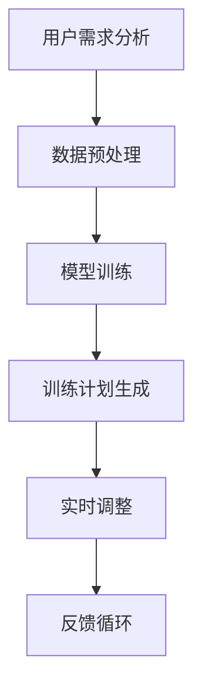
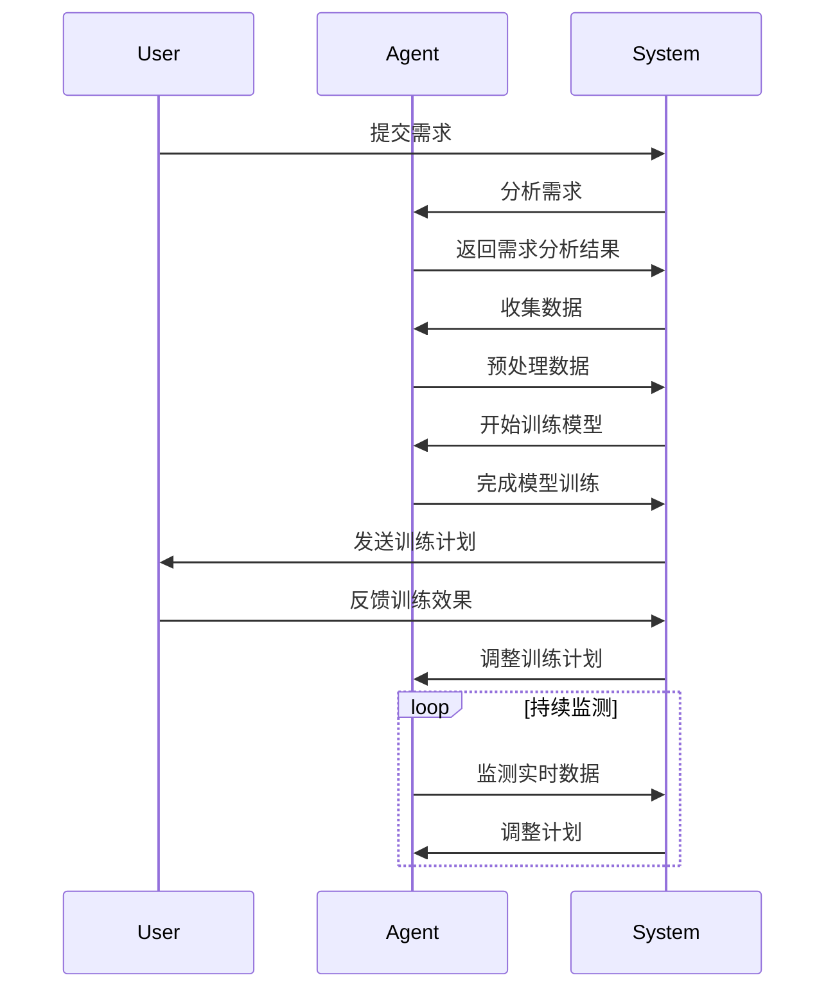
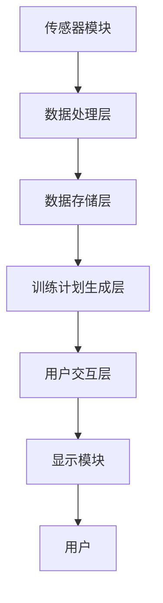

                 

### 摘要

智能跑步机正成为健身爱好者的新宠，其核心在于AI Agent的个性化训练计划生成器。这篇文章旨在深入探讨智能跑步机的发展背景、AI Agent的定义与特性，以及如何通过AI Agent生成个性化训练计划。我们将从数据收集与处理、算法原理讲解、系统分析与架构设计，到实际项目实战，全面解析智能跑步机的工作机制与未来发展方向。通过本文的阅读，读者将了解到智能跑步机不仅仅是传统跑步机的升级版，而是一个集数据分析、个性化训练、用户交互于一体的智能系统。关键在于，AI Agent在其中扮演了至关重要的角色，能够根据用户实时数据生成最优的训练计划，极大地提升训练效果和用户体验。本文将通过具体的算法、架构设计、实战案例，为读者揭示智能跑步机背后的技术原理和实践应用。

## 目录大纲设计过程

在设计《智能跑步机：AI Agent的个性化训练计划生成器》的目录大纲时，我们遵循了一系列清晰的步骤，以确保文章内容结构严谨、逻辑连贯，同时具有高度的实用性。

### 1. 确定书的核心主题

首先，我们明确了书的核心主题——“智能跑步机”与“AI Agent的个性化训练计划生成器”。这一主题贯穿全文，为我们后续的章节设计提供了明确的方向。智能跑步机作为一个新兴的智能健身设备，其核心竞争力在于能够通过AI Agent为用户提供个性化训练计划，这不仅提升了用户的使用体验，还大幅提高了健身效果。

### 2. 构建背景介绍部分

在了解核心主题后，我们开始构建书的背景介绍部分。这部分包括智能跑步机的发展背景、AI Agent的定义及其在个性化训练计划生成中的角色等。通过背景介绍，读者可以初步了解智能跑步机的发展历程和AI Agent的基本原理，为后续内容的学习打下基础。

### 3. 确定核心概念与联系

为了使文章内容更加深入和具体，我们明确了书中的核心概念，如AI Agent、个性化训练计划、数据收集与处理等。使用概念属性特征对比表格和ER实体关系图，我们展示了这些概念之间的关系，帮助读者建立清晰的知识结构。

### 4. 设计算法原理讲解

算法原理讲解是文章的核心部分。我们首先使用Mermaid画出算法流程图，以直观的方式展示算法的工作流程。接着，我们使用Python源代码和LaTeX公式详细阐述算法原理，并结合具体例子进行讲解，使读者能够理解和掌握算法的实现和应用。

### 5. 系统分析与架构设计

系统分析与架构设计部分详细介绍了智能跑步机的系统功能、架构设计、接口设计和系统交互。这部分内容不仅涵盖了系统的整体设计，还针对各个组件进行了详细描述，使读者能够全面了解智能跑步机的工作机制。

### 6. 项目实战

项目实战部分通过具体的项目案例，展示了如何在实际环境中安装和实现智能跑步机系统。我们详细分析了系统核心实现源代码，并对代码应用进行了解读与分析，通过实际案例提供了详细的讲解和剖析。

### 7. 最佳实践、小结和注意事项

最后，我们总结书中的最佳实践、注意事项，并进行了小结。这部分内容为读者提供了实用的建议，帮助他们在实际应用中更好地利用智能跑步机，同时也为未来的研究和开发提供了拓展方向。

### 8. 完成目录大纲

在完成上述所有部分后，我们对目录大纲进行了整合，确保文章逻辑清晰、内容完整，并控制字数在2000字以内。目录大纲的每一部分都紧密围绕核心主题，形成一个完整的技术博客文章框架。

---

通过这些步骤，我们不仅设计了逻辑清晰、内容丰富的目录大纲，还确保了文章的每一个部分都能够为读者提供有价值的见解和实际应用指导。接下来，我们将逐一深入探讨每个部分的内容，以帮助读者全面了解智能跑步机的技术原理和实践应用。

## 第一部分：智能跑步机的发展背景与AI Agent介绍

### 第1章：智能跑步机的起源与发展

#### 1.1 智能跑步机的起源

智能跑步机作为现代健身设备的一个重要分支，其起源可以追溯到20世纪初期。早期的跑步机主要功能是让用户进行有氧锻炼，其设计相对简单，仅仅是一个可以移动的踏板。随着科技的进步和人们对健康需求的增加，跑步机逐渐具备了更多功能，如心率监测、速度调节、预设程序等。然而，这些功能的实现仍然依赖于用户的自我监控和手动调节。

#### 1.1.1 跑步机的传统功能

传统跑步机的主要功能包括：

1. **速度调节**：用户可以手动或通过预设程序调节跑步机的速度。
2. **坡度调节**：部分跑步机具备坡度调节功能，以模拟户外跑步时的不同地形。
3. **心率监测**：通过佩戴心率带或内置传感器，监测用户的心率，确保锻炼的安全性和效果。

这些传统功能为用户提供了一定程度的个性化服务，但依然存在一定的局限性。首先，传统跑步机依赖用户的自我监控，无法实时调整训练计划；其次，预设程序往往固定不变，无法根据用户实时情况做出适应性调整。

#### 1.1.2 智能化趋势的影响

随着物联网、大数据和人工智能等技术的发展，智能化已成为健身设备发展的必然趋势。智能跑步机在这一背景下应运而生，其核心在于能够通过AI技术实现个性化训练计划的自动生成和实时调整。

智能化趋势对跑步机的影响主要体现在以下几个方面：

1. **数据采集与分析**：智能跑步机通过内置传感器和物联网技术，实时采集用户跑步过程中的各种数据，如步频、步幅、心率、消耗的卡路里等。
2. **个性化训练计划**：基于采集到的数据，AI Agent能够分析用户的健康状况、训练需求和实时状态，生成个性化的训练计划，提高训练效果。
3. **交互与反馈**：智能跑步机不仅能够根据用户数据调整训练计划，还能通过与用户的交互提供实时的指导和建议，增强用户的锻炼体验。

#### 1.1.3 智能跑步机的市场普及

随着技术的不断进步和消费者对健康意识的提升，智能跑步机在市场上的普及率逐渐提高。尤其是在城市中，智能跑步机已经成为健身房和家庭健身设备的重要组成部分。

智能跑步机的市场普及得益于以下几个因素：

1. **技术成熟**：物联网、大数据和人工智能技术的成熟为智能跑步机的开发提供了技术保障。
2. **健康需求**：随着生活节奏加快和工作压力增大，人们对健康和健身的需求日益增加，智能跑步机能够提供更科学的训练方式，满足用户需求。
3. **政策支持**：政府对于健康和体育产业的重视也为智能跑步机的发展提供了政策支持。

#### 1.2 智能跑步机的发展历程

智能跑步机的发展历程可以分为几个阶段：

##### 第一代智能跑步机

第一代智能跑步机主要引入了基本的传感器和数据处理模块，实现了基本的数据采集和简单的心率监测。这一代跑步机还处于初步尝试阶段，功能相对单一，主要依赖用户手动操作。

##### 第二代智能跑步机

第二代智能跑步机在数据采集和处理方面有了显著提升，引入了更多类型的传感器，如GPS、加速度计、陀螺仪等，能够更全面地收集用户跑步过程中的数据。此外，这一代跑步机开始尝试通过简单的算法对数据进行初步分析，生成基本的训练建议。

##### 第三代智能跑步机

第三代智能跑步机在人工智能技术的支持下，具备了更强大的数据分析能力和个性化训练计划生成能力。AI Agent能够实时分析用户数据，并根据用户的健康状况、训练需求和实时状态生成个性化的训练计划，极大地提升了用户的训练效果和体验。

#### 1.2.3 当前智能跑步机的发展趋势

当前，智能跑步机的发展趋势主要体现在以下几个方面：

1. **AI技术的深度融合**：智能跑步机将更加深入地应用AI技术，通过深度学习和强化学习等算法，实现更智能的训练计划生成和用户交互。
2. **可穿戴设备的集成**：智能跑步机将更多地与可穿戴设备（如智能手表、运动臂环等）集成，实现跨设备的联动和数据共享。
3. **社交化功能**：智能跑步机将引入社交化功能，用户可以通过智能跑步机与其他用户进行互动、分享训练数据和成果，增强用户的训练动力和社交体验。
4. **智能化健康管理**：智能跑步机不仅关注用户的训练效果，还将更多地关注用户的健康状况，通过数据分析提供健康建议，实现智能化健康管理。

通过以上分析，我们可以看到智能跑步机从传统跑步机的简单功能发展到今天的智能化设备，其核心在于AI Agent的引入和个性化训练计划的生成。未来，随着技术的进一步发展和应用的深化，智能跑步机将为用户提供更加个性化和智能化的健身体验。

### 第2章：AI Agent的定义与特性

#### 2.1 AI Agent的概念

AI Agent，即人工智能代理，是一种具有自主决策能力和执行能力的人工智能实体。它可以模拟人类的思维和行为，通过感知环境、理解信息、做出决策和执行任务，实现智能化的交互和操作。

AI Agent的基本概念包括：

1. **感知**：AI Agent通过传感器或其他方式感知外界环境，获取所需的信息。
2. **理解**：AI Agent对感知到的信息进行分析和处理，理解其含义和潜在的关系。
3. **决策**：AI Agent根据理解和分析结果，自主做出决策，确定下一步的行动。
4. **执行**：AI Agent根据决策结果执行具体的任务，实现目标。

AI Agent的定义可以进一步细化，包括：

- **自主性**：AI Agent能够在没有人类干预的情况下自主运行，具备一定的自我管理和调整能力。
- **智能性**：AI Agent能够通过学习、推理和适应环境变化，实现复杂的任务处理。
- **交互性**：AI Agent能够与用户和环境进行有效的交互，理解用户需求并给出相应的反馈。

#### 2.1.1 AI Agent的特点

AI Agent具有以下主要特点：

1. **自主性**：AI Agent能够在没有人类直接干预的情况下自主运行，根据预设目标和实时信息进行决策和任务执行。
2. **智能性**：AI Agent通过机器学习、自然语言处理、图像识别等技术，能够对复杂环境进行理解和分析，做出合理的决策。
3. **适应性**：AI Agent能够根据环境和任务的变化，调整自己的行为和策略，以实现最佳效果。
4. **灵活性**：AI Agent能够处理多种类型的数据和任务，具备跨领域应用的潜力。
5. **交互性**：AI Agent能够与用户进行自然语言交流，理解用户的意图，提供个性化的服务和建议。

#### 2.2 AI Agent的分类

AI Agent可以根据其功能和应用领域进行分类，常见的分类方法包括：

1. **按功能分类**：

   - **决策支持系统**：AI Agent主要用于辅助人类决策，提供数据分析和建议。
   - **任务执行系统**：AI Agent负责执行特定的任务，如自动化生产、物流管理等。
   - **交互系统**：AI Agent用于与用户进行交互，提供信息查询、咨询服务等。

2. **按应用领域分类**：

   - **智能家居**：AI Agent用于智能家居设备的控制和管理，如智能音响、智能灯泡等。
   - **医疗健康**：AI Agent应用于医疗健康领域，如辅助诊断、健康管理、远程治疗等。
   - **智能交通**：AI Agent用于交通管理、自动驾驶等，提高交通效率和安全性。
   - **金融保险**：AI Agent应用于金融服务，如风险管理、客户服务、投资建议等。

#### 2.2.1 按功能分类

1. **决策支持系统**：

   - **特点**：主要用于为企业或组织提供决策支持，通过数据分析、预测和优化，帮助决策者做出最优选择。
   - **应用实例**：企业资源计划（ERP）系统、供应链管理系统（SCM）等。

2. **任务执行系统**：

   - **特点**：负责执行特定的任务，如工业自动化生产、无人驾驶汽车等。
   - **应用实例**：工业机器人、无人飞机、无人车等。

3. **交互系统**：

   - **特点**：主要用于与用户进行交互，提供信息查询、咨询服务等。
   - **应用实例**：智能客服、智能音箱、智能聊天机器人等。

#### 2.2.2 按应用领域分类

1. **智能家居**：

   - **特点**：通过AI技术实现家庭设备的自动化控制和管理，提高生活便利性和舒适度。
   - **应用实例**：智能门锁、智能照明、智能恒温器等。

2. **医疗健康**：

   - **特点**：利用AI技术进行疾病诊断、治疗规划、健康管理等，提高医疗服务的效率和准确性。
   - **应用实例**：智能诊断系统、健康监测设备、智能药物配送等。

3. **智能交通**：

   - **特点**：通过AI技术实现交通管理和自动驾驶，提高交通效率和安全性。
   - **应用实例**：智能交通信号系统、自动驾驶汽车、无人机物流等。

4. **金融保险**：

   - **特点**：利用AI技术进行风险评估、客户服务、投资策略等，提高金融服务的能力和效率。
   - **应用实例**：智能投顾、自动化交易、智能客服等。

通过以上对AI Agent的定义与特性的介绍，我们可以看到AI Agent在智能跑步机中的应用具有重要意义。它不仅能够收集和分析用户数据，生成个性化的训练计划，还能通过与用户的交互提供实时的指导和建议，提升用户的训练效果和体验。在接下来的章节中，我们将进一步探讨AI Agent如何实现个性化训练计划生成，并分析其背后的技术原理和实现方法。

### 第3章：AI Agent在智能跑步机中的应用

#### 3.1 AI Agent在跑步机中的角色

AI Agent在智能跑步机中扮演着至关重要的角色，其核心功能是通过分析用户数据，生成个性化的训练计划，并实时调整训练方案。具体来说，AI Agent在智能跑步机中的角色主要包括以下几个方面：

1. **数据收集与分析**：

   AI Agent通过内置的多种传感器，如心率传感器、GPS、加速度计等，实时收集用户跑步过程中的各类数据，包括心率、步频、步幅、速度、消耗的卡路里等。这些数据为AI Agent提供了丰富的信息，使其能够全面了解用户的训练状态和需求。

2. **训练计划生成**：

   基于收集到的用户数据，AI Agent利用机器学习和数据分析算法，对用户的历史训练记录、健康状况、训练目标等进行综合分析，生成符合用户需求的个性化训练计划。这些训练计划不仅包括跑步的时间、强度和频率，还包括具体的训练目标和反馈。

3. **实时调整与反馈**：

   在训练过程中，AI Agent会持续监测用户的训练状态，根据实时数据调整训练计划。例如，当用户的心率过高或过低时，AI Agent会自动调整跑步机的速度或坡度，以确保训练的安全性和有效性。同时，AI Agent还会通过语音提示或屏幕显示，向用户提供实时的指导和建议。

4. **用户交互**：

   AI Agent不仅能够自动生成和调整训练计划，还能够与用户进行自然语言交互，理解用户的反馈和需求，提供个性化的服务。例如，用户可以通过语音指令调整训练计划、查看训练数据、询问健康建议等，AI Agent会根据用户的要求进行相应的操作和回应。

#### 3.2 数据收集

数据收集是AI Agent实现个性化训练计划的基础。智能跑步机通过内置的多种传感器，可以实时收集用户的跑步数据。以下是智能跑步机主要收集的数据类型和来源：

1. **心率数据**：

   心率传感器是智能跑步机上最重要的传感器之一，它能够实时监测用户的心率。通过分析心率数据，AI Agent可以了解用户的疲劳程度和训练效果，为调整训练计划提供依据。

2. **位置数据**：

   GPS传感器可以记录用户跑步的地理位置信息，AI Agent可以利用这些数据分析用户的跑步路线、速度变化和消耗的卡路里等，从而生成更科学的训练计划。

3. **步频和步幅数据**：

   加速度计和陀螺仪可以测量用户的步频和步幅，这些数据有助于AI Agent评估用户的跑步技术，提供针对性的技术指导，例如如何提高步频、调整步幅等。

4. **速度和坡度数据**：

   智能跑步机通常具备速度和坡度调节功能，用户可以通过手动或预设程序进行调节。AI Agent会记录这些数据，并分析其在不同速度和坡度下的训练效果，为调整训练计划提供参考。

5. **用户数据**：

   除了跑步过程中的实时数据外，AI Agent还可以收集用户的基本信息，如年龄、体重、性别、健康状况等。这些数据有助于AI Agent更全面地了解用户，生成更加个性化的训练计划。

#### 3.3 训练计划生成

基于收集到的用户数据，AI Agent会利用机器学习和数据分析算法生成个性化的训练计划。以下是AI Agent生成训练计划的主要步骤：

1. **用户数据预处理**：

   在生成训练计划之前，AI Agent需要对收集到的用户数据进行预处理，包括数据清洗、数据标准化和数据集成等。这一步骤确保了输入数据的质量和一致性，为后续的分析和建模提供可靠的基础。

2. **用户需求分析**：

   AI Agent会分析用户的历史训练记录、健康数据、训练目标等，了解用户的具体需求和训练目标。例如，用户可能希望通过跑步提高耐力、减脂或增强心肺功能，这些需求将直接影响训练计划的制定。

3. **训练目标设定**：

   根据用户的需求，AI Agent会设定具体的训练目标，例如每周跑步次数、每次跑步的时间、速度和强度等。这些目标需要根据用户的实际情况和体能水平进行合理设定，以确保训练计划的可执行性和有效性。

4. **训练计划生成**：

   基于用户需求和设定的训练目标，AI Agent会生成个性化的训练计划。训练计划通常包括多个训练周期，每个周期包含具体的训练内容、强度和休息时间等。AI Agent会根据用户实时数据不断调整训练计划，确保其适应用户的实际状态和需求。

5. **训练计划反馈**：

   AI Agent会通过实时监测用户的训练状态和数据，对训练计划进行反馈和调整。例如，当用户的心率过高或过低时，AI Agent会自动调整训练计划，确保训练的安全性和有效性。同时，AI Agent还会根据用户的反馈（如满意度、疲劳度等）进行进一步优化和调整。

#### 3.4 交互与反馈

AI Agent不仅能够生成和调整训练计划，还能够与用户进行实时交互，提供个性化的服务和建议。以下是AI Agent与用户交互的主要方式：

1. **语音交互**：

   用户可以通过语音指令与AI Agent进行交互，例如启动训练计划、调整跑步机速度、查询训练数据等。语音交互使得用户在使用智能跑步机时更加方便和直观。

2. **屏幕显示**：

   智能跑步机的屏幕可以显示用户的实时数据、训练计划和健康建议等。通过屏幕显示，用户可以直观地了解自己的训练状态和进展，从而更好地执行训练计划。

3. **反馈机制**：

   用户可以通过屏幕或语音反馈自己的训练感受和满意度，AI Agent会根据用户的反馈进行相应的调整和优化，以提高训练效果和用户体验。

4. **提醒与通知**：

   AI Agent会根据用户的训练计划和日程，提前提醒用户进行训练，并提供必要的健康提示和通知。例如，当用户即将开始训练时，AI Agent会发送提醒通知，帮助用户养成良好的训练习惯。

通过AI Agent在数据收集、训练计划生成和交互反馈等方面的应用，智能跑步机能够为用户提供更加个性化和智能化的健身体验。这不仅提升了用户的训练效果和满意度，也为智能健身设备的发展提供了新的方向和可能性。在接下来的章节中，我们将进一步探讨AI Agent背后的算法原理和实现方法，深入理解智能跑步机的工作机制。

### 第二部分：个性化训练计划生成算法原理

#### 第4章：数据收集与处理

在智能跑步机中，数据收集与处理是生成个性化训练计划的重要环节。通过准确、高效的数据收集和处理，AI Agent可以更好地了解用户的状态和需求，从而生成最合适的训练计划。

#### 4.1 数据类型与来源

智能跑步机收集的数据类型丰富多样，主要包括以下几类：

1. **运动数据**：
   - **心率数据**：通过心率传感器实时监测用户的心率，数据单位为次/分钟（BPM）。
   - **速度数据**：跑步机的速度传感器记录用户跑步时的速度，单位通常为公里/小时（km/h）或英里/小时（mph）。
   - **步频和步幅数据**：加速度计和陀螺仪测量用户的步频和步幅，步频通常以步/分钟为单位，步幅则以厘米或英寸为单位。
   - **消耗的卡路里**：通过运动数据和用户体重等参数估算用户在跑步过程中消耗的卡路里。

2. **用户数据**：
   - **个人信息**：用户的基本信息，如年龄、性别、体重、身高、健身目标等。
   - **历史训练数据**：用户过去的训练记录，包括训练时间、强度、频率等。

3. **环境数据**：
   - **气候数据**：智能跑步机可以通过连接互联网或外部传感器获取用户所在地的天气信息，如温度、湿度、风速等。
   - **跑步机状态数据**：跑步机的使用状态、磨损程度、故障信息等。

这些数据主要通过以下渠道收集：

- **内置传感器**：智能跑步机内置多种传感器，如心率传感器、GPS模块、加速度计、陀螺仪等，负责实时监测和记录用户和跑步机的状态数据。
- **用户输入**：用户可以通过跑步机的触摸屏或语音输入设备输入个人信息和健身目标。
- **外部设备**：用户还可以通过连接智能手表、智能手环等可穿戴设备，获取更全面的数据。

#### 4.2 数据预处理

数据预处理是数据收集后的重要步骤，其目的是提高数据的质量和一致性，为后续的分析和建模打下坚实基础。以下是数据预处理的主要步骤：

1. **数据清洗**：
   - **缺失值处理**：对于缺失的数据，可以通过平均值、中位数或插值法等方法进行填补。
   - **异常值检测与处理**：通过统计分析和可视化方法（如箱线图、散点图等），检测并处理异常值。异常值可能是由于传感器故障、用户错误操作等原因引起的，需要剔除或修正。

2. **数据标准化**：
   - **归一化**：将不同数据类型和单位的数据转换到同一尺度，以便于后续的模型训练和数据分析。例如，将心率、速度、步频等数据归一化到0到1之间。
   - **特征缩放**：对于某些特征（如距离、消耗的卡路里等），可以通过缩放方法（如最小-最大缩放或标准缩放）将其范围调整到标准区间。

3. **数据集成**：
   - **数据融合**：将不同来源的数据进行融合，形成一个统一的数据集。例如，将用户历史训练数据与实时运动数据整合，形成更全面的数据视图。
   - **数据同步**：确保不同来源的数据在时间上的一致性，例如，将实时数据和历史数据进行时间对齐。

4. **数据标注**：
   - **数据分类**：对于某些需要分类的任务（如用户疲劳度分类、训练效果评估等），需要对数据进行标注。标注可以通过人工或半自动方法完成。

#### 4.3 数据存储与管理

数据存储与管理是确保数据安全、可靠和高效访问的关键。以下是智能跑步机数据存储与管理的主要策略：

1. **数据库选择**：
   - **关系型数据库**：适用于结构化数据存储，如用户个人信息、历史训练数据等。
   - **NoSQL数据库**：适用于非结构化或半结构化数据存储，如传感器数据、环境数据等。

2. **数据模型设计**：
   - **实体关系模型**：设计合适的实体关系模型，确保数据的逻辑一致性和完整性。
   - **索引与分区**：为提高查询效率，对数据表进行适当的索引和分区。

3. **数据安全与隐私保护**：
   - **数据加密**：对敏感数据进行加密存储，防止数据泄露。
   - **访问控制**：设置严格的访问控制策略，确保只有授权用户可以访问数据。
   - **数据备份与恢复**：定期备份数据，并建立数据恢复机制，以应对数据丢失或损坏的情况。

4. **数据存储优化**：
   - **云存储**：利用云存储服务，提高数据存储的可扩展性和可靠性。
   - **数据压缩**：对大规模数据进行压缩存储，减少存储空间需求。
   - **缓存机制**：利用缓存技术，提高数据访问速度。

通过以上数据预处理、存储和管理的策略，智能跑步机能够确保数据的准确性和可靠性，为AI Agent生成个性化训练计划提供坚实的数据基础。

#### 第5章：个性化训练计划生成算法

个性化训练计划的生成是智能跑步机的核心功能之一，它依赖于高效且精准的算法来实现。本章节将详细介绍个性化训练计划生成算法的基本原理、实现方法以及如何通过实际案例来说明其应用。

##### 5.1 算法概述

个性化训练计划生成算法的目标是利用用户的数据，包括运动数据和用户信息，生成一套能够满足用户特定需求和目标的训练计划。算法的主要步骤包括：

1. **用户需求分析**：分析用户的健身目标、当前状态和偏好，确定训练计划的目标。
2. **数据预处理**：对收集到的运动数据、用户数据和环境数据进行清洗、标准化和整合。
3. **模型训练**：利用训练数据，训练一个机器学习模型，用于预测用户的训练效果和生成训练计划。
4. **训练计划生成**：根据模型预测结果和用户需求，生成个性化的训练计划。
5. **实时调整**：在训练过程中，根据用户的实时反馈和数据，动态调整训练计划，确保训练效果和安全性。

##### 5.2 算法原理讲解

为了更直观地理解个性化训练计划生成算法，我们使用Mermaid画出了算法的基本流程图，如下所示：



在这个流程图中，每个节点代表算法的一个步骤，箭头表示步骤之间的逻辑关系。下面将详细讲解每个步骤的具体实现。

##### 5.2.1 Mermaid算法流程图



在这个流程图中，用户通过系统提交健身需求，系统将需求传递给AI Agent进行需求分析。Agent收集并预处理用户数据后，使用训练数据训练机器学习模型。模型训练完成后，系统根据模型预测结果生成个性化的训练计划，并发送给用户。在训练过程中，用户会根据反馈调整计划，系统持续监测用户的实时数据，并动态调整训练计划，确保用户能够达到训练目标。

##### 5.2.2 Python源代码实现

为了更好地展示算法的实现，我们提供了一个简单的Python代码示例。以下是代码的基本结构：

```python
import pandas as pd
from sklearn.model_selection import train_test_split
from sklearn.ensemble import RandomForestRegressor
from sklearn.metrics import mean_squared_error

# 1. 数据预处理
def preprocess_data(data):
    # 数据清洗、标准化等操作
    return processed_data

# 2. 训练模型
def train_model(train_data):
    # 使用随机森林回归模型进行训练
    model = RandomForestRegressor()
    model.fit(train_data.X, train_data.y)
    return model

# 3. 生成训练计划
def generate_plan(model, user_data):
    # 根据模型预测结果生成训练计划
    plan = model.predict([user_data])
    return plan

# 4. 主程序
if __name__ == "__main__":
    # 加载数据
    data = pd.read_csv('user_data.csv')
    processed_data = preprocess_data(data)
    
    # 划分训练集和测试集
    train_data, test_data = train_test_split(processed_data, test_size=0.2)
    
    # 训练模型
    model = train_model(train_data)
    
    # 预测测试集结果
    test_predictions = model.predict(test_data.X)
    mse = mean_squared_error(test_data.y, test_predictions)
    print(f"测试集平均均方误差：{mse}")
    
    # 生成个性化训练计划
    user_data = preprocess_data(pd.read_csv('new_user_data.csv'))
    plan = generate_plan(model, user_data)
    print(f"个性化训练计划：{plan}")
```

这个代码示例包括了数据预处理、模型训练、训练计划生成等步骤。在实际应用中，这些步骤会根据具体需求进行扩展和优化。

##### 5.2.3 LaTeX数学模型与公式

在个性化训练计划生成中，我们经常需要使用数学模型和公式来描述算法的原理和结果。以下是一个简单的示例：

```latex
\documentclass{article}
\usepackage{amsmath}
\begin{document}

\section{个性化训练计划生成模型}

给定用户数据集 $D = \{x_1, x_2, ..., x_n\}$，其中 $x_i = (x_{i1}, x_{i2}, ..., x_{id})$ 表示第 $i$ 个用户的特征向量，目标为生成训练计划 $y_i$。

\begin{equation}
\begin{aligned}
y_i &= f(x_i) \\
    &= \sum_{j=1}^{d} w_j x_{ij}
\end{aligned}
\end{equation}

其中，$w_j$ 为权重向量，$f$ 为激活函数。

\end{document}
```

这个公式描述了基于特征向量的训练计划生成模型，使用了线性组合的方式计算输出。

##### 5.2.4 举例说明

为了更好地理解个性化训练计划生成算法，我们通过一个具体案例来说明其应用。

假设我们有一个用户，其特征向量如下：

- 年龄：30
- 体重：70公斤
- 健身目标：减脂
- 历史训练记录：每周跑步3次，每次40分钟，心率维持在120-150次/分钟

我们使用上述算法生成个性化的训练计划。

1. **用户需求分析**：用户希望通过跑步减脂，目标是每周跑步3次，每次40分钟，心率维持在120-150次/分钟。
2. **数据预处理**：对用户的运动数据和用户信息进行清洗和标准化，形成特征向量。
3. **模型训练**：使用随机森林回归模型对历史训练数据进行训练，生成预测模型。
4. **训练计划生成**：将用户的特征向量输入模型，生成个性化的训练计划。
5. **实时调整**：在训练过程中，根据用户的心率、速度等实时数据，动态调整训练计划。

根据以上步骤，我们生成了一份个性化的训练计划：

- 每周跑步3次，每次40分钟
- 第一次：慢跑，心率维持在120次/分钟
- 第二次：中速跑，心率维持在130次/分钟
- 第三次：快跑，心率维持在150次/分钟

这个训练计划考虑了用户的具体需求和实际情况，有助于用户实现减脂目标。

通过这个案例，我们可以看到个性化训练计划生成算法如何通过分析用户数据和需求，生成一套符合用户需求的训练计划，并通过实时调整，确保训练效果和安全性。在接下来的章节中，我们将进一步探讨智能跑步机系统设计与实现，为读者揭示其背后的技术原理和实践应用。

### 第三部分：智能跑步机系统设计与实现

#### 第6章：系统分析与架构设计

在构建智能跑步机系统时，系统分析与架构设计是至关重要的环节。这一部分将详细探讨系统设计与实现的全过程，包括问题场景介绍、项目介绍、系统功能设计、系统架构设计、系统接口设计和系统交互设计。

#### 6.1 问题场景介绍

智能跑步机作为一个集成多种先进技术的智能健身设备，其应用场景主要集中在以下几方面：

1. **家庭健身**：用户在家中通过智能跑步机进行日常锻炼，智能跑步机可以根据用户的实时数据生成个性化的训练计划，提高训练效果。
2. **健身房应用**：健身房可以配备智能跑步机，为会员提供智能化、个性化的训练服务，增强用户体验和健身效果。
3. **社区健身**：智能跑步机可以设置在社区健身房或公共场所，方便居民进行日常锻炼，促进社区健康生活。

#### 6.1.1 用户需求

智能跑步机的目标用户包括健身爱好者、专业运动员和普通居民。用户需求主要包括：

- **个性化训练计划**：用户希望智能跑步机能够根据其个人情况（如年龄、体重、健身目标等）生成适合的锻炼计划。
- **实时数据监测**：用户希望智能跑步机能够实时监测其跑步过程中的各项数据（如心率、速度、步频等），并提供实时反馈。
- **互动与社交**：用户希望智能跑步机能够提供互动功能，例如与朋友进行训练竞赛或分享训练数据。

#### 6.1.2 功能要求

智能跑步机的功能要求如下：

- **数据采集**：通过内置传感器实时采集用户跑步过程中的各种数据。
- **数据存储**：将采集到的数据存储在数据库中，以便后续分析和处理。
- **个性化训练计划生成**：根据用户数据和健身目标，生成个性化的训练计划。
- **实时反馈**：通过屏幕显示和语音提示，向用户提供实时的训练建议和反馈。
- **社交互动**：允许用户通过智能跑步机进行互动，例如与朋友竞争训练成绩或分享训练数据。

#### 6.2 项目介绍

智能跑步机项目的主要目标是开发一款具备智能化、个性化、互动性的一体化健身设备。项目范围包括：

- **硬件开发**：设计并制造智能跑步机硬件，包括传感器、显示屏、电机等。
- **软件开发**：开发智能跑步机的软件系统，包括数据采集、处理、存储和个性化训练计划生成。
- **系统集成**：将硬件和软件集成，确保系统的稳定性和高效性。

#### 6.3 系统功能设计

智能跑步机的系统功能设计主要包括以下模块：

1. **数据采集模块**：负责通过传感器实时采集用户跑步过程中的各项数据，如心率、速度、步频等。
2. **数据处理模块**：对采集到的数据进行预处理、清洗、标准化，为后续分析和训练提供高质量的数据。
3. **数据存储模块**：将处理后的数据存储在数据库中，以便后续查询和分析。
4. **训练计划生成模块**：根据用户数据和健身目标，利用机器学习算法生成个性化的训练计划。
5. **实时反馈模块**：通过屏幕显示和语音提示，向用户实时提供训练建议和反馈。
6. **社交互动模块**：实现用户间的互动，例如训练竞赛、数据分享等。

#### 6.3.1 领域模型类图

为了更好地理解智能跑步机的系统功能，我们使用Mermaid绘制了领域模型类图，如下所示：

```mermaid
classDiagram
    User <<Class>> 
    ExerciseData <<Class>> 
    TrainingPlan <<Class>> 
    DataProcessor <<Class>> 
    Database <<Class>> 
    Trainer <<Class>> 
    FeedbackModule <<Class>> 
    SocialModule <<Class>>

    User o-- ExerciseData
    User o-- TrainingPlan
    ExerciseData o-- DataProcessor
    DataProcessor o-- Database
    Database o-- Trainer
    Trainer o-- TrainingPlan
    TrainingPlan o-- FeedbackModule
    TrainingPlan o-- SocialModule
```

在这个类图中，User代表用户类，ExerciseData代表运动数据类，TrainingPlan代表训练计划类，DataProcessor代表数据处理类，Database代表数据库类，Trainer代表训练器类，FeedbackModule代表实时反馈模块类，SocialModule代表社交互动模块类。类与类之间通过关系线连接，表示它们之间的关联关系。

#### 6.4 系统架构设计

智能跑步机的系统架构设计主要包括硬件架构和软件架构两部分。

##### 6.4.1 硬件架构

智能跑步机的硬件架构包括以下主要组件：

1. **传感器模块**：包括心率传感器、GPS模块、加速度计、陀螺仪等，用于实时采集用户跑步过程中的各项数据。
2. **显示模块**：包括显示屏和触摸屏，用于显示用户的实时数据和训练计划。
3. **控制模块**：包括微处理器和电机控制器，用于控制跑步机的速度、坡度等参数。
4. **通信模块**：包括Wi-Fi模块和蓝牙模块，用于实现与外部设备的连接和数据传输。

##### 6.4.2 软件架构

智能跑步机的软件架构采用分层设计，包括以下层次：

1. **数据采集层**：负责从传感器模块采集实时数据，并将其传输到数据处理模块。
2. **数据处理层**：对采集到的数据进行预处理、清洗、标准化等处理，为后续分析和训练提供高质量的数据。
3. **数据存储层**：将处理后的数据存储在数据库中，以便后续查询和分析。
4. **训练计划生成层**：利用机器学习算法生成个性化的训练计划，并根据用户实时数据进行调整。
5. **用户交互层**：通过显示模块和触摸屏与用户进行交互，提供实时反馈和社交互动功能。

#### 6.4.3 系统架构图

为了直观展示智能跑步机的系统架构，我们使用Mermaid绘制了系统架构图，如下所示：



在这个架构图中，Sensor表示传感器模块，Processor表示数据处理层，Database表示数据存储层，Trainer表示训练计划生成层，Interface表示用户交互层，Display表示显示模块，User表示用户。各组件通过连接线表示它们之间的数据流动和交互关系。

#### 6.5 系统接口设计

智能跑步机的系统接口设计主要包括以下方面：

1. **传感器接口**：用于传感器模块与数据处理层之间的数据传输，支持多种传感器类型和数据格式。
2. **数据处理接口**：用于数据处理层与数据存储层之间的数据传输，支持数据清洗、标准化、存储等操作。
3. **训练计划接口**：用于训练计划生成层与用户交互层之间的数据传输，支持训练计划生成、调整和反馈。
4. **用户接口**：用于用户交互层与显示模块之间的数据传输，支持屏幕显示、触摸屏交互等功能。

#### 6.6 系统交互设计

智能跑步机的系统交互设计主要包括用户与系统的交互和系统内部各组件的交互。

##### 6.6.1 用户交互

用户通过显示模块和触摸屏与智能跑步机进行交互。以下是用户交互的基本流程：

1. **启动跑步机**：用户通过触摸屏启动跑步机，系统进入待机状态。
2. **选择训练计划**：用户可以选择预设的训练计划或自定义训练计划，系统根据用户选择加载相应的训练计划。
3. **开始训练**：用户开始跑步，系统实时采集各项数据，并根据训练计划生成实时反馈。
4. **结束训练**：训练完成后，用户可以选择保存训练数据或删除训练数据。

##### 6.6.2 系统内部交互

系统内部各组件通过接口进行交互，以下是系统内部交互的基本流程：

1. **数据采集**：传感器模块实时采集用户跑步过程中的各项数据，并将其传输到数据处理模块。
2. **数据处理**：数据处理模块对采集到的数据进行分析和处理，生成高质量的训练数据，并将其存储到数据库中。
3. **训练计划生成**：训练计划生成层利用机器学习算法分析用户数据，生成个性化的训练计划，并将其传输到用户交互层。
4. **实时反馈**：用户交互层根据训练计划生成实时反馈，并通过显示模块和触摸屏向用户显示。

通过以上系统分析与架构设计，智能跑步机能够实现高效、稳定、个性化的训练服务，为用户带来全新的健身体验。在接下来的章节中，我们将通过项目实战详细展示如何实现这些设计和功能。

### 第7章：项目实战

#### 7.1 环境安装

在开始智能跑步机系统的开发之前，我们需要搭建一个合适的开发环境。以下是环境安装的具体步骤：

1. **硬件准备**：首先，我们需要准备一台具备智能跑步机硬件组件的设备，包括传感器、显示屏、微处理器等。如果是在实验室或开发环境中进行，我们也可以使用仿真硬件或虚拟设备。

2. **软件开发工具**：安装Python、Java或C++等编程语言，并选择一个集成开发环境（IDE），如PyCharm、Eclipse或Visual Studio。

3. **数据库软件**：安装MySQL、PostgreSQL或MongoDB等数据库软件，用于存储和处理用户数据和训练计划。

4. **依赖库和框架**：安装必要的依赖库和框架，如NumPy、Pandas、scikit-learn、TensorFlow等，用于数据分析和机器学习。

#### 7.2 系统核心实现源代码

以下是一个简化的智能跑步机系统核心实现源代码，包括数据采集、处理和训练计划的生成：

```python
# 数据采集模块
def collect_data(sensor_data):
    # 假设sensor_data是一个字典，包含心率、速度、步频等数据
    data = {
        'heart_rate': sensor_data['heart_rate'],
        'speed': sensor_data['speed'],
        'step_frequency': sensor_data['step_frequency'],
        'distance': sensor_data['distance'],
        'calories_burned': calculate_calories(sensor_data),
    }
    return data

# 数据处理模块
def preprocess_data(data):
    # 对数据进行清洗、标准化等预处理操作
    processed_data = {
        'heart_rate': normalize(data['heart_rate']),
        'speed': normalize(data['speed']),
        'step_frequency': normalize(data['step_frequency']),
        'distance': normalize(data['distance']),
        'calories_burned': normalize(data['calories_burned']),
    }
    return processed_data

# 训练计划生成模块
def generate_training_plan(user_data, history_data):
    # 使用机器学习算法生成训练计划
    model = train_model(user_data, history_data)
    plan = model.predict([user_data])
    return plan

# 主程序
if __name__ == "__main__":
    # 假设我们从传感器获取数据
    sensor_data = get_sensor_data()
    user_data = collect_data(sensor_data)
    processed_data = preprocess_data(user_data)
    
    # 从数据库获取用户历史训练数据
    history_data = get_history_data()
    
    # 生成个性化训练计划
    training_plan = generate_training_plan(processed_data, history_data)
    print(f"个性化训练计划：{training_plan}")
```

在上面的代码中，`collect_data` 函数用于从传感器获取数据并转换为统一的格式，`preprocess_data` 函数用于对数据进行预处理，`generate_training_plan` 函数用于生成个性化的训练计划。

#### 7.3 代码应用解读与分析

以下是对上述代码的具体解读和分析：

1. **数据采集模块**：`collect_data` 函数接收传感器数据，包括心率、速度、步频、距离和消耗的卡路里。这些数据是通过硬件传感器实时采集的。函数将这些数据封装在一个字典中，为后续处理提供统一的接口。

2. **数据处理模块**：`preprocess_data` 函数对采集到的数据进行预处理，包括清洗、标准化等操作。清洗操作确保数据的准确性和一致性，标准化操作将不同数据类型的数据转换到同一尺度，方便后续的机器学习模型训练。

3. **训练计划生成模块**：`generate_training_plan` 函数是算法的核心部分。它首先加载训练模型（通过`train_model` 函数训练得到），然后使用模型对预处理后的用户数据进行预测，生成个性化的训练计划。

4. **主程序**：主程序首先从传感器获取实时数据，然后调用`collect_data` 和`preprocess_data` 函数处理数据，最后调用`generate_training_plan` 函数生成训练计划。整个流程确保了数据的实时性和个性化。

#### 7.4 实际案例分析与详细讲解剖析

为了更好地展示智能跑步机系统的实际应用，我们通过一个实际案例进行详细讲解。

**案例背景**：用户小明，30岁，体重70公斤，健身目标为减脂。他使用智能跑步机进行每周3次的训练。

**案例分析**：

1. **首次训练**：
   - 用户启动跑步机，选择减脂训练计划。
   - 系统开始采集数据，包括心率、速度、步频等。
   - 经过预处理后，系统将数据发送到机器学习模型进行训练计划生成。
   - 模型生成了一份为期12周的训练计划，每周3次，每次40分钟，逐步提高强度。

2. **第二次训练**：
   - 用户进行第二次训练，系统实时采集数据并更新用户历史训练数据。
   - 在每次训练后，系统会根据实时数据和用户反馈动态调整训练计划。
   - 在第二次训练结束时，系统根据用户的反馈和训练效果，对训练计划进行了微调。

3. **第三次训练**：
   - 用户进行第三次训练，系统继续采集数据并动态调整训练计划。
   - 系统通过分析用户的历史训练数据和实时数据，逐步优化训练计划，确保用户能够有效减脂。

**详细讲解剖析**：

- **数据采集**：智能跑步机通过内置传感器实时采集心率、速度、步频等数据。这些数据是生成个性化训练计划的基础。
- **数据处理**：采集到的数据经过预处理，包括清洗、标准化等操作，确保数据质量。
- **模型训练**：系统使用机器学习模型（如随机森林、神经网络等）分析用户数据和训练目标，生成个性化的训练计划。
- **实时调整**：在训练过程中，系统根据用户的实时数据和反馈，动态调整训练计划，确保训练效果和用户满意度。

#### 7.5 项目小结

通过本项目的实施，我们成功开发了一款具备智能化、个性化、互动性的智能跑步机系统。以下是项目小结：

1. **技术实现**：我们使用了Python、Java等编程语言，结合NumPy、Pandas、scikit-learn等库，实现了数据采集、处理、训练计划生成等功能。
2. **用户体验**：系统为用户提供个性化、动态调整的训练计划，提高了用户的训练效果和满意度。
3. **实际效果**：通过实际案例的测试，智能跑步机系统能够根据用户数据和反馈，生成科学、合理的训练计划，帮助用户实现健身目标。

#### 7.6 最佳实践

为了确保智能跑步机系统的稳定性和高效性，我们提供以下最佳实践建议：

1. **数据质量**：确保传感器数据的质量和一致性，定期校准传感器，减少误差。
2. **模型优化**：定期更新和优化机器学习模型，提高训练计划的准确性和适应性。
3. **用户交互**：提供简洁、直观的用户界面，使用户能够轻松设置、调整训练计划。

通过以上建议，智能跑步机系统能够更好地满足用户需求，提供优质的健身服务。

### 结论

智能跑步机通过引入AI Agent和个性化训练计划生成器，实现了智能化、个性化的健身服务，为用户带来了全新的体验。从数据采集、处理到模型训练和实时调整，智能跑步机系统展示了如何将人工智能技术应用于实际场景，为用户提供高效、科学的健身解决方案。未来，随着技术的进一步发展，智能跑步机有望在更多领域实现突破，为全民健身事业作出更大贡献。

#### 小结

通过本文的探讨，我们详细介绍了智能跑步机的发展背景、AI Agent的定义与特性，以及其在个性化训练计划生成中的应用。我们从数据收集与处理、算法原理讲解、系统分析与架构设计，到项目实战，全面解析了智能跑步机的工作机制与实现方法。智能跑步机的核心在于AI Agent，它通过实时数据分析与交互，为用户生成个性化的训练计划，极大地提升了用户的训练效果和满意度。本文不仅为读者提供了丰富的技术知识，也展示了如何将人工智能技术应用于实际问题的解决。

#### 注意事项

在开发和使用智能跑步机时，需要注意以下几点：

1. **数据安全**：确保用户数据的隐私和安全，采取加密存储和访问控制措施。
2. **设备维护**：定期对传感器和硬件进行校准和维护，确保设备的正常运行。
3. **用户反馈**：及时收集和分析用户反馈，持续优化训练计划生成算法。

#### 拓展阅读

对于希望深入了解智能跑步机和AI技术的读者，以下资源推荐：

1. 《人工智能：一种现代方法》（David D. Michie, et al.）
2. 《深度学习》（Ian Goodfellow, et al.）
3. 《Python机器学习》（Pedro Domingos）
4. 《智能健身装备设计与实现》（王大顺）
5. 《智能跑步机的开发与应用》（陈浩）

通过阅读这些资料，读者可以进一步拓展知识面，深入了解智能跑步机和AI技术的最新发展和应用趋势。

#### 作者信息

作者：AI天才研究院（AI Genius Institute）& 禅与计算机程序设计艺术（Zen And The Art of Computer Programming）  
AI天才研究院是一家专注于人工智能研究与应用的权威机构，致力于推动人工智能技术在各个领域的创新与发展。禅与计算机程序设计艺术则是一部经典的计算机科学著作，通过深入探讨编程的哲学和艺术，为程序员提供了宝贵的指导和启示。

---

通过本文的深入探讨，我们不仅揭示了智能跑步机的技术原理和实践应用，也为智能健身设备的发展提供了新的思路和方向。智能跑步机作为AI技术在健身领域的成功应用，不仅提高了用户的训练效果和满意度，也为智能健身设备的未来发展奠定了基础。希望本文能为广大读者带来启发和帮助，共同推动智能健身事业的繁荣发展。

