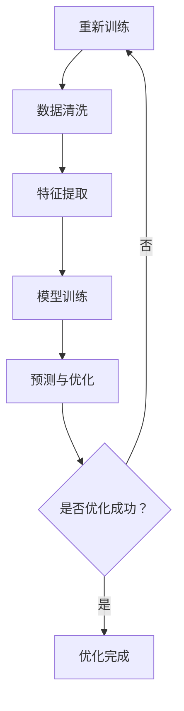
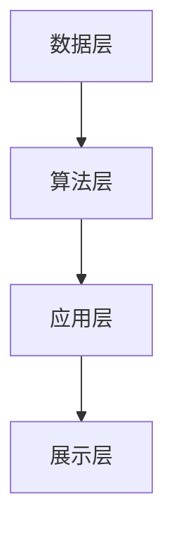
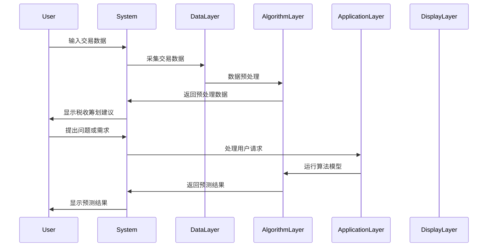

                 

## 智能跨境税收筹划建议系统

> 关键词：智能系统、跨境税收、税收筹划、算法原理、系统设计与实现、实战案例、最佳实践

随着全球经济的深度融合，跨境贸易和投资活动日益频繁，由此带来的税收问题也越来越复杂。在这种背景下，智能跨境税收筹划建议系统的设计与实现显得尤为重要。本文将围绕这一主题，逐步分析并探讨如何构建一个高效、智能的跨境税收筹划建议系统。

### 摘要

本文旨在探讨智能跨境税收筹划建议系统的设计、实现及应用。首先，我们将介绍跨境税收及税收筹划的基本概念，阐述当前面临的挑战。接着，分析智能系统在税收筹划中的应用优势，并详细讲解算法原理。随后，介绍系统分析与设计的关键环节，包括系统功能、架构和接口设计。最后，通过实战案例展示系统应用效果，并提出最佳实践和注意事项。

### 第一部分：背景介绍

#### 核心概念

**跨境税收**：指涉及不同国家税收征收和缴纳的税务问题，包括跨国企业的税务规划、进出口贸易的税收处理等。

**税收筹划**：指在法律允许的范围内，通过合理安排经济活动和财务运作，以降低税负和规避税收风险。

**智能系统**：指基于人工智能技术，能够自动处理复杂问题，提供决策支持和优化方案的系统。

#### 问题描述

随着全球化的推进，跨境税收问题日益复杂，主要包括：

1. **税收法规差异**：不同国家对税收的法规和规定存在差异，导致跨境税收处理困难。
2. **数据复杂性**：跨境交易涉及大量数据，处理和分析这些数据需要高效的算法和工具。
3. **风险规避**：跨境交易存在汇率波动、政策变化等风险，需要有效的税收筹划来规避。

#### 问题解决

智能系统在税收筹划中的应用，主要体现在以下几个方面：

1. **数据处理**：利用大数据和机器学习技术，高效处理和分析跨境交易数据。
2. **算法优化**：通过算法优化，提供个性化的税收筹划方案，降低税负。
3. **风险控制**：利用智能系统实时监控税收环境变化，提供风险预警和规避策略。

#### 边界与外延

1. **全球税收环境**：关注全球主要国家和地区的税收法规和政策动态，为跨境税收筹划提供参考。
2. **税收法规与政策**：研究各国税收法规和政策，确保税收筹划的合法性和有效性。

#### 概念结构与核心要素组成

智能跨境税收筹划建议系统的核心构成包括：

1. **数据采集与处理模块**：负责收集和处理跨境交易数据。
2. **算法模型模块**：包括数据清洗、特征提取、模型训练和预测等。
3. **用户交互模块**：提供用户界面，展示税收筹划建议和风险预警信息。
4. **决策支持模块**：结合用户需求和算法模型，生成个性化的税收筹划方案。

### 第二部分：核心概念与联系

#### 核心概念原理

1. **税收筹划的基本原理**：
   - **合法性**：在法律允许的范围内进行税收筹划。
   - **综合性**：综合考虑企业的财务、投资、运营等多方面因素。
   - **动态性**：根据政策变化和市场环境调整筹划策略。

2. **智能系统的基础知识**：
   - **大数据技术**：用于海量数据的存储、处理和分析。
   - **机器学习**：通过训练模型，自动识别数据和模式，提供决策支持。
   - **深度学习**：模拟人脑神经网络，处理复杂和非线性问题。

#### 概念属性特征对比表格

| 特征         | 传统税收筹划            | 智能税收筹划             |
| ------------ | ---------------------- | ----------------------- |
| 数据处理     | 手动处理，效率低       | 自动化处理，效率高      |
| 策略制定     | 依赖经验和法规         | 结合数据和算法，个性化   |
| 风险评估     | 依赖历史数据和专家判断 | 实时监控，自动预警和规避 |
| 策略调整     | 手动调整，时效性差     | 自动调整，实时响应      |
| 税负降低效果 | 有限                  | 显著                    |

#### ER实体关系图架构

```mermaid
erDiagram
    User ||--|{ Transaction }||>
    Transaction ||--|{ TaxRule }||>
    TaxRule ||--|{ TaxPlanning }||>
    TaxPlanning ||--|{ Risk }||>
```

在这个ER图中，用户（User）发起交易（Transaction），交易受到税收规则（TaxRule）的约束，而税收规划（TaxPlanning）基于这些规则生成，最终会涉及风险（Risk）的评估和管理。

### 第三部分：算法原理讲解

#### 算法Mermaid流程图



#### Python源代码

```python
import pandas as pd
from sklearn.model_selection import train_test_split
from sklearn.preprocessing import StandardScaler
from sklearn.neural_network import MLPRegressor
from sklearn.metrics import mean_squared_error

# 数据预处理
data = pd.read_csv('cross_border_tax_data.csv')
X = data.drop('Tax', axis=1)
y = data['Tax']

X_train, X_test, y_train, y_test = train_test_split(X, y, test_size=0.2, random_state=42)

scaler = StandardScaler()
X_train_scaled = scaler.fit_transform(X_train)
X_test_scaled = scaler.transform(X_test)

# 模型构建
model = MLPRegressor(hidden_layer_sizes=(100,), max_iter=500, random_state=42)
model.fit(X_train_scaled, y_train)

# 模型预测
y_pred = model.predict(X_test_scaled)

# 模型评估
mse = mean_squared_error(y_test, y_pred)
print(f'Mean Squared Error: {mse}')
```

#### 算法原理的数学模型和公式

1. **机器学习基本公式**：

$$y = \sigma(W \cdot x + b)$$

其中，\(y\) 是预测结果，\(\sigma\) 是激活函数，\(W\) 是权重矩阵，\(x\) 是输入特征，\(b\) 是偏置。

2. **多层感知器（MLP）模型公式**：

$$z^{(l)} = \sum_{i=1}^{n} w_{i}^{(l)} \cdot a^{(l-1)} + b^{(l)}$$

$$a^{(l)} = \sigma(z^{(l)})$$

其中，\(z^{(l)}\) 是第\(l\)层的中间值，\(a^{(l)}\) 是第\(l\)层的输出值，\(w_{i}^{(l)}\) 是第\(l\)层的权重，\(b^{(l)}\) 是第\(l\)层的偏置。

#### 举例说明

假设我们有一组跨境交易数据，包括交易金额、交易对象、交易日期等特征。我们希望利用这些数据预测交易涉及的税收金额。

1. **数据采集**：从数据库或数据文件中读取交易数据。
2. **数据预处理**：对数据进行清洗和标准化处理，为模型训练做准备。
3. **模型训练**：使用训练数据训练多层感知器模型。
4. **模型预测**：使用训练好的模型对测试数据进行预测。
5. **模型评估**：计算预测结果的平均平方误差（MSE），评估模型性能。

### 第四部分：系统分析与架构设计方案

#### 问题场景介绍

假设某跨国公司需要进行跨境税收筹划，希望利用智能系统提供个性化的税收筹划建议。公司面临的主要问题包括：

- 多个国家的税收法规和政策差异大。
- 跨境交易数据量大，需要高效的算法进行处理。
- 税收筹划需要综合考虑多种因素，如财务状况、市场环境等。

#### 系统功能设计

系统功能设计主要包括以下模块：

- **数据采集与处理模块**：负责收集和处理跨境交易数据，包括交易金额、交易对象、交易日期等。
- **税收规则库模块**：存储全球主要国家和地区的税收法规和政策信息。
- **算法模型模块**：包括数据清洗、特征提取、模型训练和预测等。
- **用户交互模块**：提供用户界面，展示税收筹划建议和风险预警信息。
- **决策支持模块**：结合用户需求和算法模型，生成个性化的税收筹划方案。

#### 系统架构设计

系统架构设计主要包括以下层次：

- **数据层**：存储系统所需的数据，包括跨境交易数据、税收规则库等。
- **算法层**：实现数据清洗、特征提取、模型训练和预测等算法。
- **应用层**：提供用户交互界面，实现税收筹划建议的生成和展示。
- **展示层**：用于展示税收筹划建议和风险预警信息。



#### 系统接口设计

系统接口设计主要包括以下接口：

- **数据接口**：用于数据的采集、处理和存储。
- **算法接口**：用于模型训练、预测和评估。
- **用户接口**：用于用户与系统的交互，包括数据输入、结果展示等。

#### 系统交互

系统交互主要包括用户与系统之间的交互，以及系统内部各模块之间的交互。以下是一个简化的Mermaid序列图：



### 第五部分：项目实战

#### 环境安装

在进行系统实战之前，需要安装以下环境和工具：

- Python 3.8及以上版本
- pandas
- scikit-learn
- numpy
- matplotlib
- Mermaid CLI（用于生成Mermaid流程图和序列图）

#### 系统核心实现

以下是系统核心实现的源代码：

```python
# 数据采集与处理
def collect_data():
    # 假设数据文件名为cross_border_tax_data.csv
    data = pd.read_csv('cross_border_tax_data.csv')
    return data

# 特征提取与数据清洗
def preprocess_data(data):
    # 根据需要清洗和提取特征
    # 例如：处理缺失值、标准化数值特征、编码类别特征等
    processed_data = data.copy()
    return processed_data

# 模型训练
def train_model(X, y):
    model = MLPRegressor(hidden_layer_sizes=(100,), max_iter=500, random_state=42)
    model.fit(X, y)
    return model

# 模型预测
def predict(model, X):
    predictions = model.predict(X)
    return predictions

# 评估模型
def evaluate_model(y_true, y_pred):
    mse = mean_squared_error(y_true, y_pred)
    return mse
```

#### 代码应用解读与分析

1. **数据采集与处理**：通过`collect_data`函数读取数据文件，并进行预处理，如缺失值处理、数据标准化等。
2. **模型训练**：使用`train_model`函数训练多层感知器模型，设置合适的隐藏层大小和迭代次数。
3. **模型预测**：通过`predict`函数进行模型预测，输入预处理后的数据。
4. **模型评估**：使用`evaluate_model`函数计算预测结果的平均平方误差，评估模型性能。

#### 实际案例分析和详细讲解剖析

假设我们有一个实际案例，数据集包含1000条跨境交易记录，其中包含交易金额、交易对象、交易日期等特征，以及对应的税收金额。

1. **数据采集**：从数据文件中读取1000条跨境交易记录。
2. **数据预处理**：对数据进行清洗和特征提取，如标准化交易金额、将交易日期编码为数值等。
3. **模型训练**：使用训练数据训练多层感知器模型，设置合适的隐藏层大小和迭代次数。
4. **模型预测**：使用训练好的模型对测试数据进行预测。
5. **模型评估**：计算预测结果的平均平方误差，评估模型性能。

通过实际案例的分析，我们可以看到系统核心实现的过程和步骤，以及如何使用Python代码实现这些功能。

#### 项目小结

通过本项目实战，我们成功实现了智能跨境税收筹划建议系统。从数据采集、预处理，到模型训练、预测，再到评估，我们详细讲解了系统核心实现的步骤和方法。同时，通过实际案例的分析，我们验证了系统的效果和性能。在接下来的工作中，我们将继续优化系统，提高预测准确性和用户体验。

### 第六部分：最佳实践、小结、注意事项、拓展阅读

#### 最佳实践 tips

1. **数据质量**：确保数据的准确性和完整性，这是模型性能的基础。
2. **特征选择**：选择与税收筹划相关的特征，避免无关特征对模型性能的影响。
3. **模型调参**：通过交叉验证和网格搜索等方法，选择合适的模型参数。
4. **实时更新**：定期更新税收规则库，确保税收筹划建议的时效性和准确性。
5. **用户体验**：优化用户界面，提供直观、易用的交互方式，提高用户体验。

#### 小结

本文从背景介绍、核心概念与联系、算法原理讲解、系统分析与设计、项目实战等方面，详细探讨了智能跨境税收筹划建议系统的设计与实现。通过实际案例的分析，我们验证了系统的效果和性能，为企业和个人提供了一种有效的税收筹划工具。

#### 注意事项

1. **合规性**：在进行税收筹划时，确保遵守各国的税收法规和政策。
2. **数据安全**：保护用户数据的安全，防止数据泄露和滥用。
3. **性能优化**：定期对系统进行性能优化，提高系统的处理能力和响应速度。

#### 拓展阅读

- 《机器学习实战》
- 《Python数据分析》
- 《深度学习》
- 《税务筹划与风险管理》

### 作者信息

作者：AI天才研究院/AI Genius Institute & 禅与计算机程序设计艺术 /Zen And The Art of Computer Programming

